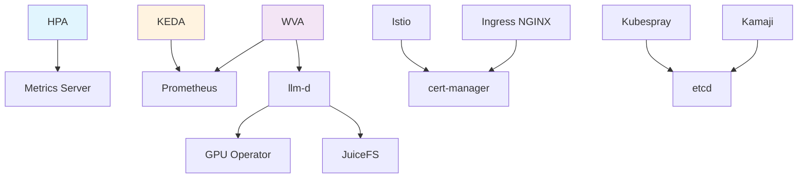

# 技术标签体系

本文件定义了跨分类的技术标签,用于多维度检索和关联。

---

## 按架构层分类

### control-plane (控制平面)
etcd, Kamaji, Metrics Server

### data-plane (数据平面)
Cilium, Istio, Spegel

### workload (工作负载)
HPA, KEDA, WVA, llm-d

---

## 按学习难度分类

### beginner (入门)
HPA, Metrics Server, Ingress NGINX, Registry

### intermediate (进阶)
KEDA, Prometheus, Grafana, cert-manager, Harbor

### advanced (高级)
WVA, Cilium, Istio, Ceph, Kamaji, vCluster

---

## 按云环境分类

### cloud-native (云原生)
KEDA, Harbor, JuiceFS, Prometheus

### on-premise (私有部署)
Kubespray, Ceph, GPFS, MetalLB

### hybrid (混合云)
vCluster, Spegel, VictoriaMetrics

---

## 按使用场景分类

### cost-optimization (成本优化)
KEDA (Scale to Zero), WVA (成本驱动), Spegel (P2P)

### high-availability (高可用)
etcd, Ceph, MetalLB, Harbor

### performance (性能优化)
Cilium (eBPF), VictoriaMetrics, GPFS, GPU Operator

### ai-ml (AI/ML)
llm-d, WVA, JuiceFS, GPU Operator, NFD

### security (安全)
cert-manager, Harbor (镜像扫描), Istio (mTLS)

---

## 技术依赖关系图



---

## 使用标签检索

在每个技术文档的 frontmatter 中添加标签:

```yaml
---
tech: hpa
category: autoscaling
layers:
  - workload
difficulty: beginner
cloud: cloud-native
scenarios:
  - cost-optimization
dependencies:
  - metrics-server
---
```
