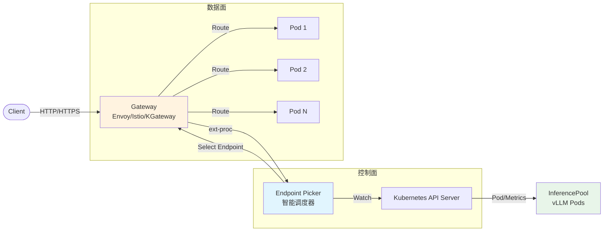
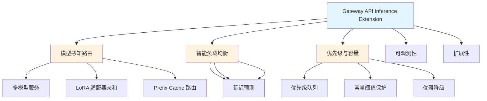
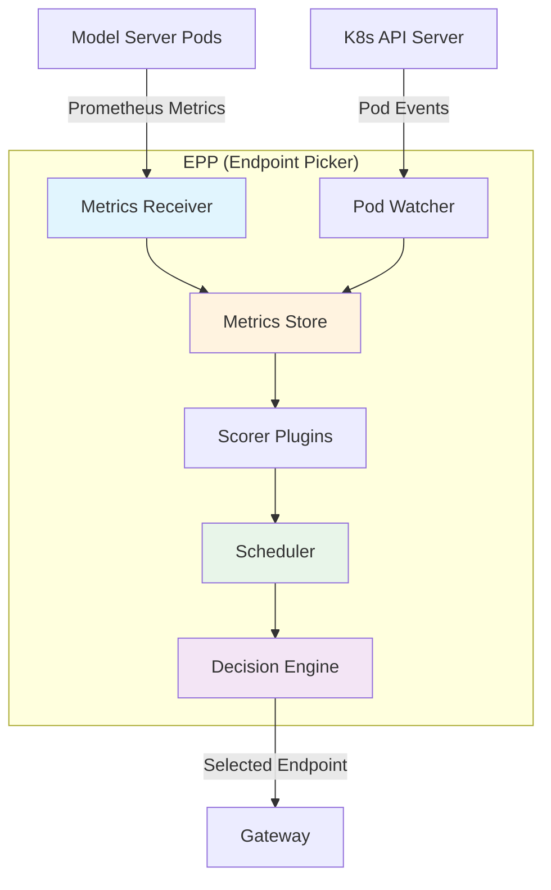
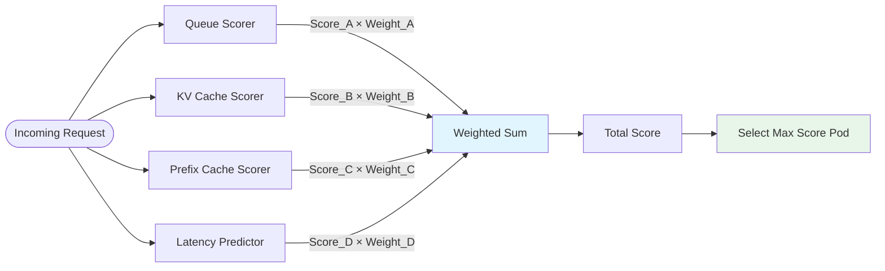
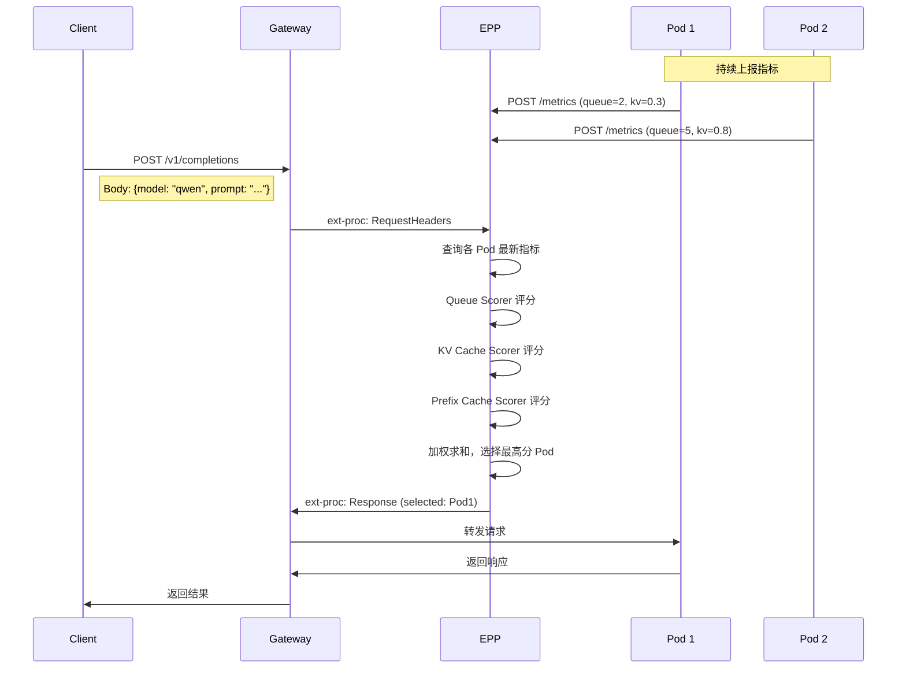
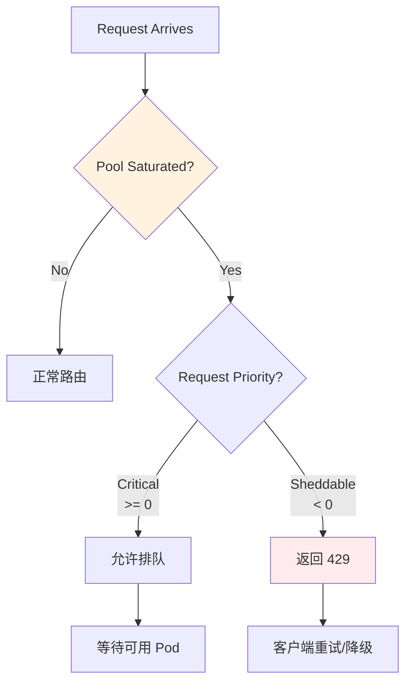
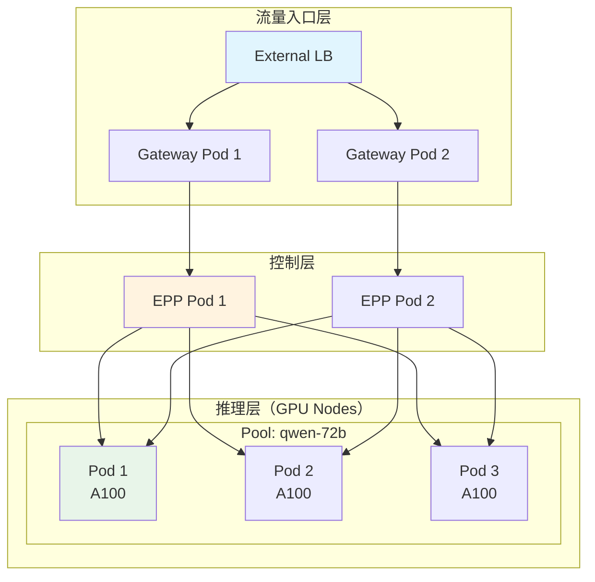
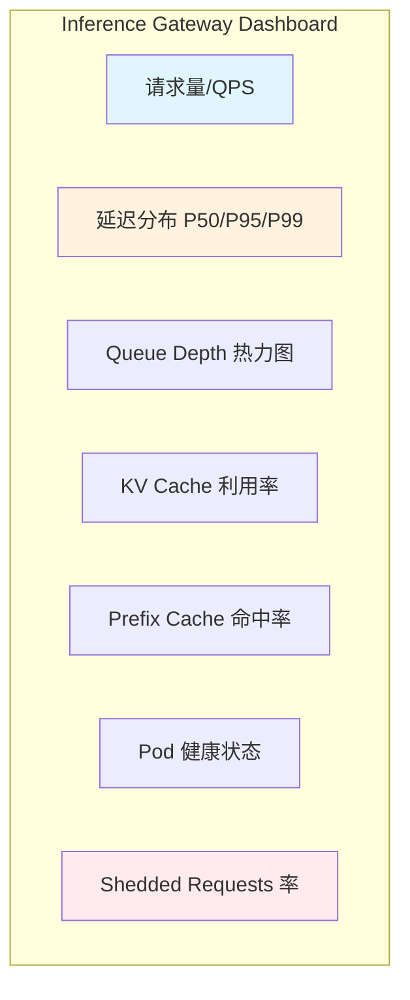
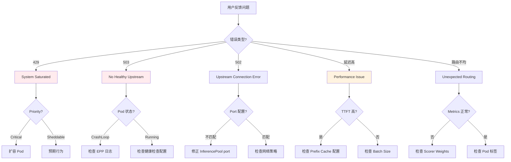
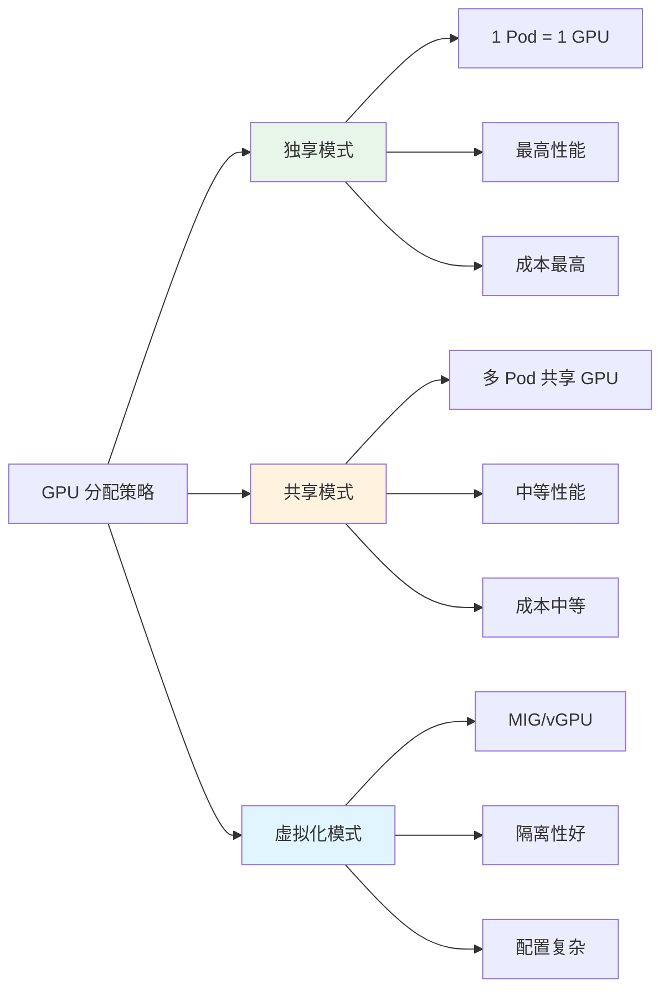

# Gateway API Inference Extension 深度解析

> **一句话总结**：Inference Gateway 就像米其林餐厅的资深领班，根据厨房实时状态（队列、缓存、适配器）智能分配订单，而不是随机安排座位。

---

## 🌀 螺旋 1：概念层（Why/What）

### 本层目标
建立认知锚点，理解为什么 LLM 推理需要专门的负载均衡，以及 Gateway API Inference Extension 的核心定位。

---

### 1.1 问题本质：LLM 推理 vs 传统 Web 服务

#### 传统 Web 服务的特征

```
请求 → 处理 → 响应
 ├─ 处理时间稳定（通常 < 100ms）
 ├─ 状态无关（Stateless）
 └─ 资源消耗均匀
```

传统负载均衡（Round-Robin、Least Connections）工作得很好，因为：
- 每个请求的 CPU/内存消耗大致相同
- 响应时间可预测
- 无状态意味着任意 Pod 都能处理任意请求

#### LLM 推理的特征

```
请求（Prompt）→ 预填充（Prefill）→ 解码（Decode）→ 响应
     ├─ 输入长度差异巨大（10 tokens vs 10000 tokens）
     ├─ 输出长度不确定（100 tokens vs 4000 tokens）
     ├─ 显存消耗与序列长度正相关
     ├─ Prefix Cache 可复用前缀，极大加速
     └─ KV Cache 占满后需要逐出或拒绝请求
```

**关键差异**：

| 维度 | 传统 Web | LLM 推理 |
|------|---------|---------|
| **请求大小** | 固定（KB 级） | 高度可变（prompt 1K-100K tokens） |
| **响应时间** | 稳定（P99/P50 接近） | 长尾严重（P99 可能是 P50 的 10 倍） |
| **资源消耗** | 均匀 | 与输入/输出长度强相关 |
| **状态影响** | 无状态 | Prefix/KV Cache 命中与否差异巨大 |
| **排队模型** | 简单 FIFO | 优先级、抢占、Adapter 亲和性 |

#### 中国本土场景：双 11 AI 客服

**场景描述**：
- 某电商平台的 AI 客服系统使用自托管 LLM（Qwen-72B）
- 双 11 期间流量激增 50 倍
- 请求类型混合：
  - **紧急**：订单问题（需秒级响应）
  - **普通**：商品咨询（可容忍 5s 延迟）
  - **批处理**：历史订单总结（可容忍 30s）

**传统 Round-Robin 的问题**：
```
时间线 ─────────────────────────────────────────▶

Pod-1: [大单★]        [大单★]        [大单★]
Pod-2: [小单] [小单] [小单] [小单] [小单] [小单]
Pod-3: [中单]  [中单]  [中单]  [中单]

结果：
- Pod-1 满载，后续请求排队 10s+
- Pod-2/3 空闲，但新请求仍按轮询发往 Pod-1
- 紧急订单被普通订单阻塞
- GPU 利用率：名义上 100%，实际上大量时间花在排队
```

**需要的智能调度**：
```
时间线 ─────────────────────────────────────────▶

Pod-1（Queue=5）: [大单] 
Pod-2（Queue=0）: [紧急单★] [小单] [小单] [小单] [中单]
Pod-3（Queue=2）: [中单] [大单]

决策：
- 紧急单 → Pod-2（最短队列）
- 大单 → Pod-3（KV Cache 有空间）
- 小单 → Pod-2（负载最轻）
- 批处理任务 → 延迟容忍度高，可等低峰期

结果：P99 延迟降低 60%，GPU 利用率提升 40%
```

---

### 1.2 架构全景：从 Gateway 到 Model Server



#### 核心组件职责

| 组件 | 类比角色 | 核心职责 |
|------|---------|---------|
| **Gateway** | 餐厅前台 | TLS 终止、认证、限流、路由规则匹配 |
| **EPP (Endpoint Picker)** | 资深领班 (Maître d') | 根据实时指标选择最优 Pod |
| **InferencePool** | 餐厅座位区 | 定义哪些 Pod 属于同一服务池 |
| **InferenceObjective** | VIP 卡/优先级标签 | 定义请求的优先级和目标 SLA |
| **BBR (Body Based Router)** | 预订系统 | 从请求体解析 model 名称，实现多模型路由 |
| **Model Server (vLLM)** | 厨房工位 | 实际执行推理，暴露 Queue/KV/Prefix 指标 |

---

### 1.3 关键概念详解

#### InferencePool：推理服务的"座位区"

```yaml
apiVersion: inference.networking.k8s.io/v1
kind: InferencePool
metadata:
  name: qwen-72b-pool
spec:
  selector:
    matchLabels:
      model: qwen-72b-instruct
  port: 8000
  extensionRef:
    name: epp-qwen-72b
```

**类比**：InferencePool 就像餐厅里的"大包厢区"——指定了哪些桌子（Pods）属于这个区域，以及区域的专属服务员（EPP）。

**与传统 Service 的区别**：
- Service：单纯的 L4 负载均衡，随机分配
- InferencePool：L7 感知，支持自定义调度逻辑

#### InferenceObjective：请求的"身份标签"

```yaml
apiVersion: inference.networking.x-k8s.io/v1alpha1
kind: InferenceObjective
metadata:
  name: critical-chat
spec:
  priority: 100  # 越高越优先
  poolRef:
    name: qwen-72b-pool
```

**类比**：就像餐厅的 VIP 客人 vs 普通客人
- VIP（Priority=100）：必须立即入座，可抢占普通客人资源
- 普通（Priority=0）：正常排队
- 批处理（Priority=-50）：可延迟，系统满载时第一个被丢弃

**双 11 场景映射**：
| 业务场景 | Priority | 说明 |
|---------|---------|------|
| 订单异常处理 | 100 | Critical，秒级响应 |
| 实时客服对话 | 50 | 高优先级，容忍 2s |
| 商品咨询 | 0 | 默认优先级 |
| 历史订单分析 | -50 | Sheddable，可延迟/丢弃 |

---

### 1.4 核心能力一览



---

### ✅ 螺旋 1 验收标准

**你能做到**：
1. 一句话复述 Inference Gateway 的核心价值
2. 解释为什么传统 Round-Robin 不适合 LLM 推理
3. 描述从 Gateway → EPP → InferencePool → Pod 的请求路径
4. 为双 11 AI 客服场景设计合理的 Priority 分级

**类比强化**：
> Inference Gateway 就像米其林三星餐厅的**资深领班（Maître d'）**：
> - 不像新手迎宾员随机安排座位
> - 他深谙每个厨房工位的实时状态
> - 知道哪个厨师手头单多、哪个刚做过同样的菜、哪个工位还有备餐空间
> - VIP 客人来了立即安排，普通客人可稍等，外卖大单可延后

---

### 🔗 下一步指引

**进入螺旋 2 之前**：先通过"认知降压"环节，将算法抽象为常识逻辑。

**衔接问题**：EPP 到底是如何"看"到每个 Pod 的状态的？它用什么算法决定把请求发给哪个 Pod？

---

## 💨 认知降压（Decompression）

### 为什么需要降压？

即将进入的螺旋 2 会涉及以下概念：
- Queue Depth、KV Cache Utilization、Prefix Cache 命中率
- 多维度评分算法、权重计算
- Saturation Detection、优雅降级

**听起来很复杂？** 其实底层逻辑非常简单——就像餐厅领班看仪表盘做决策。

---

### 2.1 降压：EPP 就是"看仪表盘打分"

想象你是米其林餐厅的领班，面前有一个**实时仪表盘**：

```
┌────────────────────────────────────────────────────────────┐
│                    厨房工位状态仪表盘                        │
├──────────┬──────────┬──────────┬──────────┬────────────────┤
│   工位   │  待做单   │  备餐台   │  刚做过   │    综合评分     │
├──────────┼──────────┼──────────┼──────────┼────────────────┤
│ Pod-1    │   ████   │  ██████  │  宫保鸡丁 │     65 分      │
│          │  (4单)   │  (80%满) │           │                │
├──────────┼──────────┼──────────┼──────────┼────────────────┤
│ Pod-2    │   █      │   ██     │  红烧肉   │     92 分      │
│          │  (1单)   │  (20%满) │   ✓匹配   │      ★         │
├──────────┼──────────┼──────────┼──────────┼────────────────┤
│ Pod-3    │   ██     │   ███    │  糖醋排骨 │     78 分      │
│          │  (2单)   │  (40%满) │           │                │
└──────────┴──────────┴──────────┴──────────┴────────────────┘

新订单：红烧肉
决策：发给 Pod-2（刚做过、备餐台空、待做单少）
```

**对应关系**：

| 餐厅仪表盘 | EPP 指标 | 含义 |
|-----------|---------|------|
| 待做单数量 | **Queue Depth** | Pod 的等待队列长度 |
| 备餐台占用 | **KV Cache Utilization** | GPU 显存占用率 |
| 刚做过什么菜 | **Prefix Cache** | 最近处理的 prompt 前缀 |
| 厨师专长 | **LoRA Adapter** | 特定模型适配器 |

**评分逻辑**（常识版）：
```
总分 = (100 - 待做单数×10) × 权重
     + (100 - 备餐台占用%) × 权重
     + (是否刚做过同样菜 ? 100 : 0) × 权重
```

---

### 2.2 降压：三个核心指标的本质

#### 指标 1：Queue Depth（队列深度）

**常识理解**：厨师手上有多少单在等

```
Queue Depth = 0: 厨师 idle，立即可以接新单 ★★★
Queue Depth = 2: 厨师忙碌，但还能接       ★★☆
Queue Depth = 5: 厨师爆满，新单要排长队   ★☆☆
```

**技术含义**：
- vLLM 的 `num_requests_waiting` 指标
- 反映 Pod 的并发处理能力余量
- 阈值默认：超过 5 认为饱和

#### 指标 2：KV Cache Utilization（KV 缓存利用率）

**常识理解**：备餐台还有多少空间

```
KV Cache 利用率 = 30%: 空间充裕，大单也能接 ★★★
KV Cache 利用率 = 70%: 空间紧张，只能接小单 ★★☆
KV Cache 利用率 = 90%: 几乎满了，新单可能被拒 ★☆☆
```

**技术含义**：
- LLM 的 Attention 机制需要存储 Key/Value 向量
- 占用显存，与序列长度成正比
- 阈值默认：超过 80% 认为高风险

#### 指标 3：Prefix Cache（前缀缓存）

**常识理解**：同样的菜刚做过，直接复用

```
Prompt: "请用鲁迅的风格写一篇文章，主题是..."

Pod-1: 缓存命中 "请用鲁迅的风格写" → 只需续写后面，速度提升 3 倍 ★★★
Pod-2: 缓存未命中 → 需要完整重新计算，速度正常
Pod-3: 缓存未命中 → 需要完整重新计算，速度正常

决策：发给 Pod-1
```

**技术含义**：
- vLLM 的自动 Prefix Caching 功能
- 相同前缀的 prompt 可以复用计算结果
- 对 RAG、系统提示词等场景效果极佳

---

### 2.3 降压：Saturation Detection 就是"挂免战牌"

**常识理解**：当餐厅爆满时，领班在门口挂"免战牌"

```
餐厅状态检查：
├─ 平均待做单 > 5？ 是 → 进入饱和状态
├─ 备餐台占用 > 80%？ 是 → 进入饱和状态
└─ 任一条件满足 → 挂免战牌

免战牌效果：
├─ VIP 客人：仍可进入（优先接待）
├─ 普通客人：排队等待
└─ 外卖大单：直接拒绝（返回 429）
```

**技术含义**：
- EPP 的 SaturationDetector 组件
- 多维度阈值判断系统整体负载
- 饱和时根据 Priority 决定是否丢弃请求

---

### 2.4 降压：多模型路由就是"按菜系分配"

**常识理解**：川菜厨师不做粤菜，除非他学过

```
请求：" model: qwen-coder " → 发给有 coder 适配器的 Pod
请求：" model: llama3-70b " → 发给加载了 llama3 的 Pod
请求：" model: qwen-72b-lora-medicine " → 发给有 medicine LoRA 的 Pod
```

**技术含义**：
- BBR (Body Based Router) 解析请求体中的 model 字段
- 根据 Pod 加载的模型/适配器进行匹配
- 支持基础模型 + LoRA 适配器的灵活组合

---

### ✅ 认知降压验收标准

**你能做到**：
1. 用餐厅领班的视角解释 Queue Depth、KV Cache、Prefix Cache
2. 理解为什么"同样的菜刚做过"能加速（Prefix Cache）
3. 理解"免战牌"机制（Saturation Detection）
4. 不需要记忆公式，只需要理解"打分逻辑"

**降压完成标志**：
> 💡 "原来 EPP 就是给每个 Pod 打分，选分数最高的那个。评分标准就是'谁最闲、谁空间多、谁刚做过类似的'。"

---

### 🔗 下一步指引

现在你已经理解了**常识逻辑**，准备好进入**技术细节**了吗？

螺旋 2 将深入讲解：
- EPP 如何采集这些指标
- 具体的评分算法和权重配置
- Request Flow 的完整时序
- Prefix Cache 的匹配机制

---

## 🌀 螺旋 2：机制层（How-原理）

### 本层目标
揭示底层机制，理解 EPP 如何采集指标、计算评分、做出路由决策。

---

### 2.1 架构深度：EPP 内部组件



#### 组件职责

| 组件 | 职责 | 类比 |
|------|------|------|
| **Metrics Receiver** | 接收模型服务器的 Prometheus 指标 | 工位传呼机 |
| **Pod Watcher** | Watch K8s API，跟踪 Pod 生命周期 | 人员考勤系统 |
| **Metrics Store** | 缓存最新指标，提供查询 | 实时仪表盘 |
| **Scorer Plugins** | 多维度评分（Queue/KV/Prefix）| 打分评委 |
| **Scheduler** | 综合评分，选择最优 Pod | 领班决策 |
| **Decision Engine** | 生成路由指令返回给 Gateway | 派号系统 |

---

### 2.2 指标采集机制

#### 指标来源：vLLM 的 `/metrics` 端点

```yaml
# vLLM 暴露的关键指标
vllm:num_requests_running          # 正在处理的请求数
vllm:num_requests_waiting          # 队列中等待的请求数（Queue Depth）
vllm:gpu_cache_usage_perc          # GPU KV Cache 利用率
vllm:cpu_cache_usage_perc          # CPU KV Cache 利用率
vllm:prompt_tokens                 # 输入 token 数
vllm:generation_tokens             # 输出 token 数
```

**采集频率**：默认每 50ms 拉取一次（可配置）

#### EPP 的指标聚合

```python
# 伪代码：指标聚合逻辑
class MetricsAggregator:
    def __init__(self):
        self.pod_metrics = {}  # Pod 名称 -> 最新指标
        self.metrics_ttl = 200  # 200ms 超时视为过期
    
    def update_metrics(self, pod_name, metrics):
        """更新指定 Pod 的指标"""
        self.pod_metrics[pod_name] = {
            'timestamp': time.now(),
            'queue_depth': metrics['num_requests_waiting'],
            'kv_cache_util': metrics['gpu_cache_usage_perc'],
            'running_reqs': metrics['num_requests_running'],
        }
    
    def get_valid_pods(self):
        """返回指标未过期的 Pod 列表"""
        valid = []
        for pod, data in self.pod_metrics.items():
            if time.now() - data['timestamp'] < self.metrics_ttl:
                valid.append(pod)
        return valid
```

---

### 2.3 多维度评分算法

#### 核心概念：Plugin-Based Scoring

EPP 采用**插件化评分机制**，每个 Scorer 负责一个维度，最终加权求和。



#### Scorer 1：Queue Scorer

**逻辑**：Queue 越短越好

```python
def queue_score(queue_depth, max_queue=10):
    """
    queue_depth: 当前队列深度
    max_queue: 最大可接受队列深度（默认 10）
    """
    if queue_depth >= max_queue:
        return 0  # 满载，不得分
    
    # 线性递减：queue=0 得 100 分，queue=9 得 10 分
    return 100 * (1 - queue_depth / max_queue)
```

**示例**：
| Queue Depth | Score | 说明 |
|-------------|-------|------|
| 0 | 100 | 空闲，最优 |
| 2 | 80 | 轻度负载 |
| 5 | 50 | 中度负载 |
| 9 | 10 | 接近饱和 |
| 10 | 0 | 满载，不可用 |

#### Scorer 2：KV Cache Utilization Scorer

**逻辑**：KV Cache 利用率越低越好

```python
def kv_cache_score(utilization, threshold=0.8):
    """
    utilization: KV Cache 利用率 (0.0 - 1.0)
    threshold: 饱和阈值（默认 0.8）
    """
    if utilization >= threshold:
        return 0  # 超过阈值，不得分
    
    # 线性递减：util=0% 得 100 分，util=79% 得 21 分
    return 100 * (1 - utilization / threshold)
```

**示例**：
| Utilization | Score | 说明 |
|-------------|-------|------|
| 0% | 100 | 显存充裕 |
| 40% | 50 | 中等占用 |
| 79% | 1 | 接近阈值 |
| 80% | 0 | 饱和 |

#### Scorer 3：Prefix Cache Scorer

**逻辑**：Prefix 匹配度越高越好

```python
def prefix_cache_score(request_prompt, pod_cache):
    """
    request_prompt: 请求中的 prompt
    pod_cache: Pod 的 Prefix Cache 内容（LRU 缓存最近 N 个 prefix）
    """
    max_score = 0
    
    for cached_prefix in pod_cache:
        # 计算最长公共前缀长度
        match_len = longest_common_prefix(request_prompt, cached_prefix)
        
        # 匹配长度占总长度的比例
        match_ratio = match_len / len(request_prompt)
        
        # 匹配越多得分越高
        score = 100 * match_ratio
        max_score = max(max_score, score)
    
    return max_score
```

**示例**：
```
请求 Prompt: "请用鲁迅的风格写一篇文章，主题是人工智能"

Pod-1 Cache: "请用鲁迅的风格写" → 匹配 10 tokens → Score = 40
Pod-2 Cache: "请用李白的风格写" → 匹配 0 tokens → Score = 0
Pod-3 Cache: "请用鲁迅的风格写一篇文章" → 匹配 13 tokens → Score = 52

决策：选择 Pod-3（匹配度最高）
```

**Prefix Cache 匹配粒度**：
- 基于 **block** 匹配，而非字符
- 默认 block_size = 16 tokens
- 匹配 1 个 block = 16 tokens 的复用

#### 综合评分计算

```python
def calculate_total_score(pod, request, weights):
    """
    综合评分 = Σ (单项评分 × 权重)
    """
    scores = {
        'queue': queue_score(pod.queue_depth),
        'kv_cache': kv_cache_score(pod.kv_cache_util),
        'prefix': prefix_cache_score(request.prompt, pod.cache),
    }
    
    total = 0
    for metric, score in scores.items():
        total += score * weights[metric]
    
    return total

# 默认权重配置
DEFAULT_WEIGHTS = {
    'queue': 2.0,
    'kv_cache': 2.0,
    'prefix': 3.0,
}

# 示例计算
Pod-A: queue=100, kv=80, prefix=40
       → 100×2 + 80×2 + 40×3 = 200 + 160 + 120 = 480

Pod-B: queue=60, kv=90, prefix=100
       → 60×2 + 90×2 + 100×3 = 120 + 180 + 300 = 600

# Pod-B 得分更高，优先选择
```

---

### 2.4 Request Flow 时序详解



**时序说明**：
1. **指标上报（异步）**：Pod 持续向 EPP 推送指标
2. **请求到达**：Client 发送请求到 Gateway
3. **Extension Processing**：Gateway 通过 Envoy ext-proc 调用 EPP
4. **路由决策**：EPP 查询指标、计算评分、选择 Pod
5. **请求转发**：Gateway 将请求路由到选中的 Pod

**关键延迟**：
- EPP 决策延迟：通常 < 1ms
- 指标新鲜度：默认 200ms TTL

---

### 2.5 Saturation Detection 机制

#### 饱和判定逻辑

```python
class SaturationDetector:
    def __init__(self):
        self.queue_threshold = 5        # 队列深度阈值
        self.kv_threshold = 0.8         # KV Cache 阈值
        self.metrics_staleness = 200    # 指标过期时间（ms）
    
    def is_saturated(self, pod_metrics):
        """判定单个 Pod 是否饱和"""
        # 检查指标新鲜度
        if self.is_stale(pod_metrics):
            return True  # 过期视为饱和（保守策略）
        
        # 检查队列深度
        if pod_metrics.queue_depth >= self.queue_threshold:
            return True
        
        # 检查 KV Cache
        if pod_metrics.kv_cache_util >= self.kv_threshold:
            return True
        
        return False
    
    def is_pool_saturated(self, pool_metrics):
        """判定整个 Pool 是否饱和"""
        # 如果所有 Pod 都饱和，则 Pool 饱和
        all_saturated = all(
            self.is_saturated(pod) for pod in pool_metrics
        )
        return all_saturated
```

#### 饱和时的请求处理



**阈值配置示例**：
```yaml
# EPP 配置文件
saturationDetector:
  queueDepthThreshold: 5          # 队列深度阈值
  kvCacheUtilThreshold: 0.8       # KV Cache 阈值
  metricsStalenessThreshold: 200  # 指标过期时间（ms）
```

---

### 2.6 Prefix Cache 深度解析

#### Block-Based Matching

Prefix Cache 不是字符级匹配，而是 **Block 级匹配**（默认 16 tokens/block）。

```
Prompt: "请用鲁迅的风格写一篇文章"
Tokenized: [请, 用, 鲁, 迅, 的, 风, 格, 写, 一, 篇, 文, 章]

Block 划分（block_size=4）:
Block 0: [请, 用, 鲁, 迅]
Block 1: [的, 风, 格, 写]
Block 2: [一, 篇, 文, 章]

匹配策略：
- 匹配 1 个 block = 复用 4 tokens 的 KV Cache
- 匹配 3 个 blocks = 复用 12 tokens，只需计算剩余部分
```

#### LRU 缓存策略

每个 Pod 维护一个 LRU (Least Recently Used) Cache：

```python
class PrefixCache:
    def __init__(self, capacity=31250):  # 默认容量
        self.capacity = capacity  # 最多缓存多少 blocks
        self.cache = OrderedDict()  # LRU 结构
    
    def get(self, prefix_hash):
        if prefix_hash in self.cache:
            # 移动到队尾（最近使用）
            self.cache.move_to_end(prefix_hash)
            return self.cache[prefix_hash]
        return None
    
    def put(self, prefix_hash, blocks):
        if prefix_hash in self.cache:
            self.cache.move_to_end(prefix_hash)
        else:
            if len(self.cache) >= self.capacity:
                # 淘汰最久未使用的
                self.cache.popitem(last=False)
            self.cache[prefix_hash] = blocks
```

**配置参数**：
```yaml
prefix-cache-scorer:
  parameters:
    blockSize: 16                  # 每个 block 的 token 数
    maxPrefixBlocksToMatch: 512    # 最大匹配 block 数
    lruCapacityPerServer: 31250    # 每个 Pod 的 LRU 容量
```

---

### ✅ 螺旋 2 验收标准

**你能做到**：
1. 解释 EPP 的 4 个核心组件及其职责
2. 手动计算一个请求的 Queue/KV/Prefix 评分
3. 画出 Request Flow 的完整时序图
4. 配置 Saturation Detection 的阈值
5. 解释 Block-Based Prefix Matching 的原理

**核心公式记忆**：
```
总评分 = QueueScore × 2 + KVCacheScore × 2 + PrefixScore × 3
饱和判定 = queue ≥ 5 OR kv_cache ≥ 0.8 OR metrics_stale
```

---

### 🔗 下一步指引

理论已掌握，如何落地？

螺旋 3 将带你进入实战：
- 完整的部署 YAML 和 Helm Chart 配置
- 生产环境调优参数
- 典型故障的排障路径
- SLI/SLO 设计和成本权衡

---

## 🌀 螺旋 3：实战层（How-运维）

### 本层目标
具备实操能力，能独立部署、调优、监控，并能处理典型故障。

---

### 3.1 生产部署实战

#### 部署架构（双 11 场景示例）



#### 完整部署清单

**Step 1：部署模型服务器（vLLM）**

```yaml
# vllm-deployment.yaml
apiVersion: apps/v1
kind: Deployment
metadata:
  name: vllm-qwen-72b
  labels:
    app: vllm-qwen-72b
    model: qwen-72b-instruct
spec:
  replicas: 3
  selector:
    matchLabels:
      app: vllm-qwen-72b
  template:
    metadata:
      labels:
        app: vllm-qwen-72b
        model: qwen-72b-instruct
    spec:
      nodeSelector:
        nvidia.com/gpu.product: NVIDIA-A100
      containers:
      - name: vllm
        image: vllm/vllm-openai:v0.5.0
        args:
        - --model
        - Qwen/Qwen2-72B-Instruct
        - --tensor-parallel-size
        - "4"  # 4 GPU per Pod
        - --enable-prefix-caching
        - --max-model-len
        - "32768"
        ports:
        - containerPort: 8000
          name: http
        resources:
          limits:
            nvidia.com/gpu: "4"
            memory: "256Gi"
            cpu: "32"
        env:
        - name: VLLM_LOGGING_LEVEL
          value: "INFO"
```

**Step 2：部署 InferencePool**

```yaml
# inferencepool.yaml
apiVersion: inference.networking.k8s.io/v1
kind: InferencePool
metadata:
  name: qwen-72b-pool
spec:
  selector:
    matchLabels:
      model: qwen-72b-instruct
  port: 8000
  extensionRef:
    name: epp-qwen-72b
```

**Step 3：部署 EPP（Helm）**

```bash
# 添加 Helm 仓库
helm repo add inference-extension \
  oci://registry.k8s.io/gateway-api-inference-extension/charts

# 部署 InferencePool + EPP
helm install qwen-72b-pool \
  --set inferencePool.modelServers.matchLabels.app=vllm-qwen-72b \
  --set inferencePool.modelServerType=vllm \
  --set provider.name=istio \
  inference-extension/inferencepool
```

**Step 4：配置 Gateway 和 HTTPRoute**

```yaml
# gateway.yaml
apiVersion: gateway.networking.k8s.io/v1
kind: Gateway
metadata:
  name: inference-gateway
spec:
  gatewayClassName: istio
  listeners:
  - name: http
    protocol: HTTP
    port: 80
---
# httproute.yaml
apiVersion: gateway.networking.k8s.io/v1
kind: HTTPRoute
metadata:
  name: qwen-72b-route
spec:
  parentRefs:
  - name: inference-gateway
  rules:
  - matches:
    - path:
        type: PathPrefix
        value: /v1/chat/completions
    backendRefs:
    - group: inference.networking.x-k8s.io
      kind: InferencePool
      name: qwen-72b-pool
```

**Step 5：配置 InferenceObjective（优先级）**

```yaml
# critical-objective.yaml
apiVersion: inference.networking.x-k8s.io/v1alpha1
kind: InferenceObjective
metadata:
  name: critical-chat
spec:
  priority: 100
  poolRef:
    name: qwen-72b-pool
---
# batch-objective.yaml
apiVersion: inference.networking.x-k8s.io/v1alpha1
kind: InferenceObjective
metadata:
  name: batch-processing
spec:
  priority: -50  # 可丢弃
  poolRef:
    name: qwen-72b-pool
```

---

### 3.2 生产环境调优参数

#### 关键配置项

```yaml
# epp-config.yaml
apiVersion: inference.networking.x-k8s.io/v1alpha1
kind: EndpointPickerConfig
plugins:
- type: queue-scorer
- type: kv-cache-utilization-scorer
- type: prefix-cache-scorer
  parameters:
    blockSize: 16
    maxPrefixBlocksToMatch: 512
    lruCapacityPerServer: 31250
- type: predicted-latency-scorer
  parameters:
    samplingMean: 1000.0

schedulingProfiles:
- name: default
  plugins:
  - pluginRef: queue-scorer
    weight: 2
  - pluginRef: kv-cache-utilization-scorer
    weight: 2
  - pluginRef: prefix-cache-scorer
    weight: 3

saturationDetector:
  queueDepthThreshold: 5
  kvCacheUtilThreshold: 0.8
  metricsStalenessThreshold: 200
```

#### 调优建议

| 场景 | Queue Threshold | KV Threshold | Prefix Weight | 说明 |
|------|----------------|--------------|---------------|------|
| **延迟敏感** | 3 | 0.7 | 4 | 更激进地避开了负载高的 Pod |
| **吞吐优先** | 8 | 0.9 | 2 | 容忍更高负载，追求并发 |
| **Prefix Cache 密集** | 5 | 0.8 | 5 | RAG 场景，最大化缓存命中 |
| **GPU 受限** | 5 | 0.6 | 3 | 严格限制 KV Cache 使用 |

---

### 3.3 可观测性体系

#### 关键指标（SLI）

```yaml
# Prometheus ServiceMonitor
apiVersion: monitoring.coreos.com/v1
kind: ServiceMonitor
metadata:
  name: inference-gateway-metrics
spec:
  selector:
    matchLabels:
      app: inference-gateway
  endpoints:
  - port: metrics
    interval: 15s
```

**核心监控指标**：

| 指标名 | 类型 | 说明 | 告警阈值 |
|--------|------|------|---------|
| `inference_request_duration_seconds` | Histogram | 请求延迟 | P99 > 5s |
| `inference_requests_total` | Counter | 请求数 | - |
| `inference_queue_depth` | Gauge | 队列深度 | > 8 |
| `inference_kv_cache_utilization` | Gauge | KV Cache 使用率 | > 0.85 |
| `inference_prefix_cache_hit_ratio` | Gauge | Prefix Cache 命中率 | < 0.3 |
| `inference_shedded_requests_total` | Counter | 丢弃请求数 | > 100/min |

#### SLO 设计建议

```yaml
# SLO 定义
apiVersion: n/a
kind: SLODefinition
spec:
  objectives:
  - name: latency
    displayName: "TTFT P99 Latency"
    target: 0.95  # 95% 的请求 TTFT < 500ms
    threshold: 500ms
    
  - name: availability
    displayName: "Service Availability"
    target: 0.999  # 99.9% 可用性
    
  - name: throughput
    displayName: "QPS"
    target: 1000  # 单 Pool 1000 QPS
    
  - name: gpu_utilization
    displayName: "GPU Utilization"
    target: 0.80  # 目标 80% 利用率
    min: 0.60     # 低于 60% 说明资源浪费
    max: 0.95     # 高于 95% 可能过载
```

#### Dashboard 关键面板



---

### 3.4 典型故障与排障

#### 故障决策树



#### 故障 1：429 Too Many Requests

**症状**：客户端收到 `429 system saturated, sheddable request dropped`

**根因分析**：
```bash
# 检查 Pod 队列深度
kubectl top pods -l model=qwen-72b-instruct

# 检查 EPP 日志
kubectl logs -l app=epp-qwen-72b | grep "saturated"
```

**解决方案**：
1. **临时**：增加 Pod 副本数
   ```bash
   kubectl scale deployment vllm-qwen-72b --replicas=5
   ```
2. **长期**：优化 Threshold 配置
   ```yaml
   saturationDetector:
     queueDepthThreshold: 8  # 放宽阈值
   ```
3. **架构**：接入自动扩缩容（HPA/KEDA）

#### 故障 2：503 No Healthy Upstream

**症状**：Gateway 返回 `503 no healthy upstream`

**排查步骤**：
```bash
# 1. 检查 Pod 状态
kubectl get pods -l model=qwen-72b-instruct

# 2. 检查 Pod 日志
kubectl logs <pod-name>

# 3. 检查 InferencePool 状态
kubectl get inferencepool qwen-72b-pool -o yaml

# 4. 验证端口配置
kubectl get pod <pod-name> -o jsonpath='{.spec.containers[0].ports}'
```

**常见原因**：
- Pod 未 ready（ readiness probe 失败）
- InferencePool 配置的 port 与 Pod 实际端口不匹配
- Pod 标签与 InferencePool selector 不匹配

#### 故障 3：TTFT 延迟抖动

**症状**：Time To First Token 偶尔飙升到数秒

**根因分析**：
```bash
# 检查 Prefix Cache 命中率
kubectl logs -l app=epp-qwen-72b | grep "prefix_cache"

# 对比配置
kubectl get configmap epp-config -o yaml
```

**常见原因**：
- Prefix Cache 参数与 vLLM 实际配置不匹配
- `blockSize`、`lruCapacityPerServer` 配置错误

**解决方案**：
```yaml
# 确保 EPP 配置与 vLLM 实际参数一致
prefix-cache-scorer:
  parameters:
    blockSize: 16  # 必须与 vLLM 的 block_size 一致
    lruCapacityPerServer: 31250  # 根据 GPU 显存调整
```

#### 故障 4：EPP CrashLoop

**症状**：EPP Pod 反复重启

**排查命令**：
```bash
# 查看错误日志
kubectl logs -l app=epp-qwen-72b --previous

# 常见错误 1: RBAC 权限不足
# "failed to list InferencePool: ... is forbidden"
kubectl auth can-i list inferencepool \
  --as=system:serviceaccount:default:epp-sa

# 常见错误 2: Pool 不存在
# "Pool is not initialized, skipping refreshing metrics"
kubectl get inferencepool
```

**解决方案**：
```yaml
# RBAC 配置
apiVersion: rbac.authorization.k8s.io/v1
kind: ClusterRole
metadata:
  name: epp-role
rules:
- apiGroups: ["inference.networking.x-k8s.io"]
  resources: ["inferencepools", "inferenceobjectives"]
  verbs: ["get", "list", "watch"]
- apiGroups: [""]
  resources: ["pods"]
  verbs: ["get", "list", "watch"]
```

---

### 3.5 成本与性能权衡

#### GPU 共享策略



**建议**：
- **生产环境**：独享模式（避免 noisy neighbor）
- **开发/测试**：共享模式（提高利用率）
- **多租户**：MIG（A100/H100）

#### 成本优化 checklist

| 策略 | 效果 | 复杂度 | 适用场景 |
|------|------|--------|---------|
| **Prefix Cache 优化** | 延迟降低 30-50% | 低 | RAG、系统提示词固定 |
| **Batch Size 调优** | 吞吐提升 20-40% | 中 | 高并发场景 |
| **Spot Instance** | 成本降低 60-70% | 高 | 批处理任务 |
| **自动扩缩容** | 节省空闲成本 | 中 | 流量波动大 |
| **LoRA 热加载** | 多模型共享 GPU | 高 | 多适配器场景 |

#### Spot Instance + Priority 组合策略

```yaml
# 批处理任务使用 Spot Instance
apiVersion: apps/v1
kind: Deployment
metadata:
  name: vllm-batch
spec:
  template:
    spec:
      nodeSelector:
        node-type: spot
      tolerations:
      - key: "spot"
        operator: "Equal"
        value: "true"
        effect: "NoSchedule"
---
# 批处理任务设置低 Priority
apiVersion: inference.networking.x-k8s.io/v1alpha1
kind: InferenceObjective
metadata:
  name: batch-spot
spec:
  priority: -100  # 最低优先级，可随意丢弃
```

---

### 3.6 反模式警示

#### ❌ 反模式 1：所有请求设为 Critical Priority

**问题**：
```yaml
# 错误配置
spec:
  priority: 100  # 所有请求都是 Critical
```

**后果**：
- 系统无法降级，饱和时所有请求排队
- 真正的 Critical 请求被普通请求阻塞

**正确做法**：
```yaml
# 合理分级
- Critical（priority=100）: 订单异常、支付问题
- High（priority=50）: 实时客服
- Normal（priority=0）: 商品咨询
- Batch（priority=-50）: 数据分析
```

#### ❌ 反模式 2：忽略 Metrics Staleness

**问题**：
```yaml
saturationDetector:
  metricsStalenessThreshold: 5000  # 5 秒，太长！
```

**后果**：
- 基于 5 秒前的旧数据做决策
- Pod 已经满载，EPP 仍认为空闲

**正确做法**：
```yaml
saturationDetector:
  metricsStalenessThreshold: 200  # 200ms，与采集频率匹配
```

#### ❌ 反模式 3：盲目追求 Prefix Cache 命中率

**问题**：
```yaml
prefix-cache-scorer:
  weight: 10  # 权重过高
```

**后果**：
- 所有请求都路由到有缓存的 Pod
- 该 Pod 队列堆积，其他 Pod 空闲
- 整体延迟反而上升

**正确做法**：
```yaml
prefix-cache-scorer:
  weight: 3  # 平衡权重
queue-scorer:
  weight: 2  # 同时考虑队列深度
```

---

### ✅ 螺旋 3 验收标准

**你能做到**：
1. 独立完成从 vLLM → InferencePool → Gateway 的全链路部署
2. 根据业务场景调整 Scorer Weights 和 Thresholds
3. 配置 Prometheus 监控和 Grafana Dashboard
4. 独立排查 429/503/延迟抖动等典型故障
5. 设计合理的 SLO 和成本优化策略
6. 避免常见的反模式配置

---

### 🔗 总结与进阶

**核心要点回顾**：
1. **概念层**：Inference Gateway = 智能领班，根据实时指标做路由决策
2. **机制层**：多维度评分算法（Queue + KV + Prefix），Saturation Detection 保护
3. **实战层**：部署、调优、监控、排障、成本权衡

**进阶方向**：
- **自定义 Scorer**：实现业务特定的评分逻辑
- **多模型路由**：结合 BBR 实现 model-aware routing
- **自动扩缩容**：基于自定义指标（Queue Depth）的 HPA
- **多集群联邦**：跨集群 InferencePool 路由

---

## 📚 参考资料

1. [Gateway API Inference Extension 官方文档](https://gateway-api-inference-extension.sigs.k8s.io/)
2. [Kubernetes SIG-Network](https://github.com/kubernetes/community/tree/master/sig-network)
3. [WG-Serving](https://github.com/kubernetes/community/tree/master/wg-serving)
4. [vLLM Prefix Caching](https://docs.vllm.ai/en/stable/design/v1/prefix_caching.html)
5. [Envoy External Processing](https://www.envoyproxy.io/docs/envoy/latest/configuration/http/http_filters/ext_proc_filter)

---

## ✅ 质量检查清单

- [x] 三层螺旋结构完整
- [x] 使用单一类比贯穿全篇（米其林餐厅领位系统）
- [x] 案例来自中国本土场景（双 11、AI 大促）
- [x] 所有架构图使用 Mermaid
- [x] 包含 SLI/SLO 建议
- [x] 包含排障示例
- [x] 包含反模式
- [x] 有具体的权衡分析
