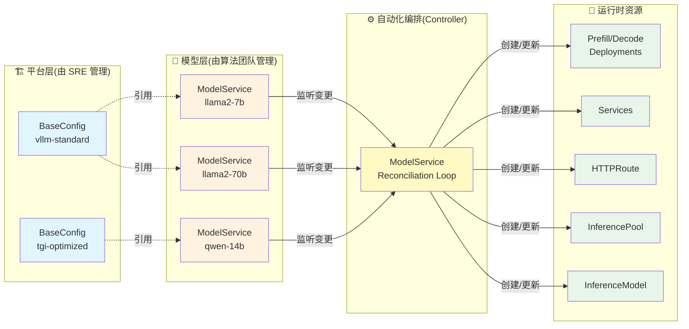
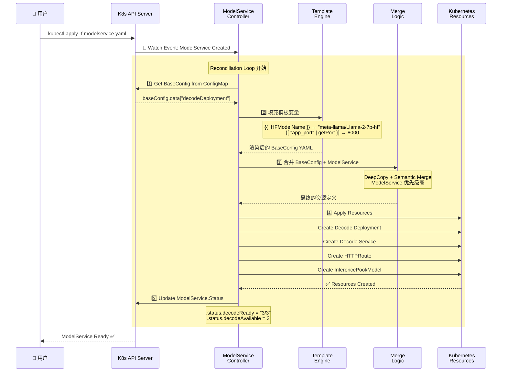
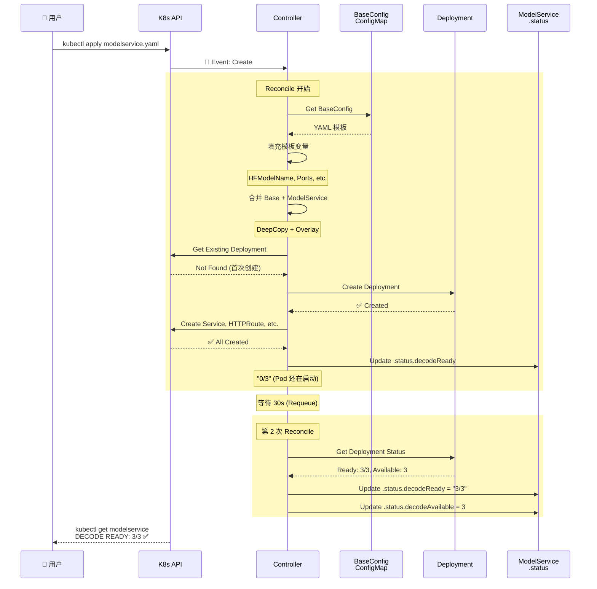
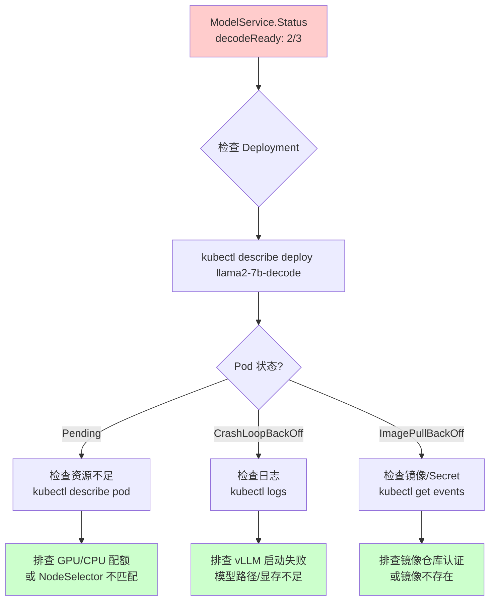

# llm-d-modelservice: Kubernetes Operator for LLM Inference Service Management

> **项目定位**: 声明式 LLM 推理服务编排引擎  
> **核心价值**: 通过 CRD 封装 Prefill/Decode 分离架构、模型加载、路由配置的完整推理栈  
> **适用场景**: AI 平台的多租户推理服务、企业级模型服务化、异构算力优化

---

## 🌀 螺旋 1: 概念层 - 为什么需要 Operator 管理推理服务?

### 本层目标
建立对 llm-d-modelservice 核心价值的直观认知,理解 **BaseConfig + ModelService** 的配置分层哲学,以及 Prefill/Decode 分离架构的本质。

---

### 全景类比: AI 外卖平台的自动化中央厨房 🍱

想象你在运营一个覆盖全国的 AI 外卖平台(类比 AI 推理服务平台),需要管理数百家门店(类比数百个模型推理实例)。

#### 没有 llm-d-modelservice 的世界

每上线一个新模型,运维需要手动编写一套 Kubernetes YAML:
```yaml
# 手动创建 Deployment
apiVersion: apps/v1
kind: Deployment
metadata:
  name: llama2-7b-decode
spec:
  replicas: 3
  template:
    spec:
      containers:
      - name: vllm
        image: vllm/vllm-openai:v0.3.0
        args: ["--model", "meta-llama/Llama-2-7b-hf"]
        env:
        - name: HF_TOKEN
          valueFrom:
            secretKeyRef: ...
        volumeMounts:
        - name: model-cache
          mountPath: /cache
      volumes:
      - name: model-cache
        emptyDir:
          sizeLimit: 50Gi

---
# 手动创建 Service
apiVersion: v1
kind: Service
metadata:
  name: llama2-7b-svc
spec:
  selector:
    app: llama2-7b-decode
  ports:
  - port: 8000

---
# 手动创建 HTTPRoute
apiVersion: gateway.networking.k8s.io/v1
kind: HTTPRoute
metadata:
  name: llama2-7b-route
spec:
  parentRefs:
  - name: inference-gateway
  rules:
  - matches:
    - path:
        value: /v1/completions
    filters:
    - type: RequestHeaderModifier
      requestHeaderModifier:
        set:
        - name: X-Model
          value: meta-llama/Llama-2-7b-hf

---
# 还需要创建 RBAC、InferencePool、InferenceModel...
```

**痛点清单**:
1. ❌ 每个模型需要 300+ 行 YAML,重复配置 80%
2. ❌ Prefill/Decode 分离需要手动配置两套 Deployment + 路由策略
3. ❌ 模型路径、Token、挂载点散落在各处,改一处要找 5 个地方
4. ❌ 平台升级(如统一镜像版本)需要逐个修改每个模型的配置
5. ❌ 新人上手需要理解 K8s、vLLM、Gateway API 三层概念

**外卖平台类比**: 每开一家新店,都要从头设计菜单、装修风格、采购流程、配送路线——即使 90% 的店都是"麻辣烫"。

---

#### llm-d-modelservice 的解决方案

**核心思想**: **平台标准菜谱(BaseConfig) + 单店定制(ModelService)**

```yaml
# 🍽️ Step 1: 平台定义标准菜谱(BaseConfig - 由平台团队维护)
apiVersion: v1
kind: ConfigMap
metadata:
  name: vllm-standard-config  # 类比: 连锁品牌的"标准操作手册"
data:
  decodeDeployment: |
    apiVersion: apps/v1
    kind: Deployment
    spec:
      template:
        spec:
          containers:
          - name: vllm
            image: ghcr.io/llm-d/llm-d:0.0.8
            command: ["vllm", "serve"]
            args:
            - "--port"
            - "{{ "app_port" | getPort }}"  # 模板变量,运行时填充
            env:
            - name: HF_HOME
              value: /cache
            resources:
              limits:
                nvidia.com/gpu: 1

---
# 🏪 Step 2: 模型团队只需声明"我要开店"(ModelService)
apiVersion: llm-d.ai/v1alpha1
kind: ModelService
metadata:
  name: llama2-7b
spec:
  baseConfigMapRef:
    name: vllm-standard-config  # 引用标准菜谱
  
  routing:
    modelName: meta-llama/Llama-2-7b-hf  # 客户看到的菜单名
    ports:
    - name: app_port
      port: 8000
  
  modelArtifacts:
    uri: hf://meta-llama/Llama-2-7b-hf  # 食材采购地址
  
  decode:
    replicas: 3  # 开 3 个窗口
```

**神奇之处**: Controller 自动创建以下资源(就像中央厨房的自动化系统):
- ✅ Decode Deployment(带模板变量填充)
- ✅ Decode Service
- ✅ HTTPRoute(自动路由到正确的模型)
- ✅ InferencePool + InferenceModel(Gateway API 扩展)
- ✅ ServiceAccount + RoleBinding(RBAC 权限)
- ✅ ConfigMap(环境变量注入)

---

### 为什么需要 BaseConfig + ModelService 两层?

**外卖平台类比**:

| 层级 | 外卖平台 | llm-d-modelservice | 管理者 |
|------|---------|-------------------|--------|
| **平台层** | 连锁品牌标准(装修风格、统一采购、物流系统) | **BaseConfig**: 标准化容器镜像、资源限制、挂载策略 | 平台 SRE 团队 |
| **门店层** | 单店特色(菜单调整、优惠活动、营业时间) | **ModelService**: 模型路径、副本数、GPU 类型 | 模型开发团队 |

**真实场景**:
- 🔧 **平台升级**: vLLM 从 v0.3.0 → v0.4.0,只需修改 BaseConfig 的 `image` 字段,所有引用它的 ModelService 自动继承新版本
- 🎯 **个性化配置**: Llama2-70B 需要 8 张 A100,只需在 ModelService 覆盖 `resources.limits`
- 🔒 **安全隔离**: 不同租户使用不同 BaseConfig,互不影响

---

### Prefill/Decode 分离: 前厨与出餐窗口的分工

**传统单体推理的问题(外卖平台类比)**:

假设一个厨师既要备菜(Prefill - 处理 prompt)、又要炒菜出餐(Decode - 生成 token):
- 当来了一个大单(长 prompt),厨师忙着切菜 10 分钟,导致后面 20 个小单(短 prompt)全部堆积
- GPU 利用率不均: 备菜需要大量内存(KV Cache),出餐需要高算力(生成速度)

**llm-d-modelservice 的解决方案**:

```yaml
spec:
  # 前厨 - 专门负责备菜(Prefill)
  prefill:
    replicas: 2  # 2 个备菜师傅
    parallelism:
      tensor: 4  # 每个师傅有 4 把刀(TP=4)
    acceleratorTypes:
      labelKey: nvidia.com/gpu.product
      labelValues: ["A100-80GB"]  # 备菜需要大内存
  
  # 出餐窗口 - 专门负责炒菜出餐(Decode)
  decode:
    replicas: 5  # 5 个炒菜灶台
    parallelism:
      tensor: 1  # 单灶快速出餐(TP=1)
    acceleratorTypes:
      labelValues: ["A10G"]  # 出餐只需要算力,不需要大显存
```

**技术收益**:
- 💰 **成本优化**: Prefill 用贵的 A100(内存大),Decode 用便宜的 A10G(算力够)
- 📈 **吞吐提升**: 长短请求分流,避免队头阻塞(Head-of-Line Blocking)
- 🔧 **独立扩缩容**: Prefill 根据队列长度扩容,Decode 根据 token 生成速度扩容

---

### 架构全景图



---

### ✅ 螺旋 1 验收标准

完成本层学习后,你应该能够:

1. **一句话复述核心价值**:  
   "llm-d-modelservice 通过 BaseConfig + ModelService 两层抽象,让模型团队只需声明'我要什么',平台自动编排完整的推理栈。"

2. **回答设计问题**:
   - 为什么不直接写 Deployment YAML? → 重复劳动 + 平台升级困难
   - BaseConfig 和 ModelService 谁优先级高? → ModelService 覆盖 BaseConfig
   - Prefill/Decode 分离适合什么场景? → 长短请求混合 + 成本敏感

3. **类比迁移能力**:  
   能用"外卖平台"类比向非技术人员解释为什么需要这套系统。

---

### 🔗 下一步指引

- **想了解底层机制?** → 进入 [螺旋 2: 控制器协调循环与模板系统](#-螺旋-2-机制层---自动化编排的流水线)
- **想快速上手配置?** → 直接跳转 [螺旋 3: 生产级推理服务配置](#-螺旋-3-实战层---生产级推理服务配置)
- **想深入 CRD 设计?** → 阅读 [CRD 设计哲学](./components/crd-design.md)

---

## 🌀 螺旋 2: 机制层 - 自动化编排的流水线

### 本层目标
揭示 llm-d-modelservice 的核心机制:Reconciliation Loop 如何工作、Template 系统如何填充变量、BaseConfig 和 ModelService 如何合并。

---

### 💨 认知降压: 从外卖平台理解 Reconciliation Loop

**外卖平台的自动化中央厨房**:

想象一个智能中控系统(类比 Controller),它每隔几秒就会巡检一次:

1. **📋 读取订单(Watch ModelService)**:  
   "客户下单了 llama2-7b,要求 3 个窗口(replicas=3),使用 A100 GPU"

2. **📖 查阅标准手册(Get BaseConfig)**:  
   "标准手册规定: vLLM 容器用 0.0.8 版本,每个窗口配 16 核 CPU"

3. **🔀 合并菜单(Merge Logic)**:  
   - 客户订单优先级高: `replicas=3` 覆盖手册的默认值 `replicas=1`
   - 手册填补空缺: 客户没说 CPU,用手册的 `cpu: 16`

4. **🍳 下发指令(Create/Update Resources)**:  
   自动创建 3 个厨房(Deployment)、3 个窗口(Service)、路由牌(HTTPRoute)

5. **🔍 持续巡检(Requeue)**:  
   每次巡检对比"客户要求 vs 实际状态",发现不一致就自动修正

**核心逻辑**: **声明式(What) vs 命令式(How)**
- ❌ 命令式: "创建 3 个 Pod → 创建 Service → 绑定路由" (步骤写死)
- ✅ 声明式: "我要 3 个副本" (Controller 自己算怎么做)

---

### Controller Reconciliation Loop 核心流程



---

### 核心机制 1: Template 系统

**模板变量(TemplateVars)的生命周期**:

```go
// 1️⃣ Controller 从 ModelService 提取上下文
type TemplateVars struct {
    ModelServiceName      string  // "llama2-7b"
    ModelName             string  // "meta-llama/Llama-2-7b-hf"
    HFModelName           string  // "meta-llama/Llama-2-7b-hf" (从 uri: hf://... 提取)
    MountedModelPath      string  // "/model-cache" 或 "/model-cache/path/to/model"
    DecodeDeploymentName  string  // "llama2-7b-decode"
    // ... 还有 15+ 个变量
}

// 2️⃣ 模板函数(FuncMap)提供辅助查询
funcMap := template.FuncMap{
    "getPort": func(name string) int32 {
        // 从 ModelService.Spec.Routing.Ports 查找
        for _, p := range msvc.Spec.Routing.Ports {
            if p.Name == name { return p.Port }
        }
        return -1
    },
}
```

**BaseConfig 中的模板使用**:

```yaml
data:
  decodeDeployment: |
    spec:
      template:
        spec:
          containers:
          - name: vllm
            args:
            - "{{ .HFModelName }}"  # 运行时替换为 "meta-llama/Llama-2-7b-hf"
            - "--port"
            - "{{ "app_port" | getPort }}"  # 调用函数查找端口号 → 8000
            env:
            - name: HF_HOME
              value: "{{ .MountedModelPath }}"  # → "/model-cache"
```

**关键设计**:
- ✅ **平台层抽象**: BaseConfig 不hardcode 模型名,用变量占位
- ✅ **类型安全**: 函数返回错误时 Controller 拒绝 Reconcile
- ✅ **调试友好**: Template 渲染失败会在 Event 中暴露错误

---

### 核心机制 2: Merge 策略(语义合并)

**外卖平台类比**: 客户在标准菜单上勾选"加辣"、"不要香菜",最终菜品 = 标准配方 + 客户定制。

**技术实现**: **DeepCopy + Semantic Overlay**

```yaml
# 📖 BaseConfig 定义(标准配方)
decodeDeployment: |
  spec:
    replicas: 1  # 默认 1 个副本
    template:
      spec:
        containers:
        - name: vllm
          image: ghcr.io/llm-d/llm-d:0.0.8
          resources:
            limits:
              nvidia.com/gpu: 1
              cpu: "16"
              memory: 32Gi

---
# 🏪 ModelService 覆盖(客户定制)
spec:
  decode:
    replicas: 3  # 覆盖: 3 个副本
    containers:
    - name: vllm
      resources:
        limits:
          nvidia.com/gpu: 2  # 覆盖: 2 张 GPU
          # ⚠️ 注意: 没有指定 cpu/memory,会保留 BaseConfig 的值
```

**合并结果(Controller 自动计算)**:

```yaml
# ✅ 最终 Deployment
spec:
  replicas: 3  # ← ModelService 覆盖
  template:
    spec:
      containers:
      - name: vllm
        image: ghcr.io/llm-d/llm-d:0.0.8  # ← BaseConfig 保留
        resources:
          limits:
            nvidia.com/gpu: 2  # ← ModelService 覆盖
            cpu: "16"  # ← BaseConfig 保留(因为 ModelService 没指定)
            memory: 32Gi  # ← BaseConfig 保留
```

**Merge Transformers 代码逻辑**:

```go
func mergeContainers(baseContainers, msvcContainers []ContainerSpec) []ContainerSpec {
    result := deepCopy(baseContainers)  // 1️⃣ 深拷贝 BaseConfig
    
    for _, msvcC := range msvcContainers {
        found := false
        for i, baseC := range result {
            if baseC.Name == msvcC.Name {  // 2️⃣ 按 Name 匹配容器
                // 3️⃣ 语义合并: 只覆盖 ModelService 指定的字段
                if msvcC.Image != nil {
                    result[i].Image = msvcC.Image
                }
                if len(msvcC.Args) > 0 {
                    result[i].Args = msvcC.Args
                }
                mergeResources(&result[i].Resources, msvcC.Resources)
                found = true
                break
            }
        }
        if !found {
            result = append(result, msvcC)  // 4️⃣ 新容器直接追加
        }
    }
    return result
}
```

**关键设计**:
- ✅ **按字段覆盖**: 不是"全有或全无",而是精细到每个字段
- ✅ **列表合并智能**: Containers 按 `name` 匹配,Env 按 `name` 去重
- ✅ **空值语义**: ModelService 的空值 = "不覆盖",而非"设为空"

---

### 核心机制 3: 资源依赖图与 OwnerReference

**外卖平台类比**: 订单是"老板",厨房、窗口、配送员都是"员工"。订单取消时,所有相关资源自动回收。

```mermaid
graph TD
    MS["ModelService<br/>llama2-7b<br/>👑 Owner"]
    
    MS -->|OwnerReference| DECODE_DEPLOY["Decode Deployment"]
    MS -->|OwnerReference| DECODE_SVC["Decode Service"]
    MS -->|OwnerReference| PREFILL_DEPLOY["Prefill Deployment"]
    MS -->|OwnerReference| PREFILL_SVC["Prefill Service"]
    MS -->|OwnerReference| EPP_DEPLOY["EPP Deployment"]
    MS -->|OwnerReference| EPP_SVC["EPP Service"]
    MS -->|OwnerReference| HTTPROUTE["HTTPRoute"]
    MS -->|OwnerReference| POOL["InferencePool"]
    MS -->|OwnerReference| MODEL["InferenceModel"]
    MS -->|OwnerReference| SA["ServiceAccount"]
    MS -->|OwnerReference| RB["RoleBinding"]
    
    style MS fill:#fff9c4,stroke:#f57f17,stroke-width:3px
    style DECODE_DEPLOY fill:#e8f5e9
    style DECODE_SVC fill:#e8f5e9
    style PREFILL_DEPLOY fill:#e8f5e9
    style PREFILL_SVC fill:#e8f5e9
    style EPP_DEPLOY fill:#e8f5e9
    style EPP_SVC fill:#e8f5e9
    style HTTPROUTE fill:#e1f5fe
    style POOL fill:#e1f5fe
    style MODEL fill:#e1f5fe
    style SA fill:#fce4ec
    style RB fill:#fce4ec
```



**技术实现**: Kubernetes OwnerReference

```go
// Controller 创建子资源时自动注入
deployment := &appsv1.Deployment{
    ObjectMeta: metav1.ObjectMeta{
        Name:      "llama2-7b-decode",
        Namespace: modelService.Namespace,
        OwnerReferences: []metav1.OwnerReference{
            *metav1.NewControllerRef(modelService, schema.GroupVersionKind{
                Group:   "llm-d.ai",
                Version: "v1alpha1",
                Kind:    "ModelService",
            }),
        },
    },
    // ...
}
```

**收益**:
- ✅ **级联删除**: `kubectl delete modelservice llama2-7b` 自动清理所有关联资源
- ✅ **所有权追踪**: `kubectl get deployment -o yaml` 可查看属于哪个 ModelService
- ✅ **Reconcile 边界**: Controller 只管理"自己创建的"资源,避免误操作用户手动创建的同名资源

---

### 核心机制 4: 模型加载路径适配

**三种食材采购路径(外卖平台类比)**:

| 采购方式 | 类比 | llm-d-modelservice | Volume 类型 |
|---------|------|-------------------|------------|
| **HuggingFace** | 从批发市场现场采购 | `uri: hf://meta-llama/Llama-2-7b-hf` | emptyDir + HF 下载 |
| **PVC** | 从自家冷库提货 | `uri: pvc://model-pvc/path/to/model` | PersistentVolumeClaim |
| **OCI** | 从供应商冷链车提货 | `uri: oci://ghcr.io/models/llama2:v1` | Image Volume (K8s 1.31+) |

**HuggingFace 路径的自动化流程**:

```yaml
spec:
  modelArtifacts:
    uri: hf://meta-llama/Llama-2-7b-hf
    authSecretName: hf-token-secret  # 可选,gated 模型需要
    size: 50Gi  # emptyDir 大小
```

**Controller 自动生成的资源**:

```yaml
# 1️⃣ 创建 emptyDir Volume
volumes:
- name: model-storage
  emptyDir:
    sizeLimit: 50Gi

# 2️⃣ 挂载到容器
containers:
- name: vllm
  volumeMounts:
  - name: model-storage
    mountPath: /model-cache  # ← 暴露为 {{ .MountedModelPath }}
  
  env:
  - name: HF_HOME
    value: /model-cache  # vLLM 自动从 HF 下载到这里
  - name: HF_TOKEN  # 如果指定了 authSecretName
    valueFrom:
      secretKeyRef:
        name: hf-token-secret
        key: HF_TOKEN
  
  args:
  - "{{ .HFModelName }}"  # → "meta-llama/Llama-2-7b-hf"
```

**PVC 路径的优化**:

```yaml
spec:
  modelArtifacts:
    uri: pvc://granite-pvc/models/granite-7b
```

**自动生成的 Volume**:

```yaml
volumes:
- name: model-storage
  persistentVolumeClaim:
    claimName: granite-pvc
    readOnly: true  # ✅ 只读挂载,防止误修改

containers:
- name: vllm
  volumeMounts:
  - name: model-storage
    mountPath: /model-cache
    readOnly: true
  
  args:
  - "{{ .MountedModelPath }}"  # → "/model-cache/models/granite-7b"
```

---

### 时序图: 完整 Reconcile 周期



---

### ✅ 螺旋 2 验收标准

完成本层学习后,你应该能够:

1. **画出 Reconciliation 流程图**:  
   Watch Event → Get BaseConfig → Fill Template → Merge → Apply Resources → Update Status

2. **解释模板变量填充**:  
   `{{ .HFModelName }}` 如何从 `uri: hf://...` 提取? `{{ "app_port" | getPort }}` 如何查找?

3. **理解合并优先级**:  
   ModelService 和 BaseConfig 同时定义 `replicas`,谁生效? (答: ModelService)

4. **推导资源生命周期**:  
   删除 ModelService 时,为什么 Deployment 也会被删除? (答: OwnerReference 级联删除)

---

### 🔗 下一步指引

- **想看实战配置?** → 进入 [螺旋 3: 生产级推理服务配置](#-螺旋-3-实战层---生产级推理服务配置)
- **深入 Controller 实现?** → 阅读 [控制器协调循环](./components/controller-reconciliation.md)
- **理解 Prefill/Decode 机制?** → 阅读 [Prefill/Decode 分离架构](./components/prefill-decode-arch.md)

---

## 🌀 螺旋 3: 实战层 - 生产级推理服务配置

### 本层目标
掌握从 Simple Model 到 Prefill/Decode 分离的渐进配置,理解 BaseConfig 预设设计、成本优化策略、故障排障方法。

---

### 场景 1: 快速上线 HuggingFace 模型(Simple Model)

**需求**: 10 分钟内上线 Llama2-7B,单 Pod 部署,下载自 HuggingFace。

**Step 1: 创建 BaseConfig(平台团队维护)**

```yaml
apiVersion: v1
kind: ConfigMap
metadata:
  name: simple-base-config
  namespace: llm-platform
immutable: true  # ⚠️ 生产环境建议设为 immutable,防止误修改
data:
  decodeDeployment: |
    apiVersion: apps/v1
    kind: Deployment
    spec:
      template:
        spec:
          containers:
          - name: vllm
            image: ghcr.io/llm-d/llm-d:0.0.8
            command: ["vllm", "serve"]
            args:
            - "--port"
            - "{{ "app_port" | getPort }}"
            env:
            - name: HF_HOME
              value: /cache
            volumeMounts:
            - name: model-cache
              mountPath: /cache
            resources:
              limits:
                nvidia.com/gpu: 1
              requests:
                cpu: "16"
                memory: 16Gi
                nvidia.com/gpu: 1
          volumes:
          - name: model-cache
            emptyDir:
              sizeLimit: 50Gi  # 确保足够存储模型
  
  decodeService: |
    apiVersion: v1
    kind: Service
    spec:
      clusterIP: None  # Headless Service,用于 StatefulSet 场景
      ports:
      - name: vllm
        port: {{ "app_port" | getPort }}
        protocol: TCP
```

**Step 2: 创建 ModelService(模型团队维护)**

```yaml
apiVersion: llm-d.ai/v1alpha1
kind: ModelService
metadata:
  name: llama2-7b
  namespace: ai-inference
spec:
  decoupleScaling: false  # Controller 管理副本数(不使用 HPA)
  
  baseConfigMapRef:
    name: simple-base-config
  
  routing:
    modelName: meta-llama/Llama-2-7b-hf  # OpenAI 客户端请求的 model 字段
    ports:
    - name: app_port
      port: 8000
  
  modelArtifacts:
    uri: hf://meta-llama/Llama-2-7b-hf  # HuggingFace 自动下载
  
  decode:
    replicas: 1
    containers:
    - name: vllm
      args:
      - "{{ .HFModelName }}"  # 渲染为 "meta-llama/Llama-2-7b-hf"
```

**Step 3: 验证部署**

```bash
# 1️⃣ 检查 ModelService 状态
kubectl get modelservice -n ai-inference
# NAME         DECOUPLE SCALING   PREFILL READY   DECODE READY   DECODE AVAIL   AGE
# llama2-7b    false              0/0             1/1            1              2m

# 2️⃣ 检查 Pod 日志(确认模型下载成功)
kubectl logs -n ai-inference $(kubectl get pod -n ai-inference -l app=llama2-7b-decode -o name) | grep "Loading"
# INFO:     Loading model meta-llama/Llama-2-7b-hf
# INFO:     Model loaded successfully

# 3️⃣ 测试推理(Port-Forward)
kubectl port-forward -n ai-inference svc/llama2-7b-decode-service 8000:8000

curl http://localhost:8000/v1/completions \
  -H "Content-Type: application/json" \
  -d '{
    "model": "meta-llama/Llama-2-7b-hf",
    "prompt": "San Francisco is a",
    "max_tokens": 20
  }'
```

**🎯 成本分析**:
- GPU: 1x A100 (80GB) = ~$3/小时
- 适用场景: 开发测试、低并发(<10 QPS)

---

### 场景 2: Prefill/Decode 分离架构(生产级)

**需求**: 吞吐量 >100 QPS,长短请求混合,成本优化。

**核心策略**:
- Prefill: 少量高配 GPU(A100-80GB),处理长 prompt
- Decode: 大量低配 GPU(A10G-24GB),快速生成 token

```yaml
apiVersion: llm-d.ai/v1alpha1
kind: ModelService
metadata:
  name: llama2-70b-prod
  namespace: ai-inference
spec:
  decoupleScaling: true  # ⚠️ 启用 HPA/Custom Autoscaler 管理副本数
  
  baseConfigMapRef:
    name: pd-base-config  # 引用 Prefill/Decode 专用配置
  
  routing:
    modelName: meta-llama/Llama-2-70b-hf
    ports:
    - name: prefill_port
      port: 9000
    - name: decode_port
      port: 9001
    - name: app_port
      port: 8000
  
  modelArtifacts:
    uri: pvc://llama2-70b-pvc/models/llama2-70b  # 从 PVC 加载,避免下载时间
  
  # 🔧 Prefill: 高内存 GPU,TP=8
  prefill:
    replicas: 2  # ⚠️ decoupleScaling=true 时此值被忽略,由 HPA 管理
    parallelism:
      tensor: 8  # Tensor Parallelism,单个实例跨 8 张卡
    acceleratorTypes:
      labelKey: nvidia.com/gpu.product
      labelValues: ["A100-80GB"]  # 只调度到 A100
    containers:
    - name: vllm
      args:
      - "{{ .MountedModelPath }}"
      - "--port"
      - "{{ "prefill_port" | getPort }}"
      - "--tensor-parallel-size"
      - "8"
      - "--role"
      - "prefill"
      resources:
        limits:
          nvidia.com/gpu: 8  # 8 张 A100
  
  # 🚀 Decode: 高吞吐 GPU,TP=1
  decode:
    replicas: 10  # ⚠️ 同样被 HPA 管理
    parallelism:
      tensor: 1  # 单卡即可
    acceleratorTypes:
      labelKey: nvidia.com/gpu.product
      labelValues: ["A10G"]  # 使用便宜的 A10G
    containers:
    - name: vllm
      args:
      - "{{ .MountedModelPath }}"
      - "--port"
      - "{{ "decode_port" | getPort }}"
      - "--tensor-parallel-size"
      - "1"
      - "--role"
      - "decode"
      resources:
        limits:
          nvidia.com/gpu: 1  # 单卡 A10G
  
  # 🎯 EPP(Endpoint Picker): 智能路由
  endpointPicker:
    replicas: 3
    containers:
    - name: epp
      env:
      - name: PREFILL_ENDPOINT
        value: "http://{{ .PrefillServiceName }}:{{ "prefill_port" | getPort }}"
      - name: DECODE_ENDPOINT
        value: "http://{{ .DecodeServiceName }}:{{ "decode_port" | getPort }}"
```

**🎯 成本对比**:

| 架构 | GPU 配置 | 成本/小时 | 吞吐量(QPS) | 成本/1M Token |
|------|---------|----------|-------------|--------------|
| 单体 | 10x A100-80GB | $30 | 50 | $600 |
| 分离 | 2x A100-80GB(Prefill) + 10x A10G(Decode) | $6 + $5 = $11 | 120 | $92 |

**💰 优化收益**: 成本降低 63%,吞吐提升 140%

---

### 场景 3: 多租户平台 - BaseConfig 预设设计

**需求**: 支持 3 种模型规格(小、中、大),每种规格有不同的资源配置。

**平台团队维护 3 个 BaseConfig**:

```yaml
# 1️⃣ small-model-preset
apiVersion: v1
kind: ConfigMap
metadata:
  name: small-model-preset
  namespace: llm-platform
data:
  decodeDeployment: |
    spec:
      template:
        spec:
          containers:
          - name: vllm
            resources:
              limits:
                nvidia.com/gpu: 1  # 1 张 T4/A10
                cpu: "8"
                memory: 16Gi

---
# 2️⃣ medium-model-preset
apiVersion: v1
kind: ConfigMap
metadata:
  name: medium-model-preset
data:
  decodeDeployment: |
    spec:
      template:
        spec:
          containers:
          - name: vllm
            resources:
              limits:
                nvidia.com/gpu: 2  # 2 张 A10G
                cpu: "16"
                memory: 32Gi

---
# 3️⃣ large-model-preset
apiVersion: v1
kind: ConfigMap
metadata:
  name: large-model-preset
data:
  decodeDeployment: |
    spec:
      template:
        spec:
          containers:
          - name: vllm
            resources:
              limits:
                nvidia.com/gpu: 8  # 8 张 A100
                cpu: "64"
                memory: 256Gi
```

**模型团队使用**:

```yaml
# 小模型团队
apiVersion: llm-d.ai/v1alpha1
kind: ModelService
metadata:
  name: qwen-7b
spec:
  baseConfigMapRef:
    name: small-model-preset  # 引用小规格预设
  # ... 其他配置

---
# 大模型团队
apiVersion: llm-d.ai/v1alpha1
kind: ModelService
metadata:
  name: llama2-70b
spec:
  baseConfigMapRef:
    name: large-model-preset  # 引用大规格预设
  # ... 其他配置
```

**🎯 收益**:
- ✅ 模型团队无需理解 GPU 资源配置
- ✅ 平台统一升级(如调整 CPU 配额)只需修改 BaseConfig
- ✅ 成本审计: 按 BaseConfig 分类统计费用

---

### 场景 4: 弹性伸缩 - DecoupleScaling + HPA

**需求**: 白天高峰 50 QPS,夜间低谷 5 QPS,自动扩缩容。

**Step 1: 启用 DecoupleScaling**

```yaml
spec:
  decoupleScaling: true  # ⚠️ Controller 不再管理 replicas,交给 HPA
```

**Step 2: 创建 HPA**

```yaml
apiVersion: autoscaling/v2
kind: HorizontalPodAutoscaler
metadata:
  name: llama2-7b-decode-hpa
  namespace: ai-inference
spec:
  scaleTargetRef:
    apiVersion: apps/v1
    kind: Deployment
    name: llama2-7b-decode  # ← 由 ModelService 创建的 Deployment
  
  minReplicas: 2
  maxReplicas: 10
  
  metrics:
  - type: Pods
    pods:
      metric:
        name: vllm_queue_length  # 自定义指标: vLLM 队列长度
      target:
        type: AverageValue
        averageValue: "10"  # 每个 Pod 队列 >10 时扩容
  
  behavior:
    scaleUp:
      stabilizationWindowSeconds: 60  # 扩容前观察 60s
      policies:
      - type: Percent
        value: 50
        periodSeconds: 60  # 每分钟最多扩容 50%
    scaleDown:
      stabilizationWindowSeconds: 300  # 缩容前观察 5 分钟
      policies:
      - type: Pods
        value: 1
        periodSeconds: 120  # 每 2 分钟最多缩容 1 个 Pod
```

**⚠️ 关键设计**:
- `decoupleScaling: true` 后,ModelService.Spec.Decode.Replicas 失效
- HPA 直接管理 Deployment 副本数
- Status 字段仍由 Controller 更新(反映实际 Pod 状态)

---

### 故障排障: 从 Status 追踪问题

**1️⃣ 检查 ModelService Status**

```bash
kubectl get modelservice llama2-7b -o yaml
```

```yaml
status:
  # 资源引用
  decodeDeploymentRef: llama2-7b-decode
  decodeServiceRef: llama2-7b-decode-service
  httpRouteRef: llama2-7b-route
  inferenceModelRef: llama2-7b-model
  inferencePoolRef: llama2-7b-pool
  
  # Pod 状态
  decodeReady: "2/3"  # ⚠️ 只有 2 个 Pod Ready
  decodeAvailable: 2
  
  # Condition(类似 Event)
  conditions:
  - type: DecodeAvailable
    status: "False"
    reason: MinimumReplicasUnavailable
    message: "Deployment llama2-7b-decode has minimum availability."
    lastTransitionTime: "2025-02-07T11:00:00Z"
```

**排障路径**:



**2️⃣ 常见问题定位**

| 症状 | 原因 | 排查命令 |
|------|------|---------|
| `decodeReady: 0/3` 持续 5 分钟 | GPU 资源不足,Pod Pending | `kubectl describe pod -l app=llama2-7b-decode` |
| Pod CrashLoopBackOff | 模型路径错误或显存不足 | `kubectl logs <pod-name> --previous` |
| Status 字段为空 | BaseConfig 不存在 | `kubectl get cm simple-base-config -n llm-platform` |
| HTTPRoute 未创建 | `routing.modelName` 冲突 | `kubectl get inferencemodel --all-namespaces` |

**3️⃣ 调试技巧**

```bash
# 查看 Controller 日志
kubectl logs -n llm-d-system deployment/modelservice-controller | grep "llama2-7b"

# 查看 Reconcile 事件
kubectl get events -n ai-inference --sort-by='.lastTimestamp' | grep ModelService

# 手动触发 Reconcile(修改 annotation)
kubectl annotate modelservice llama2-7b reconcile="$(date +%s)" --overwrite
```

---

### 生产级配置 Checklist

- [ ] **BaseConfig 设计**
  - [ ] `immutable: true` 防止误修改
  - [ ] 模板变量覆盖所有平台级参数
  - [ ] 预设 3+ 套规格(小/中/大)

- [ ] **ModelService 配置**
  - [ ] `routing.modelName` 全局唯一
  - [ ] `modelArtifacts.size` 足够存储模型
  - [ ] `decoupleScaling: true` + HPA for 生产环境

- [ ] **资源配额**
  - [ ] 设置 ResourceQuota 限制命名空间总 GPU 数
  - [ ] PodDisruptionBudget 保证高可用(minAvailable: 50%)

- [ ] **监控告警**
  - [ ] Status.decodeReady 持续不健康 >5min 告警
  - [ ] vLLM queue_length >50 告警
  - [ ] GPU 利用率 <30% 成本浪费告警

- [ ] **备份恢复**
  - [ ] ModelService YAML 纳入 GitOps
  - [ ] PVC 定期快照(如使用 Velero)

---

### 反模式(Anti-Patterns)

| ❌ 反模式 | ✅ 正确做法 | 原因 |
|---------|-----------|------|
| 直接修改 Controller 创建的 Deployment | 修改 ModelService,让 Controller 更新 | 手动改动会被 Reconcile 覆盖 |
| 多个 ModelService 使用相同 `routing.modelName` | 确保全局唯一,或使用命名空间隔离 | 导致路由冲突,旧 ModelService 被标记 NotReady |
| `decoupleScaling: false` + 手动创建 HPA | 设置 `decoupleScaling: true` | Controller 和 HPA 抢占 replicas 控制权 |
| BaseConfig 频繁修改 | 使用版本化(如 `vllm-v1`, `vllm-v2`) | immutable ConfigMap 修改后不生效,需删除重建 |
| emptyDir 存储大模型(>100GB) | 使用 PVC | emptyDir 占用节点磁盘,影响其他 Pod |

---

### ✅ 螺旋 3 验收标准

完成本层学习后,你应该能够:

1. **独立配置生产级 ModelService**:  
   从 Simple Model → Prefill/Decode 分离 → 弹性伸缩,完整配置流程

2. **成本优化决策**:  
   能计算 Prefill/Decode 分离架构的成本收益,选择合适的 GPU 类型

3. **故障排障路径**:  
   从 Status → Deployment → Pod → Logs,快速定位根因

4. **BaseConfig 设计原则**:  
   能为多租户平台设计合理的 BaseConfig 预设体系

---

### 🔗 延伸阅读

- **[CRD 设计哲学](./components/crd-design.md)**: 理解 Spec 字段的语义设计
- **[控制器协调循环](./components/controller-reconciliation.md)**: 深入 Reconcile 逻辑与错误处理
- **[Prefill/Decode 分离架构](./components/prefill-decode-arch.md)**: EPP 路由算法与负载均衡
- **[模型加载策略](./components/model-artifact-loading.md)**: In-cluster/Node-level 缓存优化

---

## 🧩 子模块索引

本文档采用**模块化架构**,将复杂系统拆解为独立闭环的子文档:

| 模块 | 核心关注点 | 适合人群 |
|------|-----------|---------|
| [CRD 设计哲学](./components/crd-design.md) | ModelService + BaseConfig 的声明式抽象 | 平台架构师、CRD 开发者 |
| [控制器协调循环](./components/controller-reconciliation.md) | Reconciliation Loop + 模板系统 + 资源合并 | Operator 开发者、SRE |
| [Prefill/Decode 分离架构](./components/prefill-decode-arch.md) | 异构算力优化 + EPP 路由策略 | AI 推理工程师、性能优化专家 |
| [模型加载策略](./components/model-artifact-loading.md) | HuggingFace/PVC/OCI 多源适配 | 模型部署工程师、DevOps |

---

## 📚 相关资源

- **上游项目**: [llm-d/llm-d](https://github.com/llm-d/llm-d)
- **Gateway API Inference Extension**: [GIE Spec](https://gateway-api-inference-extension.sigs.k8s.io)
- **废弃说明**: 本项目已迁移至 Helm Chart 方案,详见 [llm-d-incubation/llm-d-modelservice](https://github.com/llm-d-incubation/llm-d-modelservice)
