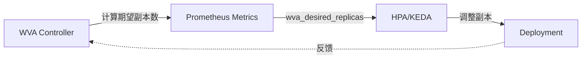

# Workload Variant Autoscaler - 饱和度感知弹性伸缩

> **核心价值**: 超越 CPU/内存指标,基于 LLM 推理饱和度实现智能扩缩容  
> **技术栈**: Go + Prometheus + HPA/KEDA  
> **关键指标**: Scale-to-Zero 冷启动 <30s, 饱和度感知避免 SLO 违约

---

## 🌀 螺旋 1: 为什么 HPA 对 LLM 不够智能?

### 传统 HPA 的盲点

```yaml
# 传统 HPA 配置
apiVersion: autoscaling/v2
kind: HorizontalPodAutoscaler
spec:
  metrics:
    - type: Resource
      resource:
        name: cpu
        target:
          averageUtilization: 70  # ❌ GPU 推理 CPU 利用率低!
```

**问题**:
- GPU 推理: CPU 利用率 <20%, 但 GPU 已满载
- KV Cache 压力: 内存占用不等于推理能力
- 队列堆积: HPA 不感知请求等待时间

---

### WVA 的饱和度模型

```python
saturation = (
    kv_memory_utilization * 0.5 +   # KV Cache 占用
    queue_depth_ratio * 0.3 +        # 队列深度
    throughput_degradation * 0.2     # 吞吐下降
)

if saturation > 0.8:
    desired_replicas = current + 1  # 扩容
elif saturation < 0.3:
    desired_replicas = current - 1  # 缩容
```

---

## 💨 认知降压

类比工厂"弹性用工":
- ❌ 传统方案: 根据工人"打卡时间"判断是否加班 (类比 CPU 利用率)
- ✅ WVA 方案: 根据"产线饱和度"(原料库存+在制品+产能下降) 决定招工

---

## 🌀 螺旋 2: 与 HPA/KEDA 集成

### 工作流程



---

## 🌀 螺旋 3: Scale-to-Zero 配置

```yaml
apiVersion: llmd.ai/v1alpha1
kind: VariantAutoscaling
metadata:
  name: llama-autoscaler
spec:
  scaleTargetRef:
    kind: Deployment
    name: llama-70b
  saturationThreshold: 0.8
  scaleToZero:
    enabled: true
    idleTimeout: 300s  # 5 分钟无请求缩容到 0
```

**适用场景**: 内部工具、开发环境、间歇性批处理

---

## 📚 参考资料

- [WVA Architecture](https://llm-d.ai/docs/architecture/Components/workload-variant-autoscaler)
- [Saturation Scaling Design](https://docs.google.com/document/d/1iGHqdxRUDpiKwtJFr5tMCKM7RF6fbTfZBL7BTn6UkwA/edit)
