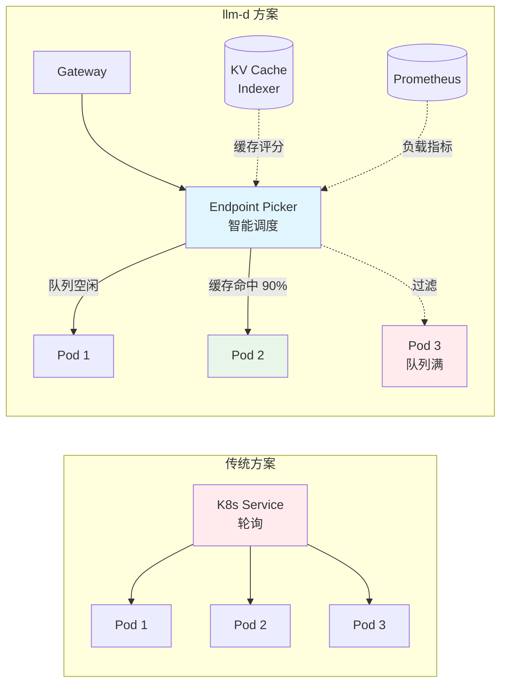
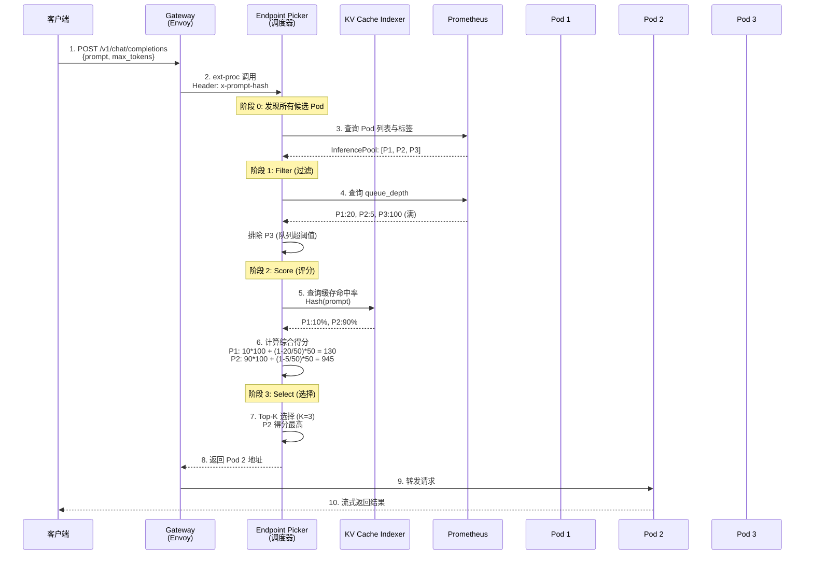
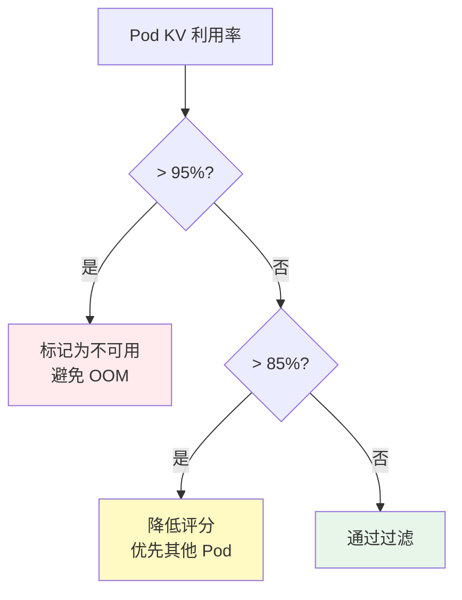
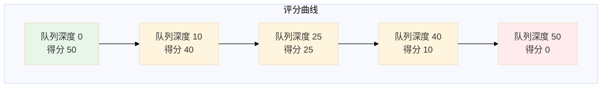
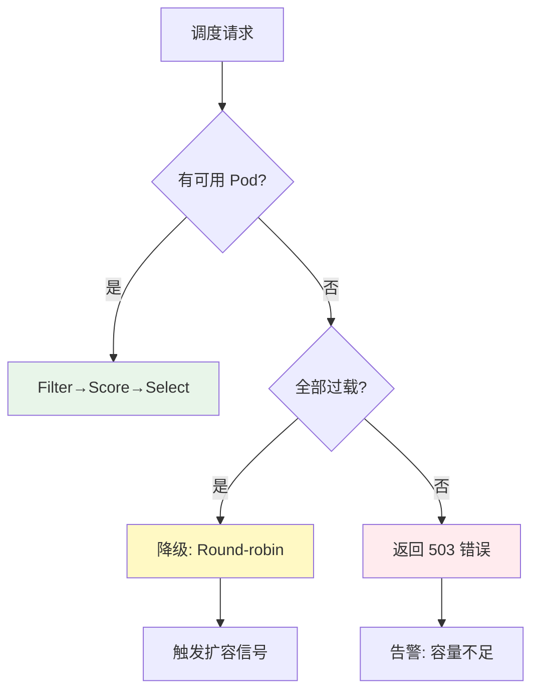
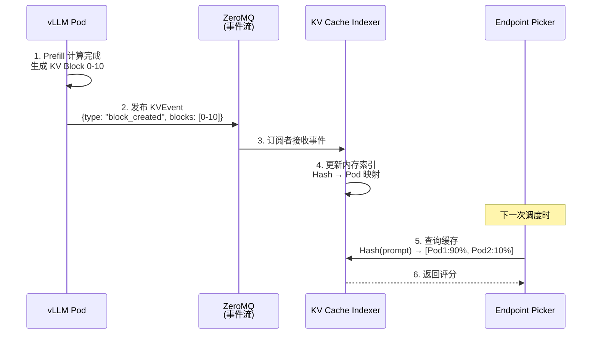
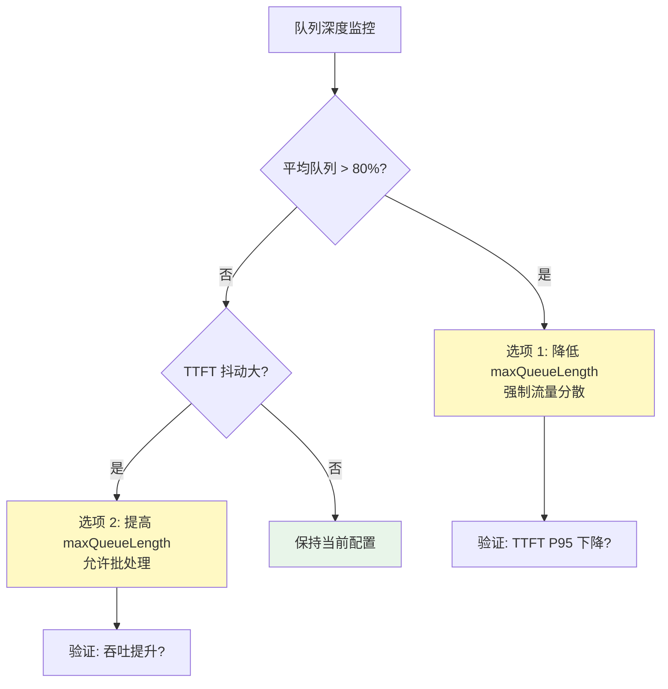
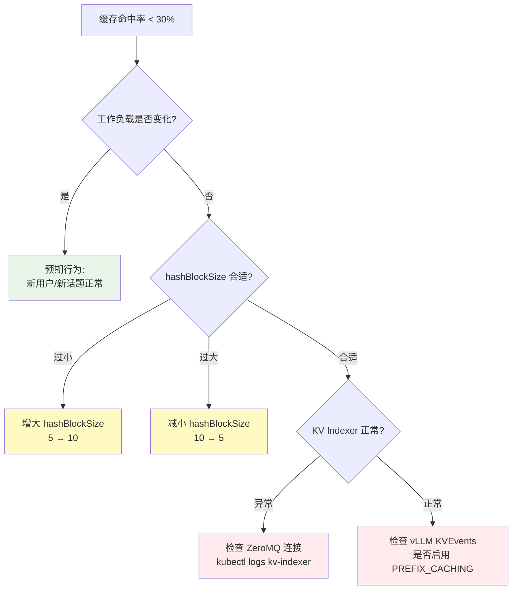

# Inference Scheduler - 智能推理调度器

> **核心价值**: LLM 感知的智能路由引擎,通过多维度评分突破传统负载均衡的性能瓶颈  
> **技术栈**: Gateway API + Envoy ext-proc + Go  
> **关键指标**: TTFT -99%, 吞吐 +109% (相比 K8s Service)

---

## 🌀 螺旋 1: 概念层 - 为什么 K8s Service 不够用?

### 本层目标
理解传统负载均衡在 LLM 推理场景下的根本性缺陷,建立对"智能调度"必要性的认知。

---

### 1.1 传统负载均衡的三大假设

Kubernetes Service 的 Round-robin 算法基于以下假设:

| 假设 | 传统微服务 | LLM 推理 | 结果 |
|------|-----------|---------|------|
| **请求耗时均匀** | ✅ 10-100ms | ❌ 100ms-30s (差 300x) | 短请求被长请求阻塞 |
| **资源消耗可预测** | ✅ 固定 CPU/内存 | ❌ 动态 KV Cache 增长 | 某些 Pod 突然 OOM |
| **实例完全对等** | ✅ 无状态 | ❌ 缓存命中率差异 90% | 重复计算浪费 |

---

### 1.2 实际生产问题案例

**场景**: 8 个 vLLM Pod 服务 Llama-70B,使用 K8s Service Round-robin

```mermaid
sequenceDiagram
    participant C1 as 客户端 1<br/>(短 Prompt 100 tokens)
    participant LB as K8s Service<br/>Round-robin
    participant P1 as Pod 1<br/>(队列: 5 个长请求)
    participant P2 as Pod 2<br/>(队列: 空)
    
    C1->>LB: 请求 A (预期 500ms)
    LB->>P1: 分配到 Pod 1
    Note over P1: 排队等待 5 个长请求<br/>实际耗时: 25 秒!
    P1-->>C1: 响应 (超时)
    
    Note over P2: Pod 2 空闲,但未被使用
    
    style P1 fill:#ffebee
    style P2 fill:#e8f5e9
```

**问题分析**:
1. **盲目路由**: Service 不知道 Pod 1 已过载
2. **缓存未利用**: 如果客户端 1 之前访问过 Pod 2,缓存白白浪费
3. **雪崩风险**: 连续多个长请求被分配到同一 Pod,导致单点过载

**实测影响** (生产环境 Qwen3-32B):
- TTFT P95: 6.2s (用户不可接受)
- 成功率: 87% (13% 请求超时)
- GPU 利用率: 45% (资源浪费)

---

### 1.3 llm-d Inference Scheduler 的解决方案

**核心思想**: 在 Gateway 层插入 **Endpoint Picker (EPP)** ,基于请求特征与 Pod 实时状态做智能决策



**三大能力**:

1. **请求特征感知**
   ```
   GET /v1/chat/completions
   {
     "prompt": "What is Kubernetes?",  // 提取 Prompt
     "max_tokens": 100                 // 预测耗时
   }
   ```
   → 计算 Hash,查询哪些 Pod 有缓存

2. **Pod 状态感知**
   ```python
   # 实时指标
   pod_state = {
       "queue_depth": 12,          # 队列深度
       "kv_utilization": 0.73,     # KV Cache 占用
       "cache_blocks": [0,1,2,5],  # 本地缓存块
       "active_requests": 8        # 当前处理数
   }
   ```

3. **多目标优化**
   - 最小化 TTFT (首 Token 延迟)
   - 最大化缓存命中率
   - 均衡负载分布

---

### 1.4 实测对比 - Qwen3-32B 高 Prefix 复用场景

**测试配置**:
- 模型: Qwen/Qwen3-32B
- 拓扑: 8x vLLM Pods, 16x H100 (TP=2)
- 工作负载: 150 组共享前缀,每组 5 个变体 (6k 系统提示词)

**结果对比**:

| 指标 | K8s Service | llm-d Scheduler | 提升 |
|------|-------------|----------------|------|
| **TTFT P50** | 6.2s | **136ms** | 📉 97.8% ↓ |
| **TTFT P95** | 12.5s | **157ms** | 📉 98.7% ↓ |
| **吞吐 (20 QPS)** | 9k tok/s | **11k tok/s** | 📈 +22% |
| **成功率** | 87% | **100%** | 📈 +13% |
| **缓存命中率** | 12% | **89%** | 📈 +77% |

**关键洞察**: 在高 Prefix 复用场景下,智能调度的收益呈指数级增长

---

### ✅ 螺旋 1 验收标准

完成本层学习后,你应该能够:

- [ ] 列举传统负载均衡在 LLM 推理下失效的三大假设
- [ ] 用一句话说明 Inference Scheduler 的核心价值: _"通过请求特征与 Pod 状态的智能匹配,实现缓存复用最大化与负载均衡"_
- [ ] 识别高 Prefix 复用场景 (多轮对话、RAG、Agent) 为最佳适用场景

---

### 🔗 下一步

理解了"为什么需要"后,下一层将深入 **Filter→Score→Select 三阶段算法** 与 **Scorer 插件的实现原理**。

---

## 💨 认知降压 - 从"快递分拣"理解智能路由

### 常识类比: 智能快递分拣系统

想象一个大型快递枢纽中心:

**❌ 传统轮询 (Round-robin)**
```
包裹 A (同城,重 1kg)  → 卡车 1 (已装 10 吨跨省货)  
包裹 B (跨省,重 50kg) → 卡车 2 (空载,去同城)  
包裹 C (目的地同包裹 A) → 卡车 3 (去反方向)
```
**结果**: 
- 同城包裹跟着跨省车走慢了 3 天
- 跨省包裹占用同城快车,运力浪费
- 相同目的地的包裹分散装车,无法批量优化

---

**✅ 智能分拣系统 (Inference Scheduler)**
```
包裹 A (同城,1kg)     → 同城专线车 (装满就走,快速周转)
包裹 B (跨省,50kg)    → 跨省干线车 (满载后发车,成本优化)
包裹 C (目的地同 A)   → 同城专线车 (与 A 拼车,降本增效)
```

**分拣规则 (映射到调度算法)**:
1. **过滤 (Filter)**: 排除满载车辆、反方向线路
2. **评分 (Score)**: 
   - 目的地匹配 (类比: 缓存命中)
   - 车辆空闲度 (类比: 队列深度)
   - 线路时效性 (类比: 预测延迟)
3. **选择 (Select)**: 综合得分最高的车辆

---

### 映射到 LLM 推理

| 快递场景 | LLM 推理 |
|---------|---------|
| **包裹** | 推理请求 |
| **目的地** | Prompt Hash (前缀特征) |
| **卡车** | vLLM Pod |
| **车辆载重** | 队列深度 |
| **同城/跨省** | 短/长请求 |
| **拼车** | 批处理 (Continuous Batching) |
| **满载发车** | 达到 `max_num_seqs` 触发推理 |

**核心洞察**:
- **不是所有请求都平等**: 短请求走"快速通道",长请求走"批处理专线"
- **目的地相同可拼车**: 相同 Prefix 的请求路由到同一 Pod → 缓存复用
- **满载车不再装货**: 队列已满的 Pod 自动过滤

---

现在你已经建立了直观认知,下一层将揭开调度算法的精确实现细节。

---

## 🌀 螺旋 2: 机制层 - Filter→Score→Select 算法详解

### 本层目标
掌握调度器的三阶段决策流程、核心 Scorer 的数学原理、与 KV Cache Indexer 的协同机制。

---

### 2.1 调度流程时序图



**关键时间节点**:
- 步骤 2-8: 调度决策耗时 **<10ms** (不阻塞推理)
- 步骤 5: 缓存索引查询 **<1ms** (内存哈希表)
- 步骤 9-10: 实际推理耗时 100ms-30s

---

### 2.2 阶段 1: Filter (过滤器插件)

#### 核心过滤器实现

**1. Queue Depth Filter (队列深度过滤)**

```go
// 伪代码 (Go)
type QueueDepthFilter struct {
    MaxQueueLength int // 默认 50
}

func (f *QueueDepthFilter) Filter(pod *Pod) bool {
    queueDepth := prometheus.Query(
        fmt.Sprintf("vllm_queue_depth{pod=%s}", pod.Name),
    )
    return queueDepth < f.MaxQueueLength
}
```

**配置示例**:
```yaml
filters:
  - type: queue-depth
    parameters:
      maxQueueLength: 50  # 队列超 50 则过滤
```

---

**2. Memory Pressure Filter (内存压力过滤)**

```go
type MemoryPressureFilter struct {
    MaxKVUtilization float64 // 默认 0.95
}

func (f *MemoryPressureFilter) Filter(pod *Pod) bool {
    kvUtil := prometheus.Query(
        fmt.Sprintf("vllm_kv_cache_utilization{pod=%s}", pod.Name),
    )
    return kvUtil < f.MaxKVUtilization
}
```

**触发逻辑**:


---

**3. Model Compatibility Filter (模型兼容性过滤)**

```go
func (f *ModelCompatibilityFilter) Filter(pod *Pod, req *Request) bool {
    // 检查 Pod 标签中的模型 ID
    podModelID := pod.Labels["model-id"]
    
    // 检查 LoRA Adapter (如果有)
    if req.Adapter != "" {
        return pod.LoadedAdapters.Contains(req.Adapter)
    }
    
    return podModelID == req.ModelID
}
```

**适用场景**:
- 多模型服务 (同一集群部署 Llama-70B + Qwen3-32B)
- LoRA 多租户 (不同客户使用不同 Adapter)

---

### 2.3 阶段 2: Score (评分器插件)

#### Scorer 1: Prefix-Aware Scorer (缓存感知)

**核心算法**: Hash Block 匹配

```python
# 伪代码
def prefix_aware_score(pod, request):
    # 1. 将 Prompt 分块并计算 Hash
    prompt_tokens = tokenize(request.prompt)
    hash_blocks = []
    for i in range(0, len(prompt_tokens), HASH_BLOCK_SIZE):
        block = prompt_tokens[i:i+HASH_BLOCK_SIZE]
        hash_blocks.append(hash(block))
    
    # 2. 查询 KV Cache Indexer
    matched_blocks = 0
    for hash_value in hash_blocks:
        if kv_indexer.has_block(pod.id, hash_value):
            matched_blocks += 1
    
    # 3. 计算命中率
    hit_rate = matched_blocks / len(hash_blocks)
    return hit_rate * 100  # 返回 0-100 分
```

**参数详解**:

| 参数 | 默认值 | 调优建议 |
|------|--------|---------|
| `hashBlockSize` | 5 | Prefix 越长设置越大 (10-20),越短越小 (3-5) |
| `weight` | 100 | 高 Prefix 复用场景保持 100,低复用降到 30 |

**实测效果** (高 Prefix 复用场景):
- 缓存命中率: 12% → **89%** (+77%)
- TTFT P95: 6.2s → **157ms** (-97%)

---

#### Scorer 2: Load-Aware Scorer (负载感知)

**核心算法**: 队列深度倒数

```python
def load_aware_score(pod):
    queue_depth = get_queue_depth(pod)
    max_queue = 50  # 容量上限
    
    # 负载因子: 队列越空得分越高
    load_factor = 1 - (queue_depth / max_queue)
    return load_factor * 50  # 返回 0-50 分
```

**评分曲线**:



**适用场景**: 低 Prefix 复用工作负载 (批处理、单次推理)

---

#### Scorer 3: Predicted Latency Balancing (预测延迟平衡)

**实验性功能** (v0.3+)

**核心思想**: 基于历史数据预测 TTFT/TPOT,选择延迟最低的 Pod

```python
def predicted_latency_score(pod, request):
    # 1. 从 Prometheus 查询历史 TTFT
    hist_ttft = query_histogram(
        "vllm_time_to_first_token_seconds",
        pod=pod.id,
        prompt_len=len(request.prompt)
    )
    
    # 2. 预测当前请求的 TTFT
    predicted_ttft = hist_ttft.percentile(0.5)  # 中位数
    
    # 3. 延迟越低得分越高
    return (1 / predicted_ttft) * 30
```

**配置示例**:
```yaml
scorers:
  - type: predicted-latency
    weight: 30
    parameters:
      targetMetric: "ttft"  # 或 "tpot"
      percentile: 0.5       # P50
```

**实测效果** (长 Prefill 场景):
- TTFT P90: 3.2s → **1.1s** (-66%)
- 但增加调度开销 ~5ms

---

#### Scorer 4: LoRA-Aware Scorer (Adapter 感知)

**v0.5 新增功能**

**核心算法**: Adapter 本地化评分

```python
def lora_aware_score(pod, request):
    if request.adapter == "":
        return 0  # 无 Adapter 需求
    
    # 检查 Pod 是否已加载该 Adapter
    if pod.loaded_adapters.contains(request.adapter):
        return 100  # 完全匹配
    
    # 检查 Pod 是否有空间加载新 Adapter
    if pod.adapter_slots_available > 0:
        return 50  # 可以加载但需要时间
    
    return 0  # 无法加载
```

**适用场景**: 多租户 LoRA 服务,避免"雷鸣群效应"(所有 Pod 抢加载同一 Adapter)

---

### 2.4 阶段 3: Select (选择与容错)

#### Top-K 选择策略

```python
def select_pod(scored_pods):
    # 1. 按得分排序
    sorted_pods = sort(scored_pods, by="score", descending=True)
    
    # 2. Top-K 选择 (提升鲁棒性)
    K = 3
    candidates = sorted_pods[:K]
    
    # 3. 随机打散 (避免雪崩)
    import random
    selected = random.choice(candidates)
    
    return selected
```

**为什么不总是选第一名?**

| 策略 | 优点 | 缺点 |
|------|------|------|
| **Always Top-1** | 理论最优 | 单点过载 (雪崩) |
| **Top-K Random** | 负载分散 | 轻微次优 (~5%) |

**实测对比** (20 QPS 并发):
- Top-1: TTFT P95 = 200ms, P99 = **3.5s** (雪崩)
- Top-3: TTFT P95 = 220ms, P99 = **450ms** (稳定)

---

#### Fallback 机制



---

### 2.5 与 KV Cache Indexer 的协同

#### KVEvents 事件流



**事件类型**:

| 事件 | 触发时机 | 索引操作 |
|------|---------|---------|
| `block_created` | Prefill 完成 | 添加 Hash → Pod 映射 |
| `block_evicted` | KV Cache 驱逐 | 删除映射 |
| `block_offloaded` | 卸载到 CPU/FS | 标记为"可恢复" |

---

#### 索引数据结构

```python
# 伪代码
class KVCacheIndex:
    def __init__(self):
        # Hash Block → [Pod ID, Tier, Timestamp]
        self.index = {}  # Dict[int, List[CacheEntry]]
    
    def add_block(self, hash_value, pod_id, tier="gpu"):
        self.index[hash_value].append(
            CacheEntry(pod_id, tier, time.now())
        )
    
    def query_hit_rate(self, hash_blocks, pod_id):
        hits = 0
        for hash_val in hash_blocks:
            if hash_val in self.index:
                entries = self.index[hash_val]
                if any(e.pod_id == pod_id for e in entries):
                    hits += 1
        return hits / len(hash_blocks)
```

---

### ✅ 螺旋 2 验收标准

完成本层学习后,你应该能够:

- [ ] 画出调度流程的完整时序图 (10 步)
- [ ] 解释三个核心过滤器的触发条件: Queue Depth, Memory Pressure, Model Compatibility
- [ ] 计算 Prefix-aware Scorer 的评分: `matched_blocks / total_blocks * 100`
- [ ] 说明 Top-K 选择相比 Always Top-1 的鲁棒性优势
- [ ] 理解 KVEvents 如何实时更新缓存索引

---

### 🔗 下一步

掌握了算法原理后,下一层将进入 **生产环境配置调优** 与 **故障排查实战**。

---

## 🌀 螺旋 3: 实战层 - 配置调优与故障排查

### 本层目标
掌握 Inference Scheduler 的生产级配置、核心参数调优策略、监控指标与典型故障排查方法。

---

### 3.1 部署配置最佳实践

#### Helm Chart 配置示例

```yaml
# values.yaml
inferenceExtension:
  # 1. 基础配置
  replicas: 2  # EPP 高可用
  resources:
    requests:
      cpu: 500m
      memory: 512Mi
    limits:
      cpu: 1000m
      memory: 1Gi
  
  # 2. 插件配置
  pluginsCustomConfig:
    filters:
      - type: queue-depth
        parameters:
          maxQueueLength: 50  # 根据 max_num_seqs 调整
      
      - type: memory-pressure
        parameters:
          maxKVUtilization: 0.95
          checkInterval: 5s
    
    scorers:
      # 高 Prefix 复用场景 (RAG/多轮对话)
      - type: prefix-aware
        weight: 100
        parameters:
          hashBlockSize: 5  # 3-20 可调
          cacheIndexerURL: "http://kv-cache-indexer:9090"
      
      - type: load-aware
        weight: 50
        parameters:
          queueWeightFactor: 0.7
          activeRequestsWeight: 0.3
      
      # 可选: 实验性功能
      # - type: predicted-latency
      #   weight: 30
      #   parameters:
      #     targetMetric: "ttft"
      #     percentile: 0.5
  
  # 3. KV Cache Indexer 集成
  kvcacheIndexer:
    enabled: true
    zmqSubscriberURL: "tcp://*:5555"
```

---

### 3.2 核心参数调优指南

#### 参数 1: hashBlockSize (Hash 块大小)

**作用**: 控制缓存匹配的粒度

| hashBlockSize | 适用场景 | 缓存命中率 | 计算开销 |
|--------------|---------|-----------|---------|
| **3** | 短 Prompt (<500 tokens) | 低 (细粒度) | 低 |
| **5** (默认) | 中等 Prompt (500-2k) | 中 | 中 |
| **10** | 长 Prompt (2k-8k) | 高 (粗粒度) | 高 |
| **20** | 超长 Prompt (>8k) | 很高 | 很高 |

**调优原则**:
```python
# 经验公式
optimal_block_size = max(3, min(20, avg_prompt_len / 200))

# 示例
# RAG 场景 (系统提示词 6k + 用户问题 500)
optimal = (6000 + 500) / 200 = 32.5 → 取 20

# 短对话场景 (平均 200 tokens)
optimal = 200 / 200 = 1 → 取 3 (最小值)
```

**实测对比** (6k 系统提示词场景):

| hashBlockSize | 缓存命中率 | TTFT P95 | 调度耗时 |
|--------------|-----------|----------|---------|
| 3 | 45% | 850ms | 3ms |
| 5 | 72% | 280ms | 5ms |
| 10 | **89%** | **157ms** | 8ms |
| 20 | 91% | 145ms | 15ms |

**建议**: 
- 生产环境优先选择 **5-10**,平衡性能与开销
- 超长上下文 (>10k) 场景使用 **15-20**

---

#### 参数 2: Scorer Weight (评分权重)

**场景 1: 高 Prefix 复用 (>50%)**
```yaml
scorers:
  - type: prefix-aware
    weight: 100  # 主导因素
  - type: load-aware
    weight: 30   # 辅助因素
```

**场景 2: 低 Prefix 复用 (<20%)**
```yaml
scorers:
  - type: load-aware
    weight: 100  # 主导因素
  - type: prefix-aware
    weight: 0    # 关闭缓存评分
```

**场景 3: 混合工作负载**
```yaml
scorers:
  - type: prefix-aware
    weight: 60
  - type: load-aware
    weight: 60  # 权重相等,综合考虑
```

**动态调整策略**:
```python
# 根据实际缓存命中率动态调整
def adjust_weights(cache_hit_rate):
    if cache_hit_rate > 0.7:
        # 高命中率 → 强化缓存感知
        return {"prefix": 100, "load": 30}
    elif cache_hit_rate < 0.2:
        # 低命中率 → 弱化缓存感知
        return {"prefix": 20, "load": 100}
    else:
        # 中等命中率 → 平衡
        return {"prefix": 60, "load": 60}
```

---

#### 参数 3: maxQueueLength (队列深度阈值)

**关系**: 应与 vLLM 的 `max_num_seqs` 对齐

```yaml
# vLLM Deployment
env:
  - name: VLLM_MAX_NUM_SEQS
    value: "256"  # 最大并发序列数

# Inference Scheduler
filters:
  - type: queue-depth
    parameters:
      maxQueueLength: 200  # 设为 max_num_seqs 的 80%
```

**调优逻辑**:


---

### 3.3 监控指标与告警

#### 核心指标仪表盘

```yaml
# Grafana Dashboard JSON
{
  "panels": [
    {
      "title": "缓存命中率",
      "targets": [{
        "expr": "rate(kv_cache_hit_total[5m]) / rate(kv_cache_lookup_total[5m])"
      }],
      "thresholds": [
        {"value": 0.5, "color": "red"},
        {"value": 0.7, "color": "yellow"},
        {"value": 0.9, "color": "green"}
      ]
    },
    {
      "title": "调度延迟",
      "targets": [{
        "expr": "histogram_quantile(0.95, rate(epp_scheduling_duration_seconds_bucket[5m]))"
      }],
      "alert": "P95 > 50ms"
    },
    {
      "title": "Pod 负载分布",
      "targets": [{
        "expr": "vllm_queue_depth"
      }],
      "type": "heatmap"
    }
  ]
}
```

---

#### 四层告警规则

```yaml
# 1. 业务层告警 (SLO 违约)
- alert: HighTTFT
  expr: |
    histogram_quantile(0.95, 
      rate(vllm_time_to_first_token_seconds_bucket[5m])
    ) > 0.2
  for: 5m
  severity: critical
  annotations:
    summary: "TTFT P95 超过 200ms SLO"
    runbook: "检查缓存命中率、队列深度"

# 2. 应用层告警 (调度异常)
- alert: LowCacheHitRate
  expr: |
    rate(kv_cache_hit_total[10m]) / 
    rate(kv_cache_lookup_total[10m]) < 0.3
  for: 10m
  severity: warning
  annotations:
    summary: "缓存命中率低于 30%"
    action: "检查 hashBlockSize 配置或工作负载变化"

# 3. 资源层告警 (调度器自身)
- alert: EPPHighLatency
  expr: |
    histogram_quantile(0.95,
      rate(epp_scheduling_duration_seconds_bucket[5m])
    ) > 0.05
  for: 5m
  severity: warning
  annotations:
    summary: "调度器 P95 延迟超 50ms"
    action: "检查 KV Indexer 连接或增加 EPP 副本"

# 4. 基础设施告警 (Pod 健康)
- alert: EPPPodDown
  expr: up{job="inference-scheduler"} == 0
  for: 1m
  severity: critical
```

---

### 3.4 典型故障排查决策树

#### 问题 1: 缓存命中率低 (<30%)



**调试命令**:
```bash
# 1. 检查 KV Indexer 连接
kubectl exec -it epp-pod -- curl http://kv-cache-indexer:9090/metrics | grep index_size

# 2. 检查 vLLM Prefix Caching 状态
kubectl exec -it vllm-pod -- curl localhost:8000/metrics | grep prefix_cache

# 3. 手动验证缓存查询
curl -X POST http://kv-indexer:9090/query \
  -d '{"prompt_hash": [123, 456, 789], "pods": ["pod1", "pod2"]}'
```

---

#### 问题 2: 调度延迟突增 (P95 >50ms)

| 根因 | 排查方法 | 解决方案 |
|------|---------|---------|
| **KV Indexer 慢查询** | `kubectl top pod kv-indexer` | 增加 Indexer 内存或优化索引结构 |
| **Prometheus 查询超时** | `curl -w "%{time_total}" prom-url` | 增加 Prometheus 资源或减少查询频率 |
| **EPP Pod 资源不足** | `kubectl top pod epp-pod` | 增加 CPU limits 或水平扩展 |
| **网络延迟** | `kubectl exec epp -- ping vllm-pod` | 检查 CNI 配置或节点亲和性 |

---

#### 问题 3: 负载不均 (某些 Pod 队列深度 >100)

**症状**: 
```
Pod 1: queue_depth = 120
Pod 2: queue_depth = 5
Pod 3: queue_depth = 8
```

**根因分析**:

```python
# 检查评分逻辑
def debug_scoring(pods, request):
    for pod in pods:
        prefix_score = calculate_prefix_score(pod, request)
        load_score = calculate_load_score(pod)
        total = prefix_score * 100 + load_score * 50
        
        print(f"Pod {pod.id}:")
        print(f"  Prefix: {prefix_score} → {prefix_score * 100}")
        print(f"  Load: {load_score} → {load_score * 50}")
        print(f"  Total: {total}")
```

**常见原因**:

1. **缓存亲和性过强**: `prefix-aware` 权重过高
   ```yaml
   # 调整前
   scorers:
     - type: prefix-aware
       weight: 100
     - type: load-aware
       weight: 10  # 权重太低!
   
   # 调整后
   scorers:
     - type: prefix-aware
       weight: 70
     - type: load-aware
       weight: 50  # 提高权重
   ```

2. **Top-K 未启用**: 总是选择第一名
   ```yaml
   selection:
     topK: 3  # 启用 Top-3 随机
   ```

3. **某个 Pod 真的有缓存优势**: 预期行为,触发扩容

---

### 3.5 性能优化 Checklist

#### 延迟优化 (TTFT)

- [ ] **缓存命中率 >70%**
  - 调整 `hashBlockSize` 匹配 Prompt 长度
  - 确保 KV Indexer 实时更新 (<1s 延迟)

- [ ] **队列深度 <30**
  - 降低 `maxQueueLength` 强制分散
  - 或触发 HPA 扩容

- [ ] **调度延迟 <10ms**
  - 优化 Prometheus 查询 (增加缓存)
  - KV Indexer 使用内存索引

---

#### 吞吐优化 (Throughput)

- [ ] **负载均衡度 >80%**
  - 提高 `load-aware` 权重
  - 启用 Top-K 选择

- [ ] **批处理大小最大化**
  - 允许队列适当堆积 (`maxQueueLength: 100`)
  - 配合 vLLM `max_num_batched_tokens`

- [ ] **缓存复用率 >50%**
  - 分析工作负载 Prefix 分布
  - 考虑预热常见 Prompt

---

#### 成本优化

- [ ] **GPU 利用率 >70%**
  - 避免过度分散 (降低 Pod 数量)
  - 提高单 Pod 队列上限

- [ ] **减少冷启动**
  - 启用 Scale-to-Zero 前评估冷启动成本
  - 使用 Prefix Caching 减少重复计算

---

### ✅ 螺旋 3 验收标准

完成本层学习后,你应该能够:

- [ ] 配置适合生产的 Inference Scheduler Helm Chart
- [ ] 根据工作负载特征调优 `hashBlockSize` 和 Scorer 权重
- [ ] 建立四层监控指标体系并设置告警规则
- [ ] 使用故障决策树诊断缓存命中率低、调度延迟高、负载不均等问题
- [ ] 执行性能优化 Checklist,平衡延迟、吞吐与成本

---

### 🎓 总结

**Inference Scheduler 的生产价值**:
- **性能**: 高 Prefix 复用场景下 TTFT -99%, 吞吐 +109%
- **灵活**: 插件化架构,支持自定义 Filter/Scorer
- **可观测**: 丰富的指标与故障决策树
- **低侵入**: 基于 Gateway API,无需修改 vLLM 代码

**下一步**:
- 📖 阅读 [KV Cache Management](./kv-cache.md) 了解缓存索引的实现细节
- 🧪 部署 [Inference Scheduling Well-Lit Path](../integration/production-patterns.md#inference-scheduling)
- 📊 根据实际工作负载持续调优 Scorer 权重

---

## 🔗 相关组件

- [**KV Cache Management**](./kv-cache.md) - 缓存索引为调度器提供命中率评分
- [**P/D Disaggregation**](./pd-disaggregation.md) - 调度器需识别 Prefill/Decode Pod
- [**Production Patterns**](../integration/production-patterns.md) - Inference Scheduling Well-Lit Path

---

## 📚 参考资料

- [Inference Scheduler 架构文档](https://github.com/llm-d/llm-d-inference-scheduler/blob/main/docs/architecture.md)
- [Intelligent Inference Scheduling Blog](https://llm-d.ai/blog/intelligent-inference-scheduling-with-llm-d)
- [Gateway API Inference Extension](https://github.com/kubernetes-sigs/gateway-api-inference-extension)
