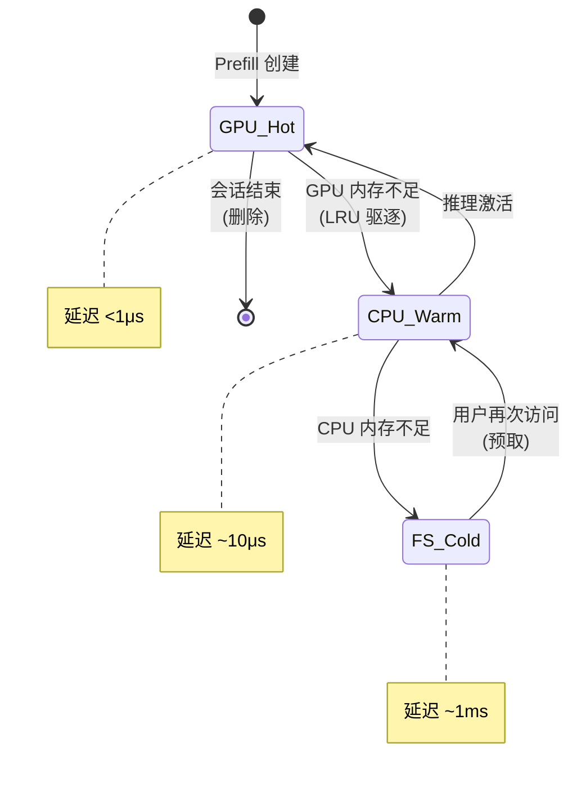

# KV Cache Management - 分层缓存架构

> **核心价值**: 突破单机内存限制,通过 GPU-CPU-FS 三级存储实现 10x+ 并发能力  
> **技术栈**: vLLM KVConnector + POSIX I/O + LRU  
> **关键指标**: 并发用户 50→250 (13.9x), 吞吐保持 185k tok/s

---

## 🌀 螺旋 1: 概念层

### Transformer 的"记忆瓶颈"

**问题**: KV Cache 内存需求与上下文长度线性增长

```python
# Llama-3.1-70B 单个 Token 的 KV Cache 大小
kv_size_per_token = (
    80 layers * 2 (K+V) * 8192 hidden_dim * 2 bytes (FP16)
) = 2.56 MB/token

# 8k 上下文对话
single_conversation = 8192 * 2.56 MB = 20.97 GB

# H100 80GB HBM 只能支持
max_concurrent = 80 GB / 21 GB ≈ 3 个长对话! ❌
```

**核心矛盾**: GPU HBM 是推理性能关键,但容量极其有限

---

### llm-d 的三级存储方案

类比工厂仓储系统:

| 存储层 | 工厂类比 | 容量 | 延迟 | 成本 |
|-------|---------|------|------|------|
| **L1: GPU HBM** | 高速库存 (产线旁) | 80 GB | <1μs | 💰💰💰 |
| **L2: CPU DRAM** | 中转仓 (车间内) | 512 GB | ~10μs | 💰💰 |
| **L3: 文件系统** | 大型仓库 (园区外) | 10 TB+ | ~1ms | 💰 |

**设计原则**:
- **热数据在 GPU**: 活跃会话常驻 HBM
- **温数据在 CPU**: 待激活会话缓存 DRAM
- **冷数据在磁盘**: 历史会话归档 FS,可跨节点复用

---

## 💨 认知降压

想象超市的"前置仓"模式:
- **收银台 (GPU)**: 只放畅销商品,快速结账
- **后仓 (CPU)**: 存放次畅销品,需要时快速补货
- **配送中心 (FS)**: 大量库存,隔天配送

关键: **异步补货不阻塞结账** (对应异步 I/O 不阻塞推理)

---

## 🌀 螺旋 2: 机制层

### vLLM KVConnector 抽象层

```python
class KVConnector:
    def put(self, block_id: int, data: Tensor, tier: str):
        """卸载 KV Block 到指定层"""
        if tier == "cpu":
            async_copy_to_cpu(data)
        elif tier == "fs":
            async_write_to_file(block_id, data)
    
    def get(self, block_id: int, tier: str) -> Tensor:
        """从指定层加载 KV Block"""
        if tier == "cpu":
            return async_copy_from_cpu(block_id)
        elif tier == "fs":
            return async_read_from_file(block_id)
```

### 驱逐与预取策略



---

## 🌀 螺旋 3: 实战层

### 配置示例

```yaml
# vLLM Deployment
env:
  - name: VLLM_KV_CACHE_OFFLOAD
    value: "cpu,fs"  # 启用两级卸载
  
  - name: VLLM_GPU_MEMORY_UTILIZATION
    value: "0.85"  # 预留空间给 KV Cache
  
  - name: VLLM_KV_OFFLOAD_PATH
    value: "/mnt/shared-storage"  # Lustre/NFS
```

### 何时启用分层缓存?

| 场景 | 建议 | 理由 |
|------|------|------|
| 并发 <20 用户 | 仅 GPU | 无内存压力 |
| 并发 20-100 用户 | GPU + CPU | 成本最优 |
| 并发 >100 用户 | GPU + CPU + FS | 必需 |
| 长对话 (>16k) | GPU + FS | CPU 容量不足 |

---

## 📚 参考资料

- [vLLM KV Offloading Connector Blog](https://blog.vllm.ai/2026/01/08/kv-offloading-connector.html)
- [llm-d v0.5 Hierarchical KV Caching](https://llm-d.ai/blog/llm-d-v0.5-sustaining-performance-at-scale#optimized-offloading-hierarchical-kv-caching)
