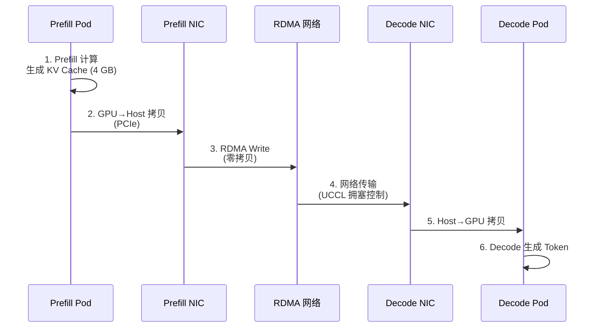

# Prefill/Decode Disaggregation - P/D 分离架构

> **核心价值**: 通过计算与内存解耦,实现超大模型的专业化部署  
> **技术栈**: vLLM + NIXL/UCCL + RDMA  
> **关键指标**: TTFT 稳定 <500ms, 吞吐 20-40k tok/s (120B+ 模型)

---

## 🌀 螺旋 1: Prefill 与 Decode 的资源需求不对称

### 两阶段的本质差异

| 维度 | Prefill (预处理) | Decode (生成) |
|------|-----------------|--------------|
| **输入** | 完整 Prompt (1k-32k tokens) | 单个 Token |
| **计算** | 大矩阵乘法 (GEMM) | 小向量操作 |
| **瓶颈** | **计算密集** (FLOPs) | **内存带宽密集** (Bandwidth) |
| **GPU 利用率** | 90%+ | 30-50% |
| **最优配置** | 低 TP,多副本 | 高 TP,少副本 |

### 传统统一部署的问题

```yaml
# 同一 Pod 处理两阶段
deployment:
  tensorParallel: 4  # 折中配置
  replicas: 2
```

**矛盾**:
- Prefill 时: TP=4 算力浪费 (只需 TP=1)
- Decode 时: 副本=2 带宽不足 (需要 TP=8)

---

## 💨 认知降压

类比汽车制造:
- **预处理车间 (Prefill)**: 冲压钢板 → 计算密集,需要强力设备
- **精加工产线 (Decode)**: 逐个零件组装 → 带宽密集,需要流水线

**错误方案**: 用同一条产线处理冲压和组装 → 效率低下  
**llm-d 方案**: 专业分工,中间通过"物流专线"(NIXL) 传输 KV Cache

---

## 🌀 螺旋 2: NIXL/UCCL 零拷贝传输

### KV Cache 跨节点传输流程



### UCCL 主机端优势

**对比 UCX (硬件卸载)**:
- UCX: 359ms → 拥塞后 424ms (+18%)
- UCCL: 359ms → 拥塞后 384ms (+7%)
- **弹性优势**: 2.4x

---

## 🌀 螺旋 3: xPyD 比例调优

### 部署拓扑示例

```yaml
# DeepSeek-R1 (671B MoE)
prefill:
  replicas: 8
  tensorParallel: 1
  expertParallel: 16

decode:
  replicas: 1
  tensorParallel: 4
  expertParallel: 16
```

### 比例调优决策表

| ISL/OSL 比例 | Prefill:Decode | 网络带宽需求 |
|-------------|---------------|-------------|
| 10:1 (10k/1k) | 8:1 | 高 (需 RDMA) |
| 5:1 (5k/1k) | 4:1 | 中 |
| 1:1 (1k/1k) | 2:1 | 低 |

---

## 📚 参考资料

- [P/D Disaggregation Northstar Design](https://docs.google.com/document/d/1FNN5snmipaTxEA1FGEeSH7Z_kEqskouKD1XYhVyTHr8/edit)
- [P/D Disaggregation Guide](https://llm-d.ai/docs/guide/Installation/pd-disaggregation)
