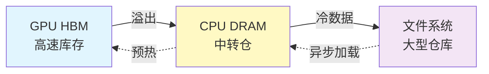
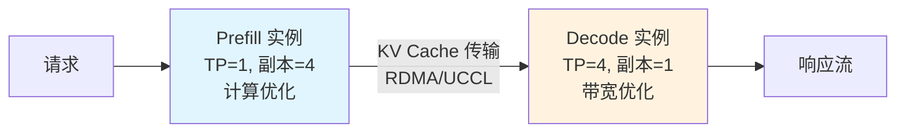
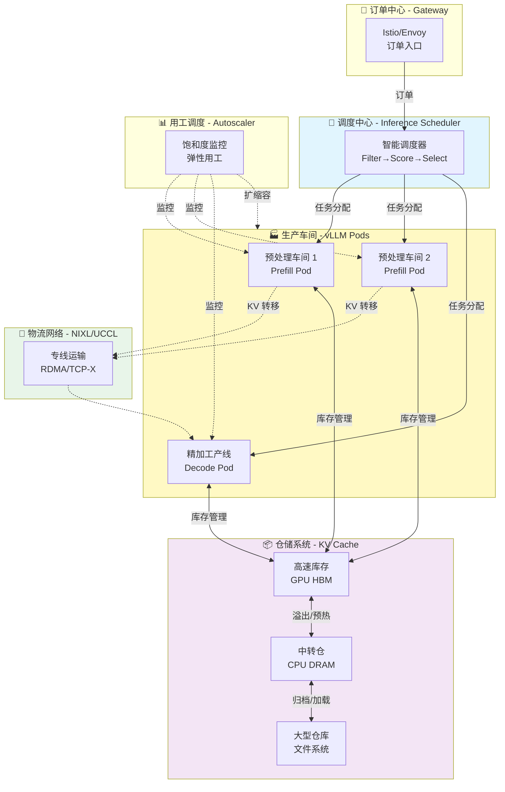
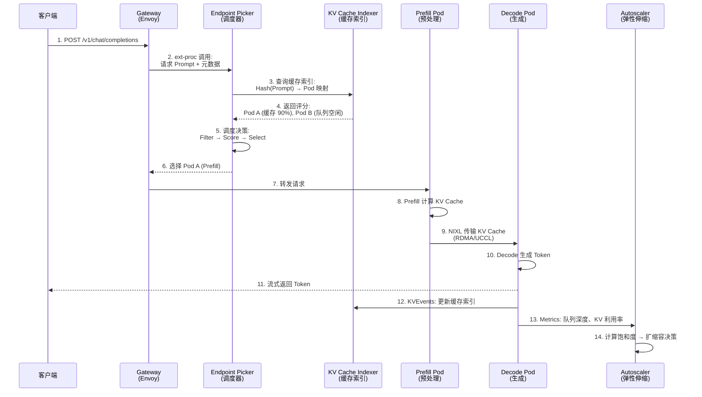
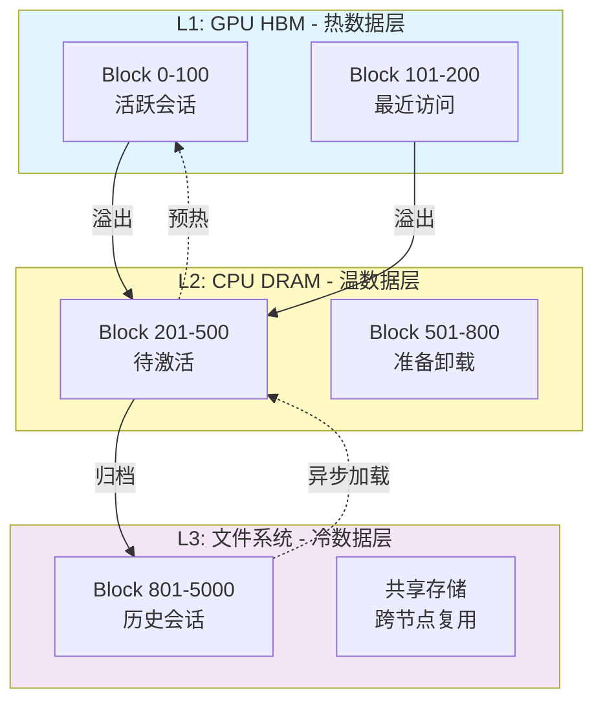
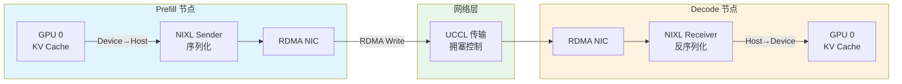
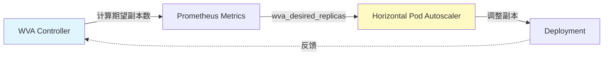
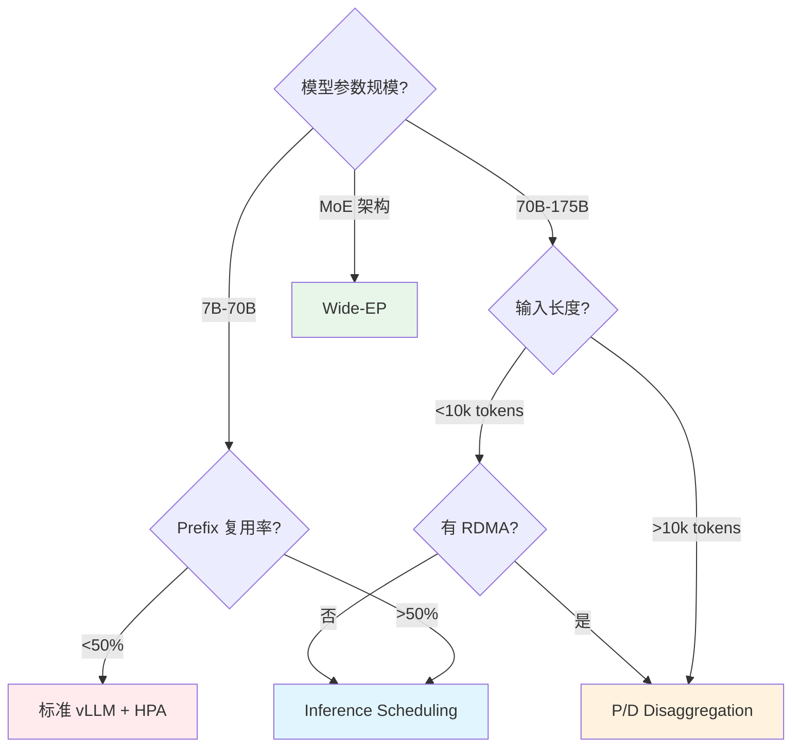
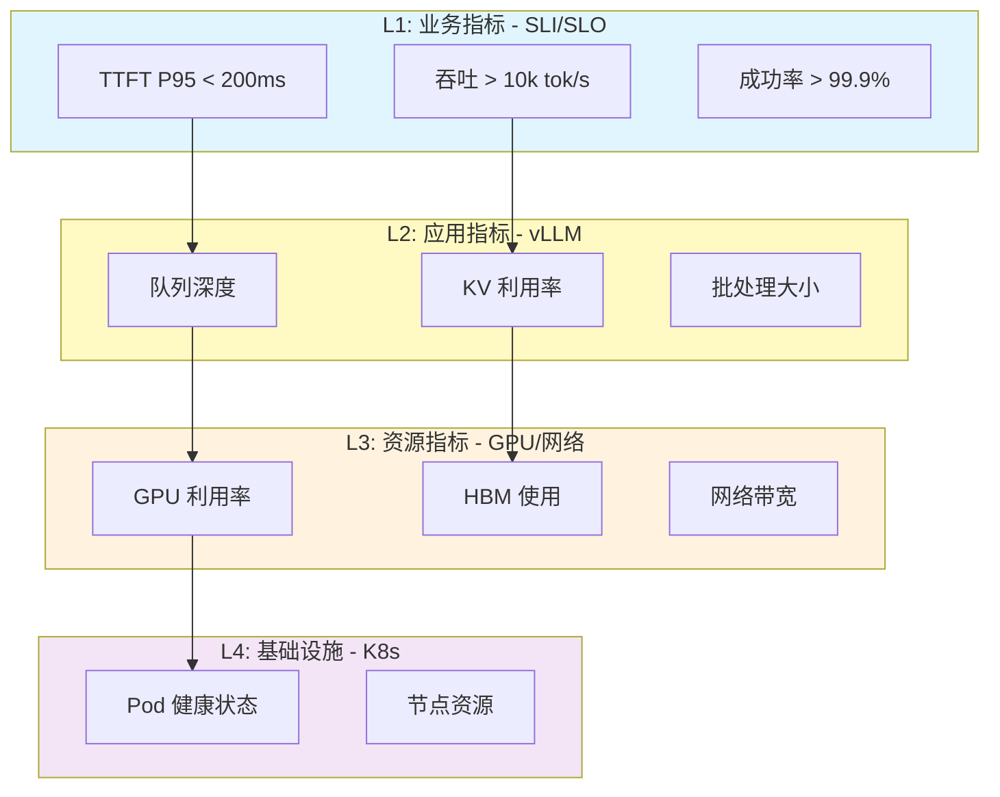
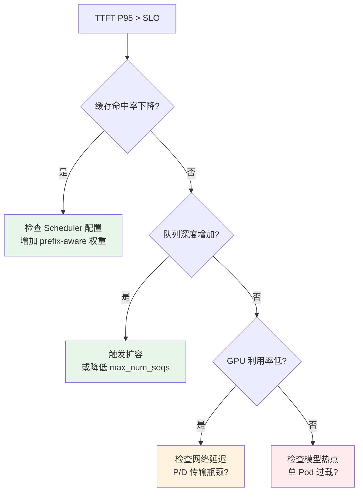

# llm-d 分布式推理平台架构

> **核心价值**: Kubernetes 原生的大模型推理平台,实现 SOTA 性能与生产级运维能力的统一  
> **技术栈**: vLLM + Envoy + Kubernetes Gateway API + Prometheus  
> **适用场景**: 70B+ 参数大模型生产推理、高 Prefix 复用工作负载、混合 SLO 多租户服务

---

## 🌀 螺旋 1: 概念层 - LLM 推理的生产困境与 llm-d 的价值主张

### 本层目标
建立对 LLM 推理生产化痛点的认知,理解 llm-d 如何通过 Kubernetes 原生架构解决这些问题。

---

### 1.1 为什么 LLM 推理比传统服务更难?

传统微服务的负载均衡假设:
- ✅ 请求处理时间相对均匀
- ✅ 资源消耗可预测
- ✅ 无状态,实例间完全对等

**但 LLM 推理打破了所有假设:**

| 维度 | 传统服务 | LLM 推理 |
|------|---------|---------|
| **请求耗时** | 10-100ms | 100ms-30s (取决于输入/输出长度) |
| **内存需求** | 固定 | 动态增长 (KV Cache 占用与上下文长度线性相关) |
| **计算模式** | CPU 密集型 | Prefill 计算密集 + Decode 内存带宽密集 |
| **状态管理** | 无状态 | 有状态 (KV Cache 复用可减少 90% 计算) |

**核心矛盾**: 
- **内存墙**: 单张 H100 80GB HBM 只能服务 ~20 个并发长对话 (Llama-70B)
- **延迟抖动**: Round-robin 将长短请求均匀分配,导致头部请求阻塞队列
- **资源浪费**: Prefill 吃满算力时 Decode 在等待,Decode 吃满带宽时 Prefill 在空转

---

### 1.2 llm-d 的核心价值主张

**定位**: Kubernetes 原生的分布式 LLM 推理控制平面

llm-d 不是新的推理引擎,而是将 **vLLM** (业界最快推理引擎) 与 **Kubernetes** (云原生编排标准) 深度整合,提供三大核心能力:

#### 🎯 能力 1: 智能调度 - 让每个请求找到"最合适"的 GPU

传统 K8s Service 的 Round-robin:
```
请求 A (短) → GPU 1 (队列: [长, 长, 长])  ❌ 排队等待
请求 B (长) → GPU 2 (队列: [短, 短])      ❌ 阻塞后续
```

llm-d Inference Scheduler 的智能路由:
```
请求 A (短) → GPU 2 (队列: [短, 短])      ✅ 快速响应
请求 B (长) → GPU 1 (队列: [长, 长, 长])  ✅ 批处理优化
请求 C (有缓存) → GPU 3 (缓存命中率 90%)  ✅ 零等待
```

**收益**: 
- TTFT (首 Token 延迟) 降低 **99%** (6s → 60ms)
- 吞吐提升 **109%** (实测 Qwen3-32B)

---

#### 🎯 能力 2: 分层缓存 - 突破单机内存限制

**问题**: GPU HBM 是稀缺资源,KV Cache 占用导致并发上限低

**llm-d 方案**: 三级存储层次 (类比工厂仓储系统)



**实测效果** (Llama-3.1-70B, IBM Storage Scale):
- 纯 GPU: 50 并发用户时性能崩溃
- GPU+CPU+FS: **250 并发用户仍保持 185k tok/s** (13.9x 提升)

---

#### 🎯 能力 3: P/D 分离 - 专业化分工提升效率

**核心洞察**: Prefill (预处理) 与 Decode (生成) 的资源需求截然不同

| 阶段 | 计算特性 | 最优硬件配置 |
|------|---------|-------------|
| **Prefill** | 大矩阵运算,计算密集 | 少 TP (Tensor Parallel),多副本 |
| **Decode** | 逐 Token 生成,带宽密集 | 高 TP (大显存),少副本 |

**传统方案**: 同一 Pod 处理两个阶段 → 资源利用率低

**llm-d P/D Disaggregation**:


**适用场景**: 
- 超大模型 (120B+)
- 长上下文 (10k+ input tokens)
- MoE 架构 (DeepSeek-R1)

---

### 1.3 系统全景架构 - 🏭 智能工厂类比

将 llm-d 类比为**现代化智能工厂的生产调度系统**:



**类比映射表**:

| llm-d 组件 | 工厂类比 | 核心职责 |
|-----------|---------|---------|
| **Gateway** | 订单中心 | 接收推理请求,统一入口 |
| **Inference Scheduler** | 生产调度中心 | 根据订单特性、车间负载、库存状态智能分配 |
| **vLLM Pods (Prefill)** | 预处理车间 | 原料加工 (Prompt 处理) |
| **vLLM Pods (Decode)** | 精加工产线 | 精密组装 (Token 生成) |
| **KV Cache (GPU)** | 高速库存 | 热数据,毫秒级访问 |
| **KV Cache (CPU)** | 中转仓 | 温数据,微秒级访问 |
| **KV Cache (FS)** | 大型仓库 | 冷数据,毫秒级访问 |
| **NIXL/UCCL** | 物流专线 | 保证预处理到精加工的高速、可靠运输 |
| **Autoscaler (WVA)** | 弹性用工调度 | 根据订单量、车间饱和度动态增减产线 |

---

### ✅ 螺旋 1 验收标准

完成本层学习后,你应该能够:

- [ ] 用一句话说出 llm-d 的核心价值: _"Kubernetes 原生的 LLM 推理控制平面,通过智能调度、分层缓存、P/D 分离实现生产级性能与运维能力统一"_
- [ ] 列举 LLM 推理相比传统服务的三大差异: 资源需求不均、状态依赖、计算模式分阶段
- [ ] 用工厂类比解释 llm-d 的四大组件如何协同工作

---

### 🔗 下一步

理解了 llm-d 的价值定位后,下一层我们将深入 **调度决策的算法机制** 与 **四大组件的协同时序**。

---

## 💨 认知降压 - 为什么需要"智能调度"而非简单负载均衡?

### 常识类比: 医院挂号分诊系统

想象你去三甲医院看病:

**❌ Round-robin 负载均衡 (按顺序排队)**
```
患者 A (重感冒,5 分钟) → 1 号诊室 (队列: [骨折, 阑尾炎, 肺炎])  
患者 B (骨折,30 分钟)  → 2 号诊室 (队列: [感冒, 感冒])  
患者 C (复诊,病历在 1 号诊室) → 3 号诊室 (需要重新检查)
```
**结果**: 重感冒排队 2 小时,骨折患者阻塞快速门诊,复诊患者重复检查浪费资源

---

**✅ 智能分诊系统 (llm-d Scheduler)**
```
患者 A (重感冒)        → 快速门诊 (队列: [感冒, 感冒])
患者 B (骨折)          → 专科门诊 (队列: [骨折, 手术])
患者 C (复诊,有病历)   → 1 号诊室 (病历调用,快速诊断)
```
**收益**: 
- 重感冒 5 分钟搞定
- 骨折患者在专科批量处理
- 复诊患者复用检查结果

---

### 映射到 LLM 推理

| 医院场景 | LLM 推理 |
|---------|---------|
| **患者类型** | 请求长度 (短/长 Prompt) |
| **病历** | KV Cache (历史上下文) |
| **快速门诊** | 低负载 Pod |
| **专科门诊** | 批处理优化 Pod |
| **分诊护士** | Inference Scheduler |
| **病历调用** | Prefix Cache Hit |

**核心洞察**: 
- 不是所有请求都一样重要/耗时
- 复用历史状态 (病历/KV Cache) 可以避免重复工作
- 专业化分工 (专科/P/D 分离) 提升整体效率

---

### 为什么 Kubernetes Service 不够用?

Kubernetes Service 的默认行为:
```yaml
kind: Service
spec:
  type: LoadBalancer
  sessionAffinity: None  # 无状态假设
```

**问题 1: 无法感知请求特征**
- Service 只看 IP/端口,不知道这是 10 Token 还是 10k Token 的请求

**问题 2: 无法感知后端状态**
- 不知道哪个 Pod 队列已满、哪个 Pod 有缓存命中

**问题 3: 无法动态优化**
- Round-robin 固定算法,无法根据工作负载调整

---

**llm-d 的解决方案**: 在 Gateway 层插入 **Endpoint Picker (EPP)** 
- 📊 读取请求 Prompt → 计算 Hash → 查询缓存索引
- 🔍 过滤不可用 Pod (队列满、内存不足)
- 🎯 评分排序 (缓存命中 > 负载均衡 > 随机)
- ✅ 选择最优 Pod 处理请求

---

现在你已经理解了"为什么"和"是什么",下一层我们将揭开调度算法的底层机制。

---

## 🌀 螺旋 2: 机制层 - 四大支柱的协同原理

### 本层目标
揭示 llm-d 的核心算法与数据流,理解调度决策、缓存管理、P/D 协作、弹性伸缩的底层机制。

---

### 2.1 核心数据流 - 从请求到响应的完整路径



**关键节点解析**:

- **步骤 3-4**: 缓存感知路由 - 利用 KV Cache Indexer 的全局视图
- **步骤 5**: 三阶段调度 (详见下节)
- **步骤 9**: P/D 分离的核心 - 零拷贝 KV 传输
- **步骤 12**: 实时更新缓存索引 (ZeroMQ 事件流)
- **步骤 13-14**: 闭环反馈 - 根据实际负载动态扩缩容

---

### 2.2 调度算法 - Filter → Score → Select 三阶段

#### 阶段 1: Filter (过滤不可用节点)

排除无法处理请求的 Pod:

```python
# 伪代码
def filter_pods(pods, request):
    available = []
    for pod in pods:
        if pod.queue_length > MAX_QUEUE:
            continue  # 队列已满
        if pod.kv_memory_used > 0.95:
            continue  # KV Cache 内存不足
        if pod.model_id != request.model_id:
            continue  # 模型不匹配
        available.append(pod)
    return available
```

**常见过滤器**:
- **Queue Depth Filter**: `queue_length < threshold`
- **Memory Pressure Filter**: `kv_utilization < 95%`
- **Model Compatibility Filter**: 模型 ID/LoRA Adapter 匹配

---

#### 阶段 2: Score (多维度评分)

为每个可用 Pod 计算综合得分:

```python
# 伪代码
def score_pod(pod, request):
    score = 0
    
    # Scorer 1: Prefix Cache Hit (权重 100)
    cache_hit_rate = calculate_cache_hit(pod, request.prompt)
    score += cache_hit_rate * 100
    
    # Scorer 2: Load Balancing (权重 50)
    load_factor = 1 - (pod.queue_length / MAX_QUEUE)
    score += load_factor * 50
    
    # Scorer 3: Predicted Latency (实验性,权重 30)
    predicted_ttft = estimate_ttft(pod, request)
    score += (1 / predicted_ttft) * 30
    
    return score
```

**核心 Scorer 详解**:

| Scorer | 计算方式 | 适用场景 |
|--------|---------|---------|
| **Prefix-aware** | Hash Block 匹配率 | 高 Prefix 复用 (RAG/多轮对话) |
| **Load-aware** | 队列深度倒数 | 低 Prefix 复用 (批处理) |
| **Predicted Latency** | TTFT/TPOT 预测模型 | 严格 SLO 场景 |
| **LoRA-aware** | Adapter 本地化 | 多租户 LoRA 服务 |

**权重配置示例**:
```yaml
# 高 Prefix 复用场景
scorers:
  - type: prefix-aware
    weight: 100
  - type: load-aware
    weight: 30

# 低 Prefix 复用场景
scorers:
  - type: load-aware
    weight: 100
```

---

#### 阶段 3: Select (选择与容错)

```python
# 伪代码
def select_pod(scored_pods):
    # 按得分排序
    sorted_pods = sort_by_score(scored_pods, descending=True)
    
    # Top-K 选择 (提升鲁棒性)
    candidates = sorted_pods[:3]
    
    # 随机打散 (避免雪崩)
    selected = random.choice(candidates)
    
    return selected
```

**容错策略**:
- **Top-K 选择**: 不总是选第一名,避免单点过载
- **Fallback**: 所有 Pod 不可用时降级到 Round-robin

---

### 2.3 KV Cache 分层管理 - 三级存储协同

#### 层次架构



#### 核心机制

**1. vLLM KVConnector 抽象层**

```python
class KVConnector:
    def put(self, block_id: int, data: Tensor):
        """卸载 KV Block 到下一层"""
        pass
    
    def get(self, block_id: int) -> Tensor:
        """从下层加载 KV Block"""
        pass
    
    def delete(self, block_id: int):
        """删除不再需要的 Block"""
        pass
```

**2. 异步 I/O 流水线**

```
┌─────────────────────────────────────┐
│ vLLM Engine (推理主循环)             │
│  ├─ 生成 Token (不阻塞)              │
│  └─ 触发卸载 (异步队列)              │
└──────────┬──────────────────────────┘
           │
           ▼
┌─────────────────────────────────────┐
│ Offload Worker 线程池                │
│  ├─ 从 GPU 拷贝到 CPU (CUDA Stream)  │
│  ├─ 压缩/序列化 (可选)                │
│  └─ 写入文件系统 (并行 I/O)          │
└─────────────────────────────────────┘
```

**3. 驱逐策略 (LRU)**

```python
# 当 GPU HBM 不足时
if gpu_memory_used > threshold:
    # 选择最久未访问的 Block
    victim_block = lru_cache.pop_least_recent()
    # 异步卸载到 CPU
    offload_to_cpu(victim_block)
```

---

### 2.4 P/D 分离的网络传输 - NIXL/UCCL 协议栈

#### 传输路径



#### UCCL 主机端拥塞控制

**为什么不依赖硬件卸载?**

传统 RDMA 依赖 NIC 硬件处理拥塞:
- ✅ 延迟低 (无 CPU 参与)
- ❌ 拥塞控制策略固定,无法适应 LLM 流量特征
- ❌ 多流竞争时公平性差

**UCCL 的主机端方案**:

```python
# 伪代码
class UCCLTransport:
    def send_kv_blocks(self, blocks, dest):
        # 流分割 (避免大块阻塞)
        chunks = split_into_chunks(blocks, chunk_size=1MB)
        
        for chunk in chunks:
            # 动态拥塞窗口
            while self.congestion_window_full():
                time.sleep(microseconds=10)
            
            # 发送数据
            rdma_write(chunk, dest)
            
            # 根据 ACK 调整窗口
            self.adjust_window()
```

**实测效果** (4GB KV 传输):
- 基线 UCX: 362ms → 拥塞后 424ms (+17.1%)
- llm-d UCCL: 359ms → 拥塞后 384ms (+7.1%)
- **弹性优势**: 2.4x 更强的抗拥塞能力

---

### 2.5 Autoscaler 饱和度感知算法

#### 核心指标

```python
# 饱和度计算
saturation = (
    kv_memory_utilization * 0.5 +   # KV Cache 占用
    queue_depth_ratio * 0.3 +        # 队列深度
    throughput_degradation * 0.2     # 吞吐下降比例
)

if saturation > 0.8:
    scale_up()
elif saturation < 0.3:
    scale_down()
```

#### 与 HPA 集成



**配置示例**:
```yaml
apiVersion: llmd.ai/v1alpha1
kind: VariantAutoscaling
metadata:
  name: llama-autoscaler
spec:
  scaleTargetRef:
    kind: Deployment
    name: llama-70b
  modelID: "meta/llama-3.1-70b"
  saturationThreshold: 0.8  # 80% 饱和度触发扩容
```

---

### ✅ 螺旋 2 验收标准

完成本层学习后,你应该能够:

- [ ] 画出从请求到响应的完整时序图 (9 个关键步骤)
- [ ] 解释调度算法的三阶段: Filter (排除) → Score (评分) → Select (选择)
- [ ] 说明 KV Cache 三级存储的卸载/加载时机
- [ ] 理解 UCCL 主机端拥塞控制相比硬件卸载的优势
- [ ] 计算给定场景下的饱和度指标

---

### 🔗 下一步

掌握了底层机制后,下一层我们将进入 **生产部署与运维实战**,学习三条 Well-Lit Paths 的选型、配置调优与故障排查。

---

## 🌀 螺旋 3: 实战层 - 生产部署与运维权衡

### 本层目标
掌握 llm-d 的三条 Well-Lit Paths 选型、核心配置参数、监控指标体系与典型故障排查方法。

---

### 3.1 三条 Well-Lit Paths 对比与选型

llm-d 提供三条经过生产验证的部署路径,每条路径针对不同工作负载优化:

| 维度 | Inference Scheduling | P/D Disaggregation | Wide-EP |
|------|---------------------|-------------------|---------|
| **核心优化** | 智能调度 + 缓存复用 | 计算/内存解耦 | 批处理吞吐 |
| **适用模型** | 7B-70B | 70B-175B | MoE (DeepSeek/Mixtral) |
| **工作负载** | 多轮对话、RAG、Agent | 长上下文 (10k+ input) | 批处理、离线推理 |
| **Prefix 复用** | **高** (>50%) | 中 (20-50%) | 低 (<20%) |
| **网络要求** | 数据中心网络 | **RDMA/IB** (必需) | **RDMA + NVLink** |
| **成本** | 💰 (最低) | 💰💰 | 💰💰💰 (最高) |
| **延迟** | **TTFT 最优** (50-150ms) | TTFT 中等 (300-500ms) | TTFT 高 (>1s) |
| **吞吐** | 中 (10-15k tok/s) | 中 (20-40k tok/s) | **最高** (50k+ tok/s) |

#### 决策树



---

### 3.2 核心配置参数与调优

#### 路径 1: Inference Scheduling

**部署拓扑**:
```yaml
# vLLM Deployment
replicas: 8
resources:
  nvidia.com/gpu: 2  # TP=2
env:
  - name: VLLM_ENABLE_PREFIX_CACHING
    value: "true"
  - name: VLLM_GPU_MEMORY_UTILIZATION
    value: "0.90"  # 预留 10% 给 KV Cache

# Inference Scheduler
scorers:
  - type: prefix-aware
    weight: 100
    parameters:
      hashBlockSize: 5  # Hash 块大小 (影响缓存粒度)
  - type: load-aware
    weight: 50
```

**关键参数调优**:

| 参数 | 默认值 | 调优建议 |
|------|--------|---------|
| `hashBlockSize` | 5 | Prefix 越长设置越大 (10-20),越短越小 (3-5) |
| `gpu_memory_utilization` | 0.90 | KV Cache 密集场景降到 0.85 |
| `max_num_seqs` | 256 | 高 QPS 场景提升到 512 |
| `scorer.weight` | 50/50 | 高 Prefix 复用时 prefix-aware 权重 100 |

**监控指标**:
```promql
# 缓存命中率
rate(vllm_cache_hit_total[5m]) / rate(vllm_cache_lookup_total[5m])

# 队列等待时间
histogram_quantile(0.95, vllm_queue_wait_seconds)

# TTFT P95
histogram_quantile(0.95, vllm_time_to_first_token_seconds)
```

---

#### 路径 2: P/D Disaggregation

**部署拓扑**:
```yaml
# Prefill Pods
replicas: 4
tensorParallel: 1  # TP=1,计算优化
env:
  - name: VLLM_DISAGG_MODE
    value: "prefill"

# Decode Pods
replicas: 1
tensorParallel: 4  # TP=4,带宽优化
env:
  - name: VLLM_DISAGG_MODE
    value: "decode"

# NIXL 网络配置
nixl:
  backend: "uccl"  # 或 "ucx"
  transport: "rdma"  # RDMA > TCP-X
```

**xPyD 比例调优**:

| ISL/OSL 比例 | 推荐 Prefill:Decode | 理由 |
|-------------|-------------------|------|
| 10:1 (10k/1k) | 8:1 | Prefill 压力大 |
| 5:1 (5k/1k) | 4:1 | 平衡配置 |
| 1:1 (1k/1k) | 2:1 | Decode 主导 |

**网络带宽规划**:
```python
# KV Cache 大小估算
kv_size_per_token = (
    num_layers * 2 *           # K + V
    hidden_dim *               # 隐藏层维度
    bytes_per_param            # FP16 = 2 bytes
)

# Llama-3.1-70B 示例
kv_size = 80 * 2 * 8192 * 2 = 2.56 MB/token

# 10k token 传输需要
transfer_time = (10000 * 2.56 MB) / (100 Gbps / 8) 
              = 2.05 seconds  # 需要 RDMA 优化!
```

**故障排查**:
```bash
# 检查 RDMA 连接
ibv_devices  # 确认 IB 设备
ibv_devinfo mlx5_0 | grep state  # PORT_ACTIVE

# KV 传输延迟监控
kubectl logs decode-pod | grep "KV transfer latency"
# 期望值: <500ms (RDMA), <2s (TCP-X)
```

---

#### 路径 3: Wide-EP

**部署拓扑**:
```yaml
# DeepSeek-R1 示例
prefill:
  replicas: 16
  expertParallel: 16  # EP=16
  tensorParallel: 1

decode:
  replicas: 16
  expertParallel: 16
  tensorParallel: 1

# LeaderWorkerSet 配置
leaderWorkerSet:
  enabled: true
  size: 16  # EP 并行度
```

**性能指标** (DeepSeek-R1, NVIDIA B200):
- 总吞吐: **~50k output tokens/sec**
- 单 GPU 吞吐: **~3.1k output tokens/sec**
- P95 延迟: <2s (批处理场景可接受)

---

### 3.3 监控指标体系

#### 四层监控金字塔



#### 关键告警规则

```yaml
# Prometheus AlertManager 规则
groups:
  - name: llm-d-slo
    rules:
      # 告警 1: TTFT 超 SLO
      - alert: HighTTFT
        expr: |
          histogram_quantile(0.95, 
            rate(vllm_time_to_first_token_seconds_bucket[5m])
          ) > 0.2
        for: 5m
        annotations:
          summary: "TTFT P95 超过 200ms"
          
      # 告警 2: KV Cache 内存压力
      - alert: KVMemoryPressure
        expr: |
          vllm_kv_cache_utilization > 0.95
        for: 3m
        annotations:
          summary: "KV Cache 使用率超 95%,即将 OOM"
          
      # 告警 3: 队列堆积
      - alert: QueueBacklog
        expr: |
          vllm_queue_depth > 100
        for: 5m
        annotations:
          summary: "请求队列堆积超 100"
```

---

### 3.4 典型故障决策树

#### 问题 1: TTFT 突然升高



**调试命令**:
```bash
# 1. 检查缓存命中率
kubectl exec -it vllm-pod -- curl localhost:8000/metrics | grep cache_hit

# 2. 检查队列深度
kubectl top pod vllm-pod --containers | grep queue_depth

# 3. 检查 P/D 传输延迟
kubectl logs decode-pod | grep "transfer_latency_ms"
```

---

#### 问题 2: 吞吐下降

| 症状 | 可能原因 | 解决方案 |
|------|---------|---------|
| GPU 利用率 <50% | 批处理大小不足 | 增加 `max_num_batched_tokens` |
| KV 利用率 >95% | 内存压力导致驱逐 | 启用 CPU offloading |
| 网络带宽打满 | P/D 传输竞争 | 优化 xPyD 比例或增加带宽 |
| 队列深度 >200 | 负载超容量 | 触发扩容或限流 |

---

#### 问题 3: OOM (Out of Memory)

**根因分析**:
```python
# KV Cache 内存估算
total_kv_memory = (
    max_num_seqs *           # 最大并发序列
    max_seq_len *            # 最大序列长度
    kv_size_per_token        # 单 Token KV 大小
)

# Llama-70B, max_num_seqs=256, max_seq_len=8192
total_kv = 256 * 8192 * 2.56 MB = 5.4 GB  # 需要预留!
```

**预防措施**:
1. **动态内存预留**:
   ```yaml
   env:
     - name: VLLM_GPU_MEMORY_UTILIZATION
       value: "0.85"  # 预留 15% 给 KV Cache
   ```

2. **启用 KV 分层卸载**:
   ```yaml
   env:
     - name: VLLM_KV_CACHE_OFFLOAD
       value: "cpu"  # 或 "filesystem"
   ```

3. **限制并发数**:
   ```yaml
   env:
     - name: VLLM_MAX_NUM_SEQS
       value: "128"  # 根据实测调整
   ```

---

### 3.5 成本优化权衡矩阵

| 优化方向 | 性能影响 | 成本降低 | 适用场景 |
|---------|---------|---------|---------|
| **启用 Prefix Caching** | 🚀 TTFT -90% | 💰 GPU 数量 -30% | 高 Prefix 复用 |
| **CPU KV Offloading** | 🐢 TTFT +20% | 💰💰 并发 +10x | 低频访问场景 |
| **P/D 分离 (TP=1 Prefill)** | 🚀 吞吐 +50% | 💰 减少高端 GPU | 长上下文 |
| **Scale-to-Zero** | ⏸️ 冷启动 30s | 💰💰💰 空闲成本 -100% | 间歇性工作负载 |
| **Spot 实例** | ⚠️ 可用性 -10% | 💰💰 成本 -70% | 容错批处理 |

**最佳实践**:
- **交互式服务**: Inference Scheduling + Prefix Caching + 按需扩容
- **批处理任务**: Wide-EP + Spot 实例 + Scale-to-Zero
- **混合工作负载**: P/D 分离 + 分层缓存 + 多优先级队列

---

### ✅ 螺旋 3 验收标准

完成本层学习后,你应该能够:

- [ ] 根据工作负载特征选择合适的 Well-Lit Path (决策树)
- [ ] 配置核心参数: `hashBlockSize`, `xPyD 比例`, `gpu_memory_utilization`
- [ ] 建立四层监控体系: 业务 SLI → 应用指标 → 资源指标 → 基础设施
- [ ] 使用故障决策树诊断 TTFT 升高、吞吐下降、OOM 等典型问题
- [ ] 评估成本优化方案的性能影响与适用场景

---

### 🎓 总结

**llm-d 的核心价值**:
1. **性能**: 通过智能调度、分层缓存、P/D 分离实现 SOTA 推理性能
2. **运维**: Kubernetes 原生,无缝集成 HPA/Prometheus/Istio
3. **灵活**: 三条 Well-Lit Paths 覆盖 90% 生产场景
4. **成本**: Prefix Caching + Autoscaling 可降低 50%+ GPU 成本

**下一步行动**:
- 📖 深入阅读各组件专题文档 (见下方链接)
- 🧪 在测试环境部署 Quickstart 验证概念
- 📊 根据实际工作负载选择 Well-Lit Path
- 🚀 渐进式迁移生产流量并持续优化

---

## 🔗 深入阅读

### 核心组件深度剖析

- [**Inference Scheduler (推理调度器)**](./components/inference-scheduler.md) - 智能路由决策引擎
- [**KV Cache Management (KV 缓存管理)**](./components/kv-cache.md) - 分层缓存架构
- [**Prefill/Decode Disaggregation (P/D 分离)**](./components/pd-disaggregation.md) - 计算与内存解耦
- [**Workload Variant Autoscaler (弹性伸缩)**](./components/autoscaler.md) - 饱和度感知扩缩容
- [**Resilient Networking (弹性网络)**](./components/networking.md) - UCCL/NIXL 传输优化

### 生产实践

- [**Production Patterns (生产模式)**](./integration/production-patterns.md) - 三条 Well-Lit Paths 对比与选型

---

## 🔗 相关技术

- [**WVA (Workload Variant Autoscaler)**](../../autoscaling/wva/) - llm-d 配套的智能弹性伸缩器
- [**GPU Operator**](../../hardware/) - NVIDIA GPU 资源管理
- [**Prometheus**](../../monitoring/) - 监控指标采集与告警
- [**Istio/Envoy**](../../networking/) - Service Mesh 与 Gateway 实现

---

## 📚 参考资料

- [llm-d 官方文档](https://llm-d.ai/)
- [llm-d GitHub 仓库](https://github.com/llm-d/llm-d)
- [vLLM 官方文档](https://docs.vllm.ai/)
- [Gateway API Inference Extension](https://github.com/kubernetes-sigs/gateway-api-inference-extension)
