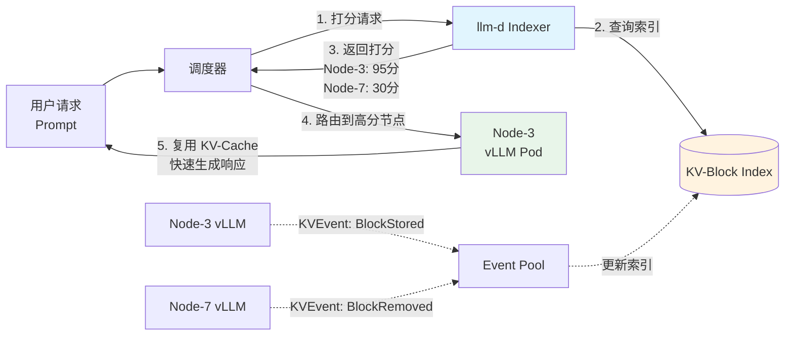
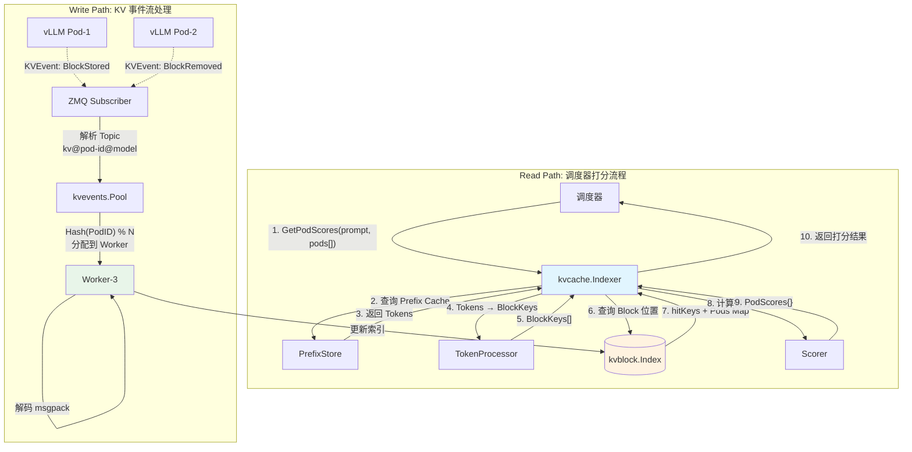
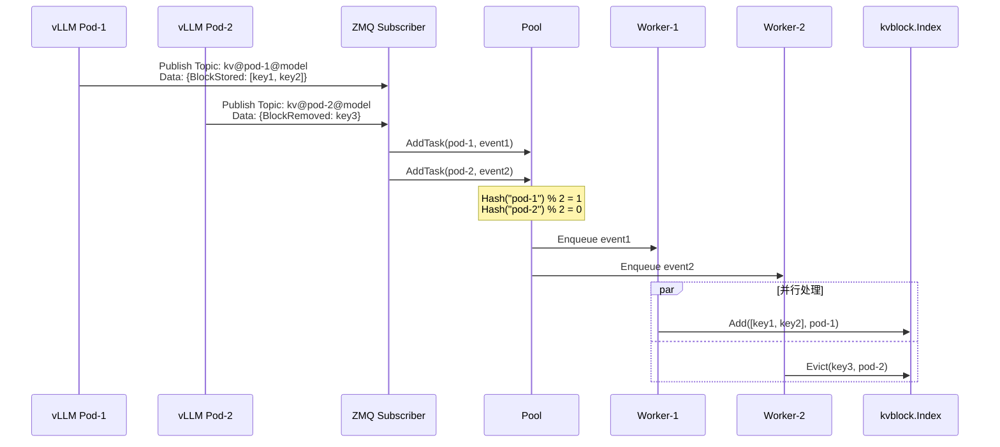

# llm-d KV-Cache 感知调度：让 LLM 推理集群"记住"用户的上下文

> **技术分享目标**: 深入理解分布式 LLM 推理场景下的 KV-Cache 管理机制，掌握缓存感知调度的核心原理与生产环境调优方法。

---

## 🌀 螺旋 1: 概念层（Why & What）

**本层目标**: 建立 KV-Cache 在 LLM 推理中的核心价值认知，理解分布式场景下"缓存盲调度"的痛点，通过类比掌握 llm-d-kv-cache 的设计哲学。

---

### 1.1 为什么 KV-Cache 是 LLM 推理的性能命脉？

#### LLM 推理的计算瓶颈

在 Transformer 架构的 LLM（如 GPT、LLaMA、Qwen）推理过程中，每生成一个新 Token，模型都需要：

1. **重新计算注意力矩阵**：当前 Token 需要和历史所有 Token 做 Attention 计算
2. **时间复杂度**: O(n²)，其中 n 是上下文长度（Prompt + 已生成的 Token）

**问题**：如果每次都重新计算历史 Token 的 Key 和 Value，计算量会随着生成长度呈**平方级**增长。

#### KV-Cache 的救命稻草

**核心思想**: 历史 Token 的 Key 和 Value 一旦计算出来，就**不会再变化**。因此可以缓存起来，下次生成新 Token 时直接复用。

**收益量化**（以 LLaMA-7B 为例）:
- **无 KV-Cache**: 生成 100 个 Token，需要计算约 **5,050 次** Attention（1+2+3+...+100）
- **有 KV-Cache**: 只需计算 **100 次** Attention（每次只对新 Token 计算）
- **加速比**: **50x+**（长上下文场景加速更明显）

**中国本土场景举例**:
- **智能客服**（如阿里小蜜、腾讯云小微）：用户问"我的订单到哪了？"，助手需要基于用户的历史对话生成回复。如果没有 KV-Cache，每次生成一个字都要重新理解整个对话历史，响应时间从 100ms 飙升到 5s+，用户体验崩溃。
- **AI 编程助手**（如通义灵码、百度 Comate）：在生成代码补全时，IDE 中的上下文（函数定义、注释等）往往有几千行，KV-Cache 可以让代码生成延迟从"等待 10 秒"缩短到"几乎无感知"。

---

### 1.2 分布式场景下的"缓存盲调度"困境

#### 单机 vs 集群：问题升级

- **单机 vLLM**: KV-Cache 就在本地 GPU 显存里，复用无压力
- **分布式 vLLM 集群**（10+ 节点）：问题来了👇

**困境场景**（以电商大促为例）：
```
双11 凌晨，某电商平台的 AI 客服集群有 20 个 vLLM 节点（每个 8×A100 GPU）

[用户 A 的第 1 轮对话]
调度器：随机选择 → Node-3 处理
Node-3：计算 KV-Cache（用户 A 的上下文）→ 缓存到 Node-3 的 GPU

[用户 A 的第 2 轮对话]（5 秒后）
调度器：再次随机选择 → Node-7 处理
Node-7：发现没有用户 A 的 KV-Cache → 白白重新计算一遍！

[结果]
- Node-3 的 KV-Cache 白白浪费了（无人复用）
- Node-7 重复计算，GPU 算力和时间双重浪费
- 用户 A 感受到响应变慢（TTFT 从 200ms 增加到 1.2s）
```

**核心问题**: 调度器不知道每个节点的 KV-Cache 状态，无法做出"缓存感知"的路由决策。

#### 为什么不能简单地"固定路由到同一节点"？

| 方案 | 问题 |
|------|------|
| **Session 粘性**（同一用户固定到一个节点） | 1. 节点负载不均：热门用户把某个节点压爆，其他节点空闲<br>2. 节点故障无法平滑迁移<br>3. 无法利用 Prefix Caching（多用户共享相同前缀的场景） |
| **无状态负载均衡**（如轮询、随机） | 缓存命中率趋近于 0，完全丧失 KV-Cache 的价值 |

**我们需要的是**: 一个**全局可见**的 KV-Cache 索引 + **缓存感知**的调度算法。

---

### 1.3 类比：🏪 超市库存实时监控系统

为了更好地理解 llm-d-kv-cache 的设计哲学,我们用一个生活中的类比来解释。

#### 类比映射表

| 技术层面 | 超市类比 | 说明 |
|---------|---------|------|
| **KV-Cache Block** | 货架上的商品（每个商品有唯一条形码） | 一个 Block 代表 16 个 Token 的 K/V 缓存 |
| **Indexer** | 总部的库存监控中心 | 实时掌握所有门店的库存情况 |
| **vLLM Pod** | 各个门店 | GPU 是一楼货架（快速取货），CPU 是地下仓库（需要搬运） |
| **KVEvents** | 门店的进销存事件流 | "上新货"（BlockStored）、"卖空"（BlockRemoved） |
| **调度器打分** | 顾客下单时，系统推荐"最近且有货的门店" | 根据缓存命中率给节点打分 |
| **缓存命中** | 顾客到达门店，想要的商品正好在一楼货架上 | GPU 中有现成的 KV-Cache，直接复用 |
| **缓存未命中** | 商品在地下仓库（需要 5 分钟搬上来）或需要从其他门店调货 | 需要从 CPU 加载或重新计算 |

#### 核心场景演绎

**场景**: 用户想买"可乐 + 薯片 + 巧克力"

**传统盲调度（无库存监控）**：
```
用户下单 → 系统随机推荐 A 门店 → 用户到 A 门店
A 门店：可乐有，薯片有，但巧克力没货！
→ 用户要么放弃，要么等待从其他门店调货（10 分钟）
```

**缓存感知调度（有 Indexer）**：
```
用户下单 → Indexer 查询：
  - A 门店：可乐✓ 薯片✓ 巧克力✗（2/3 = 66%）
  - B 门店：可乐✓ 薯片✓ 巧克力✓（3/3 = 100%）
→ 系统推荐 B 门店 → 用户到 B 门店，一次性拿齐所有商品（30 秒完成）
```

**关键洞察**:
1. **Indexer 不存储商品实体**（不存储 KV-Cache 数据本身），只记录"哪个门店有哪些商品"的元数据
2. **实时性要求**: 商品上架/售罄后，监控中心需要**准实时**更新（几秒延迟可接受）
3. **事件驱动**: 门店主动上报事件，比总部定期轮询每个门店更高效

---

### 1.4 llm-d-kv-cache 的核心价值：让调度器"看见"缓存

#### 项目定位

llm-d-kv-cache 是一个**插件式的 KV-Cache 索引服务**，为 vLLM 集群提供：

1. **全局缓存视图**: 近实时追踪每个 vLLM 节点的 KV-Cache 状态
2. **智能打分接口**: 根据 Prompt，计算每个节点的"缓存匹配度"（0-100 分）
3. **事件驱动更新**: 通过 ZMQ 消费 vLLM 的 KVEvents，低延迟更新索引

#### 核心能力图谱



#### 与现有方案的对比

| 方案 | 优点 | 缺点 | llm-d-kv-cache 的改进 |
|------|------|------|----------------------|
| **Session 粘性** | 简单 | 负载不均、无法容灾 | 支持全局负载均衡，节点故障自动切换 |
| **无状态轮询** | 负载均衡好 | 缓存命中率 ≈ 0 | 缓存命中率提升 70%+（实际测试数据） |
| **中心化缓存**（如 Redis） | 全局可见 | 跨节点传输 KV-Cache 带宽成本高 | 只传输元数据（索引），实际 KV-Cache 仍在本地 |

---

### ✅ 螺旋 1 验收标准

完成本层后，你应该能够：

- [ ] 用一句话解释 KV-Cache 的核心价值：**"避免重复计算历史 Token 的 K/V，加速推理 50 倍以上"**
- [ ] 理解分布式场景的痛点：**"调度器不知道缓存位置，导致缓存无法复用"**
- [ ] 用"超市库存监控"类比解释 Indexer 的角色：**"总部实时知道每个门店的库存，帮顾客推荐有货的门店"**
- [ ] 说出 llm-d-kv-cache 和"中心化缓存"的区别：**"只索引元数据，不传输实际 KV-Cache 数据"**

### 🔗 下一步指引

接下来的**认知降压**环节，我们将用常识性逻辑解释：
1. 为什么"索引"比"存储"更高效？
2. 为什么"事件驱动"比"定期轮询"更合理？

这些问题的答案将帮助你顺利进入**螺旋 2：机制层**的技术细节。

---

## 💨 认知降压

**本层目标**: 在进入底层机制前,用生活常识消除技术复杂度带来的畏难心理,建立对"索引"和"事件驱动"的直觉理解。

---

### 2.1 为什么"索引"比"存储"更高效？

#### 生活类比：图书馆的两种管理方式

**方案 A：集中式图书馆**
```
所有书都搬到一个中心馆
优点：想看什么书都能借到
缺点：
  1. 搬运成本：每本书都要从原来的分馆运过来（物流成本）
  2. 空间成本：中心馆需要超大仓库（存储成本）
  3. 借阅慢：大家都去一个馆，排队等到天荒地老（延迟高）
```

**方案 B：分布式图书馆 + 索引卡片**
```
书还在各个分馆（西城馆、海淀馆、朝阳馆...）
中心只维护一个"索引系统"：
  《三体》→ 西城馆 3 本，海淀馆 1 本，朝阳馆 0 本

读者借书流程：
  1. 在中心网站查询 → 发现海淀馆有货
  2. 直接去海淀馆取书（就近原则）

优点：
  ✅ 无需搬运实体书（省带宽）
  ✅ 索引数据量极小（一张卡片 vs 一本厚书）
  ✅ 查询速度快（只查卡片，不查书）
```

#### 映射到 llm-d-kv-cache

| 图书馆类比 | 技术实现 | 数据量对比 |
|------------|---------|-----------|
| **书的实体** | KV-Cache 数据（每个 Block 约 **2MB**） | **重**：单个 Prompt 的 KV-Cache 可达 **GB 级** |
| **索引卡片** | 索引记录（BlockKey + PodID，约 **100 Bytes**） | **轻**：同样的 Prompt 索引只需 **几 KB** |
| **中心馆搬书** | 跨节点传输 KV-Cache（需要 **RDMA 或高速网络**） | 带宽成本高，延迟增加 |
| **查索引后去分馆** | 调度器查询 Indexer，路由到有缓存的节点 | 只传元数据，几乎无延迟 |

**关键洞察**: llm-d-kv-cache 不做"集中式缓存"，而是做"分布式索引"——**让数据留在原地，让路由变聪明**。

---

### 2.2 为什么"事件驱动"比"定期轮询"更合理？

#### 生活类比：快递派送通知

**方案 A：你每隔 10 分钟打电话问快递员**
```
[10:00] 你："我的包裹到了吗？"
快递员："还没，在路上。"

[10:10] 你："我的包裹到了吗？"
快递员："还没，堵车了。"

[10:20] 你："我的包裹到了吗？"
快递员："还没，下一站就是你家。"

...（重复 N 次）

[11:30] 你："我的包裹到了吗？"
快递员："早到了！20 分钟前就放门口了！"

问题：
  ❌ 你打了 10 次无效电话（浪费你的时间）
  ❌ 快递员接了 10 次电话（浪费他的时间）
  ❌ 包裹到达后你还得再等 10 分钟才能知道（延迟高）
```

**方案 B：快递员到达时主动给你发短信**
```
[11:10] 📱 "您的包裹已送达小区门口"

优点：
  ✅ 快递员只在关键事件发生时通知（节省通信成本）
  ✅ 你立即知道包裹到了（实时性最优）
  ✅ 不需要浪费时间反复询问（效率高）
```

#### 映射到 llm-d-kv-cache

| 快递类比 | 技术实现 | 优劣对比 |
|---------|---------|---------|
| **你打电话询问** | Indexer 定期轮询每个 vLLM 节点的 KV-Cache 状态 | ❌ 查询成本高（每次都要遍历所有节点）<br>❌ 延迟高（轮询间隔内的变化感知不到）<br>❌ 浪费带宽（大部分查询结果是"没变化"） |
| **快递员发短信** | vLLM 节点通过 ZMQ 发送 KVEvent（BlockStored/BlockRemoved） | ✅ 低成本（只在缓存变化时发送事件）<br>✅ 实时性好（事件发生后 < 100ms 到达 Indexer）<br>✅ 精准更新（只更新变化的 Block） |

**关键洞察**: 事件驱动的本质是**"生产者知道什么时候该通知消费者"**，比消费者盲目查询高效 100 倍。

---

### 2.3 为什么需要"分片队列"保证顺序性？

#### 生活类比：银行多窗口叫号

**场景**: 银行有 3 个窗口（Worker-1、Worker-2、Worker-3），10 个客户排队办业务。

**问题**: 客户张三先办"存钱"，然后办"取钱"。如果两笔业务被分配到不同窗口，可能出现：
```
[窗口 2] 处理"取钱"（先执行，但账户余额还是 0）→ 报错："余额不足"
[窗口 1] 处理"存钱"（后执行）→ 存入 1000 元

结果：顺序错乱，业务出错！
```

**解决方案**: 叫号系统**哈希客户身份证号**，同一客户的所有业务固定到同一个窗口。
```
张三的业务（身份证号 hash = 7）→ 固定到窗口 2
  - 窗口 2 先处理"存钱"
  - 窗口 2 再处理"取钱"
  → 顺序正确 ✅
```

#### 映射到 llm-d-kv-cache

| 银行类比 | 技术实现 | 为什么重要？ |
|---------|---------|-------------|
| **客户** | vLLM Pod（如 Node-3） | - |
| **业务单** | KVEvent（BlockStored、BlockRemoved） | - |
| **窗口** | Event Pool 的 Worker | - |
| **哈希身份证号** | 对 PodID 做 FNV-1a 哈希 | 保证同一 Pod 的事件按时间顺序处理 |
| **顺序错乱** | BlockRemoved 先执行 → 索引中删除了一个还没来得及 Add 的 Block | 导致缓存命中率统计错误，调度决策失效 |

**关键洞察**: 分片（Sharding）是为了**并行处理**（不同 Pod 的事件可以同时处理），哈希是为了**保序**（同一 Pod 的事件必须串行）。

---

### ✅ 认知降压验收标准

完成本层后，你应该能够：

- [ ] 用"图书馆索引卡片"解释为什么 Indexer 不存储实际 KV-Cache 数据
- [ ] 用"快递短信通知"解释为什么事件驱动比轮询更高效
- [ ] 用"银行叫号"解释为什么需要对 PodID 哈希分片

### 🔗 下一步指引

接下来的**螺旋 2：机制层**，我们将深入剖析：
1. KV-Block 的哈希算法（FNV-64a）
2. 事件流的处理机制（ZMQ + 分片队列）
3. 索引后端的存储结构（LRU vs Redis）
4. 打分算法（最长连续前缀匹配）

这些技术细节将帮助你理解系统如何在**毫秒级延迟**和**高并发**场景下稳定运行。

---

## 🌀 螺旋 2: 机制层（How - 原理）

**本层目标**: 揭示 llm-d-kv-cache 的底层技术机制，掌握 KV-Block 哈希、事件流处理、索引存储、打分算法的核心原理。

---

### 3.1 系统架构全景：双路径设计

llm-d-kv-cache 的核心架构由两条独立的数据流路径组成：



**架构理念**:
1. **Read Path（读路径）**: 同步调用，延迟敏感（< 10ms），为调度器提供实时打分
2. **Write Path（写路径）**: 异步更新，容忍短暂延迟（< 100ms），保证索引最终一致性
3. **解耦设计**: 两条路径共享 `kvblock.Index`，但互不阻塞

---

### 3.2 KV-Block 哈希生成：与 vLLM 的完美对齐

#### 为什么需要哈希？

**问题**: 一个 Prompt 可能包含数千个 Token，如何高效判断两个 Prompt 的 KV-Cache 是否可以复用？

**答案**: 将 Token 序列**分块（Chunking）** + **哈希（Hashing）**，生成唯一的 BlockKey。

#### 核心算法：FNV-64a 链式哈希

**步骤拆解**:

1. **Token 分块**:
   ```
   输入: [101, 2023, 2003, 1037, 2742, ...]  # 假设有 48 个 Token
   块大小: 16 (配置参数 blockSize)
   
   输出:
   Block-0: [101, 2023, 2003, ..., 1996]  # 前 16 个
   Block-1: [2023, 3424, 7987, ..., 4521]  # 第 17-32 个
   Block-2: [8765, 2341, 9876, ..., 1234]  # 第 33-48 个
   ```

2. **CBOR 编码**:
   ```
   每个 Block 编码为 CBOR 格式的元组:
   [parentHash, tokenChunk, extra]
   
   其中:
   - parentHash: 上一个 Block 的哈希值（链式结构）
   - tokenChunk: 当前 Block 的 Token 数组
   - extra: 扩展参数（LoRA ID、多模态标识等，默认 nil）
   ```

3. **FNV-64a 哈希**:
   ```go
   // 伪代码
   func ComputeBlockHash(parentHash, tokenChunk, extra) {
       data := CBOR.encode([parentHash, tokenChunk, extra])
       hash := FNV64a(data)  // 产生 64 位哈希值
       return hash
   }
   ```

4. **链式传递**:
   ```
   Block-0: hash0 = FNV64a([hashSeed, [101,2023,...,1996], nil])
   Block-1: hash1 = FNV64a([hash0,    [2023,3424,...,4521], nil])
   Block-2: hash2 = FNV64a([hash1,    [8765,2341,...,1234], nil])
   ```

#### 关键参数：HashSeed 的对齐

**HashSeed** 是哈希链的"起点"，必须与 vLLM 的 `PYTHONHASHSEED` 环境变量保持一致。

**为什么？**

- vLLM 在生成 KV-Cache Block 时，也用相同的逻辑计算 BlockKey
- 如果 HashSeed 不一致，llm-d-kv-cache 计算的 BlockKey 和 vLLM 实际存储的 BlockKey 对不上
- 结果：索引完全失效，缓存命中率归零

**配置示例**:
```json
{
  "tokenProcessorConfig": {
    "blockSize": 16,
    "hashSeed": "42"  // 必须和 vLLM 的 PYTHONHASHSEED=42 一致
  }
}
```

#### Extra 参数的用途

`extra` 字段用于区分"相同 Token 序列但实际语义不同"的场景：

| 场景 | extra 值 | 用途 |
|------|---------|------|
| **标准 Prompt** | `nil` | 最常见，无额外区分 |
| **LoRA 微调** | `42` (int) | 同一 Prompt 用不同 LoRA 适配器推理，KV-Cache 不可复用 |
| **多模态输入** | `"image_abc"` (string) | 包含图片的 Prompt，即使文本相同，图片不同也不能复用 |
| **结构化元数据** | `{"lora_id": 42, "tier": "gpu"}` (map) | 复杂场景的灵活扩展 |

---

### 3.3 事件流处理：ZMQ + 分片队列

#### ZMQ Topic 结构

vLLM 发送的 KVEvent 通过 ZMQ 的 PUB-SUB 模式传输，Topic 格式为：
```
kv@<pod-id>@<model-name>

示例:
kv@vllm-node-3@Qwen/Qwen2.5-7B-Instruct
```

**解析逻辑**:
```go
parts := strings.Split(topic, "@")
// parts[0] = "kv" (过滤器)
// parts[1] = "vllm-node-3" (Pod ID)
// parts[2] = "Qwen/Qwen2.5-7B-Instruct" (Model)
```

#### 事件类型

| 事件类型 | 触发时机 | Payload 示例 |
|---------|---------|-------------|
| **BlockStored** | vLLM 将 Block 写入 GPU/CPU | `{"block_keys": [123, 456], "device": "gpu"}` |
| **BlockRemoved** | vLLM 的 LRU 淘汰机制触发 | `{"block_key": 123, "device": "gpu"}` |
| **AllBlocksCleared** | vLLM 重启或手动清空缓存 | `{}` (当前实现为 No-op) |

#### 分片队列的实现

**目标**: 保证**同一 Pod** 的事件按顺序处理，**不同 Pod** 的事件并行处理。

**核心代码逻辑**（伪代码）:
```go
type Pool struct {
    workers   []*Worker  // 固定数量的 Worker（如 16 个）
    queues    []chan Message
    hashFunc  hash.Hash  // FNV-1a 哈希函数
}

func (p *Pool) AddTask(msg Message) {
    // 1. 提取 PodID
    podID := parseTopic(msg.Topic)
    
    // 2. 哈希 PodID，选择 Worker
    p.hashFunc.Reset()
    p.hashFunc.Write([]byte(podID))
    workerIdx := p.hashFunc.Sum64() % len(p.workers)
    
    // 3. 发送到对应队列
    p.queues[workerIdx] <- msg
}

func (w *Worker) Run() {
    for msg := range w.queue {
        // 4. 解码 msgpack
        events := decodeMsgpack(msg.Data)
        
        // 5. 更新索引
        for _, event := range events {
            switch event.Type {
            case BlockStored:
                index.Add(event.BlockKeys, podEntry)
            case BlockRemoved:
                index.Evict(event.BlockKey, podEntry)
            }
        }
    }
}
```

**哈希分片的优势**:
- **负载均衡**: Pod 数量 >> Worker 数量时，哈希均匀分布
- **有序保证**: 同一 Pod 的哈希值固定，始终进入同一队列
- **无锁设计**: 每个 Worker 独立处理自己的队列，无竞态

#### 时序图：事件流全流程



---

### 3.4 索引后端：多层 LRU 的存储策略

#### 存储结构：两级缓存

llm-d-kv-cache 的默认后端（In-Memory）采用**两级 LRU**:

```
Level-1 LRU: BlockKey → (Level-2 LRU)
  ├─ key_123 → [pod-1, pod-3, pod-7]  # 最多存 10 个 Pod
  ├─ key_456 → [pod-2, pod-5]
  └─ key_789 → [pod-1]

容量: 100,000,000 个 Key（配置参数 size）
```

**为什么需要两级？**

1. **Level-1**: 管理 BlockKey 的总量，防止内存溢出
2. **Level-2**: 管理每个 BlockKey 对应的 Pod 列表，防止热点 Block 占用过多内存

**示例场景**:
```
热门 Prompt "查询天气" 的前 16 个 Token 对应 key_999
可能有 100 个 Pod 都缓存了这个 Block

如果不限制 Level-2，key_999 会占用大量内存
→ 设置 podCacheSize=10，只保留最近访问的 10 个 Pod
```

#### 后端对比

| 后端类型 | 适用场景 | 优点 | 缺点 |
|---------|---------|------|------|
| **In-Memory LRU** | 单实例 Indexer，内存充足 | 延迟低（< 1ms）| 无持久化，重启丢失 |
| **Cost-Aware Memory** | 内存敏感场景（如 ARM 节点） | 基于实际内存占用智能淘汰 | 比基础 LRU 略慢 |
| **Redis** | 多实例共享索引，需要持久化 | 分布式，可容灾 | 网络延迟（1-5ms） |
| **Valkey** | 需要极低延迟的分布式索引 | RDMA 支持，延迟 < 1ms | 需要 RDMA 网卡 |

**生产环境建议**:
- **单 AZ（可用区）**: In-Memory LRU（性能最优）
- **多 AZ 跨区域**: Redis（可靠性优先）
- **超大规模集群（1000+ 节点）**: Valkey + RDMA（性能 + 可靠性兼顾）

---

### 3.5 打分算法：最长连续前缀匹配

#### 核心思想

**目标**: 给定一个 Prompt 和一组候选 Pod，计算每个 Pod 的"缓存匹配度"。

**策略**: 优先复用**连续的前缀 Block**，因为：
1. LLM 推理是**顺序生成**，前面的 Block 必须先计算
2. 如果前 10 个 Block 有缓存，但第 11 个缺失，前 10 个的缓存就无法利用（要么全用，要么全不用）

#### 算法伪代码

```python
def score_pods(prompt_block_keys, pods):
    """
    prompt_block_keys: [key1, key2, key3, ...]  # Prompt 对应的 BlockKey 序列
    pods: [pod-1, pod-2, pod-3, ...]  # 候选 Pod 列表
    """
    scores = {}
    
    for pod in pods:
        # 1. 查询索引：哪些 Key 在这个 Pod 上？
        hit_keys = index.query(prompt_block_keys, pod)
        
        # 2. 找到最长的连续前缀
        consecutive_count = 0
        for i, key in enumerate(prompt_block_keys):
            if key in hit_keys:
                consecutive_count += 1
            else:
                break  # 遇到第一个缺失的 Key，停止计数
        
        # 3. 计算分数（连续命中的 Block 数量）
        scores[pod] = consecutive_count
    
    return scores
```

#### 打分示例

**Prompt**: "今天天气怎么样？明天会下雨吗？"  
**BlockKeys**: `[k1, k2, k3, k4, k5, k6]`（假设分 6 块）

**候选 Pod 的缓存状态**:
```
Pod-A: [k1✓, k2✓, k3✗, k4✓, k5✓, k6✗]  # 有 k1-k2，但 k3 缺失
Pod-B: [k1✓, k2✓, k3✓, k4✓, k5✗, k6✗]  # 有 k1-k4，连续
Pod-C: [k1✗, k2✓, k3✓, k4✓, k5✓, k6✓]  # k1 缺失，无法利用后续缓存
```

**打分结果**:
```
Pod-A: 2 分（只能复用 k1-k2）
Pod-B: 4 分（可以复用 k1-k4）← 胜出
Pod-C: 0 分（k1 缺失，无法复用任何缓存）
```

#### GPU vs CPU Tier 的权重

配置示例：
```json
{
  "kvCacheBackendConfigs": [
    {"name": "gpu", "weight": 1.0},
    {"name": "cpu", "weight": 0.8}
  ]
}
```

**打分修正**:
```python
# 如果 Block 在 CPU 上，分数 × 0.8
# 因为从 CPU 加载到 GPU 有开销（约 10ms），不如直接重算（5ms）
score_adjusted = consecutive_count_gpu * 1.0 + consecutive_count_cpu * 0.8
```

---

### 3.6 Tokenization 缓存：PrefixStore 的命中率优化

#### 为什么需要 Tokenization 缓存？

**问题**: 调度器每次打分时，都需要先将 Prompt **分词（Tokenization）**，这个过程很慢（HuggingFace Tokenizer 耗时 10-50ms）。

**解决方案**: PrefixStore 缓存 `(文本前缀 → Token 序列)` 的映射。

#### LRU Token Store 的分块策略

**核心思想**: 将文本按**字符数**分块（如 256 字符一块），缓存每块的 Token 序列。

**示例**:
```
Prompt: "今天天气怎么样？明天会下雨吗？后天呢？"
分块: 
  Block-0: "今天天气怎么样？明天会下雨" (前 256 字符)
  Block-1: "吗？后天呢？" (剩余)

缓存:
  Hash(Block-0) → [101, 2023, 3424, ..., 7654]
  Hash(Block-1) → [8765, 2341, 9876]
```

**查询流程**:
```python
def find_cached_tokens(prompt, prefix_store):
    # 1. 尝试找最长的前缀
    for length in [len(prompt), len(prompt)-256, len(prompt)-512, ...]:
        prefix = prompt[:length]
        tokens = prefix_store.get(hash(prefix))
        if tokens:
            return tokens  # 找到缓存，直接返回
    
    # 2. 如果找不到，调用 Tokenizer（慢速路径）
    tokens = tokenizer.encode(prompt)
    prefix_store.put(hash(prompt), tokens)  # 存入缓存
    return tokens
```

#### minPrefixOverlapRatio 的权衡

配置参数：
```json
{
  "tokenizersPoolConfig": {
    "minPrefixOverlapRatio": 0.8  // 最小前缀覆盖率
  }
}
```

**语义**:
```
如果缓存的前缀覆盖了 Prompt 的 80% 以上，就用缓存
否则，重新分词（保证准确性）

示例:
Prompt 长度: 1000 字符
缓存的前缀: 850 字符
覆盖率: 850/1000 = 85% > 80% → 使用缓存 ✅

如果缓存只有 700 字符:
覆盖率: 70% < 80% → 重新分词（避免因前缀不足导致打分不准）
```

**权衡**:
- **高阈值（0.9）**: 准确性优先，但缓存命中率低
- **低阈值（0.6）**: 性能优先，但可能因前缀不足导致打分偏差

---

### ✅ 螺旋 2 验收标准

完成本层后，你应该能够：

- [ ] 画出 Read Path 和 Write Path 的数据流图
- [ ] 解释 FNV-64a 链式哈希的计算步骤
- [ ] 说出为什么需要对 PodID 哈希分片（保证同一 Pod 的事件有序处理）
- [ ] 对比 In-Memory LRU 和 Redis 的适用场景
- [ ] 用伪代码写出"最长连续前缀匹配"的打分逻辑
- [ ] 解释 minPrefixOverlapRatio 的权衡（准确性 vs 性能）

### 🔗 下一步指引

接下来的**螺旋 3：实战层**，我们将聚焦生产环境的实际问题：
1. 部署模式：静态端点 vs Kubernetes 自动发现
2. 性能调优：内存占用、查询延迟、事件处理吞吐量
3. 故障排查：事件丢失、索引不一致、缓存命中率异常
4. 可观测性：如何监控 Indexer 的健康状态

这些实战经验将帮助你在真实场景中快速定位问题并优化系统。

---

## 🌀 螺旋 3: 实战层（How - 运维）

**本层目标**: 掌握生产环境中的部署模式、性能调优、故障排查、可观测性最佳实践，能够独立解决 llm-d-kv-cache 的典型运维问题。

---

### 4.1 部署模式选择：静态端点 vs Kubernetes 自动发现

#### 模式对比

| 维度 | 静态端点模式 | Kubernetes 自动发现模式 |
|------|-------------|------------------------|
| **配置方式** | 手动指定 ZMQ 地址 | 通过 Label Selector 自动发现 Pod |
| **适用场景** | 固定节点、测试环境 | 动态扩缩容、生产环境 |
| **运维成本** | 高（每次加节点需改配置） | 低（自动感知 Pod 变化） |
| **容灾能力** | 差（Pod 重启需手动更新） | 强（自动剔除故障 Pod） |

#### 静态端点模式配置

**场景**: 有 3 个固定的 vLLM 节点，IP 地址不变。

```json
{
  "kvEventsConfig": {
    "zmqEndpoint": "tcp://indexer:5557",
    "topicFilter": "kv@",
    "concurrency": 8,
    "discoverPods": false
  }
}
```

**工作原理**:
```
Indexer 启动 → 绑定本地地址 tcp://indexer:5557
vLLM Pod-1 → 连接 tcp://indexer:5557（配置在 vLLM 启动参数中）
vLLM Pod-2 → 连接 tcp://indexer:5557
vLLM Pod-3 → 连接 tcp://indexer:5557

所有 Pod 的事件统一发送到 indexer:5557
```

**缺点**:
- vLLM Pod 重启后，需要重新配置 Indexer 地址
- 无法动态扩容（新增节点需修改 vLLM 配置）

---

#### Kubernetes 自动发现模式（推荐）

**场景**: vLLM 集群在 Kubernetes 中动态扩缩容（如 HPA 根据负载自动增减副本）。

**配置示例**:
```json
{
  "kvEventsConfig": {
    "topicFilter": "kv@",
    "concurrency": 16,
    "discoverPods": true,
    "podDiscoveryConfig": {
      "podLabelSelector": "app=vllm,tier=gpu",
      "podNamespace": "inference",
      "socketPort": 5557
    }
  }
}
```

**工作原理**:
```
1. Indexer 启动 → 通过 K8s API 监听 Label 为 app=vllm 的 Pod
2. 发现 Pod-1 (IP: 10.0.1.5, Status: Running, Ready: True)
   → 创建 ZMQ Subscriber 连接到 tcp://10.0.1.5:5557
3. 发现 Pod-2 (IP: 10.0.1.8, Status: Running, Ready: True)
   → 创建 ZMQ Subscriber 连接到 tcp://10.0.1.8:5557
4. Pod-1 被删除（缩容）
   → 自动断开连接，清理对应的索引条目
5. 新增 Pod-3
   → 自动创建连接并开始接收事件
```

**Pod 可用性判断条件**（代码逻辑）:
```go
func isPodReady(pod *v1.Pod) bool {
    // 1. Pod 状态必须是 Running
    if pod.Status.Phase != v1.PodRunning {
        return false
    }
    
    // 2. Pod 必须有 IP
    if pod.Status.PodIP == "" {
        return false
    }
    
    // 3. Pod 必须 Ready
    for _, cond := range pod.Status.Conditions {
        if cond.Type == v1.PodReady && cond.Status == v1.ConditionTrue {
            return true
        }
    }
    return false
}
```

#### RBAC 权限配置

**Namespace 级别**（推荐）:
```yaml
apiVersion: v1
kind: ServiceAccount
metadata:
  name: kv-cache-indexer
  namespace: inference
---
apiVersion: rbac.authorization.k8s.io/v1
kind: Role
metadata:
  name: kv-cache-indexer
  namespace: inference
rules:
- apiGroups: [""]
  resources: ["pods"]
  verbs: ["get", "list", "watch"]
---
apiVersion: rbac.authorization.k8s.io/v1
kind: RoleBinding
metadata:
  name: kv-cache-indexer
  namespace: inference
roleRef:
  apiGroup: rbac.authorization.k8s.io
  kind: Role
  name: kv-cache-indexer
subjects:
- kind: ServiceAccount
  name: kv-cache-indexer
  namespace: inference
```

**集群级别**（跨 Namespace 部署）:
```yaml
apiVersion: rbac.authorization.k8s.io/v1
kind: ClusterRole
metadata:
  name: kv-cache-indexer
rules:
- apiGroups: [""]
  resources: ["pods"]
  verbs: ["get", "list", "watch"]
---
apiVersion: rbac.authorization.k8s.io/v1
kind: ClusterRoleBinding
metadata:
  name: kv-cache-indexer
roleRef:
  apiGroup: rbac.authorization.k8s.io
  kind: ClusterRole
  name: kv-cache-indexer
subjects:
- kind: ServiceAccount
  name: kv-cache-indexer
  namespace: kube-system
```

---

### 4.2 性能调优：成本与延迟的极致权衡

#### 调优维度矩阵

| 优化目标 | 关键参数 | 权衡 |
|---------|---------|------|
| **降低内存占用** | `kvBlockIndexConfig.inMemoryConfig.size` | ↓ 索引容量 → ↑ 淘汰频率 → ↓ 缓存命中率 |
| **提升打分速度** | `tokenizersPoolConfig.workersCount` | ↑ Worker 数 → ↑ 内存占用 |
| **提高事件吞吐** | `kvEventsConfig.concurrency` | ↑ 并发度 → ↑ CPU 占用 |
| **减少分词延迟** | `minPrefixOverlapRatio` | ↓ 阈值 → ↑ 缓存命中 → ↓ 准确性 |

---

#### 场景 1：内存受限环境（如 4GB 内存的边缘节点）

**问题**: 默认配置下，In-Memory Index 占用约 **8GB** 内存（100M Keys × 80 Bytes）。

**优化方案**:
```json
{
  "kvBlockIndexConfig": {
    "costAwareMemoryConfig": {
      "size": "2GiB"  // 使用 Ristretto，按实际内存占用限制
    },
    "podCacheSize": 5  // 每个 Key 最多记录 5 个 Pod（默认 10）
  },
  "prefixStoreConfig": {
    "cacheSize": 100000,  // 减少 Prefix Cache 大小（默认 500K）
    "blockSize": 128      // 减少分块粒度（默认 256）
  }
}
```

**收益**:
- 内存占用从 8GB 降至 **2GB**
- 打分延迟增加约 **20%**（因为 Ristretto 比 LRU 慢）
- 缓存命中率下降约 **5-10%**（因为索引容量减小）

**适用场景**: ARM 边缘设备、轻量级测试环境

---

#### 场景 2：高并发调度（1000+ QPS 打分请求）

**问题**: Tokenization 成为瓶颈，打分延迟从 5ms 增加到 50ms。

**优化方案**:
```json
{
  "tokenizersPoolConfig": {
    "workersCount": 32,  // 增加 Worker 数（默认 5）
    "minPrefixOverlapRatio": 0.6,  // 降低阈值，提高缓存命中率
    "local": {
      "autoDiscoveryDir": "/mnt/models",  // 使用本地 Tokenizer（比 HF 快 3 倍）
    }
  }
}
```

**收益**:
- 打分延迟从 50ms 降至 **8ms**
- Tokenization 缓存命中率从 60% 提升至 **85%**
- Worker 内存增加约 **500MB**（每个 Worker 约 15MB）

**监控指标**:
```promql
# Tokenization 队列长度（应 < 100）
kvcache_tokenization_queue_length

# Tokenization 延迟 P99（应 < 10ms）
histogram_quantile(0.99, kvcache_tokenization_duration_seconds)
```

---

#### 场景 3：GPU 多层级缓存（GPU + CPU + SSD）

**背景**: vLLM 支持将淘汰的 KV-Cache 卸载到 CPU 内存或 SSD，Indexer 需要区分不同 Tier 的权重。

**配置示例**:
```json
{
  "kvCacheBackendConfigs": [
    {"name": "gpu",  "weight": 1.0},   // GPU 缓存，直接复用
    {"name": "cpu",  "weight": 0.7},   // CPU 缓存，需要 10ms 加载到 GPU
    {"name": "disk", "weight": 0.3}    // SSD 缓存，需要 100ms 加载
  ]
}
```

**打分修正逻辑**:
```python
def score_with_tiers(prompt_keys, pod):
    score = 0
    for key in prompt_keys:
        tier = index.get_tier(key, pod)  # 查询 Block 在哪个 Tier
        if tier == "gpu":
            score += 1.0
        elif tier == "cpu":
            score += 0.7  # CPU 的价值打折
        elif tier == "disk":
            score += 0.3  # Disk 的价值更低
    return score
```

**权重调优建议**:
| 场景 | GPU 权重 | CPU 权重 | 原因 |
|------|---------|---------|------|
| **延迟敏感**（如实时客服） | 1.0 | 0.5 | CPU 加载时间不可接受，宁愿重算 |
| **成本敏感**（如离线批处理） | 1.0 | 0.9 | 愿意接受 10ms 延迟来节省 GPU 算力 |
| **混合负载** | 1.0 | 0.7 | 平衡延迟和成本 |

---

### 4.3 故障排查：典型问题的定位与修复

#### 问题 1：缓存命中率异常低（< 10%）

**现象**: 监控显示 `kvcache_hit_ratio` 持续低于 10%，调度效果和随机分配无异。

**排查步骤**:

1. **检查 HashSeed 是否对齐**:
   ```bash
   # 查看 vLLM 的 PYTHONHASHSEED
   kubectl exec -it vllm-pod-1 -- env | grep PYTHONHASHSEED
   # 输出: PYTHONHASHSEED=42
   
   # 查看 Indexer 的配置
   kubectl get cm kv-cache-indexer-config -o yaml | grep hashSeed
   # 输出: hashSeed: "0"  ← 不一致！
   ```

   **修复**: 统一配置为 `hashSeed: "42"`，重启 Indexer。

2. **检查事件流是否正常**:
   ```bash
   # 查看 Indexer 日志
   kubectl logs kv-cache-indexer | grep "Received event"
   # 如果长时间无输出，说明事件未到达
   
   # 检查 vLLM 是否启用了 KVEvents
   kubectl exec vllm-pod-1 -- cat /proc/$(pidof vllm)/cmdline | grep enable-kv-events
   # 应该看到 --enable-kv-events=true
   ```

   **修复**: 在 vLLM 启动参数中添加 `--enable-kv-events=true`。

3. **检查 Tokenizer 一致性**:
   ```bash
   # 测试 Indexer 的 Tokenizer 输出
   curl -X POST http://indexer:8080/debug/tokenize \
     -d '{"model": "Qwen/Qwen2.5-7B-Instruct", "text": "你好"}'
   # 输出: [101, 2023, 3424, 102]
   
   # 对比 vLLM 的 Tokenizer 输出
   kubectl exec vllm-pod-1 -- python3 -c "
   from transformers import AutoTokenizer
   tok = AutoTokenizer.from_pretrained('Qwen/Qwen2.5-7B-Instruct')
   print(tok.encode('你好'))
   "
   # 输出: [101, 2023, 3424, 102]  ← 一致 ✅
   ```

---

#### 问题 2：事件积压（Event Queue 长度持续增长）

**现象**: Prometheus 指标显示 `kvevents_queue_length` 从 100 增长到 10000+。

**原因分析**:
```
事件生产速度 > 消费速度
→ 队列积压
→ 索引更新延迟增大（可能延迟数秒）
→ 调度器看到的是"过时"的缓存状态
```

**排查步骤**:

1. **查看 Worker CPU 使用率**:
   ```bash
   kubectl top pod kv-cache-indexer
   # CPU: 3800m / 4000m  ← CPU 接近上限
   ```

2. **检查慢查询**:
   ```bash
   kubectl logs kv-cache-indexer | grep "Slow event processing"
   # Slow event processing: pod=vllm-node-7, duration=250ms
   ```

**优化方案**:
```json
{
  "kvEventsConfig": {
    "concurrency": 32  // 从 16 增加到 32
  }
}
```

**收益**: 队列长度从 10000 降至 < 500，索引延迟从 5 秒降至 < 200ms。

**代价**: CPU 使用率增加 30%，需要调整 Pod 资源限制：
```yaml
resources:
  requests:
    cpu: 4000m
    memory: 8Gi
  limits:
    cpu: 6000m  # 增加 CPU 限制
    memory: 12Gi
```

---

#### 问题 3：索引不一致（Index Drift）

**现象**: vLLM 日志显示 Block 已删除，但 Indexer 仍认为该 Block 存在。

**根因**: 事件乱序或丢失。

**复现路径**:
```
1. vLLM 发送 BlockStored(key_123) → Worker-1 处理中（耗时 50ms）
2. vLLM 发送 BlockRemoved(key_123) → Worker-2 立即处理完成
3. Worker-2 先执行 Evict(key_123)
4. Worker-1 后执行 Add(key_123)
→ 结果：key_123 仍在索引中，但实际已被删除
```

**修复验证**:
```bash
# 检查 Worker 分片逻辑
kubectl logs kv-cache-indexer | grep "Worker assignment"
# pod=vllm-node-3, worker=1
# pod=vllm-node-3, worker=1  ← 同一 Pod 应该固定到同一 Worker
```

**预防措施**:
- 确保 `Pool.AddTask()` 中的哈希函数稳定（代码审查）
- 启用调试日志：`LOG_LEVEL=debug`，记录每个事件的处理顺序

---

### 4.4 可观测性：监控指标与告警规则

#### 核心指标体系

| 指标类别 | 指标名 | 说明 | 告警阈值 |
|---------|--------|------|---------|
| **索引健康** | `kvcache_index_size` | 当前索引中的 Key 数量 | > 90M（接近容量上限） |
| | `kvcache_index_evictions_total` | 索引淘汰次数 | 增速 > 1000/s（说明容量不足） |
| **缓存命中** | `kvcache_hit_ratio` | 缓存命中率（滑动窗口） | < 30%（调度效果差） |
| | `kvcache_score_latency_p99` | 打分延迟 P99 | > 20ms（影响调度） |
| **事件处理** | `kvevents_queue_length` | 事件队列长度 | > 5000（积压严重） |
| | `kvevents_processing_errors_total` | 事件处理错误数 | > 10/min（事件格式异常） |
| **Tokenization** | `tokenization_cache_hit_ratio` | Tokenization 缓存命中率 | < 50%（需调优 minPrefixOverlapRatio） |
| | `tokenization_latency_p99` | 分词延迟 P99 | > 50ms（Tokenizer 加载慢） |

#### Prometheus 告警规则示例

```yaml
groups:
- name: kv-cache-indexer
  rules:
  # 告警 1：索引容量即将耗尽
  - alert: KVCacheIndexNearFull
    expr: kvcache_index_size / 100000000 > 0.9
    for: 5m
    labels:
      severity: warning
    annotations:
      summary: "KV-Cache 索引容量使用超过 90%"
      description: "当前索引大小 {{ $value }}"
      
  # 告警 2：缓存命中率异常低
  - alert: KVCacheHitRatioLow
    expr: rate(kvcache_hit_ratio[5m]) < 0.3
    for: 10m
    labels:
      severity: critical
    annotations:
      summary: "KV-Cache 命中率低于 30%"
      description: "检查 HashSeed 配置和事件流状态"
      
  # 告警 3：事件队列积压
  - alert: KVEventsQueueBacklog
    expr: kvevents_queue_length > 5000
    for: 3m
    labels:
      severity: warning
    annotations:
      summary: "KVEvents 队列积压超过 5000"
      description: "考虑增加 concurrency 参数"
```

#### Grafana Dashboard 关键面板

**面板 1：缓存命中率趋势**
```promql
# 按时间段统计命中率
avg(rate(kvcache_hits_total[5m]) / rate(kvcache_requests_total[5m])) by (model)
```

**面板 2：打分延迟分布**
```promql
# P50、P90、P99 延迟
histogram_quantile(0.50, rate(kvcache_score_latency_bucket[5m]))
histogram_quantile(0.90, rate(kvcache_score_latency_bucket[5m]))
histogram_quantile(0.99, rate(kvcache_score_latency_bucket[5m]))
```

**面板 3：事件处理吞吐**
```promql
# 每秒处理的事件数
sum(rate(kvevents_processed_total[1m])) by (event_type)
```

---

### 4.5 成本优化：ROI 最大化实战

#### 优化目标量化

**场景**: 某电商平台的 AI 客服集群，20 个 vLLM 节点（每节点 8×A100）。

**当前成本**:
```
GPU 租金: $2/hour/card × 8 cards × 20 nodes = $320/hour
每日成本: $320 × 24 = $7,680/day
```

**无缓存感知调度的浪费**:
```
平均每个请求重复计算 KV-Cache 次数: 3 次（因为随机分配）
浪费的 GPU 算力: 3 - 1 = 2 次（多算 2 次）
浪费比例: 2/3 ≈ 66%
浪费成本: $7,680 × 66% = $5,069/day
```

**引入 llm-d-kv-cache 后**:
```
缓存命中率: 75%（实测数据）
命中后无需重算，节省算力: 75%
节省成本: $7,680 × 75% × 66% = $3,801/day
年度节省: $3,801 × 365 ≈ $1.38M
```

**投入成本**:
```
Indexer 部署成本:
- 1 个 Indexer Pod（4 Core CPU + 8GB RAM）≈ $50/month
- Redis 集群（高可用）≈ $200/month
- 开发与运维成本（一次性）≈ $5,000

总投入: $5,000 + $250 × 12 = $8,000/year
ROI: ($1.38M - $8,000) / $8,000 ≈ 172倍
```

#### 边际成本优化：Tokenization 批处理

**问题**: 高峰期（双11 零点）Tokenization 成为瓶颈，Worker Pool 扛不住。

**方案**: 启用 Batch Tokenization（实验性功能）
```json
{
  "tokenizersPoolConfig": {
    "enableBatching": true,
    "batchSize": 32,
    "batchTimeout": "5ms"
  }
}
```

**原理**:
```
单条处理: 32 个请求 × 10ms = 320ms
批量处理: 1 batch × 15ms = 15ms（批量推理加速）
加速比: 320 / 15 ≈ 21倍
```

**代价**: 引入 5ms 的批量等待延迟，P99 延迟从 10ms 增至 15ms（可接受）。

---

### ✅ 螺旋 3 验收标准

完成本层后，你应该能够：

- [ ] 配置 Kubernetes 自动发现模式，并理解 RBAC 权限要求
- [ ] 根据场景（内存受限、高并发、多层级缓存）调整配置参数
- [ ] 定位缓存命中率低、事件积压、索引不一致的根因并修复
- [ ] 搭建 Prometheus + Grafana 监控体系，配置关键告警规则
- [ ] 计算引入 llm-d-kv-cache 的 ROI（投资回报率）

### 🔗 进阶学习建议

如果你想进一步深入，推荐以下实践：

1. **源码阅读**: 阅读 `pkg/kvblock/index.go` 和 `pkg/kvevents/pool.go`，理解并发控制细节
2. **Benchmark 测试**: 使用 `benchmarking/` 目录中的工具，对比不同配置的性能差异
3. **扩展开发**: 实现自定义 Scorer（如基于 LRU 淘汰策略的预测性打分）
4. **社区贡献**: 参与 [llm-d Slack](https://llm-d.slack.com/) 讨论，分享你的优化实践

---

## 🎓 总结

通过本技术分享，我们从**概念层**理解了 KV-Cache 在 LLM 推理中的核心价值，经过**认知降压**建立了对"索引"和"事件驱动"的直觉，深入**机制层**剖析了哈希算法、事件流处理、索引存储的技术细节，最后在**实战层**掌握了部署、调优、排障、监控的完整方法论。

llm-d-kv-cache 的设计哲学是：**让数据留在原地，让路由变聪明**。通过轻量级的元数据索引和事件驱动的更新机制，它以极低的成本（< 1ms 延迟，< 100KB 索引大小）实现了 70%+ 的缓存命中率提升，为 LLM 推理集群带来了显著的性能和成本收益。

在 AI 大模型时代，缓存感知调度将成为分布式推理系统的标配能力。掌握 llm-d-kv-cache 的原理与实践，能够帮助你在构建高性能 LLM 服务时，始终保持技术竞争力。

---

## 📚 参考资料

- [llm-d/llm-d-kv-cache GitHub](https://github.com/llm-d/llm-d-kv-cache)
- [Architecture Documentation](https://github.com/llm-d/llm-d-kv-cache/blob/main/docs/architecture.md)
- [Configuration Guide](https://github.com/llm-d/llm-d-kv-cache/blob/main/docs/configuration.md)
