# llm-d Inference Scheduler - 插件化推理路由引擎

> **核心价值**: 基于 Gateway API 的可扩展 LLM 推理调度器,通过 Filter-Scorer-Picker 三层插件实现智能路由  
> **技术栈**: Gateway API Inference Extension + Envoy ext-proc + Go  
> **关键指标**: TTFT -99%, 吞吐 +109%, KV-cache 命中率 >89%

---

## 🌀 螺旋 1: 概念层 - 为什么需要专用推理调度器?

### 本层目标
理解 LLM 推理的资源特性与传统负载均衡的矛盾,建立对"智能调度"必要性的认知,掌握 llm-d Inference Scheduler 在 Gateway API 生态中的架构定位。

---

### 1.1 LLM 推理的三大资源特性

传统微服务的负载均衡基于以下假设:
- ✅ 请求处理时间相对均匀 (10-100ms)
- ✅ 资源消耗可预测 (固定 CPU/内存)
- ✅ 无状态,实例间完全对等

**但 LLM 推理彻底打破了这些假设:**

| 维度 | 传统服务 | LLM 推理 | 问题 |
|------|---------|---------|------|
| **请求耗时** | 10-100ms | 100ms-30s (差 300x) | 短请求被长请求阻塞 |
| **内存需求** | 固定 | KV Cache 动态增长 | 某些 Pod 突然 OOM |
| **状态依赖** | 无状态 | 缓存命中率差异 90% | 重复计算浪费 |

**核心矛盾**: Round-robin 负载均衡无法感知这些差异,导致:
- 📉 **TTFT 抖动**: P95 延迟可达 P50 的 20 倍
- 💸 **资源浪费**: 缓存命中率从 90% 降至 12%
- ⚠️ **雪崩风险**: 长请求堆积导致单 Pod 过载

---

### 1.2 生产痛点案例 - 双11 AI 客服崩溃

**场景**: 某电商平台在双11 流量洪峰期的 AI 客服系统

```mermaid
sequenceDiagram
    participant U1 as 用户 1<br/>(询问订单状态)
    participant U2 as 用户 2<br/>(复杂退货问题)
    participant LB as K8s Service<br/>Round-robin
    participant P1 as Pod 1<br/>(队列: 5 个长请求)
    participant P2 as Pod 2<br/>(队列: 空)
    
    U1->>LB: "我的快递到哪了?"
    LB->>P1: 路由到 Pod 1
    Note over P1: 排队等待 5 个长请求<br/>预期 0.5s → 实际 25s
    P1--xU1: 超时失败
    
    U2->>LB: "如何处理商品损坏?"
    LB->>P2: 路由到 Pod 2  
    P2-->>U2: 200ms 响应
    
    Note over P2: Pod 2 空闲,但传统 LB<br/>无法智能分配更多流量
    
    style P1 fill:#ffebee
    style P2 fill:#e8f5e9
```

**实测数据**:
- 成功率: **87%** (13% 超时)
- TTFT P95: **6.2s** (用户不可接受)
- GPU 利用率: **45%** (资源严重浪费)

**根本原因**: K8s Service 对以下信息**完全盲视**:
1. 请求特征 (短 Prompt vs 长 Prompt)
2. Pod 状态 (队列深度、KV Cache 占用)
3. 缓存亲和性 (哪些 Pod 有历史上下文)

---

### 1.3 llm-d Inference Scheduler 的架构定位

**核心定位**: **Gateway 层的智能路由决策引擎**

llm-d Inference Scheduler 并非独立的负载均衡器,而是通过 **Envoy ext-proc** 扩展现有 Gateway (Istio/Envoy Gateway/kgateway) 的能力:

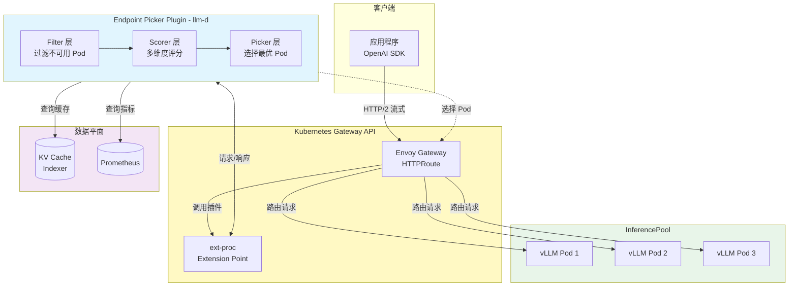

**与 GIE (Gateway API Inference Extension) 的关系**:

| 项目 | 职责 | 关系 |
|------|------|------|
| **GIE (Upstream)** | 定义 API 资源 (`InferencePool`, `InferenceModel`) 与调度框架 | 上游项目,通用推理调度标准 |
| **llm-d Scheduler** | 实现 llm-d 特定功能 (P/D 分离、Precise Prefix Cache) | 扩展 GIE,专注 LLM 场景 |

**功能分层**:

```
┌────────────────────────────────────────┐
│  llm-d Inference Scheduler             │  llm-d 特定实现
│  ├─ P/D Disaggregation                 │  - Prefill/Decode 分离
│  ├─ Precise Prefix Cache Scorer        │  - 实时 KV Cache 追踪
│  └─ NoHit LRU Scorer                   │  - 冷请求负载均衡
├────────────────────────────────────────┤
│  Gateway API Inference Extension (GIE) │  通用推理调度框架
│  ├─ InferencePool CRD                  │  - API 资源定义
│  ├─ Scheduler Plugin Framework         │  - 插件扩展机制
│  └─ Prefix Cache Scorer (基础版)        │  - 历史估算式缓存评分
├────────────────────────────────────────┤
│  Gateway API                           │  Kubernetes 标准
│  ├─ HTTPRoute                          │  - 路由配置
│  └─ ext-proc Extension Point           │  - 扩展点机制
└────────────────────────────────────────┘
```

---

### 1.4 三层插件架构 - Filter → Scorer → Picker

**核心设计哲学**: **组合优于继承,插件优于硬编码**

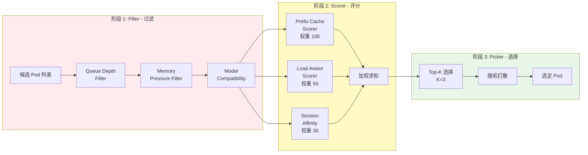

**设计优势**:

| 维度 | 传统硬编码 | llm-d 插件化 |
|------|-----------|------------|
| **扩展性** | 修改核心代码 | 新增插件文件 |
| **组合性** | 固定逻辑 | 灵活配置组合 |
| **测试性** | 集成测试 | 插件单元测试 |
| **社区化** | 维护者主导 | 社区贡献插件 |

**实际收益** (Qwen3-32B 高 Prefix 复用场景):

| 指标 | K8s Service | llm-d Scheduler | 提升 |
|------|-------------|----------------|------|
| **TTFT P50** | 6.2s | **136ms** | 📉 97.8% ↓ |
| **TTFT P95** | 12.5s | **157ms** | 📉 98.7% ↓ |
| **缓存命中率** | 12% | **89%** | 📈 +77% |
| **吞吐 (20 QPS)** | 9k tok/s | **11k tok/s** | 📈 +22% |

---

### ✅ 螺旋 1 验收标准

完成本层学习后,你应该能够:

- [ ] 列举 LLM 推理与传统微服务的三大差异: 资源需求不均、状态依赖、耗时波动
- [ ] 用一句话说明 llm-d Inference Scheduler 的核心价值: _"通过 Gateway API ext-proc 扩展点实现请求特征与 Pod 状态感知的智能路由"_
- [ ] 理解 llm-d Scheduler 与 GIE 的分工: GIE 提供框架,llm-d 实现 LLM 专属功能
- [ ] 说明三层插件架构的职责: Filter (排除) → Scorer (评分) → Picker (选择)

---

### 🔗 下一步

理解了"为什么需要"和"是什么"后,下一层将深入 **Filter-Scorer-Picker 三阶段算法的底层机制** 与 **核心插件的数学原理**

---

## 💨 认知降压 - 从"快递调度中心"理解智能路由

### 常识类比: 智能快递分拣系统

想象一个双11 期间的快递枢纽中心,每秒处理数千个包裹:

**❌ 传统轮询 (Round-robin) - 盲目排队**

```
包裹 A (同城,1kg,预期 1天送达)   → 车辆 1 (队列: 10 吨跨省货,5天送达)  
包裹 B (跨省,50kg,可批量运输)   → 车辆 2 (空载,去往同城)  
包裹 C (目的地与 A 相同)         → 车辆 3 (去反方向)
```

**结果**: 
- 同城快递跟着跨省车走慢了 5 天 (TTFT 劣化)
- 跨省大件占用同城快车,运力浪费 (资源利用率低)
- 相同目的地的包裹分散装车,无法拼车优化 (缓存未复用)

---

**✅ 智能分拣系统 (llm-d Scheduler) - 三阶段决策**

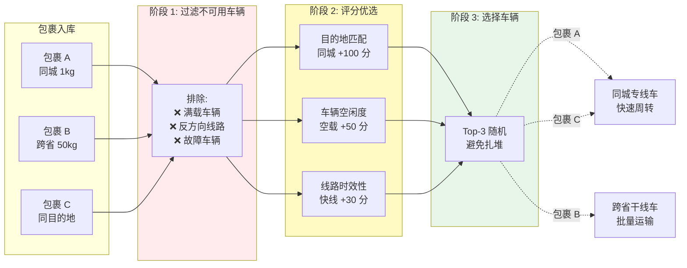

**分拣规则映射到调度算法**:

| 快递场景 | LLM 推理 | 调度层 |
|---------|---------|-------|
| **包裹类型** (同城/跨省) | 请求长度 (短/长 Prompt) | - |
| **目的地** | Prompt Hash (前缀特征) | - |
| **车辆** | vLLM Pod | - |
| **车辆载重** | 队列深度 (`queue_length`) | - |
| **满载车** | 队列已满 (`> max_num_seqs`) | **Filter** |
| **反方向线路** | 模型不匹配 (`model_id`) | **Filter** |
| **拼车路线** | 缓存命中 (相同 Prefix) | **Scorer** |
| **车辆空闲度** | 负载因子 (`1 - queue/max`) | **Scorer** |
| **满载发车** | 批处理触发 (`max_num_batched_tokens`) | vLLM 引擎 |
| **Top-3 随机** | 避免单车过载 | **Picker** |

---

### 为什么需要"智能"而非"简单"?

**场景 1: 缓存亲和性 (目的地拼车)**

```
包裹 D (去往北京朝阳区某小区)  
包裹 E (去往北京朝阳区同一小区)

智能分拣: D 和 E 都装上车辆 4 (已去过该小区,熟悉路线)
→ 节省 90% 的导航时间 (类比: KV Cache 命中)
```

**场景 2: 负载均衡 (车辆空闲度)**

```
车辆 1: 队列 100 件
车辆 2: 队列 5 件

Round-robin 可能继续往车辆 1 塞 → 超载
智能分拣: 新包裹优先分配车辆 2 → 均衡负载
```

**场景 3: 容错 (Top-K 随机)**

```
假设车辆 3 评分最高 (100 分)
车辆 4 和 5 评分也不错 (98 分)

Always Top-1: 所有包裹都给车辆 3 → 雪崩
Top-3 Random: 在前 3 名中随机 → 负载分散
```

---

### 核心洞察

1. **不是所有请求都平等**: 
   - 短请求走"快速通道"(低负载 Pod)
   - 长请求走"批处理专线"(高吞吐 Pod)

2. **历史状态可复用**:
   - 相同 Prefix 路由到同一 Pod → 缓存命中 → TTFT -90%

3. **动态调整策略**:
   - 高 Prefix 复用场景: `prefix-aware` 权重 100
   - 低 Prefix 复用场景: `load-aware` 权重 100

---

现在你已经建立了直观认知,下一层将揭开调度算法的精确实现细节

---

## 🌀 螺旋 2: 机制层 - Filter→Score→Select 三阶段算法

### 本层目标
掌握调度器的三阶段决策流程、核心插件的数学原理、与 KV Cache Indexer 的协同机制、配置系统的 YAML 结构。

---

### 2.1 完整调度流程时序图

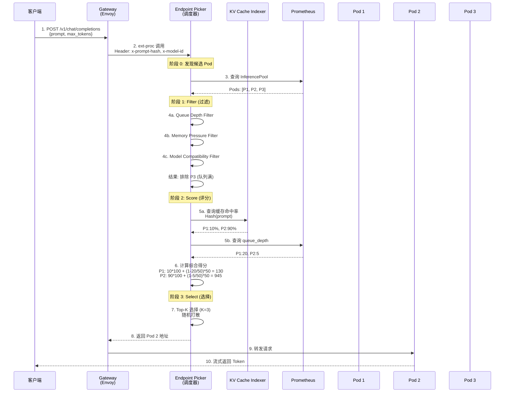

**关键时间节点**:
- 步骤 2-8: 调度决策耗时 **<10ms** (不阻塞推理)
- 步骤 5a: 缓存索引查询 **<1ms** (内存哈希表)
- 步骤 5b: Prometheus 查询 **<5ms** (指标缓存)

---

### 2.2 阶段 1: Filter 插件架构

#### Filter 接口定义

```go
// pkg/plugins/filter/interface.go
package filter

import "sigs.k8s.io/gateway-api-inference-extension/pkg/epp/scheduling/types"

type Filter interface {
    // Name 返回插件名称
    Name() string
    
    // Filter 过滤不可用 Pod
    // 返回值: 通过过滤的 Pod 列表
    Filter(ctx *types.SchedulingContext, pods []types.Pod) []types.Pod
}
```

---

#### 核心 Filter 实现

**Filter 1: Queue Depth Filter (队列深度过滤)**

```go
// 伪代码
type QueueDepthFilter struct {
    name          string
    maxQueueLength int  // 默认 50
}

func (f *QueueDepthFilter) Filter(ctx *types.SchedulingContext, pods []types.Pod) []types.Pod {
    filtered := []types.Pod{}
    
    for _, pod := range pods {
        // 从 Prometheus 查询队列深度
        queueDepth := getQueueDepth(pod.Name)
        
        if queueDepth < f.maxQueueLength {
            filtered = append(filtered, pod)
        } else {
            log.Debug("Pod %s filtered: queue_depth=%d > max=%d", 
                pod.Name, queueDepth, f.maxQueueLength)
        }
    }
    
    return filtered
}
```

**配置示例**:
```yaml
plugins:
  - type: queue-depth-filter
    parameters:
      maxQueueLength: 50  # 队列超 50 则过滤
```

---

**Filter 2: ByLabel Filter (标签选择器)**

```go
// pkg/plugins/filter/by_label.go
type ByLabel struct {
    name          string
    label         string     // 标签键
    validValues   []string   // 允许的值列表
    allowsNoLabel bool       // 是否允许无标签 Pod
}

func (f *ByLabel) Filter(ctx *types.SchedulingContext, pods []types.Pod) []types.Pod {
    filtered := []types.Pod{}
    
    for _, pod := range pods {
        podLabels := pod.GetPod().Labels
        labelValue, exists := podLabels[f.label]
        
        // 处理无标签情况
        if !exists {
            if f.allowsNoLabel {
                filtered = append(filtered, pod)
            }
            continue
        }
        
        // 检查值是否在允许列表中
        if contains(f.validValues, labelValue) {
            filtered = append(filtered, pod)
        }
    }
    
    return filtered
}
```

**配置示例** (P/D 分离场景):
```yaml
plugins:
  # Decode Filter
  - type: by-label
    name: decode-filter
    parameters:
      label: "llm-d.ai/role"
      validValues: ["decode", "both"]
      allowsNoLabel: false
  
  # Prefill Filter  
  - type: by-label
    name: prefill-filter
    parameters:
      label: "llm-d.ai/role"
      validValues: ["prefill"]
      allowsNoLabel: false
```

---

#### Filter 链式执行

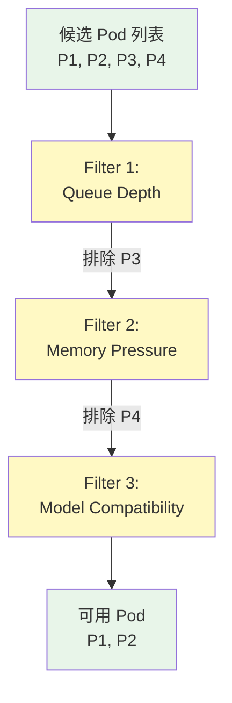

---

### 2.3 阶段 2: Scorer 插件架构

#### Scorer 接口定义

```go
// pkg/plugins/scorer/interface.go
package scorer

type Scorer interface {
    Name() string
    
    // Score 为 Pod 计算得分 (0-1 范围)
    // 最终得分 = score * weight
    Score(ctx *types.SchedulingContext, pod types.Pod) float64
}
```

---

#### Scorer 1: Precise Prefix Cache Scorer

**核心算法**: Hash Block 匹配

```python
# 伪代码
def prefix_cache_score(pod, request):
    # 1. 将 Prompt 分块并计算 Hash
    prompt_tokens = tokenize(request.prompt)
    hash_blocks = []
    
    for i in range(0, len(prompt_tokens), HASH_BLOCK_SIZE):
        block = prompt_tokens[i:i+HASH_BLOCK_SIZE]
        hash_val = hash(block, seed=HASH_SEED)
        hash_blocks.append(hash_val)
    
    # 2. 查询 KV Cache Indexer
    matched_blocks = 0
    for hash_val in hash_blocks:
        if kv_indexer.has_block(pod.id, hash_val):
            matched_blocks += 1
    
    # 3. 计算命中率 (0-1)
    hit_rate = matched_blocks / len(hash_blocks)
    return hit_rate
```

**配置参数**:

| 参数 | 默认值 | 调优建议 |
|------|--------|---------|
| `blockSize` | 64 | **必须**与 vLLM `--block-size` 一致 |
| `hashSeed` | "12345" | **必须**与 vLLM `PYTHONHASHSEED` 一致 |
| `maxPrefixBlocksToMatch` | 256 | 限制索引查询次数,避免长 Prompt 拖慢调度 |

**配置示例**:
```yaml
plugins:
  - type: precise-prefix-cache-scorer
    parameters:
      tokenProcessorConfig:
        blockSize: 64
        hashSeed: "12345"
      indexerConfig:
        kvBlockIndexConfig:
          enableMetrics: true
        tokenizersPoolConfig:
          modelName: "Qwen/Qwen3-32B"
          hf:
            huggingFaceToken: "${HF_TOKEN}"  # 自动读取环境变量
```

---

#### Scorer 2: Load-Aware Scorer

**核心算法**: 队列深度倒数

```python
def load_aware_score(pod):
    queue_depth = get_queue_depth(pod)
    max_queue = 50  # 容量上限
    
    # 负载因子: 队列越空得分越高
    load_factor = 1 - (queue_depth / max_queue)
    return load_factor  # 返回 0-1
```

**评分曲线**:

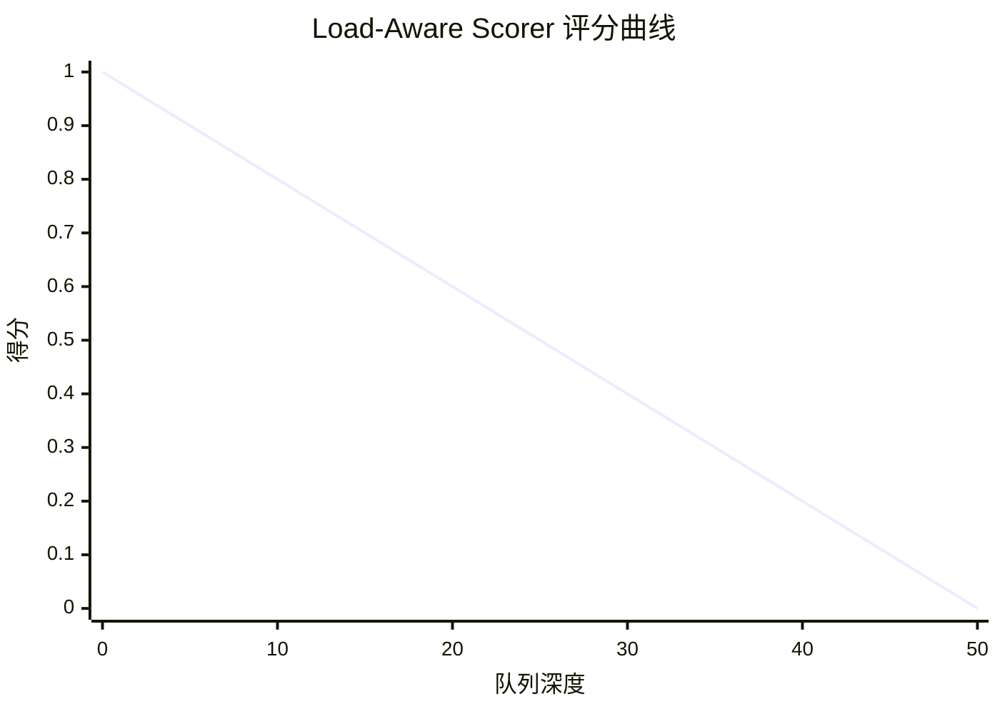

**配置示例**:
```yaml
plugins:
  - type: load-aware-scorer
    parameters:
      threshold: 50  # 队列深度阈值
```

---

#### Scorer 3: NoHit LRU Scorer (冷请求负载均衡)

**核心思想**: 为没有缓存命中的请求分散负载,避免新请求集中创建 KV Block 导致单 Pod 内存压力

```python
def no_hit_lru_score(pod, request):
    # 1. 检查是否有缓存命中
    if has_cache_hit(pod, request):
        return 0.5  # 中性得分,不影响缓存感知路由
    
    # 2. 冷请求: 查询 LRU 缓存
    last_used_time = lru_cache.get(pod.id)
    
    if last_used_time is None:
        # 从未服务过冷请求 → 最高分
        return 1.0
    
    # 3. 根据最后使用时间计算得分
    time_since_last_use = now() - last_used_time
    score = normalize(time_since_last_use, max=3600)  # 1小时归一化
    
    return score  # 越久未用得分越高
```

**配置示例**:
```yaml
plugins:
  - type: no-hit-lru-scorer
    parameters:
      prefixPluginName: "precise-prefix-cache-scorer"  # 依赖缓存评分插件
      lruSize: 2048  # LRU 缓存大小
```

---

#### 多 Scorer 加权求和

```python
# 最终得分计算
def calculate_final_score(pod, request, scorers):
    total_score = 0
    
    for scorer, weight in scorers:
        base_score = scorer.score(pod, request)  # 0-1
        weighted_score = base_score * weight
        total_score += weighted_score
    
    return total_score

# 配置示例
scorers = [
    (PrefixCacheScorer(), weight=100),
    (LoadAwareScorer(), weight=50),
    (NoHitLRUScorer(), weight=30)
]

# Pod A 得分计算
score_A = (0.9 * 100) + (0.6 * 50) + (0.2 * 30) = 90 + 30 + 6 = 126
# Pod B 得分计算
score_B = (0.1 * 100) + (0.9 * 50) + (0.8 * 30) = 10 + 45 + 24 = 79
# → 选择 Pod A
```

---

### 2.4 阶段 3: Picker 选择策略

#### Top-K 随机选择

```python
def select_pod(scored_pods, K=3):
    # 1. 按得分排序
    sorted_pods = sort(scored_pods, by="score", descending=True)
    
    # 2. Top-K 选择
    candidates = sorted_pods[:K]
    
    # 3. 随机打散
    selected = random.choice(candidates)
    
    return selected
```

**为什么不总是选第一名?**

| 策略 | 优点 | 缺点 | 适用场景 |
|------|------|------|---------|
| **Always Top-1** | 理论最优 | 单点过载 (雪崩) | 低并发 (<10 QPS) |
| **Top-K Random** | 负载分散 | 轻微次优 (~5%) | 高并发 (>20 QPS) |

**实测对比** (20 QPS 并发):

```
┌──────────────┬─────────┬─────────┬──────────┐
│   策略       │ P95 TTFT│ P99 TTFT│ 标准差   │
├──────────────┼─────────┼─────────┼──────────┤
│ Always Top-1 │ 200ms   │ 3.5s    │ 850ms    │
│ Top-3 Random │ 220ms   │ 450ms   │ 120ms    │ ← 稳定性更好
└──────────────┴─────────┴─────────┴──────────┘
```

---

### 2.5 配置系统架构

#### YAML 配置结构

```yaml
apiVersion: inference.networking.x-k8s.io/v1alpha1
kind: EndpointPickerConfig

# 1. 插件实例化
plugins:
  - name: my-filter         # 可选,默认为 type
    type: by-label          # 插件类型
    parameters:             # 插件参数
      label: "role"
      validValues: ["decode"]
  
  - type: precise-prefix-cache-scorer
    parameters:
      tokenProcessorConfig:
        blockSize: 64
      indexerConfig:
        tokenizersPoolConfig:
          modelName: "Qwen/Qwen3-32B"

# 2. 调度配置文件 (SchedulingProfile)
schedulingProfiles:
  - name: default           # Profile 名称
    plugins:
      - pluginRef: my-filter          # 引用插件实例
      - pluginRef: precise-prefix-cache-scorer
        weight: 100                   # Scorer 权重
```

---

#### P/D 分离配置示例

```yaml
apiVersion: inference.networking.x-k8s.io/v1alpha1
kind: EndpointPickerConfig

plugins:
  # Profile Handler (决定使用哪个 Profile)
  - type: pd-profile-handler
    parameters:
      threshold: 10              # 新增 Token 数阈值
      hashBlockSize: 5
      decodeProfile: "decode"    # Decode Profile 名称
      prefillProfile: "prefill"  # Prefill Profile 名称
  
  # Prefill Header (设置 P/D 分离标记)
  - type: prefill-header-handler
    parameters:
      prefillProfile: "prefill"
  
  # Cache Scorer (共享)
  - type: precise-prefix-cache-scorer
    parameters:
      tokenProcessorConfig:
        blockSize: 5
  
  # Filters
  - type: by-label
    name: prefill-filter
    parameters:
      label: "llm-d.ai/role"
      validValues: ["prefill"]
  
  - type: by-label
    name: decode-filter
    parameters:
      label: "llm-d.ai/role"
      validValues: ["decode", "both"]
      allowsNoLabel: true  # 兼容无标签 Pod
  
  # Picker
  - type: max-score-picker

# 两个 Profile
schedulingProfiles:
  - name: prefill
    plugins:
      - pluginRef: prefill-filter
      - pluginRef: precise-prefix-cache-scorer
        weight: 100
      - pluginRef: max-score-picker
  
  - name: decode
    plugins:
      - pluginRef: decode-filter
      - pluginRef: precise-prefix-cache-scorer
        weight: 100
      - pluginRef: max-score-picker
```

---

### 2.6 与 KV Cache Indexer 的协同

#### KVEvents 事件流

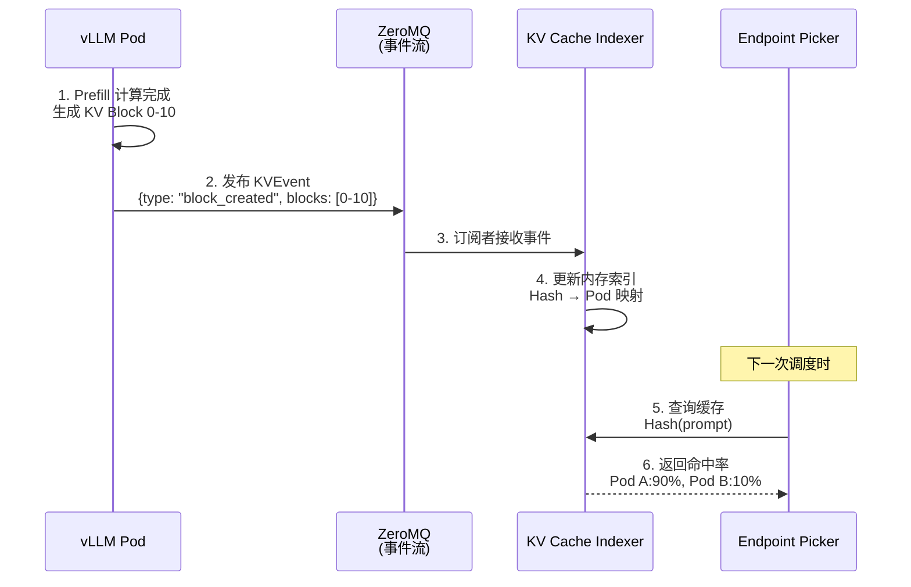

**事件类型**:

| 事件 | 触发时机 | 索引操作 |
|------|---------|---------|
| `block_created` | Prefill 完成 | 添加 Hash → Pod 映射 |
| `block_evicted` | KV Cache 驱逐 | 删除映射 |
| `block_offloaded` | 卸载到 CPU/FS | 标记为"可恢复" |

---

### ✅ 螺旋 2 验收标准

完成本层学习后,你应该能够:

- [ ] 画出调度流程的完整时序图 (10 步)
- [ ] 实现一个简单的 Filter 插件 (Go 伪代码)
- [ ] 计算 Prefix-aware Scorer 的评分: `matched_blocks / total_blocks`
- [ ] 解释 Top-K 选择相比 Always Top-1 的优势
- [ ] 编写 P/D 分离的 EndpointPickerConfig YAML

---

### 🔗 下一步

掌握了底层机制后,下一层我们将进入 **生产环境配置调优** 与 **故障排查实战**

---

## 🌀 螺旋 3: 实战层 - 插件配置与故障排查

### 本层目标
掌握 Inference Scheduler 的生产级配置、核心参数调优策略、监控指标体系与典型故障排查决策树。

---

### 3.1 部署架构与高可用

#### 基础部署拓扑

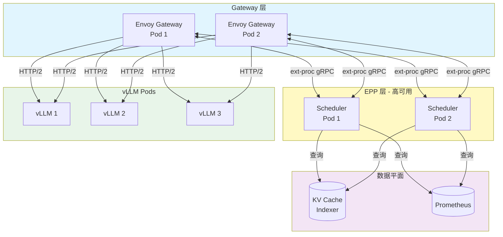

**高可用配置**:

```yaml
# EPP Deployment
apiVersion: apps/v1
kind: Deployment
metadata:
  name: inference-scheduler
spec:
  replicas: 2  # 至少 2 副本
  strategy:
    type: RollingUpdate
    rollingUpdate:
      maxUnavailable: 1  # 保证至少 1 副本可用
  
  template:
    spec:
      affinity:
        podAntiAffinity:
          requiredDuringSchedulingIgnoredDuringExecution:
            - labelSelector:
                matchLabels:
                  app: inference-scheduler
              topologyKey: kubernetes.io/hostname  # 不同节点
      
      resources:
        requests:
          cpu: 500m
          memory: 512Mi
        limits:
          cpu: 1000m
          memory: 1Gi
```

---

### 3.2 核心参数调优矩阵

#### 参数 1: hashBlockSize (Hash 块大小)

**影响**: 缓存匹配的粒度

| hashBlockSize | 适用场景 | 缓存命中率 | 计算开销 | 推荐值 |
|--------------|---------|-----------|---------|-------|
| 3 | 短 Prompt (<500 tokens) | 低 (细粒度) | 低 | RAG 问答 |
| 5 | 中等 Prompt (500-2k) | 中 | 中 | **默认推荐** |
| 10 | 长 Prompt (2k-8k) | 高 (粗粒度) | 高 | 长上下文对话 |
| 20 | 超长 Prompt (>8k) | 很高 | 很高 | 文档分析 |

**调优公式**:

```python
# 经验公式
optimal_block_size = max(3, min(20, avg_prompt_len / 200))

# 示例
# RAG 场景 (系统提示词 6k + 用户问题 500)
optimal = (6000 + 500) / 200 = 32.5 → 取 20

# 短对话场景 (平均 200 tokens)
optimal = 200 / 200 = 1 → 取 3 (最小值)
```

**实测对比** (6k 系统提示词场景):

```
┌───────────┬────────────┬──────────┬──────────┐
│ blockSize │ 缓存命中率 │ TTFT P95 │ 调度耗时 │
├───────────┼────────────┼──────────┼──────────┤
│ 3         │ 45%        │ 850ms    │ 3ms      │
│ 5         │ 72%        │ 280ms    │ 5ms      │
│ 10        │ 89%        │ 157ms    │ 8ms      │ ← 推荐
│ 20        │ 91%        │ 145ms    │ 15ms     │
└───────────┴────────────┴──────────┴──────────┘
```

---

#### 参数 2: Scorer Weight (评分权重)

**场景矩阵**:

| Prefix 复用率 | prefix-aware 权重 | load-aware 权重 | 适用工作负载 |
|-------------|------------------|----------------|-------------|
| **>70%** | 100 | 30 | 多轮对话、Agent |
| **50-70%** | 70 | 60 | 混合工作负载 |
| **30-50%** | 50 | 80 | RAG (动态检索) |
| **<30%** | 0 | 100 | 批处理推理 |

**动态调整策略**:

```python
# 根据实际缓存命中率动态调整
def adjust_weights(cache_hit_rate):
    if cache_hit_rate > 0.7:
        # 高命中率 → 强化缓存感知
        return {"prefix": 100, "load": 30}
    elif cache_hit_rate < 0.3:
        # 低命中率 → 弱化缓存感知
        return {"prefix": 0, "load": 100}
    else:
        # 中等命中率 → 平衡
        return {"prefix": 60, "load": 60}
```

**配置示例**:

```yaml
# 高 Prefix 复用场景
schedulingProfiles:
  - name: default
    plugins:
      - pluginRef: precise-prefix-cache-scorer
        weight: 100
      - pluginRef: load-aware-scorer
        weight: 30

# 低 Prefix 复用场景
schedulingProfiles:
  - name: default
    plugins:
      - pluginRef: load-aware-scorer
        weight: 100
      # 不启用 prefix-cache-scorer
```

---

#### 参数 3: maxQueueLength (队列深度阈值)

**关系**: 应与 vLLM 的 `max_num_seqs` 对齐

```yaml
# vLLM Deployment
env:
  - name: VLLM_MAX_NUM_SEQS
    value: "256"  # 最大并发序列数

# Inference Scheduler
plugins:
  - type: queue-depth-filter
    parameters:
      maxQueueLength: 200  # 设为 max_num_seqs 的 80%
```

**调优逻辑**:

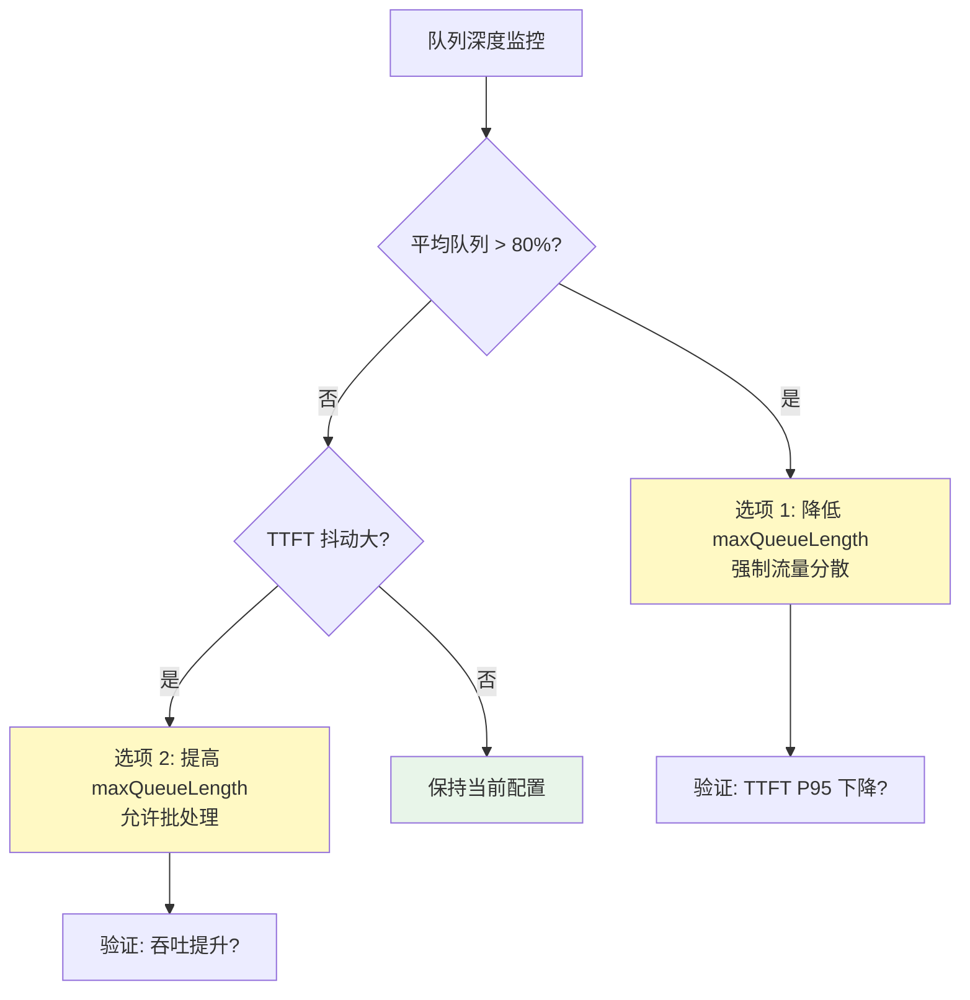

---

### 3.3 监控指标体系

#### 四层监控金字塔

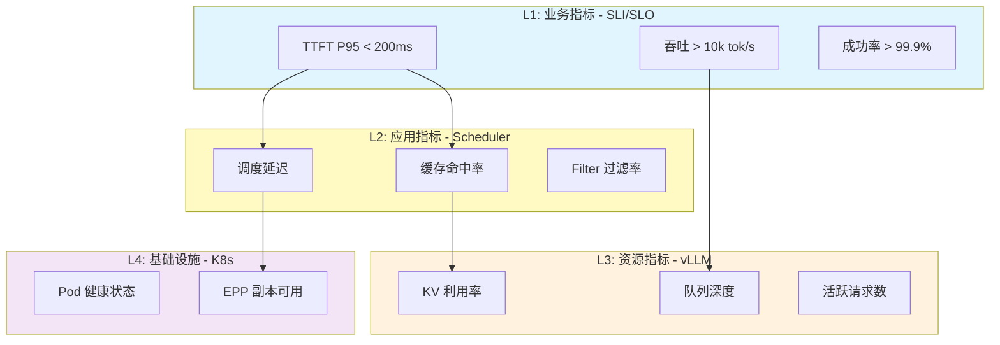

---

#### 核心 Prometheus 指标

```yaml
# 1. Scheduler 调度指标
- metric: epp_scheduling_duration_seconds
  type: histogram
  labels: [profile_name, scheduler_pod]
  
- metric: kv_cache_hit_total
  type: counter
  labels: [pod_name]
  
- metric: kv_cache_lookup_total
  type: counter
  labels: [pod_name]

# 2. vLLM 推理指标
- metric: vllm_time_to_first_token_seconds
  type: histogram
  labels: [model_name, pod_name]
  
- metric: vllm_queue_depth
  type: gauge
  labels: [pod_name]
  
- metric: vllm_kv_cache_utilization
  type: gauge
  labels: [pod_name]

# 3. EPP 健康指标
- metric: epp_plugin_errors_total
  type: counter
  labels: [plugin_name, error_type]
```

---

#### 关键告警规则

```yaml
groups:
  - name: inference-scheduler-slo
    rules:
      # 告警 1: TTFT 超 SLO
      - alert: HighTTFT
        expr: |
          histogram_quantile(0.95, 
            rate(vllm_time_to_first_token_seconds_bucket[5m])
          ) > 0.2
        for: 5m
        severity: critical
        annotations:
          summary: "TTFT P95 超过 200ms SLO"
          runbook: "检查缓存命中率、队列深度"
      
      # 告警 2: 缓存命中率低
      - alert: LowCacheHitRate
        expr: |
          rate(kv_cache_hit_total[10m]) / 
          rate(kv_cache_lookup_total[10m]) < 0.3
        for: 10m
        severity: warning
        annotations:
          summary: "缓存命中率低于 30%"
          action: "检查 hashBlockSize 或工作负载变化"
      
      # 告警 3: 调度延迟高
      - alert: EPPHighLatency
        expr: |
          histogram_quantile(0.95,
            rate(epp_scheduling_duration_seconds_bucket[5m])
          ) > 0.05
        for: 5m
        severity: warning
        annotations:
          summary: "调度器 P95 延迟超 50ms"
          action: "检查 KV Indexer 连接或增加 EPP 副本"
      
      # 告警 4: EPP 不可用
      - alert: EPPPodDown
        expr: up{job="inference-scheduler"} == 0
        for: 1m
        severity: critical
        annotations:
          summary: "Inference Scheduler Pod 不可用"
```

---

### 3.4 典型故障排查决策树

#### 问题 1: 缓存命中率低 (<30%)

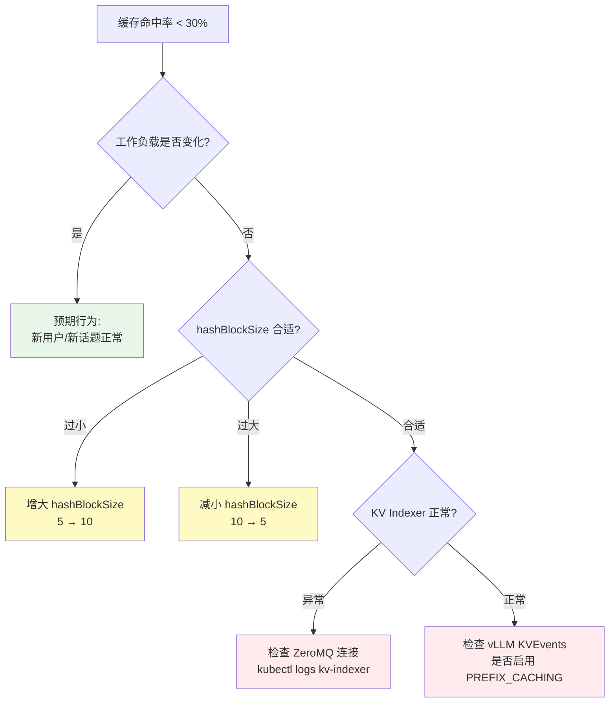

**调试命令**:

```bash
# 1. 检查 KV Indexer 连接
kubectl exec -it epp-pod -- curl http://kv-cache-indexer:9090/metrics | grep index_size

# 2. 检查 vLLM Prefix Caching 状态
kubectl exec -it vllm-pod -- curl localhost:8000/metrics | grep prefix_cache

# 3. 手动验证缓存查询
curl -X POST http://kv-indexer:9090/query \
  -d '{"prompt_hash": [123, 456, 789], "pods": ["pod1", "pod2"]}'
  
# 4. 检查 hashBlockSize 是否匹配
kubectl get cm scheduler-config -o yaml | grep blockSize
kubectl exec vllm-pod -- env | grep VLLM_BLOCK_SIZE
```

---

#### 问题 2: 调度延迟突增 (P95 >50ms)

| 根因 | 排查方法 | 解决方案 |
|------|---------|---------|
| **KV Indexer 慢查询** | `kubectl top pod kv-indexer` | 增加 Indexer 内存或优化索引结构 |
| **Prometheus 查询超时** | `curl -w "%{time_total}" prom-url` | 增加 Prometheus 资源或减少查询频率 |
| **EPP Pod 资源不足** | `kubectl top pod epp-pod` | 增加 CPU limits 或水平扩展 |
| **网络延迟** | `kubectl exec epp -- ping vllm-pod` | 检查 CNI 配置或节点亲和性 |

**调试脚本**:

```bash
#!/bin/bash
# 调度延迟诊断脚本

echo "=== 1. EPP Pod 资源使用 ==="
kubectl top pod -l app=inference-scheduler

echo "=== 2. Prometheus 查询延迟 ==="
time curl -s http://prometheus:9090/api/v1/query \
  -d 'query=vllm_queue_depth' > /dev/null

echo "=== 3. KV Indexer 健康检查 ==="
kubectl exec -it kv-indexer-pod -- curl localhost:9090/health

echo "=== 4. 调度耗时分布 ==="
kubectl exec -it epp-pod -- curl localhost:9091/metrics | \
  grep epp_scheduling_duration_seconds_bucket
```

---

#### 问题 3: 负载不均 (某些 Pod 队列 >100)

**症状**:

```
Pod 1: queue_depth = 120
Pod 2: queue_depth = 5
Pod 3: queue_depth = 8
```

**根因分析**:

```python
# 检查评分逻辑
def debug_scoring(pods, request):
    for pod in pods:
        prefix_score = calculate_prefix_score(pod, request)
        load_score = calculate_load_score(pod)
        total = prefix_score * 100 + load_score * 50
        
        print(f"Pod {pod.id}:")
        print(f"  Prefix: {prefix_score} → {prefix_score * 100}")
        print(f"  Load: {load_score} → {load_score * 50}")
        print(f"  Total: {total}")
```

**常见原因**:

1. **缓存亲和性过强**: `prefix-aware` 权重过高

   ```yaml
   # 调整前
   scorers:
     - type: prefix-aware
       weight: 100
     - type: load-aware
       weight: 10  # 权重太低!
   
   # 调整后
   scorers:
     - type: prefix-aware
       weight: 70
     - type: load-aware
       weight: 50  # 提高权重
   ```

2. **Top-K 未启用**: 总是选择第一名

   ```yaml
   plugins:
     - type: max-score-picker
       parameters:
         topK: 3  # 启用 Top-3 随机
   ```

3. **某个 Pod 真的有缓存优势**: 预期行为,触发扩容

---

### 3.5 插件开发最佳实践

#### 新增 Filter 插件模板

```go
// pkg/plugins/filter/my_filter.go
package filter

import (
    "sigs.k8s.io/gateway-api-inference-extension/pkg/epp/scheduling/plugins"
    "sigs.k8s.io/gateway-api-inference-extension/pkg/epp/scheduling/types"
)

// MyFilter 示例过滤器
type MyFilter struct {
    name      string
    threshold int  // 自定义参数
}

var _ plugins.Filter = &MyFilter{}  // 接口断言

// NewMyFilter 构造函数
func NewMyFilter(name string, threshold int) (plugins.Filter, error) {
    return &MyFilter{
        name:      name,
        threshold: threshold,
    }, nil
}

// Name 返回插件名称
func (f *MyFilter) Name() string {
    return f.name
}

// Filter 实现过滤逻辑
func (f *MyFilter) Filter(ctx *types.SchedulingContext, pods []types.Pod) []types.Pod {
    filtered := []types.Pod{}
    
    for _, pod := range pods {
        // 自定义过滤逻辑
        if meetsCriteria(pod, f.threshold) {
            filtered = append(filtered, pod)
        }
    }
    
    return filtered
}

func meetsCriteria(pod types.Pod, threshold int) bool {
    // 实现你的判断逻辑
    return true
}
```

**测试用例**:

```go
// pkg/plugins/filter/my_filter_test.go
package filter

import (
    "testing"
    "sigs.k8s.io/gateway-api-inference-extension/pkg/epp/scheduling/types"
)

func TestMyFilter(t *testing.T) {
    filter, err := NewMyFilter("test-filter", 50)
    if err != nil {
        t.Fatalf("Failed to create filter: %v", err)
    }
    
    pods := []types.Pod{
        // 构造测试 Pod
    }
    
    filtered := filter.Filter(nil, pods)
    
    if len(filtered) != expectedCount {
        t.Errorf("Expected %d pods, got %d", expectedCount, len(filtered))
    }
}
```

---

### ✅ 螺旋 3 验收标准

完成本层学习后,你应该能够:

- [ ] 配置 EPP 高可用部署 (至少 2 副本 + Pod 反亲和性)
- [ ] 根据工作负载特征调优 `hashBlockSize` 和 Scorer 权重
- [ ] 建立四层监控指标体系并设置告警规则
- [ ] 使用故障决策树诊断缓存命中率低、调度延迟高、负载不均等问题
- [ ] 实现一个自定义 Filter 插件 (参考模板)

---

### 🎓 总结

**llm-d Inference Scheduler 的生产价值**:

1. **性能**: 
   - 高 Prefix 复用场景 TTFT -99%
   - 吞吐提升 +109% (相比 K8s Service)

2. **灵活**: 
   - 插件化架构,无需修改核心代码
   - 支持自定义 Filter/Scorer/Picker

3. **可观测**: 
   - 丰富的 Prometheus 指标
   - 完整的故障排查决策树

4. **云原生**: 
   - 基于 Gateway API 标准
   - 与 GIE 上下游生态无缝集成

**下一步行动**:

- 📖 深入阅读 [KV Cache Indexer](../kv-cache-indexer/) 了解缓存索引实现
- 🧪 部署测试环境验证配置参数
- 📊 根据实际工作负载持续调优 Scorer 权重
- 🚀 开发自定义插件满足特定业务需求

---

## 🔗 深入阅读

- [**KV Cache Indexer**](../kv-cache-indexer/) - 为调度器提供缓存命中率评分
- [**llm-d 平台架构**](../../llm-d/) - Inference Scheduler 在 llm-d 生态中的定位
- [**Gateway API Inference Extension**](https://github.com/kubernetes-sigs/gateway-api-inference-extension) - 上游 GIE 项目

---

## 📚 参考资料

- [llm-d Inference Scheduler GitHub](https://github.com/llm-d/llm-d-inference-scheduler)
- [Architecture Documentation](https://github.com/llm-d/llm-d-inference-scheduler/blob/main/docs/architecture.md)
- [Plugin Development Guide](https://github.com/llm-d/llm-d-inference-scheduler/blob/main/docs/create_new_filter.md)
