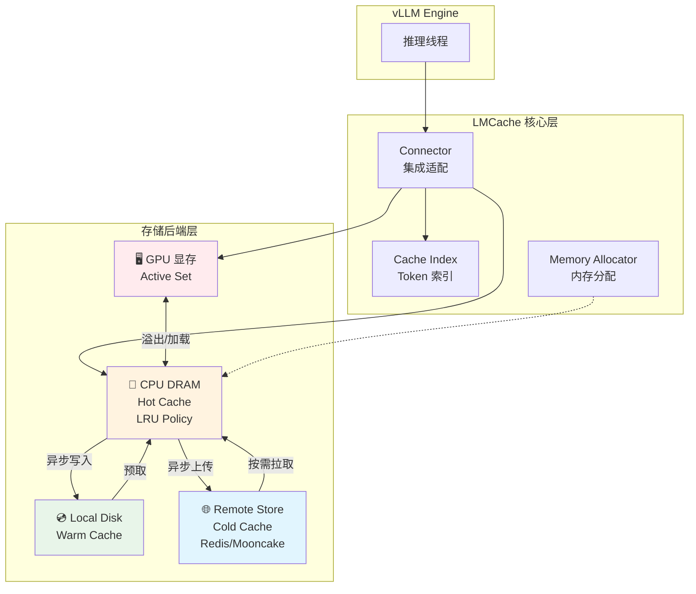
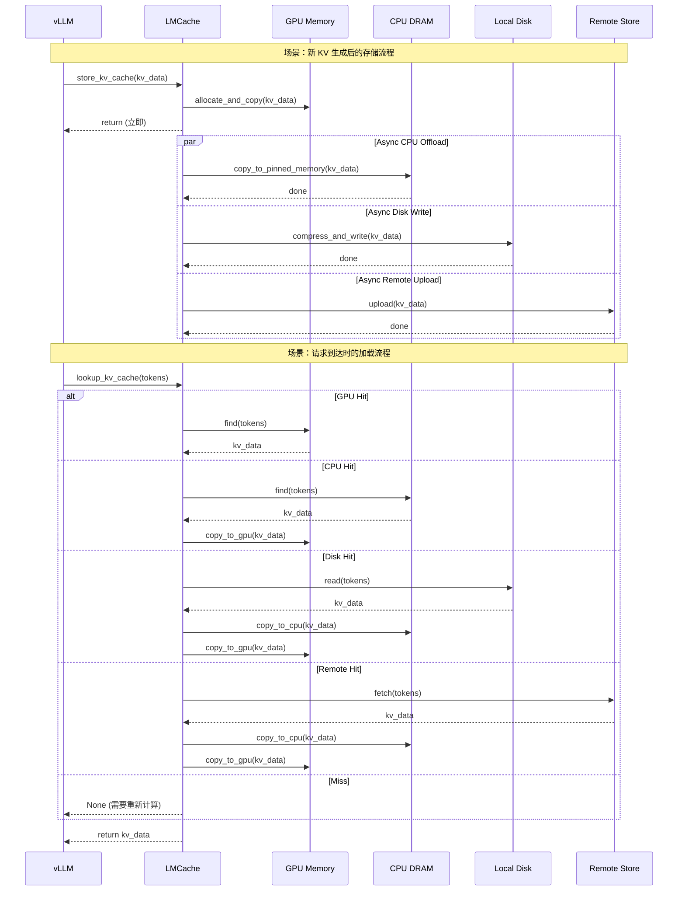
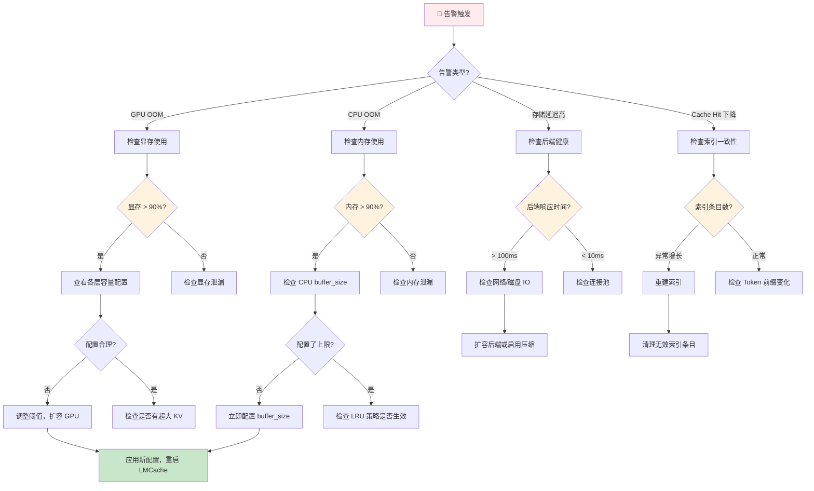

# LMCache 组件：多级存储架构

**目标受众**：一线工程师 & 架构师  
**核心价值**：理解 GPU → CPU → 本地磁盘 → 远程存储的四级缓存机制与数据流动  
**贯穿类比**：图书馆分级借阅系统

---

## 🌀 螺旋 1：概念闭环 — 是什么 & 为什么

### 1.1 场景痛点：存储层级的"不可能三角"

在 LLM 推理服务中，KV Cache 存储面临**延迟-容量-成本**的不可能三角：

| 维度 | GPU 显存 | CPU 内存 | 本地磁盘 | 远程存储 |
|------|----------|----------|----------|----------|
| **延迟** | < 1ms ⚡ | 1-10ms | 1-10ms | 5-50ms 🐌 |
| **容量** | 80GB | 512GB | 10TB+ | PB 级 |
| **成本** | $$$$ | $$ | $ | $ |

**真实案例**：某 AI 客服平台尝试将所有 KV 保存在 GPU，结果：
- 成本：每月 GPU 费用 $500K
- 效果：TTFT < 100ms，但资源利用率仅 30%

**尝试方案 B**：全部存远程存储：
- 成本：每月 $50K
- 效果：Cache Miss 时 TTFT 5-10s，用户流失率 40%

**LMCache 的解决思路**：**智能分层**——根据访问频率和成本约束，自动决定 KV 存储位置。

### 1.2 类比理解：图书馆的四级藏书体系

想象一座大型图书馆的藏书管理：

| 图书馆层级 | 存储层级 | 核心逻辑 |
|------------|----------|----------|
| **阅览桌** | GPU 显存 | 正在读的书，拿取最快但只能放几本 |
| **开架书架** | CPU DRAM | 最近热门书籍，次快访问，容量中等 |
| **闭架书库** | 本地磁盘 | 馆藏书籍，访问较慢但容量大 |
| **馆际互借** | 远程存储 | 其他分馆的藏书，网络传输但全局共享 |

**借阅决策**：
1. 读者要借《三体》→ 先看阅览桌 → 没有
2. 查开架书架 → 找到了 → 直接借阅 ✅
3. 查闭架书库 → 找到了 → 等待 5 分钟取书
4. 申请馆际互借 → 找到了 → 等待 1 天送书
5. 都没有 → 新买一本（重新计算 KV）

### 1.3 架构全景图



### ✅ 螺旋 1 验收

> 一句话复述：多级存储架构通过将 KV Cache 分布在 GPU→CPU→磁盘→远程存储四个层级，实现延迟、容量、成本的最优平衡。

### 🔗 下一步指引

理解分层原理后，进入 **认知降压** ——把图书馆逻辑转化为技术直觉。

---

## 💨 认知降压：从类比到逻辑

### 从图书馆管理到技术决策

**降压主线**：把图书管理的常识转化为 LMCache 的技术逻辑。

#### 1. 识别"热度"——什么时候该换层？

**图书馆逻辑**：
> 一本书在阅览桌上放了 2 小时没人读，就该放回书架，腾出位置给新读者。

**技术映射**：
```
GPU 中的 KV 如果超过 N 秒未被访问 → 标记为"可卸载"
当 GPU 显存达到阈值（如 80%）→ 触发 LRU 淘汰 → 移至 CPU
```

#### 2. 异步整理——不打扰读者

**图书馆逻辑**：
> 读者读完书离开后，管理员不会立即冲过去整理，而是继续服务其他读者，空闲时再处理。

**技术映射**：
```
推理完成 → 立即返回结果给用户
后台线程：复制到 CPU → 压缩 → 写入磁盘/远程
```

#### 3. 跨馆互借——P2P 传输的直觉

**图书馆逻辑**：
> 馆际互借比重新买书快（如果有的话），但比本馆取书慢。

**技术映射**：
```
Remote Fetch 延迟：10-50ms
Prefill 重新计算：1-10s
结论：只要命中率 > 1%，跨节点共享就是划算的
```

### 理解铺垫：为什么不能简单"按需加载"？

**反直觉现象**：
- 场景：对话系统，用户连续提问
- 直觉：每次提问都重新计算（简单）
- 现实：第 10 轮对话需要重新计算前 9 轮的 KV，TTFT 爆炸

**解决方案**：
- 第 1 轮：计算并存储 KV
- 第 2-10 轮：直接从 GPU/CPU 加载 KV，TTFT < 200ms

### ✅ 认知降压验收

> 能用图书馆的"热度识别、异步整理、跨馆互借"三段式逻辑，解释 LMCache 的分层存储决策。

### 🔗 下一步指引

认知降压完成，进入 **螺旋 2（机制层）** —— 深入源码级别的存储实现。

---

## 🌀 螺旋 2：机制闭环 — 如何运作

### 2.1 核心机制概述

LMCache 的存储架构包含三个核心机制：

1. **分层存储管理**：四级存储层级的数据流动
2. **LRU 淘汰策略**：决定何时将数据从高层移到低层
3. **异步卸载引擎**：保证推理线程不被存储操作阻塞

### 2.2 分层存储的数据流动

#### 数据流动时序图



#### 四级存储特性对比

| 层级 | 容量 | 延迟 | 带宽 | 持久化 | 适用场景 |
|------|------|------|------|--------|----------|
| **GPU** | 40-80GB | 500GB/s | 高 | ❌ 易失 | 当前活跃推理 |
| **CPU** | 100-500GB | 50GB/s | 中 | ❌ 易失 | 热缓存、近期复用 |
| **Disk** | 1-10TB | 5GB/s | 低 | ✅ 持久 | 长文档、冷数据 |
| **Remote** | PB级 | 1-10Gbps | 网络 | ✅ 持久 | 跨实例共享 |

### 2.3 Memory Allocator 实现

```python
class MemoryAllocator:
    """NUMA-aware 的 Pinned Memory 分配器"""

    def __init__(self, device_id: int, pool_size_gb: float):
        self.device_id = device_id
        self.pool_size = pool_size_gb * 1024**3
        self.allocated = 0

        # 初始化 pinned memory pool
        self.pool = torch.cuda.caching_allocator_alloc(
            self.pool_size,
            device=device_id
        )

    def allocate(self, size: int) -> CPUPtr:
        """从 pool 分配 pinned memory"""
        if self.allocated + size > self.pool_size:
            raise OutOfMemoryError("CPU pool exhausted")

        ptr = self.pool.offset(self.allocated)
        self.allocated += size
        return CPUPtr(ptr, size)

    def free(self, ptr: CPUPtr):
        """标记释放（实际延迟到 pool 重置）"""
        # 使用引用计数，延迟释放避免碎片
        ptr.ref_count -= 1
        if ptr.ref_count == 0:
            self._mark_free(ptr)

    def gpu_to_cpu_copy(self, gpu_ptr: GPUPtr, size: int) -> CPUPtr:
        """GPU 到 CPU 的异步拷贝"""
        cpu_ptr = self.allocate(size)

        # 使用 non-blocking 拷贝
        torch.cuda.memcpy_async(
            cpu_ptr.address,
            gpu_ptr.address,
            size,
            non_blocking=True
        )

        return cpu_ptr
```

### 2.4 LRU 淘汰算法详解

```python
class TieredLRUPolicy:
    """分层 LRU 淘汰策略"""

    def __init__(
        self,
        gpu_capacity_gb: float,
        cpu_capacity_gb: float,
        eviction_threshold: float = 0.8
    ):
        self.gpu_capacity = gpu_capacity_gb * 1024**3
        self.cpu_capacity = cpu_capacity_gb * 1024**3
        self.threshold = eviction_threshold

        # 各层级的 LRU 队列
        self.gpu_lru = OrderedDict()
        self.cpu_lru = OrderedDict()

    def access(self, key: str, tier: str):
        """记录访问，更新 LRU 顺序"""
        lru = self.gpu_lru if tier == 'gpu' else self.cpu_lru
        if key in lru:
            lru.move_to_end(key)

    def insert(
        self,
        key: str,
        size: int,
        tier: str
    ) -> List[Tuple[str, int, str]]:
        """
        插入新数据，可能触发淘汰
        返回: [(淘汰的key, size, 从哪层), ...]
        """
        evicted = []
        lru = self.gpu_lru if tier == 'gpu' else self.cpu_lru
        capacity = self.gpu_capacity if tier == 'gpu' else self.cpu_capacity

        current_usage = sum(lru.values())

        # 如果超过阈值，触发淘汰
        while current_usage + size > capacity * self.threshold:
            if not lru:
                break

            # 淘汰最久未使用的
            oldest_key, oldest_size = lru.popitem(last=False)
            evicted.append((oldest_key, oldest_size, tier))
            current_usage -= oldest_size

            # 如果是 GPU 层淘汰，尝试降级到 CPU
            if tier == 'gpu':
                self._offload_to_cpu(oldest_key, oldest_size)

        lru[key] = size
        return evicted

    def _offload_to_cpu(self, key: str, size: int):
        """将数据从 GPU 降级到 CPU"""
        # 触发异步卸载
        asyncio.create_task(
            self.async_offloader.offload(key, 'cpu')
        )
```

### 2.5 异步卸载引擎

```python
class AsyncOffloadEngine:
    """异步存储任务管理器"""

    def __init__(
        self,
        max_workers: int = 4,
        queue_size: int = 1000
    ):
        self.executor = ThreadPoolExecutor(max_workers=max_workers)
        self.task_queue = asyncio.Queue(maxsize=queue_size)
        self.pending_tasks: Dict[str, asyncio.Task] = {}
        self.metrics = OffloadMetrics()

    async def submit(
        self,
        key: str,
        data: MemoryObj,
        target_tier: str
    ) -> str:
        """提交异步存储任务"""
        task_id = f"offload_{uuid4().hex[:8]}"

        task = asyncio.create_task(
            self._offload_worker(key, data, target_tier, task_id)
        )

        self.pending_tasks[task_id] = task
        return task_id

    async def _offload_worker(
        self,
        key: str,
        data: MemoryObj,
        target: str,
        task_id: str
    ):
        """实际执行卸载的工作线程"""
        start_time = time.time()

        try:
            # 1. 压缩（如果目标层支持）
            if target in ['disk', 'remote']:
                data = await self._compress(data)

            # 2. 写入目标存储
            if target == 'cpu':
                await self._write_to_cpu(key, data)
            elif target == 'disk':
                await self._write_to_disk(key, data)
            elif target == 'remote':
                await self._upload_to_remote(key, data)

            # 3. 更新索引
            await self._update_index(key, target)

            # 4. 记录指标
            duration = time.time() - start_time
            self.metrics.record_success(target, duration)

        except Exception as e:
            logger.error(f"Offload failed: {task_id}, error: {e}")
            self.metrics.record_failure(target, str(e))

            # 失败时保留在原地，下次重试
            raise OffloadRetryableError(task_id, key, target)

        finally:
            del self.pending_tasks[task_id]

    async def check_health(self) -> Dict[str, Any]:
        """健康检查接口"""
        return {
            'queue_size': self.task_queue.qsize(),
            'pending_tasks': len(self.pending_tasks),
            'executor_workers': self.executor._max_workers,
            'metrics': self.metrics.to_dict()
        }
```

### 2.6 存储后端接口设计

```python
class StorageBackend(ABC):
    """存储后端抽象接口"""

    @abstractmethod
    async def write(self, key: str, data: bytes) -> bool:
        """写入数据"""
        pass

    @abstractmethod
    async def read(self, key: str) -> Optional[bytes]:
        """读取数据"""
        pass

    @abstractmethod
    async def delete(self, key: str) -> bool:
        """删除数据"""
        pass

    @abstractmethod
    async def exists(self, key: str) -> bool:
        """检查是否存在"""
        pass


class DiskBackend(StorageBackend):
    """本地磁盘存储后端"""

    def __init__(self, base_path: str, compression: str = 'zstd'):
        self.base_path = Path(base_path)
        self.base_path.mkdir(parents=True, exist_ok=True)
        self.compression = compression

    async def write(self, key: str, data: bytes) -> bool:
        file_path = self._get_path(key)
        file_path.parent.mkdir(parents=True, exist_ok=True)

        # 压缩
        compressed = zstd.compress(data)

        # 原子写入
        temp_path = file_path.with_suffix('.tmp')
        async with aiofiles.open(temp_path, 'wb') as f:
            await f.write(compressed)
        temp_path.rename(file_path)

        return True

    async def read(self, key: str) -> Optional[bytes]:
        file_path = self._get_path(key)
        if not file_path.exists():
            return None

        async with aiofiles.open(file_path, 'rb') as f:
            compressed = await f.read()

        return zstd.decompress(compressed)

    def _get_path(self, key: str) -> Path:
        """将 key 映射到文件路径"""
        # 使用 hash 分片避免单目录文件过多
        hash_prefix = hashlib.md5(key.encode()).hexdigest()[:4]
        return self.base_path / hash_prefix[:2] / hash_prefix[2:4] / key
```

### ✅ 螺旋 2 验收

> 能够画出：KV 生成 → 四级存储流动 → LRU 淘汰 → 异步卸载的完整流程，并解释 Memory Allocator 和 Async Offload Engine 的实现逻辑。

### 🔗 衔接问题

生产环境如何配置各层容量？遇到 OOM 怎么排查？进入 **螺旋 3（实战层）**。

---

## 🌀 螺旋 3：实战闭环 — 如何驾驭

### 3.1 存储层级配置实战

#### 推荐配置模板

```yaml
# lmcache_config.yaml
storage:
  # GPU 层：使用 vLLM 的显存管理
  gpu:
    max_utilization: 0.80          # 最大显存利用率 80%
    eviction_threshold: 0.75       # 超过 75% 开始卸载

  # CPU 层：Pinned Memory 缓存
  cpu:
    enabled: true
    buffer_size: "200Gi"           # CPU 缓存 200GB
    numa_aware: true               # 启用 NUMA 亲和性
    eviction_policy: "lru"

  # 本地磁盘层
  disk:
    enabled: true
    path: "/var/cache/lmcache"     # 本地缓存路径
    max_size: "2Ti"                # 最大 2TB
    compression: "zstd"            # 压缩算法
    compression_level: 3           # 压缩级别

  # 远程存储层
  remote:
    enabled: true
    backend: "mooncake"            # 或 redis, infinistore
    endpoint: "mooncache.cluster.local:8080"
    connection_pool_size: 32
    timeout_ms: 5000

# 异步卸载配置
async:
  max_workers: 8                   # 异步线程数
  queue_size: 10000               # 任务队列大小
  retry_policy:
    max_retries: 3
    backoff_factor: 2

# 监控配置
observability:
  metrics_port: 8000
  health_check_interval: 30
```

#### 不同场景的容量规划

| 场景 | GPU | CPU | Disk | Remote | 关键参数 |
|------|-----|-----|------|--------|----------|
| **短对话客服** | 40GB | 100GB | 500GB | Redis | 高 CPU 占比 |
| **长文档 RAG** | 80GB | 200GB | 5TB | Mooncake | 高 Disk 占比 |
| **多实例共享** | 80GB | 100GB | 1TB | Mooncake P2P | 启用 P2P 传输 |
| **成本敏感** | 40GB | 50GB | 2TB | S3 | 低 GPU，高 Disk |

### 3.2 反模式

#### ❌ 反模式 1：GPU 显存配满

- **现象**：`max_utilization: 0.95`，GPU 显存常年 95%+
- **根因**：未预留突发缓冲，碎片化导致实际可用空间减少
- **后果**：突发流量时无法快速加载新 KV，TTFT 飙升
- **修正**：
  ```yaml
  gpu:
    max_utilization: 0.75          # 留出 25% 缓冲
    eviction_threshold: 0.70       # 70% 时开始预卸载
  ```

#### ❌ 反模式 2：CPU 层无限增长

- **现象**：CPU 内存占用持续增长，最终 OOM
- **根因**：未配置 CPU 层容量限制，LRU 策略失效
- **修正**：
  ```yaml
  cpu:
    buffer_size: "100Gi"           # 必须配置上限
    eviction_policy: "lru"
    eviction_threshold: 0.90       # 90% 时触发淘汰
  ```

#### ❌ 反模式 3：压缩率强迫症

- **现象**：使用最高压缩级别，CPU 占用 100%
- **根因**：压缩收益被计算成本抵消
- **修正**：
  ```yaml
  disk:
    compression_level: 3           # 1-3 级即可，更高收益递减
  ```

### 3.3 故障排查决策树



#### 常用排查命令

```bash
# 1. 检查各层存储使用情况
curl -s http://localhost:8000/metrics | grep lmcache_storage

# 2. 查看 LRU 队列状态
curl -s http://localhost:8000/api/v1/cache/stats | jq '.lru_stats'

# 3. 检查异步任务堆积
curl -s http://localhost:8000/api/v1/async/status | jq '.queue_size'

# 4. 查看存储后端延迟分布
curl -s http://localhost:8000/metrics | grep storage_latency

# 5. 手动触发 LRU 淘汰（紧急释放）
curl -X POST http://localhost:8000/api/v1/cache/evict \
  -H "Content-Type: application/json" \
  -d '{"tier": "cpu", "target_usage": 0.70}'

# 6. 导出内存使用详情
lmcache-cli dump-memory --output=memory_profile.json
```

### 3.4 SRE 可观测性

#### 关键指标看板

```yaml
# Grafana Dashboard 配置片段
panels:
  - title: "Storage Tier Usage"
    targets:
      - expr: lmcache_storage_usage_bytes{ tier=~"gpu|cpu|disk" }
        legendFormat: "{{ tier }} usage"

  - title: "Cache Hit Rate by Tier"
    targets:
      - expr: rate(lmcache_cache_hits_total[5m]) / rate(lmcache_cache_lookups_total[5m])
        legendFormat: "Hit Rate"

  - title: "Async Queue Size"
    targets:
      - expr: lmcache_async_queue_size
        legendFormat: "Pending Tasks"

  - title: "Storage Backend Latency"
    targets:
      - expr: histogram_quantile(0.99, rate(lmcache_storage_latency_bucket[5m]))
        legendFormat: "P99 {{ backend }}"
```

#### 告警规则

```yaml
groups:
  - name: lmcache-storage
    rules:
      - alert: LMCacheGPUHighUsage
        expr: lmcache_storage_usage_percent{tier="gpu"} > 85
        for: 5m
        labels:
          severity: warning
        annotations:
          summary: "LMCache GPU storage is nearly full"

      - alert: LMCacheCPUHighUsage
        expr: lmcache_storage_usage_percent{tier="cpu"} > 90
        for: 5m
        labels:
          severity: critical
        annotations:
          summary: "LMCache CPU storage is nearly full"

      - alert: LMCacheAsyncQueueBacklog
        expr: lmcache_async_queue_size > 5000
        for: 10m
        labels:
          severity: warning
        annotations:
          summary: "LMCache async offload queue is backing up"

      - alert: LMCacheStorageBackendDown
        expr: up{job="lmcache-backend"} == 0
        for: 1m
        labels:
          severity: critical
        annotations:
          summary: "LMCache storage backend is unreachable"
```

### ✅ 螺旋 3 验收

> 能够独立排查：当 **GPU OOM** 告警触发时，按照决策树执行排查，并能根据业务特征调整四级存储的容量配置。

### 🔗 下一步指引

完成了存储架构的实战学习，进入 **元知识总结** —— 沉淀分层存储的设计模式。

---

## 元知识总结

### 大规模瓶颈与调优

#### 四级存储的容量上限

| 层级 | 单机上限 | 瓶颈点 | 优化方向 |
|------|----------|--------|----------|
| **GPU** | 8×80GB = 640GB | 显存带宽/物理容量 | 多机扩展、模型并行 |
| **CPU** | 1-2TB | 内存带宽、NUMA 拓扑 | 多实例分片、NUMA 亲和 |
| **Disk** | 10-100TB | IO 带宽、文件句柄 | NVMe RAID、分片存储 |
| **Remote** | PB 级 | 网络带宽、延迟 | P2P 传输、就近部署 |

#### 性能调优黄金法则

1. **延迟敏感数据优先放高层**：活跃对话的 KV 必须在 GPU/CPU
2. **冷数据压缩后存低层**：长文档 KV 压缩后存磁盘，节省 70%+ 空间
3. **异步永远不阻塞主路径**：卸载/加载必须异步，TTFT 不容妥协
4. **监控所有层的命中率**：低于 70% 说明分层策略需要调整

### 设计模式沉淀

| 模式名称 | 适用场景 | 配置要点 |
|----------|----------|----------|
| **激进缓存模式** | 短对话、高并发 | GPU 80% + CPU 200GB + 禁用 Disk |
| **长文档模式** | RAG、文档问答 | GPU 80GB + Disk 5TB + 启用压缩 |
| **全局共享模式** | 多实例部署 | Mooncake P2P + CPU 100GB + Disk 1TB |
| **成本优先模式** | 预算敏感 | 低 GPU 40GB + 高 Disk 10TB + S3 Remote |

### 一句话 Takeaway

> **分层存储的核心不是"技术炫技"，而是"在正确的时间把正确的数据放在正确的位置"——理解业务访问模式比调参数更重要。**

---

**本模块质量检查清单**：

- [x] 三层螺旋结构完整
- [x] 每层有验收标准
- [x] 图书馆类比贯穿
- [x] 中国本土场景（AI 客服）
- [x] Mermaid 时序图 + 决策树
- [x] SLI/SLO 建议
- [x] 故障排查决策树
- [x] 3+ 反模式
- [x] 成本与性能权衡
- [x] 配置模板可直接使用

---

## 延伸阅读

### 官方文档

- **LMCache Storage Backends**: https://docs.lmcache.ai/kv_cache/storage_backends/
- **Architecture Overview**: https://docs.lmcache.ai/developer_guide/architecture.html
- **Configuration Reference**: https://docs.lmcache.ai/api_reference/configurations.html

### 源码参考

```
lmcache/
├── lmcache/
│   ├── storage_backend/          # 存储后端实现
│   │   ├── local_backend.py      # 本地磁盘
│   │   ├── remote_backend.py     # 远程存储抽象
│   │   └── memory_backend.py     # CPU 内存
│   ├── memory_management/        # 内存分配器
│   │   └── allocator.py
│   └── eviction/                 # 淘汰策略
│       └── lru_policy.py
```

### 相关技术

| 技术 | 关联点 | 学习建议 |
|------|--------|----------|
| **vLLM PagedAttention** | KV Cache 分页管理 | 理解 LMCache 的集成点 |
| **PyTorch Caching Allocator** | GPU 显存管理 | 了解显存碎片化问题 |
| **Linux NUMA** | CPU 内存亲和性 | 多路服务器优化必读 |
| **Zstd Compression** | KV Cache 压缩 | 压缩率与速度的平衡 |

### 推荐阅读

1. **vLLM Paper**: Efficient Memory Management for Large Language Model Serving with PagedAttention  
   https://arxiv.org/abs/2309.06180

2. **NUMA-Aware Memory Management**:  
   https://www.kernel.org/doc/html/latest/admin-guide/numa-memory-policy.html

3. **Zstd Compression**:  
   https://github.com/facebook/zstd

---

**文档版本**: 2025-02  
**关联模块**: [05-production.md](05-production.md)（生产部署与观测）
