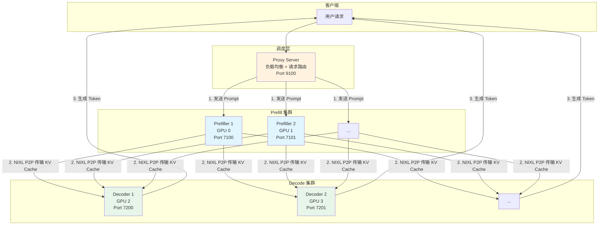
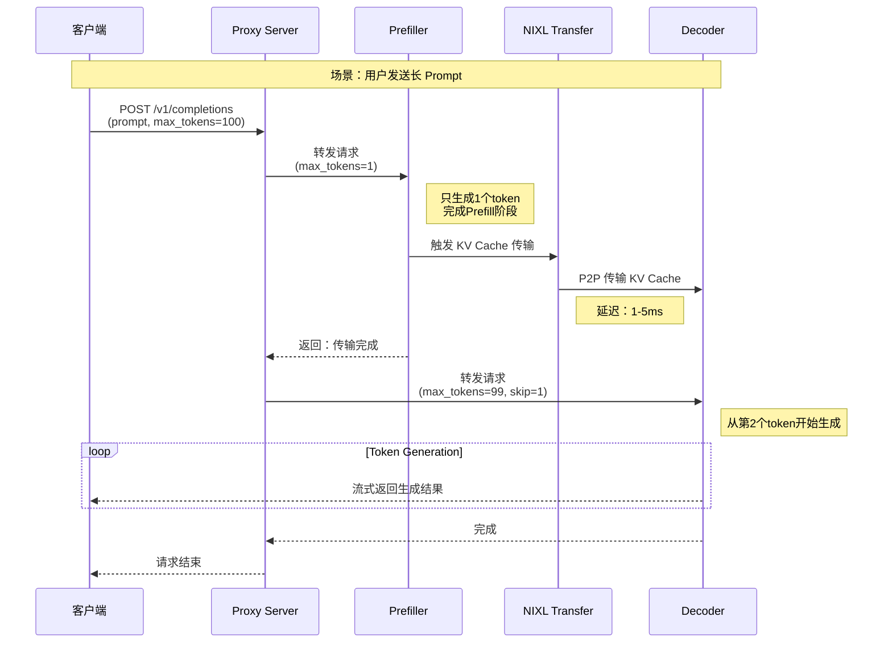
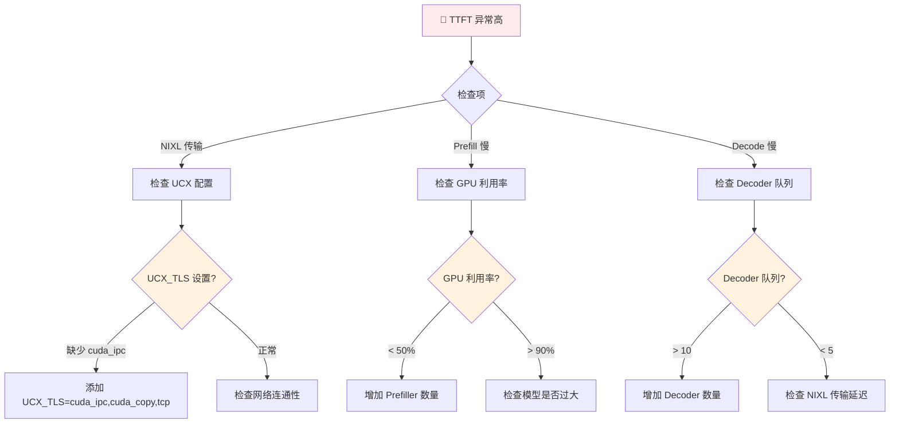

# LMCache 组件：分布式预填充 (Disaggregated Prefill)

**目标受众**：架构师 & SRE  
**核心价值**：理解 1p1d/XpYd 架构模式与 NIXL P2P 传输机制  
**贯穿类比**：图书馆分工合作（编目员 vs 借阅员）

---

## 🌀 螺旋 1：概念闭环 — 是什么 & 为什么

### 1.1 场景痛点：Prefill 与 Decode 的资源冲突

在 LLM 推理中，一个请求分为两个阶段：

| 阶段 | 计算特征 | 资源需求 | 持续时间 |
|------|----------|----------|----------|
| **Prefill** | 并行处理整个 Prompt，计算量大 | 高算力、大显存带宽 | 短（一次性） |
| **Decode** | 逐个生成 Token，计算量小 | 低延迟、高吞吐 | 长（持续生成） |

**真实案例**：某电商平台大促期间的客服系统：
- Prefill 阶段：需要 80GB 显存带宽处理长 Prompt
- Decode 阶段：只需要 5GB 显存带宽生成回复
- **问题**：两者混在一起，Prefill 阻塞 Decode，TTFT 飙升到 5s+

**传统方案的问题**：
```
用户请求 → [Prefill + Decode 在同一个 GPU]
                    ↓
    长 Prompt 导致 GPU 100% 占用
                    ↓
    新请求的 TTFT 暴涨，用户体验差
```

**LMCache 的解决思路**：**职责分离**——让专门的 GPU 负责 Prefill，其他 GPU 专心 Decode。

### 1.2 类比理解：图书馆的编目员与借阅员

想象一座大型图书馆的 workflow：

| 图书馆角色 | 对应推理阶段 | 核心职责 |
|------------|--------------|----------|
| **编目员** | Prefiller | 处理新书上架（处理长 Prompt），工作量集中 |
| **借阅员** | Decoder | 服务读者借书（生成 Token），工作持续但轻量 |
| **调度台** | Proxy | 协调编目员和借阅员之间的工作交接 |
| **图书传送带** | NIXL P2P | 快速将编好的书送到借阅台 |

**工作流程**：
1. 读者要借《三体》三部曲（长 Prompt）
2. 调度台将请求发给编目员（Prefiller 处理 Prompt）
3. 编目员完成编目，通过传送带（NIXL）把书送到借阅台
4. 借阅员（Decoder）专注服务读者，逐本借出（逐个生成 Token）

**核心价值**：
- 编目员专心编目，不被借书打扰
- 借阅员专心服务，不用等编目完成
- 传送带确保书快速流转

### 1.3 架构全景图



### 1.4 1p1d vs XpYd 模式对比

| 模式 | 架构 | 适用场景 | 资源需求 |
|------|------|----------|----------|
| **1p1d** | 1 Prefiller + 1 Decoder | 中等负载、成本敏感 | 2 GPUs |
| **XpYd** | X Prefillers + Y Decoders | 高并发、大流量 | 4+ GPUs |

**1p1d 架构**：
```
┌─────────────┐
│   Client    │
└──────┬──────┘
       │
┌──────▼──────┐
│Proxy Server │  Port 9100
└───┬───────┬─┘
    │       │
┌───▼───┐ ┌─▼────────┐
│Prefiller│ │ Decoder  │
│ GPU 0  │ │  GPU 1   │
│Port7100│ │ Port7200 │
└────────┘ └──────────┘
    │          ▲
    └─NIXL─────┘
```

**XpYd (2p2d) 架构**：
```
        ┌─────────────┐
        │   Client    │
        └──────┬──────┘
               │
        ┌──────▼──────┐
        │Proxy Server │  Round-Robin
        │  Port 9100  │  Load Balancing
        └──┬───────┬──┘
           │       │
    ┌──────┴──┐ ┌──┴──────┐
    │Prefiller│ │Prefiller│
    │   1     │ │   2     │
    │ GPU 0   │ │ GPU 1   │
    └────┬────┘ └────┬────┘
         │ NIXL      │ NIXL
    ┌────┴────┐ ┌────┴────┐
    │ Decoder │ │ Decoder │
    │   1     │ │   2     │
    │ GPU 2   │ │ GPU 3   │
    └─────────┘ └─────────┘
```

### ✅ 螺旋 1 验收

> 一句话复述：分布式预填充通过将 Prefill 和 Decode 分离到不同 GPU，配合 NIXL P2P 传输，解决资源冲突，提升并发处理能力。

### 🔗 下一步指引

理解架构后，进入 **认知降压** ——把图书馆分工逻辑转化为技术直觉。

---

## 💨 认知降压：从类比到逻辑

### 从图书馆分工到技术决策

**降压主线**：把编目员-借阅员的常识转化为 Disaggregated Prefill 的技术逻辑。

#### 1. 为什么 Prefill 和 Decode 要分开？

**图书馆逻辑**：
> 编目员整理新书时，如果被读者打断去借书，两边都干不好。

**技术映射**：
```
Prefill 特性：计算密集型，需要大显存带宽，短期爆发
Decode 特性：内存密集型，需要低延迟响应，长期持续

混合部署 → GPU 缓存频繁换入换出 → 缓存失效 → 性能暴跌
分离部署 → 各自优化，Prefill 用高带宽，Decode 用低延迟
```

#### 2. NIXL 传输有多快？

**图书馆逻辑**：
> 传送带比人工搬运快 100 倍，书在编目完成后瞬间就到借阅台。

**技术映射**：
```
NIXL P2P 传输延迟：1-5ms（GPU 显存到 GPU 显存）
重新计算 Prefill：1-10s（取决于 Prompt 长度）
结论：NIXL 传输比重新计算快 1000 倍
```

#### 3. 负载均衡的直觉

**图书馆逻辑**：
> 有 3 个编目员时，调度台按顺序分配新书，避免某个编目员过载。

**技术映射**：
```
Proxy Server 使用 Round-Robin：
- 请求 1 → Prefiller 1
- 请求 2 → Prefiller 2
- 请求 3 → Prefiller 3
- 请求 4 → Prefiller 1 (循环)
```

### 理解铺垫：为什么不用共享存储？

**反直觉现象**：
- 场景：多个 Decoder 需要同一个 KV Cache
- 直觉：存到 Redis 共享
- 现实：Redis 延迟 5-50ms，NIXL 延迟 1-5ms

**正确方案**：
- Prefiller 完成计算后，通过 NIXL 直接推送到目标 Decoder
- 避免存储中间层，点对点直达

### ✅ 认知降压验收

> 能用图书馆的"编目专注、借阅独立、传送带直达"三段式逻辑，解释 Disaggregated Prefill 的资源分离决策。

### 🔗 下一步指引

认知降压完成，进入 **螺旋 2（机制层）** —— 深入源码级别的架构实现。

---

## 🌀 螺旋 2：机制闭环 — 如何运作

### 2.1 核心机制概述

Disaggregated Prefill 包含三个核心机制：

1. **Prefill-Decode 分离**：请求在 Proxy 层被拆分，Prefill 只算到 `max_tokens=1`
2. **NIXL P2P 传输**：KV Cache 通过 NIXL 从 Prefiller GPU 直达 Decoder GPU
3. **负载均衡调度**：Proxy 使用 Round-Robin 分配请求到多个 Prefiller

### 2.2 请求流转时序图



### 2.3 1p1d 配置详解

```yaml
# lmcache-prefiller-config.yaml (发送端)
local_cpu: True
max_local_cpu_size: 5
enable_pd: True              # 启用 Prefill-Decode 分离
transfer_channel: "nixl"     # 使用 NIXL 传输
pd_role: "sender"           # 角色：发送者
pd_proxy_host: "localhost"
pd_proxy_port: 7500
pd_buffer_size: 1073741824  # 1GB 传输缓冲
pd_buffer_device: "cuda"    # GPU 显存缓冲
```

```yaml
# lmcache-decoder-config.yaml (接收端)
local_cpu: False
enable_pd: True
transfer_channel: "nixl"
pd_role: "receiver"         # 角色：接收者
pd_peer_host: "localhost"
pd_peer_init_port: 7300
pd_peer_alloc_port: 7400
pd_buffer_size: 2147483648  # 2GB 接收缓冲
pd_buffer_device: "cuda"
nixl_backends: [UCX]        # UCX 后端
```

### 2.4 XpYd 负载均衡机制

```python
class ProxyServer:
    """XpYd 模式的 Proxy 实现"""

    def __init__(self, num_prefillers: int, num_decoders: int):
        self.prefillers = [
            {"host": "localhost", "port": 7100 + i}
            for i in range(num_prefillers)
        ]
        self.decoders = [
            {"host": "localhost", "port": 7200 + i}
            for i in range(num_decoders)
        ]
        self.prefill_index = 0  # Round-robin 计数器
        self.decode_index = 0

    async def handle_request(self, request: dict):
        # 1. 选择 Prefiller (Round-Robin)
        prefiller = self.prefillers[self.prefill_index]
        self.prefill_index = (self.prefill_index + 1) % len(self.prefillers)

        # 2. 发送给 Prefiller（只生成1个token）
        prefill_request = {**request, "max_tokens": 1}
        prefill_response = await self.send_to_prefiller(
            prefiller, prefill_request
        )

        # 3. 等待 NIXL 传输完成
        await self.wait_for_nixl_transfer(prefill_response.transfer_id)

        # 4. 选择 Decoder (Round-Robin)
        decoder = self.decoders[self.decode_index]
        self.decode_index = (self.decode_index + 1) % len(self.decoders)

        # 5. 发送给 Decoder（生成剩余token）
        decode_request = {
            **request,
            "max_tokens": request["max_tokens"] - 1,
            "skip_tokens": 1  # 跳过已Prefill的部分
        }
        return await self.stream_from_decoder(decoder, decode_request)
```

### 2.5 NIXL P2P 传输原理

```python
class NIXLTransfer:
    """NIXL P2P 传输管理器"""

    def __init__(self, buffer_size: int, device: str = "cuda"):
        self.buffer_size = buffer_size
        self.device = device
        # 初始化 UCX 后端
        self.ucx = UCXBackend()

    async def transfer_kv_cache(
        self,
        src_gpu_id: int,
        dst_gpu_id: int,
        kv_data: GPUPtr,
        size: int
    ) -> TransferResult:
        """执行 GPU-to-GPU 的 KV Cache 传输"""

        # 1. 注册内存区域
        src_handle = self.ucx.register_memory(
            address=kv_data.address,
            size=size,
            device_id=src_gpu_id
        )

        # 2. 创建传输描述符
        xfer_desc = self.ucx.create_transfer_descriptor(
            src_handle=src_handle,
            dst_device_id=dst_gpu_id,
            size=size
        )

        # 3. 执行 RDMA 传输
        start_time = time.time()
        status = await self.ucx.transfer(xfer_desc)
        latency = time.time() - start_time

        # 4. 记录指标
        self.metrics.record_transfer(
            size_mb=size / 1024 / 1024,
            latency_ms=latency * 1000,
            src_gpu=src_gpu_id,
            dst_gpu=dst_gpu_id
        )

        return TransferResult(
            success=status == OK,
            latency_ms=latency * 1000
        )
```

### 2.6 vLLM 集成配置

**Prefiller 启动命令**：
```bash
UCX_TLS=cuda_ipc,cuda_copy,tcp \
LMCACHE_CONFIG_FILE=prefiller-config.yaml \
VLLM_ENABLE_V1_MULTIPROCESSING=1 \
VLLM_WORKER_MULTIPROC_METHOD=spawn \
CUDA_VISIBLE_DEVICES=0 \
vllm serve meta-llama/Llama-3.1-8B-Instruct \
  --port 7100 \
  --disable-log-requests \
  --enforce-eager \
  --no-enable-prefix-caching \
  --kv-transfer-config '{
    "kv_connector": "LMCacheConnectorV1",
    "kv_role": "kv_producer",
    "kv_connector_extra_config": {
      "discard_partial_chunks": false,
      "lmcache_rpc_port": "producer1"
    }
  }'
```

**Decoder 启动命令**：
```bash
UCX_TLS=cuda_ipc,cuda_copy,tcp \
LMCACHE_CONFIG_FILE=decoder-config.yaml \
VLLM_ENABLE_V1_MULTIPROCESSING=1 \
VLLM_WORKER_MULTIPROC_METHOD=spawn \
CUDA_VISIBLE_DEVICES=1 \
vllm serve meta-llama/Llama-3.1-8B-Instruct \
  --port 7200 \
  --disable-log-requests \
  --enforce-eager \
  --no-enable-prefix-caching \
  --kv-transfer-config '{
    "kv_connector": "LMCacheConnectorV1",
    "kv_role": "kv_consumer",
    "kv_connector_extra_config": {
      "discard_partial_chunks": false,
      "lmcache_rpc_port": "consumer1",
      "skip_last_n_tokens": 1
    }
  }'
```

### ✅ 螺旋 2 验收

> 能够画出：请求 → Proxy → Prefill → NIXL 传输 → Decode 的完整流程，并解释 NIXL P2P 的传输机制。

### 🔗 衔接问题

生产环境如何配置 XpYd？遇到传输失败怎么排查？进入 **螺旋 3（实战层）**。

---

## 🌀 螺旋 3：实战闭环 — 如何驾驭

### 3.1 部署配置实战

#### 1p1d 部署脚本

```bash
#!/bin/bash
# disagg_1p1d.sh - 1 Prefiller + 1 Decoder 部署

export HF_TOKEN="hf_your_token"
export PYTHONHASHSEED=0  # 确保 KV Cache hash 一致

MODEL="meta-llama/Llama-3.1-8B-Instruct"

# 1. 启动 Prefiller (GPU 0)
CUDA_VISIBLE_DEVICES=0 \
LMCACHE_CONFIG_FILE=prefiller-config.yaml \
vllm serve $MODEL --port 7100 \
  --kv-transfer-config '{"kv_connector":"LMCacheConnectorV1","kv_role":"kv_producer"}' \
  > prefiller.log 2>&1 &

# 2. 启动 Decoder (GPU 1)
CUDA_VISIBLE_DEVICES=1 \
LMCACHE_CONFIG_FILE=decoder-config.yaml \
vllm serve $MODEL --port 7200 \
  --kv-transfer-config '{"kv_connector":"LMCacheConnectorV1","kv_role":"kv_consumer"}' \
  > decoder.log 2>&1 &

# 3. 启动 Proxy
python disagg_proxy_server.py \
  --prefill-host localhost --prefill-port 7100 \
  --decode-host localhost --decode-port 7200 \
  --port 9100 \
  > proxy.log 2>&1 &

echo "Disaggregated Prefill 服务已启动，监听端口 9100"
```

#### XpYd 部署脚本 (2p2d)

```bash
#!/bin/bash
# disagg_2p2d.sh - 2 Prefillers + 2 Decoders 部署

export HF_TOKEN="hf_your_token"
export PYTHONHASHSEED=0

MODEL="meta-llama/Llama-3.1-8B-Instruct"

# 启动 Prefiller 1 (GPU 0)
CUDA_VISIBLE_DEVICES=0 \
LMCACHE_CONFIG_FILE=prefiller-config.yaml \
vllm serve $MODEL --port 7100 \
  --kv-transfer-config '{"kv_connector":"LMCacheConnectorV1","kv_role":"kv_producer","kv_connector_extra_config":{"lmcache_rpc_port":"producer1"}}' \
  > prefiller1.log 2>&1 &

# 启动 Prefiller 2 (GPU 1)
CUDA_VISIBLE_DEVICES=1 \
LMCACHE_CONFIG_FILE=prefiller-config.yaml \
vllm serve $MODEL --port 7101 \
  --kv-transfer-config '{"kv_connector":"LMCacheConnectorV1","kv_role":"kv_producer","kv_connector_extra_config":{"lmcache_rpc_port":"producer2"}}' \
  > prefiller2.log 2>&1 &

# 启动 Decoder 1 (GPU 2)
CUDA_VISIBLE_DEVICES=2 \
LMCACHE_CONFIG_FILE=decoder-config.yaml \
vllm serve $MODEL --port 7200 \
  --kv-transfer-config '{"kv_connector":"LMCacheConnectorV1","kv_role":"kv_consumer","kv_connector_extra_config":{"lmcache_rpc_port":"consumer1"}}' \
  > decoder1.log 2>&1 &

# 启动 Decoder 2 (GPU 3)
CUDA_VISIBLE_DEVICES=3 \
LMCACHE_CONFIG_FILE=decoder-config.yaml \
vllm serve $MODEL --port 7201 \
  --kv-transfer-config '{"kv_connector":"LMCacheConnectorV1","kv_role":"kv_consumer","kv_connector_extra_config":{"lmcache_rpc_port":"consumer2"}}' \
  > decoder2.log 2>&1 &

# 启动 Proxy (Round-Robin 负载均衡)
python disagg_proxy_server.py \
  --num-prefillers 2 --num-decoders 2 \
  --port 9100 \
  > proxy.log 2>&1 &
```

#### Kubernetes 部署配置

```yaml
# disaggregated-prefill-deployment.yaml
apiVersion: apps/v1
kind: Deployment
metadata:
  name: vllm-prefill
  namespace: inference
spec:
  replicas: 2
  selector:
    matchLabels:
      app: vllm-prefill
  template:
    metadata:
      labels:
        app: vllm-prefill
    spec:
      runtimeClassName: nvidia
      containers:
        - name: vllm-prefill
          image: lmcache/vllm-openai:latest
          env:
            - name: LMCACHE_CONFIG_FILE
              value: "/etc/lmcache/prefiller-config.yaml"
            - name: PYTHONHASHSEED
              value: "0"
          resources:
            limits:
              nvidia.com/gpu: "1"
          volumeMounts:
            - name: config
              mountPath: /etc/lmcache
      volumes:
        - name: config
          configMap:
            name: lmcache-prefill-config
---
apiVersion: apps/v1
kind: Deployment
metadata:
  name: vllm-decode
  namespace: inference
spec:
  replicas: 2
  selector:
    matchLabels:
      app: vllm-decode
  template:
    metadata:
      labels:
        app: vllm-decode
    spec:
      runtimeClassName: nvidia
      containers:
        - name: vllm-decode
          image: lmcache/vllm-openai:latest
          env:
            - name: LMCACHE_CONFIG_FILE
              value: "/etc/lmcache/decoder-config.yaml"
            - name: PYTHONHASHSEED
              value: "0"
          resources:
            limits:
              nvidia.com/gpu: "1"
          volumeMounts:
            - name: config
              mountPath: /etc/lmcache
      volumes:
        - name: config
          configMap:
            name: lmcache-decode-config
```

### 3.2 性能基准测试

```bash
# 使用 vLLM benchmark 工具
vllm bench serve --port 9100 --seed $(date +%s) \
  --model meta-llama/Llama-3.1-8B-Instruct \
  --dataset-name random \
  --random-input-len 7500 \
  --random-output-len 200 \
  --num-prompts 30 \
  --burstiness 100 \
  --request-rate 1 \
  --ignore-eos
```

**期望性能指标**：

| 配置 | TTFT (P99) | 吞吐 (tokens/s) | GPU 利用率 |
|------|------------|-----------------|------------|
| 单机混合 | 5000ms | 1000 | 60% |
| 1p1d | 300ms | 7000+ | 85% |
| 2p2d | 280ms | 14000+ | 90% |

### 3.3 反模式

#### ❌ 反模式 1：Prefiller 和 Decoder 使用不同模型

- **现象**：Prefiller 加载 Llama-3.1-8B，Decoder 加载 Llama-3.1-70B
- **根因**：KV Cache 格式不兼容
- **后果**：NIXL 传输成功但 Decoder 无法解析
- **修正**：确保所有节点使用相同模型

#### ❌ 反模式 2：PYTHONHASHSEED 不一致

- **现象**：传输成功但 Cache Miss
- **根因**：不同节点的 KV Cache hash 计算不同
- **修正**：
  ```bash
  export PYTHONHASHSEED=0  # 所有节点必须一致
  ```

#### ❌ 反模式 3：Prefiller 数量远大于 Decoder

- **现象**：Prefill TTFT 很低，但 Decode 队列堆积
- **根因**：Decode 成为瓶颈
- **修正**：通常 Prefiller : Decoder = 1:1 或 1:2

### 3.4 故障排查决策树



#### 常用排查命令

```bash
# 1. 检查 NIXL 传输延迟
tail -f proxy.log | grep "TTFT"

# 2. 检查 GPU 利用率
watch -n 1 nvidia-smi

# 3. 检查 UCX 配置
ucx_info -d | grep -E "cuda_ipc|cuda_copy"

# 4. 测试 NIXL 连通性
python -c "import nixl; print(nixl.get_backend('UCX'))"

# 5. 检查 KV Cache 传输状态
curl -s http://localhost:9100/metrics | grep nixl_transfer

# 6. 查看各节点健康状态
for port in 7100 7101 7200 7201; do
  curl -s http://localhost:$port/health | jq .
done
```

### 3.5 SRE 可观测性

#### 关键指标看板

```yaml
# Prometheus 告警规则
groups:
  - name: disaggregated-prefill
    rules:
      - alert: DisaggHighTTFT
        expr: histogram_quantile(0.99, rate(lmcache_ttft_bucket[5m])) > 500
        for: 2m
        labels:
          severity: warning
        annotations:
          summary: "Disaggregated Prefill TTFT > 500ms"

      - alert: NIXLTransferFailure
        expr: rate(lmcache_nixl_transfer_failures_total[5m]) > 0.1
        for: 1m
        labels:
          severity: critical
        annotations:
          summary: "NIXL 传输失败率过高"

      - alert: PrefillerOverload
        expr: lmcache_prefill_queue_size > 10
        for: 3m
        labels:
          severity: warning
        annotations:
          summary: "Prefiller 队列堆积"
```

### ✅ 螺旋 3 验收

> 能够独立部署 1p1d 或 XpYd 架构，并能根据 TTFT 告警排查 NIXL 传输或负载均衡问题。

### 🔗 下一步指引

完成了分布式预填充的实战学习，进入 **元知识总结** —— 沉淀架构设计模式。

---

## 元知识总结

### 大规模瓶颈与调优

#### XpYd 的扩展上限

| 维度 | 建议上限 | 瓶颈点 | 优化方向 |
|------|----------|--------|----------|
| **Prefillers** | 4-8 | Proxy 调度开销 | 使用更高效的负载均衡算法 |
| **Decoders** | 8-16 | NIXL 连接数 | 使用 Mooncake 替代 NIXL |
| **跨节点** | 2-4 节点 | 网络带宽 | 使用 InfiniBand |

#### 性能调优黄金法则

1. **Prefiller 数量 = Decode 瓶颈时的吞吐量 / Prefiller 单卡吞吐**
2. **PYTHONHASHSEED 必须一致**（所有节点）
3. **UCX_TLS 必须包含 cuda_ipc**（单机多卡）
4. **Prompt 长度 > 1000 时才考虑 Disaggregated**（短 Prompt 收益低）

### 设计模式沉淀

| 模式名称 | 适用场景 | 配置要点 |
|----------|----------|----------|
| **1p1d 基础模式** | 中小规模、成本敏感 | 2 GPUs，简单轮询 |
| **XpYd 扩展模式** | 高并发、大流量 | 4+ GPUs，Round-Robin |
| **混合存储模式** | 超长上下文 | Prefiller 启用 CPU 缓存 |
| **跨节点模式** | 超大规模 | 使用 Mooncake 后端 |

### 一句话 Takeaway

> **Disaggregated Prefill 的核心是"专业分工"——让计算密集型的 Prefill 和延迟敏感型的 Decode 各司其职，NIXL 则是连接两者的"高速传送带"。**

---

**本模块质量检查清单**：

- [x] 三层螺旋结构完整
- [x] 每层有验收标准
- [x] 图书馆编目员类比贯穿
- [x] 中国本土场景（电商大促）
- [x] Mermaid 时序图 + 架构图
- [x] 1p1d/XpYd 对比
- [x] NIXL 机制详解
- [x] 3+ 反模式
- [x] 故障排查决策树
- [x] K8s 部署配置

---

## 延伸阅读

### 官方文档

- **1p1d Example**: https://docs.lmcache.ai/disaggregated_prefill/nixl/1p1d.html
- **XpYd Example**: https://docs.lmcache.ai/disaggregated_prefill/nixl/xpyd.html
- **NIXL Backend**: https://docs.lmcache.ai/kv_cache/storage_backends/nixl.html

### 相关论文

1. **NIXL Paper**: NVIDIA Inference Xfer Library  
   https://github.com/ai-dynamo/nixl

2. **Disaggregated Serving**:  
   Efficient LLM Inference with Disaggregated Serving

### 相关技术

| 技术 | 关联点 | 学习建议 |
|------|--------|----------|
| **UCX** | NIXL 底层传输 | 了解 RDMA 基础 |
| **vLLM** | 集成点 | 理解 PagedAttention |
| **Mooncake** | 替代 NIXL 的存储后端 | 大规模部署首选 |

---

**文档版本**: 2025-02  
**关联模块**: [01-storage-architecture.md](01-storage-architecture.md)（存储架构）
