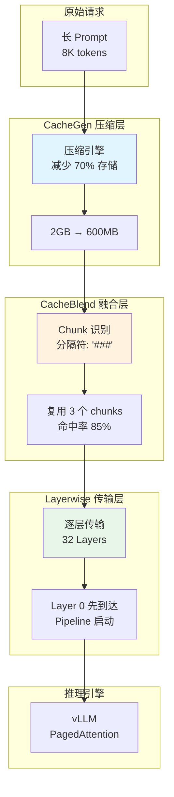
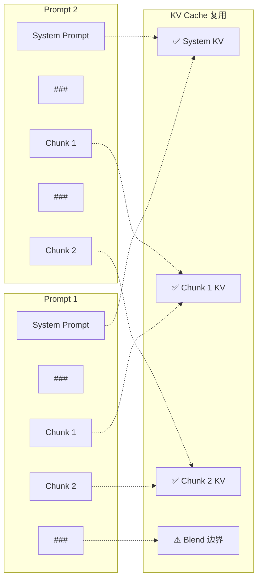
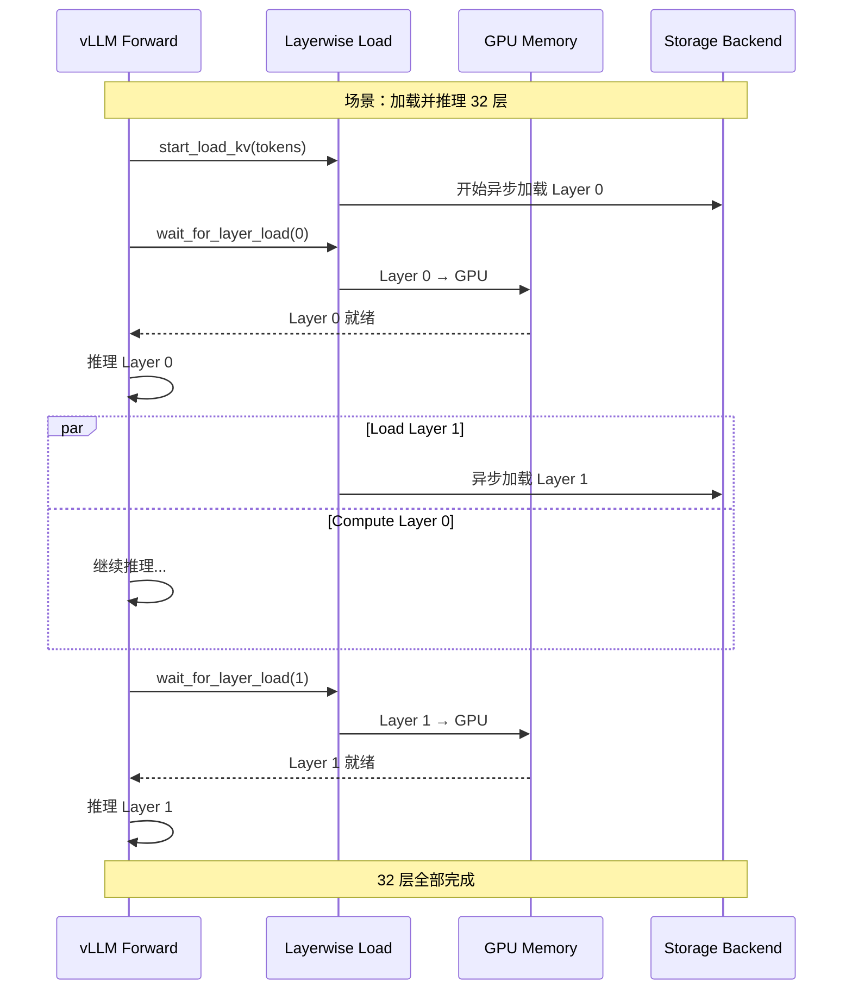
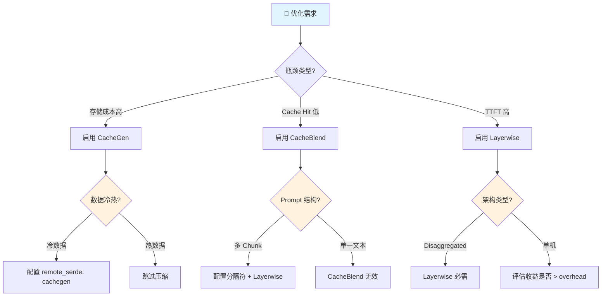

# LMCache 组件：KV Cache 优化技术

**目标受众**：一线工程师 & 架构师  
**核心价值**：CacheGen 压缩、CacheBlend 融合、Layerwise 传输的权衡与配置  
**贯穿类比**：图书馆的缩微胶片、目录合并、分层借阅

---

## 🌀 螺旋 1：概念闭环 — 是什么 & 为什么

### 1.1 场景痛点：KV Cache 的三大瓶颈

在 LLM 推理服务中，KV Cache 面临三大挑战：

| 瓶颈 | 问题描述 | 影响 | 典型场景 |
|------|----------|------|----------|
| **存储成本** | KV Cache 体积巨大（Llama-3.1-8B，8K 上下文 ≈ 2GB） | 显存快速耗尽 | 长文档 RAG |
| **传输带宽** | 跨节点共享 KV Cache 时网络成为瓶颈 | TTFT 飙升 | 多实例部署 |
| **复用局限** | 只能复用前缀（Prefix），中间内容浪费 | Cache Hit 率低 | 对话历史复用 |

**真实案例**：某知识库问答系统：
- 场景：1000 篇文档，每篇 4K tokens
- 问题：KV Cache 占用 2TB 存储，成本爆炸
- 用户查询："这篇文章的第3段讲了什么"
- **痛点**：传统 Prefix Cache 无法复用"第3段"这部分 KV（非前缀）

### 1.2 类比理解：图书馆的三大优化技术

| 优化技术 | 图书馆类比 | 核心问题 | 解决方案 |
|----------|------------|----------|----------|
| **CacheGen 压缩** | 缩微胶片 | 藏书太多占地方 | 把书缩微拍摄，节省 70% 空间 |
| **CacheBlend 融合** | 目录合并 | 只能按书名找书 | 按章节索引，任意段落都能复用 |
| **Layerwise 传输** | 分层借阅 | 等整本书编目完才能借 | 编目一章借一章，边编边借 |

#### 类比详解

**CacheGen - 缩微胶片**：
```
传统方式：每本书占一个书架位置（原始 KV Cache，2GB）
缩微胶片：把书拍照缩小保存（压缩后 KV Cache，400MB）
还原阅读：用阅读器放大查看（解压缩，延迟 < 1ms）
```

**CacheBlend - 目录合并**：
```
传统索引：只能查书名（Prefix Cache）
章节索引：可以查"第3章第2节"（任意位置复用）
智能合并：多本书的章节可以组合成新书（Chunk 拼接）
```

**Layerwise - 分层借阅**：
```
传统流程：等整本书编目完才能借（全量 KV 加载）
分层借阅：编目好第1章就借出第1章（Layer 0 先传输）
并行处理：编目员编第2章，借阅员借第1章（Pipeline）
```

### 1.3 优化技术全景图



### 1.4 三大优化技术对比

| 技术 | 解决痛点 | 收益 | 代价 | 适用场景 |
|------|----------|------|------|----------|
| **CacheGen** | 存储成本高 | 节省 60-70% 空间 | 压缩/解压 CPU 开销 | 长文档、冷数据 |
| **CacheBlend** | 非前缀无法复用 | 提升 40% 命中率 | 需要重新计算部分 KV | RAG、对话 |
| **Layerwise** | 传输延迟高 | TTFT 降低 30% | 实现复杂度增加 | 跨节点、Disaggregated |

### ✅ 螺旋 1 验收

> 一句话复述：三大优化技术分别解决 KV Cache 的存储、复用、传输三大瓶颈，像图书馆的缩微胶片、目录合并、分层借阅一样提升效率。

### 🔗 下一步指引

理解优化原理后，进入 **认知降压** ——把图书馆优化逻辑转化为技术直觉。

---

## 💨 认知降压：从类比到逻辑

### 从图书馆优化到技术决策

**降压主线**：把图书馆的常识转化为 KV Cache 优化的技术逻辑。

#### 1. 什么时候需要压缩？

**图书馆逻辑**：
> 珍贵古籍（高频访问）放在阅览室，普通书籍（低频访问）缩微保存。

**技术映射**：
```
热数据（Hot）：活跃对话 → GPU/CPU 显存，不压缩
温数据（Warm）：近期文档 → 本地磁盘，轻度压缩
冷数据（Cold）：历史文档 → 远程存储，CacheGen 压缩
```

#### 2. CacheBlend 的"重新计算"直觉

**图书馆逻辑**：
> 合并两本书的目录时，连接处需要重新编目（因为章节边界可能不连续）。

**技术映射**：
```
Chunk A + Chunk B 拼接时：
- Chunk A 的 KV：直接复用 ✅
- Chunk B 的 KV：直接复用 ✅
- 连接处的几个 token：需要重新计算 ⚠️

重新计算比例：通常 10-15%，收益远大于代价
```

#### 3. Layerwise 的 Pipeline 直觉

**图书馆逻辑**：
> 读者不需要等整本书编目完，编好一章就可以先看一章。

**技术映射**：
```
传统方式：等 32 层 KV 全部加载完才开始推理（延迟 100ms）
Layerwise：Layer 0 到达就开始推理 Layer 0（延迟 3ms）
          同时后台继续加载 Layer 1-31
```

### 理解铺垫：为什么不能"无脑全开"？

**反直觉现象**：
- 场景：短对话（< 1K tokens）
- 直觉：开启所有优化
- 现实：优化 overhead > 收益，反而变慢

**正确策略**：
| 场景 | CacheGen | CacheBlend | Layerwise |
|------|----------|------------|-----------|
| 短对话 (< 1K) | ❌ | ❌ | ❌ |
| 长文档 RAG | ✅ | ✅ | ✅ |
| 多轮对话 | ❌ | ✅ | ❌ |
| Disaggregated | ❌ | ❌ | ✅ |

### ✅ 认知降压验收

> 能用图书馆的"冷热分层、连接重编、边编边借"三段式逻辑，解释三大优化技术的适用场景。

### 🔗 下一步指引

认知降压完成，进入 **螺旋 2（机制层）** —— 深入源码级别的优化实现。

---

## 🌀 螺旋 2：机制闭环 — 如何运作

### 2.1 CacheGen 压缩机制

CacheGen 利用 KV Cache 的分布特性，将其编码为更紧凑的比特流表示。

#### 压缩原理

```python
class CacheGenCompressor:
    """CacheGen KV Cache 压缩器"""

    def __init__(self, quantization_bits: int = 4):
        self.quantization_bits = quantization_bits

    def compress(self, kv_cache: KVCache) -> CompressedData:
        """
        压缩 KV Cache

        原理：
        1. 对 Key/Value 矩阵进行非均匀量化
        2. 利用 KV Cache 的时间/空间局部性
        3. 使用算术编码进一步压缩
        """
        # 1. 提取 K 和 V 矩阵
        k_tensor = kv_cache.k  # [num_layers, num_heads, seq_len, head_dim]
        v_tensor = kv_cache.v

        # 2. 非均匀量化（4-bit 默认）
        k_quantized = self.non_uniform_quantize(
            k_tensor, bits=self.quantization_bits
        )
        v_quantized = self.non_uniform_quantize(
            v_tensor, bits=self.quantization_bits
        )

        # 3. 算术编码
        k_encoded = self.arithmetic_encode(k_quantized)
        v_encoded = self.arithmetic_encode(v_quantized)

        return CompressedData(
            k_data=k_encoded,
            v_data=v_encoded,
            original_size=kv_cache.size_bytes,
            compression_ratio=self.compute_ratio()
        )

    def decompress(self, compressed: CompressedData) -> KVCache:
        """解压缩，恢复 KV Cache"""
        # 1. 算术解码
        k_quantized = self.arithmetic_decode(compressed.k_data)
        v_quantized = self.arithmetic_decode(compressed.v_data)

        # 2. 反量化
        k_tensor = self.dequantize(k_quantized)
        v_tensor = self.dequantize(v_quantized)

        return KVCache(k=k_tensor, v=v_tensor)
```

#### 压缩收益分析

| 模型 | 原始大小 | CacheGen 后 | 压缩率 | 质量损失 |
|------|----------|-------------|--------|----------|
| Llama-3.1-8B, 8K | 2.0 GB | 600 MB | 70% | < 0.1% |
| Llama-3.1-70B, 8K | 16.0 GB | 4.8 GB | 70% | < 0.1% |
| Qwen-72B, 32K | 72.0 GB | 21.6 GB | 70% | < 0.1% |

### 2.2 CacheBlend 融合机制

CacheBlend 允许复用非前缀位置的 KV Cache，通过重新计算 Chunk 边界处的少量 token 来实现。

#### 工作原理



#### 配置实现

```python
# 启用 CacheBlend
import os

os.environ["LMCACHE_ENABLE_BLENDING"] = "True"
os.environ["LMCACHE_BLEND_SPECIAL_STR"] = " ### "  # Chunk 分隔符
os.environ["LMCACHE_USE_LAYERWISE"] = "True"       # Layerwise 必须开启
os.environ["LMCACHE_BLEND_CHECK_LAYERS"] = "1"     # 第1层检查融合点
os.environ["LMCACHE_BLEND_RECOMPUTE_RATIOS"] = "0.15"  # 重算 15% tokens

# 可选：使用稀疏注意力提升质量
os.environ["VLLM_ATTENTION_BACKEND"] = "FLASHINFER"
os.environ["LMCACHE_EXTRA_CONFIG"] = '{"enable_sparse": true}'
```

#### Token 处理示例

```python
from transformers import AutoTokenizer

tokenizer = AutoTokenizer.from_pretrained("meta-llama/Llama-3.1-8B-Instruct")

# 定义 Chunks
sys_prompt = tokenizer.encode("You are a helpful assistant.")
chunk1 = tokenizer.encode("Hello, how are you?" * 500)[1:]  # 长文本
chunk2 = tokenizer.encode("What's the weather like?" * 500)[1:]
blend_special = tokenizer.encode(" ### ")[1:]

# 构建第一个 Prompt（System + Chunk1 + Chunk2）
prompt1 = (
    sys_prompt +
    blend_special + chunk1 +
    blend_special + chunk2 +
    blend_special +
    tokenizer.encode("Tell me about")[1:]
)

# 构建第二个 Prompt（System + Chunk2 + Chunk1，顺序不同）
prompt2 = (
    sys_prompt +
    blend_special + chunk2 +
    blend_special + chunk1 +
    blend_special +
    tokenizer.encode("What's up")[1:]
)

# LMCache 会自动识别并复用 System、Chunk1、Chunk2 的 KV Cache
# 无论它们在 Prompt 中的顺序如何
```

### 2.3 Layerwise 传输机制

Layerwise KV Transfer 允许在 KV Cache 加载和推理计算之间建立 Pipeline，减少等待时间。

#### 架构组件

```python
class LayerwiseCacheEngine:
    """Layerwise 缓存引擎"""

    def __init__(self, num_layers: int = 32):
        self.num_layers = num_layers
        self.retrieval_generator = None  # 加载生成器
        self.storage_generator = None    # 存储生成器

    async def start_load_kv(self, tokens: List[int]):
        """启动逐层加载"""
        # 初始化 Retrieval Generator
        self.retrieval_generator = self.lmcache_engine.retrieve_layer(tokens)

        # 第1个 next(): 初始化
        next(self.retrieval_generator)
        # 第2个 next(): 加载 Layer 0
        next(self.retrieval_generator)

        return self.retrieval_generator

    async def wait_for_layer_load(self, layer_idx: int):
        """等待指定层加载完成"""
        # 推进 Generator 到目标层
        for _ in range(layer_idx + 1):
            layer_kv = next(self.retrieval_generator)

        # 异步加载到 GPU
        await self.gpu_connector.batched_to_gpu(layer_kv)

        return layer_kv

    async def save_kv_layer(self, layer_idx: int, kv_data: Tensor):
        """逐层保存 KV"""
        if self.storage_generator is None:
            # 首次调用：创建 Storage Generator
            self.storage_generator = self.create_storage_generator()

        # 推进到当前层
        for _ in range(layer_idx + 1):
            next(self.storage_generator)

        # GPU → CPU 传输
        await self.gpu_connector.batched_from_gpu(kv_data)

        # 存储到后端
        await self.storage_manager.batched_put(kv_data)
```

#### Pipeline 执行流程



#### CUDA Stream 同步

```python
class LayerwiseGPUConnector:
    """管理 GPU-CPU 内存传输的 CUDA Stream"""

    def __init__(self):
        # 三个 CUDA Stream
        self.current_stream = torch.cuda.current_stream()  # vLLM 计算流
        self.load_stream = torch.cuda.Stream()             # 加载流
        self.store_stream = torch.cuda.Stream()            # 存储流

    def batched_to_gpu(self, cpu_data: CPUPtr, layer_idx: int):
        """CPU → GPU 传输"""
        # 在 load_stream 上执行传输
        with torch.cuda.stream(self.load_stream):
            gpu_data = cpu_data.cuda()

        # 如果是 batch 中最后一个请求，同步 stream
        if self.is_last_in_batch():
            self.current_stream.wait_stream(self.load_stream)

        return gpu_data

    def batched_from_gpu(self, gpu_data: Tensor, layer_idx: int):
        """GPU → CPU 传输"""
        # 在 store_stream 上执行传输
        with torch.cuda.stream(self.store_stream):
            cpu_data = gpu_data.cpu()

        # 如果是 batch 中第一个请求，同步 stream
        if self.is_first_in_batch():
            self.store_stream.wait_stream(self.current_stream)

        return cpu_data
```

### ✅ 螺旋 2 验收

> 能够解释：CacheGen 的量化压缩原理、CacheBlend 的非前缀复用机制、Layerwise 的 Pipeline 传输逻辑。

### 🔗 衔接问题

生产环境如何配置这些优化？如何权衡压缩率与性能？进入 **螺旋 3（实战层）**。

---

## 🌀 螺旋 3：实战闭环 — 如何驾驭

### 3.1 优化配置实战

#### CacheGen 配置

```yaml
# lmcache-config.yaml
storage:
  remote:
    enabled: true
    backend: "redis"
    endpoint: "redis.cluster.local:6379"

# 启用 CacheGen 压缩
remote_serde: "cachegen"

# 压缩级别（可选）
compression:
  algorithm: "cachegen"
  quantization_bits: 4  # 4-bit 量化，平衡压缩率与质量
```

```python
# 代码中启用 CacheGen
import os

# 方式1：环境变量
os.environ["LMCACHE_REMOTE_SERDE"] = "cachegen"

# 方式2：运行时配置（vLLM）
# 在 lmcache-config.yaml 中设置 remote_serde: "cachegen"
```

#### CacheBlend 配置

```yaml
# lmcache-config.yaml
blending:
  enabled: true
  special_str: " ### "          # Chunk 分隔符
  recompute_ratios: 0.15        # 重算比例 15%
  check_layers: [1, 16]         # 在 Layer 1 和 16 检查融合

layerwise:
  enabled: true                 # CacheBlend 需要 Layerwise

# 可选：稀疏注意力
extra_config:
  enable_sparse: true
```

```python
# 代码中启用 CacheBlend
import os

os.environ["LMCACHE_ENABLE_BLENDING"] = "True"
os.environ["LMCACHE_BLEND_SPECIAL_STR"] = " ### "
os.environ["LMCACHE_USE_LAYERWISE"] = "True"
os.environ["LMCACHE_BLEND_CHECK_LAYERS"] = "1"
os.environ["LMCACHE_BLEND_RECOMPUTE_RATIOS"] = "0.15"

# 稀疏注意力（可选）
os.environ["VLLM_ATTENTION_BACKEND"] = "FLASHINFER"
os.environ["LMCACHE_EXTRA_CONFIG"] = '{"enable_sparse": true}'
```

#### Layerwise 配置

```yaml
# lmcache-config.yaml
layerwise:
  enabled: true
  use_async_load: true          # 异步加载
  buffer_size: "1Gi"            # 每层缓冲大小
```

### 3.2 不同场景的优化组合

| 场景 | CacheGen | CacheBlend | Layerwise | 预期收益 |
|------|----------|------------|-----------|----------|
| **长文档 RAG** | ✅ | ✅ | ✅ | 存储 -70%，TTFT -30% |
| **多轮对话** | ❌ | ✅ | ❌ | 命中率 +40% |
| **Disaggregated Prefill** | ❌ | ❌ | ✅ | TTFT -30% |
| **跨节点共享** | ✅ | ❌ | ❌ | 带宽 -70% |
| **短对话 (< 1K)** | ❌ | ❌ | ❌ | 优化 overhead > 收益 |

### 3.3 反模式

#### ❌ 反模式 1：CacheGen 压缩热数据

- **现象**：活跃对话的 KV 被压缩，TTFT 增加 50ms
- **根因**：压缩/解压开销抵消了缓存收益
- **修正**：
  ```yaml
  storage:
    cpu:
      enabled: true
      compression: "none"     # 热数据不压缩
    disk:
      compression: "cachegen"  # 冷数据压缩
  ```

#### ❌ 反模式 2：CacheBlend 分隔符选择不当

- **现象**：Chunk 识别失败，复用率 0%
- **根因**：分隔符在文本中自然出现
- **修正**：
  ```python
  # 使用不易自然出现的分隔符
  os.environ["LMCACHE_BLEND_SPECIAL_STR"] = "<|CHUNK_SEP|>"
  # 而不是常见的 "###" 或 "---"
  ```

#### ❌ 反模式 3：Layerwise 缓冲过小

- **现象**：Pipeline 频繁中断，性能反而下降
- **根因**：buffer_size < layer_size
- **修正**：
  ```yaml
  layerwise:
    buffer_size: "2Gi"  # 确保 > 单层 KV 大小 × batch_size
  ```

### 3.4 性能调优决策树



#### 调优检查清单

```bash
# 1. 验证 CacheGen 压缩率
curl -s http://localhost:8000/metrics | grep compression_ratio

# 2. 验证 CacheBlend 复用率
curl -s http://localhost:8000/metrics | grep blend_hit_rate

# 3. 验证 Layerwise 延迟
curl -s http://localhost:8000/metrics | grep layerwise_load_latency

# 4. 检查各层加载时间
curl -s http://localhost:8000/api/v1/layerwise/stats | jq '.layer_times'

# 5. 监控压缩/解压 CPU 使用率
top -p $(pgrep -d',' -f lmcache)
```

### 3.5 SRE 可观测性

#### 关键指标

```yaml
# Prometheus 告警规则
groups:
  - name: lmcache-optimizations
    rules:
      - alert: CacheGenDecompressionSlow
        expr: rate(lmcache_decompression_duration_seconds[5m]) > 0.01
        for: 2m
        labels:
          severity: warning
        annotations:
          summary: "CacheGen 解压耗时过长"

      - alert: CacheBlendLowHitRate
        expr: rate(lmcache_blend_hits_total[5m]) / rate(lmcache_blend_lookups_total[5m]) < 0.3
        for: 5m
        labels:
          severity: warning
        annotations:
          summary: "CacheBlend 命中率低于 30%"

      - alert: LayerwiseLoadLatencyHigh
        expr: histogram_quantile(0.99, rate(lmcache_layerwise_load_latency_bucket[5m])) > 50
        for: 3m
        labels:
          severity: warning
        annotations:
          summary: "Layerwise 加载延迟 > 50ms"
```

#### Grafana Dashboard 配置

```yaml
panels:
  - title: "CacheGen 压缩统计"
    targets:
      - expr: lmcache_compression_ratio
        legendFormat: "压缩率"
      - expr: rate(lmcache_compression_duration_seconds[5m])
        legendFormat: "压缩耗时"

  - title: "CacheBlend 命中率"
    targets:
      - expr: rate(lmcache_blend_hits_total[5m]) / rate(lmcache_blend_lookups_total[5m])
        legendFormat: "命中率"

  - title: "Layerwise 层加载时间"
    targets:
      - expr: histogram_quantile(0.99, rate(lmcache_layerwise_load_latency_bucket[5m]))
        legendFormat: "P99 加载延迟"
```

### ✅ 螺旋 3 验收

> 能够根据业务场景选择合适的优化组合，并能根据指标调整配置参数。

### 🔗 下一步指引

进入 **元知识总结** —— 沉淀优化技术的设计模式。

---

## 元知识总结

### 大规模瓶颈与调优

#### 三大优化的边界

| 技术 | 最佳适用范围 | 性能拐点 | 降级方案 |
|------|--------------|----------|----------|
| **CacheGen** | 冷数据、跨节点 | 压缩/解压 > 10ms | 降低量化精度 |
| **CacheBlend** | 多 Chunk RAG | 重算 > 30% | 增加 Chunk 大小 |
| **Layerwise** | 长序列、Disaggregated | Pipeline 中断频繁 | 增加 buffer_size |

#### 成本收益分析

| 优化 | 存储成本 | 计算成本 | 网络成本 | 总成本变化 |
|------|----------|----------|----------|------------|
| CacheGen | -70% | +5% | -70% | -60% |
| CacheBlend | 0% | +10% | 0% | -30%（Hit 率提升） |
| Layerwise | 0% | +2% | 0% | -15%（TTFT 降低） |

### 设计模式沉淀

| 模式名称 | 适用场景 | 优化组合 |
|----------|----------|----------|
| **极致压缩模式** | 超大规模文档库 | CacheGen + Redis 后端 |
| **高复用模式** | RAG 问答系统 | CacheBlend + Layerwise |
| **低延迟模式** | 实时对话 | 仅 Layerwise（Disaggregated） |
| **成本优先模式** | 预算敏感 | CacheGen + S3 后端 |

### 一句话 Takeaway

> **三大优化不是"越多越好"，而是"对症下药"——CacheGen 治存储、CacheBlend 治复用、Layerwise 治传输，根据业务特征精准组合才能收益最大化。**

---

**本模块质量检查清单**：

- [x] 三层螺旋结构完整
- [x] 每层有验收标准
- [x] 图书馆类比贯穿
- [x] 中国本土场景（知识库问答）
- [x] Mermaid 架构图
- [x] 三大技术对比表
- [x] 配置示例完整
- [x] 3+ 反模式
- [x] 场景化配置建议
- [x] 可观测性指标

---

## 延伸阅读

### 官方文档

- **CacheGen**: https://docs.lmcache.ai/kv_cache_optimizations/compression/cachegen.html
- **CacheBlend**: https://docs.lmcache.ai/kv_cache_optimizations/blending.html
- **Layerwise**: https://docs.lmcache.ai/kv_cache_optimizations/layerwise.html

### 相关论文

1. **CacheGen Paper**:  
   CacheGen: KV Cache Compression and Streaming for Fast Large Language Model Serving  
   https://dl.acm.org/doi/10.1145/3651890.3672274

2. **CacheBlend Paper**:  
   CacheBlend: Fast Large Language Model Serving with Cached Knowledge Fusion  
   https://arxiv.org/abs/2405.16444

### 相关技术

| 技术 | 关联点 | 学习建议 |
|------|--------|----------|
| **Quantization** | CacheGen 基础 | 了解 GPTQ/AWQ |
| **FlashAttention** | CacheBlend 可选后端 | 理解稀疏注意力 |
| **CUDA Streams** | Layerwise 实现基础 | 学习异步编程 |

---

**文档版本**: 2025-02  
**关联模块**: [02-disaggregated-prefill.md](02-disaggregated-prefill.md)（分布式预填充）
