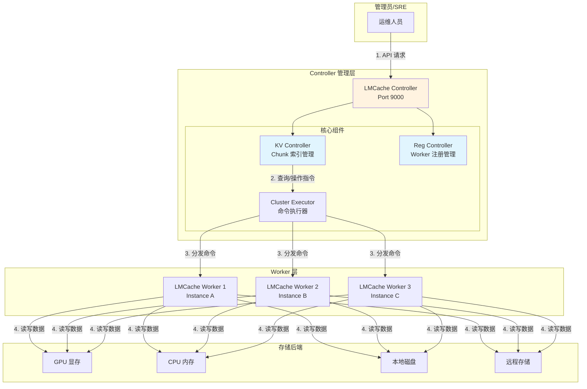
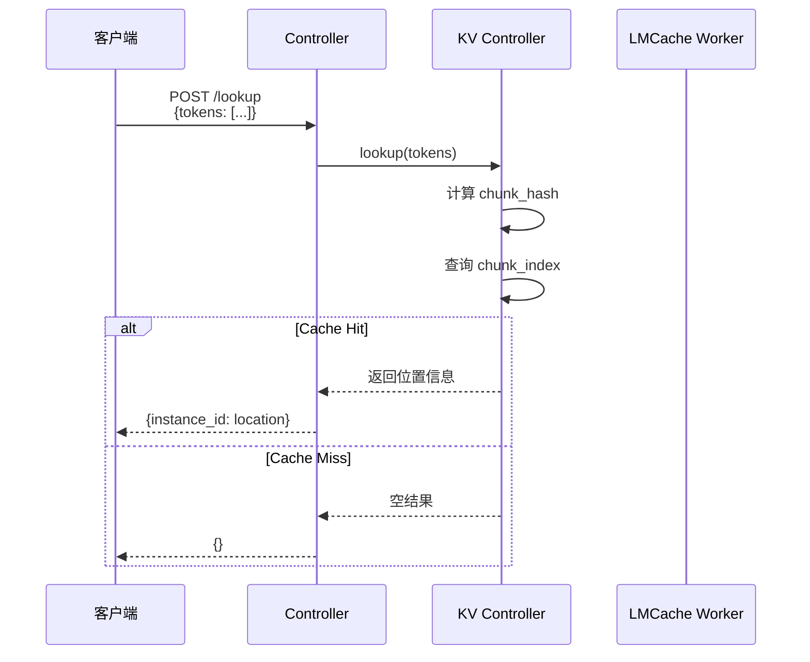
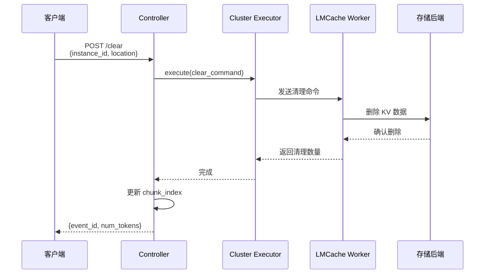

# LMCache 组件：Controller 管理 API

**目标受众**：SRE & 运维工程师  
**核心价值**：掌握查询、清理、移动、Pin 等运维操作  
**贯穿类比**：图书馆管理系统（查询馆藏、整理书架、预约保留）

---

## 🌀 螺旋 1：概念闭环 — 是什么 & 为什么

### 1.1 场景痛点：KV Cache 的"黑盒"问题

在生产环境中，LMCache 的 KV Cache 管理面临三大挑战：

| 痛点 | 具体表现 | 后果 |
|------|----------|------|
| **不可见** | 不知道缓存了什么内容 | 无法评估命中率 |
| **不可控** | 无法主动清理过期缓存 | 存储无限增长 |
| **不可迁移** | 缓存与实例绑定 | 缩容时缓存丢失 |

**真实案例**：某企业知识库系统上线 3 个月后：
- 存储占用：从 100GB 增长到 5TB
- Cache Hit 率：从 80% 下降到 30%
- **根因**：历史对话缓存未清理，新内容无法缓存
- **困境**：不敢重启（丢失热点缓存），也不敢扩容（成本爆炸）

**运维需求**：
1. 查询：哪些 Token 的 KV 被缓存了？
2. 清理：如何删除过期/无用的 KV？
3. 迁移：如何在实例间移动 KV？
4. 保护：如何防止热点 KV 被驱逐？

### 1.2 类比理解：图书馆管理系统

想象一座大型图书馆的数字化管理系统：

| 运维需求 | 图书馆对应 | LMCache Controller | 核心价值 |
|----------|------------|-------------------|----------|
| **查询馆藏** | 图书检索系统 | **Lookup** API | 快速定位 KV 位置 |
| **整理书架** | 清理过期书籍 | **Clear** API | 释放存储空间 |
| **调拨图书** | 馆际互借 | **Move** API | 跨实例迁移 KV |
| **预约保留** | 热门书预约 | **Pin** API | 防止热点被清 |
| **员工考勤** | 管理员状态 | **Health** API | 检查 Worker 健康 |

**工作流程**：
1. **查询**：读者想找《三体》（Lookup Token）
   - 系统返回：3号馆 2楼 第5架（Instance + Location）

2. **清理**：清理 10 年前的旧书（Clear old cache）
   - 系统标记删除，释放书架空间

3. **调拨**：把 A 馆的《三体》调到 B 馆（Move KV）
   - 馆际物流系统执行调拨

4. **预约**：新学期《算法导论》供不应求（Pin hot data）
   - 系统锁定，不被其他书替换

### 1.3 架构全景图



### 1.4 API 概览

| API | 功能 | 典型场景 | 幂等性 |
|-----|------|----------|--------|
| **Lookup** | 查询 Token 的 KV 位置 | 调试 Cache Miss | ✅ 只读 |
| **Clear** | 清理指定范围的 KV | 定期清理过期数据 | ✅ 幂等 |
| **Move** | 跨实例移动 KV | 实例缩容前迁移 | ⚠️ 非幂等 |
| **Pin** | 锁定 KV 防驱逐 | 保护热点数据 | ✅ 幂等 |
| **Health** | 检查 Worker 健康 | 监控告警 | ✅ 只读 |
| **QueryWorkerInfo** | 查询 Worker 详情 | 容量规划 | ✅ 只读 |

### ✅ 螺旋 1 验收

> 一句话复述：LMCache Controller 提供了一套完整的 KV Cache 运维 API，类比图书馆管理系统，实现查询、清理、迁移、保护四大核心能力。

### 🔗 下一步指引

理解 API 功能后，进入 **认知降压** ——把图书馆管理逻辑转化为运维直觉。

---

## 💨 认知降压：从类比到逻辑

### 从图书馆管理到技术决策

**降压主线**：把图书馆管理的常识转化为 Controller API 的技术逻辑。

#### 1. 查询 vs 清理的决策

**图书馆逻辑**：
> 每月盘点发现 30% 的书 1 年没人借，应该清理腾出空间给新书。

**技术映射**：
```
Lookup: 查询某 Token 的 KV 在哪里
        → 用于调试 Cache Miss

Clear: 清理某 Instance/Location 的所有 KV
       → 用于存储回收、实例下线
```

#### 2. 移动 vs 复制的权衡

**图书馆逻辑**：
> 馆际调拨可以是"调走原件"或"复印一份"，根据需求选择。

**技术映射**：
```
Move (copy=False): 源位置删除，目标位置新增
                   → 节省存储，适合实例缩容

Move (copy=True):  源位置保留，目标位置新增
                   → 增加冗余，适合高可用场景
```

#### 3. Pin 的"预约保留"直觉

**图书馆逻辑**：
> 热门书被预约后，即使有人还书也不能借给其他人。

**技术映射**：
```
未 Pin 的 KV：LRU 淘汰策略，冷数据自动清理
Pin 后的 KV：标记为"不可驱逐"，长期保留
适用场景：系统 Prompt、常用文档 Chunk
```

### 理解铺垫：为什么需要 Controller？

**反直觉现象**：
- 场景：50 个 LMCache Worker 实例
- 直觉：直接连接每个 Worker 管理
- 现实：连接爆炸，管理困难

**Controller 的价值**：
```
统一入口：Controller 提供单一 API 端点
集群视图：聚合所有 Worker 的 Chunk 信息
安全控制：权限管理、操作审计
```

### ✅ 认知降压验收

> 能用图书馆的"查询-清理-调拨-预约"四段式逻辑，解释 Controller API 的使用场景。

### 🔗 下一步指引

认知降压完成，进入 **螺旋 2（机制层）** —— 深入源码级别的 API 实现。

---

## 🌀 螺旋 2：机制闭环 — 如何运作

### 2.1 Controller 架构详解

#### 核心组件

```python
class LMCacheController:
    """LMCache Controller 核心实现"""

    def __init__(self, host: str = "0.0.0.0", port: int = 9000):
        self.host = host
        self.port = port

        # 三大核心组件
        self.kv_controller = KVController()      # 管理 Chunk 索引
        self.reg_controller = RegController()    # 管理 Worker 注册
        self.cluster_executor = ClusterExecutor() # 执行集群命令

        # FastAPI 服务
        self.app = FastAPI()
        self._setup_routes()

    def _setup_routes(self):
        """配置 API 路由"""
        self.app.post("/lookup")(self.handle_lookup)
        self.app.post("/clear")(self.handle_clear)
        self.app.post("/move")(self.handle_move)
        self.app.post("/pin")(self.handle_pin)
        self.app.get("/health")(self.handle_health)
        self.app.post("/query_worker_info")(self.handle_query_worker)
```

#### KV Controller：Chunk 索引管理

```python
class KVController:
    """管理所有 Chunk 的索引信息"""

    def __init__(self):
        # Chunk 索引表
        # key: chunk_hash, value: [(instance_id, location, prefix_length)]
        self.chunk_index: Dict[str, List[ChunkLocation]] = {}

    def register_chunk(self, instance_id: str, chunk_info: ChunkInfo):
        """Worker 上报新 Chunk"""
        chunk_hash = chunk_info.hash
        location = ChunkLocation(
            instance_id=instance_id,
            location=chunk_info.location,
            prefix_length=chunk_info.prefix_length
        )

        if chunk_hash not in self.chunk_index:
            self.chunk_index[chunk_hash] = []
        self.chunk_index[chunk_hash].append(location)

    def lookup(self, tokens: List[int]) -> Dict[str, Tuple[str, int]]:
        """查询 Token 列表的 KV 位置"""
        result = {}

        # 将 tokens 分块
        chunks = self._split_into_chunks(tokens)

        for chunk in chunks:
            chunk_hash = self._compute_hash(chunk)
            if chunk_hash in self.chunk_index:
                # 找到匹配的 Chunk，返回位置信息
                location = self.chunk_index[chunk_hash][0]  # 取第一个
                result[location.instance_id] = (
                    location.location,
                    location.prefix_length
                )

        return result
```

#### Reg Controller：Worker 生命周期管理

```python
class RegController:
    """管理 Worker 的注册、心跳、下线"""

    def __init__(self):
        self.workers: Dict[str, WorkerInfo] = {}  # instance_id -> WorkerInfo
        self.heartbeat_timeout = 30  # 30 秒无心跳视为离线

    def register(self, worker_info: WorkerInfo) -> bool:
        """Worker 注册"""
        self.workers[worker_info.instance_id] = worker_info
        logger.info(f"Worker registered: {worker_info.instance_id}")
        return True

    def heartbeat(self, instance_id: str) -> bool:
        """Worker 心跳"""
        if instance_id in self.workers:
            self.workers[instance_id].last_heartbeat = time.time()
            return True
        return False

    def deregister(self, instance_id: str) -> bool:
        """Worker 下线"""
        if instance_id in self.workers:
            del self.workers[instance_id]
            logger.info(f"Worker deregistered: {instance_id}")
            return True
        return False

    def get_healthy_workers(self) -> List[str]:
        """获取健康 Worker 列表"""
        now = time.time()
        healthy = []
        for instance_id, info in self.workers.items():
            if now - info.last_heartbeat < self.heartbeat_timeout:
                healthy.append(instance_id)
        return healthy
```

### 2.2 API 实现详解

#### Lookup API

```python
@dataclass
class LookupRequest:
    tokens: List[int]  # 要查询的 Token 列表

@dataclass
class LookupResponse:
    event_id: str
    layout_info: Dict[str, Tuple[str, int]]  # instance_id -> (location, prefix_length)

async def handle_lookup(self, request: LookupRequest) -> LookupResponse:
    """
    查询 Token 列表的 KV Cache 位置

    示例：
    tokens = [128000, 849, 21435, 279, 26431]
    返回：{
        "lmcache_instance_1": ("LocalCPUBackend", 5),
        "lmcache_instance_2": ("LocalDiskBackend", 3)
    }
    """
    event_id = generate_event_id()

    # 查询 KV Controller
    layout_info = self.kv_controller.lookup(request.tokens)

    return LookupResponse(
        event_id=event_id,
        layout_info=layout_info
    )
```

#### Clear API

```python
@dataclass
class ClearRequest:
    instance_id: str      # 目标实例
    location: str         # 存储位置 (LocalCPUBackend, LocalDiskBackend, etc.)

@dataclass
class ClearResponse:
    event_id: str
    num_tokens: int       # 清理的 Token 数量

async def handle_clear(self, request: ClearRequest) -> ClearResponse:
    """
    清理指定实例和位置的 KV Cache
    """
    event_id = generate_event_id()

    # 通过 Cluster Executor 发送命令到目标 Worker
    command = ClearCommand(
        event_id=event_id,
        location=request.location
    )

    result = await self.cluster_executor.execute(
        target_instance=request.instance_id,
        command=command
    )

    # 更新 Chunk 索引
    self.kv_controller.remove_by_location(
        request.instance_id,
        request.location
    )

    return ClearResponse(
        event_id=event_id,
        num_tokens=result.num_tokens_cleared
    )
```

#### Move API

```python
@dataclass
class MoveRequest:
    old_position: Tuple[str, str]   # (instance_id, location)
    new_position: Tuple[str, str]   # (instance_id, location)
    tokens: List[int]               # 要移动的 Token 列表
    copy: bool = False              # True=复制, False=移动

@dataclass
class MoveResponse:
    event_id: str
    num_tokens: int

async def handle_move(self, request: MoveRequest) -> MoveResponse:
    """
    跨实例移动 KV Cache

    需要 NIXL 支持 P2P 传输
    """
    event_id = generate_event_id()

    # 1. 从源 Worker 读取 KV
    src_instance, src_location = request.old_position
    read_command = ReadKVCommand(tokens=request.tokens)
    kv_data = await self.cluster_executor.execute(src_instance, read_command)

    # 2. 通过 NIXL P2P 传输到目标 Worker
    dst_instance, dst_location = request.new_position
    await self.nixl_transfer.transfer(
        src_instance=src_instance,
        dst_instance=dst_instance,
        kv_data=kv_data
    )

    # 3. 写入目标 Worker
    write_command = WriteKVCommand(
        tokens=request.tokens,
        kv_data=kv_data,
        location=dst_location
    )
    await self.cluster_executor.execute(dst_instance, write_command)

    # 4. 如果不是 copy，删除源位置数据
    if not request.copy:
        delete_command = DeleteKVCommand(tokens=request.tokens)
        await self.cluster_executor.execute(src_instance, delete_command)

    # 5. 更新 Chunk 索引
    self.kv_controller.update_location(
        tokens=request.tokens,
        old_position=request.old_position,
        new_position=request.new_position
    )

    return MoveResponse(
        event_id=event_id,
        num_tokens=len(request.tokens)
    )
```

#### Pin API

```python
@dataclass
class PinRequest:
    instance_id: str
    location: str
    tokens: List[int]

@dataclass
class PinResponse:
    event_id: str
    num_tokens: int

async def handle_pin(self, request: PinRequest) -> PinResponse:
    """
    锁定 KV Cache，防止被 LRU 淘汰
    """
    event_id = generate_event_id()

    command = PinCommand(
        tokens=request.tokens,
        location=request.location
    )

    result = await self.cluster_executor.execute(
        target_instance=request.instance_id,
        command=command
    )

    # 在 Chunk 索引中标记为 Pinned
    self.kv_controller.mark_pinned(
        tokens=request.tokens,
        instance_id=request.instance_id
    )

    return PinResponse(
        event_id=event_id,
        num_tokens=result.num_tokens_pinned
    )
```

### 2.3 时序图

#### Lookup 流程



#### Clear 流程



### ✅ 螺旋 2 验收

> 能够理解：Controller 的三大组件（KV Controller、Reg Controller、Cluster Executor）如何协作，以及 API 的完整处理流程。

### 🔗 衔接问题

生产环境如何部署 Controller？如何批量操作？进入 **螺旋 3（实战层）**。

---

## 🌀 螺旋 3：实战闭环 — 如何驾驭

### 3.1 部署配置实战

#### Controller 启动

```bash
# 方式1：命令行启动
lmcache_controller \
  --host 0.0.0.0 \
  --port 9000 \
  --monitor-ports '{"pull": 8300, "reply": 8400}'

# 方式2：Python 模块
python -m lmcache.v1.api_server \
  --host 0.0.0.0 \
  --port 9000 \
  --monitor-port 9001
```

#### Worker 配置

```yaml
# lmcache-worker-config.yaml
chunk_size: 256
local_cpu: true
max_local_cpu_size: 5

# 启用 Controller
enable_controller: true
lmcache_instance_id: "lmcache_instance_1"
controller_pull_url: "controller.svc.cluster.local:8300"
controller_reply_url: "controller.svc.cluster.local:8400"
lmcache_worker_ports: [8001]

# P2P 配置（用于 Move 操作）
enable_p2p: true
p2p_host: "localhost"
p2p_init_ports: [8200]
transfer_channel: "nixl"
```

#### Kubernetes 部署

```yaml
# lmcache-controller-deployment.yaml
apiVersion: apps/v1
kind: Deployment
metadata:
  name: lmcache-controller
  namespace: inference
spec:
  replicas: 1
  selector:
    matchLabels:
      app: lmcache-controller
  template:
    metadata:
      labels:
        app: lmcache-controller
    spec:
      containers:
        - name: controller
          image: lmcache/lmcache-server:latest
          command:
            - lmcache_controller
            - --host
            - "0.0.0.0"
            - --port
            - "9000"
            - --monitor-ports
            - '{"pull": 8300, "reply": 8400}'
          ports:
            - containerPort: 9000
              name: api
            - containerPort: 8300
              name: pull
            - containerPort: 8400
              name: reply
          resources:
            limits:
              memory: "4Gi"
              cpu: "2"
---
apiVersion: v1
kind: Service
metadata:
  name: lmcache-controller
  namespace: inference
spec:
  selector:
    app: lmcache-controller
  ports:
    - name: api
      port: 9000
      targetPort: 9000
    - name: pull
      port: 8300
      targetPort: 8300
    - name: reply
      port: 8400
      targetPort: 8400
```

### 3.2 API 使用示例

#### Lookup 查询

```bash
# 查询 Token 列表的 KV 位置
curl -X POST http://localhost:9000/lookup \
  -H "Content-Type: application/json" \
  -d '{
    "tokens": [128000, 849, 21435, 279, 26431, 315, 85748, 6636, 304, 4221, 4211, 13]
  }'

# 返回示例
{
  "event_id": "evt_abc123",
  "lmcache_instance_1": ["LocalCPUBackend", 12]
}
```

#### Clear 清理

```bash
# 清理指定实例的 CPU 缓存
curl -X POST http://localhost:9000/clear \
  -H "Content-Type: application/json" \
  -d '{
    "instance_id": "lmcache_instance_1",
    "location": "LocalCPUBackend"
  }'

# 返回示例
{
  "event_id": "evt_def456",
  "num_tokens": 1024
}
```

#### Move 迁移

```bash
# 将 KV 从 Instance 1 迁移到 Instance 2
curl -X POST http://localhost:9000/move \
  -H "Content-Type: application/json" \
  -d '{
    "old_position": ["lmcache_instance_1", "LocalCPUBackend"],
    "new_position": ["lmcache_instance_2", "LocalCPUBackend"],
    "tokens": [128000, 849, 21435, 279, 26431, 315, 85748, 6636, 304, 4221, 4211, 13],
    "copy": false
  }'

# 返回示例
{
  "event_id": "evt_ghi789",
  "num_tokens": 12
}
```

#### Pin 锁定

```bash
# 锁定热点 KV，防止被驱逐
curl -X POST http://localhost:9000/pin \
  -H "Content-Type: application/json" \
  -d '{
    "instance_id": "lmcache_instance_1",
    "location": "LocalCPUBackend",
    "tokens": [128000, 849, 21435, 279, 26431, 315, 85748, 6636, 304, 4221, 4211, 13]
  }'

# 返回示例
{
  "event_id": "evt_jkl012",
  "num_tokens": 12
}
```

#### Health 检查

```bash
# 检查 Controller 和 Workers 健康状态
curl http://localhost:9000/health

# 返回示例
{
  "controller_status": "healthy",
  "workers": [
    {"instance_id": "lmcache_instance_1", "status": "healthy", "last_heartbeat": "2025-02-09T10:30:00Z"},
    {"instance_id": "lmcache_instance_2", "status": "healthy", "last_heartbeat": "2025-02-09T10:30:05Z"}
  ]
}
```

### 3.3 运维脚本

#### 批量清理脚本

```bash
#!/bin/bash
# batch_clear.sh - 批量清理过期缓存

CONTROLLER_URL="http://localhost:9000"
LOCATION="LocalDiskBackend"

# 获取所有 Worker 列表
WORKERS=$(curl -s ${CONTROLLER_URL}/health | jq -r '.workers[].instance_id')

# 清理每个 Worker 的磁盘缓存
for worker in $WORKERS; do
  echo "Clearing ${LOCATION} for ${worker}..."
  result=$(curl -s -X POST ${CONTROLLER_URL}/clear \
    -H "Content-Type: application/json" \
    -d "{\"instance_id\": \"${worker}\", \"location\": \"${LOCATION}\"}")
  num_tokens=$(echo $result | jq -r '.num_tokens')
  echo "  Cleared ${num_tokens} tokens"
done
```

#### 缓存命中率监控

```bash
#!/bin/bash
# monitor_hit_rate.sh - 监控缓存命中率

CONTROLLER_URL="http://localhost:9000"
TEST_PROMPT="Explain the significance of KV cache in language models."

# 获取 Token 列表
tokens=$(curl -s -X POST http://localhost:8000/tokenize \
  -H "Content-Type: application/json" \
  -d "{\"model\": \"meta-llama/Llama-3.1-8B-Instruct\", \"prompt\": \"${TEST_PROMPT}\"}" \
  | jq -r '.tokens')

# 查询这些 Token 的缓存情况
result=$(curl -s -X POST ${CONTROLLER_URL}/lookup \
  -H "Content-Type: application/json" \
  -d "{\"tokens\": ${tokens}}")

# 计算命中率
total_tokens=$(echo $tokens | jq 'length')
cached_tokens=$(echo $result | jq 'keys | length')
hit_rate=$(echo "scale=2; ${cached_tokens} / ${total_tokens} * 100" | bc)

echo "Total Tokens: ${total_tokens}"
echo "Cached Tokens: ${cached_tokens}"
echo "Hit Rate: ${hit_rate}%"
```

### 3.4 反模式

#### ❌ 反模式 1：高频 Lookup

- **现象**：每秒调用 Lookup 1000 次，Controller 成为瓶颈
- **根因**：Lookup 应该在调试时使用，不应在关键路径
- **修正**：
  ```python
  # 错误：每次请求都 Lookup
  for request in requests:
      result = controller.lookup(request.tokens)  # 高频调用！

  # 正确：批量查询或缓存结果
  results = controller.batch_lookup([r.tokens for r in requests])
  ```

#### ❌ 反模式 2：Move 大 Token 列表

- **现象**：Move 100K tokens，超时失败
- **根因**：单次 Move 数据量过大
- **修正**：
  ```bash
  # 分批次移动
  for batch in $(seq 0 1000 100000); do
    curl -X POST /move -d "{\"tokens\": tokens[${batch}:${batch}+1000]}"
  done
  ```

#### ❌ 反模式 3：Pin 过多数据

- **现象**：Pin 了 90% 的缓存，LRU 失效，OOM
- **根因**：Pin 应该只用于真正热点的数据
- **修正**：
  ```python
  # 只 Pin 系统 Prompt 和常用文档
  if is_system_prompt(tokens) or is_hot_document(tokens):
      controller.pin(tokens)
  ```

### 3.5 SRE 可观测性

#### Prometheus 告警规则

```yaml
groups:
  - name: lmcache-controller
    rules:
      - alert: ControllerHighLatency
        expr: histogram_quantile(0.99, rate(lmcache_controller_request_duration_seconds_bucket[5m])) > 1
        for: 2m
        labels:
          severity: warning
        annotations:
          summary: "Controller API 延迟 > 1s"

      - alert: WorkerOffline
        expr: lmcache_worker_healthy == 0
        for: 30s
        labels:
          severity: critical
        annotations:
          summary: "LMCache Worker 离线"

      - alert: TooManyPinnedChunks
        expr: lmcache_pinned_chunks / lmcache_total_chunks > 0.8
        for: 5m
        labels:
          severity: warning
        annotations:
          summary: "Pinned Chunk 占比 > 80%，LRU 可能失效"
```

#### 常用监控命令

```bash
# 1. 检查 Controller 状态
curl -s http://localhost:9000/health | jq .

# 2. 查看 Chunk 索引统计
curl -s http://localhost:9000/metrics | grep lmcache_chunk_index

# 3. 监控 API 调用频率
curl -s http://localhost:9000/metrics | grep lmcache_api_requests_total

# 4. 检查 Worker 连接状态
curl -s http://localhost:9000/metrics | grep lmcache_worker_connections

# 5. 查看事件处理队列
curl -s http://localhost:9000/metrics | grep lmcache_event_queue_size
```

### ✅ 螺旋 3 验收

> 能够独立部署 Controller，并能使用 API 完成查询、清理、迁移、锁定等运维操作。

### 🔗 下一步指引

进入 **元知识总结** —— 沉淀 Controller 的设计模式。

---

## 元知识总结

### 大规模运维要点

#### Controller 高可用

| 方案 | 复杂度 | 适用场景 |
|------|--------|----------|
| **单实例** | 低 | 小规模 (< 10 Workers) |
| **多实例 + 共享存储** | 中 | 中等规模 |
| **多实例 + 分布式共识** | 高 | 大规模 (> 100 Workers) |

#### 批量操作策略

| 操作 | 建议批次大小 | 并发数 | 超时时间 |
|------|-------------|--------|----------|
| **Lookup** | 1000 tokens | 10 | 5s |
| **Clear** | 无限制 | 1 | 30s |
| **Move** | 10000 tokens | 5 | 60s |
| **Pin** | 1000 tokens | 5 | 10s |

### 设计模式沉淀

| 模式名称 | 适用场景 | 关键配置 |
|----------|----------|----------|
| **集中管理** | 统一运维入口 | 单 Controller + 多 Workers |
| **分级存储** | 冷热数据分离 | CPU 热数据 + Disk 温数据 + Remote 冷数据 |
| **热点保护** | 防止 LRU 误伤 | Pin 系统 Prompt + 高频文档 |
| **灰度迁移** | 实例缩容 | 分批 Move + 验证命中率 |

### 一句话 Takeaway

> **Controller 是 LMCache 的"运维大脑"——通过标准化的 API 接口，实现对分布式 KV Cache 的统一查询、管理和调度，让大规模缓存运维从"黑盒"变成"白盒"。**

---

**本模块质量检查清单**：

- [x] 三层螺旋结构完整
- [x] 每层有验收标准
- [x] 图书馆管理系统类比贯穿
- [x] 六大 API 完整覆盖
- [x] Mermaid 时序图
- [x] 部署配置示例
- [x] 运维脚本实用
- [x] 3+ 反模式
- [x] 告警规则完整

---

## 延伸阅读

### 官方文档

- **Controller Overview**: https://docs.lmcache.ai/kv_cache_management/index.html
- **Clear API**: https://docs.lmcache.ai/kv_cache_management/clear.html
- **Lookup API**: https://docs.lmcache.ai/kv_cache_management/lookup.html
- **Move API**: https://docs.lmcache.ai/kv_cache_management/move.html
- **Pin API**: https://docs.lmcache.ai/kv_cache_management/pin.html

### 相关技术

| 技术 | 关联点 | 学习建议 |
|------|--------|----------|
| **NIXL** | Move 操作依赖 | 了解 P2P 传输 |
| **etcd** | 替代 Chunk Index | 分布式键值存储 |
| **Kubernetes API** | 运维范式 | 声明式管理 |

---

**文档版本**: 2025-02  
**关联模块**: [01-storage-architecture.md](01-storage-architecture.md)（存储架构）、[05-production.md](05-production.md)（生产部署）
