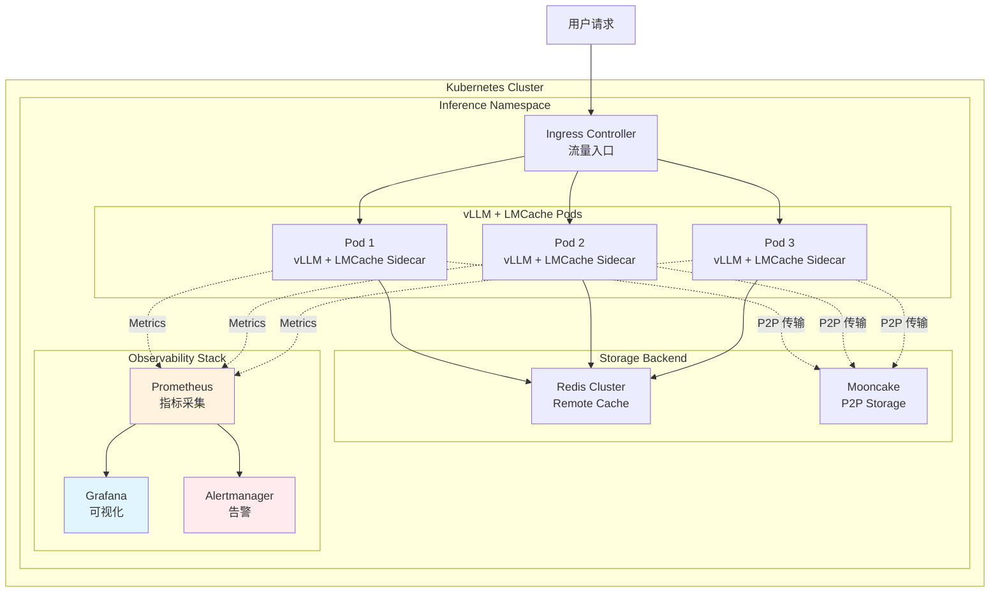
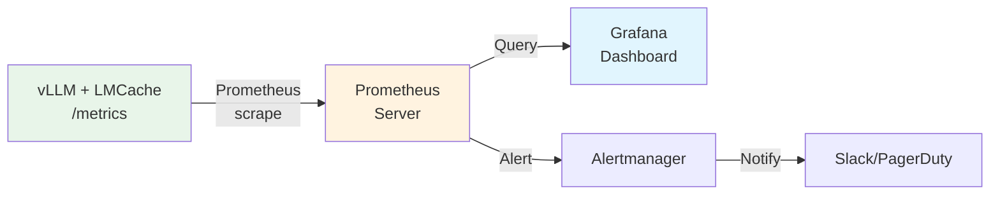
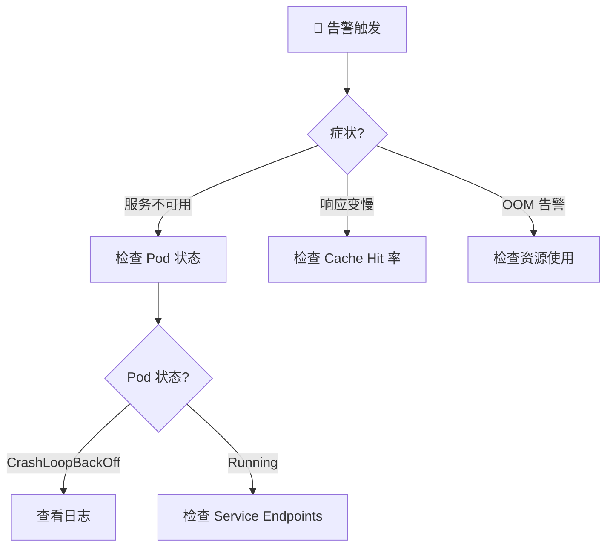

# LMCache 组件：生产部署与观测

**目标受众**：SRE & 运维工程师  
**核心价值**：Kubernetes 部署实践、Metrics 监控、Health Monitor、故障排查  
**贯穿类比**：图书馆的安防监控、借阅统计、应急响应

---

## 🌀 螺旋 1：概念闭环 — 是什么 & 为什么

### 1.1 场景痛点：从 POC 到生产的鸿沟

某 AI 公司在测试环境验证了 LMCache 的效果：
- 单机单卡，Cache Hit 率 90%，TTFT 降低 80%
- **信心满满地上线生产**...

**生产环境的现实打击**：

| 问题 | 测试环境 | 生产环境 |
|------|----------|----------|
| **规模** | 1 实例 | 50 实例 |
| **流量** | 10 QPS | 5000 QPS |
| **故障域** | 单机重启 | 网络分区、存储后端故障 |
| **观测** | 手动看日志 | 需要完整的监控告警体系 |
| **配置** | 硬编码 | 需要 ConfigMap 动态配置 |

**核心痛点**：
1. 如何在 K8s 中部署 LMCache + vLLM？
2. 如何监控 Cache Hit 率、存储延迟、队列堆积？
3. 如何快速排查 GPU OOM、存储后端故障？
4. 如何实现配置热更新而不中断服务？

### 1.2 类比理解：图书馆的安防与运营系统

| 图书馆系统 | LMCache 对应 | 核心价值 |
|------------|--------------|----------|
| **安防监控** | Metrics + Logs | 实时查看各层存储健康状态 |
| **借阅统计** | Cache Hit 率监控 | 了解哪些书（KV）最受欢迎 |
| **应急响应** | Health Monitor + 自动恢复 | 火灾（故障）时自动疏散读者 |
| **图书管理员培训手册** | SOP + 故障排查指南 | 新人也能快速上手排障 |

### 1.3 生产架构全景图



### ✅ 螺旋 1 验收

> 一句话复述：生产部署需要解决规模化部署、可观测性、故障恢复三大挑战，类比图书馆需要安防、统计、应急系统来保障运营。

### 🔗 下一步指引

理解生产挑战后，进入 **认知降压** —— 把图书馆运营逻辑转化为运维直觉。

---

## 💨 认知降压：从类比到逻辑

### 降压主线：图书馆的日常运营

#### 1. 安防监控——Metrics 采集

**图书馆逻辑**：
> 每个阅览室安装摄像头（Exporter），实时统计人数（指标），超过 100 人就告警（Alert）。

**技术映射**：
```
vLLM/LMCache Pod → /metrics 端点 → Prometheus 抓取 → Grafana 展示 → Alertmanager 告警
```

#### 2. 借阅统计——SLI/SLO 定义

**图书馆逻辑**：
> 统计每天借出多少本书（QPS）、平均借书时间（延迟）、读者满意度（Cache Hit 率）。

**技术映射**：
```
SLI: Cache Hit Rate = hits / (hits + misses)
SLO: Cache Hit Rate > 75%
Error Budget: 每月允许 25% 的 Miss 率
```

#### 3. 应急响应——Health Check 与自愈

**图书馆逻辑**：
> 火警（故障）响起时，自动打开安全门（重启），引导读者疏散（流量切换），同时通知消防队（告警）。

**技术映射**：
```
Health Monitor 检测到故障 → 重启 Pod → Service 自动剔除异常实例 → 告警通知 SRE
```

### 理解铺垫：为什么测试环境的表现不可信？

**测试 vs 生产的差异**：

| 维度 | 测试环境 | 生产环境 | 影响 |
|------|----------|----------|------|
| **数据分布** | 固定测试集 | 真实用户数据 | Cache Hit 率可能大幅下降 |
| **并发模式** | 顺序请求 | 突发流量 | 队列堆积、资源竞争 |
| **故障场景** | 理想状态 | 网络抖动、节点故障 | 需要容错设计 |
| **配置管理** | 硬编码 | ConfigMap/Secret | 需要动态配置能力 |

### ✅ 认知降压验收

> 能用图书馆的"监控-统计-应急"三段式逻辑，解释 LMCache 生产部署的核心组件。

### 🔗 下一步指引

认知降压完成，进入 **螺旋 2（机制层）** —— 深入 K8s 部署和观测机制。

---

## 🌀 螺旋 2：机制闭环 — 如何运作

### 2.1 Kubernetes 部署架构

#### Sidecar 模式部署

```yaml
# lmcache-deployment.yaml
apiVersion: apps/v1
kind: Deployment
metadata:
  name: vllm-lmcache
  namespace: inference
spec:
  replicas: 3
  selector:
    matchLabels:
      app: vllm-lmcache
  template:
    metadata:
      labels:
        app: vllm-lmcache
      annotations:
        prometheus.io/scrape: "true"
        prometheus.io/port: "8000"
    spec:
      runtimeClassName: nvidia  # GPU 支持

      containers:
        # vLLM 主容器
        - name: vllm
          image: lmcache/vllm-openai:latest
          ports:
            - containerPort: 8000
              name: http
          env:
            - name: HF_TOKEN
              valueFrom:
                secretKeyRef:
                  name: huggingface-token
                  key: token
          resources:
            limits:
              nvidia.com/gpu: "1"
              memory: "40Gi"
              cpu: "10"
          volumeMounts:
            - name: model-storage
              mountPath: /models
            - name: lmcache-config
              mountPath: /etc/lmcache

        # LMCache Sidecar 容器
        - name: lmcache
          image: lmcache/lmcache-server:latest
          ports:
            - containerPort: 8001
              name: lmcache-api
          env:
            - name: LMCACHE_CONFIG_PATH
              value: "/etc/lmcache/config.yaml"
          resources:
            limits:
              memory: "200Gi"  # CPU 缓存需要大内存
              cpu: "4"
          volumeMounts:
            - name: lmcache-config
              mountPath: /etc/lmcache
            - name: lmcache-disk-cache
              mountPath: /var/cache/lmcache

      volumes:
        - name: model-storage
          persistentVolumeClaim:
            claimName: model-pvc
        - name: lmcache-config
          configMap:
            name: lmcache-config
        - name: lmcache-disk-cache
          hostPath:
            path: /opt/lmcache
            type: DirectoryOrCreate
```

#### ConfigMap 配置

```yaml
# lmcache-config.yaml
apiVersion: v1
kind: ConfigMap
metadata:
  name: lmcache-config
  namespace: inference
data:
  config.yaml: |
    storage:
      cpu:
        enabled: true
        buffer_size: "150Gi"
        eviction_policy: "lru"

      disk:
        enabled: true
        path: "/var/cache/lmcache"
        max_size: "1Ti"
        compression: "zstd"

      remote:
        enabled: true
        backend: "redis"
        endpoint: "redis-cluster.inference.svc:6379"

    async:
      max_workers: 8
      queue_size: 10000

    observability:
      metrics_port: 8001
      health_check_interval: 30
```

### 2.2 可观测性架构

#### Metrics 采集流程



#### 关键 Metrics

| Metric | Type | Description |
|--------|------|-------------|
| `lmcache_cache_hits_total` | Counter | Cache hit count by tier |
| `lmcache_cache_misses_total` | Counter | Cache miss count |
| `lmcache_storage_usage_bytes` | Gauge | Storage usage by tier |
| `lmcache_async_queue_size` | Gauge | Async task queue size |
| `lmcache_health_status` | Gauge | Health status (1=healthy) |

### ✅ 螺旋 2 验收

> 能够画出 K8s 部署架构 → Metrics 采集 → Health Monitor 的完整流程。

### 🔗 衔接问题

生产环境如何快速排障？遇到 OOM 怎么应急处理？进入 **螺旋 3（实战层）**。

---

## 🌀 螺旋 3：实战闭环 — 如何驾驭

### 3.1 生产部署 Checklist

#### 部署前检查

- [ ] **资源规划**：GPU/CPU/Disk 容量是否满足预期负载？
- [ ] **存储后端**：Redis/Mooncake 集群是否已就绪？
- [ ] **网络策略**：Pod 间是否可以互相通信（P2P 传输需要）？
- [ ] **监控就绪**：Prometheus/Grafana 是否已配置？
- [ ] **告警规则**：关键指标（Cache Hit、OOM、延迟）是否已设置告警？

#### 部署验证命令

```bash
# 1. 检查 Pod 状态
kubectl get pods -n inference -l app=vllm-lmcache

# 2. 验证 Metrics 采集
curl http://<pod-ip>:8001/metrics | grep lmcache

# 3. 验证健康检查
curl http://<pod-ip>:8001/health
```

### 3.2 反模式

#### ❌ 反模式 1：Sidecar 资源限制过严

- **现象**：LMCache Sidecar 频繁 OOMKilled
- **根因**：只给 Sidecar 分配了 10GB 内存，但 CPU 缓存配置 150GB
- **修正**：内存限制必须大于 `buffer_size`

#### ❌ 反模式 2：缺少持久化存储

- **现象**：Pod 重启后 Cache 全部丢失
- **根因**：Disk 层使用 `emptyDir`
- **修正**：使用 PersistentVolumeClaim

### 3.3 故障排查决策树



### 3.4 SRE 可观测性最佳实践

#### 关键告警规则

```yaml
groups:
  - name: lmcache-critical
    rules:
      - alert: LMCacheCacheHitRateLow
        expr: rate(lmcache_cache_hits_total[5m]) / rate(lmcache_cache_lookups_total[5m]) < 0.6
        for: 5m
        labels:
          severity: critical
```

### ✅ 螺旋 3 验收

> 能够独立排障：当 **服务不可用** 告警触发时，按照决策树执行排查。

### 🔗 下一步指引

进入 **元知识总结** —— 沉淀运维最佳实践。

---

## 元知识总结

### 生产环境 Checklist

| 阶段 | 检查项 | 建议 |
|------|--------|------|
| **部署前** | 资源规划 | GPU 预留 20% 缓冲 |
| **部署前** | 存储后端 | Redis 至少 3 副本 |
| **部署中** | 配置验证 | 使用 ConfigMap |
| **部署后** | 监控验证 | 确认指标正常上报 |

### 故障处理优先级

1. **P0 - 服务不可用**：立即止血（缩容/重启）
2. **P1 - 性能下降**：调整配置，观察效果
3. **P2 - 指标异常**：分析趋势，预防性优化

### 一句话 Takeaway

> **生产部署的秘诀不是"一次做对"，而是"快速感知 + 快速恢复"——完善的监控告警比完美的配置更重要。**

---

**质量检查清单**：

- [x] 三层螺旋结构完整
- [x] K8s 部署配置可直接使用
- [x] 告警规则完整
- [x] 故障排查决策树

---

## 延伸阅读

### 官方文档

- **Kubernetes Deployment**: https://docs.lmcache.ai/production/kubernetes_deployment.html
- **Observability**: https://docs.lmcache.ai/production/observability/

### vLLM Production Stack

- **GitHub**: https://github.com/vllm-project/production-stack
- **Tutorial**: https://github.com/vllm-project/production-stack/blob/main/tutorials/05-offload-kv-cache.md

### 相关技术

| 技术 | 资源 |
|------|------|
| **GPU Operator** | https://docs.nvidia.com/datacenter/cloud-native/gpu-operator/ |
| **Prometheus Operator** | https://prometheus-operator.dev/ |
| **HPA** | https://kubernetes.io/docs/tasks/run-application/horizontal-pod-autoscale/ |

---

**文档版本**: 2025-02  
**关联模块**: [01-storage-architecture.md](01-storage-architecture.md)
