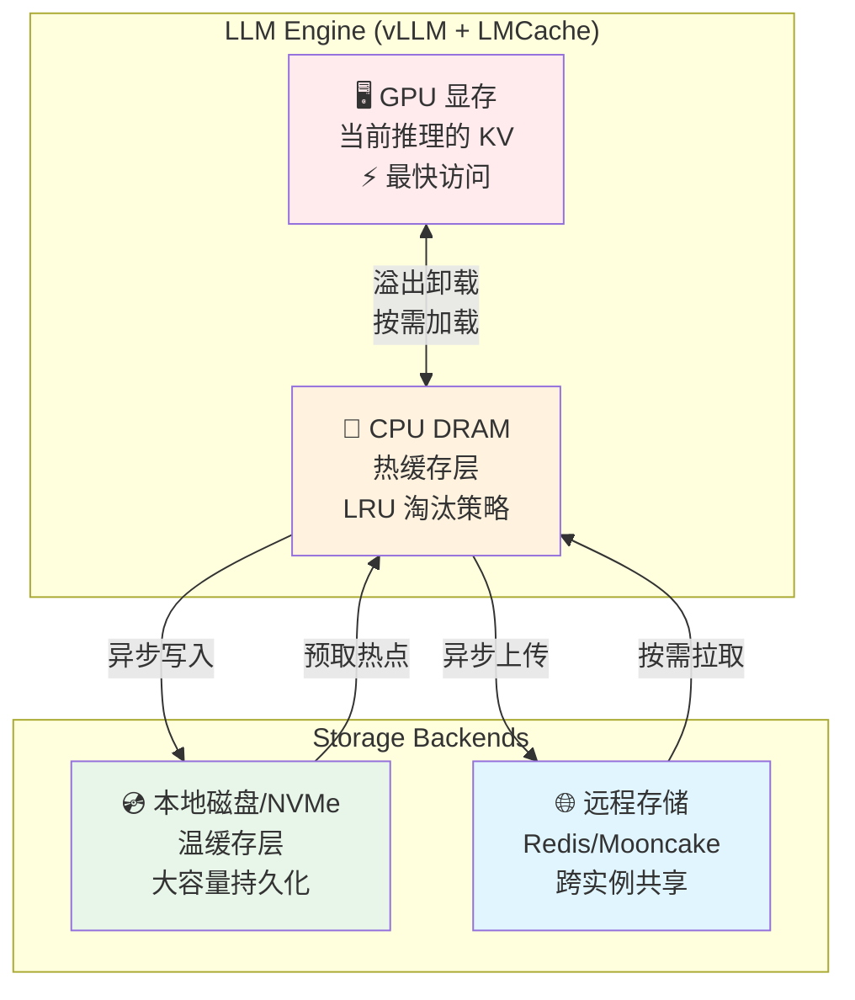
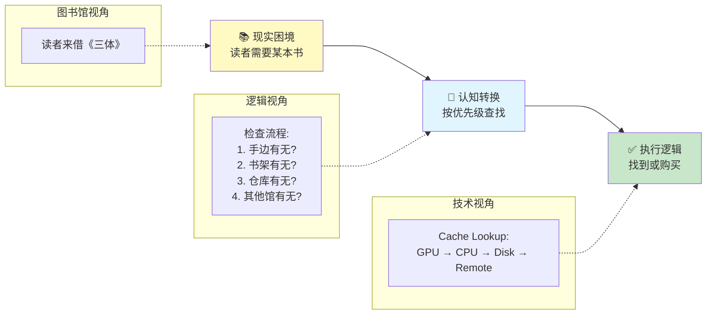
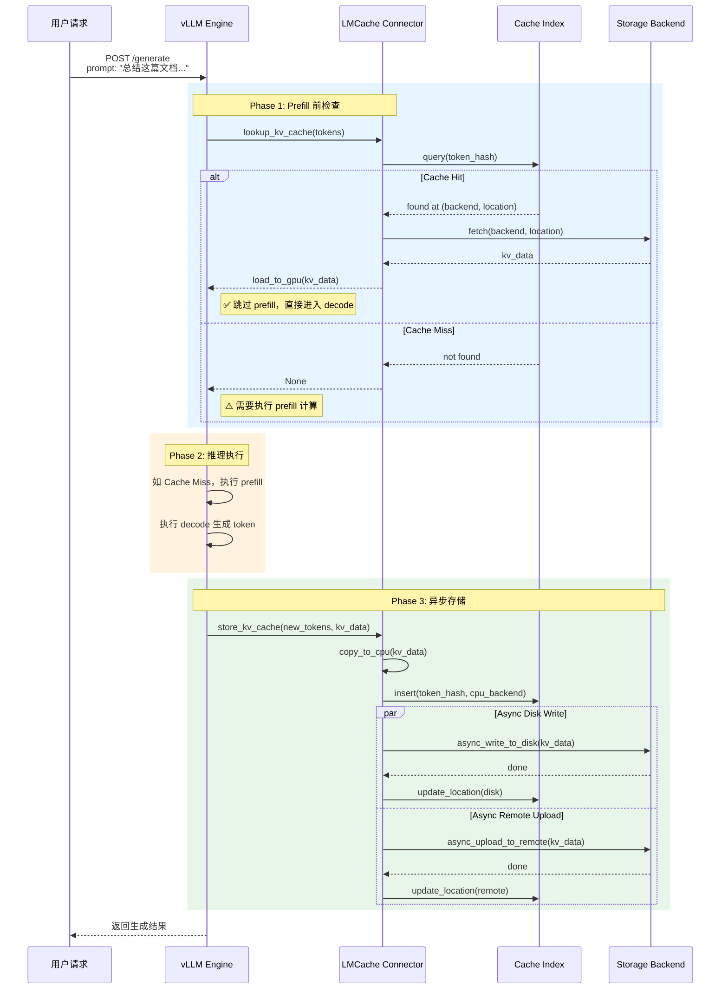
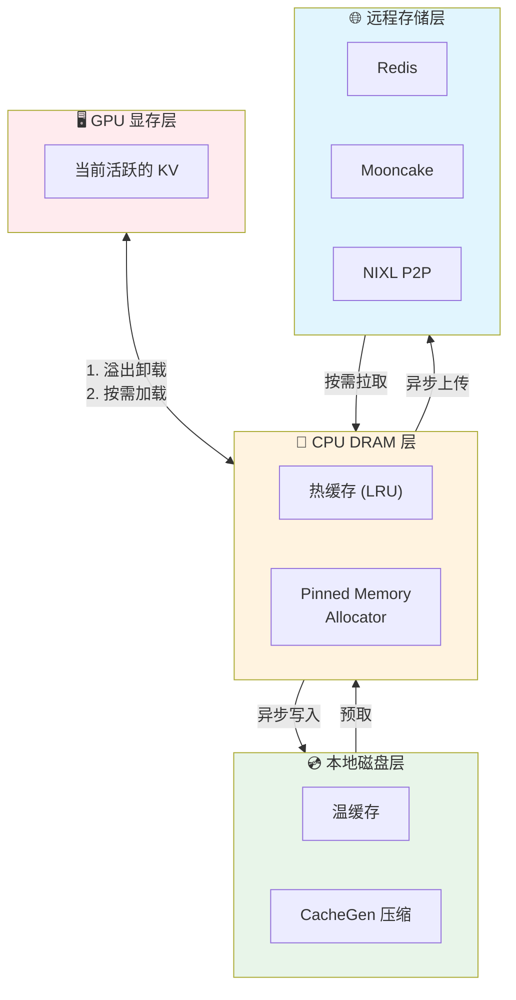
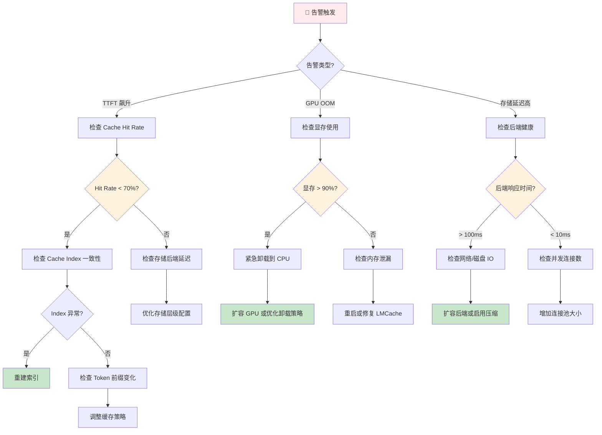

# LMCache：LLM 推理的 KV Cache 加速层

**目标受众**：一线工程师、架构师 & SRE  
**核心价值**：通过多级 KV Cache 存储与共享，实现 3-10x 延迟降低与 GPU 资源优化  
**贯穿类比**：图书馆分级借阅系统（阅览桌 → 书架 → 仓库 → 馆际互借）

---

## 🌀 螺旋 1：概念闭环 — 是什么 & 为什么

### 1.1 场景痛点：AI 客服的"慢启动"噩梦

某大型电商平台的大模型客服系统，日均处理 **1000 万轮对话**，高峰期 QPS 达 5000：

| 场景 | 问题描述 | 数据体感 |
|------|----------|----------|
| **多轮对话** | 用户连续提问时，每轮都要重新计算前面所有对话的 KV Cache | 第 10 轮对话的 TTFT 从 200ms 恶化到 **8 秒** |
| **长文档 RAG** | 处理 32K tokens 的产品手册时，prefill 阶段耗时 | **15-30 秒**，用户直接流失 |
| **GPU 内存爆炸** | KV Cache 占满显存后，新请求无法调度 | 显存利用率 95%+，频繁 OOM |

> **TTFT (Time To First Token)**：从发送请求到收到第一个生成 token 的时间，是用户体验的关键指标。

**为什么 KV Cache 如此重要？**

LLM 推理分为两个阶段：
1. **Prefill**：将输入文本转换为 KV Cache（计算密集型，慢）
2. **Decode**：根据 KV Cache 逐个生成 token（内存密集型，快）

对于 70B 模型，32K tokens 的 KV Cache 大小约为：
```
2 (K+V) × 80 (layers) × 32 (heads) × 128 (dim) × 32000 (tokens) × 2 (bytes) ≈ 40GB
```

这意味着单条长对话就能占满一张 A100 的显存！

### 1.2 类比理解：图书馆分级借阅系统

**LMCache 就像一座智能图书馆**，将 KV Cache 按照使用频率存储在不同"楼层"：

| 图书馆层级 | 技术映射 | 访问速度 | 容量 | 成本 |
|------------|----------|----------|------|------|
| **阅览桌** (手边) | GPU 显存 | ⚡⚡⚡ 纳秒级 | GB 级 | 💸💸💸 极高 |
| **开架书架** (阅览室) | CPU DRAM | ⚡⚡ 微秒级 | 10-100 GB | 💸💸 中等 |
| **闭架书库** (仓库) | 本地磁盘 (NVMe) | ⚡ 毫秒级 | TB 级 | 💸 低 |
| **馆际互借** (其他分馆) | 远程存储 (Redis/Mooncake) | 🐌 10ms+ | PB 级 | 💸 极低 |

**借阅流程（Cache Lookup）**：
1. 读者（推理请求）需要某本书（KV Cache）
2. 图书管理员（LMCache）按顺序查找：阅览桌 → 开架书架 → 闭架书库 → 馆际互借
3. **Cache Hit**：找到后直接使用，无需重新计算（节省 90%+ 时间）
4. **Cache Miss**：重新"印刷"这本书（重新计算 KV），然后按热度存放到合适的层级

### 1.3 架构全景图



**核心组件职责**：

| 组件 | 职责 | 类比 |
|------|------|------|
| **Connector** | 与 vLLM 集成，拦截 KV Cache 读写 | 图书管理员接口 |
| **Cache Index** | 维护 Token 序列 → KV 位置的映射 | 图书馆目录索引 |
| **Memory Allocator** | 管理 CPU 内存分配、NUMA 感知 | 书架空间管理 |
| **Async Offloader** | 异步卸载/加载，不阻塞推理 | 异步整理书架 |
| **Remote Connector** | 对接 Redis/Mooncake 等远程后端 | 馆际互借系统 |
| **Controller** | 提供运维 API（查询/清理/压缩） | 图书馆管理系统 |

### ✅ 螺旋 1 验收

> **一句话复述核心价值**：LMCache 通过将 KV Cache 存储在 GPU→CPU→本地磁盘→远程存储的多级缓存中，让 LLM 每个文本只预填充一次，实现 3-10x 延迟降低与 GPU 资源优化。

### 🔗 下一步指引

理解了"是什么"和"为什么"，接下来进入 **认知降压** 环节——把图书馆的常识逻辑转化为技术机制的理解铺垫。

---

## 💨 认知降压：从类比到逻辑

### 降压主线：图书馆管理员的"三段式思维"

在进入复杂的源码和算法之前，让我们先理解 LMCache 背后的**常识性逻辑**——就像一个经验丰富的图书管理员管理藏书一样。



#### 1. 识别饱和：不要等到桌子堆满

**图书馆逻辑**：
> 阅览桌（GPU）只能放 5 本书。当第 6 位读者来时，管理员**提前**把最早读完的书放回书架（CPU），腾出空间。

**技术映射**：
```
GPU 显存监控 → 达到阈值（如 80%）→ 触发异步卸载 → 最久未用的 KV 移至 CPU
```

**关键洞察**：不要等到 100% 满载才行动，留出缓冲时间应对突发流量。

#### 2. 计算缺口：按需决定"借"还是"印"

**图书馆逻辑**：
> 当读者要一本书时，管理员先查目录。如果其他馆有，就申请馆际互借（慢但省成本）；如果没有，只能新买一本（快但贵）。

**技术映射**：
```
请求到达 → 查询 Cache Index → Cache Hit：直接加载 → Cache Miss：重新计算
         ↓
    权衡：计算成本 vs 存储/传输成本
```

**关键洞察**：重新计算（Prefill）可能比重存储（Remote Fetch）更快——这是一个成本权衡问题。

#### 3. 决策动作：异步整理，不打扰读者

**图书馆逻辑**：
> 读者读完书离开后，管理员**不立即**整理，而是标记"待归位"，等空闲时批量处理。读者无需等待。

**技术映射**：
```
推理完成 → 生成新 KV → 复制到 CPU 缓冲区 → 立即返回响应
         ↓
    异步线程：压缩 → 写入磁盘/远程 → LRU 淘汰
```

**关键洞察**：推理线程的延迟是用户体验的核心，存储操作必须异步化。

### 理解铺垫：为什么不能"一刀切"存 GPU？

**反直觉现象**：

在 AI 客服场景中，你可能发现：
- **现象 A**：GPU 显存占用 90%，但 TTFT 很快（Cache Hit 率高）
- **现象 B**：GPU 显存占用 50%，但 TTFT 很慢（频繁 Cache Miss）

**问题根源**：只看 GPU 利用率无法判断系统健康状态。我们需要关注：

| 指标 | 含义 | 健康阈值 |
|------|------|----------|
| **Cache Hit Rate** | KV 复用比例 | > 70% |
| **平均 KV 存储层级** | 大部分 KV 存在哪一层 | 尽量贴近 GPU |
| **卸载/加载延迟** | 跨层级传输开销 | < 100ms |

这就是为什么 LMCache 需要复杂的**多级存储架构**——不是简单的"空间换时间"，而是**智能地决定什么数据放在哪里**。

### ✅ 认知降压验收

> 能够用图书馆的"查找-决策-异步整理"三段式逻辑，解释 LMCache 的核心工作机制。

### 🔗 下一步指引

认知降压完成，现在进入 **螺旋 2（机制层）**——深入源码级别的实现细节。

---

## 🌀 螺旋 2：机制闭环 — 如何运作

### 2.0 逻辑概述：从"查找-决策-整理"到代码

在深入源码前，先用大白话梳理 LMCache 的核心逻辑：

> **LMCache 的本质是一个"智能缓存代理"**——它坐在 vLLM 和存储之间，像一位经验丰富的图书管理员：
> 1. 当请求来时，先看"目录"（Cache Index）找 KV Cache
> 2. 找到了？按层级加载（GPU→CPU→Disk→Remote）
> 3. 没找到？让 vLLM 计算，然后把结果存起来供下次使用
> 4. 所有存储操作都是异步的，不拖慢推理

### 2.1 核心数据结构

#### Token Database（Cache Index）

```python
# 简化版逻辑结构
class TokenDatabase:
    """维护 Token 序列到 KV Cache 位置的映射"""

    def __init__(self):
        # 核心索引：token_hash → (storage_backend, location)
        self.index: Dict[str, CacheEntry] = {}

    def lookup(self, tokens: List[int]) -> Optional[CacheEntry]:
        """查询 Token 序列对应的 KV Cache 位置"""
        # 使用分块哈希（默认 256 tokens/块）
        chunks = self._chunk_tokens(tokens, chunk_size=256)
        key = self._compute_hash(chunks)
        return self.index.get(key)

    def insert(self, tokens: List[int], backend: str, location: str):
        """插入新的 KV Cache 条目"""
        chunks = self._chunk_tokens(tokens, chunk_size=256)
        key = self._compute_hash(chunks)
        self.index[key] = CacheEntry(backend, location, timestamp=now())
```

**关键设计**：
- **Chunking（分块）**：将长序列切成 256 token 的块，支持部分匹配
- **Hash 冲突处理**：使用二级索引（如 Token 内容校验）降低误判
- **过期策略**：结合 LRU 和 TTL，避免索引无限增长

#### MemoryObj：KV Cache 的封装

```python
@dataclass
class MemoryObj:
    """KV Cache 的内存对象封装"""
    # 元数据
    token_sequence: List[int]
    num_tokens: int
    timestamp: float

    # 数据指针（根据存储层级不同）
    gpu_ptr: Optional[GPUPtr] = None      # GPU 显存地址
    cpu_ptr: Optional[CPUPtr] = None      # CPU 内存地址（pinned）
    disk_path: Optional[str] = None       # 本地磁盘路径
    remote_key: Optional[str] = None      # 远程存储键

    # 状态
    ref_count: int = 0                    # 引用计数（防止误删）
    is_pinned: bool = False               # 是否被固定（禁止淘汰）
```

### 2.2 时序流转：一次完整的请求处理



### 2.3 存储层级与淘汰策略

#### 四级存储架构



#### LRU 淘汰算法（CPU 层）

```python
class LRUEvictionPolicy:
    """CPU 层的 LRU 淘汰策略"""

    def __init__(self, max_size_gb: float):
        self.max_size = max_size_gb * 1024**3
        self.current_size = 0
        self.lru_queue = OrderedDict()  # key -> size

    def access(self, key: str):
        """访问某个 KV，移到队尾（最新）"""
        if key in self.lru_queue:
            self.lru_queue.move_to_end(key)

    def insert(self, key: str, size: int) -> List[str]:
        """插入新 KV，可能需要淘汰旧数据"""
        evicted = []

        # 空间不足时，淘汰队首（最旧）
        while self.current_size + size > self.max_size:
            oldest_key, oldest_size = self.lru_queue.popitem(last=False)
            self.current_size -= oldest_size
            evicted.append(oldest_key)

        self.lru_queue[key] = size
        self.current_size += size
        return evicted
```

#### 异步卸载的并发控制

```python
class AsyncOffloader:
    """异步卸载任务管理器"""

    def __init__(self, max_concurrent: int = 4):
        self.executor = ThreadPoolExecutor(max_workers=max_concurrent)
        self.pending_tasks: Dict[str, Future] = {}

    def submit(self, key: str, data: MemoryObj, target: str) -> str:
        """提交异步卸载任务"""
        task_id = generate_task_id()

        future = self.executor.submit(
            self._offload_worker,
            key=key,
            data=data,
            target=target,
            task_id=task_id
        )

        self.pending_tasks[task_id] = future
        return task_id

    def _offload_worker(self, key: str, data: MemoryObj, target: str, task_id: str):
        """实际的卸载工作线程"""
        try:
            # 1. 压缩（可选）
            if target in ['disk', 'remote']:
                data = self._compress(data)

            # 2. 写入目标存储
            if target == 'disk':
                self._write_to_disk(key, data)
            elif target == 'remote':
                self._upload_to_remote(key, data)

            # 3. 更新索引
            self._update_index(key, target)

        except Exception as e:
            logger.error(f"Offload failed: {task_id}, error: {e}")
            # 失败时保留在 CPU 层，下次重试

    def check_finish(self, task_id: str) -> bool:
        """Controller API：查询任务是否完成"""
        if task_id not in self.pending_tasks:
            return True  # 已完成或不存在
        return self.pending_tasks[task_id].done()
```

### 2.4 边缘情况处理

| 场景 | 行为 | 应对策略 |
|------|------|----------|
| **存储后端故障** | Remote 写入失败 | 保留在 CPU 层，指数退避重试 |
| **Cache Index 丢失** | 进程重启 | 从磁盘/远程重建索引，可能短期 Cache Miss 增加 |
| **Hash 冲突** | 不同 Token 序列哈希相同 | 使用 Token 内容校验和，冲突时回退到计算 |
| **并发写入同一 KV** | 多个请求生成相同 KV | 使用分布式锁或 CAS 操作保证一致性 |
| **GPU OOM 紧急卸载** | 显存耗尽 | 同步卸载（阻塞），优先保证推理不崩溃 |

### ✅ 螺旋 2 验收

> 能够画出：请求到达 → Cache Lookup → [Hit: 加载 | Miss: 计算] → 异步存储 → 返回结果 的完整流程图，并解释 LRU 淘汰和异步卸载的实现逻辑。

### 🔗 衔接问题

生产环境会遇到什么坑？怎么配置存储后端？如何排障？进入 **螺旋 3（实战层）**。

---

## 🌀 螺旋 3：实战闭环 — 如何驾驭

### 3.1 极致权衡：存储层级选型决策

#### 四级存储成本对比

| 存储层级 | 延迟 | 容量 | 成本/GB/月 | 适用场景 |
|----------|------|------|------------|----------|
| **GPU (A100 80G)** | < 1ms | 80 GB | $500+ | 当前活跃对话 |
| **CPU DRAM** | 1-10ms | 100-500 GB | $20 | 热缓存、短对话 |
| **本地 NVMe** | 1-10ms | 1-10 TB | $2 | 长文档、RAG |
| **Redis (单节点)** | 0.5-2ms | 100 GB | $50 | 跨实例共享 |
| **Mooncake (分布式)** | 5-20ms | 100+ TB | $0.5 | 全局缓存池 |

#### 极限抉择案例：某 AI 客服平台的存储选型

**场景**：日均 1000 万轮对话，峰值 5000 QPS，平均对话长度 2K tokens，长文档 RAG 占 20%。

**方案 A：全 GPU 党** 💸💸💸
- 配置：100 张 A100
- 成本：$500K+/月
- 延迟：TTFT < 100ms
- 问题：成本爆炸，资源利用率低

**方案 B：全远程党** 🐌🐌🐌
- 配置：10 张 A100 + Mooncake 集群
- 成本：$80K/月
- 延迟：TTFT 2-5s（Cache Miss 时）
- 问题：用户体验差

**方案 C：智能分层** ✅
- 配置：30 张 A100 + CPU 缓存 + Mooncake
- 成本：$150K/月
- 延迟：TTFT 200ms（Cache Hit 率 85%）
- 关键配置：
  ```yaml
  # LMCache 配置
  cpu_offloading_buffer_size: "200"  # CPU 缓存 200GB
  local_disk_path: "/var/cache/lmcache"  # 本地磁盘 2TB
  remote_backend: "mooncake"  # 远程后端
  caching_policy: "lru"  # LRU 淘汰
  ```

**决策原则**：
> 没有银弹。根据业务特征（对话长度分布、并发模式、延迟容忍度）选择分层策略。

### 3.2 反模式

#### ❌ 反模式 1："GPU 永远不满"

- **现象**：配置 `gpu_memory_utilization: 0.95`，LMCache 几乎不卸载
- **根因**：GPU 显存碎片化 + OOM 风险，实际可用空间远小于理论值
- **修正**：
  ```yaml
  # 推荐配置
  gpu_memory_utilization: 0.80  # 留出 20% 缓冲
  eviction_policy: "lru"
  cpu_offloading_threshold: 0.75  # 75% 时开始卸载
  ```

#### ❌ 反模式 2："Cache 越多越好"

- **现象**：存储了 10TB 的 KV Cache，但 Cache Hit 率仅 20%
- **根因**：存储了大量"一次性"查询的 KV（如随机 UUID 前缀）
- **修正**：
  - 启用**前缀去重**：只缓存共享前缀（如系统 Prompt）
  - 设置**TTL**：短对话 KV 7 天后过期
  - 使用**CacheBlend**：合并相似对话的 KV

#### ❌ 反模式 3："Remote 就是慢"

- **现象**：完全禁用 Remote 存储，所有压力压在 CPU/磁盘
- **根因**：未理解 P2P 传输（如 Mooncake/NIXL）的优势
- **修正**：
  - 对于**跨实例共享**场景，P2P 传输延迟 < 20ms，远小于重新计算（> 1s）
  - 使用**异步预取**：在对话进行中提前加载可能用到的 KV

### 3.3 故障排查决策树



#### 常见故障速查表

| 故障现象 | 根因 | 排查命令 | 解决方案 |
|----------|------|----------|----------|
| TTFT 突然升高 | Cache Miss 增加 | `curl /metrics | grep cache_hit_rate` | 检查索引一致性，重建 Cache |
| GPU OOM | 卸载不及时 | `nvidia-smi` + `lmcache logs` | 降低卸载阈值，扩容 GPU |
| Remote 存储超时 | 网络/后端故障 | `curl /health` + `ping backend` | 切换备用后端，降级到本地存储 |
| CPU 内存爆炸 | LRU 策略失效 | `free -h` + `lmcache stats` | 调整 CPU 缓存大小，启用压缩 |
| 并发下降 | 异步任务堆积 | `lmcache async-queue-size` | 增加异步线程数，优化存储后端 |

### 3.4 SRE 可观测性

#### 健康看板（SLI/SLO）

| 指标 | SLI 计算方式 | SLO 目标 | 告警阈值 |
|------|--------------|----------|----------|
| **Cache Hit Rate** | `cache_hits / (cache_hits + cache_misses)` | > 75% | < 60% |
| **平均 TTFT** | P50/P99 分位延迟 | P50 < 200ms, P99 < 1s | P99 > 2s |
| **GPU 显存利用率** | `used / total` | < 80% | > 90% |
| **存储后端延迟** | P99 读写延迟 | < 50ms | > 100ms |
| **异步任务堆积** | 待处理任务数 | < 100 | > 500 |
| **索引一致性** | 实际存储与索引匹配率 | > 99% | < 95% |

#### Prometheus Metrics 示例

```yaml
# prometheus.yml 配置
groups:
  - name: lmcache.rules
    rules:
      - alert: LMCacheLowHitRate
        expr: rate(lmcache_cache_hits[5m]) / rate(lmcache_cache_lookups[5m]) < 0.6
        for: 5m
        labels:
          severity: warning
        annotations:
          summary: "LMCache hit rate is low"

      - alert: LMCacheHighGPUUsage
        expr: lmcache_gpu_memory_usage_percent > 90
        for: 2m
        labels:
          severity: critical
        annotations:
          summary: "GPU memory is nearly exhausted"

      - alert: LMCacheStorageBackendDown
        expr: up{job="lmcache-storage"} == 0
        for: 1m
        labels:
          severity: critical
        annotations:
          summary: "LMCache storage backend is down"
```

#### 排障工具箱

```bash
# 1. 检查 LMCache 健康状态
curl http://localhost:8000/health

# 2. 查看实时指标
curl http://localhost:8000/metrics | grep lmcache

# 3. 查询 Cache Index 状态
curl http://localhost:8000/api/v1/cache/index | jq '.stats'

# 4. 手动清理特定 KV
curl -X POST http://localhost:8000/api/v1/cache/clear \
  -H "Content-Type: application/json" \
  -d '{"pattern": "session_*", "older_than": "7d"}'

# 5. 检查异步任务队列
curl http://localhost:8000/api/v1/async/status | jq '.queue_size, .processing_count'

# 6. 导出性能分析
lmcache-cli profile --duration=60s --output=profile.pb.gz
```

### ✅ 螺旋 3 验收

> 能够独立排障：当 **TTFT 飙升** 告警触发时，按照决策树执行排查步骤，并能根据业务特征调整存储层级配置。

### 🔗 下一步指引

完成了三层螺旋的学习，进入 **元知识总结**——将 LMCache 的核心洞察沉淀为可复用的模式。

---

## 技术模块索引

LMCache 是一个包含多个技术域的复杂工程系统，各模块详情如下：

| 模块 | 核心内容 | 文档链接 |
|------|----------|----------|
| **多级存储架构** | GPU/CPU/本地/远程四级存储、LRU 淘汰、异步卸载 | [01-storage-architecture.md](components/01-storage-architecture.md) |
| **分布式预填充** | 1p1d/XpYd 模式、NIXL P2P 传输 | [02-disaggregated-prefill.md](components/02-disaggregated-prefill.md) |
| **KV Cache 优化** | CacheGen 压缩、CacheBlend 融合、Layerwise 传输 | [03-optimization.md](components/03-optimization.md) |
| **Controller 管理** | 查询/清理/压缩/移动/Pin 等运维 API | [04-management.md](components/04-management.md) |
| **生产部署与观测** | K8s 部署、Metrics、Health Monitor、排障 | [05-production.md](components/05-production.md) |

---

## 元知识总结

### 大规模瓶颈与调优

#### 当前架构的瓶颈点

| 规模层级 | 瓶颈点 | 表现 | 优化方向 |
|----------|--------|------|----------|
| **单节点** | GPU 显存碎片 | OOM 频发，利用率不均 | 优化 Allocator，引入 Memory Pool |
| **多节点** | Cache Index 同步 | 跨节点 Cache Miss | 分布式索引（如 etcd/Redis） |
| **海量 KV** | 索引内存占用 | 10亿级 KV 索引占用 100GB+ RAM | 分层索引 + 磁盘索引 |
| **高频写入** | 异步任务堆积 | 卸载跟不上生成速度 | 增加并发、优化压缩算法 |

#### 性能调优 Checklist

- [ ] **GPU 层**：显存利用率保持在 60-80%，预留突发缓冲
- [ ] **CPU 层**：配置为 GPU 显存的 2-3 倍，启用 NUMA 亲和性
- [ ] **磁盘层**：使用 NVMe SSD，挂载为 XFS/EXT4，启用 `noatime`
- [ ] **远程层**：评估 P2P 传输（Mooncake/NIXL）vs 传统存储（Redis）
- [ ] **压缩**：长文档场景启用 CacheGen，权衡压缩率与解压延迟
- [ ] **TTL**：设置合理的 KV 过期时间，避免存储膨胀

### 一句话 Takeaway

> **LMCache 的核心智慧不是"缓存一切"，而是"智能地决定什么值得缓存、存在哪里、保留多久"——就像一位经验丰富的图书馆管理员，知道哪些书该放在手边，哪些该入库，哪些可以直接淘汰。**

### 模式沉淀

| 模式名称 | 适用场景 | 核心策略 |
|----------|----------|----------|
| **分层缓存模式** | 通用 LLM 服务 | GPU→CPU→Disk→Remote 四级分层 |
| **热点预加载模式** | RAG/长文档 | 异步预取高频文档的 KV |
| **前缀共享模式** | 多轮对话 | 只缓存共享前缀，不缓存变长后缀 |
| **跨实例共享模式** | 多副本部署 | P2P 传输实现全局 Cache Pool |
| **成本驱动变体** | 预算敏感场景 | 优先使用廉价存储（CPU/磁盘）|

---

**文档质量检查清单**：

- [x] 三层螺旋结构完整
- [x] 每层有验收标准和衔接问题
- [x] 图书馆类比贯穿全篇
- [x] 中国本土 AI 场景案例（客服系统）
- [x] Mermaid 架构图（≥2 个）
- [x] SLI/SLO 建议
- [x] 故障排查决策树
- [x] 3+ 反模式
- [x] 成本与性能权衡分析
- [x] 无纯文本流程图

---

## 延伸阅读

### 官方资源

- **LMCache 官方文档**: https://docs.lmcache.ai/
- **GitHub 仓库**: https://github.com/LMCache/LMCache
- **LMCache 博客**: https://lmcache.github.io

### 核心论文

1. **CacheGen**: KV Cache Compression and Streaming for Fast Large Language Model Serving  
   https://dl.acm.org/doi/10.1145/3651890.3672274
   - 提出 KV Cache 压缩算法，实现 4-10x 压缩率

2. **CacheBlend**: Fast Large Language Model Serving with Cached Knowledge Fusion  
   https://arxiv.org/abs/2405.16444
   - 支持非前缀匹配的 KV Cache 复用

3. **Do Large Language Models Need a Content Delivery Network?**  
   https://arxiv.org/abs/2409.13761
   - 将 KV Cache 管理与 CDN 理念结合

### 相关技术

| 技术 | 关系 | 说明 |
|------|------|------|
| **vLLM** | 推理引擎 | LMCache 的主要集成目标，提供 PagedAttention |
| **vLLM Production Stack** | K8s 部署 | 生产级 Helm Chart，内置 LMCache 支持 |
| **Mooncake** | 存储后端 | 分布式 KV Cache 存储，支持 P2P 传输 |
| **NIXL** | 传输库 | NVIDIA 的高性能通信库，用于 Disaggregated Prefill |
| **WVA** | 扩缩容 | 基于饱和度的推理服务扩缩容，可与 LMCache 配合 |

### 推荐工具链

- **负载测试**: `lmcache-benchmark` + Locust
- **性能分析**: PyTorch Profiler + NVIDIA Nsight
- **监控**: Prometheus + Grafana + LMCache Exporter
- **日志分析**: ELK Stack / Loki

### 社区与支持

- **Slack 工作区**: https://join.slack.com/t/lmcacheworkspace/
- **社区会议**: https://docs.lmcache.ai/community/meetings.html
- **Issue 反馈**: https://github.com/LMCache/LMCache/issues

---

**文档版本**: 2025-02  
**最后更新**: 基于 LMCache v0.6.x 文档整理

---

*LMCache 技术分享全景文档 | 基于 docs.lmcache.ai 官方文档整理*
