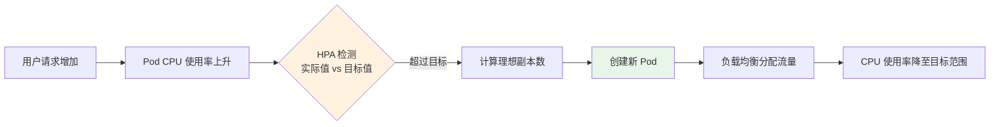
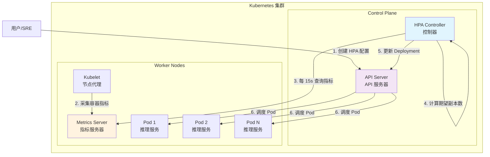
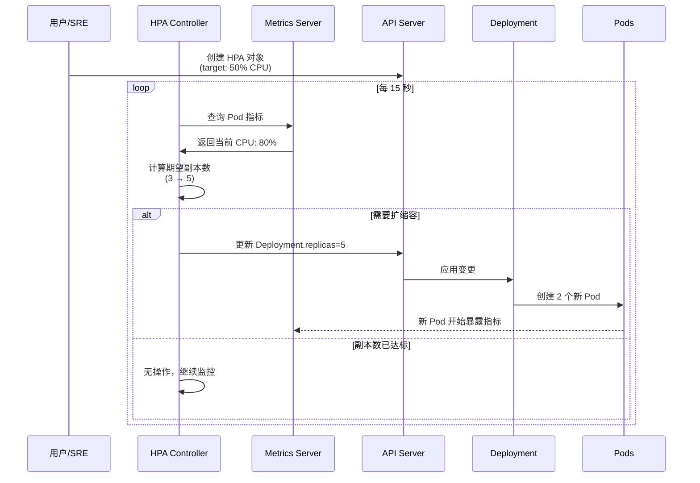
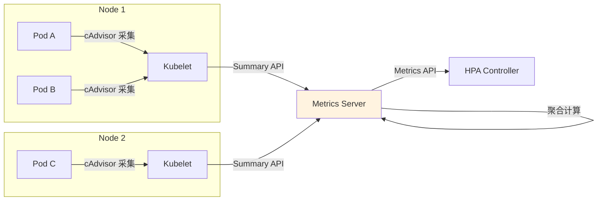
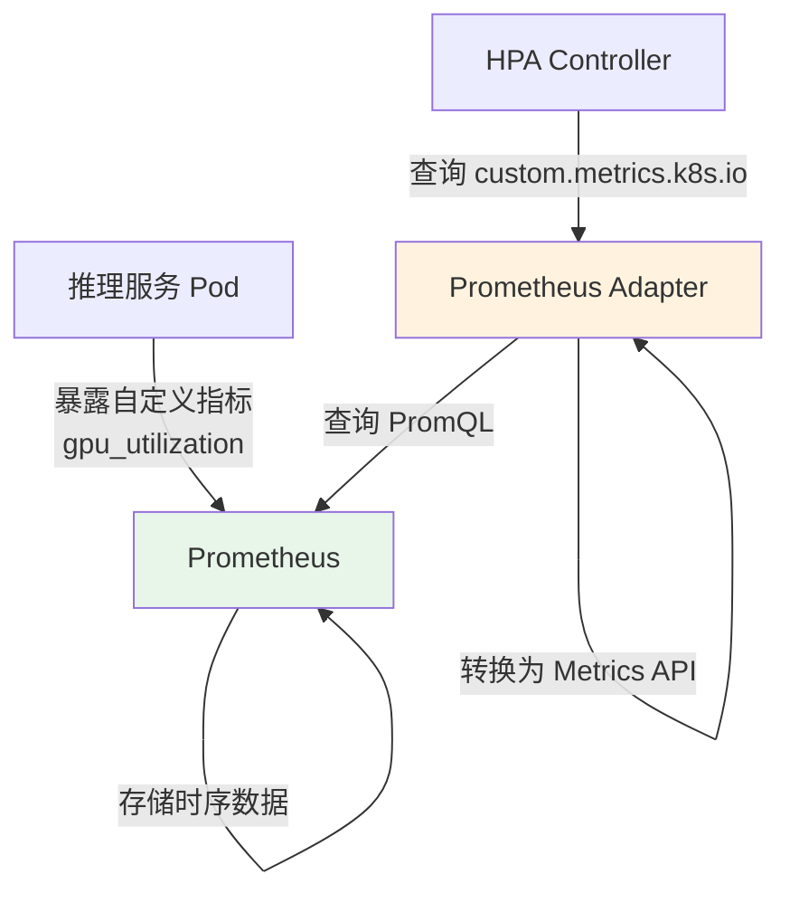
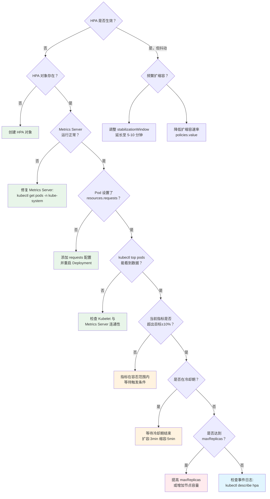

# Kubernetes HPA 深度解析：AI 推理服务的智能扩缩容

> **案例背景**：以 AI 大模型推理扩缩容服务为场景  
> **贯穿类比**：超市收银柜台的开闭台管理  
> **技术栈**：Kubernetes (Kubespray 部署) + Metrics Server

---

## 🌀 螺旋 1：概念层 (Why & What)

### 本层目标

理解 HPA 的核心概念、解决的业务痛点，建立对"自动扩缩容"的直观认知。听众能够用一句话复述 HPA 是什么、为什么需要它。

---

### 1.1 业务痛点：AI 推理服务的流量波动挑战

想象一个为企业客户提供大模型推理服务的平台：

- **白天 9:00-18:00**：企业用户集中使用，请求量达到 **5000 QPS**
- **夜间 22:00-06:00**：几乎无请求，流量降至 **50 QPS**
- **突发场景**：营销活动期间，流量突增至 **10000 QPS**

#### 痛点分析

| 场景 | 固定副本数的问题 | 业务影响 |
|------|----------------|----------|
| **流量低谷期** | 大量 Pod 空闲，资源浪费 | 成本浪费 60-80% |
| **流量高峰期** | Pod 不足，请求超时/失败 | 用户体验差，潜在流失 |
| **突发流量** | 手动扩容响应慢（5-10 分钟） | 错失业务机会 |

---

### 1.2 超市收银柜台类比

把 **AI 推理服务的 Pod** 类比为 **超市的收银柜台**：

#### 场景对照表

| 超市场景 | Kubernetes 场景 |
|---------|----------------|
| 顾客排队结账 | 用户请求推理服务 |
| 收银员（柜台） | Pod 副本 |
| 排队时长 | 请求响应延迟 |
| 店长调度开闭台 | HPA 控制器 |
| 柜台数量上下限 | minReplicas / maxReplicas |

#### 智能开闭台策略

```
📊 超市店长的决策逻辑：
   - 每个柜台平均排队 > 5 人 → 开新柜台
   - 所有柜台平均排队 < 2 人 → 关闭空闲柜台
   - 最少保留 3 个柜台（应对突发情况）
   - 最多开 10 个柜台（物理空间限制）
```

这正是 HPA 的工作原理！

---

### 1.3 HPA 核心概念

#### 定义

**Horizontal Pod Autoscaler (HPA)** 是 Kubernetes 的自动扩缩容机制，通过监控 Pod 的资源使用率（CPU/内存）或自定义指标，动态调整 Deployment/StatefulSet 的副本数。

#### 核心特点

1. **水平扩展**：通过增加/减少 Pod 数量来调整容量（vs 垂直扩展：调整单个 Pod 的资源）
2. **指标驱动**：基于实时观测值（如 CPU 使用率）自动决策
3. **动态平衡**：在服务质量和资源成本之间寻找最优点

#### 工作流程概览



---

### 1.4 HPA 在 AI 推理场景的价值

| 价值维度 | 具体体现 | 量化指标 |
|---------|---------|---------|
| **成本优化** | 低谷期自动缩容，释放资源 | 节省 40-60% 云计算成本 |
| **性能保障** | 高峰期自动扩容，避免服务降级 | P99 延迟稳定在 <200ms |
| **运维效率** | 无需人工干预，24/7 自动响应 | 减少 90% 扩容操作工单 |
| **业务敏捷** | 快速响应突发流量（秒级扩容） | 流量突增时 30 秒内完成扩容 |

---

### ✅ 螺旋 1 验收标准

听众能够：
1. 用 **超市收银柜台** 类比解释 HPA 的工作原理
2. 列举 **AI 推理服务使用 HPA 的 3 个核心价值**
3. 区分 **水平扩展（HPA）** 和 **垂直扩展（VPA）** 的适用场景

---

### 🔗 衔接下一层

我们已经理解了 HPA 的 **What** 和 **Why**，但还有关键问题待解答：

- HPA 如何**精确计算**需要多少个 Pod？
- 指标数据从哪里来？Metrics Server 是什么？
- 扩缩容的决策算法是什么？会不会频繁抖动？

下一层将深入 HPA 的**底层机制**，揭示这些问题的答案。

---

## 🌀 螺旋 2：机制层 (How - 原理)

### 本层目标

深入理解 HPA 的底层工作机制，包括指标采集、计算公式、控制循环、稳定性保障等核心技术细节。听众能够画出 HPA 的完整工作流程图，理解为什么需要 Metrics Server。

---

### 📌 认知降压 (Decompression)

在进入复杂的技术细节前，让我们回到超市类比：

```
🏪 超市店长如何决定开几个柜台？

第一步：观察现状
   → 店员报告：10 个柜台，每个柜台平均排队 6 人

第二步：计算理想状态
   → 目标：每个柜台平均 3 人
   → 当前总排队人数：10 × 6 = 60 人
   → 理想柜台数：60 ÷ 3 = 20 个

第三步：执行调整
   → 开启 10 个新柜台（但不能超过物理上限）
   → 等待 5 分钟观察效果，避免频繁开关台

第四步：持续监控
   → 每 15 秒检查一次排队情况
   → 根据新数据重新计算
```

这个简单的逻辑，就是 HPA 算法的本质！

---

### 2.1 HPA 架构全景

#### 核心组件关系图



#### 组件职责表

| 组件 | 类比角色 | 核心职责 |
|------|---------|---------|
| **HPA Controller** | 超市店长 | 决策中枢，计算理想副本数并执行调整 |
| **Metrics Server** | 店员统计员 | 采集各 Pod 的实时资源使用情况 |
| **Kubelet** | 收银员 | 运行在每个节点，暴露容器指标给 Metrics Server |
| **API Server** | 总部调度系统 | 接收 HPA 指令，协调 Pod 创建/删除 |

---

### 2.2 HPA 计算公式详解

#### 核心公式

HPA 使用以下公式计算期望副本数：

```
期望副本数 = ceil(当前副本数 × (当前指标值 / 目标指标值))
```

#### 超市类比计算实例

**场景**：AI 推理服务当前配置
- **当前副本数**：5 个 Pod（5 个收银台）
- **目标 CPU 使用率**：50%（每台平均服务 3 人）
- **实际 CPU 使用率**：80%（每台平均服务 5 人）

**计算过程**：

```
步骤 1：计算平均指标值
   当前总 CPU 使用：5 个 Pod × 80% = 400%
   
步骤 2：计算理想副本数
   期望副本数 = 400% ÷ 50% = 8 个 Pod
   
步骤 3：向上取整
   ceil(8) = 8 个 Pod
   
结果：HPA 将扩容到 8 个 Pod
```

#### 实际 Kubernetes 计算示例

假设 AI 推理服务 Deployment 配置：

```yaml
resources:
  requests:
    cpu: 1000m  # 每个 Pod 请求 1 核 CPU
```

**当前状态**：
- 3 个 Pod 运行
- Pod 1: 800m CPU (80%)
- Pod 2: 850m CPU (85%)
- Pod 3: 750m CPU (75%)

**HPA 目标**：CPU 使用率 50%

**HPA 计算**：

```
平均 CPU 使用率 = (80% + 85% + 75%) / 3 = 80%

期望副本数 = ceil(3 × (80% / 50%))
           = ceil(3 × 1.6)
           = ceil(4.8)
           = 5 个 Pod
```

**扩容后预期**：
- 总 CPU 需求不变：2400m
- 5 个 Pod 均摊：2400m / 5 = 480m ≈ 48%
- **达到目标！**

---

### 2.3 HPA 控制循环（Control Loop）

#### 时序流程图



#### 控制循环关键参数

| 参数 | 默认值 | 超市类比 | 调优建议 |
|------|-------|---------|---------|
| **检查间隔** | 15 秒 | 店长每 15 秒巡视一次 | 推理服务建议保持默认 |
| **扩容冷却时间** | 3 分钟 | 开台后等 3 分钟观察效果 | 流量波动大时可缩短至 1 分钟 |
| **缩容冷却时间** | 5 分钟 | 关台前等 5 分钟确认低峰 | 避免频繁缩容，建议 5-10 分钟 |
| **容忍度** | 10% | 实际值在目标 ±10% 内不调整 | 避免微小波动触发扩缩容 |

---

### 2.4 Metrics Server 深入解析

#### 为什么需要 Metrics Server？

Kubernetes 原生只提供 **资源调度** 能力，不提供 **指标采集** 能力。Metrics Server 是桥梁组件，负责：

1. **从 Kubelet 抓取指标**（通过 Summary API）
2. **聚合计算平均值**（跨所有 Pod）
3. **暴露 Metrics API**（供 HPA 查询）

#### Metrics Server 工作流程



#### Metrics Server 关键特性

| 特性 | 说明 | AI 推理场景影响 |
|------|------|----------------|
| **内存存储** | 不持久化历史数据，仅保留最近 1-2 分钟 | 适合实时扩缩容，不适合长期趋势分析 |
| **采集间隔** | 默认 60 秒 | 决定 HPA 的数据新鲜度 |
| **延迟** | 通常 1-2 秒 | 对推理服务响应速度影响小 |
| **资源占用** | 轻量级（~40MB 内存） | 适合生产环境 |

> **注意**：如需历史趋势分析，应使用 Prometheus + Grafana，但 HPA 仍依赖 Metrics Server。

---

### 2.5 稳定性机制：防止频繁抖动

#### 问题场景：抖动的噩梦

想象超市店长疯狂开闭台的场景：

```
10:00  观察到排队人多 → 开 5 个新台
10:01  新台刚开，排队减少 → 关 3 个台
10:02  排队又增加 → 再开 4 个台
10:03  ...循环往复
```

结果：
- ❌ 收银员疲于应对
- ❌ 顾客体验极差
- ❌ 浪费大量调度成本

#### HPA 的 4 重防抖机制

##### 1. 容忍度（Tolerance）

```yaml
# HPA 默认容忍度：10%
# 只有当实际值超出目标 ±10% 时才触发调整

目标 CPU: 50%
触发扩容：> 55%  (50% × 1.1)
触发缩容：< 45%  (50% × 0.9)
```

**超市类比**：每台目标 3 人排队，只有在 >3.3 人或 <2.7 人时才调整。

##### 2. 冷却时间（Cooldown）

```yaml
# 扩容后冷却 3 分钟
--horizontal-pod-autoscaler-upscale-delay=3m

# 缩容后冷却 5 分钟
--horizontal-pod-autoscaler-downscale-delay=5m
```

**原理**：新 Pod 启动需要时间（拉镜像、初始化），冷却期等待稳定后再判断。

##### 3. 稳定窗口（Stabilization Window）

Kubernetes 1.18+ 引入，使用历史数据而非单次测量值：

```yaml
behavior:
  scaleDown:
    stabilizationWindowSeconds: 300  # 5 分钟
    # 选择过去 5 分钟内的最高推荐值进行缩容
```

**效果**：避免短暂的流量下降导致过度缩容。

##### 4. 扩缩容速率限制

```yaml
behavior:
  scaleUp:
    policies:
    - type: Percent
      value: 100        # 每次最多扩容 100%（翻倍）
      periodSeconds: 60 # 每分钟
    - type: Pods
      value: 4          # 每次最多增加 4 个 Pod
      periodSeconds: 60
    selectPolicy: Max   # 取两者中的较大值
  
  scaleDown:
    policies:
    - type: Percent
      value: 50         # 每次最多缩容 50%
      periodSeconds: 60
```

**超市类比**：即使需要 20 个台，也不能一次性全开，分批开启避免混乱。

---

### 2.6 自定义指标扩容（高级特性）

#### 为什么 CPU/内存不够用？

AI 推理服务的真实瓶颈可能是：
- **GPU 利用率**（大模型推理）
- **请求队列长度**（业务指标）
- **推理延迟 P99**（SLA 指标）
- **并发连接数**（负载均衡器指标）

#### 自定义指标架构



#### 自定义指标 HPA 示例

基于 GPU 利用率扩容：

```yaml
apiVersion: autoscaling/v2
kind: HorizontalPodAutoscaler
metadata:
  name: llm-inference-hpa
spec:
  scaleTargetRef:
    apiVersion: apps/v1
    kind: Deployment
    name: llm-inference
  minReplicas: 2
  maxReplicas: 20
  metrics:
  - type: Pods
    pods:
      metric:
        name: gpu_utilization
      target:
        type: AverageValue
        averageValue: "70"  # 目标 GPU 利用率 70%
```

**超市类比**：不仅看排队人数，还要看收银速度（GPU 效率）！

---

### ✅ 螺旋 2 验收标准

听众能够：
1. **画出 HPA 架构图**，标注 HPA Controller、Metrics Server、Kubelet 的职责
2. **手算副本数**：给定当前副本数 3、实际 CPU 80%、目标 50%，计算出期望副本数 5
3. **解释防抖机制**：说明容忍度、冷却时间、稳定窗口的作用
4. **理解 Metrics Server**：说明为什么 HPA 依赖它，以及数据流向

---

### 🔗 衔接下一层

现在我们理解了 HPA 的 **底层原理**，但在生产环境中：

- 如何编写正确的 HPA YAML 配置？
- 遇到"扩容不生效"、"频繁抖动"怎么排查？
- 如何监控 HPA 的健康状态？
- 有哪些生产环境的最佳实践和反模式？

下一层将带你走进 **实战运维**，从 0 到 1 部署生产级 HPA。

---

## 🌀 螺旋 3：实战层 (How - 运维)

### 本层目标

掌握在生产环境中部署和运维 HPA 的完整流程，包括配置编写、故障排查、监控告警、最佳实践。听众能够独立排查常见问题，并建立生产级的 HPA 监控体系。

---

### 3.1 前置准备：部署 Metrics Server

#### 环境要求

```bash
# 1. Kubernetes 版本要求
kubectl version --short
# 要求：Server Version >= v1.19

# 2. 检查集群是否已安装 Metrics Server
kubectl get deployment metrics-server -n kube-system

# 如果不存在，则需要安装
```

#### 安装 Metrics Server（标准 Kubernetes）

```bash
# 方法 1：使用官方 YAML
kubectl apply -f https://github.com/kubernetes-sigs/metrics-server/releases/latest/download/components.yaml

# 方法 2：使用 Helm（推荐生产环境）
helm repo add metrics-server https://kubernetes-sigs.github.io/metrics-server/
helm upgrade --install metrics-server metrics-server/metrics-server \
  --namespace kube-system \
  --set args={--kubelet-insecure-tls}  # 仅测试环境使用
```

#### 验证安装

```bash
# 等待 Pod 就绪
kubectl wait --for=condition=ready pod \
  -l k8s-app=metrics-server \
  -n kube-system \
  --timeout=300s

# 验证 Metrics API
kubectl top nodes
kubectl top pods -n default

# 输出示例：
# NAME           CPU(cores)   MEMORY(bytes)
# llm-pod-1      850m         2048Mi
# llm-pod-2      920m         2100Mi
```

---

### 3.2 实战配置：AI 推理服务 HPA

#### 场景设定

某 AI 公司的大模型推理服务：
- **基础镜像**：`llm-inference:v1.0`（包含 GPT-J-6B 模型）
- **资源需求**：每个 Pod 需要 2 核 CPU、4GB 内存
- **业务目标**：
  - 平时保持 3 个副本（成本控制）
  - 高峰期最多 10 个副本（容量上限）
  - CPU 使用率维持在 60%（性能与成本平衡点）

#### 步骤 1：创建 Deployment

```yaml
# llm-deployment.yaml
apiVersion: apps/v1
kind: Deployment
metadata:
  name: llm-inference
  labels:
    app: llm-inference
spec:
  replicas: 3  # 初始副本数（将被 HPA 接管）
  selector:
    matchLabels:
      app: llm-inference
  template:
    metadata:
      labels:
        app: llm-inference
    spec:
      containers:
      - name: inference
        image: llm-inference:v1.0
        ports:
        - containerPort: 8080
        resources:
          requests:
            cpu: 2000m      # 🔑 关键：必须设置 requests
            memory: 4Gi
          limits:
            cpu: 2000m      # 限制 CPU 防止干扰其他 Pod
            memory: 4Gi
        livenessProbe:
          httpGet:
            path: /health
            port: 8080
          initialDelaySeconds: 60
          periodSeconds: 10
        readinessProbe:
          httpGet:
            path: /ready
            port: 8080
          initialDelaySeconds: 30
          periodSeconds: 5
```

**⚠️ 关键注意事项**：
- `resources.requests` **必须设置**，HPA 基于 requests 计算使用率
- `requests` 应接近实际使用量，避免过高（浪费资源）或过低（频繁扩容）

```bash
kubectl apply -f llm-deployment.yaml
```

#### 步骤 2：创建 Service

```yaml
# llm-service.yaml
apiVersion: v1
kind: Service
metadata:
  name: llm-inference
spec:
  selector:
    app: llm-inference
  ports:
  - protocol: TCP
    port: 80
    targetPort: 8080
  type: LoadBalancer  # 生产环境使用 LoadBalancer 或 Ingress
```

```bash
kubectl apply -f llm-service.yaml
```

#### 步骤 3：创建 HPA（基础版）

```yaml
# llm-hpa-basic.yaml
apiVersion: autoscaling/v2
kind: HorizontalPodAutoscaler
metadata:
  name: llm-inference-hpa
spec:
  scaleTargetRef:
    apiVersion: apps/v1
    kind: Deployment
    name: llm-inference
  minReplicas: 3
  maxReplicas: 10
  metrics:
  - type: Resource
    resource:
      name: cpu
      target:
        type: Utilization
        averageUtilization: 60  # 目标 CPU 使用率 60%
```

```bash
kubectl apply -f llm-hpa-basic.yaml
```

#### 步骤 4：创建 HPA（生产级）

生产环境推荐配置，包含防抖和速率限制：

```yaml
# llm-hpa-production.yaml
apiVersion: autoscaling/v2
kind: HorizontalPodAutoscaler
metadata:
  name: llm-inference-hpa
spec:
  scaleTargetRef:
    apiVersion: apps/v1
    kind: Deployment
    name: llm-inference
  minReplicas: 3
  maxReplicas: 10
  metrics:
  - type: Resource
    resource:
      name: cpu
      target:
        type: Utilization
        averageUtilization: 60
  - type: Resource
    resource:
      name: memory
      target:
        type: Utilization
        averageUtilization: 80  # 内存使用率 80%
  behavior:
    scaleUp:
      stabilizationWindowSeconds: 60      # 扩容稳定窗口 1 分钟
      policies:
      - type: Percent
        value: 100                        # 每次最多翻倍
        periodSeconds: 60
      - type: Pods
        value: 3                          # 每次最多增加 3 个 Pod
        periodSeconds: 60
      selectPolicy: Max                   # 取较激进的策略
    scaleDown:
      stabilizationWindowSeconds: 300     # 缩容稳定窗口 5 分钟
      policies:
      - type: Percent
        value: 50                         # 每次最多缩减 50%
        periodSeconds: 60
      - type: Pods
        value: 2                          # 每次最多减少 2 个 Pod
        periodSeconds: 60
      selectPolicy: Min                   # 取较保守的策略
```

**配置解读（超市类比）**：
- `stabilizationWindowSeconds: 60`：开台前观察 1 分钟，确认确实需要
- `scaleUp.value: 100`：高峰期可以快速翻倍开台
- `scaleDown.stabilizationWindowSeconds: 300`：关台前等 5 分钟，避免误判
- `scaleDown.value: 50`：缩容保守，每次最多关一半

```bash
kubectl apply -f llm-hpa-production.yaml
```

---

### 3.3 验证与测试

#### 查看 HPA 状态

```bash
# 查看 HPA 对象
kubectl get hpa llm-inference-hpa

# 输出示例：
# NAME                 REFERENCE                   TARGETS         MINPODS   MAXPODS   REPLICAS   AGE
# llm-inference-hpa    Deployment/llm-inference    45%/60%, 55%/80%   3         10        3          5m

# 查看详细事件
kubectl describe hpa llm-inference-hpa
```

#### 压力测试：模拟流量高峰

使用 `hey` 工具模拟并发请求：

```bash
# 安装 hey（HTTP 负载测试工具）
go install github.com/rakyll/hey@latest

# 获取 Service 外部 IP
export LLM_SERVICE_IP=$(kubectl get svc llm-inference -o jsonpath='{.status.loadBalancer.ingress[0].ip}')

# 发起压力测试：200 并发，持续 5 分钟
hey -z 5m -c 200 http://${LLM_SERVICE_IP}/v1/inference \
  -m POST \
  -H "Content-Type: application/json" \
  -d '{"prompt": "Explain quantum computing"}'
```

#### 观察扩容过程

在另一个终端实时监控：

```bash
# 实时查看 HPA 状态（每 2 秒刷新）
watch -n 2 kubectl get hpa llm-inference-hpa

# 实时查看 Pod 数量
watch -n 2 kubectl get pods -l app=llm-inference

# 查看 HPA 事件流
kubectl get events --watch --field-selector involvedObject.name=llm-inference-hpa
```

**预期行为**：
1. **T+0s**：压测开始，CPU 使用率快速上升
2. **T+30s**：HPA 检测到 CPU 80%，计算期望副本数为 5
3. **T+60s**：新 Pod 创建并进入 Running 状态
4. **T+90s**：新 Pod 通过 readinessProbe，开始接收流量
5. **T+120s**：CPU 使用率降至 62%，接近目标值

---

### 3.4 故障排查决策树



#### 常见问题 Quick Fix

| 症状 | 超市类比 | 原因 | 解决方案 |
|------|---------|------|---------|
| **HPA 显示 `<unknown>`** | 店长看不到排队人数 | Metrics Server 未安装/故障 | `kubectl get pods -n kube-system \| grep metrics-server` |
| **扩容到 maxReplicas 后停止** | 已开到上限柜台，仍不够 | 节点资源不足，Pod Pending | 添加节点或启用 Cluster Autoscaler |
| **缩容后立即扩容** | 关台后又排队，反复开关 | 稳定窗口太短 | 增加 `stabilizationWindowSeconds` 至 300s |
| **CPU 低但不缩容** | 柜台空闲但不关台 | 在 5 分钟缩容冷却期 | 等待或调整 `downscale-delay` |
| **指标始终 0%** | 收银员未上报排队数据 | Pod 未设置 `resources.requests` | 添加 requests 并重建 Pod |

---

### 3.5 监控与告警

#### 关键 SLI（服务水平指标）

| 指标 | PromQL 查询 | 告警阈值 | 业务影响 |
|------|------------|---------|---------|
| **HPA 当前副本数** | `kube_horizontalpodautoscaler_status_current_replicas` | - | 观察扩缩容历史 |
| **期望副本数** | `kube_horizontalpodautoscaler_status_desired_replicas` | - | 评估扩容需求 |
| **距离 maxReplicas 的余量** | `(max - current) / max` | < 20% | 容量即将耗尽 |
| **扩缩容频率** | `rate(kube_horizontalpodautoscaler_status_desired_replicas[5m])` | > 0.5/min | 可能存在抖动 |
| **指标获取失败次数** | `kube_horizontalpodautoscaler_status_condition{condition="ScalingActive",status="false"}` | > 3 | Metrics Server 异常 |

#### Prometheus 告警规则示例

```yaml
# hpa-alerts.yaml
apiVersion: monitoring.coreos.com/v1
kind: PrometheusRule
metadata:
  name: hpa-alerts
spec:
  groups:
  - name: hpa
    interval: 30s
    rules:
    # 告警 1：HPA 接近容量上限
    - alert: HPANearMaxCapacity
      expr: |
        (kube_horizontalpodautoscaler_status_current_replicas 
         / kube_horizontalpodautoscaler_spec_max_replicas) > 0.9
      for: 5m
      labels:
        severity: warning
      annotations:
        summary: "HPA {{ $labels.horizontalpodautoscaler }} 接近容量上限"
        description: "当前副本数 {{ $value | humanizePercentage }}，建议提高 maxReplicas"
    
    # 告警 2：HPA 无法获取指标
    - alert: HPAMetricsUnavailable
      expr: |
        kube_horizontalpodautoscaler_status_condition{condition="ScalingActive",status="false"} == 1
      for: 10m
      labels:
        severity: critical
      annotations:
        summary: "HPA {{ $labels.horizontalpodautoscaler }} 无法获取指标"
        description: "检查 Metrics Server 和 Pod resources.requests 配置"
    
    # 告警 3：频繁扩缩容（抖动）
    - alert: HPAFlapping
      expr: |
        rate(kube_horizontalpodautoscaler_status_desired_replicas[10m]) > 0.5
      for: 15m
      labels:
        severity: warning
      annotations:
        summary: "HPA {{ $labels.horizontalpodautoscaler }} 频繁扩缩容"
        description: "过去 10 分钟扩缩容 {{ $value }} 次/分钟，建议调整 stabilizationWindow"
```

#### Grafana 监控面板

推荐导入社区面板：[Kubernetes HPA Dashboard (ID: 12125)](https://grafana.com/grafana/dashboards/12125)

关键面板包括：
- **实时副本数趋势图**（折线图）
- **CPU/内存使用率 vs 目标值**（双轴图）
- **扩缩容事件时间线**（注释图）
- **HPA 延迟分布**（热力图）

---

### 3.6 生产环境最佳实践

#### ✅ 推荐做法

| 实践 | 超市类比 | 理由 |
|------|---------|------|
| **设置合理的 minReplicas** | 至少保留 2-3 个柜台 | 避免冷启动延迟，保障基础服务 |
| **maxReplicas 留 20% 余量** | 预留紧急开台空间 | 应对超预期流量 |
| **同时监控 CPU 和内存** | 既看排队人数，也看处理速度 | 全面评估负载 |
| **配置 PodDisruptionBudget** | 保证至少 70% 柜台营业 | 防止缩容时服务不可用 |
| **使用自定义指标** | 根据业务 KPI 决策 | CPU 不能完全反映服务质量 |
| **启用 Cluster Autoscaler** | 自动扩展超市面积 | HPA 需要配合节点自动扩容 |

#### ❌ 反模式（Anti-Patterns）

| 反模式 | 超市类比 | 危害 | 正确做法 |
|--------|---------|------|---------|
| **minReplicas = 1** | 只保留 1 个柜台 | 单点故障，无高可用 | 至少设为 2-3 |
| **不设置 resources.requests** | 不知道每个柜台能服务多少人 | HPA 无法计算，功能失效 | 必须设置 requests |
| **同时使用 HPA 和 VPA** | 既调整柜台数量，又调整每个柜台大小 | 冲突导致不可预测行为 | 只选其一 |
| **手动修改 Deployment.replicas** | 店长和总部同时调度柜台 | HPA 配置被覆盖 | 让 HPA 全权管理副本数 |
| **过短的稳定窗口** | 看到排队立即开台 | 频繁抖动，浪费资源 | 扩容 ≥60s，缩容 ≥300s |

#### 配置推荐值（AI 推理场景）

```yaml
# 推荐配置模板
minReplicas: 3                    # 基础容量：保障可用性
maxReplicas: 20                   # 峰值容量：按历史最高 QPS × 1.5 计算
metrics:
  - type: Resource
    resource:
      name: cpu
      target:
        averageUtilization: 60    # 留 40% 余量应对突发
  - type: Resource
    resource:
      name: memory
      target:
        averageUtilization: 75    # 内存通常更稳定
behavior:
  scaleUp:
    stabilizationWindowSeconds: 60    # 1 分钟：快速响应
    policies:
    - type: Percent
      value: 100                      # 最激进：翻倍扩容
  scaleDown:
    stabilizationWindowSeconds: 300   # 5 分钟：保守缩容
    policies:
    - type: Pods
      value: 2                        # 每次最多减 2 个
```

---

### 3.7 进阶话题：多指标权衡

#### 场景：CPU 低但延迟高

```yaml
# 问题：推理服务 CPU 仅 40%，但 P99 延迟达到 2 秒（SLA 要求 <500ms）
# 原因：模型推理是 I/O 密集型（读取 GPU 内存），CPU 不是瓶颈

# 解决方案：基于自定义延迟指标扩容
metrics:
- type: Pods
  pods:
    metric:
      name: http_request_duration_p99
    target:
      type: AverageValue
      averageValue: "500"  # 目标 P99 延迟 500ms
```

#### 场景：混合权重策略

```yaml
# 同时考虑 CPU、内存、自定义指标
# HPA 会分别计算每个指标的期望副本数，取最大值

metrics:
- type: Resource
  resource:
    name: cpu
    target:
      averageUtilization: 70
- type: Resource
  resource:
    name: memory
    target:
      averageUtilization: 80
- type: Pods
  pods:
    metric:
      name: inference_queue_length
    target:
      type: AverageValue
      averageValue: "10"  # 每个 Pod 平均队列长度 10

# 计算逻辑：
# CPU 建议 5 个副本
# 内存建议 4 个副本
# 队列长度建议 8 个副本
# 最终：max(5, 4, 8) = 8 个副本
```

---

### ✅ 螺旋 3 验收标准

听众能够：
1. **独立部署 HPA**：从 Metrics Server 安装到 HPA 配置，完整搭建生产环境
2. **故障排查**：遇到"扩容不生效"时，按决策树逐步定位问题
3. **配置监控**：设置 Prometheus 告警规则，监控 HPA 健康状态
4. **调优参数**：根据业务特点调整稳定窗口、扩缩容速率
5. **避免反模式**：识别并纠正常见的 HPA 配置错误

---

## 总结与展望

### 核心回顾：超市收银台的智慧

通过本次技术分享，我们用 **超市收银柜台** 类比完整学习了 Kubernetes HPA：

1. **螺旋 1（概念层）**：理解 **为什么** 需要自动扩缩容，HPA **是什么**
2. **螺旋 2（机制层）**：掌握 HPA **如何工作**，计算公式、防抖机制、Metrics Server 原理
3. **螺旋 3（实战层）**：学会 **生产部署**，从配置到监控到故障排查

### 关键公式（铭记于心）

```
期望副本数 = ceil(当前副本数 × (当前指标值 / 目标指标值))
```

就像超市店长计算：
```
需要的柜台数 = 当前柜台数 × (实际排队人数 / 目标排队人数)
```

### 下一步学习方向

1. **集群自动扩容（Cluster Autoscaler）**：HPA 的最佳搭档，自动添加节点
2. **垂直扩容（VPA）**：调整单个 Pod 的资源配额
3. **KEDA（Kubernetes Event-Driven Autoscaling）**：基于事件驱动（消息队列、HTTP 流量）扩缩容
4. **定制指标收集**：使用 Prometheus Adapter 接入业务指标

### 生产环境 Checklist

- [ ] Metrics Server 已安装并运行正常
- [ ] 所有 Pod 配置了 `resources.requests`
- [ ] HPA 设置了合理的 `minReplicas`（≥2）和 `maxReplicas`
- [ ] 配置了防抖机制（`stabilizationWindow` ≥ 60s）
- [ ] 启用了 Prometheus 监控和告警
- [ ] 集成了 Cluster Autoscaler（应对节点容量不足）
- [ ] 定期回顾 HPA 日志，优化目标值和策略

---

> **最后的超市智慧**：  
> 好的店长不是开台最多的，而是用最少的柜台，让每个顾客都不用排长队。  
> 好的 HPA 不是副本数最多的，而是用最优的资源，让每个请求都得到及时响应。

**Happy Autoscaling!** 🚀

---

## 参考资料

1. [Kubernetes 官方文档 - Horizontal Pod Autoscaling](https://kubernetes.io/docs/tasks/run-application/horizontal-pod-autoscale/)
2. [Google Cloud - HorizontalPodAutoscaler 概念](https://docs.cloud.google.com/kubernetes-engine/docs/concepts/horizontalpodautoscaler)
3. [Cast.AI - Kubernetes HPA 完全指南](https://cast.ai/blog/what-is-kubernetes-hpa-and-how-can-it-help-you-save-on-the-cloud/)
4. [Spacelift - HPA 最佳实践](https://spacelift.io/blog/kubernetes-hpa-horizontal-pod-autoscaler)
5. [Kubernetes Walkthrough - HPA 实战](https://kubernetes.io/docs/tasks/run-application/horizontal-pod-autoscale-walkthrough/)
