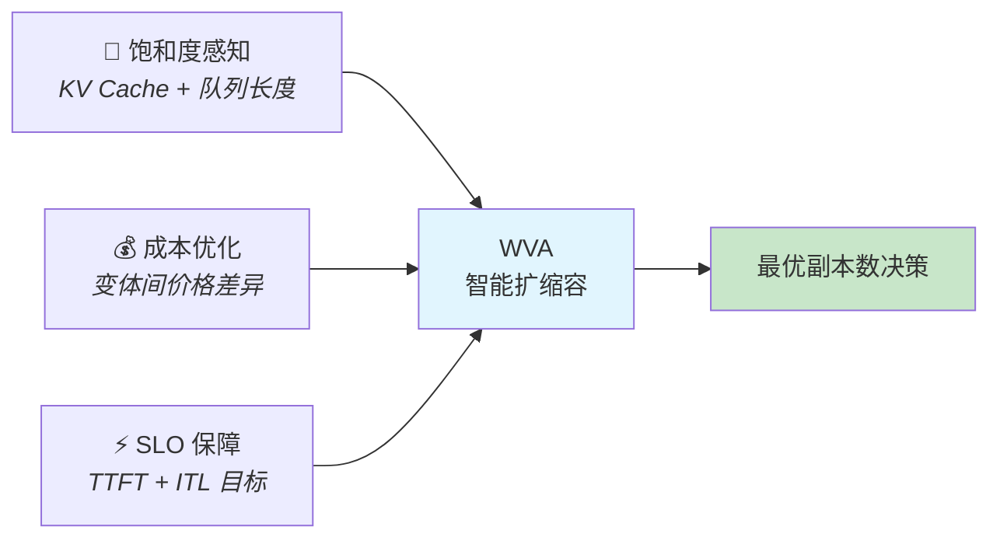
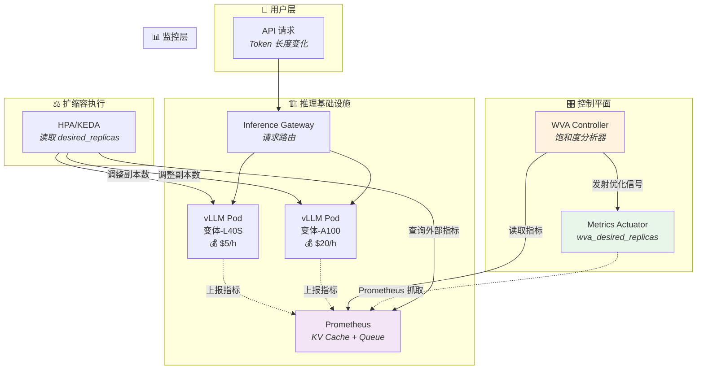
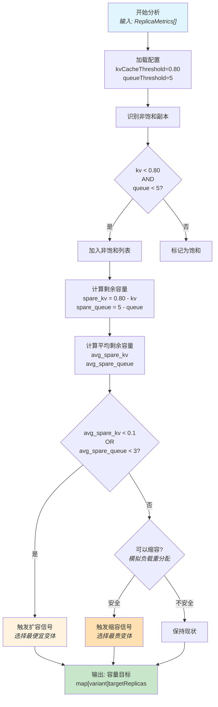
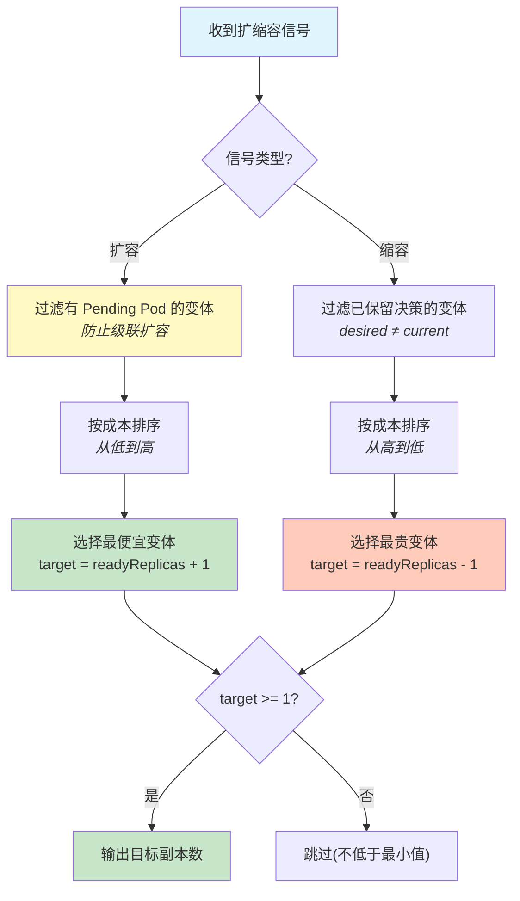
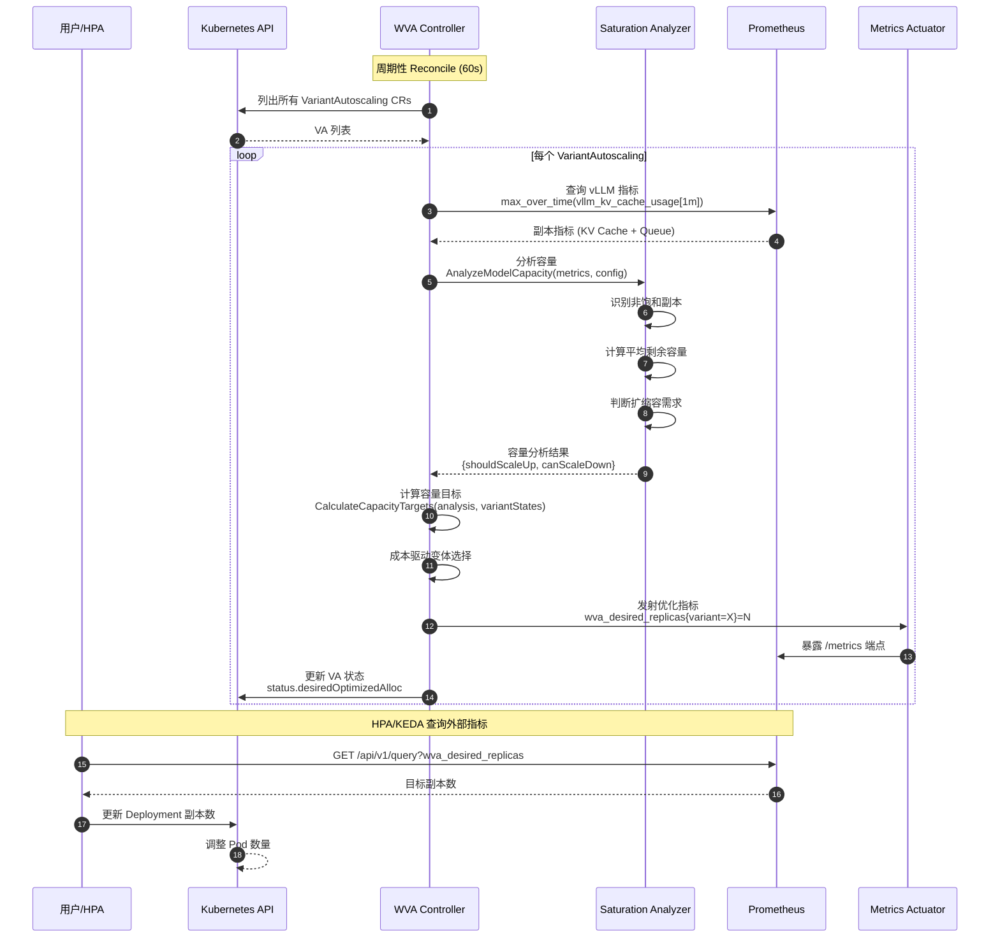
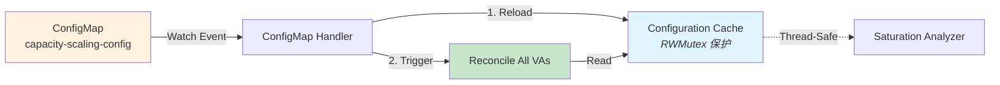
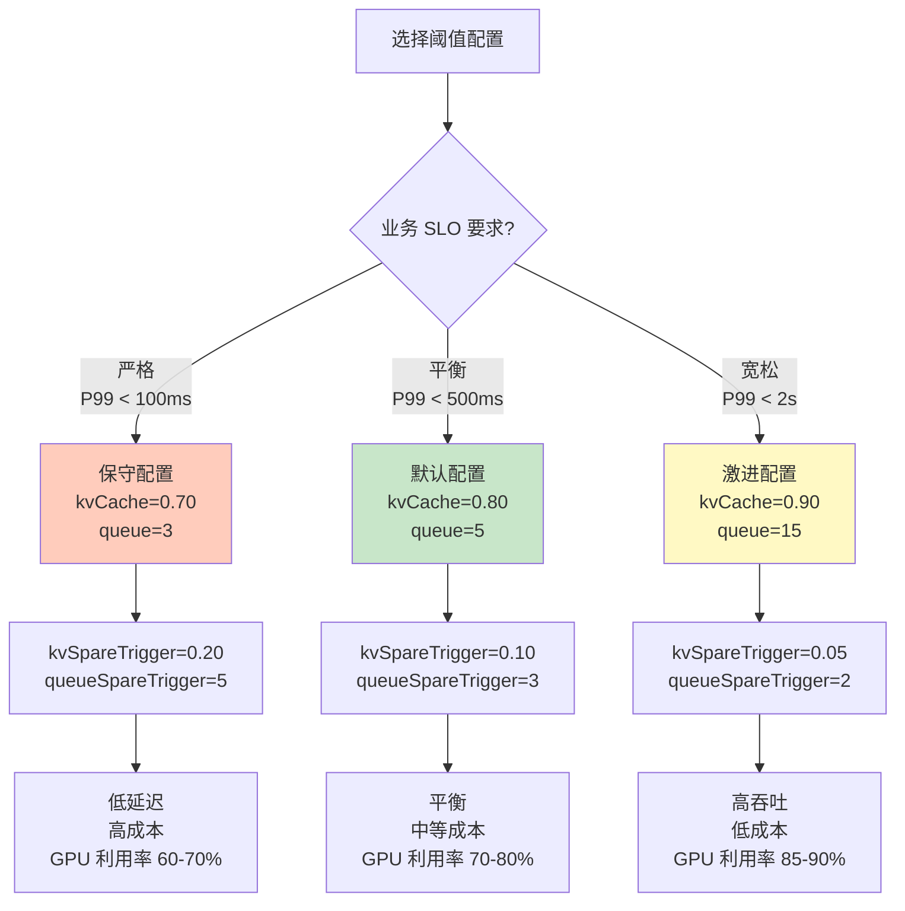
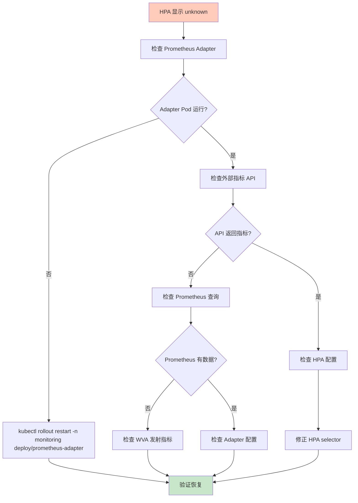
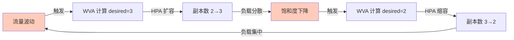
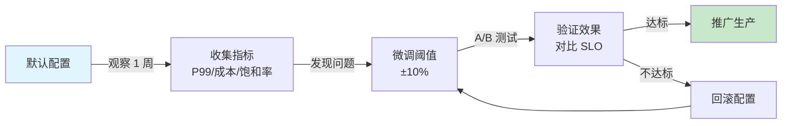

# Workload Variant Autoscaler (WVA) 深度解析：基于饱和度的 AI 推理服务智能扩缩容

> **类比主线**：搬家公司的智能调度系统——根据物品大小（Token 长度）动态调配车辆（副本数）

---

## 🌀 螺旋 1 - 概念层：WVA 是什么？

### 本层目标
建立对 WVA 核心价值和架构全景的认知锚点——理解"为什么需要 WVA"以及"它在整个系统中扮演什么角色"。

---

### 问题起源：AI 推理服务的独特扩缩容挑战

传统的 Kubernetes 自动扩缩容(HPA/VPA)基于 **CPU/内存** 指标,但 AI 大模型推理服务有其特殊性:

#### 痛点 1: 负载异质性 (Workload Variance)
- **Token 长度差异巨大**: 用户问"天气如何?"(10 tokens) vs 长文档总结(5000+ tokens)
- **批处理效率不同**: 短请求可以高并发,长请求需要独占资源
- **资源利用率失衡**: CPU 指标正常,但 GPU KV Cache 已耗尽 80%

**搬家公司类比 🚚**:
> 传统 HPA 就像只看搬家车辆的"油耗"(CPU)来决定派几辆车,完全忽略了货物大小。WVA 相当于智能调度系统,既看油耗,也看车辆载重、行李箱占用率(KV Cache),甚至客户等待队列长度。

#### 痛点 2: 多维度容量瓶颈
AI 推理服务的"饱和"不仅仅是 CPU 打满,还包括:
- **KV Cache 耗尽**: vLLM 等推理引擎的核心瓶颈,直接影响吞吐量
- **请求队列堆积**: 队列长度 > 5 时,P99 延迟会指数级上升
- **推理引擎特性**: 不同模型(Llama-70B vs Granite-13B)对资源的敏感度差异

---

### WVA 的核心价值主张

WVA (Workload Variant Autoscaler) 是 Kubernetes 上首个**基于推理引擎饱和度**的智能扩缩容控制器,专为 AI 推理场景设计。

#### 核心能力三角



**1. 饱和度感知 (Saturation-Aware)**
- 实时采集 vLLM 推理引擎的 KV Cache 使用率和请求队列长度
- 提前预测容量耗尽,在饱和前扩容(而非等到 CPU 打满)

**2. 成本优化 (Cost-Optimized)**
- 支持多变体部署(同一模型在不同 GPU 上:L40S / A100 / H100)
- 扩容时优先选择最便宜的变体,缩容时优先下线最贵的变体

**3. SLO 保障 (SLO-Driven)**
- 以业务指标(TTFT / ITL)为目标,而非底层资源指标
- 配合离线建模(ITL = α + β × batch_size)精确计算所需副本数

---

### 架构全景图



#### 关键组件职责

| 组件 | 角色 | 核心能力 |
|------|------|----------|
| **WVA Controller** | 决策大脑 | 运行饱和度分析器,计算最优副本数 |
| **Saturation Analyzer** | 容量专家 | 识别非饱和副本,计算剩余容量 |
| **Metrics Actuator** | 信号发射器 | 将优化结果暴露为 Prometheus 指标 |
| **HPA/KEDA** | 执行者 | 读取 `wva_desired_replicas` 并调整 Deployment |
| **Prometheus** | 数据枢纽 | 采集 vLLM 指标 + 暴露 WVA 优化信号 |

**搬家公司类比 🚚**:
- **WVA Controller** = 调度中心,决定派几辆车
- **Saturation Analyzer** = 车辆监控系统,实时报告每辆车的载重率和等待订单数
- **Metrics Actuator** = 调度大屏,展示"需要 3 辆车"
- **HPA** = 车队管理员,看到大屏后真正派出车辆

---

### WVA 与传统扩缩容的本质区别

| 维度 | 传统 HPA | WVA |
|------|----------|-----|
| **触发指标** | CPU/内存利用率 | KV Cache + 请求队列长度 |
| **决策粒度** | 单一 Deployment | 多变体全局优化 |
| **成本感知** | ❌ 无 | ✅ 价格差异驱动 |
| **容量预测** | 被动响应(已饱和才扩容) | 主动预测(饱和前扩容) |
| **推理引擎适配** | ❌ 通用 | ✅ vLLM 原生支持 |

**关键创新点**:
1. **提前扩容而非事后响应**: 当平均剩余 KV Cache < 10% 时触发扩容,避免请求排队
2. **多变体协同调度**: 同一模型可部署在 L40S(便宜) + A100(贵),WVA 优先扩容便宜变体
3. **级联扩容防护**: 检测 Pending Pods,避免重复触发扩容(Pod 启动需 2-7 分钟)

---

### ✅ 螺旋 1 验收标准

你能用一句话回答以下问题吗?

1. **WVA 解决了什么核心痛点?**  
   _(提示: 传统 HPA 为什么不适用于 AI 推理?)_

2. **WVA 的三个核心能力是什么?**  
   _(提示: 饱和度 + 成本 + ?)_

3. **WVA 在架构中的位置?**  
   _(提示: 它是直接调整副本数,还是发射优化信号?)_

---

### 🔗 下一步指引

理解了 WVA "是什么"后,接下来进入**螺旋 2 - 机制层**,我们将深入揭秘:
- 饱和度分析器如何计算"剩余容量"?
- 为什么扩容要选最便宜变体,缩容要选最贵变体?
- ConfigMap 变更如何立即生效而无需重启 Pod?

**认知降压提示**: 下一层会涉及一些算法细节(如剩余容量计算公式),但别担心——我们会用搬家公司类比继续帮你理解!

---

## 🔄 认知降压 (Decompression)

在进入螺旋 2 的机制细节前,让我们先建立一个**认知铺垫**,避免直接面对复杂算法时的理解障碍。

---

### 从搬家公司到容量计算:类比升华

**场景设定 🚚**:
你是一家智能搬家公司的调度员,需要决定派几辆车去处理当前的订单。

#### 第一步:识别"饱和"车辆
- **车辆 A**: 载重 75%,等待订单 3 个 → **未饱和**
- **车辆 B**: 载重 85%,等待订单 6 个 → **已饱和**(超过阈值 80% / 5 个)
- **车辆 C**: 载重 60%,等待订单 2 个 → **未饱和**

**WVA 对应**: 
- 载重 = KV Cache 使用率
- 等待订单数 = 请求队列长度
- 阈值 = `kvCacheThreshold: 0.80` 和 `queueLengthThreshold: 5`

---

#### 第二步:计算"剩余容量"
对于每辆**未饱和**车辆,计算它还能承担多少负载:

```
车辆 A 剩余载重 = 80% - 75% = 5%
车辆 A 剩余订单容量 = 5 - 3 = 2 个

车辆 C 剩余载重 = 80% - 60% = 20%
车辆 C 剩余订单容量 = 5 - 2 = 3 个
```

**平均剩余容量**:
- 平均剩余载重 = (5% + 20%) / 2 = **12.5%**
- 平均剩余订单容量 = (2 + 3) / 2 = **2.5 个**

**WVA 对应**:
```
avg_spare_kv = Σ (kvCacheThreshold - kv_usage_i) / N_non_saturated
avg_spare_queue = Σ (queueThreshold - queue_length_i) / N_non_saturated
```

---

#### 第三步:决策扩缩容
**扩容触发条件** (剩余容量不足):
- 如果平均剩余载重 < 10% **或** 平均剩余订单容量 < 3 个 → **派更多车**

**缩容安全验证** (模拟减少一辆车):
1. 假设移除车辆 A,将其负载重新分配给车辆 C
2. 计算分配后车辆 C 的新负载:是否会超过阈值?
3. 如果超过 → **缩容不安全,保持现状**
4. 如果未超过 → **可以安全缩容**

**WVA 对应**: 
- 扩容触发: `avg_spare_kv < kvSpareTrigger (0.1)` 或 `avg_spare_queue < queueSpareTrigger (3)`
- 缩容安全模拟: 计算移除副本后,总负载重新分配是否会导致剩余副本饱和

---

### 为什么需要"剩余容量"而非"当前使用率"?

**反直觉的关键点**: WVA 不是等到车辆装满(KV Cache 100%)才扩容,而是**提前预警**。

**现实类比**:
> 如果你等到搬家车完全装满才叫下一辆车,客户的家具就要在路边等待。WVA 的策略是:当车辆还有 10% 空间时就提前叫车,确保新车到达时(Pod 启动需 2-7 分钟),客户不会等待。

**技术原因**:
1. **Pod 启动延迟**: 容器启动 + 模型加载需 2-7 分钟
2. **请求突发**: AI 推理流量可能突然增加(如双 11 大促)
3. **SLO 保障**: 提前扩容避免 P99 延迟超标

---

### 成本优化的直觉:为什么扩容选最便宜?

**搬家公司场景 🚚**:
- 小货车(L40S): $50/次
- 大卡车(A100): $200/次

**调度策略**:
- **扩容时**: 优先派小货车(便宜) → 成本增长最慢
- **缩容时**: 优先撤回大卡车(贵) → 成本降低最快

**WVA 对应**:
```go
// 扩容:选择成本最低的变体
if needScaleUp {
    cheapest := findCheapestVariant(variants)
    scaleUp(cheapest, +1)
}

// 缩容:选择成本最高的变体
if canScaleDown {
    mostExpensive := findMostExpensiveVariant(variants)
    scaleDown(mostExpensive, -1)
}
```

**真实案例**:
- 模型: Llama-70B
- 变体 1: L40S ($5/h) x 2 副本 = $10/h
- 变体 2: A100 ($20/h) x 3 副本 = $60/h
- 扩容时 → 选择 L40S,总成本 $10 → $15 (增加 $5)
- 如果选 A100 → 总成本 $60 → $80 (增加 $20) ❌

---

### 进入螺旋 2 前的心理准备

接下来的内容会涉及:
- ✅ **Mermaid 时序图**: 展示 WVA 组件间的交互流程
- ✅ **伪代码片段**: 饱和度分析算法的核心逻辑
- ✅ **ConfigMap Watch 机制**: 如何实现配置热更新

**关键要点**:
1. 看到公式时,回想"搬家车辆剩余容量"的类比
2. 看到时序图时,思考"调度中心如何协调车队"
3. 遇到复杂流程时,关注**输入 → 处理 → 输出**三段式

准备好了吗?让我们揭开 WVA 的技术内幕! 🚀

---

## 🌀 螺旋 2 - 机制层：WVA 如何工作？

### 本层目标
揭示 WVA 核心机制的底层逻辑——饱和度分析算法、事件驱动架构、配置热更新等技术细节,使你能够画出核心流程图并理解关键决策点。

---

### 核心机制 1: 饱和度分析算法 (Saturation Analyzer)

#### 算法目标
从多个副本的实时指标中,判断是否需要扩缩容,并输出最优副本数。

#### 输入数据结构

```yaml
# 从 Prometheus 采集的副本指标
ReplicaMetrics:
  - podName: "llama-70b-pod-1"
    variantName: "llama-70b-l40s"
    kvCacheUsage: 0.75        # KV Cache 使用率 (0.0-1.0)
    queueLength: 3            # 等待队列长度
    cost: 5.0                 # 副本成本 ($5/小时)
  
  - podName: "llama-70b-pod-2"
    variantName: "llama-70b-a100"
    kvCacheUsage: 0.85
    queueLength: 6
    cost: 20.0
```

**搬家公司类比 🚚**: 每辆车上报当前载重、等待订单数、运营成本

---

#### 算法流程图



---

#### 核心算法伪代码

**步骤 1: 识别非饱和副本**

```python
def identify_non_saturated_replicas(metrics, config):
    non_saturated = []
    
    for replica in metrics:
        # 双重条件: KV Cache 和队列都未饱和
        if (replica.kvCacheUsage < config.kvCacheThreshold and 
            replica.queueLength < config.queueLengthThreshold):
            non_saturated.append(replica)
    
    return non_saturated
```

**搬家公司类比 🚚**: 筛选出"未装满且订单不多"的车辆

---

**步骤 2: 计算平均剩余容量**

```python
def calculate_average_spare_capacity(non_saturated, config):
    total_spare_kv = 0
    total_spare_queue = 0
    
    for replica in non_saturated:
        # 每个副本的剩余容量
        spare_kv = config.kvCacheThreshold - replica.kvCacheUsage
        spare_queue = config.queueLengthThreshold - replica.queueLength
        
        total_spare_kv += spare_kv
        total_spare_queue += spare_queue
    
    N = len(non_saturated)
    avg_spare_kv = total_spare_kv / N
    avg_spare_queue = total_spare_queue / N
    
    return avg_spare_kv, avg_spare_queue
```

**数值示例**:
```
副本 A: spare_kv = 0.80 - 0.75 = 0.05, spare_queue = 5 - 3 = 2
副本 C: spare_kv = 0.80 - 0.60 = 0.20, spare_queue = 5 - 2 = 3

avg_spare_kv = (0.05 + 0.20) / 2 = 0.125 (12.5%)
avg_spare_queue = (2 + 3) / 2 = 2.5
```

---

**步骤 3: 扩容决策**

```python
def should_scale_up(avg_spare_kv, avg_spare_queue, config):
    # 剩余容量低于触发阈值 → 扩容
    if (avg_spare_kv < config.kvSpareTrigger or 
        avg_spare_queue < config.queueSpareTrigger):
        return True
    return False

# 配置示例
config = {
    'kvSpareTrigger': 0.10,        # 剩余 KV Cache < 10% 触发
    'queueSpareTrigger': 3         # 剩余队列容量 < 3 触发
}

# 判断
if should_scale_up(0.125, 2.5, config):
    print("触发扩容")  # 2.5 < 3, 队列剩余容量不足
```

**为什么用"剩余容量"而非"使用率"**?
- ✅ **主动预测**: 剩余 10% 时扩容,给 Pod 启动留 2-7 分钟缓冲
- ❌ **被动响应**: 等到 100% 再扩容,请求已经开始排队

---

**步骤 4: 缩容安全验证**

```python
def is_scale_down_safe(non_saturated, config):
    # 至少保留 2 个非饱和副本(安全底线)
    if len(non_saturated) < 2:
        return False
    
    # 模拟移除 1 个副本后,负载重新分配
    total_kv_load = sum(r.kvCacheUsage for r in non_saturated)
    total_queue_load = sum(r.queueLength for r in non_saturated)
    
    remaining_replicas = len(non_saturated) - 1
    avg_kv_after = total_kv_load / remaining_replicas
    avg_queue_after = total_queue_load / remaining_replicas
    
    # 计算分配后的剩余容量
    remaining_spare_kv = config.kvCacheThreshold - avg_kv_after
    remaining_spare_queue = config.queueLengthThreshold - avg_queue_after
    
    # 剩余容量仍满足触发阈值 → 安全
    if (remaining_spare_kv >= config.kvSpareTrigger and 
        remaining_spare_queue >= config.queueSpareTrigger):
        return True
    return False
```

**数值示例**:
```
当前: 3 个非饱和副本
  - 副本 A: kv=0.70, queue=2
  - 副本 B: kv=0.65, queue=3
  - 副本 C: kv=0.60, queue=2

总负载: kv_total=2.95, queue_total=7
模拟移除 1 个副本后:
  - 剩余 2 个副本
  - avg_kv = 2.95 / 2 = 0.675
  - avg_queue = 7 / 2 = 3.5

剩余容量:
  - spare_kv = 0.80 - 0.675 = 0.125 (12.5%) > 0.10 ✅
  - spare_queue = 5 - 3.5 = 1.5 < 3 ❌

结论: 缩容不安全(队列容量不足)
```

**搬家公司类比 🚚**: 撤回 1 辆车后,剩余车辆会不会超载?

---

### 核心机制 2: 成本驱动的变体选择

#### 变体状态数据结构

```yaml
VariantReplicaState:
  - variantName: "llama-70b-l40s"
    cost: 5.0                      # 每副本成本
    currentReplicas: 2             # 当前实际副本数
    desiredReplicas: 2             # 上次优化的目标数(从 CRD 状态读取)
    readyReplicas: 2               # 已就绪副本数(上报指标的副本)
    pendingReplicas: 0             # Pending 副本数 (current - ready)
  
  - variantName: "llama-70b-a100"
    cost: 20.0
    currentReplicas: 4
    desiredReplicas: 4             # 保留上次决策
    readyReplicas: 3               # 1 个 Pod 仍在启动中
    pendingReplicas: 1
```

---

#### 变体选择逻辑流程图



---

#### 核心逻辑伪代码

**扩容场景:选择最便宜变体**

```python
def calculate_scaleup_target(variants, capacity_analysis):
    # 过滤已保留决策的变体
    eligible = [v for v in variants 
                if v.desiredReplicas == 0 or v.desiredReplicas == v.currentReplicas]
    
    # 过滤有 Pending Pods 的变体(防止级联扩容)
    eligible = [v for v in eligible if v.pendingReplicas == 0]
    
    # 按成本排序,选择最便宜
    eligible.sort(key=lambda v: v.cost)
    cheapest = eligible[0]
    
    # 目标 = 已就绪副本数 + 1
    target = cheapest.readyReplicas + 1
    
    return {cheapest.variantName: target}
```

**为什么用 `readyReplicas` 而非 `currentReplicas`**?
- `currentReplicas`: 包括 Pending Pods(还在启动中)
- `readyReplicas`: 只计算已上报指标的 Pods(真实可用容量)
- **避免过度扩容**: 如果基于 `currentReplicas`,会为未就绪的 Pod 重复扩容

---

**缩容场景:选择最贵变体**

```python
def calculate_scaledown_target(variants, capacity_analysis):
    # 过滤已保留决策的变体
    eligible = [v for v in variants 
                if v.desiredReplicas == 0 or v.desiredReplicas == v.currentReplicas]
    
    # 按成本排序,选择最贵
    eligible.sort(key=lambda v: v.cost, reverse=True)
    most_expensive = eligible[0]
    
    # 目标 = 已就绪副本数 - 1(但不低于 1)
    target = max(1, most_expensive.readyReplicas - 1)
    
    return {most_expensive.variantName: target}
```

---

#### 级联扩容防护机制

**问题场景**:
```
T+0s:  饱和检测 → 扩容 variant-1 从 2 → 3 (创建 1 个新 Pod)
T+30s: 新 Pod 仍在启动,未就绪 (readyReplicas=2, pendingReplicas=1)
       饱和仍存在(因为只有 2 个 ready) → 再次触发扩容? ❌
```

**WVA 解决方案**:
```python
# 跳过有 Pending Pods 的变体
if variant.pendingReplicas > 0:
    skip(variant)  # 等待 Pending Pod 就绪后再决策
```

**时间线对比**:

| 时间 | 无防护 ❌ | 有防护 ✅ |
|------|----------|----------|
| T+0s | 扩容至 3 | 扩容至 3 |
| T+30s | 再次扩容至 4(错误!) | 跳过(有 1 个 Pending) |
| T+60s | 再次扩容至 5(错误!) | 跳过 |
| T+90s | 5 个副本(过度配置) | 3 个副本就绪,评估是否需要继续扩 |

**Pod 启动时间**: 2-7 分钟(容器启动 + 模型加载 + 健康检查)

---

### 核心机制 3: 事件驱动的 Reconciliation Loop

#### 完整时序图



---

#### 关键时序节点解读

**节点 3-4: Prometheus 查询策略**
```promql
# 使用 max_over_time[1m] 获取峰值容量使用
max_over_time(vllm:kv_cache_usage_perc{
  namespace="prod",
  model_id="llama-70b"
}[1m])
```

**为什么用 `max_over_time` 而非即时值?**
- ✅ **安全优先**: 捕获 1 分钟内的峰值,避免遗漏突发流量
- ✅ **避免误判**: 即时值可能在采样间隙下降,导致误判为"未饱和"

---

**节点 13-14: 状态更新与信号发射**

```yaml
# VariantAutoscaling CRD 状态更新
status:
  conditions:
    - type: Ready
      status: "True"
  currentOptimizedAlloc:
    numReplicas: 2
    accelerator: "L40S"
  desiredOptimizedAlloc:
    numReplicas: 3        # 饱和度分析结果
    accelerator: "L40S"
```

**Prometheus 指标发射**:
```
wva_current_replicas{variant_name="llama-70b-l40s", namespace="prod", accelerator_type="L40S"} 2
wva_desired_replicas{variant_name="llama-70b-l40s", namespace="prod", accelerator_type="L40S"} 3
wva_desired_ratio{variant_name="llama-70b-l40s"} 1.5  # 3 / 2
```

---

### 核心机制 4: 配置热更新机制 (ConfigMap Watch)

#### 问题场景
修改饱和度阈值后,如何**立即生效**而无需重启 Pod?

#### 架构设计



---

#### ConfigMap 数据结构

```yaml
apiVersion: v1
kind: ConfigMap
metadata:
  name: capacity-scaling-config
  namespace: workload-variant-autoscaler-system
data:
  # 全局默认配置
  default: |
    kvCacheThreshold: 0.80
    queueLengthThreshold: 5
    kvSpareTrigger: 0.10
    queueSpareTrigger: 3
  
  # 按模型覆盖
  llama-70b-prod: |
    model_id: meta/llama-70b
    namespace: production
    kvCacheThreshold: 0.85      # 生产环境更激进
    kvSpareTrigger: 0.15
```

---

#### 配置热更新流程

**步骤 1: 控制器启动时初始化缓存**

```python
def initialize_cache():
    config_map = k8s_client.read_config_map(
        name="capacity-scaling-config",
        namespace="workload-variant-autoscaler-system"
    )
    
    # 解析默认配置
    default_config = parse_yaml(config_map.data["default"])
    cache["default"] = default_config
    
    # 解析模型覆盖配置
    for key, value in config_map.data.items():
        if key != "default":
            override_config = parse_yaml(value)
            cache[key] = override_config
    
    log.info(f"缓存初始化完成, entries={len(cache)}")
```

---

**步骤 2: Watch ConfigMap 变更**

```python
def watch_configmap():
    watcher = k8s_client.watch_config_map(
        name="capacity-scaling-config",
        namespace="workload-variant-autoscaler-system"
    )
    
    for event in watcher:
        if event.type in ["ADDED", "MODIFIED"]:
            log.info("检测到 ConfigMap 变更,重新加载缓存")
            
            # 加写锁,更新缓存
            with cache_lock.write():
                reload_cache(event.object)
            
            # 触发所有 VariantAutoscaling 重新 Reconcile
            trigger_reconcile_all()
```

---

**步骤 3: Reconcile 读取缓存**

```python
def reconcile_variant_autoscaling(va):
    # 读取缓存(无 API 调用)
    with cache_lock.read():
        config = get_config_for_variant(
            cache, 
            model_id=va.spec.modelID,
            namespace=va.namespace
        )
    
    # 使用最新配置进行饱和度分析
    analysis = saturation_analyzer.analyze(metrics, config)
    # ...
```

---

#### 性能对比

| 操作 | 无缓存(每次读 ConfigMap) | 有缓存 + Watch |
|------|--------------------------|----------------|
| **启动时** | N/A | 1 次 ConfigMap 读取 |
| **每次 Reconcile** | 1 次 API 调用 | 0 次(内存读取) |
| **配置更新** | 需重启 Pod | 立即生效(< 1s) |
| **并发访问** | 串行 API 调用 | 并发读(RWMutex) |

---

### ✅ 螺旋 2 验收标准

你能画出以下流程图吗?

1. **饱和度分析算法的决策树**  
   _(提示: 识别非饱和 → 计算剩余容量 → 扩缩容判断)_

2. **成本驱动的变体选择流程**  
   _(提示: 扩容选最便宜,缩容选最贵)_

3. **ConfigMap 变更到生效的完整路径**  
   _(提示: Watch Event → Reload Cache → Trigger Reconcile)_

---

### 🔗 下一步指引

理解了 WVA "如何工作"后,最后进入**螺旋 3 - 实战层**,我们将聚焦:
- 如何配置饱和度阈值?生产环境推荐值是多少?
- HPA 稳定窗口设置为多少秒?为什么?
- 如何排查"指标不可用"的问题?
- 典型故障场景及排障 SOP

**实战层预告**: 下一层会提供大量配置示例和排障命令,帮你快速上手运维 WVA!

---

## 🌀 螺旋 3 - 实战层：如何运维 WVA？

### 本层目标
提供生产级部署配置、监控告警、故障排查等实战指南,使你能独立完成 WVA 的部署、调优和排障,并建立完善的运维体系。

---

## 第一部分：生产环境部署配置

### 配置维度 1: 饱和度阈值调优

#### 配置文件结构

```yaml
apiVersion: v1
kind: ConfigMap
metadata:
  name: capacity-scaling-config
  namespace: workload-variant-autoscaler-system
data:
  # 全局默认配置 - 适用于大多数场景
  default: |
    kvCacheThreshold: 0.80        # KV Cache 饱和阈值
    queueLengthThreshold: 5       # 请求队列饱和阈值
    kvSpareTrigger: 0.10          # 扩容触发阈值(剩余容量 < 10%)
    queueSpareTrigger: 3          # 扩容触发阈值(剩余队列 < 3)
```

---

#### 阈值选择决策树



---

#### 按工作负载类型推荐配置

| 场景 | kvCacheThreshold | queueLengthThreshold | kvSpareTrigger | queueSpareTrigger | 适用场景 |
|------|------------------|----------------------|----------------|-------------------|----------|
| **实时对话** | 0.70 | 3 | 0.20 | 5 | 在线客服、实时翻译 |
| **内容生成** | 0.80 | 5 | 0.10 | 3 | 文章写作、代码补全 |
| **批量处理** | 0.90 | 15 | 0.05 | 2 | 离线分析、数据清洗 |
| **混合负载** | 0.80 | 8 | 0.15 | 4 | 多种请求类型混合 |

**搬家公司类比 🚚**:
- **实时对话** = 快递服务(容忍度低,车辆随时待命)
- **内容生成** = 标准搬家(合理规划,平衡效率)
- **批量处理** = 货运物流(满载才发车,成本优先)

---

#### 按模型覆盖配置示例

```yaml
data:
  default: |
    kvCacheThreshold: 0.80
    queueLengthThreshold: 5
    kvSpareTrigger: 0.10
    queueSpareTrigger: 3
  
  # 生产环境 Llama-70B - 更激进的阈值
  llama-70b-prod: |
    model_id: meta/llama-70b
    namespace: production
    kvCacheThreshold: 0.85          # 大模型更耐压
    kvSpareTrigger: 0.15
    queueLengthThreshold: 8
    queueSpareTrigger: 4
  
  # 实验环境 Granite-13B - 保守配置
  granite-13b-lab: |
    model_id: ibm/granite-13b
    namespace: lab
    kvCacheThreshold: 0.70          # 低延迟要求
    kvSpareTrigger: 0.20
```

**应用配置**:
```bash
kubectl apply -f capacity-scaling-config.yaml

# 验证配置加载(立即生效,无需重启)
kubectl logs -n workload-variant-autoscaler-system \
  deployment/workload-variant-autoscaler-controller-manager \
  | grep "Saturation scaling config cache updated"
```

---

### 配置维度 2: HPA 集成配置

#### 核心参数:稳定窗口 (Stabilization Window)

**作用**: 防止频繁扩缩容导致的"抖动"(flapping)

```yaml
apiVersion: autoscaling/v2
kind: HorizontalPodAutoscaler
metadata:
  name: llama-70b-hpa
  namespace: production
spec:
  scaleTargetRef:
    apiVersion: apps/v1
    kind: Deployment
    name: llama-70b-deployment
  minReplicas: 1
  maxReplicas: 10
  
  behavior:
    scaleUp:
      stabilizationWindowSeconds: 180    # 扩容稳定窗口
      policies:
      - type: Pods
        value: 2                          # 每次最多扩 2 个副本
        periodSeconds: 60                 # 每 60 秒评估一次
    
    scaleDown:
      stabilizationWindowSeconds: 300    # 缩容稳定窗口(更长)
      policies:
      - type: Pods
        value: 1                          # 每次最多缩 1 个副本
        periodSeconds: 120                # 每 120 秒评估一次
  
  metrics:
  - type: External
    external:
      metric:
        name: wva_desired_replicas
        selector:
          matchLabels:
            variant_name: llama-70b-deployment
      target:
        type: AverageValue
        averageValue: "1"                 # 目标值永远为 1(WVA 已计算最优值)
```

---

#### 稳定窗口推荐值

| 环境 | scaleUp (秒) | scaleDown (秒) | 原因 |
|------|--------------|----------------|------|
| **生产环境** | 180-300 | 300-600 | 避免成本波动,确保稳定性 |
| **预发环境** | 60-120 | 120-180 | 平衡响应速度和稳定性 |
| **开发环境** | 30-60 | 60-120 | 快速迭代测试 |
| **E2E 测试** | 0-30 | 30-60 | 快速验证扩缩容逻辑 |

**关键原则**:
1. **缩容窗口 > 扩容窗口**: 缩容更谨慎,避免频繁上下线
2. **Pod 启动时间**: 扩容窗口应 > 模型加载时间(2-7 分钟)
3. **业务峰谷周期**: 窗口应 > 业务流量波动周期(如 5 分钟)

**搬家公司类比 🚚**:
> 不能客户刚下单就派车,也不能客户取消订单就立即撤车。扩容窗口 = "观察 3 分钟确认持续有单",缩容窗口 = "观察 5 分钟确认真的没单了"。

---

#### Helm 部署配置

```bash
# 生产环境部署
helm install workload-variant-autoscaler ./charts/workload-variant-autoscaler \
  --namespace workload-variant-autoscaler-system \
  --create-namespace \
  --set hpa.enabled=true \
  --set hpa.minReplicas=1 \
  --set hpa.maxReplicas=10 \
  --set hpa.behavior.scaleUp.stabilizationWindowSeconds=240 \
  --set hpa.behavior.scaleDown.stabilizationWindowSeconds=360 \
  --set prometheus.url=https://prometheus.monitoring.svc:9090 \
  --set-file prometheus.caCert=/path/to/prometheus-ca.crt

# 开发环境部署(快速扩缩容)
helm install workload-variant-autoscaler ./charts/workload-variant-autoscaler \
  --set hpa.behavior.scaleUp.stabilizationWindowSeconds=30 \
  --set hpa.behavior.scaleDown.stabilizationWindowSeconds=60
```

---

### 配置维度 3: KEDA 集成配置(推荐)

**优势**: 原生支持 Scale to Zero,无需 alpha 特性

```yaml
apiVersion: keda.sh/v1alpha1
kind: ScaledObject
metadata:
  name: llama-70b-scaler
  namespace: production
spec:
  scaleTargetRef:
    name: llama-70b-deployment
  
  pollingInterval: 15                    # 每 15 秒查询一次指标
  cooldownPeriod: 120                    # 缩容至 0 前等待 120 秒
  minReplicaCount: 0                     # 支持缩容至 0
  maxReplicaCount: 10
  
  fallback:
    failureThreshold: 3                  # Prometheus 不可用时的降级策略
    replicas: 2
  
  advanced:
    horizontalPodAutoscalerConfig:
      behavior:
        scaleUp:
          stabilizationWindowSeconds: 180
          policies:
          - type: Pods
            value: 3
            periodSeconds: 60
        scaleDown:
          stabilizationWindowSeconds: 300
          policies:
          - type: Pods
            value: 1
            periodSeconds: 120
  
  triggers:
  - type: prometheus
    metadata:
      serverAddress: https://prometheus.monitoring.svc:9090
      query: |
        wva_desired_replicas{
          variant_name="llama-70b-deployment",
          exported_namespace="production"
        }
      threshold: "1"
      activationThreshold: "0"           # > 0 时激活(从 0 扩容)
      metricType: "AverageValue"
      unsafeSsl: "true"                  # 跳过证书验证(仅开发环境)
```

**部署**:
```bash
# 安装 KEDA
helm install keda kedacore/keda \
  --namespace keda-system \
  --create-namespace

# 应用 ScaledObject
kubectl apply -f llama-70b-scaledobject.yaml

# 验证
kubectl get scaledobject -n production
```

---

## 第二部分：监控与告警体系

### SLI/SLO 定义

#### 核心 SLI 指标

| 指标名称 | PromQL 查询 | SLO 目标 | 告警阈值 |
|---------|-------------|---------|---------|
| **饱和率** | `avg(vllm:kv_cache_usage_perc{namespace="prod"})` | < 80% | > 90% 持续 5 分钟 |
| **队列长度** | `max(vllm:num_requests_waiting{namespace="prod"})` | < 5 | > 10 持续 3 分钟 |
| **扩缩容延迟** | `time() - wva_optimization_timestamp` | < 120s | > 300s |
| **副本一致性** | `abs(wva_desired_replicas - wva_current_replicas)` | = 0 | > 0 持续 10 分钟 |
| **优化成功率** | `rate(wva_optimization_success_total[5m])` | > 99% | < 95% |

---

#### Grafana 监控面板示例

**Panel 1: 饱和度热力图**

```promql
# KV Cache 饱和度
avg by (variant_name) (
  vllm:kv_cache_usage_perc{namespace="production"}
)

# 队列长度趋势
max by (variant_name) (
  vllm:num_requests_waiting{namespace="production"}
)
```

**Panel 2: 副本数对比**

```promql
# 当前 vs 期望副本数
wva_current_replicas{namespace="production"}

wva_desired_replicas{namespace="production"}

# 缺口计算
abs(
  wva_desired_replicas{namespace="production"} - 
  wva_current_replicas{namespace="production"}
)
```

**Panel 3: 成本分析**

```promql
# 每小时成本
sum by (accelerator_type) (
  wva_current_replicas * on(variant_name) 
  group_left(cost) wva_variant_cost_info
)

# 节省成本(如果全用最贵 GPU)
sum(wva_variant_cost_info{accelerator_type="H100"} * wva_desired_replicas) - 
sum(wva_variant_cost_info * wva_current_replicas)
```

---

#### PrometheusRule 告警规则

```yaml
apiVersion: monitoring.coreos.com/v1
kind: PrometheusRule
metadata:
  name: wva-alerts
  namespace: workload-variant-autoscaler-system
spec:
  groups:
  - name: wva.saturation
    interval: 30s
    rules:
    # 饱和度告警
    - alert: WVAHighSaturation
      expr: |
        avg by (variant_name, namespace) (
          vllm:kv_cache_usage_perc
        ) > 0.90
      for: 5m
      labels:
        severity: warning
      annotations:
        summary: "{{ $labels.variant_name }} KV Cache 饱和度 > 90%"
        description: "当前值: {{ $value | humanizePercentage }}"
    
    # 副本不一致告警
    - alert: WVAReplicaMismatch
      expr: |
        abs(
          wva_desired_replicas - wva_current_replicas
        ) > 0
      for: 10m
      labels:
        severity: critical
      annotations:
        summary: "{{ $labels.variant_name }} 副本数不一致超过 10 分钟"
        description: "期望: {{ $labels.desired }}, 当前: {{ $labels.current }}"
    
    # 队列堆积告警
    - alert: WVAQueueBacklog
      expr: |
        max by (variant_name) (
          vllm:num_requests_waiting
        ) > 10
      for: 3m
      labels:
        severity: warning
      annotations:
        summary: "{{ $labels.variant_name }} 请求队列堆积"
        description: "当前队列长度: {{ $value }}"
    
    # 优化失败告警
    - alert: WVAOptimizationFailed
      expr: |
        rate(wva_optimization_success_total[5m]) < 0.95
      for: 5m
      labels:
        severity: critical
      annotations:
        summary: "WVA 优化成功率 < 95%"
        description: "可能是 Prometheus 不可达或配置错误"
```

**部署告警规则**:
```bash
kubectl apply -f wva-prometheus-rules.yaml

# 验证规则加载
kubectl get prometheusrules -n workload-variant-autoscaler-system
```

---

## 第三部分：故障排查 SOP

### 故障场景 1: 指标不可用 (`<unknown>/1`)

#### 症状

```bash
kubectl get hpa -n production
NAME          REFERENCE              TARGETS        MINPODS   MAXPODS   REPLICAS
llama-70b-hpa Deployment/llama-70b   <unknown>/1    1         10        1
```

---

#### 排查流程图



---

#### 排查命令

**步骤 1: 检查外部指标 API**

```bash
# 列出所有外部指标
kubectl get --raw "/apis/external.metrics.k8s.io/v1beta1" | jq

# 查询特定指标
kubectl get --raw "/apis/external.metrics.k8s.io/v1beta1/namespaces/production/wva_desired_replicas?labelSelector=variant_name%3Dllama-70b-deployment" | jq
```

**预期输出**:
```json
{
  "kind": "ExternalMetricValueList",
  "items": [
    {
      "metricName": "wva_desired_replicas",
      "metricLabels": {
        "variant_name": "llama-70b-deployment"
      },
      "value": "3"
    }
  ]
}
```

---

**步骤 2: 检查 Prometheus 数据**

```bash
# 端口转发 Prometheus
kubectl port-forward -n monitoring svc/prometheus 9090:9090

# 查询指标(浏览器访问 http://localhost:9090/graph)
wva_desired_replicas{variant_name="llama-70b-deployment", exported_namespace="production"}
```

**如果无数据 → 检查 WVA Controller**:
```bash
# 检查 WVA Pod 状态
kubectl get pods -n workload-variant-autoscaler-system

# 查看 WVA 日志
kubectl logs -n workload-variant-autoscaler-system \
  deployment/workload-variant-autoscaler-controller-manager \
  --tail=100 | grep -E "EmitReplicaMetrics|optimization"
```

---

**步骤 3: 检查 ServiceMonitor**

```bash
# 验证 ServiceMonitor 存在
kubectl get servicemonitor -n workload-variant-autoscaler-system \
  workload-variant-autoscaler-controller-manager-metrics-monitor

# 检查 Prometheus 是否抓取
kubectl get --raw /api/v1/namespaces/monitoring/services/prometheus:9090/proxy/api/v1/targets \
  | jq '.data.activeTargets[] | select(.labels.job=="workload-variant-autoscaler-controller-manager-metrics-service")'
```

---

### 故障场景 2: 副本数不收敛(一直不一致)

#### 症状

```bash
kubectl get variantautoscaling -n production
NAME        CURRENTREPLICAS   OPTIMIZED   AGE
llama-70b   2                 5           30m

# 30 分钟后仍然是 2 副本,未扩容到 5
```

---

#### 可能原因 & 解决方案

| 原因 | 症状 | 解决方案 |
|------|------|---------|
| **HPA 未正确读取指标** | HPA TARGETS 为 `<unknown>` | 见故障场景 1 |
| **HPA 稳定窗口过长** | 副本数缓慢变化 | 调整 `stabilizationWindowSeconds` |
| **资源不足(Pending Pods)** | `kubectl get pods` 显示 Pending | 检查节点资源,调整 requests/limits |
| **VariantAutoscaling 配置错误** | `kubectl describe va` 显示错误 | 检查 `modelID`, `scaleTargetRef` |

---

#### 诊断命令

```bash
# 检查 HPA 事件
kubectl describe hpa llama-70b-hpa -n production | grep Events -A 20

# 检查 Deployment 扩容历史
kubectl rollout history deployment/llama-70b-deployment -n production

# 检查 Pod 状态
kubectl get pods -n production -l app=llama-70b -o wide

# 如果有 Pending Pods
kubectl describe pod <pending-pod-name> -n production | grep Events -A 10
```

---

### 故障场景 3: 配置更改不生效

#### 症状

修改了 `capacity-scaling-config` ConfigMap,但 WVA 仍使用旧阈值。

---

#### 排查步骤

**步骤 1: 验证 ConfigMap 更新**

```bash
kubectl get cm capacity-scaling-config \
  -n workload-variant-autoscaler-system \
  -o yaml | grep kvCacheThreshold
```

---

**步骤 2: 检查 WVA 是否检测到变更**

```bash
kubectl logs -n workload-variant-autoscaler-system \
  deployment/workload-variant-autoscaler-controller-manager \
  --since=5m | grep "ConfigMap changed"
```

**预期日志**:
```
INFO  Saturation scaling ConfigMap changed, reloading cache
INFO  Saturation scaling config cache updated entries=3 has_default=true
INFO  Triggering reconciliation for all VariantAutoscaling resources
```

---

**步骤 3: 强制触发 Reconcile**

```bash
# 更新 VariantAutoscaling 触发 Reconcile
kubectl annotate variantautoscaling llama-70b-deployment \
  -n production \
  force-reconcile="$(date +%s)" \
  --overwrite

# 观察日志
kubectl logs -n workload-variant-autoscaler-system \
  deployment/workload-variant-autoscaler-controller-manager \
  -f | grep "llama-70b"
```

---

### 故障场景 4: 频繁扩缩容抖动

#### 症状

副本数频繁在 2 ↔ 3 ↔ 2 之间波动,日志显示每分钟都在扩缩容。

---

#### 根因分析



---

#### 解决方案

**方案 1: 增大 HPA 稳定窗口(推荐)**

```yaml
behavior:
  scaleUp:
    stabilizationWindowSeconds: 300    # 从 60 增加到 300
  scaleDown:
    stabilizationWindowSeconds: 600    # 从 120 增加到 600
```

**方案 2: 调整饱和度阈值(增大滞后区间)**

```yaml
data:
  default: |
    kvCacheThreshold: 0.80
    kvSpareTrigger: 0.15              # 从 0.10 增加到 0.15
    # 滞后区间: 0.65 ~ 0.80 (15% 缓冲区)
```

**方案 3: 增大 WVA Reconcile 周期**

```yaml
# ConfigMap 配置
GLOBAL_OPT_INTERVAL: "120"            # 从 60s 增加到 120s
```

---

#### 验证修复

```bash
# 监控副本数变化频率
watch -n 5 "kubectl get hpa llama-70b-hpa -n production"

# 统计扩缩容事件频率
kubectl get events -n production \
  --field-selector involvedObject.name=llama-70b-deployment \
  --sort-by='.lastTimestamp' | grep -i scale
```

---

## 第四部分：最佳实践与反模式

### ✅ 最佳实践

#### 1. 渐进式调优策略



**操作示例**:
```bash
# 阶段 1: 默认配置部署(观察 1 周)
helm install wva ./charts/workload-variant-autoscaler

# 阶段 2: 金丝雀环境微调
kubectl apply -f capacity-scaling-config-canary.yaml

# 阶段 3: 对比指标
kubectl port-forward -n monitoring svc/grafana 3000:3000
# 访问 http://localhost:3000, 对比 P99 延迟和成本

# 阶段 4: 推广生产
kubectl apply -f capacity-scaling-config-prod.yaml
```

---

#### 2. 与 End Point Picker (EPP) 阈值对齐

**关键原则**: WVA 和 EPP 使用相同的饱和度阈值,避免路由与扩缩容冲突。

```yaml
# WVA 配置
capacity-scaling-config:
  kvCacheThreshold: 0.80
  queueLengthThreshold: 5

# EPP 配置(InferenceScheduler)
saturationDetector:
  kvCacheUtilThreshold: 0.80        # 必须与 WVA 一致
  queueDepthThreshold: 5            # 必须与 WVA 一致
```

**为什么对齐**?
- ✅ EPP 不会将请求路由到 WVA 认为已饱和的副本
- ✅ 减少请求丢弃率和队列超时
- ✅ 协同优化 GPU 利用率

---

#### 3. 多环境配置管理

```bash
# 目录结构
configs/
├── base/
│   ├── capacity-scaling-config.yaml
│   └── hpa.yaml
├── overlays/
│   ├── dev/
│   │   └── kustomization.yaml
│   ├── staging/
│   │   └── kustomization.yaml
│   └── prod/
│       └── kustomization.yaml

# Kustomize 部署
kubectl apply -k configs/overlays/prod
```

---

### ❌ 反模式

#### 反模式 1: 过度激进的阈值

```yaml
# ❌ 错误示例
data:
  default: |
    kvCacheThreshold: 0.95            # 太高,容易触发 OOM
    kvSpareTrigger: 0.02              # 太小,扩容滞后
```

**后果**: 
- 请求大量排队,P99 延迟飙升
- 偶发 OOM Kill,服务中断

**正确做法**: 从保守配置开始(0.70 / 0.20),逐步调整到 0.80 / 0.10

---

#### 反模式 2: 忽略 Pod 启动时间

```yaml
# ❌ 错误示例
behavior:
  scaleUp:
    stabilizationWindowSeconds: 15    # 太短,Pod 还没起来又扩
```

**后果**: 级联扩容,创建大量 Pending Pods,成本失控

**正确做法**: 稳定窗口 ≥ 2 倍 Pod 启动时间 (至少 180s)

---

#### 反模式 3: 禁用 TLS 验证(生产环境)

```yaml
# ❌ 仅适用于开发环境
env:
- name: PROMETHEUS_TLS_INSECURE_SKIP_VERIFY
  value: "true"
```

**安全风险**: 中间人攻击,指标数据泄露

**正确做法**: 配置 CA 证书
```yaml
env:
- name: PROMETHEUS_CA_CERT_PATH
  value: "/etc/prometheus-certs/ca.crt"
volumeMounts:
- name: prometheus-ca
  mountPath: /etc/prometheus-certs
```

---

## 总结与展望

### 核心要点回顾

| 维度 | 关键技术 | 生产建议 |
|------|---------|---------|
| **饱和度分析** | 剩余容量模型 | 从保守阈值(0.70)开始调优 |
| **成本优化** | 变体价格驱动 | 扩容选 L40S,缩容选 H100 |
| **配置热更新** | ConfigMap Watch | 无需重启 Pod,立即生效 |
| **扩缩容防抖** | HPA 稳定窗口 | 生产环境 ≥ 180s |
| **监控告警** | PrometheusRule | 饱和率 > 90% 告警 |

---

### 进阶主题

**1. 多模型混合部署**
- 不同模型共享 GPU 节点
- WVA 跨模型的资源协调

**2. 与 Cluster Autoscaler 联动**
- WVA 触发节点扩容
- 节点预热策略

**3. 自定义饱和度指标**
- 接入自定义 Prometheus 指标
- 扩展 Saturation Analyzer

---

### ✅ 螺旋 3 验收标准

你能独立完成以下任务吗?

1. **配置饱和度阈值并应用到生产环境**  
   _(提示: 修改 ConfigMap,验证热更新)_

2. **诊断 HPA 指标不可用问题**  
   _(提示: 检查外部指标 API → Prometheus → ServiceMonitor)_

3. **设计合理的 HPA 稳定窗口配置**  
   _(提示: 扩容 180s,缩容 300s,为什么?)_

4. **建立饱和度监控告警**  
   _(提示: PrometheusRule,KV Cache > 90% 持续 5 分钟)_

---

### 🎓 结语

通过这三层螺旋的递进:
- **螺旋 1** 让你理解"WVA 是什么"——认知锚点
- **螺旋 2** 让你掌握"WVA 如何工作"——技术内幕
- **螺旋 3** 让你具备"WVA 运维能力"——实战落地

**搬家公司最终类比 🚚**:
> 你不仅知道搬家公司如何调度车辆(概念层),还理解了载重监控算法(机制层),更能在双 11 大促期间优化调度策略、排查车辆故障、降低运营成本(实战层)。

现在,你已经具备在生产环境部署和运维 WVA 的完整能力! 🚀

---

## 📚 参考资料

- [WVA GitHub Repository](https://github.com/llm-d-incubation/workload-variant-autoscaler)
- [Saturation Analyzer Documentation](https://github.com/llm-d-incubation/workload-variant-autoscaler/blob/main/docs/saturation-analyzer.md)
- [HPA Integration Guide](https://github.com/llm-d-incubation/workload-variant-autoscaler/blob/main/docs/integrations/hpa-integration.md)
- [KEDA Integration Guide](https://github.com/llm-d-incubation/workload-variant-autoscaler/blob/main/docs/integrations/keda-integration.md)
