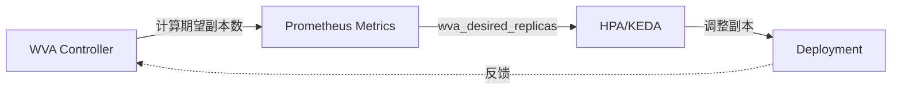
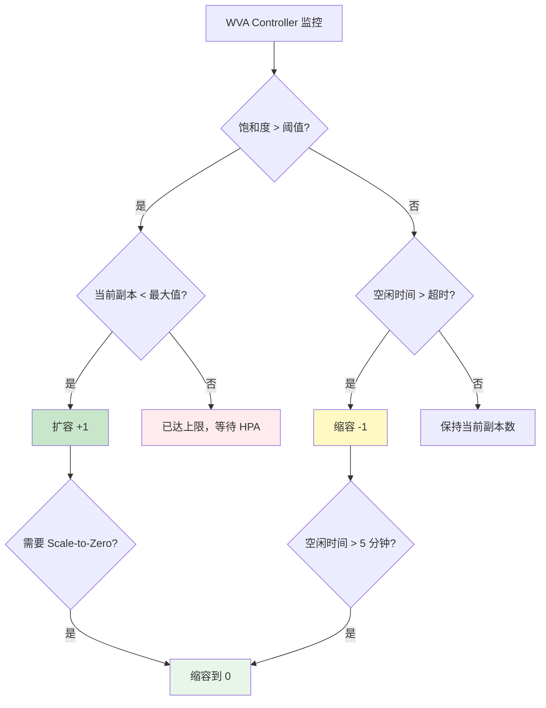

# Workload Variant Autoscaler - 饱和度感知弹性伸缩

> **核心价值**: 超越 CPU/内存指标,基于 LLM 推理饱和度实现智能扩缩容  
> **技术栈**: Go + Prometheus + HPA/KEDA  
> **关键指标**: Scale-to-Zero 冷启动 <30s, 饱和度感知避免 SLO 违约

---

##

### 传统 HPA 的盲点

```yaml
# 传统 HPA 配置
apiVersion: autoscaling/v2
kind: HorizontalPodAutoscaler
spec:
  metrics:
    - type: Resource
      resource:
        name: cpu
        target:
          averageUtilization: 70  # ❌ GPU 推理 CPU 利用率低!
```

**问题**:
- GPU 推理: CPU 利用率 <20%, 但 GPU 已满载
- KV Cache 压力: 内存占用不等于推理能力
- 队列堆积: HPA 不感知请求等待时间

---

### WVA 的饱和度模型

```python
saturation = (
    kv_memory_utilization * 0.5 +   # KV Cache 占用
    queue_depth_ratio * 0.3 +        # 队列深度
    throughput_degradation * 0.2     # 吞吐下降
)

if saturation > 0.8:
    desired_replicas = current + 1  # 扩容
elif saturation < 0.3:
    desired_replicas = current - 1  # 缩容
```

---

## 💨 认知过渡：从表象到机制

### 过渡：工厂"弹性用工"类比

在深入代码实现前，让我们先理解 WVA 背后的**常识性逻辑**——就像一个智能工厂的用工管理系统。

| 维度 | 传统方案 (HPA) | WVA 智能方案 |
|------|----------------|----------------|
| **判断依据** | 工人"打卡时间" (CPU 利用率) | 产线饱和度 (原料库存+在制品+产能下降) |
| **扩容时机** | CPU > 70% | KV Cache 占用 + 队列深度 + 吞吐下降 |
| **缩容时机** | CPU < 30% | 饱和度 < 30% 且空闲时间 > 5 分钟 |

**核心洞察**：CPU 利用率不等于推理能力，真正的"忙碌"应该用业务指标衡量。

---

## 机制层：机制闭环

### 工作流程



---

## 实战层：实战闭环 — 如何驾驭

```yaml
apiVersion: llmd.ai/v1alpha1
kind: VariantAutoscaling
metadata:
  name: llama-autoscaler
spec:
  scaleTargetRef:
    kind: Deployment
    name: llama-70b
  saturationThreshold: 0.8
  scaleToZero:
    enabled: true
    idleTimeout: 300s  # 5 分钟无请求缩容到 0
```

**适用场景**: 内部工具、开发环境、间歇性批处理

---

### 边界情况与异常处理

#### Edge Cases 汇总表

| 场景 | 触发条件 | 系统行为 | 应对策略 |
|------|---------|---------|----------|
| **指标采集失败** | Prometheus 不可用 | 使用最近已知值，触发告警 | 检查 Prometheus 连接 |
| **Scale-to-Zero 频繁抖动** | 请求间隔 <5 分钟 | Pod 反复启停，冷启动开销高 | 调整 idleTimeout 或禁用 Scale-to-Zero |
| **饱和度误判** | KV Cache 利用率波动 | 非预期扩缩容 | 调整饱和度权重或阈值 |
| **HPA 与 WVA 冲突** | 两者同时控制 replicas | 副本数剧烈波动 | 设置 `decoupleScaling: true` |
| **GPU 资源不足** | 扩容时无可用 GPU | Pod Pending，无法满足扩容需求 | 预留 GPU 缓冲池或使用 Spot |

#### 关键决策路径



---

## 元知识总结

### 核心设计哲学

**WVA 的本质是"业务感知的弹性伸缩"**，其设计体现以下核心思想：

1. **业务指标优于资源指标**：推理饱和度比 CPU/内存利用率更能反映真实负载
2. **加权综合优于单一指标**：KV Cache + 队列深度 + 吞吐下降，多维度评估
3. **主动预防优于被动响应**：预测性缩容，避免雪崩
4. **Scale-to-Zero 的成本权衡**：冷启动成本 vs 资源节省

### 关键决策框架

```
┌─────────────────────────────────────────────────────────────┐
│              WVA 决策框架                                  │
├─────────────────────────────────────────────────────────────┤
│  持续监控 → 计算饱和度 → 对比阈值 → 调整副本数          │
│                                                             │
│  饱和度计算：                                                │
│    - KV Cache 利用率 (权重 0.5)                              │
│    - 队列深度比例 (权重 0.3)                                │
│    - 吞吐下降趋势 (权重 0.2)                               │
│                                                             │
│  阈值策略：                                                  │
│    - 扩容：saturation > 0.8                                │
│    - 缩容：saturation < 0.3 且空闲时间 > 5 分钟           │
│    - 保护：minReplicas <= replicas <= maxReplicas               │
└─────────────────────────────────────────────────────────────┘
```

### 典型反直觉陷阱

| 直觉 | 现实 | 原因 |
|------|------|------|
| "CPU 高就是负载高" | GPU 推理 CPU 利用率低但已满载 | KV Cache 占用与 CPU 利用率无关 |
| "Scale-to-Zero 总是省钱" | 冷启动成本 > 资源节省 | 频繁启停会增加冷启动开销 |
| "阈值越高越好" | 过高导致扩容不及时 | 需根据业务 SLO 调整 |
| "HPA 和 WVA 可以同时用" | 会相互冲突 | 需要明确优先级 |
| "副本数越多越好" | 超过 GPU 数量会导致资源竞争 | 需考虑物理限制 |

### 何时选择 WVA？

**适合场景**：
- GPU 推理服务（KV Cache 是主要瓶颈）
- 流量波动大（间歇性峰值）
- 需要成本优化（Scale-to-Zero）
- 传统 HPA 无法准确反映负载

**不适合场景**：
- CPU 密集型工作负载
- 稳定流量（HPA 足够）
- 不需要 Scale-to-Zero（常驻服务）

### 上游依赖组件

| 组件 | 作用 | 关联章节 |
|------|------|---------|
| **Prometheus** | 提供 KV Cache、队列深度等指标 | [本章节机制层](#机制层机制闭环) |
| **HPA/KEDA** | 执行实际副本数调整 | [本章节机制层](#机制层机制闭环) |

### 下游扩展组件

| 组件 | 作用 | 文档链接 |
|------|------|---------|
| **llm-d-modelservice** | 管理推理服务部署 | [llm-d-modelservice](../../llm-d-modelservice/) |
| **LMCache** | KV Cache 多级存储 | [LMCache](../../lmcache/) |

### 进阶学习路径

1. **理解饱和度算法**：研究不同权重配置对扩缩容的影响
2. **优化 Scale-to-Zero**：平衡冷启动成本与资源节省
3. **与 HPA 集成模式**：学习 decoupleScaling 的配置
4. **自定义指标**：探索业务特定指标（如 QPS、错误率）

---

## 📚 参考资料

- [WVA Architecture](https://llm-d.ai/docs/architecture/Components/workload-variant-autoscaler)
- [Saturation Scaling Design](https://docs.google.com/document/d/1iGHqdxRUDpiKwtJFr5tMCKM7RF6fbTfZBL7BTn6UkwA/edit)
