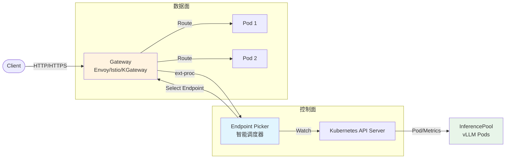

# Inference Gateway (Inference Scheduler) 深度解析

> **一句话总结**：Inference Gateway 就像米其林餐厅的资深领班，根据厨房实时状态（队列、缓存、适配器）智能分配订单，而不是随机安排座位。
> 它是一个 LLM 感知的智能路由引擎，通过多维度评分突破传统负载均衡的性能瓶颈。

---

## 1. 为什么需要智能调度？

### 1.1 问题本质：LLM 推理 vs 传统 Web 服务

传统负载均衡（Round-Robin、Least Connections）基于服务是无状态、耗时均匀且资源消耗可预测的假设。然而，LLM 推理打破了这些假设：

| 维度 | 传统 Web | LLM 推理 | 问题 |
|------|---------|---------|------|
| **请求大小** | 固定（KB 级） | 高度可变（prompt 1K-100K tokens） | 负载不均 |
| **响应时间** | 稳定 | 长尾严重 (100ms-30s) | 短请求被长请求阻塞 |
| **资源消耗** | 均匀 | 与输入/输出长度强相关 | KV Cache 占用波动 |
| **状态影响** | 无状态 | Prefix/KV Cache 命中率差异巨大 | 重复计算浪费 |

### 1.2 中国本土场景：双 11 AI 客服
在流量激增 50 倍的情况下，传统的 Round-Robin 会导致 P99 延迟激增，GPU 利用率虽高但大量时间花在排队。
通过智能调度，可以让紧急订单进入最短队列，让大单路由到有 KV Cache 的节点，从而降低 60% 的 P99 延迟，提升 40% 的有效利用率。

---

## 2. 架构全景：从 Gateway 到 Model Server

Inference Gateway 通过 **Envoy ext-proc** 扩展 Gateway API (Envoy/Istio)，在请求路由前进行智能决策。

### 核心组件
- **InferencePool**: 推理服务的“座位区”，定义了一组提供相同模型的 Pod。
- **EPP (Endpoint Picker)**: 资深领班，负责打分和选址。
- **InferenceObjective**: 请求的“身份标签”，定义优先级和目标 SLA。

---

## 3. 调度算法：Filter-Scorer-Picker 机制

调度器采用三阶段决策流程，确保路由决策的高效与灵活。

### 3.1 阶段 1：Filter (过滤)
排除掉绝对不可用的节点：
- **Queue Depth Filter**: 排除队列已满的 Pod。
- **Memory Pressure Filter**: 排除 KV Cache 利用率过高 (如 >95%) 的 Pod。
- **Model Compatibility**: 确保 Pod 加载了正确的模型或 LoRA 适配器。

### 3.2 阶段 2：Scorer (评分)
对剩余节点进行多维度打分：
- **Prefix-Aware Scorer (权重最高)**: 优先选择已有相同 Prompt 前缀缓存的 Pod，TTFT 可降低 90% 以上。
- **Load-Aware Scorer**: 优先选择负载较轻（队列较短）的 Pod。
- **NoHit LRU Scorer**: 对于新请求，采用 LRU 策略分散负载。

### 3.3 阶段 3：Picker (选择)
为了避免“雷鸣群效应”（所有请求涌向最高分节点），通常采用 **Top-K 随机选择** 策略。在前 K 名（如前 3 名）中随机选一个，兼顾性能与稳定性。

---

## 4. 实测数据 (Qwen3-32B 场景)

| 指标 | K8s Service | Inference Gateway | 提升 |
|------|-------------|-------------------|------|
| **TTFT P50** | 6.2s | **136ms** | 📉 97.8% ↓ |
| **TTFT P95** | 12.5s | **157ms** | 📉 98.7% ↓ |
| **缓存命中率** | 12% | **89%** | 📈 +77% |
| **吞吐量** | 9k tok/s | **11k tok/s** | 📈 +22% |

---

## 5. 生产实践建议

1. **hashBlockSize 调优**: RAG 场景建议设置为 10-20，短对话场景设置为 3-5。
2. **权重配置**: 高 Prefix 复用场景设 `prefix-aware` 权重为 100；低复用场景则主攻 `load-aware`。
3. **P/D 分离**: 在 ModelService 中启用 Prefill/Decode 分离架构，配合 ByLabel Filter 实现极致的成本与性能平衡。
