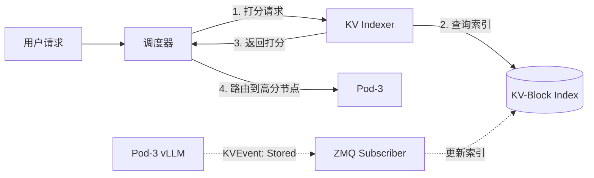

# KV Cache Management & Indexing - 分层缓存与感知调度

> **核心价值**：突破单机推理性能瓶颈。通过 GPU-CPU-FS 三级存储实现 10x+ 并发能力，配合全局索引（Indexer）实现缓存感知调度，将 TTFT 降低 90% 以上。

---

## 1. 为什么它是 LLM 推理的性能命脉？

### 1.1 Transformer 的“记忆瓶颈”
在 LLM 推理中，每生成一个新 Token 都需要与历史所有 Token 进行 Attention 计算。如果不缓存这些历史 Token 的 Key/Value (KV Cache)，计算量将随长度呈**平方级**增长。

**挑战**：KV Cache 的显存消耗巨大。例如，Llama-3.1-70B 的 8k 上下文对话约占 21GB。单张 H100 80GB 只能支撑约 3 个长对话，并发能力极低。

### 1.2 分布式场景下的“缓存盲调度”
在分布式集群中，如果调度器不知道哪个 Pod 拥有特定会话的缓存，随机路由会导致极低的缓存命中率，迫使系统频繁重算，导致响应极慢。

---

## 2. 核心架构：三级存储 + 全局索引

llm-d 采用物理层分层存储与逻辑层全局索引相结合的设计哲学。

### 2.1 物理层：分层存储 (GPU-CPU-FS)
类比超市的“前置仓”模式：

| 存储层 | 工厂类比 | 延迟 | 成本 | 说明 |
|-------|---------|------|------|------|
| **L1: GPU HBM** | 高速产线 | <1μs | 💰💰💰 | 存放当前活跃会话 |
| **L2: CPU DRAM** | 中转仓库 | ~10μs | 💰💰 | 存放温热的历史会话 |
| **L3: 文件系统** | 园区仓库 | ~1ms | 💰 | 跨节点复用，长期归档 |

### 2.2 逻辑层：KV Cache Indexer (库存监控)
Indexer 不存储实际数据，只记录“哪个 Pod 拥有哪些 Block”。它就像超市的**库存监控系统**，让调度器能“看见”缓存位置。



---

## 3. 工作机制

### 3.1 哈希块匹配 (Prefix Caching)
系统将 Prompt 分词并拆分为固定大小的块（Block），对每个块计算 **FNV-64a** 哈希。
- **匹配逻辑**：调度器优先路由到连续命中前缀 block 最多的 Pod。
- **TTFT 优化**：命中前缀缓存后，系统可直接跳过 Prefill 阶段的计算，直接进入生成。

### 3.2 异步卸载与预取
vLLM 通过 `KVConnector` 异步管理 Block 的生命周期。
- **LRU 驱逐**：当 GPU 满载时，最旧的 Block 会移动到 CPU 或磁盘。
- **预取 (Prefetching)**：当识别到用户再次访问历史会话时，提前将 Block 从磁盘加载。

---

## 4. 生产环境配置

### 4.1 开启分层存储
在 ModelService 环境变量中配置：
```yaml
env:
  - name: VLLM_KV_CACHE_OFFLOAD
    value: "cpu,fs"  # 启用两级卸载
  - name: VLLM_KV_OFFLOAD_PATH
    value: "/mnt/shared-storage"  # 共享存储挂载路径
```

### 4.2 配置索引器
Indexer 的哈希种子必须与 vLLM 的 `PYTHONHASHSEED` 保持一致，以确保索引有效。
```json
{
  "tokenProcessorConfig": {
    "blockSize": 64,  // 对应 vLLM --block-size
    "hashSeed": "42"
  }
}
```

---

## 5. 什么时候该开启这些功能？

| 并发规模 | 存储建议 | 索引器建议 |
|---------|---------|-----------|
| < 20 QPS | 仅 GPU | 可选 |
| 20-100 QPS | GPU + CPU | 推荐 |
| > 100 QPS | GPU + CPU + FS | 必需 |
| RAG/长对话 | GPU + FS | 必需 |
