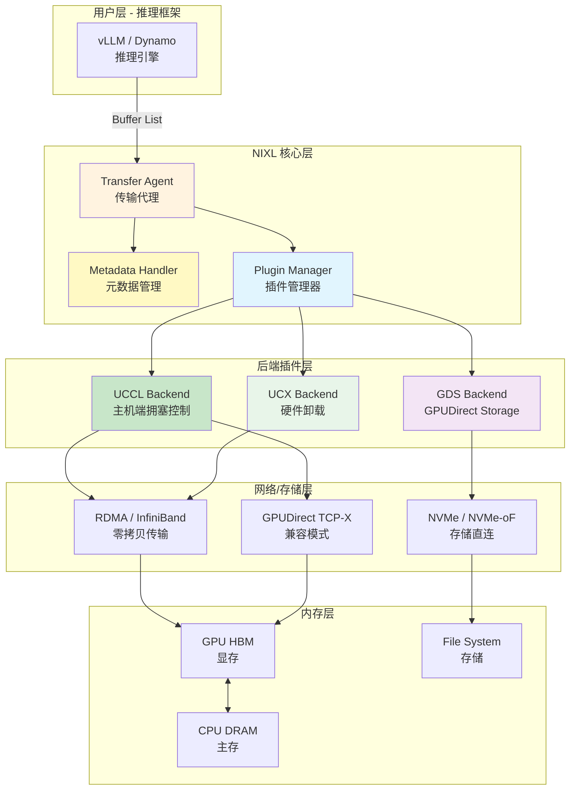
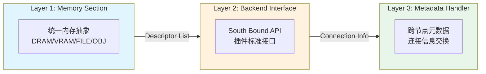
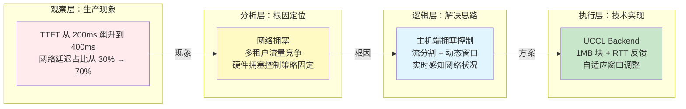
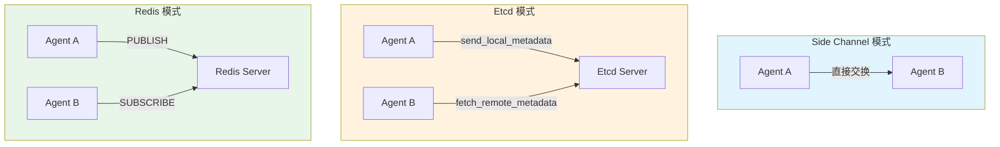
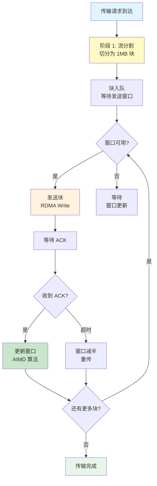
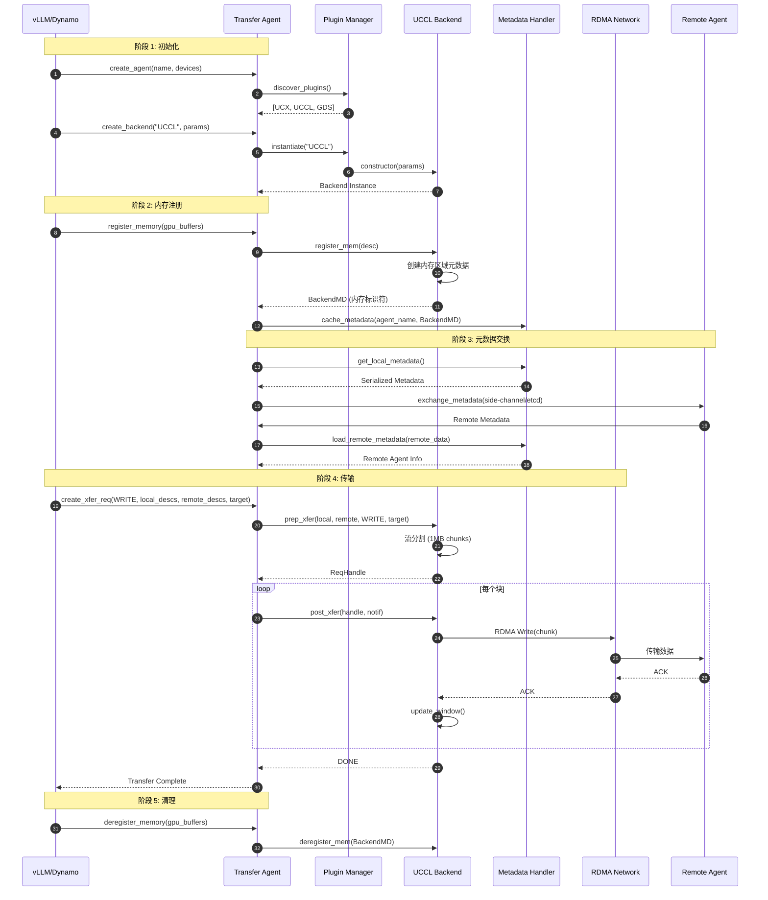
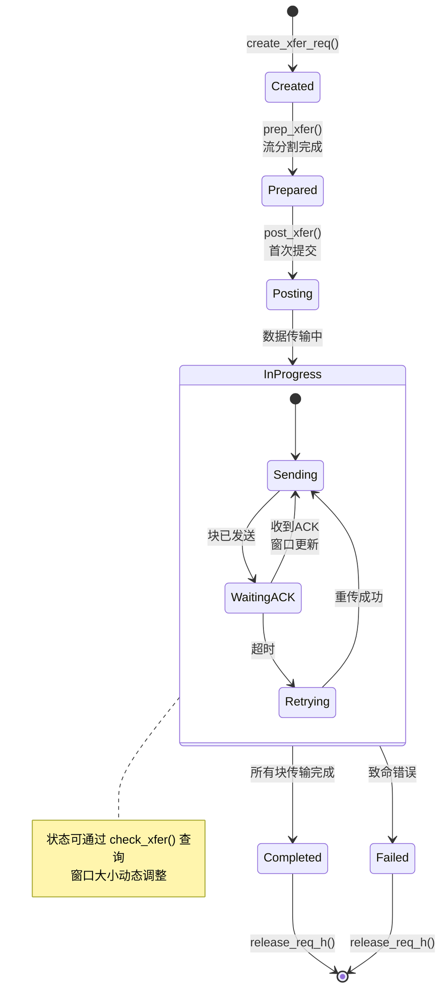
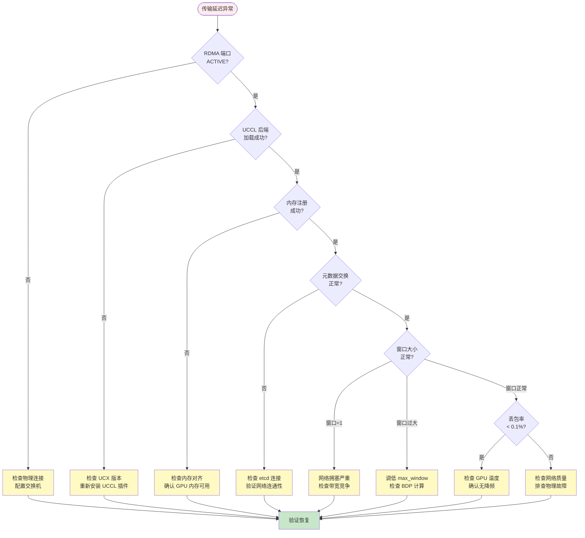
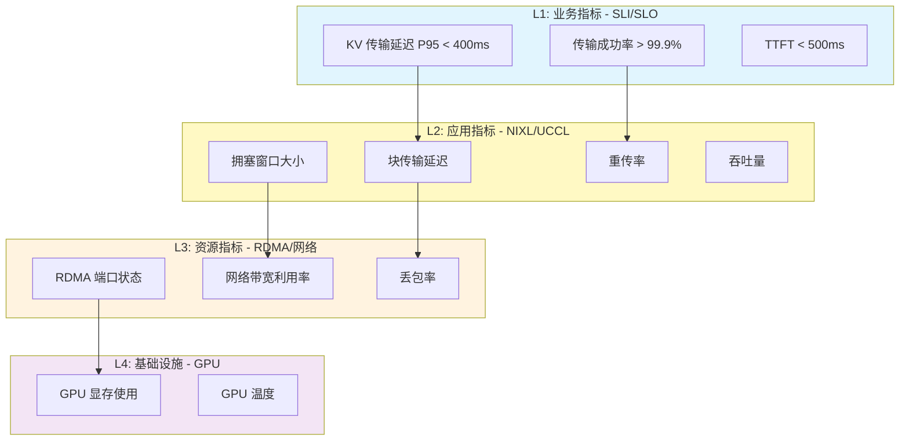

# Resilient Networking (NIXL/UCCL) - 弹性网络层深度解析

> **目标受众**：一线 SRE 工程师 & 基础设施架构师
> **核心价值**：通过主机端拥塞控制，在网络压力下保持 2.4x 弹性优势，保障 P/D 分离架构的 TTFT 稳定性
> **技术范畴**：NIXL + UCCL + RDMA/TCP-X + GPUDirect Storage

---

## 概念层 — 是什么 & 为什么

### 本层目标

建立对分布式 LLM 推理网络传输痛点的认知，理解 NIXL/UCCL 如何通过主机端拥塞控制解决这些问题。

**本层验收标准**：
- 能一句话复述 NIXL/UCCL 的核心价值
- 能列举 P/D 分离架构的三大传输挑战
- 能绘制 NIXL 的三层架构图

---

### 1.1 业务痛点：P/D 分离的传输困境

#### Prefill/Decode 分离的数据传输需求

在 llm-d 的 P/D 分离架构中，Prefill Pod 计算 Prompt 的 KV Cache 后，需要将数 GB 的数据传输到 Decode Pod 进行后续生成。这个传输过程直接决定了 TTFT（首 Token 延迟）。

**典型场景数据量**：

| 模型 | 上下文长度 | KV Cache 大小 | 传输时间 (100 Gbps 理论) |
|------|-----------|---------------|-------------------------|
| Llama-3.1-8B | 10k tokens | ~2.5 GB | 200ms |
| Llama-3.1-70B | 10k tokens | ~25 GB | 2s |
| Llama-3.1-70B | 32k tokens | ~80 GB | 6.4s |

**核心矛盾**：

```
矛盾 1：传输延迟直接影响 TTFT
├── 用户感知：首 Token 等待时间包含网络传输
└── SLO 要求：TTFT < 500ms，传输必须极快

矛盾 2：网络拥塞导致延迟抖动
├── 生产环境：多租户共享网络，流量竞争
├── 传统方案：硬件卸载拥塞控制策略固定
└── 结果：延迟从 360ms 飙升到 424ms (+17.1%)

矛盾 3：异构内存传输复杂
├── 源端：GPU HBM (Prefill Pod)
├── 目标端：GPU HBM (Decode Pod)
├── 中间路径：可能涉及 CPU bounce buffer
└── 协议选择：RDMA vs TCP-X vs NVLink
```

#### 传统方案的局限性

| 方案 | 优势 | 局限性 |
|------|------|--------|
| **UCX (硬件卸载)** | 延迟低，无 CPU 参与 | 拥塞控制策略固定，多流竞争公平性差 |
| **标准 TCP** | 兼容性好 | 延迟高，需 CPU 拷贝 |
| **NCCL** | 集合通信优化 | 主要面向训练，P2P 场景不够灵活 |

**实测数据**（Llama-3.1-8B，4GB KV Cache，200 Gb/s 集群）：

| 指标 | UCX (硬件卸载) | UCCL (主机端控制) |
|------|----------------|-------------------|
| **基线延迟** | 362ms | 359ms |
| **拥塞后延迟** | 424ms (+17.1%) | 384ms (+7.1%) |
| **弹性优势** | 基准 | **2.4x** |

---

### 1.2 NIXL 核心概念定义

#### NIXL (NVIDIA Inference Xfer Library)

**定义**：NIXL 是专为分布式 LLM 推理设计的高性能传输库，通过模块化插件架构抽象异构内存（GPU HBM、CPU DRAM、NVMe、分布式存储）和网络传输协议，为推理框架提供统一的传输接口。

**核心职责**：
- **内存抽象**：统一 GPU/CPU/存储的内存访问接口
- **后端插件**：支持 UCX、GDS、UCCL 等多种传输后端
- **元数据管理**：处理跨节点内存注册和连接信息交换
- **传输调度**：根据内存类型自动选择最优后端

#### UCCL (Unified Collective Communication Library) Backend

**定义**：UCCL 是 NIXL 的传输后端插件，实现了**主机端拥塞控制**，通过 CPU 侧的软件传输栈实现细粒度流分割和自适应拥塞窗口调整。

**核心特性**：
- **主机端传输栈**：拥塞控制在 CPU 而非 NIC 硬件
- **流分割**：大块数据切分为 1MB 块并行传输
- **动态拥塞窗口**：根据 RTT 和 ACK 实时调整
- **多协议支持**：原生 RDMA + GPUDirect TCP-X

#### 核心术语表

| 术语 | 定义 | 示例 |
|------|------|------|
| **Transfer Agent** | NIXL 的核心组件，管理内存注册和传输请求 | 每个 vLLM Pod 一个 Agent |
| **Memory Section** | 注册到 Agent 的内存区域描述 | GPU HBM、CPU DRAM |
| **Backend Plugin** | 实现具体传输逻辑的可插拔模块 | UCX、GDS、UCCL |
| **Descriptor List** | 内存描述符列表，包含地址、长度、设备 ID | `[(addr, len, devID, metadata)]` |
| **RDMA Write** | 远程直接内存访问写入，零拷贝传输 | GPU A → GPU B |
| **TCP-X** | GPUDirect TCP，支持 GPU 直接通过 TCP 传输 | 无 RDMA 场景的备选 |
| **Host-side Congestion Control** | 主机端拥塞控制，CPU 实现传输逻辑 | UCCL 的核心创新 |

---

### 1.3 NIXL 架构全景图



**关键组件职责**：

| 组件 | 角色 | 核心能力 |
|------|------|----------|
| **Transfer Agent** | 传输代理 | 接收 buffer list，管理内存注册，调度后端 |
| **Metadata Handler** | 元数据管理 | 缓存远程 Agent 信息，支持 etcd/Redis 发现 |
| **Plugin Manager** | 插件管理器 | 动态发现、加载、实例化后端插件 |
| **UCCL Backend** | 传输后端 | 主机端拥塞控制，流分割，自适应窗口 |
| **GDS Backend** | 存储后端 | GPU 直连存储，支持 NVMe/文件系统 |

---

### 1.4 NIXL 三层抽象

NIXL 通过三层抽象实现传输逻辑的解耦：



| 抽象层 | 职责 | 用户感知 |
|--------|------|----------|
| **Memory Section** | 统一各种内存类型的描述 | 用户只需提供 buffer list |
| **Backend Interface** | 定义插件的标准 API | NIXL 自动选择最优后端 |
| **Metadata Handler** | 管理跨节点连接信息 | 支持 etcd/Redis/side-channel |

---

### 1.5 NIXL 与传统方案的对比

| 维度 | UCX | NCCL | NIXL/UCCL |
|------|-----|------|-----------|
| **设计目标** | 通用 HPC 通信 | 训练集合通信 | **推理 P2P 传输** |
| **拥塞控制** | NIC 硬件卸载 | 硬件卸载 | **主机端软件** |
| **流分割** | 固定块大小 | 批量传输 | **动态 1MB 块** |
| **内存抽象** | GPU/CPU | GPU | **GPU/CPU/存储** |
| **插件架构** | 单体 | 单体 | **模块化插件** |
| **拥塞弹性** | 基准 | 基准 | **2.4x 优势** |
| **适用场景** | HPC、微服务 | 分布式训练 | **LLM 推理** |

---

### ✅ 概念层验收标准

完成本层后，应能回答：

1. **Why**：P/D 分离架构为什么对网络传输要求极高？（传输延迟直接决定 TTFT，KV Cache 数据量大）
2. **What**：NIXL 是什么？（分布式 LLM 推理的高性能传输库，抽象异构内存和网络）
3. **Where**：NIXL 在架构中的位置？（推理引擎与网络层之间的传输抽象层）
4. **核心创新**：UCCL 的主机端拥塞控制有什么优势？（2.4x 弹性，动态适应网络状况）

**一句话复述核心价值**：
> NIXL/UCCL 是通过主机端拥塞控制和模块化插件架构，为分布式 LLM 推理提供异构内存抽象和高弹性传输能力的网络层组件，在网络拥塞场景下实现 2.4x 的延迟稳定性优势。

---

## 💨 认知过渡：从概念到机制

### 过渡主线

> [!IMPORTANT]
> **目标**：在进入机制层的算法细节前，先建立概念与机制之间的桥梁。

理解了 NIXL/UCCL 的 **What** 和 **Why** 后，核心问题浮现：

```
┌─────────────────────────────────────────────────────────────┐
│                     待解答的核心问题                          │
├─────────────────────────────────────────────────────────────┤
│  问题 1: 为什么硬件卸载的拥塞控制不够用？                      │
│     → 涉及 NIC 固定策略 vs 主机端动态调整                      │
│                                                             │
│  问题 2: UCCL 如何实现流分割和拥塞窗口调整？                   │
│     → 涉及 1MB 块切分、RTT 反馈、窗口增减算法                  │
│                                                             │
│  问题 3: NIXL 如何选择最优后端？                              │
│     → 涉及内存类型匹配、后端能力查询、代价估算                 │
│                                                             │
│  问题 4: 元数据如何在节点间交换？                              │
│     → 涉及 etcd/Redis/side-channel 三种模式                  │
└─────────────────────────────────────────────────────────────┘
```

### 认知过渡桥：从"延迟飙升"到"拥塞控制策略"



### 理解铺垫：为什么硬件卸载不够？

> **为什么不能只看延迟指标？**
> 因为在生产环境中，延迟飙升往往是**网络拥塞**导致的，而硬件卸载的拥塞控制策略是**固定**的——它无法根据 LLM 推理的流量特征（突发、大块、长连接）进行动态调整。

**硬件卸载 vs 主机端控制的本质差异**：

| 维度 | 硬件卸载 (UCX) | 主机端控制 (UCCL) |
|------|----------------|-------------------|
| **拥塞感知** | NIC 硬件队列深度 | **CPU 侧 RTT/ACK 分析** |
| **窗口调整** | 固定算法 (如 DCQCN) | **动态自适应算法** |
| **流分割** | NIC 内部处理 | **CPU 主动切分 1MB 块** |
| **公平性** | 依赖交换机配置 | **主机侧保证** |
| **灵活性** | 受限于硬件固件 | **软件可迭代** |

**类比**：

```
❌ 硬件卸载 (UCX)：
   就像快递公司的固定路线班车
   - 优点：准时、高效（正常情况下）
   - 缺点：遇到拥堵无法绕路，只能排队等待
   - 结果：高峰期延迟不可控

✅ 主机端控制 (UCCL)：
   就像智能调度系统的网约车
   - 优点：实时感知路况，动态调整路线
   - 缺点：需要 CPU 参与调度（轻微开销）
   - 结果：拥塞时仍能保持较好延迟
```

**数据验证**：

```
场景：4GB KV Cache 传输，200 Gb/s 网络，并发流量竞争

UCX (硬件卸载)：
├── 基线延迟：362ms
├── 拥塞后延迟：424ms
└── 延迟增长：+17.1%

UCCL (主机端控制)：
├── 基线延迟：359ms (几乎相同)
├── 拥塞后延迟：384ms
└── 延迟增长：+7.1%

→ 弹性优势：17.1% / 7.1% ≈ 2.4x
```

### 从概念到机制的映射

| 概念层术语 | 机制层实现 | 关键技术点 |
|------------|------------|------------|
| **主机端拥塞控制** | `UCCLTransport` 类 | 流分割 + 拥塞窗口 + RTT 估算 |
| **Memory Section** | `nixl_mem_t` 结构 | DRAM/VRAM/FILE/OBJ 类型枚举 |
| **Backend Plugin** | South Bound API | `registerMem`, `postXfer`, `checkXfer` |
| **Metadata Handler** | `nixl_metadata_t` | 序列化/反序列化 + 缓存管理 |
| **流分割** | 1MB chunk 切分 | 并行传输 + 独立拥塞窗口 |
| **动态窗口** | AIMD 算法 | 加性增 + 乘性减 |

---

## 机制层 — 如何运作

### 本层目标

深入理解 NIXL 的三层抽象架构、UCCL 的主机端拥塞控制算法、元数据交换机制，以及传输请求的完整生命周期。

**本层验收标准**：
- 能画出 NIXL 传输请求的完整时序图
- 能解释 UCCL 流分割和拥塞窗口调整算法
- 能说明 Memory Section 如何注册和注销
- 能理解元数据交换的三种模式

---

### 2.0 逻辑概述

> [!TIP]
> **不要直接甩公式！** 先理解 NIXL/UCCL 的核心逻辑——它就像一个"智能物流调度系统"，货物（KV Cache）从发货仓（Prefill GPU）运到收货仓（Decode GPU），调度中心（Transfer Agent）根据路况（网络拥塞）动态调整运输策略。

**NIXL 的核心逻辑**：

```
1. 注册阶段：告诉调度中心有哪些仓库可用（Memory Section 注册）
2. 发现阶段：获取其他调度中心的联系方式（元数据交换）
3. 传输阶段：发货 → 调度 → 运输 → 确认（创建请求 → 后端传输 → 状态检查）
4. 动态调整：根据路况调整运输节奏（UCCL 拥塞控制）
```

---

### 2.1 NIXL 三层抽象详解

#### Layer 1: Memory Section（内存抽象）

**作用**：统一各种内存类型的描述，让用户只需提供 buffer list。

```python
# 伪代码：Memory Section 的抽象
class MemorySection:
    mem_type: Enum      # DRAM, VRAM, FILE, OBJ
    descriptors: List[Descriptor]
    
class Descriptor:
    addr: int           # 内存地址或偏移
    len: int            # 长度
    dev_id: int         # 设备 ID (GPU ID / fd / key)
    metadata: bytes     # 可选的额外信息
```

**不同内存类型的描述符含义**：

| mem_type | addr | len | dev_id | str (可选) |
|----------|------|-----|--------|------------|
| **DRAM** | 虚拟地址 | 字节数 | 0 或 region ID | - |
| **VRAM** | GPU 显存地址 | 字节数 | GPU ID | - |
| **FILE** | 文件偏移 | 字节数 | fd | 路径 + 访问模式 |
| **OBJ** | 对象偏移 | 字节数 | key | bucket ID |

#### Layer 2: Backend Interface（后端接口）

**作用**：定义插件的标准 API，让 NIXL 可以自动选择最优后端。

**South Bound API 核心方法**：

```python
# 伪代码：Backend Plugin 必须实现的接口
class BackendPlugin:
    # 能力声明
    def supports_local(self) -> bool      # 是否支持节点内传输
    def supports_remote(self) -> bool     # 是否支持跨节点传输
    def supports_notif(self) -> bool      # 是否支持通知
    def get_supported_mems(self) -> List[MemType]
    
    # 连接管理
    def connect(self, remote_agent: str) -> Status
    def disconnect(self, remote_agent: str) -> Status
    def get_conn_info(self) -> bytes      # 获取连接信息（序列化）
    def load_remote_conn_info(self, data: bytes) -> Status
    
    # 内存管理
    def register_mem(self, desc: Descriptor) -> BackendMD
    def deregister_mem(self, md: BackendMD) -> Status
    
    # 元数据管理
    def get_public_data(self, md: BackendMD) -> bytes  # 远程标识符
    def load_remote_md(self, data: bytes) -> RemoteMD
    def load_local_md(self, md: BackendMD) -> RemoteMD
    def unload_md(self, md: RemoteMD) -> Status
    
    # 传输操作
    def prep_xfer(self, local_descs, remote_descs, op, agent) -> ReqHandle
    def post_xfer(self, handle: ReqHandle, notif: bytes) -> Status
    def check_xfer(self, handle: ReqHandle) -> XferStatus
    def release_req_h(self, handle: ReqHandle) -> Status
```

**UCX vs GDS 实现对比**：

| 方法 | UCX Backend | GDS Backend |
|------|-------------|-------------|
| `supports_local()` | True | True |
| `supports_remote()` | True | False |
| `supports_notif()` | True | False |
| `get_supported_mems()` | DRAM, VRAM | VRAM, FILE |
| `connect()` | 建立 RDMA 连接 | 返回 SUCCESS (无需连接) |

#### Layer 3: Metadata Handler（元数据管理）

**作用**：管理跨节点连接信息，支持动态发现和缓存。

**三种元数据交换模式**：



| 模式 | 适用场景 | 优点 | 缺点 |
|------|----------|------|------|
| **Side Channel** | 小集群、固定拓扑 | 无外部依赖 | 不支持动态扩缩容 |
| **Etcd** | Kubernetes 环境 | 原生支持、可靠 | 多一次网络往返 |
| **Redis** | 大规模集群 | 高性能、支持订阅 | 需额外运维 Redis |

---

### 2.2 UCCL 核心算法：流分割与拥塞控制

#### 算法流程图



#### 阶段 1：流分割 (Flow Splitting)

**为什么需要流分割？**

```
问题：4GB KV Cache 作为单一流传输
├── 阻塞后续请求：大流占用全部带宽
├── 拥塞控制失效：无法细粒度调整
└── 公平性差：大流"饿死"小流

解决方案：切分为 1MB 块
├── 并行传输：多块可并发发送
├── 独立拥塞控制：每块独立窗口
└── 公平性保证：小请求也能获得带宽
```

**伪代码**：

```python
def split_into_chunks(data: bytes, chunk_size: int = 1_048_576) -> List[Chunk]:
    """将数据切分为 1MB 的块"""
    chunks = []
    offset = 0
    chunk_id = 0
    
    while offset < len(data):
        chunk_len = min(chunk_size, len(data) - offset)
        chunks.append(Chunk(
            id=chunk_id,
            data=data[offset:offset + chunk_len],
            offset=offset,
            len=chunk_len
        ))
        offset += chunk_len
        chunk_id += 1
    
    return chunks

# 示例：4GB KV Cache → ~4000 个 1MB 块
```

#### 阶段 2：动态拥塞窗口 (Dynamic Congestion Window)

**核心算法：AIMD (Additive Increase Multiplicative Decrease)**

```python
class UCCLCongestionControl:
    def __init__(self):
        self.window = 1           # 初始窗口 = 1 个块
        self.ssthresh = 64        # 慢启动阈值
        self.rtt_samples = []     # RTT 采样
        self.min_rtt = float('inf')
    
    def on_ack_received(self, chunk_id: int, rtt: float):
        """收到 ACK 时的窗口调整"""
        self.rtt_samples.append(rtt)
        self.min_rtt = min(self.min_rtt, rtt)
        
        if self.window < self.ssthresh:
            # 慢启动阶段：指数增长
            self.window *= 2
        else:
            # 拥塞避免阶段：线性增长
            self.window += 1
    
    def on_timeout(self, chunk_id: int):
        """超时时的窗口调整"""
        # 乘性减小
        self.ssthresh = self.window / 2
        self.window = max(1, self.window / 2)
    
    def can_send(self) -> bool:
        """是否可以发送新块"""
        return self.current_in_flight < self.window
```

**与 UCX 硬件卸载的对比**：

| 维度 | UCX (硬件) | UCCL (主机端) |
|------|------------|---------------|
| **窗口大小** | NIC 固定配置 | **动态 AIMD** |
| **RTT 感知** | NIC 内部 | **CPU 侧采样** |
| **拥塞检测** | ECN 标记 | **超时 + RTT 增加** |
| **调整速度** | 毫秒级 | **微秒级** |
| **公平性保证** | 依赖交换机 | **主机侧保证** |

#### 实测效果对比

```
场景：4GB KV Cache 传输，200 Gb/s 网络，并发流量竞争

UCX (硬件卸载 DCQCN)：
├── 基线：362ms
├── 拥塞后：424ms
├── 增长：+62ms (+17.1%)
└── 原因：固定拥塞策略无法适应突发流量

UCCL (主机端 AIMD)：
├── 基线：359ms
├── 拥塞后：384ms
├── 增长：+25ms (+7.1%)
└── 原因：动态窗口及时退让，避免拥塞加剧

弹性优势：62ms / 25ms ≈ 2.48x
```

---

### 2.3 传输请求完整时序



---

### 2.4 传输请求状态机



---

### 2.5 后端选择算法

NIXL 如何自动选择最优后端？

```python
def select_backend(agent: TransferAgent, local_mem: MemType, 
                   remote_mem: MemType, remote_agent: str) -> Backend:
    """选择最优后端"""
    
    # 1. 获取本地和远程共同支持的后端
    local_backends = agent.get_local_backends()
    remote_backends = agent.get_remote_backends(remote_agent)
    common = local_backends ∩ remote_backends
    
    # 2. 过滤支持内存类型的后端
    candidates = []
    for backend in common:
        supported_mems = backend.get_supported_mems()
        if local_mem in supported_mems and remote_mem in supported_mems:
            candidates.append(backend)
    
    # 3. 按性能估算排序
    scored = []
    for backend in candidates:
        # 估算传输时间
        cost = backend.estimate_xfer_cost(local_descs, remote_descs)
        scored.append((backend, cost))
    
    scored.sort(key=lambda x: x[1])
    
    # 4. 选择最优
    return scored[0][0]

# 示例：
# local: VRAM, remote: VRAM → UCCL (RDMA)
# local: VRAM, remote: FILE → GDS (GPUDirect Storage)
# local: DRAM, remote: DRAM → UCX (内存拷贝)
```

**选择优先级**：

| 源 → 目标 | 优先后端 | 备选后端 |
|-----------|----------|----------|
| VRAM → VRAM (远程) | **UCCL** | UCX |
| VRAM → DRAM (远程) | UCCL | UCX |
| DRAM → DRAM (远程) | UCX | UCCL |
| VRAM → FILE (本地) | **GDS** | POSIX |
| FILE → VRAM (本地) | **GDS** | POSIX |

---

### 2.6 边缘情况处理

| 场景 | 行为 | 应对策略 |
|------|------|----------|
| **远程 Agent 宕机** | 传输超时，返回错误 | 元数据失效，触发重连 |
| **网络分区** | 无法连接远程 Agent | 健康检查剔除，告警 |
| **RDMA 不可用** | UCCL 降级到 TCP-X | 性能下降，日志警告 |
| **内存注册失败** | 返回错误码 | 检查内存对齐、权限 |
| **窗口降为 1** | 进入慢启动 | 自动恢复，无需干预 |
| **多流竞争** | 公平调度 | 主机端保证公平性 |

---

### ✅ 机制层验收标准

完成本层后，应能：

1. **画出时序图**：从 create_agent 到传输完成的完整流程
2. **解释流分割**：为什么是 1MB？如何并行传输？
3. **说明 AIMD 算法**：窗口如何增长和减小
4. **理解后端选择**：内存类型如何影响后端选择

**核心流程图**：
> 能画出：注册 → 元数据交换 → 创建请求 → 流分割 → 并行传输 → 完成确认

**衔接问题**：
> 生产环境如何验证 RDMA 配置？如何调优 UCCL 参数？

---

## 实战层 — 如何驾驭

### 本层目标

掌握 NIXL/UCCL 的生产部署验证、性能调优参数、监控指标体系与典型故障排查方法。

**本层验收标准**：
- 能验证 RDMA 设备配置是否正确
- 能配置 UCCL 核心参数并调优
- 能建立传输延迟监控体系
- 能按决策树排查典型故障

---

### 3.1 前置条件检查

#### RDMA 环境验证脚本

```bash
#!/bin/bash
# nixl-rdma-check.sh - NIXL/UCCL RDMA 环境检查脚本

echo "=== NIXL/UCCL RDMA 环境检查 ==="

# 1. 检查 RDMA 设备
echo -e "\n[1/6] RDMA 设备检查..."
if ibv_devices &>/dev/null; then
    echo "✅ RDMA 设备列表:"
    ibv_devices
else
    echo "❌ 未检测到 RDMA 设备"
    echo "   安装: apt install rdma-core ibverbs-utils"
    exit 1
fi

# 2. 检查端口状态
echo -e "\n[2/6] RDMA 端口状态..."
for dev in $(ibv_devices | tail -n +2 | awk '{print $1}'); do
    state=$(ibv_devinfo -d $dev 2>/dev/null | grep state | awk '{print $2}')
    if [ "$state" = "PORT_ACTIVE" ]; then
        echo "✅ $dev: $state"
    else
        echo "❌ $dev: $state (需要 PORT_ACTIVE)"
    fi
done

# 3. 检查带宽
echo -e "\n[3/6] RDMA 带宽测试..."
if command -v ib_write_bw &>/dev/null; then
    echo "提示: 需要在两台主机上分别运行:"
    echo "  服务端: ib_write_bw -d mlx5_0"
    echo "  客户端: ib_write_bw -d mlx5_0 <server_ip>"
else
    echo "⚠️  ib_write_bw 未安装"
    echo "   安装: apt install perftest"
fi

# 4. 检查 GPU RDMA 支持
echo -e "\n[4/6] GPU Direct RDMA 检查..."
if command -v nvidia-smi &>/dev/null; then
    echo "✅ NVIDIA GPU 检测到:"
    nvidia-smi --query-gpu=name,memory.total --format=csv,noheader | head -2
    
    # 检查 GPUDirect 支持
    if [ -f /sys/kernel/mm/memory_peers/nv_mem/version ]; then
        echo "✅ GPUDirect RDMA 内核模块已加载"
    else
        echo "⚠️  GPUDirect RDMA 内核模块未加载"
        echo "   参考: https://docs.nvidia.com/cuda/gpudirect-rdma/"
    fi
else
    echo "❌ 未检测到 NVIDIA GPU"
fi

# 5. 检查 UCX 库
echo -e "\n[5/6] UCX 库检查..."
if ldconfig -p | grep -q libucp.so; then
    echo "✅ UCX 库已安装"
    ucx_info -v 2>/dev/null | head -3
else
    echo "❌ UCX 库未安装"
    echo "   安装: 参考 https://github.com/openucx/ucx"
fi

# 6. 检查 NIXL Python 绑定
echo -e "\n[6/6] NIXL Python 绑定..."
if python3 -c "import nixl; print('✅ NIXL Python 绑定可用')" 2>/dev/null; then
    :
else
    echo "❌ NIXL Python 绑定不可用"
    echo "   安装: pip install nixl[cu12]"
fi

echo -e "\n=== 检查完成 ==="
```

#### 常见环境问题

| 问题 | 诊断命令 | 解决方案 |
|------|---------|---------|
| **RDMA 设备未识别** | `lspci \| grep Mellanox` | 安装 OFED 驱动 |
| **端口状态非 ACTIVE** | `ibv_devinfo -d mlx5_0` | 检查网线/交换机配置 |
| **GPU Direct 不可用** | `nvidia-smi -q \| grep -i gpudirect` | 安装 nvidia_peer_mem 模块 |
| **UCX 版本过低** | `ucx_info -v` | 升级到 v1.20+ |
| **MTU 不匹配** | `ip link show ib0` | 设置 MTU=4096 或 65536 |

---

### 3.2 核心配置参数

#### NIXL Agent 配置

```python
# nixl_config.py - NIXL Agent 初始化配置

import nixl

# 创建 Agent
agent = nixl.nixl_agent(
    name="llm-d-prefill-0",
    
    # 可选：设备列表（GPU 设备索引）
    # devices=[0, 1],  # 使用 GPU 0 和 1
    
    # 进度线程配置
    progress_thread=True,          # 启用进度线程
    progress_interval_us=100,      # 进度检查间隔（微秒）
)

# 创建 UCCL 后端
uccl_backend = agent.create_backend(
    backend_type="UCCL",
    params={
        # 传输配置
        "transport": "rdma",           # rdma 或 tcp_x
        "chunk_size": 1048576,         # 流分割块大小 (1MB)
        
        # 拥塞控制配置
        "init_window": 1,              # 初始拥塞窗口
        "max_window": 64,              # 最大拥塞窗口
        "ssthresh": 32,                # 慢启动阈值
        
        # 超时配置
        "ack_timeout_ms": 100,         # ACK 超时时间
        "retry_count": 3,              # 重试次数
        
        # 内存配置
        "max_registered_mem_gb": 80,   # 最大注册内存 (GB)
        
        # 调试配置
        "log_level": "info",           # debug, info, warn, error
    }
)
```

#### UCCL 参数调优指南

| 参数 | 默认值 | 调优建议 | 影响范围 |
|------|--------|----------|----------|
| `chunk_size` | 1MB | 大文件传输可增大到 4MB | 内存占用、并行度 |
| `init_window` | 1 | 高带宽网络可设为 4 | 慢启动速度 |
| `max_window` | 64 | 根据 BDP 调整 | 最大吞吐 |
| `ssthresh` | 32 | 与 max_window 关联 | 拥塞避免时机 |
| `ack_timeout_ms` | 100 | 高延迟网络增大 | 重传时机 |

**计算带宽时延积 (BDP)**：

```python
# BDP = 带宽 × RTT
# 示例：100 Gbps 网络，RTT = 10μs
bandwidth_gbps = 100
rtt_us = 10

bdp_bits = bandwidth_gbps * 1e9 * (rtt_us * 1e-6)
bdp_bytes = bdp_bits / 8

print(f"BDP: {bdp_bytes / 1024 / 1024:.2f} MB")
# BDP: 0.12 MB

# 建议 max_window = BDP / chunk_size
max_window = int(bdp_bytes / (1024 * 1024)) + 10
print(f"建议 max_window: {max_window}")
```

---

### 3.3 生产部署示例

#### vLLM 集成配置

```yaml
# vllm-pd-disaggregation.yaml - P/D 分离架构的 NIXL 配置

apiVersion: apps/v1
kind: Deployment
metadata:
  name: vllm-prefill
  namespace: llm-d
spec:
  replicas: 4
  selector:
    matchLabels:
      app: vllm-prefill
  template:
    metadata:
      labels:
        app: vllm-prefill
        llm-d.io/component: prefill
    spec:
      containers:
      - name: vllm
        image: vllm/vllm-openai:latest
        args:
        - --model
        - meta-llama/Llama-3.1-70B
        - --tensor-parallel-size
        - "2"
        - --enable-prefix-caching
        env:
        # NIXL 配置
        - name: NIXL_BACKEND
          value: "UCCL"
        - name: NIXL_TRANSPORT
          value: "rdma"
        - name: NIXL_CHUNK_SIZE
          value: "1048576"
        - name: NIXL_MAX_WINDOW
          value: "64"
        - name: NIXL_LOG_LEVEL
          value: "info"
        # 元数据服务
        - name: NIXL_ETCD_ENDPOINTS
          value: "http://etcd.llm-d.svc:2379"
        - name: NIXL_ETCD_NAMESPACE
          value: "/nixl/agents"
        resources:
          limits:
            nvidia.com/gpu: "2"
            rdma/ib: "1"  # RDMA 资源请求
---
apiVersion: apps/v1
kind: Deployment
metadata:
  name: vllm-decode
  namespace: llm-d
spec:
  replicas: 8
  selector:
    matchLabels:
      app: vllm-decode
  template:
    metadata:
      labels:
        app: vllm-decode
        llm-d.io/component: decode
    spec:
      containers:
      - name: vllm
        image: vllm/vllm-openai:latest
        args:
        - --model
        - meta-llama/Llama-3.1-70B
        - --tensor-parallel-size
        - "4"
        env:
        - name: NIXL_BACKEND
          value: "UCCL"
        - name: NIXL_TRANSPORT
          value: "rdma"
        # ... 同上
        resources:
          limits:
            nvidia.com/gpu: "4"
            rdma/ib: "1"
```

---

### 3.4 故障排查决策树



#### 常见问题 Quick Fix

| 症状 | 根本原因 | 诊断命令 | 解决方案 |
|------|---------|---------|---------|
| **传输超时** | RDMA 未启用 | `ibv_devinfo` | 检查 NIC 驱动和端口状态 |
| **延迟抖动大** | 网络拥塞 | `ibstat` + `perfquery` | 启用 UCCL 主机端控制 |
| **吞吐低** | 窗口过小 | 检查 NIXL 日志 | 调高 `max_window` |
| **内存注册失败** | 内存对齐问题 | `nvidia-smi -q` | 确保显存连续、对齐 |
| **GPU OOM** | 注册内存过多 | 监控 GPU 显存 | 限制 `max_registered_mem_gb` |
| **连接被拒绝** | 元数据过期 | `etcdctl get` | 清理缓存、重新注册 |

---

### 3.5 SRE 可观测性

#### 四层监控金字塔



#### SLI（服务水平指标）定义

| SLI | 指标来源 | PromQL 查询 | SLO 目标 | 告警阈值 |
|-----|---------|-------------|----------|----------|
| **KV 传输延迟 P95** | NIXL | `histogram_quantile(0.95, nixl_xfer_duration_seconds_bucket)` | < 400ms | > 600ms |
| **传输成功率** | NIXL | `rate(nixl_xfer_success_total[5m]) / rate(nixl_xfer_total[5m])` | > 99.9% | < 99.5% |
| **重传率** | UCCL | `rate(uccl_retransmit_total[5m]) / rate(uccl_send_total[5m])` | < 1% | > 5% |
| **拥塞窗口** | UCCL | `uccl_congestion_window` | > 10 | < 5 |
| **RDMA 端口状态** | IB | `ib_port_state` | 4 (ACTIVE) | ≠ 4 |

#### Prometheus 告警规则

```yaml
# nixl-uccl-alerts.yaml
apiVersion: monitoring.coreos.com/v1
kind: PrometheusRule
metadata:
  name: nixl-uccl-alerts
  namespace: monitoring
spec:
  groups:
  - name: nixl-uccl
    interval: 30s
    rules:
    
    # 告警 1：KV 传输延迟超标
    - alert: NIXLHighTransferLatency
      expr: |
        histogram_quantile(0.95, 
          rate(nixl_xfer_duration_seconds_bucket[5m])
        ) > 0.6
      for: 5m
      labels:
        severity: warning
        team: sre
      annotations:
        summary: "{{ $labels.agent }} KV 传输延迟 P95 超过 600ms"
        description: "当前值: {{ $value }}s"
    
    # 告警 2：传输失败率过高
    - alert: NIXLHighFailureRate
      expr: |
        rate(nixl_xfer_failed_total[5m]) / 
        rate(nixl_xfer_total[5m]) > 0.005
      for: 3m
      labels:
        severity: critical
        team: sre
      annotations:
        summary: "{{ $labels.agent }} 传输失败率超过 0.5%"
    
    # 告警 3：拥塞窗口过小
    - alert: UCCLLowCongestionWindow
      expr: |
        uccl_congestion_window < 5
      for: 5m
      labels:
        severity: warning
        team: sre
      annotations:
        summary: "{{ $labels.agent }} 拥塞窗口低于 5，可能存在网络拥塞"
    
    # 告警 4：重传率过高
    - alert: UCCLHighRetransmitRate
      expr: |
        rate(uccl_retransmit_total[5m]) / 
        rate(uccl_send_total[5m]) > 0.05
      for: 5m
      labels:
        severity: warning
        team: sre
      annotations:
        summary: "{{ $labels.agent }} 重传率超过 5%"
    
    # 告警 5：RDMA 端口异常
    - alert: RDMAPortDown
      expr: |
        ib_port_state != 4
      for: 1m
      labels:
        severity: critical
        team: sre
      annotations:
        summary: "{{ $labels.device }} RDMA 端口状态异常"
```

#### Grafana Dashboard 示例

```json
{
  "title": "NIXL/UCCL 传输监控",
  "panels": [
    {
      "title": "KV 传输延迟分布",
      "type": "heatmap",
      "targets": [
        {
          "expr": "rate(nixl_xfer_duration_seconds_bucket[5m])",
          "legendFormat": "{{ le }}"
        }
      ]
    },
    {
      "title": "拥塞窗口趋势",
      "type": "graph",
      "targets": [
        {
          "expr": "uccl_congestion_window",
          "legendFormat": "{{ agent }}"
        }
      ]
    },
    {
      "title": "吞吐量",
      "type": "stat",
      "targets": [
        {
          "expr": "sum(rate(nixl_xfer_bytes_total[1m]))",
          "legendFormat": "总吞吐"
        }
      ]
    }
  ]
}
```

---

### 3.6 反模式与避坑指南

#### ❌ 反模式清单

| 反模式 | 错误配置 | 危害 | 正确做法 |
|--------|---------|------|---------|
| **忽略 RDMA 状态** | 未验证端口 ACTIVE | 传输失败 | 部署前运行检查脚本 |
| **窗口配置过大** | `max_window=256` | 加剧拥塞 | 根据 BDP 计算 |
| **无监控部署** | 无 NIXL 指标 | 无法发现瓶颈 | 配置 Prometheus 采集 |
| **使用 TCP 而非 RDMA** | `transport=tcp_x` | 延迟高 3-5x | 必须使用 RDMA |
| **固定窗口大小** | 不启用 UCCL | 拥塞时抖动大 | 启用 UCCL 动态调整 |
| **元数据服务单点** | 单 etcd 实例 | 服务不可用 | etcd 集群部署 |

#### 生产环境 Checklist

```markdown
## NIXL/UCCL 生产部署检查清单

### 前置条件
- [ ] RDMA 设备就绪 (ibv_devices 显示设备)
- [ ] 端口状态为 PORT_ACTIVE
- [ ] GPU Direct RDMA 已启用
- [ ] UCX 版本 >= 1.20
- [ ] NIXL Python 绑定可导入

### 网络配置
- [ ] 带宽测试达标 (ib_write_bw)
- [ ] MTU 配置正确 (4096 或 65536)
- [ ] 交换机拥塞控制已配置 (ECN/DCQCN)
- [ ] 防火墙允许 RDMA 流量

### NIXL 配置
- [ ] chunk_size 根据场景调整 (1-4MB)
- [ ] max_window 根据 BDP 计算
- [ ] 元数据服务 (etcd) 高可用部署
- [ ] 日志级别设置为 info 或 warn

### 监控告警
- [ ] Prometheus 采集 NIXL 指标
- [ ] 配置传输延迟告警
- [ ] 配置拥塞窗口告警
- [ ] 配置 RDMA 端口状态告警
- [ ] Grafana Dashboard 就绪

### 高可用保障
- [ ] etcd 集群 (3+ 节点)
- [ ] Agent 故障自动恢复测试
- [ ] 网络分区应对预案
```

---

### ✅ 实战层验收标准

完成本层后，应能：

1. **环境验证**：运行检查脚本确认 RDMA 配置正确
2. **参数调优**：根据 BDP 计算 max_window 等参数
3. **故障排查**：使用决策树诊断传输延迟问题
4. **监控配置**：编写 Prometheus 告警规则，部署 Grafana 面板

**排障能力验证**：
> 能独立排障：当 NIXL 传输延迟告警触发时，执行决策树中的排查步骤，定位是 RDMA 配置问题、网络拥塞问题还是参数配置问题。

---

## 元知识总结

### 大规模瓶颈与调优

| 规模 | 瓶颈点 | 优化方向 |
|------|--------|----------|
| **< 10 节点** | 无显著瓶颈 | 标准配置 |
| **10-50 节点** | 元数据服务压力 | etcd 集群化，增加缓存 |
| **50-100 节点** | 内存注册开销 | 预注册，减少动态注册 |
| **> 100 节点** | 网络拥塞 | 调整 chunk_size，启用 UCCL |

### 核心设计哲学

**NIXL/UCCL 的本质是"软件定义的传输抽象"**，其设计体现以下核心思想：

1. **抽象优于绑定**：统一内存类型接口，后端插件化，而非为每种场景写专用代码
2. **主机端优于硬件**：拥塞控制软件化，灵活迭代，而非依赖固定硬件策略
3. **动态优于静态**：自适应窗口调整，而非固定参数配置
4. **可观测优于黑盒**：暴露拥塞窗口、重传率等指标，便于 SRE 诊断

### 关键决策框架

```
┌─────────────────────────────────────────────────────────────┐
│              NIXL/UCCL 决策框架                             │
├─────────────────────────────────────────────────────────────┤
│  传输需求 → 内存类型匹配 → 后端选择 → 参数调优           │
│                                                             │
│  内存类型匹配：                                              │
│    - VRAM ↔ VRAM (远程) → UCCL (RDMA)                       │
│    - VRAM ↔ FILE (本地) → GDS                               │
│    - DRAM ↔ DRAM (远程) → UCX                               │
│                                                             │
│  参数调优：                                                  │
│    - chunk_size = 1-4MB (根据 KV Cache 大小)               │
│    - max_window = BDP / chunk_size + buffer                │
│    - init_window = 1 (慢启动)                              │
│    - ssthresh = max_window / 2                             │
└─────────────────────────────────────────────────────────────┘
```

### 典型反直觉陷阱

| 直觉 | 现实 | 原因 |
|------|------|------|
| "硬件卸载更快" | 拥塞时主机端控制更稳 | 固定策略无法适应突发流量 |
| "窗口越大越好" | 过大会加剧拥塞 | 应根据 BDP 计算 |
| "RDMA 一定比 TCP 快" | 配置不当时可能更差 | 需要正确配置 MTU、GPUDirect |
| "延迟只看网络" | 内存注册也有开销 | GPU 内存动态注册成本高 |
| "吞吐等于带宽" | 拥塞窗口限制吞吐 | 实际吞吐 = 窗口 × 块大小 / RTT |

### 何时选择 NIXL/UCCL？

**适合场景**：
- P/D 分离架构的 KV Cache 传输
- 大规模分布式 LLM 推理集群
- 多租户共享网络环境
- 需要稳定 TTFT 的生产服务

**不适合场景**：
- 单节点推理（无需跨节点传输）
- CPU 密集型工作负载（无 GPU）
- 无 RDMA 网络（性能优势不明显）
- 极低延迟要求（< 1ms，RDMA 原生更优）

### 上游依赖组件

| 组件 | 作用 | 版本要求 |
|------|------|---------|
| **UCX** | UCCL 的底层传输库 | >= 1.20 |
| **RDMA 驱动** | 提供底层 RDMA 能力 | OFED 5.x+ |
| **CUDA** | GPU 内存访问 | >= 12.0 |
| **GPUDirect** | GPU 直接网络访问 | 可选但推荐 |

### 下游扩展组件

| 组件 | 作用 | 文档链接 |
|------|------|---------|
| **vLLM** | 推理引擎集成 | [vLLM KV Connector](https://blog.vllm.ai/2026/01/08/kv-offloading-connector.html) |
| **llm-d-modelservice** | 推理服务编排 | [ModelService](./modelservice.md) |
| **LMCache** | KV Cache 管理 | [LMCache](./lmcache/index.md) |

### 一句话 Takeaway

> NIXL/UCCL 通过主机端拥塞控制和模块化插件架构，将 LLM 推理的跨节点 KV Cache 传输延迟抖动降低 2.4x，是实现生产级 P/D 分离架构的关键网络组件。

---

## 📚 延伸阅读

### 官方文档

1. [NIXL GitHub 仓库](https://github.com/ai-dynamo/nixl) - 源码和文档
2. [NIXL Python API](https://github.com/ai-dynamo/nixl/blob/main/docs/python_api.md) - Python 绑定使用指南
3. [NIXL Backend Guide](https://github.com/ai-dynamo/nixl/blob/main/docs/BackendGuide.md) - 后端插件开发指南
4. [llm-d v0.5 Blog](https://llm-d.ai/blog/llm-d-v0.5-sustaining-performance-at-scale) - UCCL 集成公告

### 相关技术

- [GPUDirect Storage](https://docs.nvidia.com/gpudirect-storage/) - GPU 直连存储
- [GPUDirect RDMA](https://developer.nvidia.com/gpudirect) - GPU 直接网络访问
- [UCX](https://github.com/openucx/ucx) - 通用通信框架
- [RDMA over Converged Ethernet (RoCE)](https://docs.nvidia.com/networking/display/ofedv502180/rdma+over+converged+ethernet+(roce)) - 以太网 RDMA

### 进阶主题

- **多路径传输**：利用多 NIC 实现带宽聚合
- **动态拓扑感知**：根据网络拓扑优化路由
- **跨集群传输**：多数据中心场景的传输优化
- **安全传输**：RDMA over TLS/加密

### 相关组件文档

- [P/D Disaggregation](./pd-disaggregation.md) - Prefill/Decode 分离架构
- [KV Cache Management](./kv-cache.md) - KV Cache 分层管理
- [ModelService](./modelservice.md) - 推理服务编排

---

*文档版本：v2.0 | 最后更新：2025年2月 | 遵循 [sre-tech-sharing](https://github.com/opencode/sre-tech-sharing) 规范编写*
