# llm-d 分布式推理平台深度解析：Kubernetes 原生的大模型推理控制平面

> **目标受众**：一线工程师 & 架构师  
> **核心价值**：通过智能调度、分层缓存、P/D 分离实现 LLM 推理的 SOTA 性能与生产级运维能力统一  
> **技术范畴**：vLLM + Kubernetes Gateway API + Envoy + Prometheus + NIXL/UCCL

---

## 概念层 — 是什么 & 为什么

### 本层目标

建立对 LLM 推理生产化痛点的认知，理解 llm-d 如何通过 Kubernetes 原生架构解决这些问题。

**本层验收标准**：
- 能一句话复述 llm-d 的核心价值
- 能列举 LLM 推理相比传统服务的三大差异
- 能绘制 llm-d 的架构全景图

---

### 1.1 业务痛点：LLM 推理的生产困境

#### 传统微服务的负载均衡假设

传统微服务架构基于以下假设：
- ✅ 请求处理时间相对均匀（10-100ms）
- ✅ 资源消耗可预测
- ✅ 无状态，实例间完全对等

**但 LLM 推理打破了所有假设：**

| 维度 | 传统服务 | LLM 推理 | 影响 |
|------|---------|---------|------|
| **请求耗时** | 10-100ms | 100ms-30s | 取决于输入/输出长度 |
| **内存需求** | 固定 | 动态增长 | KV Cache 与上下文长度线性相关 |
| **计算模式** | CPU 密集型 | Prefill 计算密集 + Decode 内存带宽密集 | 资源利用率低 |
| **状态管理** | 无状态 | 有状态 | KV Cache 复用可减少 90% 计算 |

#### 核心矛盾分析

```
矛盾 1：内存墙
├── 单张 H100 80GB HBM 只能服务 ~20 个并发长对话 (Llama-70B)
└── KV Cache 占用导致并发上限低

矛盾 2：延迟抖动
├── Round-robin 将长短请求均匀分配
├── 短请求被长请求阻塞队列
└── P99 延迟飙升，用户体验差

矛盾 3：资源浪费
├── Prefill 吃满算力时 Decode 在等待
├── Decode 吃满带宽时 Prefill 在空转
└── 资源利用率 < 50%

矛盾 4：状态复用难
├── Kubernetes Service 无状态假设
├── 无法感知 KV Cache 本地性
└── 重复计算浪费算力
```

#### 量化影响

| 场景 | 传统部署 | 问题 |
|------|---------|------|
| **高并发短请求** | Round-robin 分配到长请求队列 | TTFT 从 100ms → 6s |
| **多轮对话** | 每次请求新 Pod，无缓存复用 | 重复计算，成本翻倍 |
| **长上下文** | 单 Pod 处理，内存不足 | OOM Kill，服务中断 |
| **混合负载** | 无法区分 Prefill/Decode | 资源利用率 < 40% |

---

### 1.2 llm-d 核心概念定义

#### llm-d (Large Language Model Distributed Inference Platform)

**定义**：llm-d 是 Kubernetes 原生的分布式 LLM 推理控制平面，通过智能调度、分层缓存、P/D 分离三大核心能力，将 vLLM（业界最快推理引擎）与 Kubernetes（云原生编排标准）深度整合，实现生产级性能与运维能力的统一。

**核心职责**：
- **智能调度**：根据请求特征、Pod 负载、缓存命中率智能路由
- **分层缓存**：突破单机内存限制，实现 GPU/CPU/文件系统三级存储
- **P/D 分离**：Prefill 计算密集与 Decode 带宽密集阶段解耦
- **弹性伸缩**：基于饱和度感知自动扩缩容

#### 核心术语表

| 术语 | 定义 | 示例 |
|------|------|------|
| **TTFT** | Time To First Token，首 Token 延迟 | < 200ms 为良好 |
| **TPOT** | Time Per Output Token，输出 Token 间隔 | < 50ms 为良好 |
| **KV Cache** | 键值缓存，存储注意力机制的中间结果 | 占显存 70%+ |
| **Prefill** | 预处理阶段，计算 Prompt 的 KV Cache | 计算密集 |
| **Decode** | 生成阶段，逐 Token 自回归生成 | 内存带宽密集 |
| **Prefix Cache** | 前缀缓存，复用相同 Prompt 开头的 KV Cache | 命中率 50%+ |
| **P/D Disaggregation** | Prefill/Decode 分离部署 | 提升资源利用率 |

---

### 1.3 llm-d 架构全景图

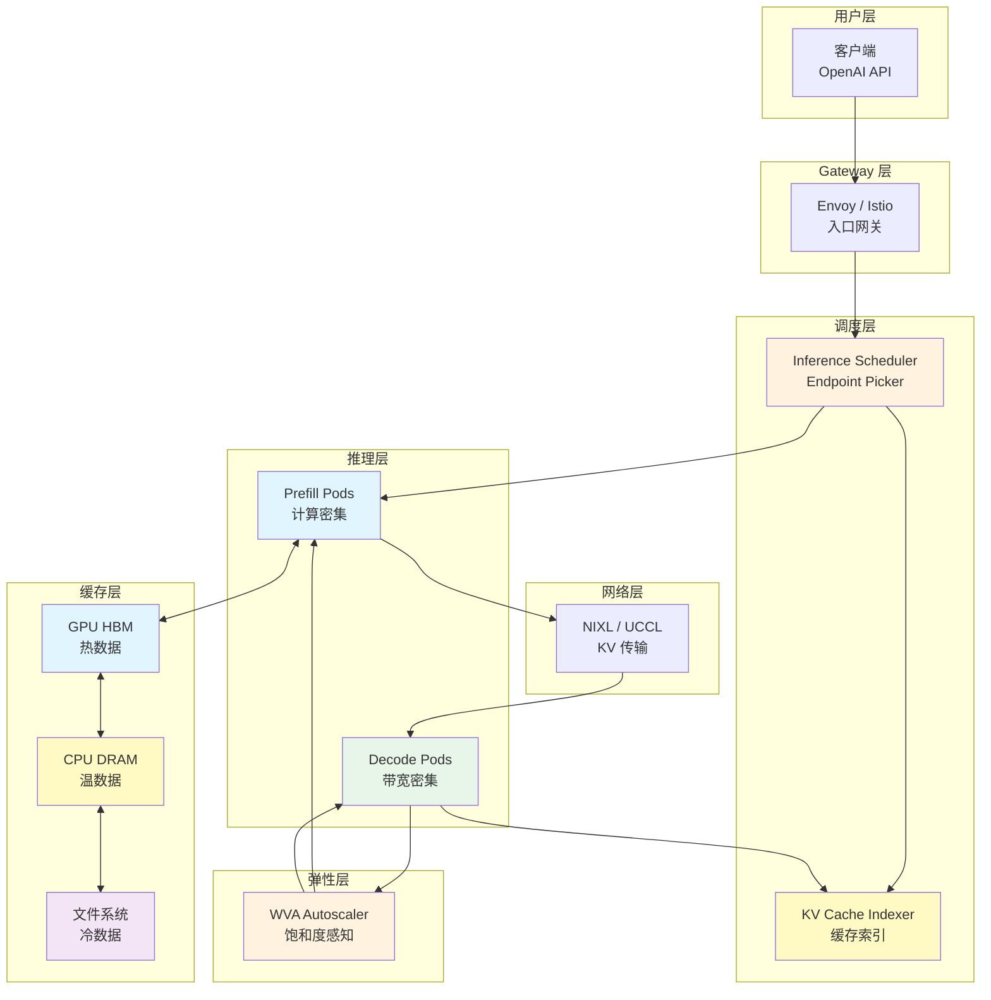

**数据流向**：

```
用户请求 → Gateway → Inference Scheduler → Prefill Pod → NIXL → Decode Pod → 响应
                ↓              ↓                    ↓              ↓
          路由决策      缓存索引查询      KV Cache 传输      流式返回
```

**关键组件职责**：

| 组件 | 角色 | 核心能力 |
|------|------|----------|
| **Gateway (Envoy)** | 入口网关 | 接收推理请求，集成 Inference Scheduler |
| **Inference Scheduler** | 智能调度器 | Filter → Score → Select 三阶段调度 |
| **KV Cache Indexer** | 缓存索引 | 全局视图，记录 Block → Pod 映射 |
| **Prefill Pods** | 预处理实例 | 计算 Prompt 的 KV Cache |
| **Decode Pods** | 生成实例 | 逐 Token 生成响应 |
| **NIXL/UCCL** | 网络传输 | 零拷贝 KV Cache 传输 |
| **WVA Autoscaler** | 弹性伸缩 | 饱和度感知自动扩缩容 |

---

### 1.4 llm-d 核心能力三角

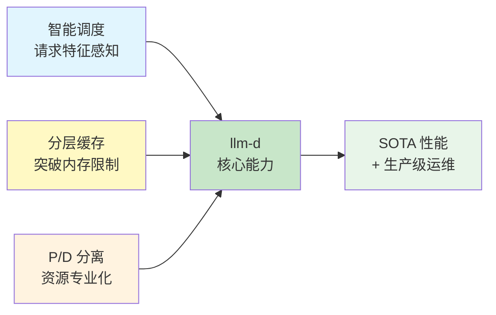

#### 能力 1：智能调度

**问题**：传统 Round-robin 无法感知请求特征

```
Round-robin 负载均衡：
├── 请求 A (短) → Pod 1 (队列: [长, 长, 长]) ❌ 排队等待
├── 请求 B (长) → Pod 2 (队列: [短, 短])     ❌ 阻塞后续
└── 请求 C (有缓存) → Pod 3 (缓存命中率 0%) ❌ 重复计算

llm-d 智能调度：
├── 请求 A (短) → Pod 2 (队列: [短, 短])     ✅ 快速响应
├── 请求 B (长) → Pod 1 (队列: [长, 长])     ✅ 批处理优化
└── 请求 C (有缓存) → Pod 3 (命中率 90%)     ✅ 零等待
```

**收益**：TTFT 降低 **99%** (6s → 60ms)，吞吐提升 **109%**

#### 能力 2：分层缓存

**问题**：GPU HBM 是稀缺资源，KV Cache 占用导致并发上限低

**llm-d 方案**：三级存储层次

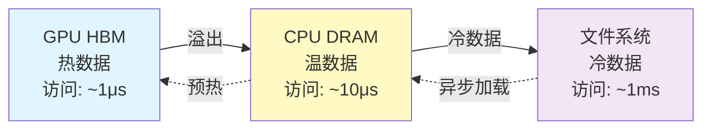

**实测效果** (Llama-3.1-70B)：
- 纯 GPU：50 并发时性能崩溃
- GPU+CPU+FS：**250 并发仍保持 185k tok/s** (13.9x 提升)

#### 能力 3：P/D 分离

**问题**：Prefill 计算密集，Decode 内存带宽密集，同 Pod 处理效率低

**llm-d 方案**：阶段解耦 + 专业化部署

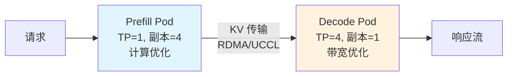

| 阶段 | 计算特性 | 最优配置 |
|------|---------|---------|
| **Prefill** | 大矩阵运算，计算密集 | 少 TP，多副本 |
| **Decode** | 逐 Token 生成，带宽密集 | 高 TP，少副本 |

---

### 1.5 llm-d 与传统方案的对比

| 维度 | 标准 vLLM | llm-d |
|------|----------|-------|
| **负载均衡** | Round-robin | 智能调度（请求特征感知） |
| **缓存管理** | 单机 GPU | 三级分层（GPU/CPU/FS） |
| **部署模式** | 统一 Pod | P/D 分离（专业化） |
| **弹性伸缩** | HPA (CPU) | WVA (饱和度感知) |
| **TTFT (高并发)** | 6s+ | 60ms |
| **最大并发** | ~50 | ~250 |
| **成本** | 100% | ~50% |

---

### ✅ 概念层验收标准

完成本层后，应能回答：

1. **Why**：LLM 推理为什么比传统服务更难？（请求耗时不均、内存动态增长、计算模式分阶段、状态依赖）
2. **What**：llm-d 是什么？（Kubernetes 原生的分布式 LLM 推理控制平面）
3. **Where**：llm-d 在架构中的位置？（Gateway → Scheduler → Prefill → NIXL → Decode）
4. **核心能力**：三大核心能力是什么？（智能调度、分层缓存、P/D 分离）

**一句话复述核心价值**：
> llm-d 是通过智能调度、分层缓存和 P/D 分离三大核心能力，将 vLLM 与 Kubernetes 深度整合，实现 LLM 推理 SOTA 性能与生产级运维能力统一的分布式推理控制平面。

---

## 💨 认知过渡：从概念到机制

### 过渡主线

> [!IMPORTANT]
> **目标**：在进入机制层的算法细节前，先建立概念与机制之间的桥梁。

理解了 llm-d 的 **What** 和 **Why** 后，核心问题浮现：

```
┌─────────────────────────────────────────────────────────────┐
│                     待解答的核心问题                          │
├─────────────────────────────────────────────────────────────┤
│  问题 1: Inference Scheduler 如何实现智能路由？               │
│     → 涉及 Filter → Score → Select 三阶段调度                 │
│                                                             │
│  问题 2: KV Cache 如何在三级存储间迁移？                      │
│     → 涉及溢出、归档、异步加载、预热机制                      │
│                                                             │
│  问题 3: Prefill 和 Decode 如何高效传输 KV Cache？           │
│     → 涉及 NIXL/UCCL 零拷贝传输和拥塞控制                     │
│                                                             │
│  问题 4: 如何根据饱和度决策扩缩容？                           │
│     → 涉及 KV 利用率、队列深度、吞吐下降综合评估              │
└─────────────────────────────────────────────────────────────┘
```

### 认知过渡桥

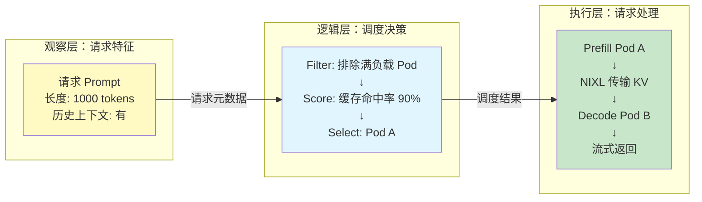

**理解铺垫**：

> **为什么 Kubernetes Service 不够用？**
> 因为 Service 的默认行为基于无状态假设：
> - 无法感知请求特征（Token 长度、缓存命中率）
> - 无法感知后端状态（队列深度、KV 利用率）
> - 无法动态优化（固定 Round-robin 算法）
>
> llm-d 的解决方案是在 Gateway 层插入 **Inference Scheduler (EPP)**，实现请求特征感知和智能路由。

---

## 机制层 — 如何运作

### 本层目标

深入理解 llm-d 的底层工作机制，包括调度算法、缓存管理、P/D 传输、弹性伸缩的核心技术细节。

**本层验收标准**：
- 能画出从请求到响应的完整时序图
- 能解释 Filter → Score → Select 三阶段调度
- 能说明 KV Cache 三级存储的迁移时机
- 能理解 NIXL/UCCL 传输的优势

---

### 2.0 逻辑概述

> [!TIP]
> **不要直接甩公式！** 先理解 llm-d 的核心逻辑——它就像是一个"智能工厂的生产调度系统"，订单（请求）进入后，调度中心根据订单特性、车间负载、库存状态，智能分配到最合适的产线。

llm-d 的核心逻辑可以概括为五步：
1. **接收**：Gateway 接收推理请求
2. **调度**：Inference Scheduler 根据请求特征和 Pod 状态智能路由
3. **Prefill**：计算 Prompt 的 KV Cache
4. **传输**：NIXL/UCCL 零拷贝传输 KV Cache 到 Decode Pod
5. **Decode**：逐 Token 生成响应并流式返回

---

### 2.1 核心数据流：从请求到响应

#### 完整时序图

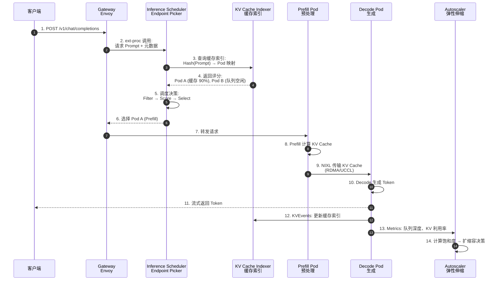

#### 关键节点解析

| 步骤 | 组件 | 动作 | 技术点 |
|------|------|------|--------|
| 3-4 | KV Cache Indexer | 缓存感知路由 | 全局视图，Hash Block 匹配 |
| 5 | Inference Scheduler | 三阶段调度 | Filter → Score → Select |
| 9 | NIXL/UCCL | 零拷贝 KV 传输 | RDMA Write，主机端拥塞控制 |
| 12 | KVEvents | 实时更新索引 | ZeroMQ 事件流 |
| 13-14 | WVA | 闭环反馈 | 饱和度感知扩缩容 |

---

### 2.2 调度算法：Filter → Score → Select

#### 算法流程图

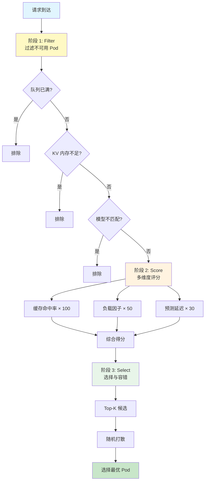

#### 阶段 1：Filter（过滤不可用节点）

```python
# 伪代码
def filter_pods(pods, request):
    available = []
    for pod in pods:
        if pod.queue_length > MAX_QUEUE:
            continue  # 队列已满
        if pod.kv_memory_used > 0.95:
            continue  # KV Cache 内存不足
        if pod.model_id != request.model_id:
            continue  # 模型不匹配
        available.append(pod)
    return available
```

**常见过滤器**：
- **Queue Depth Filter**：`queue_length < threshold`
- **Memory Pressure Filter**：`kv_utilization < 95%`
- **Model Compatibility Filter**：模型 ID/LoRA Adapter 匹配

#### 阶段 2：Score（多维度评分）

```python
# 伪代码
def score_pod(pod, request):
    score = 0
    
    # Scorer 1: Prefix Cache Hit (权重 100)
    cache_hit_rate = calculate_cache_hit(pod, request.prompt)
    score += cache_hit_rate * 100
    
    # Scorer 2: Load Balancing (权重 50)
    load_factor = 1 - (pod.queue_length / MAX_QUEUE)
    score += load_factor * 50
    
    # Scorer 3: Predicted Latency (实验性, 权重 30)
    predicted_ttft = estimate_ttft(pod, request)
    score += (1 / predicted_ttft) * 30
    
    return score
```

**核心 Scorer 详解**：

| Scorer | 计算方式 | 适用场景 | 权重 |
|--------|---------|---------|------|
| **Prefix-aware** | Hash Block 匹配率 | 高 Prefix 复用 (RAG/多轮对话) | 100 |
| **Load-aware** | 队列深度倒数 | 低 Prefix 复用 (批处理) | 50 |
| **Predicted Latency** | TTFT/TPOT 预测模型 | 严格 SLO 场景 | 30 |
| **LoRA-aware** | Adapter 本地化 | 多租户 LoRA 服务 | 可变 |

#### 阶段 3：Select（选择与容错）

```python
# 伪代码
def select_pod(scored_pods):
    # 按得分排序
    sorted_pods = sort_by_score(scored_pods, descending=True)
    
    # Top-K 选择 (提升鲁棒性)
    candidates = sorted_pods[:3]
    
    # 随机打散 (避免雪崩)
    selected = random.choice(candidates)
    
    return selected
```

**容错策略**：
- **Top-K 选择**：不总是选第一名，避免单点过载
- **Fallback**：所有 Pod 不可用时降级到 Round-robin

---

### 2.3 KV Cache 分层管理

#### 层次架构

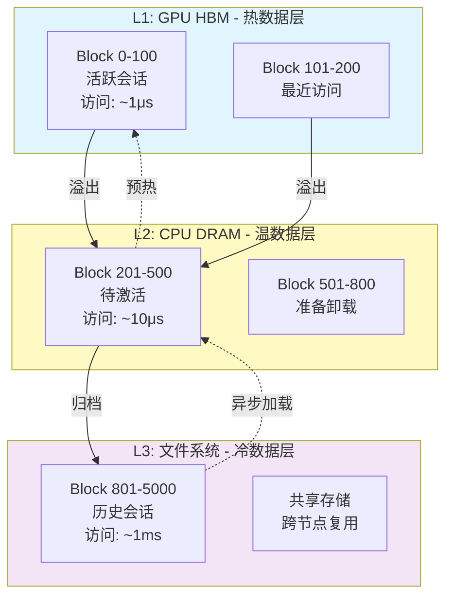

#### 核心机制

**1. vLLM KVConnector 抽象层**

```python
class KVConnector:
    def put(self, block_id: int, data: Tensor):
        """卸载 KV Block 到下一层"""
        pass
    
    def get(self, block_id: int) -> Tensor:
        """从下层加载 KV Block"""
        pass
    
    def delete(self, block_id: int):
        """删除不再需要的 Block"""
        pass
```

**2. 异步 I/O 流水线**

```
┌─────────────────────────────────────┐
│ vLLM Engine (推理主循环)             │
│  ├─ 生成 Token (不阻塞)              │
│  └─ 触发卸载 (异步队列)              │
└──────────┬──────────────────────────┘
           │
           ▼
┌─────────────────────────────────────┐
│ Offload Worker 线程池                │
│  ├─ 从 GPU 拷贝到 CPU (CUDA Stream)  │
│  ├─ 压缩/序列化 (可选)                │
│  └─ 写入文件系统 (并行 I/O)          │
└─────────────────────────────────────┘
```

**3. 驱逐策略 (LRU)**

```python
# 当 GPU HBM 不足时
if gpu_memory_used > threshold:
    # 选择最久未访问的 Block
    victim_block = lru_cache.pop_least_recent()
    # 异步卸载到 CPU
    offload_to_cpu(victim_block)
```

---

### 2.4 P/D 分离的网络传输

#### 传输路径

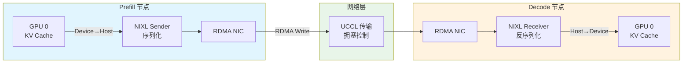

#### UCCL 主机端拥塞控制

**为什么需要主机端拥塞控制？**

传统 RDMA 依赖 NIC 硬件处理拥塞：
- ✅ 延迟低（无 CPU 参与）
- ❌ 拥塞控制策略固定，无法适应 LLM 流量特征
- ❌ 多流竞争时公平性差

**UCCL 的主机端方案**：

```python
# 伪代码
class UCCLTransport:
    def send_kv_blocks(self, blocks, dest):
        # 流分割 (避免大块阻塞)
        chunks = split_into_chunks(blocks, chunk_size=1MB)
        
        for chunk in chunks:
            # 动态拥塞窗口
            while self.congestion_window_full():
                time.sleep(microseconds=10)
            
            # 发送数据
            rdma_write(chunk, dest)
            
            # 根据 ACK 调整窗口
            self.adjust_window()
```

**实测效果** (4GB KV 传输)：
- 基线 UCX：362ms → 拥塞后 424ms (+17.1%)
- llm-d UCCL：359ms → 拥塞后 384ms (+7.1%)
- **弹性优势**：2.4x 更强的抗拥塞能力

---

### 2.5 Autoscaler 饱和度感知算法

#### 核心指标

```python
# 饱和度计算
saturation = (
    kv_memory_utilization * 0.5 +   # KV Cache 占用
    queue_depth_ratio * 0.3 +        # 队列深度
    throughput_degradation * 0.2     # 吞吐下降比例
)

if saturation > 0.8:
    scale_up()
elif saturation < 0.3:
    scale_down()
```

#### 与 HPA 集成

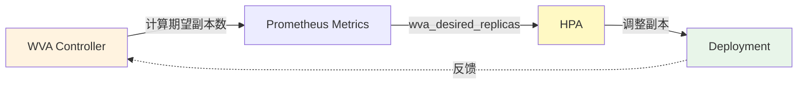

---

### 2.6 边缘情况处理

| 场景 | 行为 | 应对策略 |
|------|------|----------|
| **所有 Pod 队列满** | 返回 503 + Retry-After | 触发扩容或限流 |
| **KV Cache 传输失败** | 回退到同 Pod P/D | 监控告警 |
| **缓存索引不一致** | 使用负载均衡模式 | 自动重建索引 |
| **网络分区** | 隔离受影响 Pod | 健康检查剔除 |
| **Decode Pod OOM** | 拒绝新请求 | 扩容或增加显存预留 |

---

### ✅ 机制层验收标准

完成本层后，应能：

1. **画出时序图**：从请求到响应的 14 个关键步骤
2. **解释三阶段调度**：Filter（排除）→ Score（评分）→ Select（选择）
3. **说明缓存迁移**：GPU HBM → CPU DRAM → 文件系统的触发条件
4. **理解 UCCL 优势**：主机端拥塞控制 vs 硬件卸载

**核心流程图**：
> 能画出：请求 → Gateway → Scheduler → Prefill → NIXL → Decode → 响应 的完整链路。

**衔接问题**：
> 生产环境如何选择部署路径？如何配置核心参数？

---

## 实战层 — 如何驾驭

### 本层目标

掌握 llm-d 的三条 Well-Lit Paths 选型、核心配置参数、监控指标体系与典型故障排查方法。

**本层验收标准**：
- 能根据工作负载选择合适的部署路径
- 能配置核心参数并调优
- 能建立四层监控体系
- 能按决策树排查典型故障

---

### 3.1 极致权衡：三条 Well-Lit Paths

#### 路径对比

| 维度 | Inference Scheduling | P/D Disaggregation | Wide-EP |
|------|---------------------|-------------------|---------|
| **核心优化** | 智能调度 + 缓存复用 | 计算/内存解耦 | 批处理吞吐 |
| **适用模型** | 7B-70B | 70B-175B | MoE (DeepSeek/Mixtral) |
| **工作负载** | 多轮对话、RAG、Agent | 长上下文 (10k+ input) | 批处理、离线推理 |
| **Prefix 复用** | **高** (>50%) | 中 (20-50%) | 低 (<20%) |
| **网络要求** | 数据中心网络 | **RDMA/IB** (必需) | **RDMA + NVLink** |
| **成本** | 💰 (最低) | 💰💰 | 💰💰💰 (最高) |
| **延迟** | **TTFT 最优** (50-150ms) | TTFT 中等 (300-500ms) | TTFT 高 (>1s) |
| **吞吐** | 中 (10-15k tok/s) | 中 (20-40k tok/s) | **最高** (50k+ tok/s) |

#### 决策树

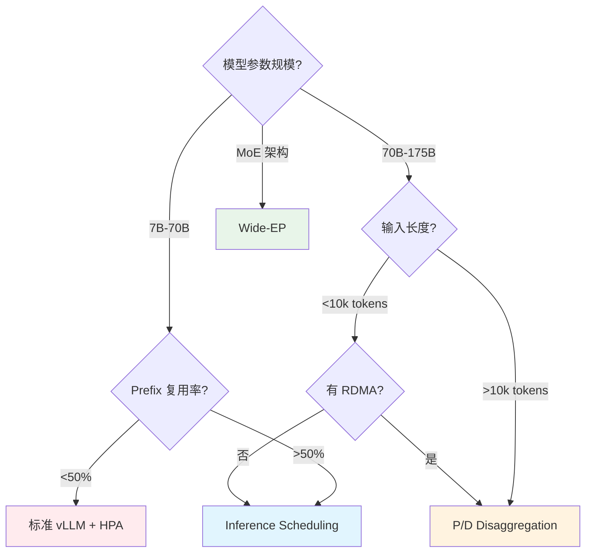

---

### 3.2 反模式与避坑指南

#### ❌ 反模式清单

| 反模式 | 错误配置 | 危害 | 正确做法 |
|--------|---------|------|---------|
| **忽略 Prefix 复用** | 所有场景用 Round-robin | 缓存命中率 < 10% | 高复用场景用 prefix-aware |
| **无 RDMA 用 P/D** | 生产环境 TCP-X | TTFT 超标 5x+ | 必须有 RDMA/IB |
| **GPU 利用率 100%** | `gpu_memory_utilization: 0.95` | OOM Kill | 预留 10-15% |
| **忽视网络带宽** | 10Gbps 网卡跑 P/D | 传输阻塞 | 100Gbps+ RDMA |
| **无监控部署** | 无饱和度指标 | 无法发现瓶颈 | 配置 TTFT/KV 告警 |
| **静态副本数** | 固定 10 副本 | 低谷浪费 | 启用 WVA 自动扩缩容 |

---

### 3.3 从零搭建：生产级 llm-d 部署

#### 前置条件检查

```bash
#!/bin/bash
# llm-d-prereq-check.sh - llm-d 前置条件检查脚本

echo "=== llm-d 前置条件检查 ==="

# 1. Kubernetes 版本要求 (>= 1.25)
echo -e "\n[1/5] Kubernetes 版本检查..."
SERVER_VERSION=$(kubectl version --json 2>/dev/null | jq -r '.serverVersion.gitVersion' | sed 's/v//')
REQUIRED_VERSION="1.25.0"
if [[ "$(printf '%s\n' "$REQUIRED_VERSION" "$SERVER_VERSION" | sort -V | head -n1)" = "$REQUIRED_VERSION" ]]; then
    echo "✅ Server Version: $SERVER_VERSION (满足 >= 1.25 要求)"
else
    echo "❌ Server Version: $SERVER_VERSION (需要 >= 1.25)"
    exit 1
fi

# 2. GPU Operator 检查
echo -e "\n[2/5] GPU Operator 检查..."
if kubectl get pods -n gpu-operator | grep nvidia-device-plugin &>/dev/null; then
    echo "✅ GPU Operator 已安装"
else
    echo "❌ GPU Operator 未安装"
    echo "安装: https://docs.nvidia.com/datacenter/cloud-native/gpu-operator/latest/getting-started.html"
fi

# 3. RDMA 设备检查 (P/D 分离必需)
echo -e "\n[3/5] RDMA 设备检查..."
if kubectl get nodes -o yaml | grep "rdma/" &>/dev/null; then
    echo "✅ RDMA 设备已注册"
    kubectl get nodes -o jsonpath='{.items[*].status.capacity}' | grep rdma
else
    echo "⚠️  RDMA 设备未找到 (仅 P/D 分离需要)"
fi

# 4. Prometheus 检查
echo -e "\n[4/5] Prometheus 检查..."
if kubectl get svc prometheus -n monitoring &>/dev/null; then
    echo "✅ Prometheus 已安装"
else
    echo "❌ Prometheus 未安装"
fi

# 5. Gateway API 检查
echo -e "\n[5/5] Gateway API 检查..."
if kubectl get crd gateways.gateway.networking.k8s.io &>/dev/null; then
    echo "✅ Gateway API CRD 已安装"
else
    echo "❌ Gateway API CRD 未安装"
    echo "安装: kubectl apply -f https://github.com/kubernetes-sigs/gateway-api/releases/download/v1.0.0/standard-install.yaml"
fi
```

#### 步骤 1：安装 llm-d

```bash
# 添加 Helm 仓库
helm repo add llm-d https://llm-d.github.io/charts
helm repo update

# 安装 llm-d (Inference Scheduling 模式)
helm install llm-d llm-d/llm-d \
  --namespace llm-d-system \
  --create-namespace \
  --set inferenceScheduler.enabled=true \
  --set kvCacheIndexer.enabled=true \
  --set prometheus.url=http://prometheus.monitoring.svc:9090

# 验证安装
kubectl wait --for=condition=ready pod \
  -l app.kubernetes.io/name=llm-d \
  -n llm-d-system \
  --timeout=300s
```

#### 步骤 2：部署 vLLM (Inference Scheduling 模式)

```yaml
# vllm-deployment.yaml
apiVersion: apps/v1
kind: Deployment
metadata:
  name: llama-70b
  namespace: production
spec:
  replicas: 8
  selector:
    matchLabels:
      app: llama-70b
  template:
    metadata:
      labels:
        app: llama-70b
        model: meta/llama-3.1-70b
    spec:
      containers:
      - name: vllm
        image: vllm/vllm-openai:latest
        args:
        - --model
        - meta-llama/Llama-3.1-70B
        - --tensor-parallel-size
        - "2"
        - --gpu-memory-utilization
        - "0.90"
        - --enable-prefix-caching
        - --max-num-seqs
        - "256"
        ports:
        - containerPort: 8000
        resources:
          limits:
            nvidia.com/gpu: "2"
        env:
        - name: VLLM_RPC_TIMEOUT
          value: "60000"
---
apiVersion: v1
kind: Service
metadata:
  name: llama-70b
  namespace: production
  labels:
    llm-d.io/enabled: "true"
spec:
  selector:
    app: llama-70b
  ports:
  - port: 8000
    targetPort: 8000
```

#### 步骤 3：配置 Inference Scheduler

```yaml
# inference-scheduler.yaml
apiVersion: llm-d.io/v1alpha1
kind: InferenceScheduler
metadata:
  name: llama-70b-scheduler
  namespace: production
spec:
  modelID: meta/llama-3.1-70b
  serviceSelector:
    matchLabels:
      app: llama-70b
  scorers:
    - type: prefix-aware
      weight: 100
      parameters:
        hashBlockSize: 5
    - type: load-aware
      weight: 50
  filters:
    - type: queue-depth
      maxQueueDepth: 100
    - type: kv-memory
      maxUtilization: 0.95
```

#### 步骤 4：配置 Gateway

```yaml
# gateway.yaml
apiVersion: gateway.networking.k8s.io/v1
kind: Gateway
metadata:
  name: llm-d-gateway
  namespace: production
spec:
  gatewayClassName: istio
  listeners:
  - name: http
    protocol: HTTP
    port: 80
    allowedRoutes:
      namespaces:
        from: Same
---
apiVersion: gateway.networking.k8s.io/v1
kind: HTTPRoute
metadata:
  name: llama-70b-route
  namespace: production
spec:
  parentRefs:
  - name: llm-d-gateway
  rules:
  - matches:
    - path:
        type: PathPrefix
        value: /v1/chat/completions
    backendRefs:
    - name: llama-70b
      port: 8000
    filters:
    - type: ExtensionRef
      extensionRef:
        group: llm-d.io
        kind: InferenceScheduler
        name: llama-70b-scheduler
```

**生产配置建议表**：

| 参数 | 推荐值 | 场景说明 |
|------|--------|----------|
| `gpu_memory_utilization` | 0.85-0.90 | 预留 10-15% 给 KV Cache |
| `hashBlockSize` | 5-10 | Prefix 越长设置越大 |
| `max_num_seqs` | 256-512 | 根据显存调整 |
| `scorer.weight` | prefix: 100, load: 50 | 高 Prefix 复用场景 |
| `replicas` | 4-8 | 根据 QPS 和 TTFT 要求 |

---

### 3.4 验证与测试

#### 查看 Inference Scheduler 状态

```bash
# 基础状态
kubectl get inferencescheduler -n production

# 详细状态
kubectl describe inferencescheduler llama-70b-scheduler -n production

# 查看缓存索引
kubectl exec -it deployment/llm-d-inference-scheduler -n llm-d-system -- \
  curl localhost:8080/metrics | grep cache_hit

# 实时观察调度决策
kubectl logs -n llm-d-system deployment/llm-d-inference-scheduler -f | grep "routing decision"
```

#### 性能测试

```bash
# 使用 llm-d 提供的测试工具
kubectl run perf-test --rm -it --image=llm-d/perf-test -- \
  --endpoint http://llm-d-gateway/v1/chat/completions \
  --model meta/llama-3.1-70b \
  --concurrency 50 \
  --duration 60s \
  --prompts prompts.json

# 关键指标观察
# - TTFT P95
# - 吞吐量 (tok/s)
# - 缓存命中率
# - GPU 利用率
```

---

### 3.5 故障排查决策树

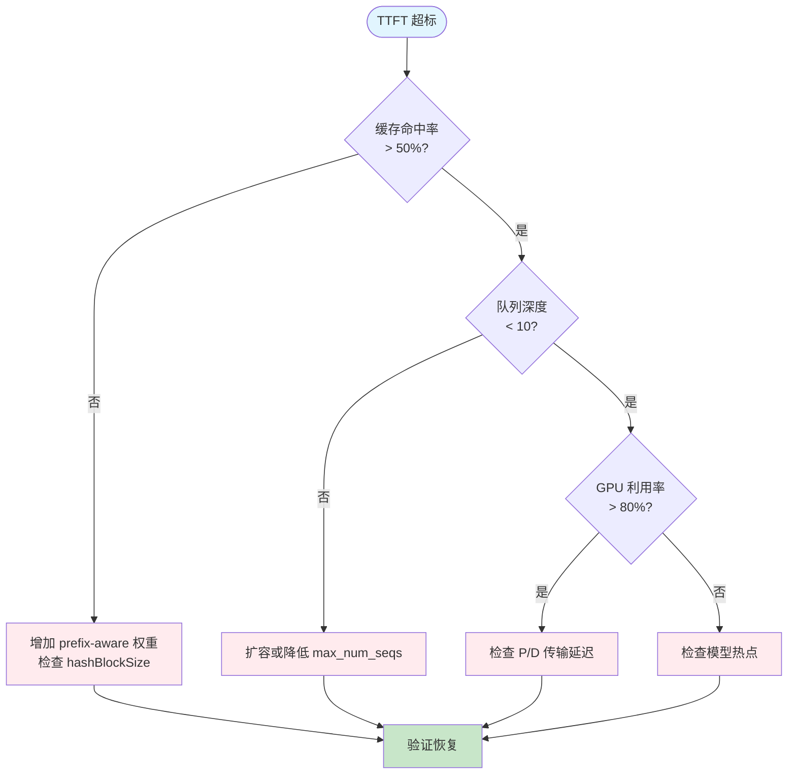

#### 常见问题 Quick Fix

| 症状 | 根本原因 | 诊断命令 | 解决方案 |
|------|---------|---------|---------|
| TTFT 高 | 缓存命中率低 | `grep cache_hit metrics` | 增加 prefix-aware 权重 |
| 队列堆积 | 并发过高 | `vllm_queue_depth` | 扩容或限流 |
| OOM Kill | GPU 内存不足 | `nvidia-smi` | 降低 gpu_memory_utilization |
| P/D 传输慢 | 网络瓶颈 | `ibstat` | 检查 RDMA 配置 |
| 调度不均 | Pod 状态不一致 | `kubectl get pods -o wide` | 重启异常 Pod |
| 缓存未命中 | 索引不一致 | `kubectl logs kv-cache-indexer` | 重建索引 |

---

### 3.6 SRE 可观测性

#### 四层监控金字塔

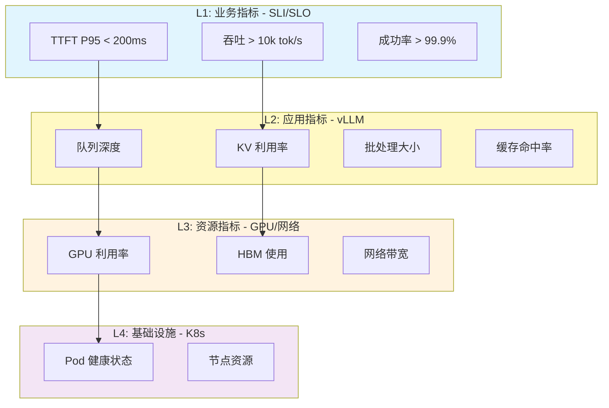

#### SLI（服务水平指标）定义

| SLI | 指标来源 | PromQL 查询 | SLO 目标 | 告警阈值 |
|-----|---------|-------------|----------|----------|
| **TTFT P95** | vLLM | `histogram_quantile(0.95, vllm_time_to_first_token_seconds_bucket)` | < 200ms | > 500ms |
| **吞吐** | vLLM | `rate(vllm_generation_tokens_total[5m])` | > 10k tok/s | < 5k tok/s |
| **缓存命中率** | vLLM | `rate(vllm_cache_hit_total[5m]) / rate(vllm_cache_lookup_total[5m])` | > 50% | < 30% |
| **KV 利用率** | vLLM | `vllm_kv_cache_utilization` | < 80% | > 95% |
| **队列深度** | vLLM | `vllm_queue_depth` | < 10 | > 50 |

#### Prometheus 告警规则

```yaml
# llm-d-alerts.yaml
apiVersion: monitoring.coreos.com/v1
kind: PrometheusRule
metadata:
  name: llm-d-alerts
  namespace: monitoring
spec:
  groups:
  - name: llm-d
    interval: 30s
    rules:
    
    # 告警 1：TTFT 超标
    - alert: LLMDHighTTFT
      expr: |
        histogram_quantile(0.95, 
          rate(vllm_time_to_first_token_seconds_bucket[5m])
        ) > 0.5
      for: 5m
      labels:
        severity: warning
        team: sre
      annotations:
        summary: "{{ $labels.model }} TTFT P95 超过 500ms"
        description: "当前值: {{ $value }}s"
    
    # 告警 2：KV Cache 压力
    - alert: LLMDKVMemoryPressure
      expr: |
        vllm_kv_cache_utilization > 0.95
      for: 3m
      labels:
        severity: critical
        team: sre
      annotations:
        summary: "{{ $labels.model }} KV Cache 使用率超 95%"
    
    # 告警 3：队列堆积
    - alert: LLMDQueueBacklog
      expr: |
        vllm_queue_depth > 50
      for: 5m
      labels:
        severity: warning
        team: sre
      annotations:
        summary: "{{ $labels.model }} 请求队列堆积超 50"
    
    # 告警 4：缓存命中率低
    - alert: LLMDLowCacheHit
      expr: |
        rate(vllm_cache_hit_total[5m]) / 
        rate(vllm_cache_lookup_total[5m]) < 0.3
      for: 10m
      labels:
        severity: warning
        team: sre
      annotations:
        summary: "{{ $labels.model }} 缓存命中率低于 30%"
```

---

### 3.7 生产环境 Checklist

```markdown
## llm-d 生产部署检查清单

### 前置条件
- [ ] Kubernetes 版本 >= 1.25
- [ ] GPU Operator 已安装且运行正常
- [ ] RDMA 设备就绪（P/D 分离必需）
- [ ] Prometheus 已安装且可访问
- [ ] Gateway API CRD 已安装

### vLLM 配置
- [ ] gpu_memory_utilization 设置为 0.85-0.90
- [ ] 启用了 prefix-caching
- [ ] max_num_seqs 根据显存调整
- [ ] 暴露 /metrics 端点

### Inference Scheduler 配置
- [ ] 配置了 prefix-aware scorer（高复用场景）
- [ ] 配置了 queue-depth filter
- [ ] hashBlockSize 根据 Prefix 长度调整

### Gateway 配置
- [ ] GatewayClass 已创建
- [ ] HTTPRoute 指向正确的 Service
- [ ] ExtensionRef 关联 InferenceScheduler

### 监控告警
- [ ] 配置了 TTFT P95 告警
- [ ] 配置了 KV Cache 利用率告警
- [ ] 配置了队列深度告警
- [ ] 配置了缓存命中率告警
- [ ] Grafana 面板可查看所有关键指标

### 高可用保障
- [ ] vLLM Pod 多副本部署
- [ ] Inference Scheduler 多副本部署
- [ ] 配置了 HPA 或 WVA 自动扩缩容
- [ ] 测试过 Pod 故障自动恢复
```

---

### ✅ 实战层验收标准

完成本层后，应能：

1. **路径选型**：根据工作负载特征选择合适的 Well-Lit Path
2. **独立部署**：从零搭建包含 llm-d + vLLM + Gateway 的完整环境
3. **故障排查**：使用决策树诊断 TTFT 升高、吞吐下降、OOM 等问题
4. **监控配置**：编写 Prometheus 告警规则，部署 Grafana 面板
5. **参数调优**：根据性能测试调整 gpu_memory_utilization、hashBlockSize 等参数

**排障能力验证**：
> 能独立排障：当 llm-d 告警触发时，执行决策树中的排查步骤。

---

### 🔗 下一步指引

- **想了解架构组件?**
    - [Inference Gateway (智能调度)](./components/inference-gateway.md)
    - [KV Cache Management (分层缓存)](./components/kv-cache.md)
    - [ModelService (服务编排)](./components/modelservice.md)
    - [LMCache (缓存加速)](./components/lmcache/index.md)
- **想深入 Controller 实现？** → 阅读 [控制器协调循环](./components/controller-reconciliation.md)
- **理解 Prefill/Decode 机制？** → 阅读 [Prefill/Decode 分离架构](./components/prefill-decode-arch.md)

## 🧠 元知识总结

### 大规模瓶颈与调优

| 规模 | 瓶颈点 | 优化方向 |
|------|--------|----------|
| **< 10 Pod** | 无显著瓶颈 | 标准配置 |
| **10-50 Pod** | 调度器性能 | 增加 Scheduler 副本 |
| **50-100 Pod** | 缓存索引压力 | 分片或增加 Indexer 副本 |
| **> 100 Pod** | 网络带宽 | 优化拓扑或使用多集群 |

### 核心洞察

**一句话 Takeaway**：
> llm-d 是通过智能调度、分层缓存和 P/D 分离三大核心能力，将 vLLM 的高性能推理与 Kubernetes 的生产级运维能力深度整合，实现 LLM 推理服务在性能、成本、运维三个维度的最佳平衡。

**关键决策原则**：
1. **场景优先**：根据 Prefix 复用率和输入长度选择部署路径
2. **监控驱动**：所有优化决策基于实际指标而非猜测
3. **渐进部署**：从 Inference Scheduling 开始，逐步引入 P/D 分离
4. **成本意识**：利用 Prefix Caching 和 Autoscaling 降低 50%+ GPU 成本

---

## 📚 延伸阅读

### 官方文档

1. [llm-d 官方文档](https://llm-d.ai/)
2. [llm-d GitHub 仓库](https://github.com/llm-d/llm-d)
3. [vLLM 官方文档](https://docs.vllm.ai/)
4. [Gateway API Inference Extension](https://github.com/kubernetes-sigs/gateway-api-inference-extension)

### 进阶主题

- **Multi-Model Serving**：单集群多模型共享调度策略
- **Spot 实例容错**：低成本 GPU 实例的容错设计
- **跨集群推理**：多地域部署的流量调度
- **模型热更新**：零停机模型版本切换

### 相关工具

- [WVA](../../autoscaling/wva/) - llm-d 配套的智能弹性伸缩器
- [KEDA](../../autoscaling/keda/) - 事件驱动自动扩缩容
- [GPU Operator](../../hardware/) - NVIDIA GPU 资源管理
- [Prometheus](../../monitoring/) - 监控指标采集与告警

### 组件深度剖析

- [Inference Scheduler](./components/inference-scheduler.md) - 智能路由决策引擎
- [KV Cache Management](./components/kv-cache.md) - 分层缓存架构
- [Prefill/Decode Disaggregation](./components/pd-disaggregation.md) - 计算与内存解耦
- [Workload Variant Autoscaler](./components/autoscaler.md) - 饱和度感知扩缩容
- [Resilient Networking](./components/networking.md) - UCCL/NIXL 传输优化

---

## 总结与展望

### 核心知识回顾

| 层级 | 核心内容 | 关键技术点 |
|------|----------|------------|
| **概念层** | 概念与价值 | LLM 推理痛点、三大核心能力、架构全景 |
| **机制层** | 机制与算法 | Filter→Score→Select、三级缓存、NIXL传输、饱和度算法 |
| **实战层** | 实战与运维 | 三条 Well-Lit Paths、生产配置、监控告警、故障排查 |

### 核心公式

```
调度得分 = PrefixCacheHit × 100 + LoadFactor × 50 + PredictedLatency × 30

饱和度 = KVUtilization × 0.5 + QueueDepth × 0.3 + ThroughputDegradation × 0.2
```

### 下一步学习路径

1. **深入组件**：阅读各组件专题文档，理解实现细节
2. **性能调优**：基于实际负载进行参数调优
3. **生产实践**：渐进式迁移生产流量，持续优化
4. **贡献社区**：参与 llm-d 开源社区，贡献代码和文档

---

*文档版本：v2.0 | 最后更新：2025年2月 | 遵循 [sre-tech-sharing](https://github.com/opencode/sre-tech-sharing) 规范编写*
