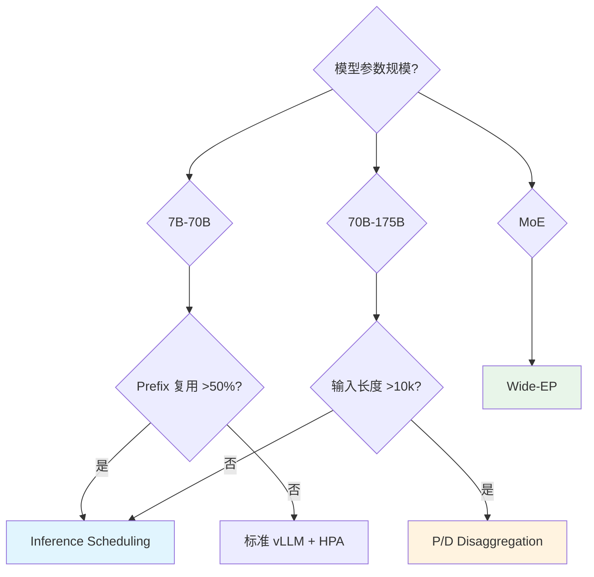

# Production Patterns - 生产模式选型指南

> **核心价值**: 三条经过生产验证的 Well-Lit Paths,覆盖 90% LLM 推理场景  
> **选型原则**: 根据模型规模、Prefix 复用率、网络环境选择最优路径

---

## 三条 Well-Lit Paths 对比

| 维度 | Inference Scheduling | P/D Disaggregation | Wide-EP |
|------|---------------------|-------------------|---------|
| **适用模型** | 7B-70B | 70B-175B | MoE (DeepSeek/Mixtral) |
| **工作负载** | 多轮对话、RAG、Agent | 长上下文 (10k+ input) | 批处理、离线推理 |
| **Prefix 复用** | **高** (>50%) | 中 (20-50%) | 低 (<20%) |
| **网络要求** | 数据中心网络 | **RDMA/IB** (必需) | **RDMA + NVLink** |
| **TTFT** | **最优** (50-150ms) | 中 (300-500ms) | 高 (>1s) |
| **吞吐** | 中 (10-15k tok/s) | 中 (20-40k tok/s) | **最高** (50k+ tok/s) |
| **成本** | 💰 (最低) | 💰💰 | 💰💰💰 (最高) |

---

## 路径 1: Inference Scheduling

### 适用场景
- ✅ 高 Prefix 复用 (系统提示词+多轮对话)
- ✅ 交互式服务 (TTFT <200ms SLO)
- ✅ 中小模型 (Llama-70B 及以下)

### 部署拓扑
```yaml
vllm:
  replicas: 8
  tensorParallel: 2
  prefixCaching: true

inferenceScheduler:
  scorers:
    - type: prefix-aware
      weight: 100
    - type: load-aware
      weight: 50
```

### 实测效果 (Qwen3-32B)
- TTFT P95: 6.2s → **157ms** (-97%)
- 吞吐: 9k → **11k tok/s** (+22%)
- 缓存命中率: 12% → **89%**

---

## 路径 2: P/D Disaggregation

### 适用场景
- ✅ 超大模型 (120B+)
- ✅ 长上下文 (10k+ input tokens)
- ✅ 有 RDMA 网络

### 部署拓扑
```yaml
prefill:
  replicas: 4
  tensorParallel: 1

decode:
  replicas: 1
  tensorParallel: 4

nixl:
  backend: uccl
  transport: rdma
```

### xPyD 比例调优
| ISL/OSL | Prefill:Decode |
|---------|---------------|
| 10:1 | 8:1 |
| 5:1 | 4:1 |
| 1:1 | 2:1 |

---

## 路径 3: Wide-EP

### 适用场景
- ✅ MoE 架构 (DeepSeek-R1, Mixtral)
- ✅ 批处理优先 (离线推理)
- ✅ 高端网络 (RDMA + NVLink)

### 部署拓扑
```yaml
prefill:
  replicas: 16
  expertParallel: 16
  tensorParallel: 1

decode:
  replicas: 16
  expertParallel: 16
  tensorParallel: 1
```

### 实测效果 (DeepSeek-R1, B200)
- 总吞吐: **~50k output tok/s**
- 单 GPU: **~3.1k output tok/s**

---

## 选型决策树



---

## 成本优化组合拳

| 优化方向 | 成本降低 | 性能影响 | 适用场景 |
|---------|---------|---------|---------|
| **Prefix Caching** | -30% GPU | TTFT -90% | 高复用场景 |
| **CPU KV Offloading** | 并发 +10x | TTFT +20% | 低频访问 |
| **P/D 分离 (TP=1)** | -20% 高端 GPU | 吞吐 +50% | 长上下文 |
| **Scale-to-Zero** | 空闲 -100% | 冷启动 30s | 间歇性负载 |
| **Spot 实例** | -70% 成本 | 可用性 -10% | 批处理 |

---

## 监控指标模板

```yaml
# Prometheus 规则
groups:
  - name: llm-d-slo
    rules:
      - alert: HighTTFT
        expr: histogram_quantile(0.95, vllm_ttft_bucket) > 0.2
      
      - alert: LowCacheHitRate
        expr: rate(kv_cache_hit[10m]) / rate(kv_cache_lookup[10m]) < 0.3
      
      - alert: KVMemoryPressure
        expr: vllm_kv_utilization > 0.95
```

---

## 📚 参考资料

- [Inference Scheduling Guide](https://llm-d.ai/docs/guide/Installation/inference-scheduling)
- [P/D Disaggregation Guide](https://llm-d.ai/docs/guide/Installation/pd-disaggregation)
- [Wide-EP Guide](https://llm-d.ai/docs/guide/Installation/wide-ep-lws)
