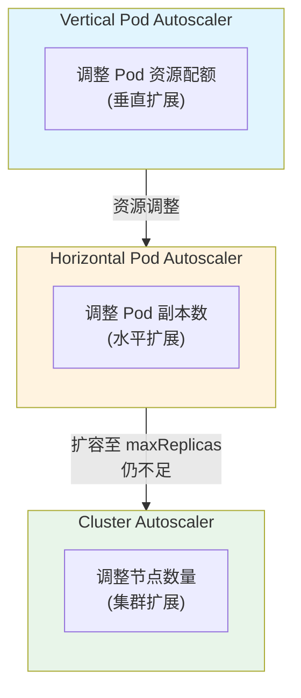
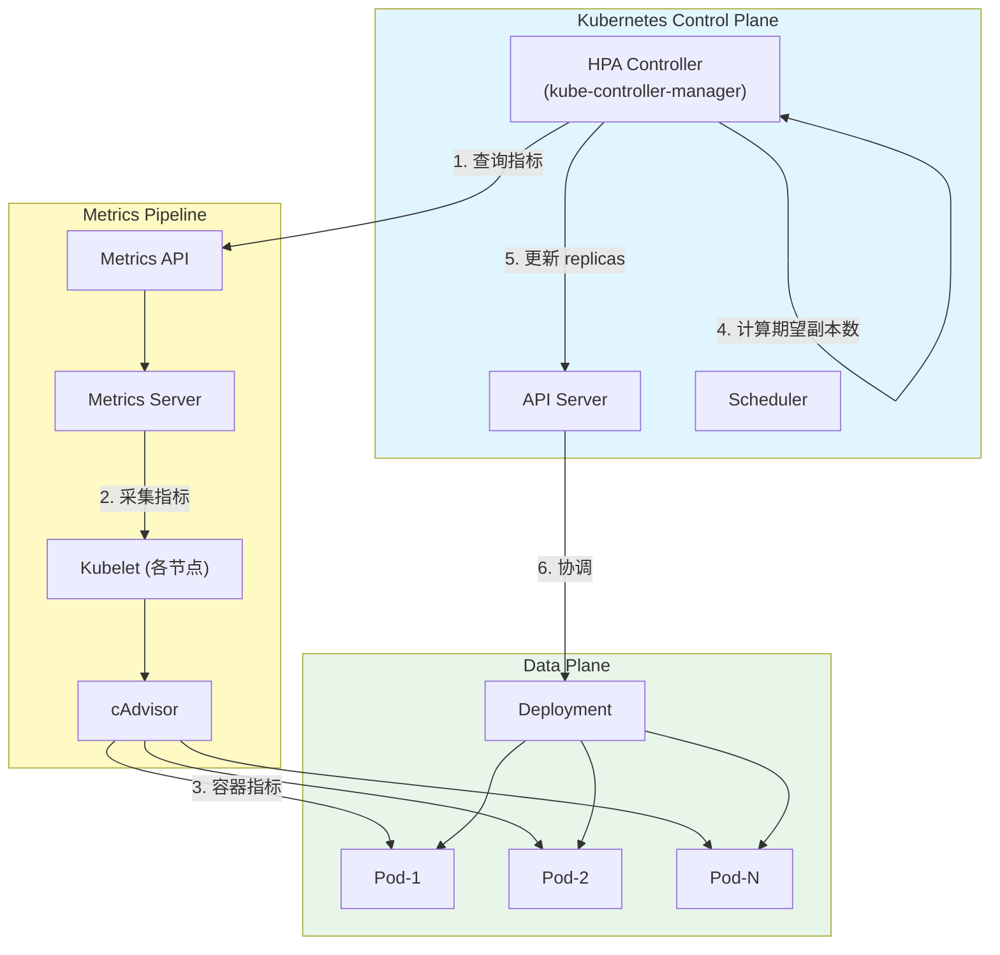
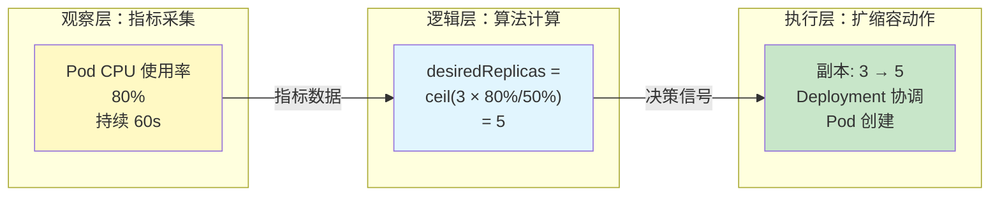
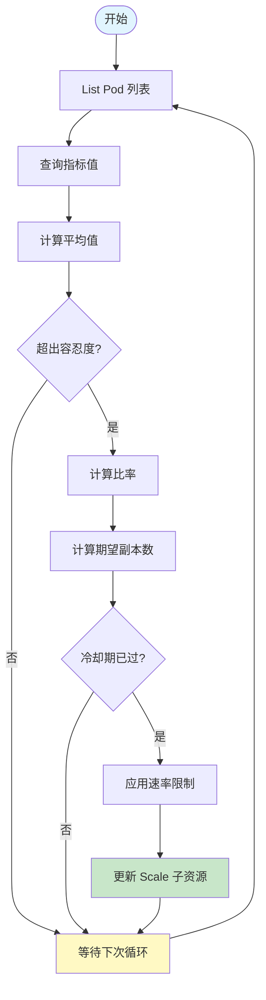
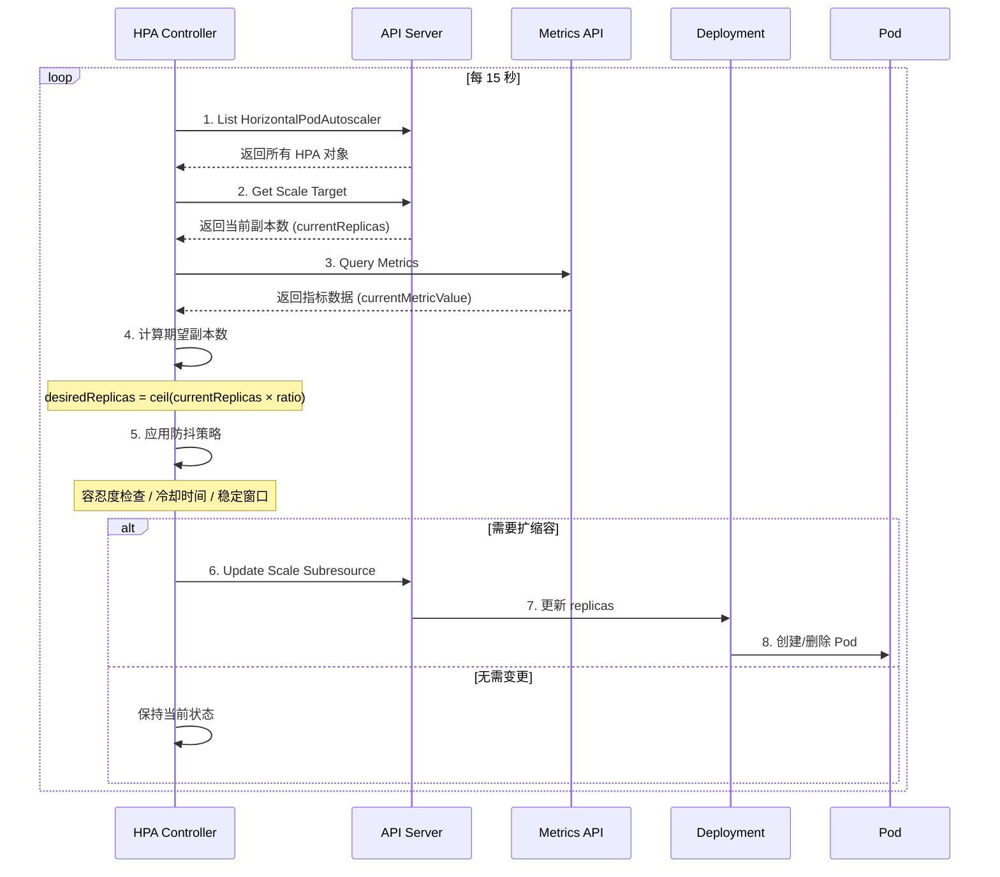
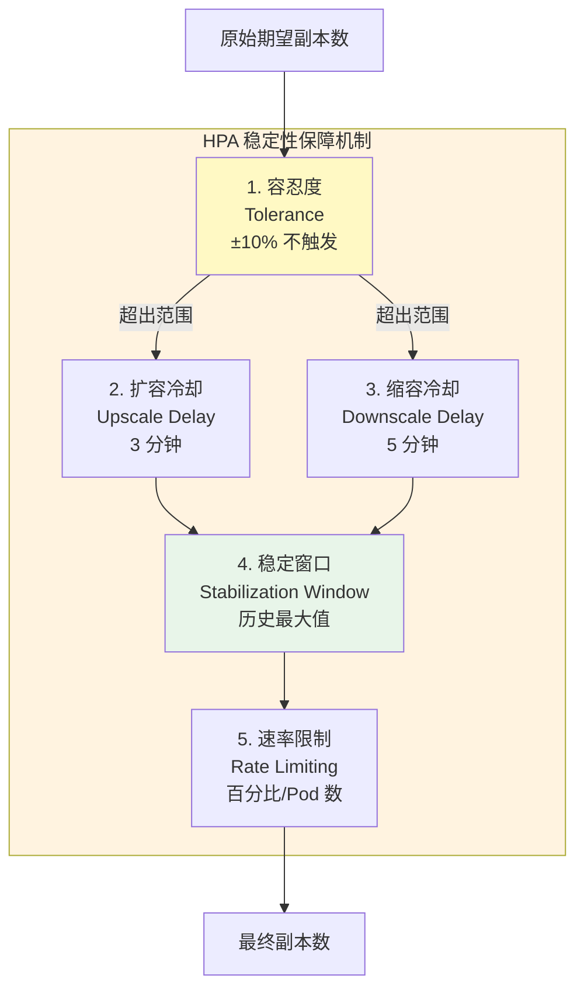
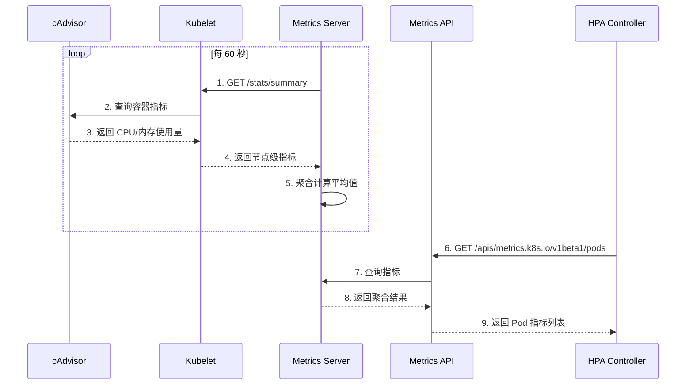
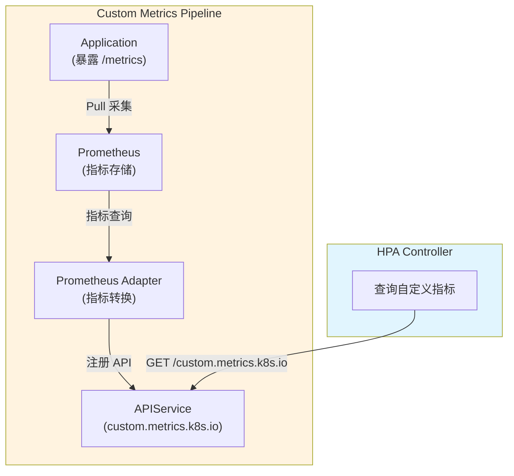
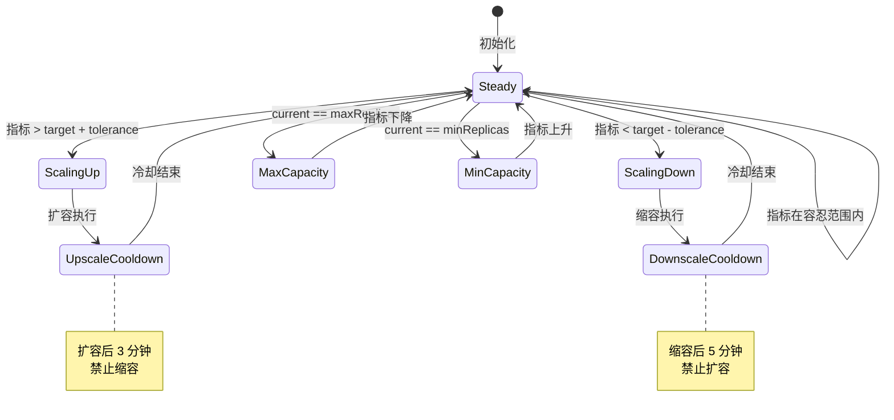
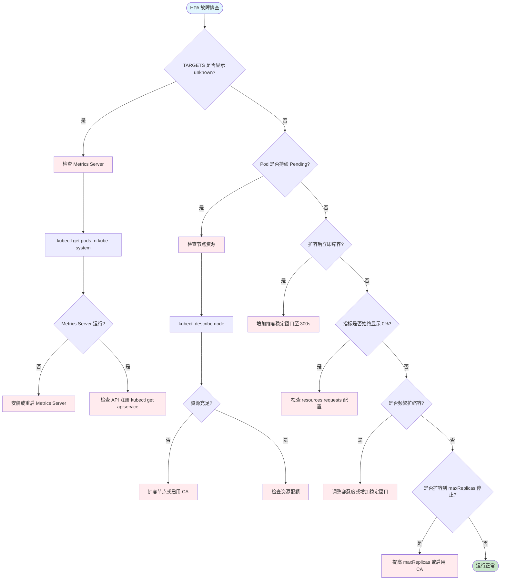

# Kubernetes HPA 深度解析：AI 推理服务的智能扩缩容

> **目标受众**：一线工程师 & 架构师  
> **核心价值**：解决 AI 推理服务流量波动与成本控制的核心矛盾，沉淀自动化弹性伸缩的 SRE 最佳实践  
> **技术范畴**：Kubernetes v1.19+、Metrics Server、Prometheus Adapter、autoscaling/v2 API

---

## 概念层 — 是什么 & 为什么

### 本层目标

建立对 HPA 的完整概念认知：理解自动扩缩容的业务必要性、核心术语体系，以及 HPA 在 Kubernetes 架构中的定位。

**本层验收标准**：
- 能一句话复述 HPA 的核心价值
- 能区分 HPA/VPA/Cluster Autoscaler 的适用边界
- 能绘制 HPA 在 K8s 控制面-数据面中的位置

---

### 1.1 场景痛点：AI 推理服务的流量特征

#### 流量波动场景

| 时段 | 流量特征 | 请求量 | 资源需求变化 |
|------|---------|--------|-------------|
| **业务高峰** (09:00-18:00) | 企业 API 调用密集 | 5,000-10,000 QPS | 10x 基线容量 |
| **业务低谷** (22:00-06:00) | 批量推理任务为主 | 50-200 QPS | 0.1x 基线容量 |
| **突发峰值** (营销/大促) | 瞬时流量激增 | 20,000+ QPS | 需秒级响应 |

#### 固定副本数策略的困境

```
固定副本 = 10 Pod（按峰值配置）
├── 低谷期：8 Pod 空闲，资源利用率 < 15%
├── 成本浪费：估算 60-80% 计算资源闲置
└── 突发期：仍需 5-10 分钟人工扩容

固定副本 = 3 Pod（按均值配置）
├── 高峰期：CPU 饱和 > 90%，队列堆积
├── 服务质量：P99 延迟 > 5s，请求超时
└── 业务损失：用户体验降级，SLA 违约
```

#### 自动扩缩容的收益

| 维度 | 固定策略痛点 | HPA 解决方案 | 量化收益 |
|------|-------------|-------------|---------|
| **成本控制** | 低谷期资源闲置 | 自动缩容至 minReplicas | 节省 40-60% 计算成本 |
| **性能保障** | 高峰期容量不足 | 自动扩容至 maxReplicas | P99 延迟稳定 < 200ms |
| **运维效率** | 人工扩容工单 | 闭环自动化 | 减少 90% 扩缩容操作 |
| **业务敏捷** | 响应延迟 5-10 分钟 | 30 秒内完成扩容 | 零业务中断 |

---

### 1.2 核心概念定义

#### Horizontal Pod Autoscaler (HPA)

**定义**：HPA 是 Kubernetes 控制平面组件，通过监控工作负载的资源利用率或自定义指标，动态调整目标工作负载（Deployment/StatefulSet/ReplicaSet）的副本数量。

**核心职责**：
- 周期性采集 Pod 指标（默认 15 秒）
- 基于算法计算期望副本数
- 执行扩缩容决策（受防抖机制约束）
- 维护副本数在 [minReplicas, maxReplicas] 区间内

#### 核心术语表

| 术语 | 定义 | 典型值（AI 推理场景） |
|------|------|---------------------|
| `minReplicas` | HPA 保证的最小副本数 | 2-3（避免单点） |
| `maxReplicas` | HPA 允许的最大副本数 | 10-50（取决于成本预算） |
| `targetCPUUtilization` | 目标 CPU 使用率阈值 | 50-70% |
| `targetMemoryUtilization` | 目标内存使用率阈值 | 70-80% |
| `scaleUpBehavior` | 扩容策略配置 | 翻倍或 +N Pod/分钟 |
| `scaleDownBehavior` | 缩容策略配置 | 50% 或 -N Pod/分钟 |
| `stabilizationWindow` | 稳定窗口（防抖） | 扩容 60s / 缩容 300s |

---

### 1.3 扩展策略对比



| 扩展方式 | 扩展维度 | 适用场景 | 与 HPA 关系 |
|---------|---------|---------|------------|
| **HPA** | Pod 数量（水平） | 无状态服务、可水平拆分负载 | 核心方案 |
| **VPA** | Pod 资源（垂直） | 有状态服务、不可水平拆分 | 互斥（HPA 接管副本数） |
| **CA** | 节点数量（集群） | HPA 触发但节点资源不足 | 配合（HPA + CA 最佳实践） |

---

### 1.4 架构全景图



**数据流向**：

```
┌─────────────┐     ┌──────────────┐     ┌─────────────┐
│   Pod 指标   │────▶│ Metrics API  │────▶│   HPA 控制器 │
│  (CPU/内存)  │     │  (聚合计算)   │     │ (决策计算)   │
└─────────────┘     └──────────────┘     └──────┬──────┘
                                                │
                                                ▼
┌─────────────┐     ┌──────────────┐     ┌─────────────┐
│    Pod      │◀────│  Deployment  │◀────│  期望副本数  │
│ (扩缩容目标) │     │ (副本控制器)  │     │ (计算结果)   │
└─────────────┘     └──────────────┘     └─────────────┘
```

---

### 1.5 HPA 在 AI 推理场景的核心价值

#### 推理服务的特殊性

| 特性 | 通用 Web 服务 | AI 推理服务 | HPA 配置影响 |
|------|--------------|------------|-------------|
| **冷启动时间** | 1-5 秒 | 30-120 秒（模型加载） | 需要更长冷却时间 |
| **资源密集度** | CPU 为主 | GPU + 显存 + CPU | 多维度指标监控 |
| **请求模式** | 均匀分布 | 批处理 + 实时混合 | 自定义指标必要性 |
| **SLA 要求** | P99 < 500ms | TTFT < 100ms | 更严格的扩容响应 |

#### HPA 的价值量化

```yaml
# 场景：LLM 推理服务，日调用量 1M 次

未启用 HPA:
  固定副本: 20 Pod（按峰值配置）
  低谷利用率: 15%
  日成本: $480 (20 × $1/Pod/小时 × 24h)

启用 HPA:
  minReplicas: 3
  maxReplicas: 20
  平均副本: 8 Pod
  平均利用率: 65%
  日成本: $192 (8 × $1/Pod/小时 × 24h)
  
节省: 60% ($288/天)
年度节省: ~$105,000
```

---

### ✅ 概念层验收标准

完成本层后，应能回答：

1. **Why**：AI 推理服务为什么需要自动扩缩容？（流量波动、成本优化、SLA 保障）
2. **What**：HPA 是什么？（K8s 水平扩缩容控制器，基于指标动态调整副本数）
3. **Where**：HPA 在 K8s 架构中的位置？（控制面 HPA Controller → Metrics API → 数据面 Pod）
4. **边界**：HPA vs VPA vs CA 的适用边界？（水平 vs 垂直 vs 集群扩展）

**一句话复述核心价值**：
> HPA 是通过监控资源利用率指标动态调整 Pod 副本数，来解决 AI 推理服务流量波动场景下成本控制与性能保障矛盾的核心组件。

---

## 💨 认知过渡：从概念到机制

### 过渡主线

> [!IMPORTANT]
> **目标**：在进入机制层的算法/源码前，先建立概念与机制之间的桥梁。

理解了 HPA 的 **What** 和 **Why** 后，核心问题浮现：

```
┌─────────────────────────────────────────────────────────────┐
│                     待解答的核心问题                          │
├─────────────────────────────────────────────────────────────┤
│  ❓ 问题 1: HPA 如何精确计算期望副本数？                       │
│     → 涉及核心算法：currentReplicas × (currentMetric/target)  │
│                                                             │
│  ❓ 问题 2: Metrics Server 的数据流向和时延？                  │
│     → 涉及指标采集链路：cAdvisor → Kubelet → Metrics Server   │
│                                                             │
│  ❓ 问题 3: 如何避免扩缩容抖动（Flapping）？                   │
│     → 涉及稳定性机制：容忍度、冷却时间、稳定窗口                │
│                                                             │
│  ❓ 问题 4: 自定义指标（GPU/延迟/队列长度）如何接入？           │
│     → 涉及 Metrics API 扩展：Prometheus Adapter               │
└─────────────────────────────────────────────────────────────┘
```

### 认知过渡桥



**理解铺垫**：

> **为什么不能只看简单阈值？**
> 因为在 AI 推理生产场景下，高 CPU 可能伴随高延迟（模型计算密集型），也可能只是短时波动（预热期）。所以我们需要引入机制层的核心变量：
> - **容忍度**：避免小幅波动触发扩缩容
> - **稳定窗口**：基于历史数据而非单次测量
> - **速率限制**：防止剧烈扩缩容

---

## 机制层 — 如何运作

### 本层目标

深入理解 HPA 的底层工作机制，包括核心算法、控制循环时序、稳定性保障机制、以及指标采集链路的完整技术细节。

**本层验收标准**：
- 能手算给定场景下的期望副本数
- 能绘制 HPA 控制循环的时序图
- 能解释四种防抖机制的工作原理
- 能绘制 Metrics Server 数据流向图

---

### 2.0 逻辑概述

> [!TIP]
> **不要直接甩公式！** 先理解算法的本质——它其实就是一个"多退少补"的系统。压力大了就派兵，压力小了就收兵。它不是算命先生（预测），而是根据当下看到的现状（指标）来做反应。

HPA 的核心逻辑可以概括为三步：
1. **观察**：周期性采集当前指标值（CPU/内存/自定义）
2. **计算**：基于算法计算期望副本数
3. **执行**：应用防抖策略后更新副本数

---

### 2.1 核心算法拆解

#### 算法目标与原理

HPA 的核心目标是**将资源利用率维持在目标值附近**，通过动态调整副本数来应对负载变化。

**算法公式**：

```
期望副本数 = ceil(当前副本数 × (当前指标值 / 目标指标值))

其中：
- ceil(): 向上取整函数
- 当前指标值: 所有 Pod 的平均指标（CPU/内存/自定义）
- 目标指标值: HPA 配置中指定的 target 值
```

#### 算法伪代码

```python
# HPA 核心计算逻辑（逻辑伪代码）
def calculate_desired_replicas(
    current_replicas: int,
    current_metric_value: float,
    target_metric_value: float,
    min_replicas: int,
    max_replicas: int
) -> int:
    """
    计算期望副本数
    """
    # 步骤 1: 计算利用率比率
    utilization_ratio = current_metric_value / target_metric_value
    
    # 步骤 2: 计算原始期望副本数
    raw_desired = current_replicas * utilization_ratio
    
    # 步骤 3: 向上取整
    desired_replicas = math.ceil(raw_desired)
    
    # 步骤 4: 边界约束
    return clamp(desired_replicas, min_replicas, max_replicas)
```

#### 计算示例

**场景**：AI 推理服务 Deployment

```yaml
# 当前状态
currentReplicas: 3
currentMetricValue: 80% CPU
targetMetricValue: 50% CPU
minReplicas: 2
maxReplicas: 10
```

**计算过程**：

```
步骤 1: 利用率比率 = 80% / 50% = 1.6

步骤 2: 原始期望副本数 = 3 × 1.6 = 4.8

步骤 3: 向上取整 = ceil(4.8) = 5

步骤 4: 边界检查
  - 5 >= minReplicas (2) ✓
  - 5 <= maxReplicas (10) ✓

结果: 期望副本数 = 5
```

**验证扩容效果**：

```
扩容前:
  总 CPU 需求 = 3 Pod × 80% = 240% (以 1 CPU 为基准)
  平均 CPU = 240% / 3 = 80%

扩容后:
  总 CPU 需求不变 = 240%
  平均 CPU = 240% / 5 = 48% ≈ 目标 50% ✓
```

#### 算法流程图



---

### 2.2 HPA 控制循环时序

#### 控制循环流程

HPA Controller 通过标准的 Kubernetes Controller Pattern 工作，每 15 秒执行一次同步循环：



#### 关键时间参数

| 参数 | 默认值 | 作用 | 调优建议（AI 推理） |
|------|--------|------|-------------------|
| **同步间隔** | 15 秒 | HPA 控制循环频率 | 保持默认，无需调整 |
| **扩容冷却时间** | 3 分钟 | 扩容后禁止缩容 | 缩短至 1-2 分钟（模型加载快） |
| **缩容冷却时间** | 5 分钟 | 缩容后禁止扩容 | 延长至 5-10 分钟（避免抖动） |
| **容忍度** | 10% | 触发阈值偏差 | 保持默认 10% |

---

### 2.3 稳定性机制：防止抖动

#### 抖动场景分析

```
⚠️ 无防抖机制时的噩梦场景：

T+0s   CPU 80% → 扩容至 5 Pod
T+30s  新 Pod 启动，CPU 降至 45% → 缩容至 3 Pod
T+60s  负载回升，CPU 80% → 扩容至 5 Pod
T+90s  缩容至 3 Pod
...

结果：
- Pod 频繁创建/销毁，调度开销巨大
- 服务稳定性受损，SLA 违约
- 成本不降反升（调度成本 > 资源成本）
```

#### 防抖机制全景



##### 机制 1：容忍度（Tolerance）

```python
# 默认容忍度: 10%
tolerance = 0.10

# 只有当指标偏差超过容忍度时才触发调整
if abs(current_metric - target_metric) / target_metric <= tolerance:
    # 不触发扩缩容
    return current_replicas
```

**效果**：
- 目标 CPU 50%
- 触发扩容阈值：> 55% (50% × 1.1)
- 触发缩容阈值：< 45% (50% × 0.9)
- 45%-55% 范围内：保持当前副本数

##### 机制 2：扩容冷却时间（Upscale Delay）

```yaml
# 扩容后 3 分钟内禁止缩容
--horizontal-pod-autoscaler-upscale-delay=3m
```

**原理**：新 Pod 启动需要时间（镜像拉取、模型加载、健康检查），冷却期确保系统稳定后再判断。

##### 机制 3：缩容冷却时间（Downscale Delay）

```yaml
# 缩容后 5 分钟内禁止扩容
--horizontal-pod-autoscaler-downscale-delay=5m
```

**原理**：避免短暂流量下降导致过度缩容。

##### 机制 4：稳定窗口（Stabilization Window）

Kubernetes 1.18+ 引入，使用历史数据而非单次测量值：

```yaml
behavior:
  scaleUp:
    stabilizationWindowSeconds: 60  # 1 分钟
    # 选择过去 1 分钟内的最高推荐值
  scaleDown:
    stabilizationWindowSeconds: 300  # 5 分钟
    # 选择过去 5 分钟内的最高推荐值（保守缩容）
```

**算法逻辑**：

```python
# 从稳定窗口内的历史数据中选择最大推荐值
def get_max_recommendation_from_window(history: List[int]) -> int:
    return max(history) if history else 0
```

##### 机制 5：扩缩容速率限制（Rate Limiting）

```yaml
behavior:
  scaleUp:
    policies:
    - type: Percent
      value: 100        # 每次最多扩容 100%（翻倍）
      periodSeconds: 60 # 每分钟
    - type: Pods
      value: 4          # 每次最多增加 4 个 Pod
      periodSeconds: 60
    selectPolicy: Max   # 取两者中的较大值
  
  scaleDown:
    policies:
    - type: Percent
      value: 50         # 每次最多缩容 50%
      periodSeconds: 60
    - type: Pods
      value: 2          # 每次最多减少 2 个 Pod
      periodSeconds: 60
    selectPolicy: Min   # 取两者中的较小值（保守）
```

**计算示例**：

```
当前副本数: 3 Pod
扩容场景:
  - 需要扩容至 10 Pod（+7 Pod）
  - 百分比策略: 3 × 100% = +3 Pod
  - Pod 数策略: +4 Pod
  - selectPolicy: Max → +4 Pod（本次）
  - 剩余 3 Pod 在下个周期扩容

缩容场景:
  - 需要缩容至 2 Pod（-1 Pod）
  - 百分比策略: 3 × 50% = -1.5 → -2 Pod
  - Pod 数策略: -2 Pod
  - selectPolicy: Min → -1 Pod（保守）
```

---

### 2.4 Metrics Server 指标采集链路

#### 为什么需要 Metrics Server？

Kubernetes 原生只提供**资源调度**能力，不提供**指标采集**能力。Metrics Server 是指标基础设施的核心组件：

```
┌─────────────────────────────────────────────────────────────┐
│                    Metrics Server 核心职责                   │
├─────────────────────────────────────────────────────────────┤
│  1. 从各节点 Kubelet 抓取原始指标（Summary API）              │
│  2. 在内存中聚合计算（平均值、总量）                          │
│  3. 暴露 Metrics API（metrics.k8s.io）供 HPA 查询            │
└─────────────────────────────────────────────────────────────┘
```

#### 指标采集时序



#### 关键时延分析

| 环节 | 时延 | 说明 |
|------|------|------|
| **指标采集** | 60 秒 | Metrics Server 默认采集间隔 |
| **内存存储** | 1-2 分钟 | 仅保留最近数据，不持久化 |
| **API 响应** | < 100ms | 内存查询，无磁盘 IO |
| **总延迟** | 60-120 秒 | HPA 看到的指标延迟 |

**对 AI 推理的影响**：
- 突发流量下，HPA 有 1-2 分钟的数据延迟
- 需要结合自定义指标（如 Prometheus）实现秒级响应

---

### 2.5 自定义指标接入（Metrics API 扩展）

#### 为什么需要自定义指标？

| 场景 | CPU/内存局限性 | 自定义指标解决方案 |
|------|---------------|-------------------|
| **GPU 利用率** | CPU 低但 GPU 饱和 | `nvidia_gpu_utilization` |
| **推理延迟** | CPU 低但 P99 延迟高 | `http_request_duration_p99` |
| **队列长度** | 无积压信息 | `inference_queue_length` |
| **并发连接** | 无法反映连接数 | `http_active_connections` |

#### 自定义指标架构



#### HPA 自定义指标配置示例

```yaml
apiVersion: autoscaling/v2
kind: HorizontalPodAutoscaler
metadata:
  name: llm-inference-hpa
spec:
  scaleTargetRef:
    apiVersion: apps/v1
    kind: Deployment
    name: llm-inference
  minReplicas: 2
  maxReplicas: 20
  metrics:
  # 自定义指标 1：GPU 利用率
  - type: Pods
    pods:
      metric:
        name: nvidia_gpu_utilization
      target:
        type: AverageValue
        averageValue: "70"  # 目标 GPU 利用率 70%
  
  # 自定义指标 2：推理延迟 P99
  - type: Pods
    pods:
      metric:
        name: http_request_duration_seconds
        selector:
          matchLabels:
            quantile: "0.99"
      target:
        type: AverageValue
        averageValue: "0.5"  # 目标 P99 < 500ms
  
  # 自定义指标 3：队列长度
  - type: Pods
    pods:
      metric:
        name: inference_queue_length
      target:
        type: AverageValue
        averageValue: "10"  # 每个 Pod 平均队列长度 10
```

#### 多指标计算逻辑

当配置多个指标时，HPA **分别计算每个指标的期望副本数，取最大值**：

```python
# 多指标计算伪代码
def calculate_multi_metric_replicas(metrics: List[Metric]) -> int:
    max_desired = 0
    
    for metric in metrics:
        desired = calculate_desired_replicas(metric)
        max_desired = max(max_desired, desired)
    
    return max_desired

# 示例：
# CPU 建议 5 个副本
# 内存建议 4 个副本
# 队列长度建议 8 个副本
# 最终：max(5, 4, 8) = 8 个副本
```

---

### 2.6 HPA 状态机

#### Pod 扩缩容状态转换



---

### 2.7 边缘情况处理

| 场景 | 行为 | 应对策略 |
|------|------|----------|
| **网络分区** | HPA 无法获取指标，保持当前副本数 | 配置多区域 Metrics Server，设置合理的默认值 |
| **指标缺失** | 部分 Pod 无指标时，使用有指标的 Pod 平均值 | 确保所有 Pod 都暴露指标，设置 resources.requests |
| **资源枯竭** | 扩容请求因节点资源不足而 Pending | 启用 Cluster Autoscaler，监控节点容量 |
| **竞态条件** | 多副本 HPA Controller 可能产生冲突 | 依赖 K8s 乐观锁机制，通过 ResourceVersion 控制 |
| **冷启动延迟** | 新 Pod 启动慢导致指标延迟更新 | 增加 scaleUp.stabilizationWindowSeconds |

---

### ✅ 机制层验收标准

完成本层后，应能：

1. **算法计算**：给定 `currentReplicas=3`, `currentCPU=80%`, `targetCPU=50%`，手算出 `desiredReplicas=5`
2. **时序理解**：解释 HPA 控制循环的 9 个步骤（List → Get Scale → Query Metrics → Calculate → Apply Policy → Update → Coordinate → Scale）
3. **防抖机制**：说明五种防抖机制（容忍度、扩容冷却、缩容冷却、稳定窗口、速率限制）的作用
4. **指标链路**：绘制 Metrics Server 数据流（cAdvisor → Kubelet → Metrics Server → Metrics API → HPA）
5. **自定义指标**：解释 Prometheus Adapter 在自定义指标链路中的作用

**核心流程图**：
> 能画出：Pod 指标 → Metrics Server 聚合 → HPA 计算 → 副本调整 的核心流程图。

**衔接问题**：
> 生产环境会遇到什么坑？怎么避免配错？

---

## 实战层 — 如何驾驭

### 本层目标

掌握在生产环境中部署、运维和优化 HPA 的完整能力，包括从零搭建、故障排查、监控告警、性能调优，以及成本与性能的极致权衡。

**本层验收标准**：
- 能独立从零部署完整的 HPA 生产环境
- 能按决策树排查常见故障
- 能配置 Prometheus 告警规则和 Grafana 面板
- 能根据业务特征调优 HPA 参数
- 能识别并规避常见反模式

---

### 3.1 极致权衡：成本 vs 性能

#### 调优矩阵

| 优化目标 | 配置调整 | 成本影响 | 性能影响 |
|---------|---------|---------|---------|
| **最低成本** | minReplicas=1, 目标 CPU=80%, 缩容激进 | 💰💰💰 最低 | ⚠️ 冷启动延迟 |
| **平衡模式** | minReplicas=2, 目标 CPU=60%, 保守缩容 | 💰💰 中等 | ✅ 稳定 |
| **最佳性能** | minReplicas=3, 目标 CPU=50%, 快速扩容 | 💰 最高 | 🚀 最低延迟 |

#### AI 推理场景调优建议

```yaml
# 成本优先（测试/开发环境）
costOptimized:
  minReplicas: 1
  maxReplicas: 10
  targetCPU: 75
  behavior:
    scaleDown:
      stabilizationWindowSeconds: 60  # 快速缩容

# 性能优先（生产环境）
performanceOptimized:
  minReplicas: 3
  maxReplicas: 50
  targetCPU: 50
  behavior:
    scaleUp:
      stabilizationWindowSeconds: 30  # 快速扩容
      policies:
      - type: Percent
        value: 200  # 激进扩容
    scaleDown:
      stabilizationWindowSeconds: 600  # 非常保守缩容

# 平衡模式（推荐）
balanced:
  minReplicas: 2
  maxReplicas: 20
  targetCPU: 60
  behavior:
    scaleUp:
      stabilizationWindowSeconds: 60
    scaleDown:
      stabilizationWindowSeconds: 300
```

#### 极限抉择案例

> **场景**：大促期间，AI 客服推理服务流量激增 20 倍，GPU 集群容量接近上限。
>
> **决策**：为了保住 SLA（TTFT < 100ms），我们选择牺牲部分成本，将 maxReplicas 从 20 临时提升至 50，并启用 Cluster Autoscaler 扩容节点。
>
> **后果**：成本增加 3 倍，但服务零降级，业务目标达成。大促后通过缩容快速回落。

---

### 3.2 反模式与避坑指南

#### ❌ 反模式清单

| 反模式 | 错误配置 | 危害 | 正确做法 |
|--------|---------|------|---------|
| **单点故障** | `minReplicas: 1` | 缩容后无冗余，节点故障即中断 | `minReplicas >= 2` |
| **无资源声明** | 不设置 `resources.requests` | HPA 无法计算利用率，显示 0% | 必须设置 requests |
| **HPA + VPA 混用** | 同时启用 HPA 和 VPA | 两者冲突，副本数不可预测 | 只选其一 |
| **手动修改 replicas** | `kubectl scale deployment` | HPA 配置被覆盖，失去自动化 | 通过 HPA 调整范围 |
| **过短稳定窗口** | `window: 10s` | 频繁扩缩容，调度开销 > 收益 | 扩容 >= 60s，缩容 >= 300s |
| **无监控告警** | 无 HPA 相关告警 | 无法及时发现容量不足 | 配置容量、抖动、指标告警 |

#### 修正示例：单点故障

```yaml
# ❌ 错误：单点故障风险
spec:
  minReplicas: 1
  maxReplicas: 10

# ✅ 正确：保证基础可用性
spec:
  minReplicas: 2  # 至少 2 个副本
  maxReplicas: 10
```

#### 修正示例：无资源声明

```yaml
# ❌ 错误：未设置 resources.requests
spec:
  containers:
  - name: inference
    image: vllm/vllm-openai:latest
    # 缺少 resources 配置

# ✅ 正确：必须设置 requests
spec:
  containers:
  - name: inference
    image: vllm/vllm-openai:latest
    resources:
      requests:
        cpu: "4000m"       # HPA 计算基础
        memory: "16Gi"
```

---

### 3.3 从零搭建：生产级 HPA 部署

#### 前置条件检查

```bash
#!/bin/bash
# hpa-prereq-check.sh - HPA 前置条件检查脚本

echo "=== HPA 前置条件检查 ==="

# 1. Kubernetes 版本要求 (>= 1.19)
echo -e "\n[1/4] Kubernetes 版本检查..."
SERVER_VERSION=$(kubectl version --json 2>/dev/null | jq -r '.serverVersion.gitVersion' | sed 's/v//')
REQUIRED_VERSION="1.19.0"
if [[ "$(printf '%s\n' "$REQUIRED_VERSION" "$SERVER_VERSION" | sort -V | head -n1)" = "$REQUIRED_VERSION" ]]; then
    echo "✅ Server Version: $SERVER_VERSION (满足 >= 1.19 要求)"
else
    echo "❌ Server Version: $SERVER_VERSION (需要 >= 1.19)"
    exit 1
fi

# 2. Metrics Server 安装检查
echo -e "\n[2/4] Metrics Server 检查..."
if kubectl get deployment metrics-server -n kube-system &>/dev/null; then
    echo "✅ Metrics Server 已安装"
    kubectl get deployment metrics-server -n kube-system
else
    echo "❌ Metrics Server 未安装"
    echo "安装命令: kubectl apply -f https://github.com/kubernetes-sigs/metrics-server/releases/latest/download/components.yaml"
fi

# 3. Metrics API 可用性检查
echo -e "\n[3/4] Metrics API 可用性检查..."
if kubectl top nodes &>/dev/null; then
    echo "✅ Metrics API 可访问"
    kubectl top nodes
else
    echo "❌ Metrics API 不可用"
    echo "排查: kubectl logs -n kube-system deployment/metrics-server"
fi

# 4. Pod 资源配置检查
echo -e "\n[4/4] Pod resources.requests 检查..."
echo "提示: 确保目标 Deployment 的 Pod 设置了 resources.requests"
echo "检查命令: kubectl get deployment <name> -o yaml | grep -A5 resources"
```

#### 步骤 1：部署 Metrics Server

```bash
# 标准安装（适合大多数环境）
kubectl apply -f https://github.com/kubernetes-sigs/metrics-server/releases/latest/download/components.yaml

# 等待就绪
kubectl wait --for=condition=ready pod \
  -l k8s-app=metrics-server \
  -n kube-system \
  --timeout=300s

# 验证
kubectl top nodes
kubectl top pods -n default
```

**常见问题处理**：

```bash
# 问题：x509 证书错误（自签名证书环境）
# 解决：添加 --kubelet-insecure-tls 参数
kubectl patch deployment metrics-server -n kube-system --type='json' -p='[{
  "op": "add",
  "path": "/spec/template/spec/containers/0/args/-",
  "value": "--kubelet-insecure-tls"
}]'
```

#### 步骤 2：创建 AI 推理服务 Deployment

```yaml
# llm-inference-deployment.yaml
apiVersion: apps/v1
kind: Deployment
metadata:
  name: llm-inference
  labels:
    app: llm-inference
spec:
  replicas: 3  # 初始副本，将被 HPA 接管
  selector:
    matchLabels:
      app: llm-inference
  template:
    metadata:
      labels:
        app: llm-inference
    spec:
      containers:
      - name: inference
        image: vllm/vllm-openai:latest
        ports:
        - containerPort: 8000
        env:
        - name: MODEL_NAME
          value: "meta-llama/Llama-2-7b-hf"
        resources:
          requests:
            cpu: "4000m"       # 🔑 必须设置！HPA 基于此计算
            memory: "16Gi"
            nvidia.com/gpu: "1"
          limits:
            cpu: "4000m"
            memory: "16Gi"
            nvidia.com/gpu: "1"
        # 健康检查
        livenessProbe:
          httpGet:
            path: /health
            port: 8000
          initialDelaySeconds: 120  # 模型加载时间较长
          periodSeconds: 10
        readinessProbe:
          httpGet:
            path: /health
            port: 8000
          initialDelaySeconds: 60
          periodSeconds: 5
```

**关键配置解读**：

| 配置项 | 值 | 理由 |
|--------|-----|------|
| `resources.requests.cpu` | 4000m | 必须设置，HPA 计算基础 |
| `resources.requests.memory` | 16Gi | 匹配模型显存需求 |
| `initialDelaySeconds` | 120 | 大模型加载时间 |
| `nvidia.com/gpu` | 1 | GPU 资源配置 |

#### 步骤 3：创建生产级 HPA

```yaml
# hpa-production.yaml
apiVersion: autoscaling/v2
kind: HorizontalPodAutoscaler
metadata:
  name: llm-inference-hpa
spec:
  scaleTargetRef:
    apiVersion: apps/v1
    kind: Deployment
    name: llm-inference
  minReplicas: 2
  maxReplicas: 20
  metrics:
  # 指标 1：CPU 利用率
  - type: Resource
    resource:
      name: cpu
      target:
        type: Utilization
        averageUtilization: 60
  
  # 指标 2：内存利用率
  - type: Resource
    resource:
      name: memory
      target:
        type: Utilization
        averageUtilization: 75
  
  behavior:
    # 扩容策略：快速响应
    scaleUp:
      stabilizationWindowSeconds: 60      # 观察 1 分钟确认需求
      policies:
      - type: Percent
        value: 100                        # 最多翻倍扩容
        periodSeconds: 60
      - type: Pods
        value: 4                          # 或最多 +4 Pod
        periodSeconds: 60
      selectPolicy: Max                   # 取较激进的策略
    
    # 缩容策略：保守稳健
    scaleDown:
      stabilizationWindowSeconds: 300     # 观察 5 分钟确认低谷
      policies:
      - type: Percent
        value: 50                         # 最多缩容 50%
        periodSeconds: 60
      - type: Pods
        value: 2                          # 或最多 -2 Pod
        periodSeconds: 60
      selectPolicy: Min                   # 取较保守的策略
```

**生产配置建议表**：

| 参数 | 推荐值 | 场景说明 |
|------|--------|----------|
| `minReplicas` | 2-3 | 保证基础可用性 |
| `maxReplicas` | 峰值 QPS / 单机 QPS × 1.5 | 预留 50% 余量 |
| `targetCPU` | 50-70% | 留 30-50% 突发缓冲 |
| `scaleUp.window` | 60s | 快速响应流量 |
| `scaleDown.window` | 300s | 避免误判短暂低谷 |
| `scaleUp.policy` | Max(100%, +4) | 高峰期可激进 |
| `scaleDown.policy` | Min(50%, -2) | 低谷期保守 |

---

### 3.4 验证与压力测试

#### 查看 HPA 状态

```bash
# 基础状态
kubectl get hpa llm-inference-hpa

# 详细状态（含事件）
kubectl describe hpa llm-inference-hpa

# 实时观察（2 秒刷新）
watch -n 2 kubectl get hpa llm-inference-hpa
```

**输出解读**：

```
NAME                  REFERENCE                   TARGETS         MINPODS   MAXPODS   REPLICAS   AGE
llm-inference-hpa     Deployment/llm-inference    45%/60%, 60%/75%   2         20        5          10m

# TARGETS: 当前值/目标值（CPU, 内存）
# REPLICAS: 当前副本数
```

#### 压力测试脚本

```bash
#!/bin/bash
# hpa-load-test.sh - HPA 压力测试

SERVICE_URL="${1:-http://llm-inference:8000}"
DURATION="${2:-5m}"
CONCURRENCY="${3:-100}"

echo "=== HPA 压力测试 ==="
echo "目标: $SERVICE_URL"
echo "时长: $DURATION"
echo "并发: $CONCURRENCY"

# 安装 hey（如未安装）
if ! command -v hey &> /dev/null; then
    echo "安装 hey 工具..."
    go install github.com/rakyll/hey@latest
fi

# 启动监控（后台）
echo -e "\n[监控] HPA 状态:"
kubectl get hpa llm-inference-hpa -w &
WATCH_PID=$!

# 启动压测
echo -e "\n[压测] 启动负载..."
hey -z "$DURATION" \
    -c "$CONCURRENCY" \
    -m POST \
    -H "Content-Type: application/json" \
    -d '{"prompt": "Explain quantum computing", "max_tokens": 100}' \
    "$SERVICE_URL/v1/completions"

# 停止监控
kill $WATCH_PID

echo -e "\n[完成] 压测结束"
echo "最终状态:"
kubectl get hpa llm-inference-hpa
kubectl get pods -l app=llm-inference
```

#### 预期扩容行为

```
时间线：
T+0s    压测开始，CPU 开始上升
T+30s   CPU 超过 60%，HPA 计算期望副本数
T+60s   HPA 触发扩容，新 Pod 开始创建
T+90s   新 Pod 启动中（镜像拉取、模型加载）
T+180s  新 Pod 通过 readinessProbe，开始接收流量
T+240s  CPU 使用率开始下降，接近目标值
```

---

### 3.5 故障排查决策树



#### 常见问题 Quick Fix

| 症状 | 根本原因 | 诊断命令 | 解决方案 |
|------|---------|---------|---------|
| `TARGETS: <unknown>` | Metrics Server 未运行 | `kubectl get pods -n kube-system \| grep metrics` | 安装 Metrics Server |
| `TARGETS: 0%/60%` | 未设置 resources.requests | `kubectl get deployment -o yaml \| grep requests` | 添加 requests 配置 |
| Pod 持续 Pending | 节点资源不足 | `kubectl describe node` | 扩容节点或启用 CA |
| 扩容后立刻缩容 | 稳定窗口太短 | `kubectl describe hpa` | 增加 stabilizationWindow |
| 频繁扩缩容 | 容忍度太小或抖动 | `kubectl get events` | 调整 tolerance 或 window |
| 扩容到上限停止 | maxReplicas 不足 | `kubectl get hpa` | 提高 maxReplicas |

---

### 3.6 SRE 可观测性

#### SLI（服务水平指标）定义

| SLI | 指标来源 | PromQL 查询 | SLO 目标 | 告警阈值 |
|-----|---------|-------------|----------|----------|
| **副本数偏差** | kube-state-metrics | `abs(desired - current) / current` | < 10% | > 20% |
| **扩容响应时间** | HPA events | `time(scaling started) - time(threshold exceeded)` | < 60s | > 120s |
| **资源利用率** | Metrics API | `avg(cpu_usage / cpu_request)` | 50-70% | > 85% |
| **扩缩容频率** | kube-state-metrics | `rate(hpa_status_desired_replicas[5m])` | < 0.2/min | > 0.5/min |
| **容量余量** | kube-state-metrics | `(max - current) / max` | > 20% | < 10% |

#### Prometheus 告警规则

```yaml
# hpa-alerts.yaml
apiVersion: monitoring.coreos.com/v1
kind: PrometheusRule
metadata:
  name: hpa-alerts
  namespace: monitoring
spec:
  groups:
  - name: hpa
    interval: 30s
    rules:
    
    # 告警 1：HPA 接近容量上限
    - alert: HPANearMaxCapacity
      expr: |
        (
          kube_horizontalpodautoscaler_status_current_replicas 
          / kube_horizontalpodautoscaler_spec_max_replicas
        ) > 0.9
      for: 5m
      labels:
        severity: warning
        team: sre
      annotations:
        summary: "HPA {{ $labels.horizontalpodautoscaler }} 接近容量上限"
        description: "当前副本数 {{ $value | humanizePercentage }}，建议提高 maxReplicas 或扩容集群"
        runbook_url: "https://wiki.example.com/runbooks/hpa-near-max"
    
    # 告警 2：HPA 无法获取指标
    - alert: HPAMetricsUnavailable
      expr: |
        kube_horizontalpodautoscaler_status_condition{
          condition="ScalingActive",
          status="false"
        } == 1
      for: 5m
      labels:
        severity: critical
        team: sre
      annotations:
        summary: "HPA {{ $labels.horizontalpodautoscaler }} 无法获取指标"
        description: "检查 Metrics Server 和 Pod resources.requests 配置"
        runbook_url: "https://wiki.example.com/runbooks/hpa-metrics-unavailable"
    
    # 告警 3：频繁扩缩容（抖动）
    - alert: HPAFlapping
      expr: |
        rate(
          kube_horizontalpodautoscaler_status_desired_replicas[10m]
        ) > 0.5
      for: 15m
      labels:
        severity: warning
        team: sre
      annotations:
        summary: "HPA {{ $labels.horizontalpodautoscaler }} 频繁扩缩容"
        description: "过去 10 分钟扩缩容 {{ $value }} 次/分钟，建议调整 stabilizationWindow"
    
    # 告警 4：扩容响应延迟
    - alert: HPAScaleUpLatencyHigh
      expr: |
        (
          kube_horizontalpodautoscaler_status_current_replicas
          - kube_horizontalpodautoscaler_status_desired_replicas
        ) < -2
      for: 3m
      labels:
        severity: warning
        team: sre
      annotations:
        summary: "HPA 扩容响应延迟"
        description: "期望副本数高于当前副本数超过 3 分钟，检查 Pod 启动时延"
```

#### 健康看板关键指标

```json
{
  "dashboard": {
    "title": "HPA 监控面板",
    "panels": [
      {
        "title": "副本数趋势",
        "targets": [
          {
            "expr": "kube_horizontalpodautoscaler_status_current_replicas",
            "legendFormat": "当前副本"
          },
          {
            "expr": "kube_horizontalpodautoscaler_status_desired_replicas",
            "legendFormat": "期望副本"
          }
        ]
      },
      {
        "title": "CPU 利用率 vs 目标",
        "targets": [
          {
            "expr": "avg(container_cpu_usage_seconds_total / container_spec_cpu_quota)",
            "legendFormat": "实际 CPU%"
          }
        ]
      },
      {
        "title": "扩缩容事件频率",
        "targets": [
          {
            "expr": "rate(kube_horizontalpodautoscaler_status_desired_replicas[5m])",
            "legendFormat": "副本变化率"
          }
        ]
      }
    ]
  }
}
```

---

### 3.7 生产环境 Checklist

```markdown
## HPA 生产部署检查清单

### 前置条件
- [ ] Metrics Server 已安装且运行正常
- [ ] kubectl top nodes/pods 有输出
- [ ] Kubernetes 版本 >= 1.19

### 应用配置
- [ ] Deployment 设置了 resources.requests.cpu
- [ ] Deployment 设置了 resources.requests.memory
- [ ] Pod 有 readinessProbe（用于流量准入）
- [ ] 冷启动时间 < scaleUp 稳定窗口

### HPA 配置
- [ ] minReplicas >= 2（避免单点）
- [ ] maxReplicas 留有 20% 余量
- [ ] targetCPU 在 50-70% 之间
- [ ] scaleUp.window >= 60s
- [ ] scaleDown.window >= 300s
- [ ] 配置了速率限制（防止剧烈扩缩）

### 监控告警
- [ ] 部署了 kube-state-metrics
- [ ] 配置了 HPA 容量告警（>90%）
- [ ] 配置了 HPA 抖动告警
- [ ] 配置了指标不可用告警
- [ ] Grafana 面板可查看副本数趋势

### 高可用保障
- [ ] 启用了 PodDisruptionBudget
- [ ] 集成了 Cluster Autoscaler
- [ ] 测试过压力场景下的扩容响应
- [ ] 验证过节点故障时的自动恢复
```

---

### ✅ 实战层验收标准

完成本层后，应能：

1. **独立部署**：从零搭建包含 Metrics Server + Deployment + HPA 的完整环境
2. **故障排查**：遇到问题时按决策树定位（Metrics Server? requests? 节点资源?）
3. **监控配置**：编写 Prometheus 告警规则，部署 Grafana 面板
4. **参数调优**：根据成本/性能需求调整 min/max、目标值、稳定窗口
5. **反模式识别**：识别单点、混用 VPA、无监控等常见错误

**排障能力验证**：
> 能独立排障：当 HPA 告警触发时，执行决策树中的排查步骤。

---

## 🧠 元知识总结

### 大规模瓶颈与调优

| 规模 | 瓶颈点 | 优化方向 |
|------|--------|----------|
| **< 100 Pod** | 无显著瓶颈 | 标准配置即可 |
| **100-500 Pod** | Metrics Server 查询延迟 | 增加 Metrics Server 副本数 |
| **500-1000 Pod** | HPA 控制循环压力 | 调整同步间隔至 30s |
| **> 1000 Pod** | API Server 压力 | 启用 API Priority & Fairness |

### 核心洞察

**一句话 Takeaway**：
> HPA 不是银弹，它是**延迟敏感的反馈控制系统**——适用于负载变化相对缓慢的场景，对于毫秒级突发流量，需要结合 KEDA、负载均衡预热等前置手段。

**关键决策原则**：
1. **先稳后快**：缩容保守永远比激进更安全
2. **指标为王**：选择合适的指标比调整参数更重要
3. **观测先行**：没有监控的 HPA 是盲飞的飞机
4. **边界兜底**：maxReplicas 是最后一道防线，设置要合理

---

## 📚 延伸阅读

### 官方文档

1. [Kubernetes 官方文档 - Horizontal Pod Autoscaling](https://kubernetes.io/docs/tasks/run-application/horizontal-pod-autoscale/)
2. [Kubernetes Enhancement - HPA v2 API](https://github.com/kubernetes/enhancements/tree/master/keps/sig-autoscaling/2702-graduate-autoscaling-api-to-GA)
3. [Metrics Server 架构设计](https://github.com/kubernetes-sigs/metrics-server/blob/master/docs/design.md)
4. [Prometheus Adapter 自定义指标](https://github.com/kubernetes-sigs/prometheus-adapter/blob/master/docs/config.md)

### 进阶主题

- **Cluster Autoscaler**：HPA 触发但节点资源不足时的解决方案
- **KEDA**：基于队列深度、HTTP 流量等事件源的扩缩容
- **VPA**：垂直扩缩容（调整 Pod 资源配额）
- **混合策略**：HPA + CA + KEDA 的组合使用

### 相关工具

- [hey](https://github.com/rakyll/hey) - HTTP 压测工具
- [kube-state-metrics](https://github.com/kubernetes/kube-state-metrics) - K8s 状态指标采集
- [vertical-pod-autoscaler](https://github.com/kubernetes/autoscaler/tree/master/vertical-pod-autoscaler) - VPA 组件
- [keda](https://keda.sh/) - 事件驱动自动扩缩容

### 参考规范

- 图表规范：[sre-tech-sharing/references/chart-guidelines.md](../../.config/opencode/skills/sre-tech-sharing/references/chart-guidelines.md)
- 代码片段：[sre-tech-sharing/references/mermaid-patterns.md](../../.config/opencode/skills/sre-tech-sharing/references/mermaid-patterns.md)
- 模板参考：[sre-tech-sharing/references/spiral-templates.md](../../.config/opencode/skills/sre-tech-sharing/references/spiral-templates.md)

---

## 总结与展望

### 核心知识回顾

| 层级 | 核心内容 | 关键技术点 |
|---------|---------|-----------|
| 概念层 | 概念与价值 | 流量波动痛点、HPA 架构定位、扩展策略对比 |
| 机制层 | 机制与算法 | 副本数计算公式、控制循环时序、五重防抖机制 |
| 实战层 | 实战与运维 | 从零部署、故障排查、监控告警、成本性能权衡 |

### 核心公式

```
期望副本数 = ceil(当前副本数 × (当前指标值 / 目标指标值))
```

### 下一步学习路径

1. **Cluster Autoscaler**：HPA 触发但节点资源不足时的解决方案
2. **KEDA**：基于队列深度、HTTP 流量等事件源的扩缩容
3. **VPA**：垂直扩缩容（调整 Pod 资源配额）
4. **混合策略**：HPA + CA + KEDA 的组合使用

---

*文档版本：v2.0 | 最后更新：2025年2月 | 遵循 [sre-tech-sharing](https://github.com/opencode/sre-tech-sharing) 规范编写*
