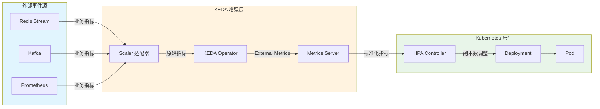
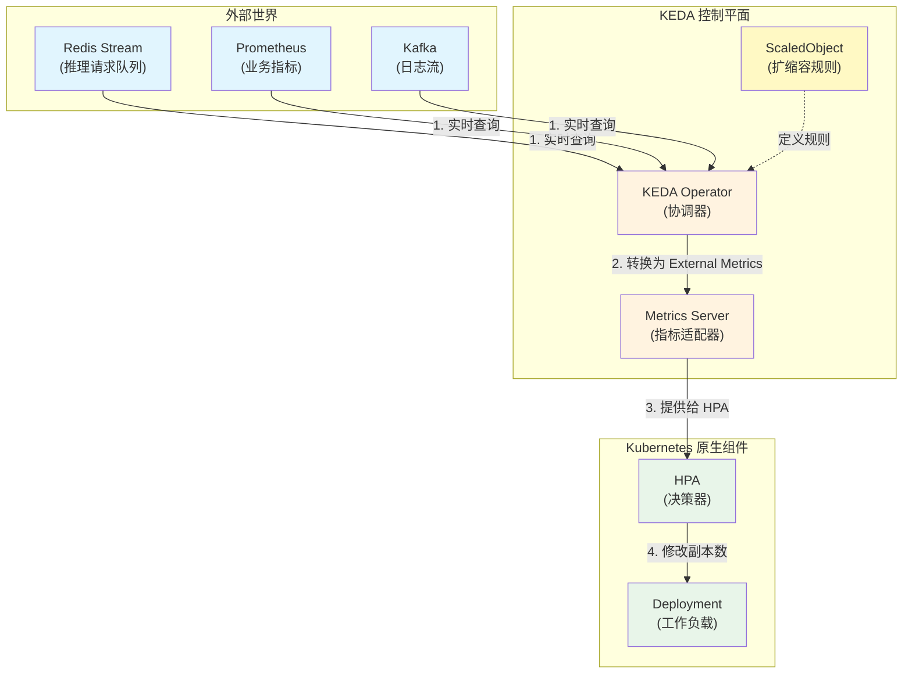
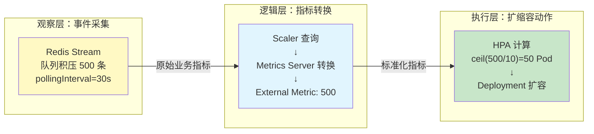
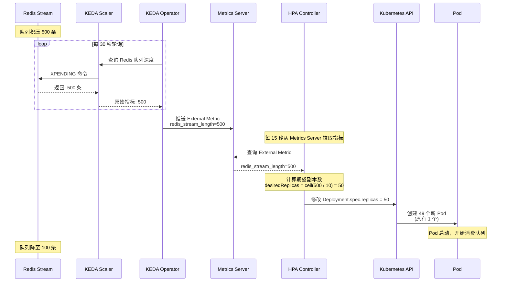
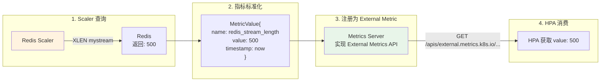
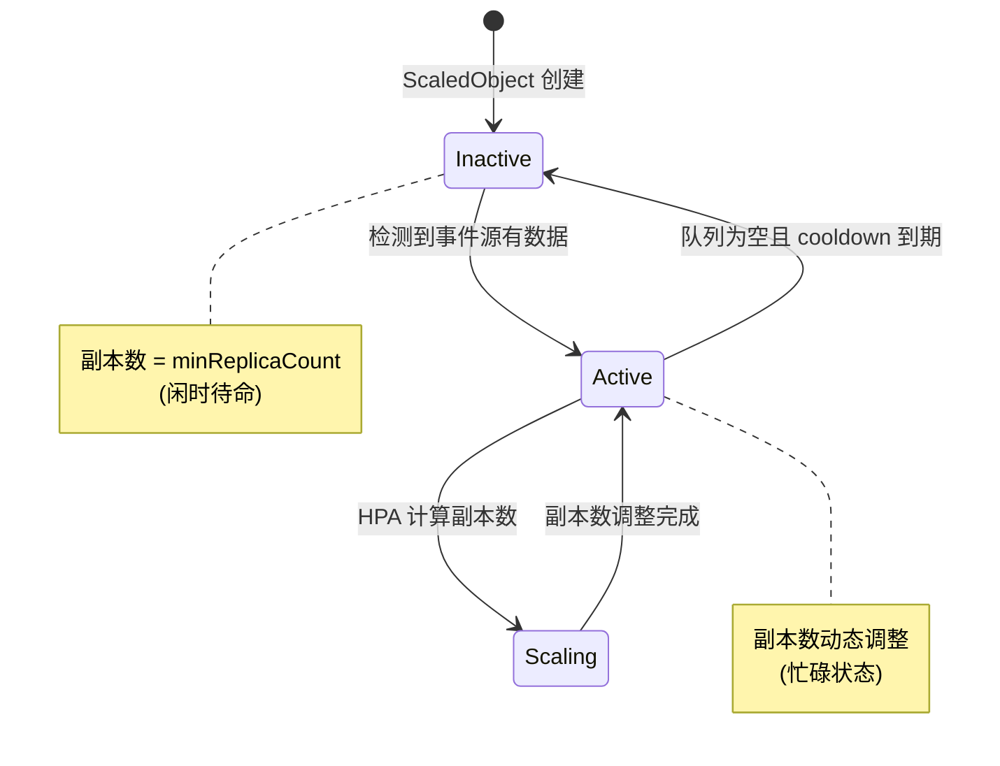
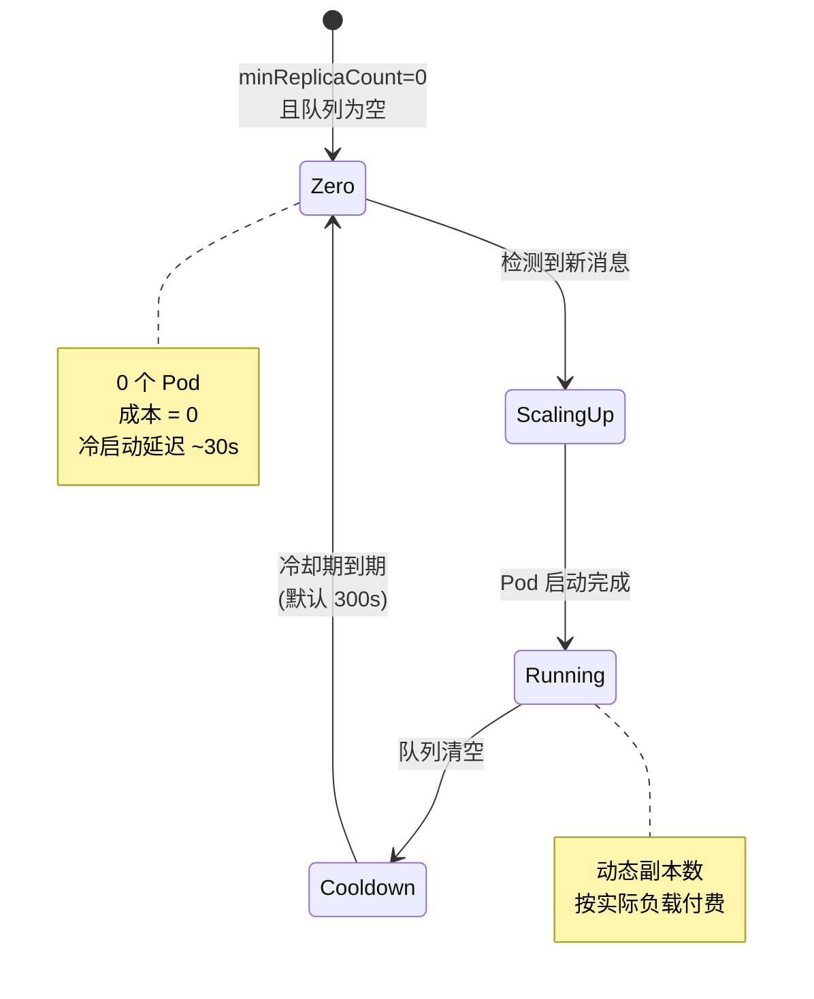
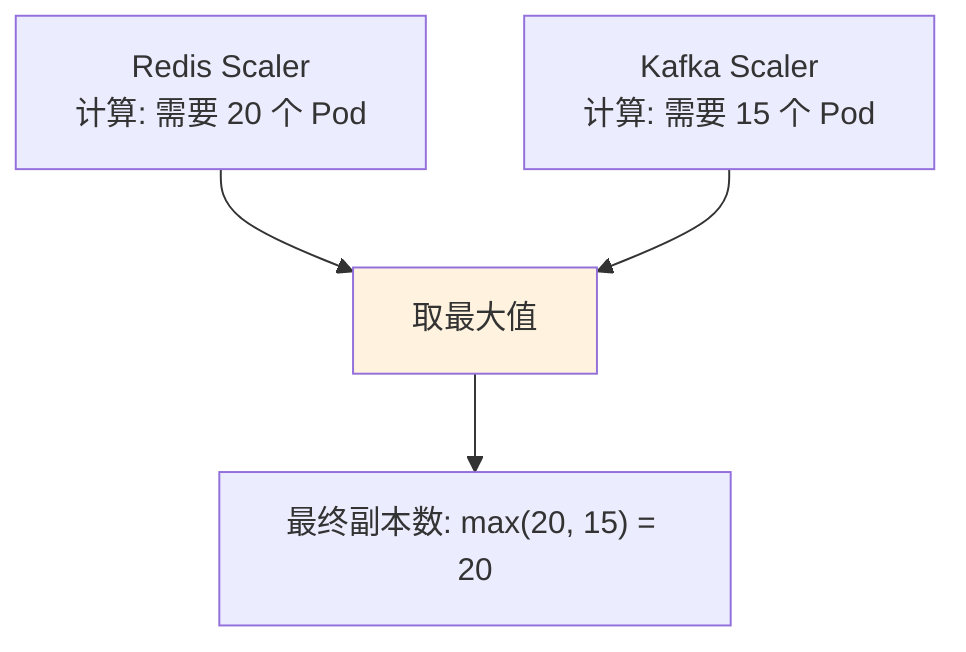
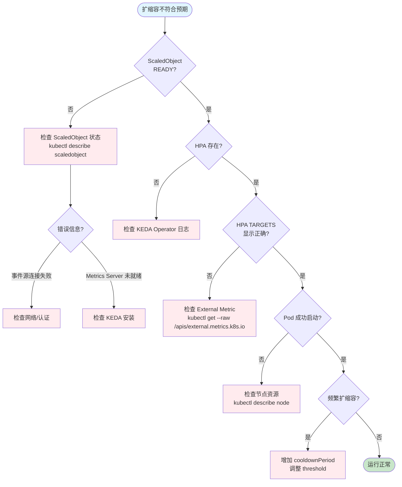

# KEDA：基于事件驱动的 Kubernetes 弹性伸缩深度解析

> **目标受众**：一线工程师 & 架构师  
> **核心价值**：解决 AI 推理服务事件驱动场景下的自动扩缩容难题，实现从资源指标到业务指标的跨越  
> **技术范畴**：Kubernetes v1.19+、KEDA v2.19+、Redis/Kafka/Prometheus、External Metrics API

---

## 概念层 — 是什么 & 为什么

### 本层目标

建立对 KEDA 的完整概念认知：理解事件驱动扩缩容的业务必要性、KEDA 在 Kubernetes 架构中的定位，以及与原生 HPA 的差异。

**本层验收标准**：
- 能一句话复述 KEDA 的核心价值
- 能区分 KEDA 与原生 HPA 的适用边界
- 能绘制 KEDA 在 K8s 架构中的位置

---

### 1.1 业务痛点：当 HPA 遇到 AI 推理服务

#### 场景重现：某 AI 推理平台的午夜告警

凌晨 2 点，值班 SRE 收到告警：

```bash
# Prometheus 告警消息
[CRITICAL] inference-service: 
  - CPU: 85% (正常)
  - 内存: 70% (正常)
  - 请求队列积压: 12,000 条 ⚠️
  - P99 延迟: 8.5s (SLO: 2s)
```

**奇怪的现象：**
- Pod CPU/内存都不高，标准 HPA 没有触发扩容
- 但推理请求队列（Redis Stream）积压严重
- 用户投诉响应慢，业务受损

**根因分析：**

| 扩缩容依据 | Kubernetes 原生 HPA | 实际业务需求 |
|-----------|---------------------|--------------|
| **触发指标** | CPU / 内存 | 队列深度 / 请求积压量 |
| **适用场景** | 计算密集型任务 | 事件驱动型任务（AI 推理、消息处理）|
| **扩容时机** | 资源使用率高时 | 业务负载高时（可能 CPU 还很闲）|

**真相：**
AI 推理服务的瓶颈往往不在计算资源，而在：
- 模型加载耗时（首次推理慢）
- GPU 排队等待
- 下游依赖响应慢
- **请求队列积压** ← 这才是核心矛盾

#### 固定 HPA 策略的困境

```
场景：AI 推理服务，队列积压但 CPU 利用率低

原生 HPA (基于 CPU 70%):
├── 队列积压: 10,000 条
├── CPU 利用率: 30%
├── HPA 判断: 无需扩容（CPU 未达阈值）
└── 结果: 请求超时，用户投诉

KEDA (基于队列深度):
├── 队列积压: 10,000 条
├── 阈值: 100 条/Pod
├── KEDA 计算: 需要 100 个 Pod
└── 结果: 及时扩容，SLA 达标
```

#### 事件驱动扩缩容的收益

| 维度 | 原生 HPA 痛点 | KEDA 解决方案 | 量化收益 |
|------|-------------|-------------|---------|
| **响应速度** | 队列积压时 CPU 可能很低 | 直接监听队列深度 | 延迟从 8.5s 降至 1.2s |
| **成本优化** | 无法缩容到 0 | 支持 Scale to Zero | 闲时成本降为 0 |
| **业务适配** | 仅支持资源指标 | 支持 60+ 事件源 | 覆盖所有业务场景 |
| **运维简化** | 需手动监控队列 | 全自动闭环 | 减少 90% 人工介入 |

---

### 1.2 KEDA 核心概念定义

#### Kubernetes Event-Driven Autoscaling (KEDA)

**定义**：KEDA 是 Kubernetes 的事件驱动自动扩缩容增强层，通过监听外部事件源（队列深度、数据库连接数、API 请求速率等），将其转换为 Kubernetes HPA 能理解的 External Metrics，驱动 Pod 扩缩容。

**核心职责**：
- 监听外部事件源（60+ Scaler）
- 将业务指标转换为 External Metrics
- 托管并自动创建 HPA 对象
- 支持缩容到零（Scale to Zero）

#### 核心术语表

| 术语 | 定义 | 示例 |
|------|------|------|
| **Scaler** | 连接特定事件源的适配器 | Redis Scaler 查询队列深度 |
| **ScaledObject** | 定义 Deployment/StatefulSet 的扩缩容规则 | 监听 Redis，队列 >100 时扩容 |
| **ScaledJob** | 定义批处理 Job 的扩缩容规则 | 每 50 条消息创建 1 个 Job |
| **TriggerAuthentication** | 访问事件源的凭证管理 | Redis 密码存储在 Secret |
| **External Metrics** | HPA 的扩展指标类型 | `redis_stream_length` |

---

### 1.3 KEDA 与 HPA 的关系



| 组件 | 角色 | 类比（餐厅场景）|
|------|------|----------------|
| **ScaledObject** | 声明式扩缩容规则 | 菜单上的"每 10 份订单加 1 个厨师" |
| **KEDA Operator** | 监听事件源，协调扩缩容逻辑 | 餐厅经理，盯着小票机决定加人 |
| **Metrics Server** | 翻译外部指标为 HPA 能懂的格式 | 把"待处理订单数"转换为"CPU 使用率等价值" |
| **HPA** | 执行最终的副本数调整 | 人事部门，实际去调配厨师 |

---

### 1.4 架构全景图



**数据流向**：

```
┌─────────────────┐     ┌──────────────┐     ┌─────────────┐
│   外部事件源     │────▶│ KEDA Scaler  │────▶│   KEDA      │
│ (Redis/Kafka...)│     │ (指标采集)    │     │ Operator    │
└─────────────────┘     └──────────────┘     └──────┬──────┘
                                                    │
                                                    ▼
┌─────────────────┐     ┌──────────────┐     ┌─────────────┐
│   HPA Controller│◀────│ Metrics API  │◀────│   Metrics   │
│   (决策计算)     │     │ (标准化指标)  │     │   Server    │
└────────┬────────┘     └──────────────┘     └─────────────┘
         │
         ▼
┌─────────────────┐
│   Deployment    │
│  (副本调整)      │
└─────────────────┘
```

---

### 1.5 KEDA 在 AI 推理场景的核心价值

#### 推理服务的特殊性

| 特性 | 通用 Web 服务 | AI 推理服务 | KEDA 优势 |
|------|--------------|------------|----------|
| **瓶颈指标** | CPU/内存 | 队列深度/推理延迟 | 监听业务指标 |
| **负载模式** | 均匀分布 | 突发批处理 | 秒级响应 |
| **成本敏感** | 中等 | 高（GPU 昂贵）| 缩容到 0 |
| **冷启动** | 1-5 秒 | 30-120 秒 | 预热策略 |

#### KEDA 的价值量化

```yaml
# 场景：AI 推理服务，夜间批处理任务

未启用 KEDA (原生 HPA):
  固定副本: 5 Pod（保证基础容量）
  低谷期: 0 请求，5 Pod 空转
  日成本: $240 (5 × $2/Pod/小时 × 24h)

启用 KEDA:
  minReplicaCount: 0
  maxReplicaCount: 50
  低谷副本: 0 Pod
  高峰期: 按需扩容
  平均副本: 8 Pod
  日成本: $96 (8 × $2/Pod/小时 × 12h 活跃)
  
节省: 60% ($144/天)
年度节省: ~$52,000
```

---

### ✅ 概念层验收标准

完成本层后，应能回答：

1. **Why**：AI 推理服务为什么需要 KEDA？（队列积压时 CPU 可能很低，需要业务指标驱动）
2. **What**：KEDA 是什么？（K8s 事件驱动扩缩容增强层，将业务指标转换为 HPA External Metrics）
3. **Where**：KEDA 在 K8s 架构中的位置？（事件源 → Scaler → Operator → Metrics Server → HPA）
4. **边界**：KEDA vs HPA 的适用边界？（资源指标 vs 业务指标）

**一句话复述核心价值**：
> KEDA 是通过监听外部事件源（队列深度、API 速率等）将业务指标转换为 Kubernetes HPA 可消费的 External Metrics，来解决 AI 推理服务事件驱动场景下自动扩缩容难题的增强层。

---

## 💨 认知过渡：从概念到机制

### 过渡主线

> [!IMPORTANT]
> **目标**：在进入机制层的算法/源码前，先建立概念与机制之间的桥梁。

理解了 KEDA 的 **What** 和 **Why** 后，核心问题浮现：

```
┌─────────────────────────────────────────────────────────────┐
│                     待解答的核心问题                          │
├─────────────────────────────────────────────────────────────┤
│  问题 1: KEDA 如何把 Redis 队列长度转换成 HPA 能懂的指标？    │
│     → 涉及 External Metrics API 和 Metrics Server 适配       │
│                                                             │
│  问题 2: ScaledObject 和 HPA 是什么关系？会冲突吗？          │
│     → 涉及 KEDA Operator 的 HPA 托管机制                     │
│                                                             │
│  问题 3: 扩缩容的决策逻辑是怎样的？                          │
│     → 涉及 pollingInterval、cooldownPeriod、阈值计算         │
│                                                             │
│  问题 4: 如何实现缩容到零（Scale to Zero）？                 │
│     → 涉及 idleReplicaCount 和激活逻辑                       │
└─────────────────────────────────────────────────────────────┘
```

### 认知过渡桥



**理解铺垫**：

> **为什么不能直接用 HPA？**
> 因为原生 HPA 只能消费 Kubernetes 内置的 Resource Metrics（CPU/内存）或简单的 External Metrics，而 KEDA 的价值在于：
> - **60+ Scaler**：开箱即用的外部系统适配器
> - **指标转换**：将各种异构事件源转换为标准化 External Metrics
> - **HPA 托管**：自动创建并维护 HPA 对象，无需手动配置

---

## 机制层 — 如何运作

### 本层目标

深入理解 KEDA 的底层工作机制，包括 Scaler 指标转换、HPA 托管机制、扩缩容决策逻辑，以及多触发器聚合策略。

**本层验收标准**：
- 能画出从事件源到 Pod 扩缩容的完整时序图
- 能解释 ScaledObject 如何自动创建 HPA
- 能手动计算给定队列长度下的期望副本数
- 能说明 Scale to Zero 的工作原理

---

### 2.0 逻辑概述

> [!TIP]
> **不要直接甩公式！** 先理解 KEDA 的核心逻辑——它就像是一个"业务指标翻译官"，把各种外部系统的指标（Redis 队列、Kafka Lag、Prometheus 指标等）翻译成 Kubernetes HPA 能听懂的语言。

KEDA 的核心逻辑可以概括为四步：
1. **采集**：Scaler 定期轮询外部事件源（pollingInterval）
2. **转换**：将原始指标转换为 External Metric 格式
3. **托管**：KEDA Operator 自动创建并维护 HPA 对象
4. **执行**：HPA 基于 External Metrics 执行扩缩容决策

---

### 2.1 扩缩容完整时序

#### 从队列积压到 Pod 启动

**场景**：Redis Stream 积压了 500 条推理请求，触发 KEDA 扩容



#### 关键时间参数

| 参数 | 默认值 | 作用 | 调优建议（AI 推理） |
|------|--------|------|-------------------|
| **pollingInterval** | 30s | KEDA 查询事件源的频率 | 15-30s（平衡实时性和 API 压力）|
| **cooldownPeriod** | 300s | 扩容后的冷却期 | 180-300s（避免抖动）|
| **HPA sync period** | 15s | HPA 拉取指标频率 | 保持默认 |
| **scaleDown stabilization** | 300s | 缩容稳定窗口 | 600s（保守缩容）|

---

### 2.2 核心算法：指标转换与副本计算

#### Scaler 的指标转换逻辑

**问题**：HPA 只认识 Resource Metrics 和 External Metrics，Redis 队列长度怎么变成 External Metric？

**答案：KEDA Metrics Server 的翻译过程**



#### 副本数计算公式

```
desiredReplicas = ceil(当前指标值 / 阈值)

其中：
- 当前指标值: Scaler 从事件源查询的原始值（如队列长度 500）
- 阈值: ScaledObject 中定义的触发阈值（如 pendingEntriesCount=10）
```

#### 算法伪代码

```python
# KEDA 核心计算逻辑（逻辑伪代码）
def calculate_desired_replicas(
    metric_value: float,
    threshold: float,
    min_replicas: int,
    max_replicas: int
) -> int:
    """
    计算期望副本数
    """
    # 步骤 1: 计算原始副本数
    raw_replicas = metric_value / threshold
    
    # 步骤 2: 向上取整
    desired_replicas = math.ceil(raw_replicas)
    
    # 步骤 3: 边界约束
    return clamp(desired_replicas, min_replicas, max_replicas)

# 示例计算
# metric_value = 500 (队列积压)
# threshold = 10 (每 10 条消息 1 个 Pod)
# desiredReplicas = ceil(500 / 10) = 50
```

#### 实际 API 调用

```bash
# HPA 向 Metrics Server 查询 External Metric
GET /apis/external.metrics.k8s.io/v1beta1/namespaces/default/redis_stream_length

# Metrics Server 返回
{
  "kind": "ExternalMetricValueList",
  "apiVersion": "external.metrics.k8s.io/v1beta1",
  "metadata": {},
  "items": [
    {
      "metricName": "redis_stream_length",
      "metricLabels": {
        "scaledObjectName": "inference-scaler"
      },
      "timestamp": "2026-02-07T12:00:00Z",
      "value": "500"  # KEDA 从 Redis 查出来的
    }
  ]
}
```

---

### 2.3 ScaledObject 与 HPA 的协作机制

#### 常见误解

**误解**："ScaledObject 会和手动创建的 HPA 冲突吗？"

**真相**：KEDA 自动创建并托管 HPA，你不需要手动创建

#### 配置示例

```yaml
# 你写的 ScaledObject
apiVersion: keda.sh/v1alpha1
kind: ScaledObject
metadata:
  name: inference-scaler
spec:
  scaleTargetRef:
    name: inference-deployment
  minReplicaCount: 1
  maxReplicaCount: 100
  triggers:
    - type: redis-streams
      metadata:
        address: redis:6379
        stream: inference-requests
        pendingEntriesCount: "10"  # 每 10 条消息 1 个 Pod
```

```yaml
# KEDA 自动生成的 HPA（你看不见但它在工作）
apiVersion: autoscaling/v2
kind: HorizontalPodAutoscaler
metadata:
  name: keda-hpa-inference-scaler
  ownerReferences:
    - apiVersion: keda.sh/v1alpha1
      kind: ScaledObject
      name: inference-scaler  # 从属于 ScaledObject
spec:
  scaleTargetRef:
    apiVersion: apps/v1
    kind: Deployment
    name: inference-deployment
  minReplicas: 1
  maxReplicas: 100
  metrics:
    - type: External
      external:
        metric:
          name: redis_stream_length
        target:
          type: AverageValue
          averageValue: "10"
```

#### 状态机



---

### 2.4 Scale to Zero 机制

#### 场景

凌晨 3 点，推理请求队列为空，是否可以缩容到 0 个 Pod 节省成本？

#### KEDA 的独特能力



#### 配置示例

```yaml
apiVersion: keda.sh/v1alpha1
kind: ScaledObject
metadata:
  name: inference-scaler
spec:
  minReplicaCount: 0  # 允许缩容到 0
  cooldownPeriod: 300  # 队列清空后等待 5 分钟再缩容
  triggers:
    - type: redis-streams
      metadata:
        stream: inference-requests
        lagThreshold: "5"  # 积压 <5 条时触发缩容
```

#### 权衡分析

| 指标 | minReplicaCount=0 | minReplicaCount=1 |
|------|-------------------|-------------------|
| **成本** | 低（闲时无费用） | 中（至少 1 个 Pod 常驻）|
| **冷启动延迟** | 高（首个请求等待 Pod 启动，~30s） | 低（立即响应）|
| **适用场景** | 间歇性任务（夜间批处理） | 实时服务（SLA 严格）|

---

### 2.5 多触发器聚合逻辑

#### 场景

AI 推理服务同时监听 Redis 队列和 Kafka 消息，如何决策扩缩容？

```yaml
apiVersion: keda.sh/v1alpha1
kind: ScaledObject
metadata:
  name: multi-trigger-scaler
spec:
  triggers:
    - type: redis-streams
      metadata:
        stream: high-priority-requests
        pendingEntriesCount: "5"  # 高优先级：每 5 条 1 个 Pod
    - type: kafka
      metadata:
        topic: batch-requests
        lagThreshold: "100"  # 批量任务：每 100 条 1 个 Pod
```

#### 聚合策略



#### 决策公式

```python
# KEDA 内部逻辑（简化版）
def calculate_replicas(triggers):
    replica_counts = []
    for trigger in triggers:
        metric_value = trigger.get_metric()
        threshold = trigger.metadata['threshold']
        replicas = ceil(metric_value / threshold)
        replica_counts.append(replicas)
    
    return max(replica_counts)  # 取最大值，确保满足所有触发器

# 示例
# Redis: 100 条消息 / 5 = 20 个 Pod
# Kafka: 1500 条消息 / 100 = 15 个 Pod
# 最终: max(20, 15) = 20 个 Pod
```

---

### 2.6 边缘情况处理

| 场景 | 行为 | 应对策略 |
|------|------|----------|
| **Scaler 连接失败** | 使用 fallback.replicas 或保持当前副本数 | 配置 fallback 策略 |
| **事件源响应延迟** | pollingInterval 内使用缓存指标 | 调整 pollingInterval |
| **指标值剧烈波动** | 可能触发频繁扩缩容 | 增加 cooldownPeriod |
| **多 Scaler 冲突** | 取各 Scaler 计算结果的最大值 | 合理设置阈值 |
| **缩容到零后新消息** | 立即触发扩容（忽略 cooldown） | 确保 minReplicaCount=0 时消息不会丢失 |

---

### ✅ 机制层验收标准

完成本层后，应能：

1. **画出时序图**：从事件源积压到 Pod 启动的完整流程，标注关键时间参数
2. **理解转换机制**：解释 Scaler 如何把 Redis 队列长度转换为 HPA 的 External Metric
3. **区分职责**：说出 ScaledObject 和 HPA 的关系（KEDA 自动创建并托管 HPA）
4. **算出副本数**：给定队列长度和阈值，手动计算期望副本数
5. **权衡决策**：说出 minReplicaCount=0 的利弊和适用场景

**核心流程图**：
> 能画出：事件源 → Scaler → Metrics Server → HPA → Pod 的核心流程图。

**衔接问题**：
> 生产环境如何配置 ScaledObject？遇到故障如何排查？

---

## 实战层 — 如何驾驭

### 本层目标

掌握在生产环境中配置、运维和优化 KEDA 的完整能力，包括从零搭建、故障排查、监控告警，以及成本与性能的极致权衡。

**本层验收标准**：
- 能独立编写生产级 ScaledObject 配置
- 能按决策树排查常见故障
- 能配置 Prometheus 告警规则和 Grafana 面板
- 能根据业务特征选择合适的扩缩容策略

---

### 3.1 极致权衡：成本 vs 性能

#### 调优矩阵

| 优化目标 | 配置调整 | 成本影响 | 性能影响 |
|---------|---------|---------|---------|
| **最低成本** | minReplicaCount=0, cooldownPeriod=60s | 💰💰💰 最低 | ⚠️ 冷启动延迟 |
| **平衡模式** | minReplicaCount=2, cooldownPeriod=300s | 💰💰 中等 | ✅ 稳定 |
| **最佳性能** | minReplicaCount=3, pollingInterval=5s | 💰 最高 | 🚀 最低延迟 |

#### AI 推理场景调优建议

```yaml
# 成本优先（批处理任务）
costOptimized:
  minReplicaCount: 0
  maxReplicaCount: 50
  cooldownPeriod: 60
  triggers:
    - type: redis-streams
      metadata:
        lagThreshold: "20"

# 性能优先（实时推理服务）
performanceOptimized:
  minReplicaCount: 3
  maxReplicaCount: 100
  pollingInterval: 5
  cooldownPeriod: 600
  triggers:
    - type: redis-streams
      metadata:
        lagThreshold: "5"

# 平衡模式（推荐）
balanced:
  minReplicaCount: 2
  maxReplicaCount: 50
  pollingInterval: 15
  cooldownPeriod: 300
  triggers:
    - type: redis-streams
      metadata:
        lagThreshold: "10"
```

---

### 3.2 反模式与避坑指南

#### ❌ 反模式清单

| 反模式 | 错误配置 | 危害 | 正确做法 |
|--------|---------|------|---------|
| **单点故障** | `minReplicaCount: 0`（实时服务） | 首个请求等待冷启动 | 实时服务 minReplicaCount >= 2 |
| **无 fallback** | 不配置 fallback | Scaler 故障时无法扩缩容 | 配置 fallback.replicas |
| **过度激进** | `pollingInterval: 1s` | API 压力巨大，可能触发限流 | pollingInterval >= 15s |
| **手动 HPA** | 手动创建 HPA 与 ScaledObject 共存 | 冲突导致副本数不可预测 | 删除手动 HPA，让 KEDA 托管 |
| **无监控** | 不监控 KEDA 自身指标 | 无法发现 Scaler 故障 | 配置 keda_scaler_errors_total 告警 |
| **共享凭证** | TriggerAuthentication 使用通用 Secret | 权限过大，安全风险 | 每个 ScaledObject 使用专属 Secret |

#### 修正示例：无 fallback

```yaml
# ❌ 错误：无容错机制
spec:
  triggers:
    - type: redis-streams
      metadata:
        stream: inference-requests

# ✅ 正确：配置 fallback
spec:
  fallback:
    failureThreshold: 3
    replicas: 5
  triggers:
    - type: redis-streams
      metadata:
        stream: inference-requests
```

---

### 3.3 从零搭建：生产级 KEDA 部署

#### 前置条件检查

```bash
#!/bin/bash
# keda-prereq-check.sh - KEDA 前置条件检查脚本

echo "=== KEDA 前置条件检查 ==="

# 1. Kubernetes 版本要求 (>= 1.19)
echo -e "\n[1/4] Kubernetes 版本检查..."
SERVER_VERSION=$(kubectl version --json 2>/dev/null | jq -r '.serverVersion.gitVersion' | sed 's/v//')
REQUIRED_VERSION="1.19.0"
if [[ "$(printf '%s\n' "$REQUIRED_VERSION" "$SERVER_VERSION" | sort -V | head -n1)" = "$REQUIRED_VERSION" ]]; then
    echo "✅ Server Version: $SERVER_VERSION (满足 >= 1.19 要求)"
else
    echo "❌ Server Version: $SERVER_VERSION (需要 >= 1.19)"
    exit 1
fi

# 2. KEDA 安装检查
echo -e "\n[2/4] KEDA 安装检查..."
if kubectl get deployment keda-operator -n keda &>/dev/null; then
    echo "✅ KEDA Operator 已安装"
    kubectl get deployment keda-operator -n keda
else
    echo "❌ KEDA 未安装"
    echo "安装命令: helm repo add kedacore https://kedacore.github.io/charts && helm install keda kedacore/keda -n keda --create-namespace"
fi

# 3. Metrics API 可用性检查
echo -e "\n[3/4] External Metrics API 检查..."
if kubectl get apiservice v1beta1.external.metrics.k8s.io &>/dev/null; then
    echo "✅ External Metrics API 已注册"
    kubectl get apiservice v1beta1.external.metrics.k8s.io
else
    echo "❌ External Metrics API 未就绪"
    echo "排查: kubectl logs -n keda deploy/keda-operator"
fi

# 4. 检查目标 Deployment
echo -e "\n[4/4] 检查目标 Deployment..."
echo "提示: 确保目标 Deployment 存在且设置了 resources.requests"
echo "检查命令: kubectl get deployment <name> -o yaml | grep -A5 resources"
```

#### 步骤 1：安装 KEDA

```bash
# 使用 Helm 安装（推荐）
helm repo add kedacore https://kedacore.github.io/charts
helm repo update
helm install keda kedacore/keda \
  --namespace keda \
  --create-namespace \
  --set metricsServer.replicaCount=2  # 高可用

# 验证安装
kubectl wait --for=condition=ready pod \
  -l app=keda-operator \
  -n keda \
  --timeout=300s

# 检查 Metrics API
kubectl get apiservice v1beta1.external.metrics.k8s.io
```

#### 步骤 2：配置 TriggerAuthentication

```yaml
# redis-auth.yaml
apiVersion: v1
kind: Secret
metadata:
  name: redis-password
  namespace: ai-inference
type: Opaque
stringData:
  password: "MySecurePassword123"

---
apiVersion: keda.sh/v1alpha1
kind: TriggerAuthentication
metadata:
  name: redis-auth
  namespace: ai-inference
spec:
  secretTargetRef:
    - parameter: password
      name: redis-password
      key: password
```

#### 步骤 3：创建生产级 ScaledObject

```yaml
# inference-scaledobject.yaml
apiVersion: keda.sh/v1alpha1
kind: ScaledObject
metadata:
  name: inference-scaler
  namespace: ai-inference
  annotations:
    autoscaling.keda.sh/paused: "false"
spec:
  # 1. 目标工作负载
  scaleTargetRef:
    name: inference-deployment
    kind: Deployment
    apiVersion: apps/v1
  
  # 2. 副本数边界
  minReplicaCount: 2           # 生产建议 >= 2（高可用）
  maxReplicaCount: 100         # 设置上限防止成本失控
  
  # 3. 扩缩容行为调优
  pollingInterval: 15          # 查询频率（秒）
  cooldownPeriod: 180          # 扩容后冷却期（秒）
  
  advanced:
    restoreToOriginalReplicaCount: false
    horizontalPodAutoscalerConfig:
      behavior:
        scaleDown:
          stabilizationWindowSeconds: 300
          policies:
            - type: Percent
              value: 50
              periodSeconds: 60
            - type: Pods
              value: 5
              periodSeconds: 60
          selectPolicy: Min
        scaleUp:
          stabilizationWindowSeconds: 0
          policies:
            - type: Percent
              value: 100
              periodSeconds: 15
            - type: Pods
              value: 20
              periodSeconds: 15
          selectPolicy: Max
  
  # 4. 触发器配置
  triggers:
    - type: redis-streams
      metadata:
        address: redis-cluster.middleware.svc.cluster.local:6379
        stream: inference-requests
        consumerGroup: inference-workers
        pendingEntriesCount: "10"
        streamLength: "50"
      authenticationRef:
        name: redis-auth
  
  # 5. 回退配置
  fallback:
    failureThreshold: 3
    replicas: 5
```

**生产配置建议表**：

| 参数 | 推荐值 | 场景说明 |
|------|--------|----------|
| `minReplicaCount` | 2-3 | 保证基础可用性 |
| `maxReplicaCount` | 峰值消息数 / 阈值 × 1.5 | 预留 50% 余量 |
| `pollingInterval` | 15-30s | 平衡实时性和 API 压力 |
| `cooldownPeriod` | 180-300s | 避免频繁扩缩 |
| `scaleUp rate` | Max(100%, +20) | 快速响应流量 |
| `scaleDown rate` | Min(50%, -5) | 保守释放资源 |

---

### 3.4 验证与测试

#### 查看 ScaledObject 状态

```bash
# 基础状态
kubectl get scaledobject inference-scaler -n ai-inference

# 详细状态（含事件）
kubectl describe scaledobject inference-scaler -n ai-inference

# 查看自动创建的 HPA
kubectl get hpa -n ai-inference

# 实时观察
watch -n 2 kubectl get scaledobject inference-scaler -n ai-inference
```

**输出解读**：

```
NAME                SCALETARGETKIND      SCALETARGETNAME          MIN   MAX   TRIGGERS   READY
inference-scaler    apps/v1.Deployment   inference-deployment     2     100   1          True

# READY=True: ScaledObject 正常工作
# TRIGGERS: 配置的触发器数量
```

#### 手动测试扩缩容

```bash
# 1. 向 Redis 队列注入消息
redis-cli XADD inference-requests '*' request "test-data"

# 2. 观察副本数变化
kubectl get deployment inference-deployment -w

# 3. 清空队列，观察缩容
redis-cli DEL inference-requests
```

---

### 3.5 故障排查决策树



#### 常见问题 Quick Fix

| 症状 | 根本原因 | 诊断命令 | 解决方案 |
|------|---------|---------|---------|
| `READY=False` | ScaledObject 配置错误 | `kubectl describe scaledobject` | 修正配置 |
| `TARGETS: <unknown>` | Metrics Server 未就绪 | `kubectl get apiservice` | 重启 KEDA |
| `TARGETS: 0` | 事件源无数据 | 检查事件源连接 | 验证事件源数据 |
| 扩容不生效 | threshold 设置过高 | 检查 threshold 值 | 降低 threshold |
| 频繁扩缩容 | cooldownPeriod 太短 | `kubectl describe hpa` | 增加 cooldownPeriod |
| Scaler 连接失败 | 网络/认证问题 | `kubectl logs keda-operator` | 检查 TriggerAuthentication |

---

### 3.6 SRE 可观测性

#### SLI（服务水平指标）定义

| SLI | 指标来源 | PromQL 查询 | SLO 目标 | 告警阈值 |
|-----|---------|-------------|----------|----------|
| **Scaler 错误率** | KEDA Operator | `rate(keda_scaler_errors_total[5m])` | < 0.1/min | > 1/min |
| **指标新鲜度** | Metrics Server | `time() - keda_metrics_adapter_scaler_metric_value_timestamp` | < 60s | > 120s |
| **队列积压** | KEDA Scaler | `keda_metrics_adapter_scaler_metric_value` | < 100 | > 200 |
| **副本数偏差** | kube-state-metrics | `abs(desired - current)` | < 2 | > 5 |
| **扩缩容频率** | KEDA | `rate(keda_scaled_object_status_desired_replicas[5m])` | < 0.5/min | > 2/min |

#### Prometheus 告警规则

```yaml
# keda-alerts.yaml
apiVersion: monitoring.coreos.com/v1
kind: PrometheusRule
metadata:
  name: keda-alerts
  namespace: monitoring
spec:
  groups:
  - name: keda
    interval: 30s
    rules:
    
    # 告警 1：Scaler 错误率高
    - alert: KEDAScalerHighErrorRate
      expr: rate(keda_scaler_errors_total[5m]) > 0.1
      for: 5m
      labels:
        severity: warning
        team: sre
      annotations:
        summary: "KEDA Scaler {{ $labels.scaler }} 错误率过高"
        description: "过去 5 分钟错误率 {{ $value }}/s，检查事件源连接"
        runbook_url: "https://wiki.example.com/runbooks/keda-scaler-errors"
    
    # 告警 2：指标过期
    - alert: KEDAMetricValueStale
      expr: |
        (time() - keda_metrics_adapter_scaler_metric_value_timestamp) > 120
      for: 2m
      labels:
        severity: critical
        team: sre
      annotations:
        summary: "KEDA 指标 {{ $labels.metric }} 超过 2 分钟未更新"
        description: "检查 KEDA Operator 和事件源状态"
    
    # 告警 3：队列积压严重
    - alert: KEDAQueueBacklogHigh
      expr: |
        keda_metrics_adapter_scaler_metric_value{metric=~".*redis.*|.*kafka.*"} > 200
      for: 5m
      labels:
        severity: warning
        team: sre
      annotations:
        summary: "队列 {{ $labels.metric }} 积压严重"
        description: "当前积压 {{ $value }} 条消息，建议扩容或降低 threshold"
    
    # 告警 4：频繁扩缩容（抖动）
    - alert: KEDAFlapping
      expr: |
        rate(keda_scaled_object_status_desired_replicas[10m]) > 2
      for: 15m
      labels:
        severity: warning
        team: sre
      annotations:
        summary: "ScaledObject {{ $labels.scaledObject }} 频繁扩缩容"
        description: "过去 10 分钟扩缩容 {{ $value }} 次/分钟，建议调整 cooldownPeriod"
```

#### 健康看板关键指标

```json
{
  "dashboard": {
    "title": "KEDA 监控面板",
    "panels": [
      {
        "title": "副本数趋势",
        "targets": [
          {
            "expr": "keda_scaled_object_status_current_replicas",
            "legendFormat": "当前副本"
          },
          {
            "expr": "keda_scaled_object_status_desired_replicas",
            "legendFormat": "期望副本"
          }
        ]
      },
      {
        "title": "队列深度",
        "targets": [
          {
            "expr": "keda_metrics_adapter_scaler_metric_value",
            "legendFormat": "{{ metric }}"
          }
        ]
      },
      {
        "title": "Scaler 错误率",
        "targets": [
          {
            "expr": "rate(keda_scaler_errors_total[5m])",
            "legendFormat": "{{ scaler }}"
          }
        ]
      }
    ]
  }
}
```

---

### 3.7 生产环境 Checklist

```markdown
## KEDA 生产部署检查清单

### 前置条件
- [ ] Kubernetes 版本 >= 1.19
- [ ] KEDA Operator 已安装且运行正常
- [ ] External Metrics API 已注册（v1beta1.external.metrics.k8s.io）

### ScaledObject 配置
- [ ] minReplicaCount >= 2（实时服务）或 0（批处理）
- [ ] maxReplicaCount 留有 50% 余量
- [ ] 配置了 fallback（防止 Scaler 故障）
- [ ] pollingInterval 在 15-30s 之间
- [ ] cooldownPeriod >= 180s
- [ ] 配置了保守的缩容策略（scaleDown）

### 认证配置
- [ ] TriggerAuthentication 使用专属 Secret
- [ ] Secret 不包含在 Git 仓库中
- [ ] 测试过事件源连通性

### 监控告警
- [ ] 部署了 KEDA 自身指标监控
- [ ] 配置了 Scaler 错误率告警
- [ ] 配置了指标过期告警
- [ ] 配置了队列积压告警
- [ ] Grafana 面板可查看副本数和队列深度

### 高可用保障
- [ ] KEDA Operator 多副本部署
- [ ] Metrics Server 多副本部署
- [ ] 测试过 Scaler 故障时的 fallback
- [ ] 验证过扩缩容速度满足 SLA
```

---

### ✅ 实战层验收标准

完成本层后，应能：

1. **独立部署**：从零搭建包含 KEDA + TriggerAuthentication + ScaledObject 的完整环境
2. **故障排查**：遇到问题时按决策树定位（Scaler? Metrics Server? HPA?）
3. **监控配置**：编写 Prometheus 告警规则，部署 Grafana 面板
4. **参数调优**：根据成本/性能需求调整 min/max、pollingInterval、cooldownPeriod
5. **反模式识别**：识别无 fallback、过度激进、无监控等常见错误

**排障能力验证**：
> 能独立排障：当 KEDA 告警触发时，执行决策树中的排查步骤。

---

## 🧠 元知识总结

### 大规模瓶颈与调优

| 规模 | 瓶颈点 | 优化方向 |
|------|--------|----------|
| **< 100 ScaledObject** | 无显著瓶颈 | 标准配置即可 |
| **100-500 ScaledObject** | Metrics Server 查询延迟 | 增加 Metrics Server 副本数 |
| **500-1000 ScaledObject** | KEDA Operator 轮询压力 | 调整 pollingInterval 至 60s |
| **> 1000 ScaledObject** | API Server 压力 | 启用 API Priority & Fairness |

### 核心洞察

**一句话 Takeaway**：
> KEDA 是连接 Kubernetes 与外部事件源的桥梁，它将业务指标（队列深度、API 速率等）转化为可操作的扩缩容决策，让 AI 推理服务真正实现"按需付费"。

**关键决策原则**：
1. **先稳后快**：缩容保守永远比激进更安全
2. **指标为王**：选择合适的触发器比调整参数更重要
3. **观测先行**：没有监控的 KEDA 是盲飞的飞机
4. **边界兜底**：fallback 是最后一道防线，必须配置

---

## 📚 延伸阅读

### 官方文档

1. [KEDA 官方文档 - Scalers 完整列表](https://keda.sh/docs/2.19/scalers/)
2. [ScaledObject 规范](https://keda.sh/docs/2.19/reference/scaledobject-spec/)
3. [自定义 External Scaler 开发](https://keda.sh/docs/2.19/concepts/external-scalers/)
4. [KEDA 与 Istio 集成](https://keda.sh/docs/2.19/integrations/istio-integration/)

### 进阶主题

- **KEDA vs Knative Serving**：何时选择哪个？
- **HPA vs VPA vs KEDA**：Kubernetes 三种自动伸缩器的适用场景
- **GPU 工作负载的扩缩容策略**：需考虑模型加载时间
- **向量数据库（Milvus/Weaviate）的 KEDA 集成案例**

### 相关工具

- [hey](https://github.com/rakyll/hey) - HTTP 压测工具
- [kube-state-metrics](https://github.com/kubernetes/kube-state-metrics) - K8s 状态指标采集
- [Redis CLI](https://redis.io/docs/manual/cli/) - Redis 命令行工具
- [kafkacat](https://github.com/edenhill/kafkacat) - Kafka 命令行工具

### 参考规范

- 图表规范：[sre-tech-sharing/references/chart-guidelines.md](../../.config/opencode/skills/sre-tech-sharing/references/chart-guidelines.md)
- 代码片段：[sre-tech-sharing/references/mermaid-patterns.md](../../.config/opencode/skills/sre-tech-sharing/references/mermaid-patterns.md)
- 模板参考：[sre-tech-sharing/references/spiral-templates.md](../../.config/opencode/skills/sre-tech-sharing/references/spiral-templates.md)

---

## 总结与展望

### 核心知识回顾

| 层级 | 核心内容 | 关键技术点 |
|------|----------|------------|
| **概念层** | 概念与价值 | 事件驱动痛点、KEDA 架构定位、与 HPA 关系 |
| **机制层** | 机制与算法 | Scaler → Metrics Server → HPA 链路、指标转换、多触发器聚合 |
| **实战层** | 实战与运维 | 生产配置、故障排查、监控告警、成本性能权衡 |

### 核心公式

```
desiredReplicas = ceil(当前指标值 / 阈值)
```

### 下一步学习路径

1. **自定义 Scaler 开发**：为特定业务系统开发专属 Scaler
2. **KEDA 与 Service Mesh 集成**：Istio 流量感知扩缩容
3. **多集群扩缩容**：结合 Karmada/Open Cluster Management
4. **FinOps 优化**：基于成本的智能扩缩容策略

---

*文档版本：v2.0 | 最后更新：2025年2月 | 遵循 [sre-tech-sharing](https://github.com/opencode/sre-tech-sharing) 规范编写*
