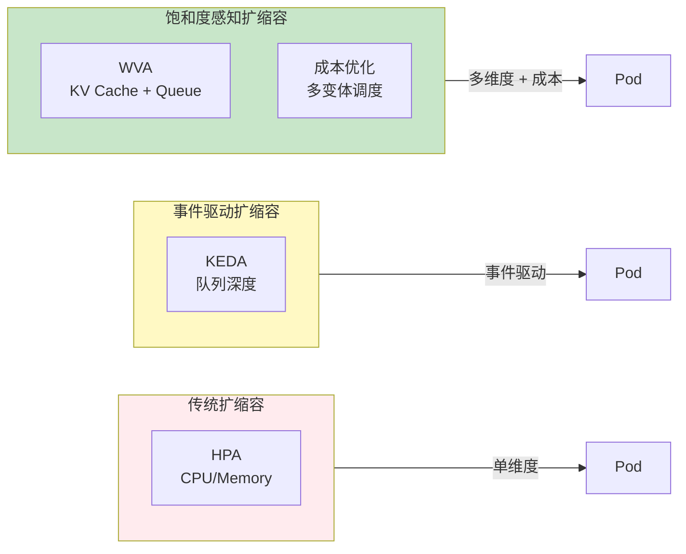
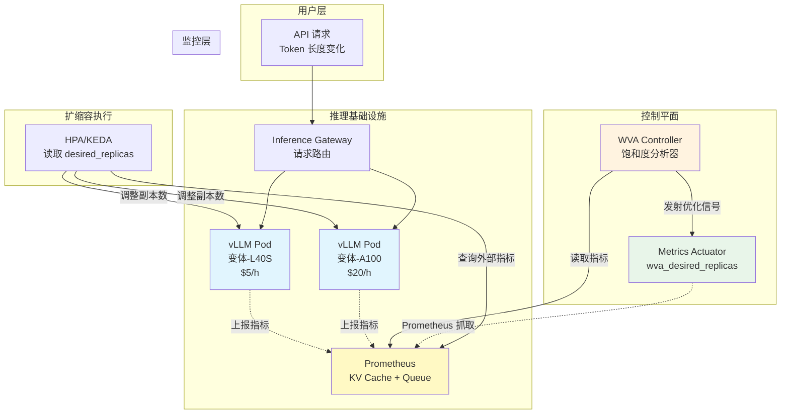
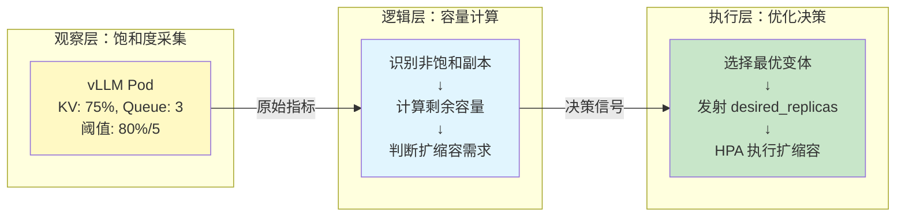
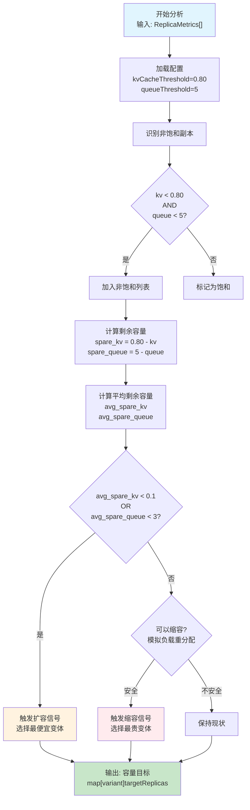
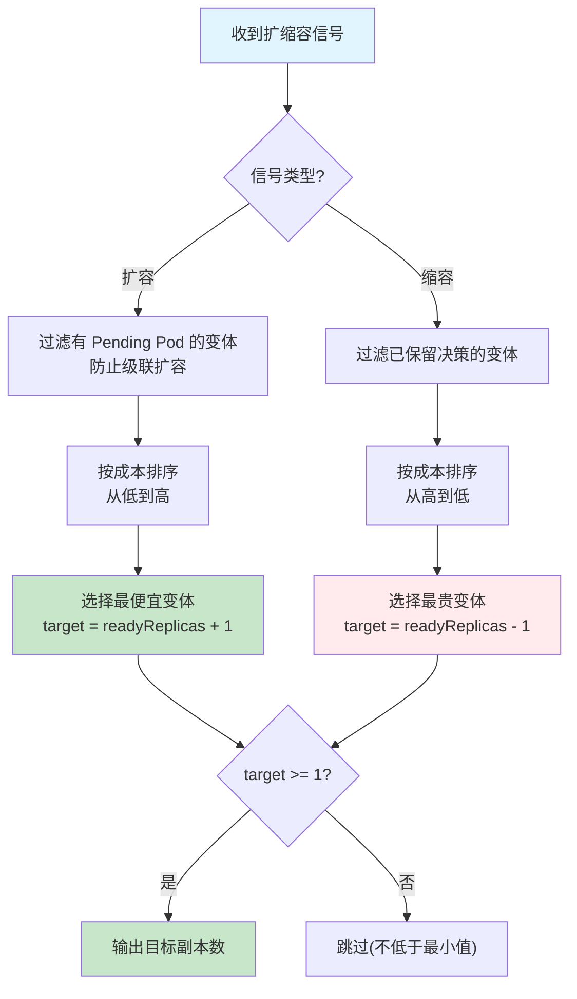
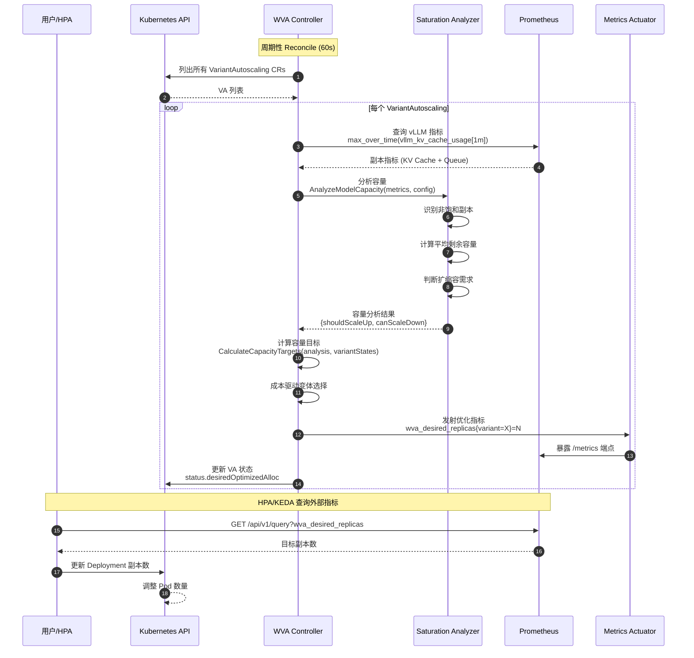
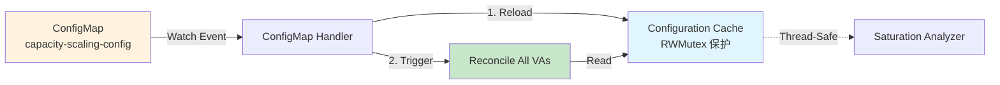
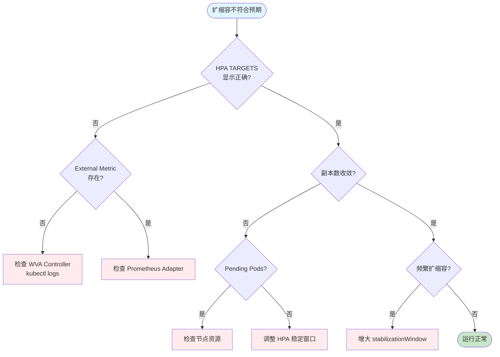

# Workload Variant Autoscaler (WVA) 深度解析：基于饱和度的 AI 推理服务智能扩缩容

> **目标受众**：一线工程师 & 架构师  
> **核心价值**：解决 AI 推理服务多维度容量瓶颈的自动扩缩容难题，实现成本与性能的最佳平衡  
> **技术范畴**：Kubernetes v1.19+、vLLM、Prometheus、External Metrics API、ConfigMap Watch

---

## 概念层 — 是什么 & 为什么

### 本层目标

建立对 WVA 的完整概念认知：理解饱和度感知扩缩容的业务必要性、WVA 在 Kubernetes 架构中的定位，以及与原生 HPA/KEDA 的差异。

**本层验收标准**：
- 能一句话复述 WVA 的核心价值
- 能区分 WVA 与 HPA/KEDA 的适用边界
- 能绘制 WVA 在 K8s 架构中的位置

---

### 1.1 业务痛点：AI 推理服务的扩缩容挑战

#### 痛点 1：负载异质性（Workload Variance）

**场景重现**：某 LLM 推理平台高峰期性能下降

```
用户请求分布：
├── 短请求 (10-100 tokens): 60% - "天气如何？"
├── 中请求 (100-1000 tokens): 30% - "解释量子计算"
└── 长请求 (1000-5000+ tokens): 10% - "总结这篇论文"

问题表现：
├── CPU 利用率：65% (正常)
├── 内存使用率：70% (正常)
├── KV Cache 使用率：92% (⚠️ 接近饱和)
├── 请求队列积压：15 个 (⚠️ 严重)
└── P99 延迟：8.5s (SLO: 2s) ❌

HPA 判断：无需扩容（CPU/内存未达阈值）❌
实际：请求大量排队，用户体验极差
```

**传统 HPA 的局限性**：

| 扩缩容依据 | 传统 HPA 监控 | AI 推理实际瓶颈 | 问题 |
|-----------|-------------|----------------|------|
| **触发指标** | CPU / 内存 | KV Cache + 队列长度 | 指标与实际瓶颈不匹配 |
| **决策粒度** | 单一 Deployment | 多变体全局优化 | 无法实现成本最优 |
| **扩容时机** | 资源使用率高时 | 饱和前主动扩容 | 被动响应导致延迟超标 |
| **负载类型** | 均匀负载假设 | Token 长度差异巨大 | 短请求饿死长请求 |

#### 痛点 2：多维度容量瓶颈

AI 推理服务的"饱和"不仅仅是 CPU 打满，还包括：

```
瓶颈层次金字塔：

        ┌─────────────────┐
        │   请求队列堆积   │ ← 用户最先感知（P99 延迟飙升）
        │   (Queue > 5)   │
        ├─────────────────┤
        │   KV Cache 耗尽  │ ← 推理引擎核心瓶颈
        │   (Usage > 80%) │
        ├─────────────────┤
        │   GPU 显存不足   │ ← 硬件资源层
        │   (OOM Risk)    │
        ├─────────────────┤
        │   CPU/内存正常   │ ← HPA 监控指标
        │   (65%/70%)     │
        └─────────────────┘
```

**根本原因**：
- vLLM 等推理引擎的 KV Cache 是核心资源，但 HPA 无法感知
- 不同模型（Llama-70B vs Granite-13B）对资源敏感度差异巨大
- Token 长度差异导致批处理效率不同

#### 痛点 3：成本优化需求

```
场景：同一模型部署在不同 GPU 上

变体 1：L40S  × 2 副本 = $10/h  （便宜，性能一般）
变体 2：A100  × 3 副本 = $60/h  （贵，性能好）
变体 3：H100  × 1 副本 = $40/h  （最贵，性能最佳）

当前总成本：$110/h

优化目标：
├── 扩容时优先选择 L40S（最便宜）
├── 缩容时优先下线 H100（最贵）
└── 在 SLA 达标前提下最小化成本
```

---

### 1.2 WVA 核心概念定义

#### Workload Variant Autoscaler (WVA)

**定义**：WVA 是 Kubernetes 上首个基于推理引擎饱和度的智能扩缩容控制器，专为 AI 推理场景设计。它通过实时采集 vLLM 的 KV Cache 使用率和请求队列长度，结合成本优化策略，实现多维度容量感知和多变体协同调度。

**核心职责**：
- 饱和度感知：监控 KV Cache + 队列长度（而非仅 CPU/内存）
- 成本优化：支持多变体部署，扩容选便宜、缩容选贵
- SLO 保障：以业务指标（TTFT/ITL）为目标，提前预测扩容
- 配置热更新：ConfigMap 变更无需重启 Pod

#### 核心术语表

| 术语 | 定义 | 示例 |
|------|------|------|
| **Variant** | 同一模型在不同 GPU 上的部署变体 | Llama-70B-L40S / Llama-70B-A100 |
| **Saturation** | 副本的容量饱和状态 | KV Cache > 80% 或队列 > 5 |
| **Spare Capacity** | 剩余容量，用于决策扩缩容 | 平均剩余 KV Cache 12.5% |
| **VariantAutoscaling** | WVA 的 CRD，定义扩缩容规则 | 包含模型 ID、变体列表、阈值 |
| **Metrics Actuator** | 将优化结果暴露为 Prometheus 指标 | `wva_desired_replicas` |

---

### 1.3 WVA 与传统扩缩容的本质区别



| 维度 | 传统 HPA | KEDA | WVA |
|------|----------|------|-----|
| **触发指标** | CPU/内存利用率 | 队列深度/事件源 | KV Cache + 队列长度 |
| **决策粒度** | 单一 Deployment | 单一 Deployment | 多变体全局优化 |
| **成本感知** | ❌ 无 | ❌ 无 | ✅ 价格差异驱动 |
| **容量预测** | 被动响应 | 被动响应 | 主动预测 |
| **配置更新** | 需重启 | 需重启 | 热更新 |
| **适用场景** | 通用 Web 服务 | 消息队列驱动 | AI 推理服务 |

---

### 1.4 架构全景图



**关键组件职责**：

| 组件 | 角色 | 核心能力 |
|------|------|----------|
| **WVA Controller** | 决策大脑 | 运行饱和度分析器，计算最优副本数 |
| **Saturation Analyzer** | 容量专家 | 识别非饱和副本，计算剩余容量 |
| **Metrics Actuator** | 信号发射器 | 将优化结果暴露为 Prometheus 指标 |
| **HPA/KEDA** | 执行者 | 读取 `wva_desired_replicas` 并调整 Deployment |
| **Prometheus** | 数据枢纽 | 采集 vLLM 指标 + 暴露 WVA 优化信号 |

**数据流向**：

```
┌──────────────┐     ┌──────────────┐     ┌─────────────┐
│   vLLM Pod   │────▶│ Prometheus   │────▶│   WVA       │
│(KV/Queue指标)│     │ (指标存储)    │     │ Controller  │
└──────────────┘     └──────────────┘     └──────┬──────┘
                                                  │
                                                  ▼
┌──────────────┐     ┌──────────────┐     ┌─────────────┐
│   HPA/KEDA   │◀────│ Metrics API  │◀────│   Metrics   │
│ (执行扩缩容)  │     │ (标准化指标)  │     │   Actuator  │
└──────┬───────┘     └──────────────┘     └─────────────┘
       │
       ▼
┌──────────────┐
│  Deployment  │
│ (变体副本数)  │
└──────────────┘
```

---

### 1.5 WVA 在 AI 推理场景的核心价值

#### 推理服务的特殊性

| 特性 | 通用 Web 服务 | AI 推理服务 | WVA 优势 |
|------|--------------|------------|----------|
| **瓶颈指标** | CPU/内存 | KV Cache/队列 | 多维度饱和度感知 |
| **负载模式** | 均匀分布 | Token 长度差异大 | 提前预测扩容 |
| **成本结构** | 线性 | GPU 价格差异大 | 多变体成本优化 |
| **扩容延迟** | 秒级 | 2-7 分钟（模型加载）| 提前触发机制 |
| **SLO 要求** | P99 < 500ms | TTFT < 100ms | SLO 驱动决策 |

#### WVA 的价值量化

```yaml
# 场景：Llama-70B 推理服务，混合负载

未启用 WVA (原生 HPA):
  固定副本: 8 Pod (L40S)
  低谷利用率: 30%
  高峰期: KV Cache 饱和，队列堆积
  日成本: $960 (8 × $5/h × 24h)
  P99 延迟: 3-8s (波动大)

启用 WVA:
  配置: L40S × 2-6 + A100 × 0-2 (动态)
  低谷副本: 2 Pod
  高峰期: 6 L40S + 2 A100
  平均副本: 5 Pod
  日成本: $600 (节省 37%)
  P99 延迟: < 500ms (稳定)
  
节省: 37% ($360/天)
年度节省: ~$131,000
用户体验: 延迟稳定，无饱和崩溃
```

---

### ✅ 概念层验收标准

完成本层后，应能回答：

1. **Why**：AI 推理服务为什么需要 WVA？（传统 HPA 无法感知 KV Cache 瓶颈，需要多维度饱和度感知）
2. **What**：WVA 是什么？（基于推理引擎饱和度和成本优化的智能扩缩容控制器）
3. **Where**：WVA 在 K8s 架构中的位置？（vLLM → Prometheus → WVA → Metrics Actuator → HPA → Deployment）
4. **边界**：WVA vs HPA vs KEDA 的适用边界？（资源指标 vs 事件驱动 vs 饱和度感知）

**一句话复述核心价值**：
> WVA 是通过实时监控 vLLM 的 KV Cache 使用率和请求队列长度，结合多变体成本优化策略，实现 AI 推理服务在 SLA 达标前提下的成本最优自动扩缩容。

---

## 💨 认知过渡：从概念到机制

### 过渡主线

> [!IMPORTANT]
> **目标**：在进入机制层的算法/源码前，先建立概念与机制之间的桥梁。

理解了 WVA 的 **What** 和 **Why** 后，核心问题浮现：

```
┌─────────────────────────────────────────────────────────────┐
│                     待解答的核心问题                          │
├─────────────────────────────────────────────────────────────┤
│  问题 1: WVA 如何计算"饱和度"和"剩余容量"？                   │
│     → 涉及 KV Cache 阈值、队列长度阈值、平均值计算            │
│                                                             │
│  问题 2: 为什么扩容选最便宜变体，缩容选最贵变体？              │
│     → 涉及成本排序算法和变体选择逻辑                          │
│                                                             │
│  问题 3: ConfigMap 变更如何立即生效而无需重启 Pod？           │
│     → 涉及 ConfigMap Watch 和配置热更新机制                   │
│                                                             │
│  问题 4: 如何防止 Pod 启动期间的级联扩容？                    │
│     → 涉及 Pending Pod 检测和级联防护机制                     │
└─────────────────────────────────────────────────────────────┘
```

### 认知过渡桥



**理解铺垫**：

> **为什么不能直接用 HPA 或 KEDA？**
> 因为 AI 推理服务的瓶颈是多维度的：
> - **HPA**：只能监控 CPU/内存，无法感知 KV Cache
> - **KEDA**：只能监听单一事件源，无法做全局成本优化
> - **WVA**：结合多维度饱和度和成本因素，实现最优决策

---

## 机制层 — 如何运作

### 本层目标

深入理解 WVA 的底层工作机制，包括饱和度分析算法、成本驱动的变体选择、ConfigMap 热更新机制，以及级联扩容防护。

**本层验收标准**：
- 能画出饱和度分析算法的完整流程图
- 能解释为什么扩容选最便宜、缩容选最贵
- 能说明 ConfigMap 热更新的实现原理
- 能计算给定场景下的期望副本数

---

### 2.0 逻辑概述

> [!TIP]
> **不要直接甩公式！** 先理解 WVA 的核心逻辑——它就像是一个"智能调度员"，既监控车辆的载重率（KV Cache），又看等待订单数（队列长度），还要考虑用车成本（GPU 价格），最后决定派几辆车、什么类型的车。

WVA 的核心逻辑可以概括为四步：
1. **采集**：从 Prometheus 获取 vLLM 指标（KV Cache、队列长度）
2. **分析**：识别非饱和副本，计算平均剩余容量
3. **决策**：判断扩缩容需求，选择最优变体
4. **执行**：发射优化指标，由 HPA/KEDA 执行扩缩容

---

### 2.1 核心算法：饱和度分析

#### 算法目标

从多个副本的实时指标中，判断是否需要扩缩容，并输出最优副本数。

#### 输入数据结构

```yaml
# 从 Prometheus 采集的副本指标
ReplicaMetrics:
  - podName: "llama-70b-pod-1"
    variantName: "llama-70b-l40s"
    kvCacheUsage: 0.75        # KV Cache 使用率 (0.0-1.0)
    queueLength: 3            # 等待队列长度
    cost: 5.0                 # 副本成本 ($5/小时)
  
  - podName: "llama-70b-pod-2"
    variantName: "llama-70b-a100"
    kvCacheUsage: 0.85
    queueLength: 6
    cost: 20.0
```

#### 算法流程图



#### 核心算法伪代码

**步骤 1：识别非饱和副本**

```python
def identify_non_saturated_replicas(metrics, config):
    non_saturated = []
    
    for replica in metrics:
        # 双重条件: KV Cache 和队列都未饱和
        if (replica.kvCacheUsage < config.kvCacheThreshold and 
            replica.queueLength < config.queueLengthThreshold):
            non_saturated.append(replica)
    
    return non_saturated
```

**步骤 2：计算平均剩余容量**

```python
def calculate_average_spare_capacity(non_saturated, config):
    total_spare_kv = 0
    total_spare_queue = 0
    
    for replica in non_saturated:
        # 每个副本的剩余容量
        spare_kv = config.kvCacheThreshold - replica.kvCacheUsage
        spare_queue = config.queueLengthThreshold - replica.queueLength
        
        total_spare_kv += spare_kv
        total_spare_queue += spare_queue
    
    N = len(non_saturated)
    avg_spare_kv = total_spare_kv / N
    avg_spare_queue = total_spare_queue / N
    
    return avg_spare_kv, avg_spare_queue

# 数值示例:
# 副本 A: spare_kv = 0.80 - 0.75 = 0.05, spare_queue = 5 - 3 = 2
# 副本 C: spare_kv = 0.80 - 0.60 = 0.20, spare_queue = 5 - 2 = 3
# avg_spare_kv = (0.05 + 0.20) / 2 = 0.125 (12.5%)
# avg_spare_queue = (2 + 3) / 2 = 2.5
```

**步骤 3：扩容决策**

```python
def should_scale_up(avg_spare_kv, avg_spare_queue, config):
    # 剩余容量低于触发阈值 → 扩容
    if (avg_spare_kv < config.kvSpareTrigger or 
        avg_spare_queue < config.queueSpareTrigger):
        return True
    return False

# 配置示例
config = {
    'kvSpareTrigger': 0.10,        # 剩余 KV Cache < 10% 触发
    'queueSpareTrigger': 3         # 剩余队列容量 < 3 触发
}

# 判断
if should_scale_up(0.125, 2.5, config):
    print("触发扩容")  # 2.5 < 3, 队列剩余容量不足
```

**步骤 4：缩容安全验证**

```python
def is_scale_down_safe(non_saturated, config):
    # 至少保留 2 个非饱和副本(安全底线)
    if len(non_saturated) < 2:
        return False
    
    # 模拟移除 1 个副本后,负载重新分配
    total_kv_load = sum(r.kvCacheUsage for r in non_saturated)
    total_queue_load = sum(r.queueLength for r in non_saturated)
    
    remaining_replicas = len(non_saturated) - 1
    avg_kv_after = total_kv_load / remaining_replicas
    avg_queue_after = total_queue_load / remaining_replicas
    
    # 计算分配后的剩余容量
    remaining_spare_kv = config.kvCacheThreshold - avg_kv_after
    remaining_spare_queue = config.queueLengthThreshold - avg_queue_after
    
    # 剩余容量仍满足触发阈值 → 安全
    if (remaining_spare_kv >= config.kvSpareTrigger and 
        remaining_spare_queue >= config.queueSpareTrigger):
        return True
    return False

# 数值示例:
# 当前: 3 个非饱和副本
# 模拟移除 1 个副本后，计算剩余副本是否仍能承载负载
# 如果剩余容量不足 → 缩容不安全
```

---

### 2.2 成本驱动的变体选择

#### 变体状态数据结构

```yaml
VariantReplicaState:
  - variantName: "llama-70b-l40s"
    cost: 5.0                      # 每副本成本
    currentReplicas: 2             # 当前实际副本数
    desiredReplicas: 2             # 上次优化的目标数
    readyReplicas: 2               # 已就绪副本数
    pendingReplicas: 0             # Pending 副本数
  
  - variantName: "llama-70b-a100"
    cost: 20.0
    currentReplicas: 4
    desiredReplicas: 4
    readyReplicas: 3               # 1 个 Pod 仍在启动中
    pendingReplicas: 1
```

#### 变体选择逻辑流程图



#### 核心逻辑伪代码

**扩容场景：选择最便宜变体**

```python
def calculate_scaleup_target(variants, capacity_analysis):
    # 过滤有 Pending Pods 的变体(防止级联扩容)
    eligible = [v for v in variants if v.pendingReplicas == 0]
    
    # 按成本排序，选择最便宜
    eligible.sort(key=lambda v: v.cost)
    cheapest = eligible[0]
    
    # 目标 = 已就绪副本数 + 1
    target = cheapest.readyReplicas + 1
    
    return {cheapest.variantName: target}
```

**缩容场景：选择最贵变体**

```python
def calculate_scaledown_target(variants, capacity_analysis):
    # 过滤已保留决策的变体
    eligible = [v for v in variants 
                if v.desiredReplicas == 0 or v.desiredReplicas == v.currentReplicas]
    
    # 按成本排序，选择最贵
    eligible.sort(key=lambda v: v.cost, reverse=True)
    most_expensive = eligible[0]
    
    # 目标 = 已就绪副本数 - 1(但不低于 1)
    target = max(1, most_expensive.readyReplicas - 1)
    
    return {most_expensive.variantName: target}
```

---

### 2.3 级联扩容防护机制

**问题场景**：

```
T+0s:  饱和检测 → 扩容 variant-1 从 2 → 3 (创建 1 个新 Pod)
T+30s: 新 Pod 仍在启动，未就绪 (readyReplicas=2, pendingReplicas=1)
       饱和仍存在(因为只有 2 个 ready) → 再次触发扩容? ❌
```

**WVA 解决方案**：

```python
# 跳过有 Pending Pods 的变体
if variant.pendingReplicas > 0:
    skip(variant)  # 等待 Pending Pod 就绪后再决策
```

**时间线对比**：

| 时间 | 无防护 | 有防护 |
|------|--------|--------|
| T+0s | 扩容至 3 | 扩容至 3 |
| T+30s | 再次扩容至 4(错误!) | 跳过(有 1 个 Pending) |
| T+60s | 再次扩容至 5(错误!) | 跳过 |
| T+90s | 5 个副本(过度配置) | 3 个副本就绪，评估是否需要继续扩 |

**Pod 启动时间**：2-7 分钟(容器启动 + 模型加载 + 健康检查)

---

### 2.4 事件驱动的 Reconciliation Loop

#### 完整时序图



#### 关键时序参数

| 参数 | 默认值 | 作用 | 调优建议 |
|------|--------|------|----------|
| **Reconcile 周期** | 60s | WVA 执行分析的频率 | 30-60s（平衡实时性和 API 压力）|
| **Prometheus 查询** | max_over_time[1m] | 使用峰值避免遗漏突发 | 保持默认 |
| **HPA sync period** | 15s | HPA 拉取指标频率 | 保持默认 |
| **scaleUp stabilization** | 180s | 扩容稳定窗口 | ≥ 2× Pod 启动时间 |
| **scaleDown stabilization** | 300s | 缩容稳定窗口 | ≥ 3× Pod 启动时间 |

---

### 2.5 配置热更新机制

#### 问题场景

修改饱和度阈值后，如何**立即生效**而无需重启 Pod？

#### 架构设计



#### ConfigMap 数据结构

```yaml
apiVersion: v1
kind: ConfigMap
metadata:
  name: capacity-scaling-config
  namespace: workload-variant-autoscaler-system
data:
  # 全局默认配置
  default: |
    kvCacheThreshold: 0.80
    queueLengthThreshold: 5
    kvSpareTrigger: 0.10
    queueSpareTrigger: 3
  
  # 按模型覆盖
  llama-70b-prod: |
    model_id: meta/llama-70b
    namespace: production
    kvCacheThreshold: 0.85      # 生产环境更激进
    kvSpareTrigger: 0.15
```

#### 配置热更新流程

**步骤 1：控制器启动时初始化缓存**

```python
def initialize_cache():
    config_map = k8s_client.read_config_map(
        name="capacity-scaling-config",
        namespace="workload-variant-autoscaler-system"
    )
    
    # 解析默认配置
    default_config = parse_yaml(config_map.data["default"])
    cache["default"] = default_config
    
    # 解析模型覆盖配置
    for key, value in config_map.data.items():
        if key != "default":
            override_config = parse_yaml(value)
            cache[key] = override_config
    
    log.info(f"缓存初始化完成, entries={len(cache)}")
```

**步骤 2：Watch ConfigMap 变更**

```python
def watch_configmap():
    watcher = k8s_client.watch_config_map(
        name="capacity-scaling-config",
        namespace="workload-variant-autoscaler-system"
    )
    
    for event in watcher:
        if event.type in ["ADDED", "MODIFIED"]:
            log.info("检测到 ConfigMap 变更,重新加载缓存")
            
            # 加写锁，更新缓存
            with cache_lock.write():
                reload_cache(event.object)
            
            # 触发所有 VariantAutoscaling 重新 Reconcile
            trigger_reconcile_all()
```

**步骤 3：Reconcile 读取缓存**

```python
def reconcile_variant_autoscaling(va):
    # 读取缓存(无 API 调用)
    with cache_lock.read():
        config = get_config_for_variant(
            cache, 
            model_id=va.spec.modelID,
            namespace=va.namespace
        )
    
    # 使用最新配置进行饱和度分析
    analysis = saturation_analyzer.analyze(metrics, config)
```

#### 性能对比

| 操作 | 无缓存(每次读 ConfigMap) | 有缓存 + Watch |
|------|--------------------------|----------------|
| **启动时** | N/A | 1 次 ConfigMap 读取 |
| **每次 Reconcile** | 1 次 API 调用 | 0 次(内存读取) |
| **配置更新** | 需重启 Pod | 立即生效(< 1s) |
| **并发访问** | 串行 API 调用 | 并发读(RWMutex) |

---

### 2.6 边缘情况处理

| 场景 | 行为 | 应对策略 |
|------|------|----------|
| **Prometheus 不可用** | 使用 fallback 配置或保持当前副本数 | 配置 fallback.replicas |
| **所有副本饱和** | 立即触发扩容（忽略稳定窗口） | 确保 maxReplicas 足够 |
| **指标值剧烈波动** | 使用 max_over_time[1m] 平滑 | 保持默认查询策略 |
| **变体成本相同** | 按 readyReplicas 排序（少的优先扩） | 确保成本配置准确 |
| **缩容后只剩 1 个副本** | 拒绝缩容（安全底线） | 检查 minReplicaCount |

---

### ✅ 机制层验收标准

完成本层后，应能：

1. **画出算法流程图**：饱和度分析的完整流程（识别非饱和 → 计算剩余容量 → 扩缩容判断）
2. **解释变体选择逻辑**：为什么扩容选最便宜、缩容选最贵
3. **说明热更新原理**：ConfigMap Watch → Reload Cache → Trigger Reconcile
4. **手动计算**：给定副本指标和阈值，判断是否需要扩缩容

**核心流程图**：
> 能画出：vLLM → Prometheus → WVA → Metrics Actuator → HPA → Deployment 的完整链路。

**衔接问题**：
> 生产环境如何配置饱和度阈值？如何排查指标不可用的问题？

---

## 实战层 — 如何驾驭

### 本层目标

掌握在生产环境中部署、运维和优化 WVA 的完整能力，包括从零搭建、故障排查、监控告警，以及成本与性能的极致权衡。

**本层验收标准**：
- 能独立编写生产级 VariantAutoscaling 配置
- 能按决策树排查常见故障
- 能配置 Prometheus 告警规则和 Grafana 面板
- 能根据业务特征选择合适的饱和度阈值

---

### 3.1 极致权衡：成本 vs 性能

#### 调优矩阵

| 优化目标 | 配置调整 | 成本影响 | 性能影响 |
|---------|---------|---------|---------|
| **最低成本** | kvCacheThreshold=0.90, 缩容激进 | 💰💰💰 最低 | ⚠️ 偶发延迟飙升 |
| **平衡模式** | kvCacheThreshold=0.80, 保守缩容 | 💰💰 中等 | ✅ 稳定 |
| **最佳性能** | kvCacheThreshold=0.70, 提前扩容 | 💰 最高 | 🚀 延迟最低 |

#### AI 推理场景调优建议

```yaml
# 成本优先（批处理任务）
costOptimized:
  kvCacheThreshold: 0.90
  queueLengthThreshold: 15
  kvSpareTrigger: 0.05
  cooldownPeriod: 60

# 性能优先（实时推理服务）
performanceOptimized:
  kvCacheThreshold: 0.70
  queueLengthThreshold: 3
  kvSpareTrigger: 0.20
  cooldownPeriod: 600

# 平衡模式（推荐）
balanced:
  kvCacheThreshold: 0.80
  queueLengthThreshold: 5
  kvSpareTrigger: 0.10
  cooldownPeriod: 300
```

---

### 3.2 反模式与避坑指南

#### ❌ 反模式清单

| 反模式 | 错误配置 | 危害 | 正确做法 |
|--------|---------|------|---------|
| **过度激进的阈值** | `kvCacheThreshold: 0.95` | OOM Kill，服务中断 | 从 0.80 开始逐步调优 |
| **忽略 Pod 启动时间** | `stabilizationWindowSeconds: 15` | 级联扩容，成本失控 | ≥ 2× Pod 启动时间 |
| **无 fallback** | 不配置 fallback | Prometheus 故障时无法扩缩容 | 配置 fallback.replicas |
| **禁用 TLS 验证** | `unsafeSsl: true`（生产） | 中间人攻击风险 | 配置 CA 证书 |
| **阈值不对齐** | WVA 和 EPP 阈值不一致 | 路由与扩缩容冲突 | 确保阈值相同 |
| **无监控** | 不监控饱和度指标 | 无法发现容量瓶颈 | 配置饱和度告警 |

#### 修正示例：过度激进的阈值

```yaml
# ❌ 错误：阈值太高
spec:
  config:
    kvCacheThreshold: 0.95
    kvSpareTrigger: 0.02

# ✅ 正确：从保守开始
spec:
  config:
    kvCacheThreshold: 0.80
    kvSpareTrigger: 0.10
```

---

### 3.3 从零搭建：生产级 WVA 部署

#### 前置条件检查

```bash
#!/bin/bash
# wva-prereq-check.sh - WVA 前置条件检查脚本

echo "=== WVA 前置条件检查 ==="

# 1. Kubernetes 版本要求 (>= 1.19)
echo -e "\n[1/4] Kubernetes 版本检查..."
SERVER_VERSION=$(kubectl version --json 2>/dev/null | jq -r '.serverVersion.gitVersion' | sed 's/v//')
REQUIRED_VERSION="1.19.0"
if [[ "$(printf '%s\n' "$REQUIRED_VERSION" "$SERVER_VERSION" | sort -V | head -n1)" = "$REQUIRED_VERSION" ]]; then
    echo "✅ Server Version: $SERVER_VERSION (满足 >= 1.19 要求)"
else
    echo "❌ Server Version: $SERVER_VERSION (需要 >= 1.19)"
    exit 1
fi

# 2. Prometheus 安装检查
echo -e "\n[2/4] Prometheus 检查..."
if kubectl get svc prometheus -n monitoring &>/dev/null; then
    echo "✅ Prometheus 已安装"
    kubectl get svc prometheus -n monitoring
else
    echo "❌ Prometheus 未安装"
    echo "安装参考: https://prometheus.io/docs/prometheus/latest/installation/"
fi

# 3. vLLM 指标检查
echo -e "\n[3/4] vLLM 指标检查..."
echo "提示: 确保 vLLM Pod 暴露了 /metrics 端点"
echo "检查命令: kubectl get pods -l app=vllm -o yaml | grep metrics"

# 4. External Metrics API 检查
echo -e "\n[4/4] External Metrics API 检查..."
if kubectl get apiservice v1beta1.external.metrics.k8s.io &>/dev/null; then
    echo "✅ External Metrics API 已注册"
else
    echo "❌ External Metrics API 未就绪"
    echo "需要安装 Prometheus Adapter 或 KEDA"
fi
```

#### 步骤 1：安装 WVA

```bash
# 使用 Helm 安装（推荐）
helm repo add wva https://llm-d-incubation.github.io/workload-variant-autoscaler
helm repo update
helm install workload-variant-autoscaler wva/workload-variant-autoscaler \
  --namespace workload-variant-autoscaler-system \
  --create-namespace \
  --set prometheus.url=https://prometheus.monitoring.svc:9090 \
  --set hpa.enabled=true \
  --set hpa.minReplicas=1 \
  --set hpa.maxReplicas=10

# 验证安装
kubectl wait --for=condition=ready pod \
  -l app=workload-variant-autoscaler-controller-manager \
  -n workload-variant-autoscaler-system \
  --timeout=300s
```

#### 步骤 2：配置 ConfigMap

```yaml
# capacity-scaling-config.yaml
apiVersion: v1
kind: ConfigMap
metadata:
  name: capacity-scaling-config
  namespace: workload-variant-autoscaler-system
data:
  default: |
    kvCacheThreshold: 0.80
    queueLengthThreshold: 5
    kvSpareTrigger: 0.10
    queueSpareTrigger: 3
  
  llama-70b-prod: |
    model_id: meta/llama-70b
    namespace: production
    kvCacheThreshold: 0.85
    kvSpareTrigger: 0.15
```

#### 步骤 3：创建 VariantAutoscaling

```yaml
# llama-70b-va.yaml
apiVersion: autoscaling.llm-d.io/v1alpha1
kind: VariantAutoscaling
metadata:
  name: llama-70b
  namespace: production
spec:
  modelID: meta/llama-70b
  scaleTargetRef:
    apiVersion: apps/v1
    kind: Deployment
    name: llama-70b-deployment
  
  variants:
    - name: llama-70b-l40s
      acceleratorType: L40S
      cost: 5.0
      minReplicas: 1
      maxReplicas: 6
    
    - name: llama-70b-a100
      acceleratorType: A100
      cost: 20.0
      minReplicas: 0
      maxReplicas: 2
  
  fallback:
    failureThreshold: 3
    replicas: 2
```

#### 步骤 4：配置 HPA

```yaml
# llama-70b-hpa.yaml
apiVersion: autoscaling/v2
kind: HorizontalPodAutoscaler
metadata:
  name: llama-70b-hpa
  namespace: production
spec:
  scaleTargetRef:
    apiVersion: apps/v1
    kind: Deployment
    name: llama-70b-deployment
  minReplicas: 1
  maxReplicas: 10
  
  behavior:
    scaleUp:
      stabilizationWindowSeconds: 180
      policies:
      - type: Pods
        value: 2
        periodSeconds: 60
    
    scaleDown:
      stabilizationWindowSeconds: 300
      policies:
      - type: Pods
        value: 1
        periodSeconds: 120
  
  metrics:
  - type: External
    external:
      metric:
        name: wva_desired_replicas
        selector:
          matchLabels:
            variant_name: llama-70b-deployment
      target:
        type: AverageValue
        averageValue: "1"
```

**生产配置建议表**：

| 参数 | 推荐值 | 场景说明 |
|------|--------|----------|
| `kvCacheThreshold` | 0.80 | 平衡性能和稳定性 |
| `kvSpareTrigger` | 0.10 | 剩余 10% 时触发扩容 |
| `scaleUp stabilization` | 180s | ≥ 2× Pod 启动时间 |
| `scaleDown stabilization` | 300s | 保守缩容 |
| `maxReplicas` | 峰值负载 / 单副本容量 × 1.5 | 预留余量 |

---

### 3.4 验证与测试

#### 查看 VariantAutoscaling 状态

```bash
# 基础状态
kubectl get variantautoscaling llama-70b -n production

# 详细状态（含优化结果）
kubectl describe variantautoscaling llama-70b -n production

# 查看 WVA 发射的指标
kubectl get --raw "/apis/external.metrics.k8s.io/v1beta1/namespaces/production/wva_desired_replicas" | jq
```

**输出解读**：

```
NAME        CURRENTREPLICAS   OPTIMIZED   AGE
llama-70b   2                 5           10m

# CURRENTREPLICAS: 当前实际副本数
# OPTIMIZED: WVA 计算的优化副本数
# HPA 会根据 OPTIMIZED 调整 Deployment
```

#### 模拟负载测试

```bash
# 1. 增加请求负载（向队列注入消息）
for i in {1..100}; do
  curl -X POST http://inference-gateway/v1/completions \
    -H "Content-Type: application/json" \
    -d '{"model": "llama-70b", "prompt": "Long prompt...", "max_tokens": 1000}'
done

# 2. 观察 WVA 决策
watch -n 5 kubectl get variantautoscaling llama-70b -n production

# 3. 观察 HPA 执行
watch -n 5 kubectl get hpa llama-70b-hpa -n production

# 4. 观察副本数变化
kubectl get deployment llama-70b-deployment -n production -w
```

---

### 3.5 故障排查决策树



#### 常见问题 Quick Fix

| 症状 | 根本原因 | 诊断命令 | 解决方案 |
|------|---------|---------|---------|
| `TARGETS: <unknown>` | WVA 未发射指标 | `kubectl logs wva-controller` | 检查 Prometheus 连接 |
| 副本数不收敛 | HPA 稳定窗口过长 | `kubectl describe hpa` | 调整 stabilizationWindow |
| Pending Pods | 节点资源不足 | `kubectl describe node` | 扩容节点或调整 requests |
| 频繁扩缩容 | 阈值设置过紧 | `kubectl get events` | 增大 spareTrigger |
| 配置不生效 | ConfigMap 未加载 | `kubectl logs wva-controller` | 检查 ConfigMap 格式 |
| 饱和未触发扩容 | 阈值设置过高 | `kubectl describe va` | 降低 kvCacheThreshold |

---

### 3.6 SRE 可观测性

#### SLI（服务水平指标）定义

| SLI | 指标来源 | PromQL 查询 | SLO 目标 | 告警阈值 |
|-----|---------|-------------|----------|----------|
| **饱和度** | vLLM | `avg(vllm:kv_cache_usage_perc)` | < 80% | > 90% |
| **队列长度** | vLLM | `max(vllm:num_requests_waiting)` | < 5 | > 10 |
| **副本一致性** | WVA | `abs(wva_desired - wva_current)` | = 0 | > 0 (10m) |
| **优化成功率** | WVA | `rate(wva_optimization_success[5m])` | > 99% | < 95% |
| **成本效率** | WVA | `sum(wva_current_replicas * cost)` | 预算内 | > 预算 120% |

#### Prometheus 告警规则

```yaml
# wva-alerts.yaml
apiVersion: monitoring.coreos.com/v1
kind: PrometheusRule
metadata:
  name: wva-alerts
  namespace: monitoring
spec:
  groups:
  - name: wva
    interval: 30s
    rules:
    
    # 告警 1：饱和度过高
    - alert: WVAHighSaturation
      expr: |
        avg by (variant_name) (vllm:kv_cache_usage_perc) > 0.90
      for: 5m
      labels:
        severity: warning
        team: sre
      annotations:
        summary: "{{ $labels.variant_name }} KV Cache 饱和度 > 90%"
        description: "当前值: {{ $value | humanizePercentage }}"
    
    # 告警 2：副本数不一致
    - alert: WVAReplicaMismatch
      expr: |
        abs(wva_desired_replicas - wva_current_replicas) > 0
      for: 10m
      labels:
        severity: critical
        team: sre
      annotations:
        summary: "{{ $labels.variant_name }} 副本数不一致超过 10 分钟"
    
    # 告警 3：队列堆积
    - alert: WVAQueueBacklog
      expr: |
        max by (variant_name) (vllm:num_requests_waiting) > 10
      for: 3m
      labels:
        severity: warning
        team: sre
      annotations:
        summary: "{{ $labels.variant_name }} 请求队列堆积"
        description: "当前队列长度: {{ $value }}"
    
    # 告警 4：优化失败
    - alert: WVAOptimizationFailed
      expr: |
        rate(wva_optimization_success_total[5m]) < 0.95
      for: 5m
      labels:
        severity: critical
        team: sre
      annotations:
        summary: "WVA 优化成功率 < 95%"
        description: "可能是 Prometheus 不可达或配置错误"
```

#### 健康看板关键指标

```json
{
  "dashboard": {
    "title": "WVA 监控面板",
    "panels": [
      {
        "title": "饱和度趋势",
        "targets": [
          {
            "expr": "avg by (variant_name) (vllm:kv_cache_usage_perc)",
            "legendFormat": "{{ variant_name }}"
          }
        ]
      },
      {
        "title": "副本数对比",
        "targets": [
          {
            "expr": "wva_current_replicas",
            "legendFormat": "当前副本"
          },
          {
            "expr": "wva_desired_replicas",
            "legendFormat": "期望副本"
          }
        ]
      },
      {
        "title": "队列深度",
        "targets": [
          {
            "expr": "max by (variant_name) (vllm:num_requests_waiting)",
            "legendFormat": "{{ variant_name }}"
          }
        ]
      }
    ]
  }
}
```

---

### 3.7 生产环境 Checklist

```markdown
## WVA 生产部署检查清单

### 前置条件
- [ ] Kubernetes 版本 >= 1.19
- [ ] Prometheus 已安装且可访问
- [ ] External Metrics API 已注册
- [ ] vLLM Pod 暴露了 /metrics 端点

### WVA 配置
- [ ] ConfigMap 配置了合理的饱和度阈值
- [ ] VariantAutoscaling 定义了多个变体
- [ ] 每个变体配置了正确的 cost
- [ ] 配置了 fallback（防止 Prometheus 故障）

### HPA 配置
- [ ] 引用了正确的 wva_desired_replicas 指标
- [ ] stabilizationWindowSeconds >= 180s
- [ ] scaleDown 窗口比 scaleUp 更长
- [ ] maxReplicas 留有足够余量

### 监控告警
- [ ] 配置了饱和度 > 90% 告警
- [ ] 配置了副本数不一致告警
- [ ] 配置了队列堆积告警
- [ ] Grafana 面板可查看饱和度和副本数

### 高可用保障
- [ ] WVA Controller 多副本部署
- [ ] 测试过 ConfigMap 热更新
- [ ] 测试过 Prometheus 故障时的 fallback
- [ ] 验证了扩缩容速度满足 SLA
```

---

### ✅ 实战层验收标准

完成本层后，应能：

1. **独立部署**：从零搭建包含 WVA + ConfigMap + VariantAutoscaling + HPA 的完整环境
2. **故障排查**：遇到问题时按决策树定位（WVA? HPA? Prometheus?）
3. **监控配置**：编写 Prometheus 告警规则，部署 Grafana 面板
4. **参数调优**：根据成本/性能需求调整饱和度阈值和 HPA 窗口
5. **反模式识别**：识别过度激进、无 fallback、无监控等常见错误

**排障能力验证**：
> 能独立排障：当 WVA 告警触发时，执行决策树中的排查步骤。

---

## 🧠 元知识总结

### 大规模瓶颈与调优

| 规模 | 瓶颈点 | 优化方向 |
|------|--------|----------|
| **< 10 变体** | 无显著瓶颈 | 标准配置即可 |
| **10-50 变体** | Prometheus 查询压力 | 增加 Prometheus 副本 |
| **50-100 变体** | WVA Reconcile 延迟 | 调整 reconcile 周期至 120s |
| **> 100 变体** | API Server 压力 | 启用 API Priority & Fairness |

### 核心洞察

**一句话 Takeaway**：
> WVA 是专为 AI 推理服务设计的多维度饱和度感知扩缩容控制器，它通过监控 KV Cache 和队列长度（而非仅 CPU），结合多变体成本优化策略，实现 SLA 达标前提下的成本最优。

**关键决策原则**：
1. **先稳后快**：缩容保守永远比激进更安全
2. **阈值对齐**：WVA 和 EPP 的饱和度阈值必须一致
3. **观测先行**：没有监控的 WVA 是盲飞的飞机
4. **渐进调优**：从保守阈值开始，逐步优化到平衡

---

## 📚 延伸阅读

### 官方文档

1. [WVA GitHub Repository](https://github.com/llm-d-incubation/workload-variant-autoscaler)
2. [Saturation Analyzer 详细文档](https://github.com/llm-d-incubation/workload-variant-autoscaler/blob/main/docs/saturation-analyzer.md)
3. [HPA 集成指南](https://github.com/llm-d-incubation/workload-variant-autoscaler/blob/main/docs/integrations/hpa-integration.md)
4. [KEDA 集成指南](https://github.com/llm-d-incubation/workload-variant-autoscaler/blob/main/docs/integrations/keda-integration.md)

### 进阶主题

- **多模型混合部署**：不同模型共享 GPU 节点的资源协调
- **与 Cluster Autoscaler 联动**：WVA 触发节点扩容和预热策略
- **自定义饱和度指标**：接入自定义 Prometheus 指标扩展分析器
- **FinOps 优化**：基于实时价格的动态成本优化

### 相关工具

- [vLLM](https://github.com/vllm-project/vllm) - 高性能 LLM 推理引擎
- [Prometheus](https://prometheus.io/) - 指标采集和存储
- [KEDA](https://keda.sh/) - 事件驱动自动扩缩容
- [Grafana](https://grafana.com/) - 可视化监控面板

### 参考规范

- 图表规范：[sre-tech-sharing/references/chart-guidelines.md](../../.config/opencode/skills/sre-tech-sharing/references/chart-guidelines.md)
- 代码片段：[sre-tech-sharing/references/mermaid-patterns.md](../../.config/opencode/skills/sre-tech-sharing/references/mermaid-patterns.md)
- 模板参考：[sre-tech-sharing/references/spiral-templates.md](../../.config/opencode/skills/sre-tech-sharing/references/spiral-templates.md)

---

## 总结与展望

### 核心知识回顾

| 层级 | 核心内容 | 关键技术点 |
|------|----------|------------|
| **概念层** | 概念与价值 | 负载异质性痛点、WVA 架构定位、与传统扩缩容对比 |
| **机制层** | 机制与算法 | 饱和度分析算法、成本驱动变体选择、配置热更新 |
| **实战层** | 实战与运维 | 生产配置、故障排查、监控告警、成本性能权衡 |

### 核心公式

```
扩容触发: avg_spare_kv < kvSpareTrigger OR avg_spare_queue < queueSpareTrigger

其中:
- avg_spare_kv = Σ(kvCacheThreshold - kv_usage_i) / N_non_saturated
- avg_spare_queue = Σ(queueThreshold - queue_length_i) / N_non_saturated
```

### 下一步学习路径

1. **多模型协同调度**：多个模型共享 GPU 集群的资源分配策略
2. **预测性扩缩容**：基于历史流量的机器学习预测
3. **混合云成本优化**：跨云厂商的 GPU 价格感知调度
4. **AIOps 集成**：异常检测与自动阈值调整

---

*文档版本：v2.0 | 最后更新：2025年2月 | 遵循 [sre-tech-sharing](https://github.com/opencode/sre-tech-sharing) 规范编写*
