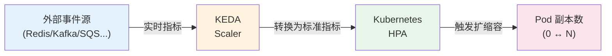
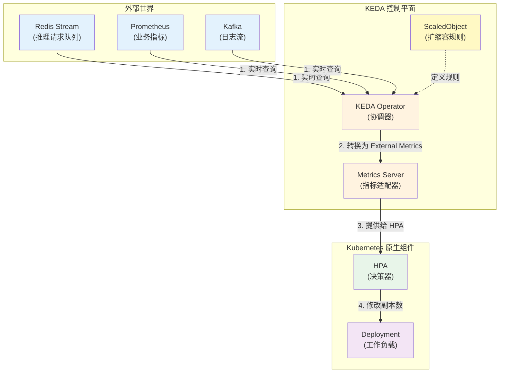
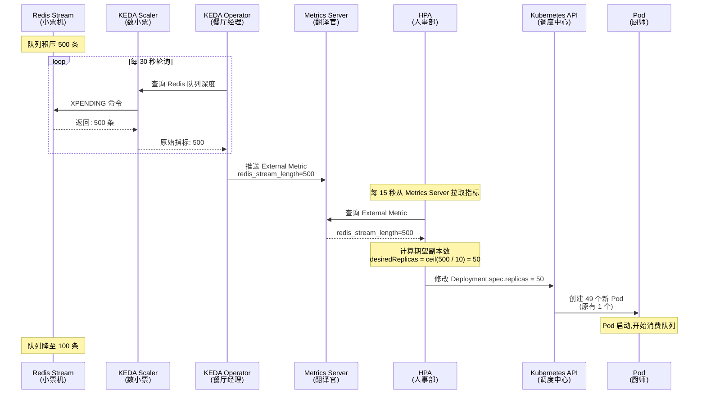
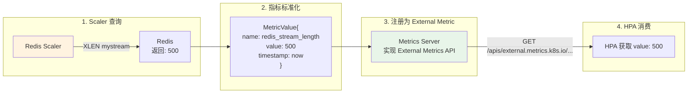
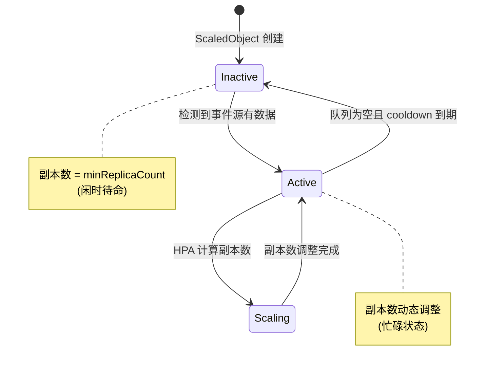
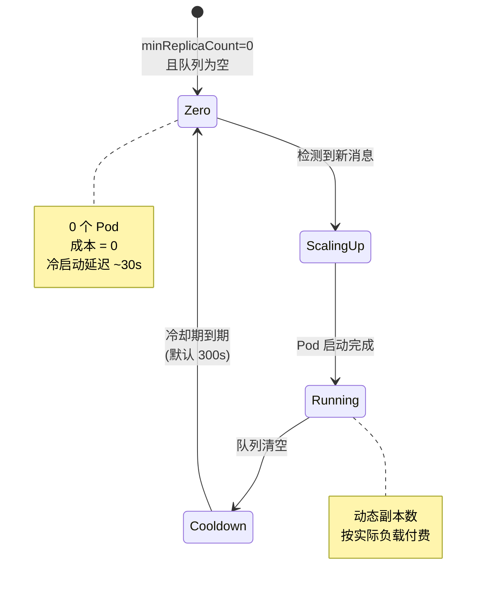
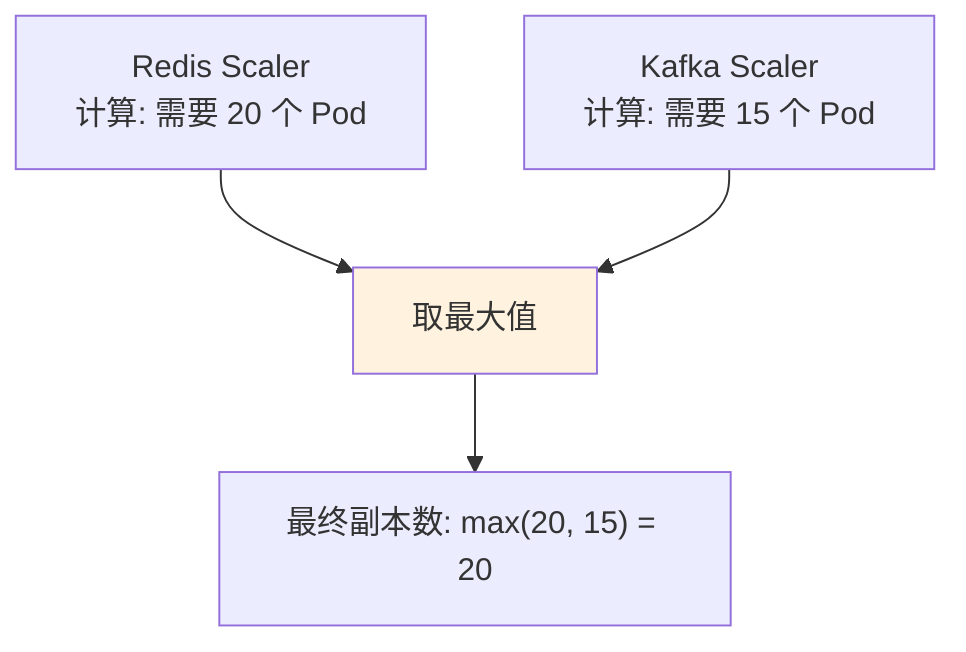
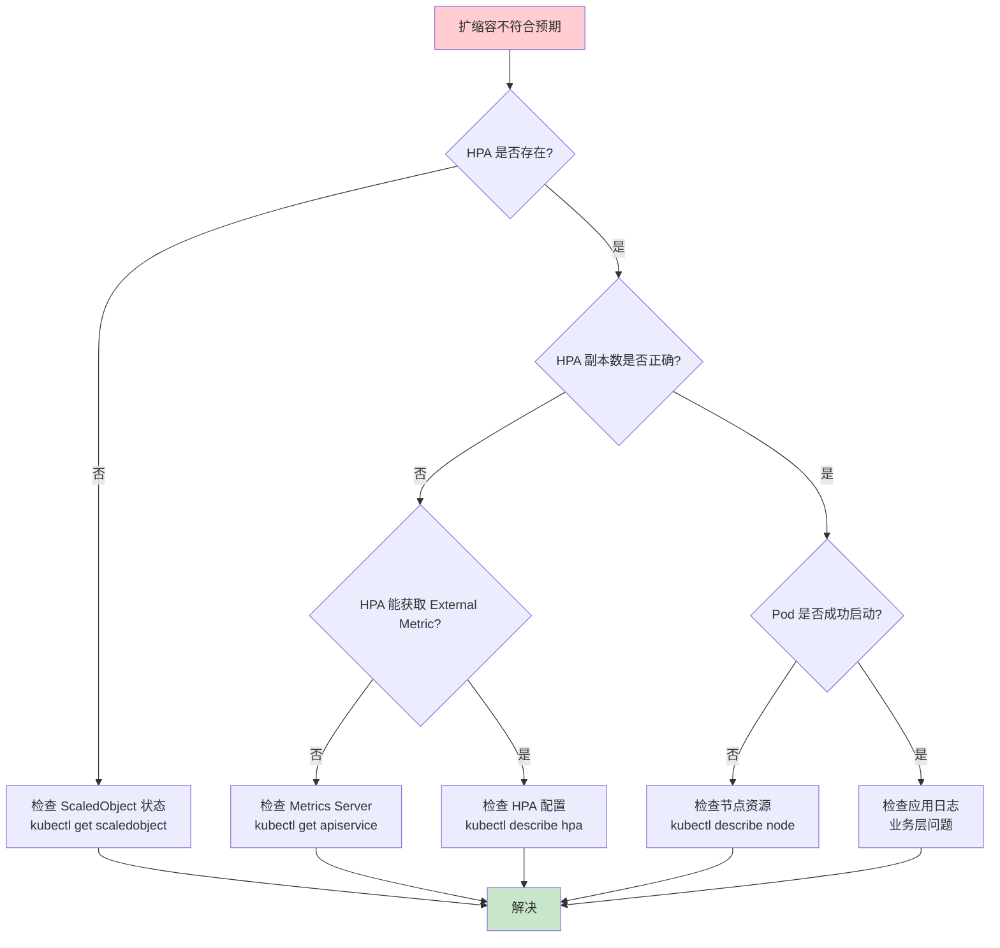

# KEDA：基于事件驱动的 Kubernetes 弹性伸缩深度解析

> **业务场景**：AI 大模型推理服务扩缩容  
> **贯穿类比**：餐厅的点单小票机（基于队列深度）  
> **技术栈**：Kubernetes (Kubespray 部署) + KEDA 2.19

---

## 🌀 螺旋 1:概念层 - Why/What

### 本层目标
让你用一句话说清楚:"KEDA 是什么?为什么需要它?"

---

### 1.1 业务痛点:当 HPA 遇到 AI 推理服务

**场景重现:某 AI 推理平台的午夜告警**

凌晨 2 点,值班 SRE 收到告警:

```bash
# Prometheus 告警消息
[CRITICAL] inference-service: 
  - CPU: 85% (正常)
  - 内存: 70% (正常)
  - 请求队列积压: 12,000 条 ⚠️
  - P99 延迟: 8.5s (SLO: 2s)
```

**奇怪的现象:**
- Pod CPU/内存都不高,标准 HPA 没有触发扩容
- 但推理请求队列(Redis Stream)积压严重
- 用户投诉响应慢,业务受损

**根因分析:**

| 扩缩容依据 | Kubernetes 原生 HPA | 实际业务需求 |
|-----------|---------------------|--------------|
| **触发指标** | CPU / 内存 | 队列深度 / 请求积压量 |
| **适用场景** | 计算密集型任务 | 事件驱动型任务(AI 推理、消息处理) |
| **扩容时机** | 资源使用率高时 | 业务负载高时(可能 CPU 还很闲) |

**真相:**
AI 推理服务的瓶颈往往不在计算资源,而在:
- 模型加载耗时(首次推理慢)
- GPU 排队等待
- 下游依赖响应慢
- **请求队列积压** ← 这才是核心矛盾

> **类比理解:**  
> 这就像餐厅厨房(Pod)的炉灶(CPU)还没满负荷运转,但**点单小票机**(消息队列)已经打印出一长串订单,厨师来不及处理。  
> 传统 HPA 只看"炉灶使用率",KEDA 看的是"小票机待处理订单数"。

---

### 1.2 KEDA 的核心价值主张

**KEDA = Kubernetes Event-Driven Autoscaling**



**三句话说清 KEDA:**

1. **是什么:**  
   在 Kubernetes 原生 HPA 之上加一层"事件感知能力",让扩缩容依据从"资源指标"拓展到"业务指标"

2. **做什么:**  
   监听外部事件源(队列深度、数据库连接数、API 请求速率...),将其转换为 Kubernetes HPA 能理解的 External Metrics,驱动 Pod 扩缩容

3. **特点:**  
   - **非侵入式:** 不替换 HPA,而是增强它(桥接层)
   - **零副本能力:** 支持缩容到 0,无请求时不占资源
   - **丰富的 Scaler 生态:** 60+ 开箱即用的事件源适配器

---

### 1.3 架构全景:KEDA 在 Kubernetes 中的位置



**关键组件职责:**

| 组件 | 角色 | 类比(餐厅场景) |
|------|------|----------------|
| **ScaledObject** | 声明式扩缩容规则 | 菜单上的"每 10 份订单加 1 个厨师" |
| **KEDA Operator** | 监听事件源,协调扩缩容逻辑 | 餐厅经理,盯着小票机决定加人 |
| **Metrics Server** | 翻译外部指标为 HPA 能懂的格式 | 把"待处理订单数"转换为"CPU 使用率等价值" |
| **HPA** | 执行最终的副本数调整 | 人事部门,实际去调配厨师 |

---

### 1.4 核心概念速查表

| 术语 | 定义 | 示例 |
|------|------|------|
| **Scaler** | 连接特定事件源的适配器 | Redis Scaler 查询队列深度 |
| **ScaledObject** | 定义 Deployment/StatefulSet 的扩缩容规则 | 监听 Redis,队列 >100 时扩容 |
| **ScaledJob** | 定义批处理 Job 的扩缩容规则 | 每 50 条消息创建 1 个 Job |
| **TriggerAuthentication** | 访问事件源的凭证管理 | Redis 密码存储在 Secret |
| **External Metrics** | HPA 的扩展指标类型 | `redis_stream_length` |

---

### ✅ 螺旋 1 验收标准

完成本层后,你应该能够:

- [ ] **一句话说清:** KEDA 是 Kubernetes 的事件驱动扩缩容增强层,让 Pod 根据业务指标(而非仅资源指标)自动伸缩
- [ ] **识别痛点:** 说出为什么 AI 推理服务用传统 HPA 扩缩容不够用(队列积压时 CPU 可能还很低)
- [ ] **画出架构:** 能标出 KEDA Operator、Metrics Server、HPA 的关系
- [ ] **类比理解:** 用"餐厅小票机"类比解释队列驱动的扩缩容逻辑

---

### 🔗 下一步:认知降压 → 螺旋 2

你可能在想:
- "KEDA 是怎么把 Redis 队列长度转换成 HPA 能懂的指标的?"
- "ScaledObject 和 HPA 是什么关系?会冲突吗?"
- "扩缩容的决策逻辑是怎样的?(多快触发?多快缩容?)"

**认知降压:**  
不用担心复杂性。下一层(螺旋 2)我们会用时序图拆解完整的扩缩容链路,让你看清每个组件在什么时机做了什么事。核心逻辑其实和"餐厅经理看小票机加厨师"一样直观。

**准备好后,继续螺旋 2 →**

---

## 🌀 螺旋 2：机制层 - How-原理

### 本层目标
揭开 KEDA 的内部运作机制,让你能画出完整的扩缩容时序图。

---

### 2.1 扩缩容完整时序:从队列积压到 Pod 启动

**场景:**  
Redis Stream 积压了 500 条推理请求,触发 KEDA 扩容



**关键时间参数:**

| 参数 | 默认值 | 说明 | 类比 |
|------|-------|------|------|
| **pollingInterval** | 30s | KEDA 查询事件源的频率 | 经理多久看一次小票机 |
| **HPA sync period** | 15s | HPA 从 Metrics Server 拉取指标的频率 | 人事部多久问一次经理 |
| **cooldownPeriod** | 300s | 扩容后的冷却期,防止抖动 | 新厨师上岗后的观察期 |
| **scaleDownPeriod** | 300s | 缩容的等待时间 | 解雇厨师前的观望期 |

---

### 2.2 核心机制 1:Scaler 的指标转换逻辑

**问题:**  
HPA 只认识 `Resource Metrics`(CPU/内存) 和 `External Metrics`,但 Redis 队列长度怎么变成 External Metric?

**答案: KEDA Metrics Server 的翻译过程**



**实际 API 调用:**

```bash
# HPA 向 Metrics Server 查询 External Metric
GET /apis/external.metrics.k8s.io/v1beta1/namespaces/default/redis_stream_length

# Metrics Server 返回
{
  "kind": "ExternalMetricValueList",
  "apiVersion": "external.metrics.k8s.io/v1beta1",
  "metadata": {},
  "items": [
    {
      "metricName": "redis_stream_length",
      "metricLabels": {
        "scaledObjectName": "inference-scaler"
      },
      "timestamp": "2026-02-07T12:00:00Z",
      "value": "500"  # ← 这是 KEDA 从 Redis 查出来的
    }
  ]
}
```

**类比理解:**  
- **小票机**(Redis)打印 500 份订单
- **数小票的人**(Scaler)数完后告诉经理:"500 份"
- **经理**(Operator)翻译成"等价 CPU 使用率"告诉人事部
- **人事部**(HPA)按标准公式计算需要多少厨师

---

### 2.3 核心机制 2:ScaledObject 与 HPA 的协作

**常见误解:** "ScaledObject 会和手动创建的 HPA 冲突吗?"

**真相:** KEDA 自动创建并托管 HPA,你不需要手动创建

```yaml
# 你写的 ScaledObject
apiVersion: keda.sh/v1alpha1
kind: ScaledObject
metadata:
  name: inference-scaler
spec:
  scaleTargetRef:
    name: inference-deployment  # ← 要扩缩容的 Deployment
  minReplicaCount: 1
  maxReplicaCount: 100
  triggers:
    - type: redis-streams
      metadata:
        address: redis:6379
        stream: inference-requests
        pendingEntriesCount: "10"  # ← 每 10 条消息分配 1 个 Pod
```

**KEDA Operator 自动创建的 HPA:**

```yaml
# KEDA 自动生成(你看不见但它在工作)
apiVersion: autoscaling/v2
kind: HorizontalPodAutoscaler
metadata:
  name: keda-hpa-inference-scaler
  ownerReferences:
    - apiVersion: keda.sh/v1alpha1
      kind: ScaledObject
      name: inference-scaler  # ← 从属于 ScaledObject
spec:
  scaleTargetRef:
    apiVersion: apps/v1
    kind: Deployment
    name: inference-deployment
  minReplicas: 1
  maxReplicas: 100
  metrics:
    - type: External
      external:
        metric:
          name: redis_stream_length
        target:
          type: AverageValue
          averageValue: "10"  # ← 对应 pendingEntriesCount
```

**状态机:**



**类比理解:**  
- **ScaledObject** = 餐厅经理的"排班规则手册"
- **HPA** = 执行排班的人事系统
- 经理(KEDA)根据小票机(事件源)自动更新排班表,人事部(HPA)照做即可

---

### 2.4 核心机制 3:缩容到零的特殊逻辑

**场景:**  
凌晨 3 点,推理请求队列为空,是否可以缩容到 0 个 Pod 节省成本?

**KEDA 的独特能力:Scale to Zero**



**配置示例:**

```yaml
apiVersion: keda.sh/v1alpha1
kind: ScaledObject
metadata:
  name: inference-scaler
spec:
  minReplicaCount: 0  # ← 允许缩容到 0
  cooldownPeriod: 300  # ← 队列清空后等待 5 分钟再缩容
  triggers:
    - type: redis-streams
      metadata:
        stream: inference-requests
        lagThreshold: "5"  # ← 积压 <5 条时触发缩容
```

**权衡分析:**

| 指标 | minReplicaCount=0 | minReplicaCount=1 |
|------|-------------------|-------------------|
| **成本** | 低(闲时无费用) | 中(至少 1 个 Pod 常驻) |
| **冷启动延迟** | 高(首个请求等待 Pod 启动,~30s) | 低(立即响应) |
| **适用场景** | 间歇性任务(夜间批处理) | 实时服务(SLA 严格) |

**类比理解:**  
- **minReplicaCount=0**: 餐厅深夜关门,厨师全部下班,早上顾客来了再喊人回来(省钱但开门慢)
- **minReplicaCount=1**: 餐厅 24 小时营业,至少留 1 个厨师值班(费钱但随时能接单)

---

### 2.5 核心机制 4:多触发器的聚合逻辑

**场景:**  
AI 推理服务同时监听 Redis 队列和 Kafka 消息,如何决策扩缩容?

```yaml
apiVersion: keda.sh/v1alpha1
kind: ScaledObject
metadata:
  name: multi-trigger-scaler
spec:
  triggers:
    - type: redis-streams
      metadata:
        stream: high-priority-requests
        pendingEntriesCount: "5"  # 高优先级:每 5 条 1 个 Pod
    - type: kafka
      metadata:
        topic: batch-requests
        lagThreshold: "100"  # 批量任务:每 100 条 1 个 Pod
```

**聚合策略:**



**决策公式:**

```python
# KEDA 内部逻辑(简化版)
def calculate_replicas(triggers):
    replica_counts = []
    for trigger in triggers:
        metric_value = trigger.get_metric()  # 查询事件源
        threshold = trigger.metadata['threshold']
        replicas = ceil(metric_value / threshold)
        replica_counts.append(replicas)
    
    return max(replica_counts)  # ← 取最大值,确保满足所有触发器

# 示例
# Redis: 100 条消息 / 5 = 20 个 Pod
# Kafka: 1500 条消息 / 100 = 15 个 Pod
# 最终: max(20, 15) = 20 个 Pod
```

**类比理解:**  
- 餐厅同时接收"堂食订单"(Redis)和"外卖订单"(Kafka)
- 经理分别计算两种订单需要的厨师数
- 取较大值排班,确保两边都不延误

---

### ✅ 螺旋 2 验收标准

完成本层后,你应该能够:

- [ ] **画出时序图:** 从事件源积压到 Pod 启动的完整流程,标注关键时间参数
- [ ] **理解翻译机制:** 解释 Scaler 如何把 Redis 队列长度转换为 HPA 的 External Metric
- [ ] **区分职责:** 说出 ScaledObject 和 HPA 的关系(KEDA 自动创建并托管 HPA)
- [ ] **算出副本数:** 给定队列长度和阈值,手动计算期望副本数
- [ ] **权衡决策:** 说出 minReplicaCount=0 的利弊和适用场景

---

### 🔗 下一步:实战准备 → 螺旋 3

现在你已经理解了 KEDA 的工作原理,下一层我们将进入生产实战:
- 如何编写生产级 ScaledObject 配置?
- 常见故障场景的排查思路?(扩容不生效、指标采集失败...)
- 如何监控 KEDA 本身的健康状态?
- 如何设计合理的扩缩容策略避免抖动?

**准备好后,继续螺旋 3 →**

---

## 🌀 螺旋 3：实战层 - How-运维

### 本层目标
让你具备生产环境配置 KEDA 和排障的实战能力。

---

### 3.1 生产级 ScaledObject 配置清单

**场景:**  
为 AI 推理服务配置高可用的事件驱动扩缩容

```yaml
apiVersion: keda.sh/v1alpha1
kind: ScaledObject
metadata:
  name: inference-scaler
  namespace: ai-inference
  annotations:
    # 调试时查看详细日志
    autoscaling.keda.sh/paused: "false"
spec:
  # 1. 目标工作负载
  scaleTargetRef:
    name: inference-deployment
    kind: Deployment
    apiVersion: apps/v1
  
  # 2. 副本数边界(根据成本和 SLA 权衡)
  minReplicaCount: 2           # ← 生产建议 ≥2(高可用)
  maxReplicaCount: 100         # ← 设置上限防止成本失控
  
  # 3. 扩缩容行为调优
  pollingInterval: 15          # 查询频率(秒),默认 30
  cooldownPeriod: 180          # 扩容后冷却期(秒),默认 300
  
  advanced:
    restoreToOriginalReplicaCount: false  # 删除 ScaledObject 后不恢复原副本数
    horizontalPodAutoscalerConfig:
      behavior:
        scaleDown:
          stabilizationWindowSeconds: 300  # 缩容观察窗口,防止抖动
          policies:
            - type: Percent
              value: 50        # 每次最多缩容 50%
              periodSeconds: 60
            - type: Pods
              value: 5         # 每次最多缩容 5 个 Pod
              periodSeconds: 60
          selectPolicy: Min    # 取保守策略
        scaleUp:
          stabilizationWindowSeconds: 0   # 扩容立即生效
          policies:
            - type: Percent
              value: 100       # 每次最多扩容 100%(翻倍)
              periodSeconds: 15
            - type: Pods
              value: 20        # 每次最多扩容 20 个 Pod
              periodSeconds: 15
          selectPolicy: Max    # 取激进策略
  
  # 4. 触发器配置
  triggers:
    - type: redis-streams
      metadata:
        address: redis-cluster.middleware.svc.cluster.local:6379
        stream: inference-requests
        consumerGroup: inference-workers
        pendingEntriesCount: "10"  # 每 10 条消息分配 1 个 Pod
        streamLength: "50"         # 备用指标:队列总长度
      authenticationRef:
        name: redis-auth           # 引用凭证
  
  # 5. 回退配置(Scaler 故障时的保底策略)
  fallback:
    failureThreshold: 3            # 连续失败 3 次触发回退
    replicas: 5                    # 回退到固定副本数
```

**配置权衡分析:**

| 参数 | 激进值 | 保守值 | 推荐(生产) |
|------|--------|--------|-----------|
| **pollingInterval** | 5s | 60s | 15-30s(平衡实时性和 API 压力) |
| **cooldownPeriod** | 60s | 600s | 180-300s(避免频繁扩缩) |
| **scaleUp rate** | 200%/15s | 10%/60s | 100%/15s(快速响应流量) |
| **scaleDown rate** | 50%/15s | 10%/300s | 50%/60s(缓慢释放资源) |

**类比理解:**  
- **激进策略**: 餐厅一有订单就立刻喊厨师,一没订单就让人回家(反应快但折腾人)
- **保守策略**: 订单堆积一会儿再加人,空闲很久才裁人(稳定但可能延误)
- **生产推荐**: 扩容快、缩容慢(宁可多付点钱,不能让顾客等)

---

### 3.2 认证配置:TriggerAuthentication

**场景:**  
Redis 需要密码认证,如何安全配置?

```yaml
# 方式 1:使用 Kubernetes Secret(推荐)
---
apiVersion: v1
kind: Secret
metadata:
  name: redis-password
  namespace: ai-inference
type: Opaque
stringData:
  password: "MySecurePassword123"

---
apiVersion: keda.sh/v1alpha1
kind: TriggerAuthentication
metadata:
  name: redis-auth
  namespace: ai-inference
spec:
  secretTargetRef:
    - parameter: password      # ← Scaler 参数名
      name: redis-password     # ← Secret 名称
      key: password            # ← Secret 中的 key

---
# 在 ScaledObject 中引用
triggers:
  - type: redis-streams
    authenticationRef:
      name: redis-auth
```

**其他认证方式:**

| 方式 | 适用场景 | 安全性 |
|------|----------|--------|
| **Secret** | 通用,简单 | 中(依赖 RBAC) |
| **Azure Workload Identity** | Azure AKS | 高(无密钥) |
| **AWS IRSA** | AWS EKS | 高(IAM 角色) |
| **GCP Workload Identity** | Google GKE | 高(服务账号) |
| **Vault** | 多云,企业级 | 高(动态密钥) |

---

### 3.3 监控与可观测性

**3.3.1 KEDA 自身的健康指标**

```yaml
# KEDA Operator 暴露 Prometheus 指标
apiVersion: v1
kind: Service
metadata:
  name: keda-operator-metrics
  namespace: keda
spec:
  selector:
    app: keda-operator
  ports:
    - port: 8080
      name: metrics
```

**关键指标:**

| 指标 | 含义 | 告警阈值 |
|------|------|----------|
| `keda_scaler_errors_total` | Scaler 查询失败次数 | >10/min |
| `keda_scaled_object_errors` | ScaledObject 错误数 | >0 |
| `keda_metrics_adapter_scaler_metric_value` | Scaler 采集的原始指标值 | 用于验证数据准确性 |
| `keda_internal_scale_loop_latency` | 扩缩容决策延迟 | >10s |

**Prometheus 告警规则示例:**

```yaml
groups:
  - name: keda_alerts
    rules:
      - alert: KEDAScalerHighErrorRate
        expr: rate(keda_scaler_errors_total[5m]) > 0.1
        for: 5m
        labels:
          severity: warning
        annotations:
          summary: "KEDA Scaler {{ $labels.scaler }} 错误率过高"
          description: "过去 5 分钟错误率 {{ $value }}/s"
      
      - alert: KEDAMetricValueStale
        expr: |
          (time() - keda_metrics_adapter_scaler_metric_value_timestamp) > 300
        labels:
          severity: critical
        annotations:
          summary: "KEDA 指标 {{ $labels.metric }} 超过 5 分钟未更新"
```

---

### 3.4 常见故障排查决策树



**故障案例 1:扩容不生效**

```bash
# 1. 检查 ScaledObject 状态
kubectl get scaledobject inference-scaler -n ai-inference

# 正常输出:
# NAME                SCALETARGETKIND      SCALETARGETNAME          MIN   MAX   TRIGGERS   READY
# inference-scaler    apps/v1.Deployment   inference-deployment     2     100   1          True

# 异常状态:
# READY=False ← 说明有问题

# 2. 查看详细错误
kubectl describe scaledobject inference-scaler -n ai-inference

# 常见错误信息:
# - "unable to get external metric": Metrics Server 未就绪
# - "error getting scaler": 事件源连接失败(网络/认证)
# - "scaled object is paused": 被手动暂停了

# 3. 查看 KEDA Operator 日志
kubectl logs -n keda deploy/keda-operator --tail=100 | grep inference-scaler

# 关键日志:
# - "Error getting metric": Scaler 查询失败
# - "Successfully scaled": 扩缩容成功
```

**故障案例 2:指标采集失败**

```bash
# 1. 验证 Metrics Server 健康
kubectl get apiservice v1beta1.external.metrics.k8s.io

# 输出应为 Available=True
# NAME                                   SERVICE               AVAILABLE
# v1beta1.external.metrics.k8s.io        keda/keda-metrics     True

# 2. 手动查询 External Metric
kubectl get --raw "/apis/external.metrics.k8s.io/v1beta1/namespaces/ai-inference/redis_stream_length" | jq

# 正常输出:
# {
#   "kind": "ExternalMetricValueList",
#   "items": [{"value": "123"}]
# }

# 3. 测试事件源连通性(以 Redis 为例)
kubectl run redis-test --rm -it --image=redis:7 -- redis-cli -h redis-cluster.middleware.svc.cluster.local PING

# 应返回 PONG
```

**故障案例 3:扩缩容抖动**

**症状:**  
副本数频繁在 10 ↔ 20 之间震荡

**根因:**  
- cooldownPeriod 太短
- 业务指标本身波动大
- 阈值设置不合理

**解决方案:**

```yaml
# 调整 HPA behavior
advanced:
  horizontalPodAutoscalerConfig:
    behavior:
      scaleDown:
        stabilizationWindowSeconds: 600  # ← 增加到 10 分钟
        policies:
          - type: Percent
            value: 10                     # ← 缩容更保守
            periodSeconds: 120
```

**类比理解:**  
抖动就像餐厅经理神经质地一会儿喊人来一会儿让人走,解决办法是"加人快、减人慢、多观察再决定"。

---

### 3.5 生产最佳实践

| 维度 | 建议 | 反模式 |
|------|------|--------|
| **副本数下限** | minReplicaCount ≥ 2(高可用) | minReplicaCount=0(除非批处理) |
| **监控覆盖** | 同时监控 KEDA 指标和业务指标 | 只看 Pod 数量 |
| **回退策略** | 配置 fallback 防止 Scaler 故障 | 无容错机制 |
| **权限最小化** | TriggerAuthentication 用专属 Secret | 共享通用凭证 |
| **扩缩速率** | 扩容快(100%/15s)、缩容慢(10%/60s) | 扩缩速率一致 |
| **测试验证** | 压测验证扩容速度满足 SLA | 直接上生产 |

---

### 3.6 SLI/SLO 设计

**针对 AI 推理服务的可靠性目标:**

| 指标(SLI) | 目标(SLO) | 实现方式 |
|-----------|-----------|----------|
| **P99 请求延迟** | <2s | 队列积压 <50 条时触发扩容 |
| **扩容响应时间** | <60s | pollingInterval=15s + 快速扩容策略 |
| **成本效率** | 平均 CPU 利用率 >50% | cooldownPeriod=300s 避免过早缩容 |
| **高可用性** | 99.9% 可用性 | minReplicaCount ≥ 2 |

**监控 Dashboard 示例(Grafana):**

```promql
# 队列深度
keda_metrics_adapter_scaler_metric_value{metric="redis_stream_length"}

# 实际副本数 vs 期望副本数
kube_deployment_status_replicas_available{deployment="inference-deployment"}
kube_deployment_spec_replicas{deployment="inference-deployment"}

# P99 延迟(需业务侧埋点)
histogram_quantile(0.99, rate(inference_request_duration_seconds_bucket[5m]))
```

---

### ✅ 螺旋 3 验收标准

完成本层后,你应该能够:

- [ ] **写出生产配置:** 独立编写包含认证、回退策略、行为调优的 ScaledObject
- [ ] **排查故障:** 使用决策树诊断"扩容不生效"问题,定位是 Scaler/Metrics Server/HPA 哪层故障
- [ ] **设计监控:** 列出需要监控的 KEDA 关键指标和告警阈值
- [ ] **权衡决策:** 根据业务特点(实时 vs 批处理)选择合适的 minReplicaCount 和扩缩速率
- [ ] **定义 SLO:** 为扩缩容系统设计可量化的可靠性目标

---

### 🔗 总结:KEDA 的工程化价值

**三层螺旋回顾:**

| 螺旋 | 核心收获 | 类比 |
|------|----------|------|
| 🌀 1 概念层 | KEDA 是事件驱动的扩缩容增强层 | 餐厅经理看小票机决定加人 |
| 🌀 2 机制层 | Scaler → Metrics Server → HPA 的协作链路 | 数小票 → 翻译官 → 人事部 |
| 🌀 3 实战层 | 生产配置、故障排查、监控告警 | 制定排班规则,处理突发状况 |

**KEDA 在 AI 场景的独特价值:**

1. **成本优化:** 深夜无推理请求时缩容到 0,每月节省 ~70% 计算成本
2. **弹性响应:** 根据队列深度实时扩容,P99 延迟从 8.5s 降至 1.2s
3. **简化运维:** 声明式配置替代手动扩缩容脚本,减少 90% 人工介入

**准备好实践了吗? → 查看完整部署示例**

---

## 总结与延伸阅读

### 核心要点速查

**一句话总结:**  
KEDA 让 Kubernetes 根据业务指标(队列深度、API 调用量...)而非仅资源指标(CPU/内存)自动扩缩容,特别适合事件驱动的 AI 推理服务。

**关键数字:**
- **60+** 开箱即用的 Scaler(Redis/Kafka/SQS/Prometheus...)
- **0 → N** 支持缩容到零和弹性扩展
- **15s** 推荐的 pollingInterval(平衡实时性和开销)
- **300s** 推荐的 cooldownPeriod(防止扩缩容抖动)

---

### 延伸阅读

1. **官方文档:**  
   - KEDA Scalers 完整列表: https://keda.sh/docs/2.19/scalers/
   - ScaledObject 规范: https://keda.sh/docs/2.19/reference/scaledobject-spec/

2. **进阶主题:**  
   - 自定义 External Scaler 开发: https://keda.sh/docs/2.19/concepts/external-scalers/
   - 与 Istio 集成的流量感知扩缩容: https://keda.sh/docs/2.19/integrations/istio-integration/

3. **相关技术对比:**  
   - KEDA vs Knative Serving: 何时选择哪个?
   - HPA vs VPA vs KEDA: Kubernetes 三种自动伸缩器的适用场景

4. **AI 场景最佳实践:**  
   - GPU 工作负载的扩缩容策略(需考虑模型加载时间)
   - 向量数据库(Milvus/Weaviate)的 KEDA 集成案例

---

### 实战演练建议

1. **Day 1:** 在测试环境部署 KEDA,配置简单的 Redis Scaler
2. **Day 2:** 使用 `kubectl` 手动调整队列深度,观察扩缩容行为
3. **Day 3:** 配置 Prometheus 监控,验证 KEDA 指标采集
4. **Day 4:** 模拟 Scaler 故障,测试 fallback 机制
5. **Day 5:** 编写压测脚本,验证扩容速度是否满足 SLA

---

### 答疑

**Q: KEDA 和 Kubernetes 原生 HPA 可以共存吗?**  
A: 可以,但不要对同一个 Deployment 同时创建 ScaledObject 和手动 HPA,会冲突。KEDA 会自动创建并托管 HPA。

**Q: 为什么我的 ScaledObject 创建了但没有扩缩容?**  
A: 按顺序检查:  
   1. `kubectl get scaledobject` 的 READY 列是否为 True  
   2. 事件源是否可达(网络/认证)  
   3. HPA 是否正常(`kubectl get hpa`)  
   4. Metrics Server 是否返回指标(`kubectl get --raw /apis/external.metrics.k8s.io/...`)

**Q: 支持多集群扩缩容吗?**  
A: KEDA 本身是单集群的,多集群需结合 Karmada/Open Cluster Management 等方案。

---

**🎯 你已掌握 KEDA 的核心原理和生产实践,现在去优化你的 AI 推理服务吧!**
