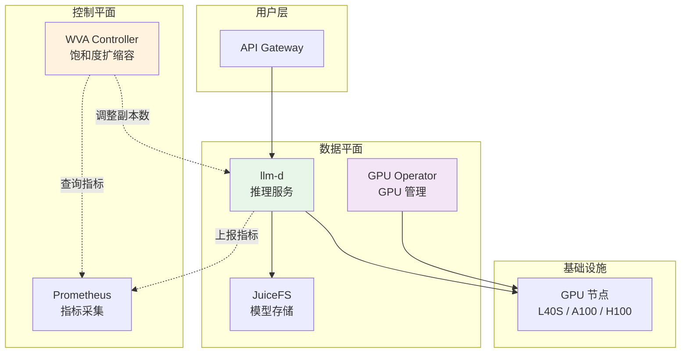

# AI 推理平台技术栈

> llm-d + WVA + GPU Operator + JuiceFS + Prometheus

---

## 架构全景



---

## 组件职责

| 组件 | 职责 | 核心能力 |
|------|------|---------|
| **llm-d** | 大模型推理引擎 | vLLM/TGI 支持、模型管理 |
| **WVA** | 饱和度感知扩缩容 | KV Cache 监控、成本优化 |
| **GPU Operator** | GPU 资源管理 | 驱动安装、资源分配 |
| **JuiceFS** | 模型文件存储 | POSIX 兼容、跨云共享 |
| **Prometheus** | 指标采集 | 推理延迟、队列深度 |

---

## 快速部署

### 前置条件
- GPU 节点(NVIDIA GPU)
- Kubernetes 集群(v1.19+)
- 对象存储(MinIO/S3)

### 步骤 1: 部署 GPU Operator

```bash
helm repo add nvidia https://helm.ngc.nvidia.com/nvidia
helm install gpu-operator nvidia/gpu-operator \
  --namespace gpu-operator \
  --create-namespace
```

验证:
```bash
kubectl get nodes -o json | jq '.items[].status.allocatable | select(.["nvidia.com/gpu"] != null)'
```

### 步骤 2: 部署 JuiceFS

```bash
# 1. 创建 JuiceFS 元数据引擎(Redis)
helm install redis bitnami/redis --set auth.password=<password>

# 2. 格式化 JuiceFS
juicefs format \
  --storage minio \
  --bucket http://minio:9000/models \
  --access-key <key> \
  --secret-key <secret> \
  redis://:password@redis:6379/1 \
  llm-models

# 3. 部署 CSI Driver
kubectl apply -f https://raw.githubusercontent.com/juicedata/juicefs-csi-driver/master/deploy/k8s.yaml
```

### 步骤 3: 部署 Prometheus

```bash
helm install prometheus prometheus-community/kube-prometheus-stack \
  --namespace monitoring \
  --create-namespace
```

### 步骤 4: 部署 llm-d

```bash
# 创建 PVC(使用 JuiceFS)
kubectl apply -f - <<EOF
apiVersion: v1
kind: PersistentVolumeClaim
metadata:
  name: llm-models
spec:
  accessModes:
    - ReadWriteMany
  storageClassName: juicefs-sc
  resources:
    requests:
      storage: 100Gi
EOF

# 部署推理服务
kubectl apply -f llm-deployment.yaml
```

### 步骤 5: 部署 WVA

```bash
helm install workload-variant-autoscaler ./charts/wva \
  --namespace wva-system \
  --create-namespace \
  --set prometheus.url=http://prometheus:9090
```

---

## 生产配置示例

### llm-d Deployment

```yaml
apiVersion: apps/v1
kind: Deployment
metadata:
  name: llama-70b
spec:
  replicas: 2
  template:
    spec:
      containers:
      - name: vllm
        image: vllm/vllm-openai:latest
        env:
        - name: MODEL_NAME
          value: meta-llama/Llama-2-70b-chat-hf
        resources:
          requests:
            nvidia.com/gpu: 4
          limits:
            nvidia.com/gpu: 4
        volumeMounts:
        - name: models
          mountPath: /models
      volumes:
      - name: models
        persistentVolumeClaim:
          claimName: llm-models
```

### WVA ScaledObject

```yaml
apiVersion: wva.llm-d.io/v1alpha1
kind: VariantAutoscaling
metadata:
  name: llama-70b
spec:
  modelID: meta-llama/Llama-2-70b-chat-hf
  variants:
  - name: llama-70b-l40s
    acceleratorType: L40S
    cost: 5.0
    scaleTargetRef:
      name: llama-70b-l40s-deployment
  - name: llama-70b-a100
    acceleratorType: A100
    cost: 20.0
    scaleTargetRef:
      name: llama-70b-a100-deployment
```

### 饱和度配置

```yaml
apiVersion: v1
kind: ConfigMap
metadata:
  name: capacity-scaling-config
  namespace: wva-system
data:
  default: |
    kvCacheThreshold: 0.80
    queueLengthThreshold: 5
    kvSpareTrigger: 0.10
    queueSpareTrigger: 3
```

---

## 成本优化策略

### 多 GPU 变体配置

| 变体 | GPU 型号 | 成本($/小时) | 适用场景 |
|------|---------|-------------|---------|
| **llama-70b-l40s** | L40S × 4 | $5 | 日常流量,成本优先 |
| **llama-70b-a100** | A100 × 4 | $20 | 高峰流量,性能优先 |
| **llama-70b-h100** | H100 × 4 | $40 | 极致性能 |

### 扩缩容策略

```yaml
# WVA 自动选择:
# 扩容时 → 优先选择 L40S(最便宜)
# 缩容时 → 优先下线 H100(最贵)
```

**效果**:
- ✅ 成本降低 40-60%
- ✅ SLO 保障(P99 < 500ms)
- ✅ 自动响应流量波动

---

## 监控指标

### 推理服务指标

```promql
# KV Cache 使用率
vllm:kv_cache_usage_perc{model_id="llama-70b"}

# 请求队列长度
vllm:num_requests_waiting{model_id="llama-70b"}

# P99 延迟
histogram_quantile(0.99, rate(vllm_request_duration_seconds_bucket[5m]))

# GPU 利用率
DCGM_FI_DEV_GPU_UTIL{gpu="0"}
```

### Grafana 面板

推荐导入:
- **NVIDIA DCGM Exporter** (ID: 12239) - GPU 监控
- **vLLM Dashboard** (社区面板) - 推理服务指标

---

## 故障排查

### 问题 1: GPU 不可用

```bash
# 检查 GPU Operator
kubectl get pods -n gpu-operator

# 检查 GPU 驱动
kubectl exec -it <pod> -- nvidia-smi
```

### 问题 2: 模型加载失败

```bash
# 检查 JuiceFS 挂载
kubectl exec -it <pod> -- ls /models

# 查看 CSI Driver 日志
kubectl logs -n kube-system -l app=juicefs-csi-node
```

### 问题 3: WVA 扩容不生效

```bash
# 检查 WVA 状态
kubectl get variantautoscaling -n production

# 查看 WVA 日志
kubectl logs -n wva-system deployment/wva-controller
```

---

## 相关技术文档

- [llm-d](../ai-ml/) - 推理平台
- [WVA](../autoscaling/wva/) - 饱和度扩缩容
- [GPU Operator](../hardware/) - GPU 管理
- [JuiceFS](../storage/) - 模型存储
- [Prometheus](../monitoring/) - 指标采集
