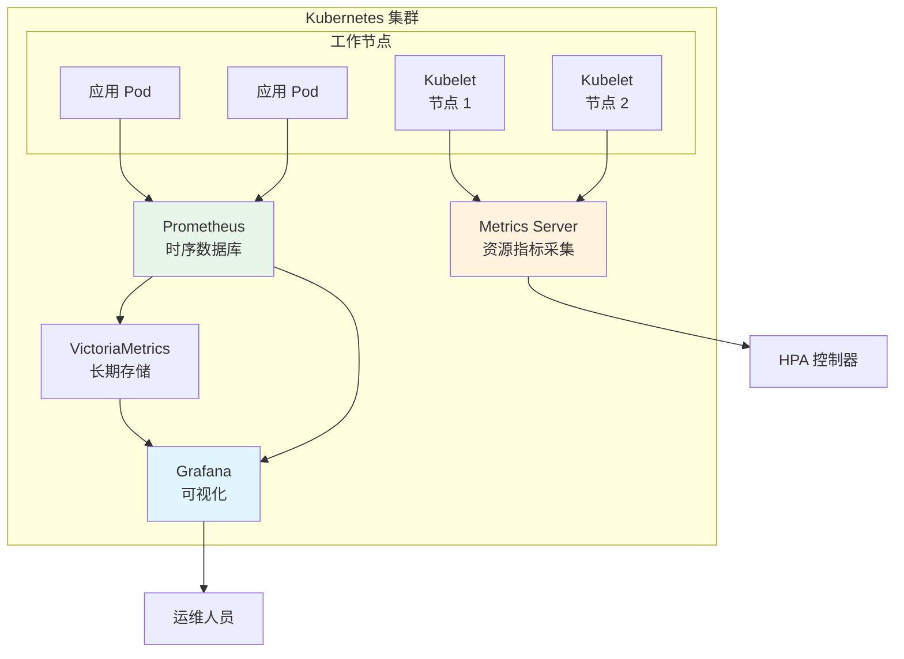

# 监控观测技术栈

> Prometheus + Grafana + VictoriaMetrics + Metrics Server

---

## 架构全景



---

## 组件职责

| 组件 | 职责 | 数据保留 | 资源占用 |
|------|------|---------|---------|
| **Metrics Server** | Kubernetes 资源指标(CPU/内存) | 1-2 分钟 | 轻量级 |
| **Prometheus** | 应用和集群监控指标 | 15 天(默认) | 中等 |
| **VictoriaMetrics** | 长期存储和查询优化 | 6-12 个月 | 高效 |
| **Grafana** | 可视化和告警 | 不存储数据 | 轻量级 |

---

## 快速部署

### 前置条件
- Kubernetes 集群(v1.19+)
- Helm 3.x

### 步骤 1: 部署 Metrics Server

```bash
kubectl apply -f https://github.com/kubernetes-sigs/metrics-server/releases/latest/download/components.yaml
```

### 步骤 2: 部署 Prometheus

```bash
helm repo add prometheus-community https://prometheus-community.github.io/helm-charts
helm install prometheus prometheus-community/kube-prometheus-stack \
  --namespace monitoring \
  --create-namespace \
  --set prometheus.prometheusSpec.retention=15d
```

### 步骤 3: 部署 VictoriaMetrics (可选)

```bash
helm repo add vm https://victoriametrics.github.io/helm-charts
helm install victoria-metrics vm/victoria-metrics-single \
  --namespace monitoring \
  --set server.retentionPeriod=12
```

### 步骤 4: 配置 Grafana

Grafana 已随 kube-prometheus-stack 安装,访问:

```bash
kubectl port-forward -n monitoring svc/prometheus-grafana 3000:80
```

默认用户名: `admin`, 密码:

```bash
kubectl get secret -n monitoring prometheus-grafana -o jsonpath="{.data.admin-password}" | base64 -d
```

---

## 生产配置建议

### Prometheus 配置

```yaml
# values.yaml
prometheus:
  prometheusSpec:
    retention: 15d
    retentionSize: 50GB
    resources:
      requests:
        cpu: 2000m
        memory: 8Gi
      limits:
        cpu: 4000m
        memory: 16Gi
    storageSpec:
      volumeClaimTemplate:
        spec:
          accessModes: ["ReadWriteOnce"]
          resources:
            requests:
              storage: 100Gi
```

### VictoriaMetrics 远程写入

```yaml
# Prometheus 远程写入到 VictoriaMetrics
prometheus:
  prometheusSpec:
    remoteWrite:
      - url: http://victoria-metrics:8428/api/v1/write
        queueConfig:
          maxSamplesPerSend: 10000
```

---

## 监控指标规划

### 资源层指标 (Metrics Server)
- 节点 CPU/内存使用率
- Pod 资源消耗
- 容器重启次数

### 应用层指标 (Prometheus)
- HTTP 请求速率、延迟、错误率
- 业务指标(订单数、支付成功率)
- 自定义指标(队列深度、缓存命中率)

### 集群层指标 (kube-state-metrics)
- Deployment/StatefulSet 状态
- PVC 使用情况
- 集群资源配额

---

## Grafana 推荐面板

### 官方面板
- **Node Exporter Full** (ID: 1860) - 节点详细指标
- **Kubernetes Cluster** (ID: 7249) - 集群全景
- **Kubernetes Pod Overview** (ID: 6417) - Pod 资源监控

### 导入面板

```bash
# 通过 Grafana UI 导入
Dashboard → Import → 输入面板 ID → Load
```

---

## 告警规则示例

```yaml
apiVersion: monitoring.coreos.com/v1
kind: PrometheusRule
metadata:
  name: cluster-alerts
  namespace: monitoring
spec:
  groups:
  - name: cluster
    rules:
    - alert: HighCPUUsage
      expr: node_cpu_seconds_total{mode="idle"} < 0.2
      for: 5m
      labels:
        severity: warning
      annotations:
        summary: "节点 {{ $labels.instance }} CPU 使用率过高"
    
    - alert: PodCrashLooping
      expr: rate(kube_pod_container_status_restarts_total[15m]) > 0
      for: 5m
      labels:
        severity: critical
      annotations:
        summary: "Pod {{ $labels.namespace }}/{{ $labels.pod }} 频繁重启"
```

---

## 相关技术文档

- [Metrics Server](../monitoring/) - 资源指标采集
- [Prometheus](../monitoring/) - 监控系统
- [Grafana](../monitoring/) - 可视化平台
- [VictoriaMetrics](../monitoring/) - 时序数据库
- [HPA](../autoscaling/hpa/) - 依赖 Metrics Server
- [KEDA](../autoscaling/keda/) - 可使用 Prometheus 指标
